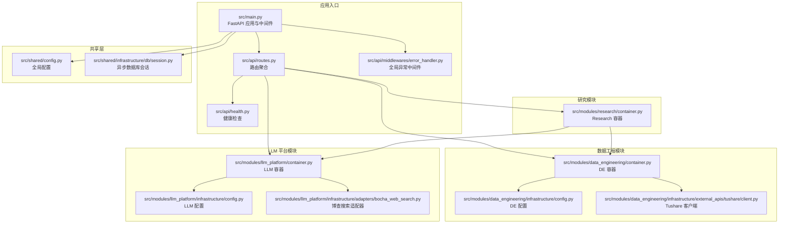
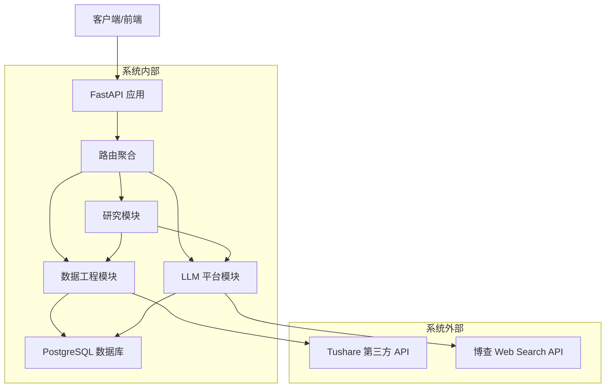
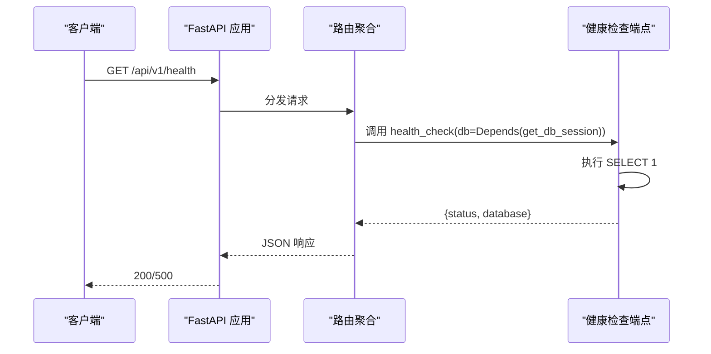
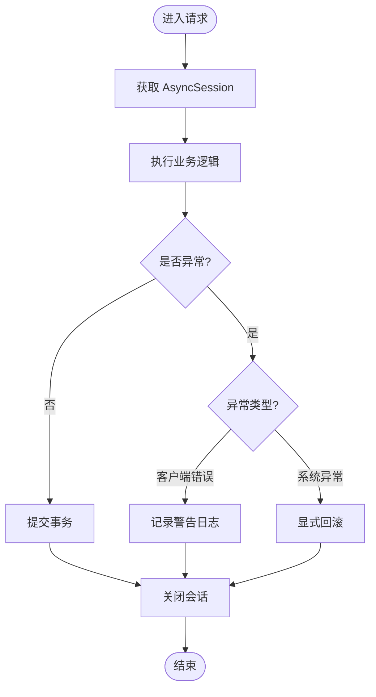
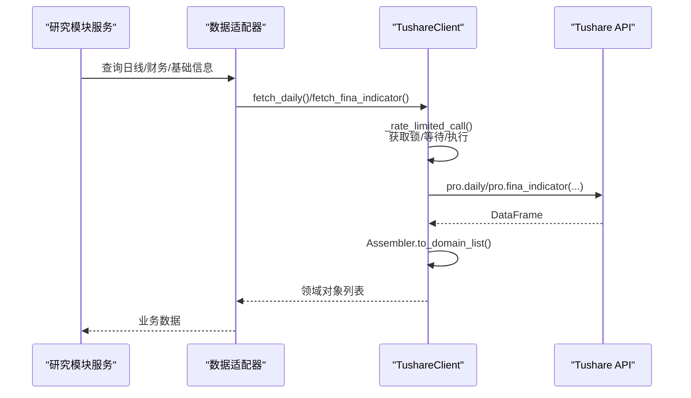
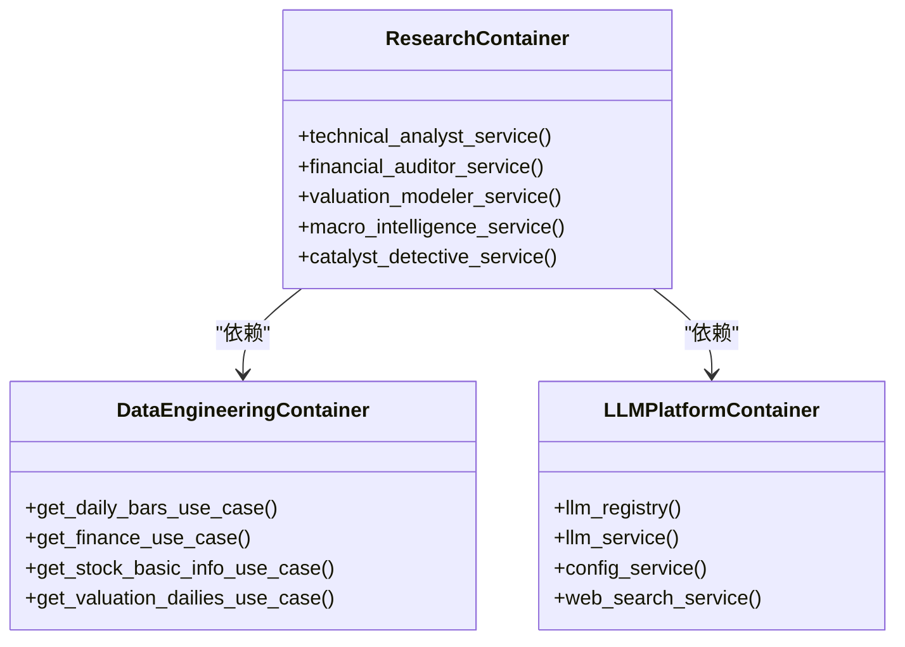
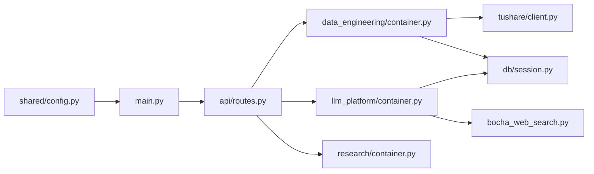

# 系统边界与集成

<cite>
**本文引用的文件**
- [src/main.py](file://src/main.py)
- [src/api/routes.py](file://src/api/routes.py)
- [src/api/health.py](file://src/api/health.py)
- [src/api/middlewares/error_handler.py](file://src/api/middlewares/error_handler.py)
- [src/shared/config.py](file://src/shared/config.py)
- [src/shared/infrastructure/db/session.py](file://src/shared/infrastructure/db/session.py)
- [src/modules/data_engineering/container.py](file://src/modules/data_engineering/container.py)
- [src/modules/data_engineering/infrastructure/config.py](file://src/modules/data_engineering/infrastructure/config.py)
- [src/modules/data_engineering/infrastructure/external_apis/tushare/client.py](file://src/modules/data_engineering/infrastructure/external_apis/tushare/client.py)
- [src/modules/llm_platform/container.py](file://src/modules/llm_platform/container.py)
- [src/modules/llm_platform/infrastructure/config.py](file://src/modules/llm_platform/infrastructure/config.py)
- [src/modules/llm_platform/infrastructure/adapters/bocha_web_search.py](file://src/modules/llm_platform/infrastructure/adapters/bocha_web_search.py)
- [src/modules/research/container.py](file://src/modules/research/container.py)
- [docker-compose.yml](file://docker-compose.yml)
- [requirements.txt](file://requirements.txt)
</cite>

## 目录
1. [引言](#引言)
2. [项目结构](#项目结构)
3. [核心组件](#核心组件)
4. [架构总览](#架构总览)
5. [详细组件分析](#详细组件分析)
6. [依赖分析](#依赖分析)
7. [性能考量](#性能考量)
8. [故障排查指南](#故障排查指南)
9. [结论](#结论)
10. [附录](#附录)

## 引言
本文件聚焦“股票助手”项目的系统边界与集成，明确系统内外部边界（API 边界、数据库边界、外部服务边界），阐述系统与外部环境的集成方式（第三方 API、数据库连接、定时任务），说明边界保护机制与安全考虑（CORS、异常处理、限流），解释扩展点与插件机制（容器装配、适配器模式），并提供系统架构图与集成关系图、集成测试策略与监控方案。

## 项目结构
项目采用多模块分层架构，围绕“研究分析”“数据工程”“LLM 平台”三大有界上下文组织代码，通过容器（Composition Root）解耦应用层与基础设施层，实现对第三方服务与数据库的统一接入。

图表来源
- [src/main.py](file://src/main.py#L1-L75)
- [src/api/routes.py](file://src/api/routes.py#L1-L13)
- [src/api/health.py](file://src/api/health.py#L1-L24)
- [src/api/middlewares/error_handler.py](file://src/api/middlewares/error_handler.py#L1-L46)
- [src/shared/config.py](file://src/shared/config.py#L1-L68)
- [src/shared/infrastructure/db/session.py](file://src/shared/infrastructure/db/session.py#L1-L64)
- [src/modules/data_engineering/container.py](file://src/modules/data_engineering/container.py#L1-L59)
- [src/modules/data_engineering/infrastructure/config.py](file://src/modules/data_engineering/infrastructure/config.py#L1-L28)
- [src/modules/data_engineering/infrastructure/external_apis/tushare/client.py](file://src/modules/data_engineering/infrastructure/external_apis/tushare/client.py#L1-L252)
- [src/modules/llm_platform/container.py](file://src/modules/llm_platform/container.py#L1-L68)
- [src/modules/llm_platform/infrastructure/config.py](file://src/modules/llm_platform/infrastructure/config.py#L1-L27)
- [src/modules/research/container.py](file://src/modules/research/container.py#L1-L167)

章节来源
- [src/main.py](file://src/main.py#L1-L75)
- [src/api/routes.py](file://src/api/routes.py#L1-L13)
- [src/shared/config.py](file://src/shared/config.py#L1-L68)

## 核心组件
- 应用入口与中间件
  - FastAPI 应用在启动时初始化调度器与 LLM 注册表，并挂载全局异常中间件与 CORS。
  - 路由聚合器将健康检查、数据工程、LLM 平台、研究模块的子路由统一注册到 /api/v1 前缀。
- 数据库边界
  - 使用 SQLAlchemy 异步引擎与会话工厂，提供依赖注入函数以管理会话生命周期与异常回滚策略。
- 外部服务边界
  - Tushare 客户端封装第三方数据拉取，内置进程级限速与线程池执行，保证并发安全与速率控制。
  - 博查 Web Search 适配器封装第三方搜索调用，支持超时、连接错误与响应映射。
- 容器与装配
  - 各模块容器作为 Composition Root，向上层提供应用服务，向下屏蔽基础设施细节，实现跨模块依赖注入。

章节来源
- [src/main.py](file://src/main.py#L14-L65)
- [src/api/routes.py](file://src/api/routes.py#L8-L12)
- [src/shared/infrastructure/db/session.py](file://src/shared/infrastructure/db/session.py#L24-L63)
- [src/modules/data_engineering/infrastructure/external_apis/tushare/client.py](file://src/modules/data_engineering/infrastructure/external_apis/tushare/client.py#L33-L79)
- [src/modules/llm_platform/infrastructure/adapters/bocha_web_search.py](file://src/modules/llm_platform/infrastructure/adapters/bocha_web_search.py#L20-L119)
- [src/modules/data_engineering/container.py](file://src/modules/data_engineering/container.py#L32-L58)
- [src/modules/llm_platform/container.py](file://src/modules/llm_platform/container.py#L24-L67)
- [src/modules/research/container.py](file://src/modules/research/container.py#L48-L166)

## 架构总览
系统边界与集成关系如下：

图表来源
- [src/main.py](file://src/main.py#L14-L65)
- [src/api/routes.py](file://src/api/routes.py#L8-L12)
- [src/modules/data_engineering/infrastructure/external_apis/tushare/client.py](file://src/modules/data_engineering/infrastructure/external_apis/tushare/client.py#L33-L53)
- [src/modules/llm_platform/infrastructure/adapters/bocha_web_search.py](file://src/modules/llm_platform/infrastructure/adapters/bocha_web_search.py#L20-L49)
- [src/shared/infrastructure/db/session.py](file://src/shared/infrastructure/db/session.py#L8-L22)

## 详细组件分析

### API 边界与路由
- 路由前缀与子路由
  - 应用在 /api/v1 下聚合健康检查、数据工程、LLM 平台、研究模块的路由。
- 健康检查
  - 依赖数据库会话执行简单查询，返回连接状态与简要诊断。
- 异常处理
  - 全局中间件捕获自定义业务异常与系统异常，统一输出结构化错误响应。

图表来源
- [src/api/routes.py](file://src/api/routes.py#L8-L12)
- [src/api/health.py](file://src/api/health.py#L10-L23)
- [src/shared/infrastructure/db/session.py](file://src/shared/infrastructure/db/session.py#L24-L42)

章节来源
- [src/api/routes.py](file://src/api/routes.py#L8-L12)
- [src/api/health.py](file://src/api/health.py#L10-L23)
- [src/api/middlewares/error_handler.py](file://src/api/middlewares/error_handler.py#L8-L45)

### 数据库边界与连接
- 连接与会话
  - 异步引擎基于配置构建，启用 pool_pre_ping 与会话工厂，提供依赖注入函数管理生命周期。
- 异常与回滚
  - 对客户端错误与系统异常进行区分处理，系统异常显式回滚，确保一致性与可观测性。

图表来源
- [src/shared/infrastructure/db/session.py](file://src/shared/infrastructure/db/session.py#L24-L63)

章节来源
- [src/shared/infrastructure/db/session.py](file://src/shared/infrastructure/db/session.py#L8-L22)
- [src/shared/infrastructure/db/session.py](file://src/shared/infrastructure/db/session.py#L36-L63)

### 外部服务边界：Tushare 与博查
- Tushare 客户端
  - 通过进程级锁与最小间隔控制实现限速，避免超过第三方速率限制；在独立线程池执行同步调用，避免阻塞事件循环；对多源数据进行 ETL 合并与去重。
- 博查搜索适配器
  - 标准化请求体与响应映射，集中处理网络错误、超时与业务错误，提供统一的 WebSearchDTO。

图表来源
- [src/modules/data_engineering/infrastructure/external_apis/tushare/client.py](file://src/modules/data_engineering/infrastructure/external_apis/tushare/client.py#L62-L79)
- [src/modules/data_engineering/infrastructure/external_apis/tushare/client.py](file://src/modules/data_engineering/infrastructure/external_apis/tushare/client.py#L173-L251)

章节来源
- [src/modules/data_engineering/infrastructure/external_apis/tushare/client.py](file://src/modules/data_engineering/infrastructure/external_apis/tushare/client.py#L33-L53)
- [src/modules/data_engineering/infrastructure/external_apis/tushare/client.py](file://src/modules/data_engineering/infrastructure/external_apis/tushare/client.py#L62-L79)
- [src/modules/llm_platform/infrastructure/adapters/bocha_web_search.py](file://src/modules/llm_platform/infrastructure/adapters/bocha_web_search.py#L51-L119)

### 容器与扩展点
- 数据工程容器
  - 统一装配日线、财务、股票基础信息、估值日线等 UseCase，向上层暴露稳定接口，屏蔽仓储实现。
- LLM 平台容器
  - 统一装配 LLM 服务、注册表、配置服务与 Web 搜索服务，支持从数据库加载配置与按需装配适配器。
- 研究容器
  - 通过延迟导入避免循环依赖，组合数据工程与 LLM 平台容器，装配技术分析、财务审计、估值建模、宏观情报、催化剂侦探等服务。

图表来源
- [src/modules/data_engineering/container.py](file://src/modules/data_engineering/container.py#L32-L58)
- [src/modules/llm_platform/container.py](file://src/modules/llm_platform/container.py#L24-L67)
- [src/modules/research/container.py](file://src/modules/research/container.py#L48-L166)

章节来源
- [src/modules/data_engineering/container.py](file://src/modules/data_engineering/container.py#L32-L58)
- [src/modules/llm_platform/container.py](file://src/modules/llm_platform/container.py#L24-L67)
- [src/modules/research/container.py](file://src/modules/research/container.py#L48-L166)

## 依赖分析
- 配置隔离
  - 全局配置与模块专属配置分离，分别在共享层与模块层加载，避免配置污染与耦合。
- 外部依赖
  - FastAPI、SQLAlchemy 异步、asyncpg、Alembic、Pydantic Settings、Loguru、httpx、pandas、tushare、APScheduler、OpenAI 等。
- 容器装配
  - 通过容器解耦应用层与基础设施层，容器内部负责依赖注入与对象组装，上层仅依赖抽象端口。

图表来源
- [src/shared/config.py](file://src/shared/config.py#L1-L68)
- [src/main.py](file://src/main.py#L14-L65)
- [src/api/routes.py](file://src/api/routes.py#L1-L13)
- [src/modules/data_engineering/container.py](file://src/modules/data_engineering/container.py#L1-L59)
- [src/modules/llm_platform/container.py](file://src/modules/llm_platform/container.py#L1-L68)
- [src/modules/research/container.py](file://src/modules/research/container.py#L1-L167)
- [src/modules/data_engineering/infrastructure/external_apis/tushare/client.py](file://src/modules/data_engineering/infrastructure/external_apis/tushare/client.py#L1-L252)
- [src/modules/llm_platform/infrastructure/adapters/bocha_web_search.py](file://src/modules/llm_platform/infrastructure/adapters/bocha_web_search.py#L1-L190)
- [src/shared/infrastructure/db/session.py](file://src/shared/infrastructure/db/session.py#L1-L64)

章节来源
- [src/shared/config.py](file://src/shared/config.py#L1-L68)
- [requirements.txt](file://requirements.txt#L1-L16)

## 性能考量
- 数据库性能
  - 使用异步引擎与连接池预检，减少无效连接；会话工厂配置 expire_on_commit 降低 ORM 对象过期开销。
- 外部服务限流
  - Tushare 客户端采用进程级锁与最小间隔控制，避免触发第三方限流；对同步调用使用线程池避免阻塞事件循环。
- 并发与资源
  - 通过依赖注入与容器装配，避免在应用层直接创建重型资源；统一在容器中管理生命周期。

章节来源
- [src/shared/infrastructure/db/session.py](file://src/shared/infrastructure/db/session.py#L8-L22)
- [src/modules/data_engineering/infrastructure/external_apis/tushare/client.py](file://src/modules/data_engineering/infrastructure/external_apis/tushare/client.py#L62-L79)

## 故障排查指南
- 健康检查
  - 通过 /api/v1/health 检查数据库连通性；若失败，查看日志与异常堆栈。
- 全局异常处理
  - 中间件统一捕获业务异常与系统异常，返回结构化错误；系统异常会记录详细堆栈，便于定位。
- 数据库异常
  - 客户端错误不回滚，系统异常显式回滚；异常分类有助于区分业务校验失败与系统故障。
- 外部服务错误
  - Tushare 初始化失败、网络超时、第三方返回错误均被转换为统一异常类型，便于上层处理与重试。

章节来源
- [src/api/health.py](file://src/api/health.py#L10-L23)
- [src/api/middlewares/error_handler.py](file://src/api/middlewares/error_handler.py#L17-L45)
- [src/shared/infrastructure/db/session.py](file://src/shared/infrastructure/db/session.py#L44-L61)
- [src/modules/data_engineering/infrastructure/external_apis/tushare/client.py](file://src/modules/data_engineering/infrastructure/external_apis/tushare/client.py#L46-L53)
- [src/modules/llm_platform/infrastructure/adapters/bocha_web_search.py](file://src/modules/llm_platform/infrastructure/adapters/bocha_web_search.py#L102-L119)

## 结论
本项目通过清晰的系统边界与容器化装配，实现了对外部服务（Tushare、博查）、数据库与定时任务的稳健集成。全局中间件与统一异常处理提升了系统可观测性与稳定性；模块专属配置与限流策略保障了外部依赖的可靠性与合规性。容器作为扩展点，使新增能力（新适配器、新服务）以最小耦合方式融入系统。

## 附录

### 系统边界与保护机制
- API 边界
  - CORS 中间件按配置允许来源；根路径与健康检查端点用于存活探测。
- 数据库边界
  - 异步连接池与会话生命周期管理；异常分类与回滚策略。
- 外部服务边界
  - Tushare 限速与线程池执行；博查搜索超时与错误映射。
- 安全与合规
  - 配置隔离与敏感信息（API Key）通过环境变量注入；异常中间件不泄露内部细节。

章节来源
- [src/main.py](file://src/main.py#L51-L62)
- [src/shared/config.py](file://src/shared/config.py#L19-L32)
- [src/shared/infrastructure/db/session.py](file://src/shared/infrastructure/db/session.py#L36-L63)
- [src/modules/data_engineering/infrastructure/external_apis/tushare/client.py](file://src/modules/data_engineering/infrastructure/external_apis/tushare/client.py#L62-L79)
- [src/modules/llm_platform/infrastructure/adapters/bocha_web_search.py](file://src/modules/llm_platform/infrastructure/adapters/bocha_web_search.py#L66-L69)

### 扩展点与插件机制
- 适配器模式
  - TushareClient、BochaWebSearchAdapter 实现各自端口接口，便于替换与扩展。
- 容器装配
  - 各模块容器集中装配应用服务，新增服务只需在容器中注册即可被上层使用。
- 配置隔离
  - 模块专属配置类（DataEngineeringConfig、LLMPlatformConfig）支持按上下文扩展。

章节来源
- [src/modules/data_engineering/infrastructure/external_apis/tushare/client.py](file://src/modules/data_engineering/infrastructure/external_apis/tushare/client.py#L33-L53)
- [src/modules/llm_platform/infrastructure/adapters/bocha_web_search.py](file://src/modules/llm_platform/infrastructure/adapters/bocha_web_search.py#L20-L49)
- [src/modules/data_engineering/container.py](file://src/modules/data_engineering/container.py#L32-L58)
- [src/modules/llm_platform/container.py](file://src/modules/llm_platform/container.py#L24-L67)
- [src/modules/data_engineering/infrastructure/config.py](file://src/modules/data_engineering/infrastructure/config.py#L10-L27)
- [src/modules/llm_platform/infrastructure/config.py](file://src/modules/llm_platform/infrastructure/config.py#L10-L26)

### 集成测试策略与监控方案
- 集成测试策略
  - 健康检查端点验证数据库连通性；外部服务适配器通过模拟/桩对象与断言响应结构；容器装配通过单元测试验证依赖注入与服务可用性。
- 监控方案
  - 健康检查端点与日志记录；建议引入指标采集（Prometheus）与分布式追踪（结合现有日志框架）以完善可观测性。

章节来源
- [src/api/health.py](file://src/api/health.py#L10-L23)
- [docker-compose.yml](file://docker-compose.yml#L23-L28)
- [requirements.txt](file://requirements.txt#L11-L11)