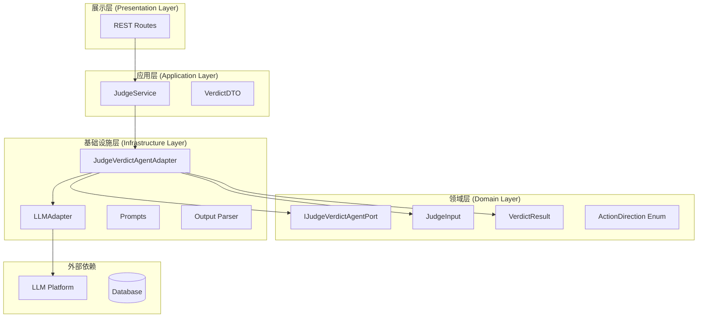
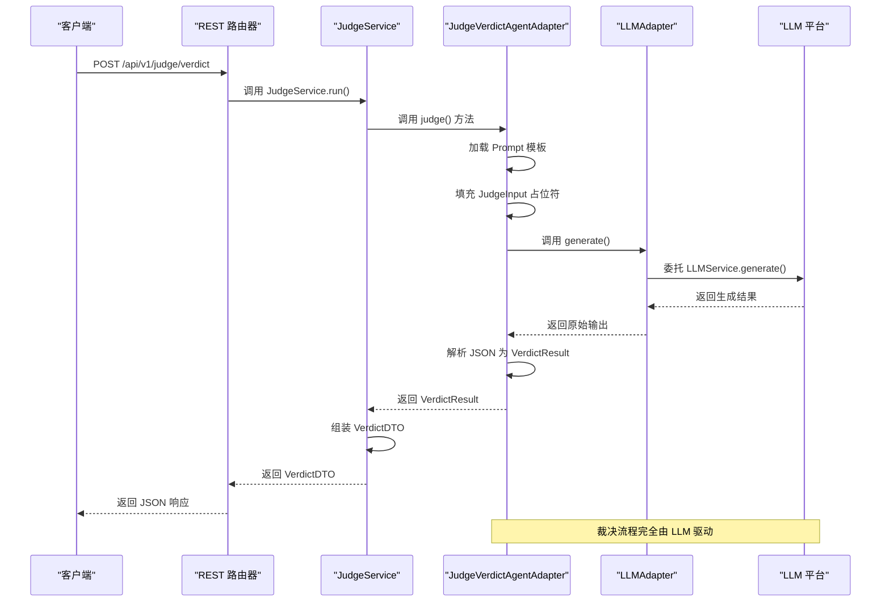
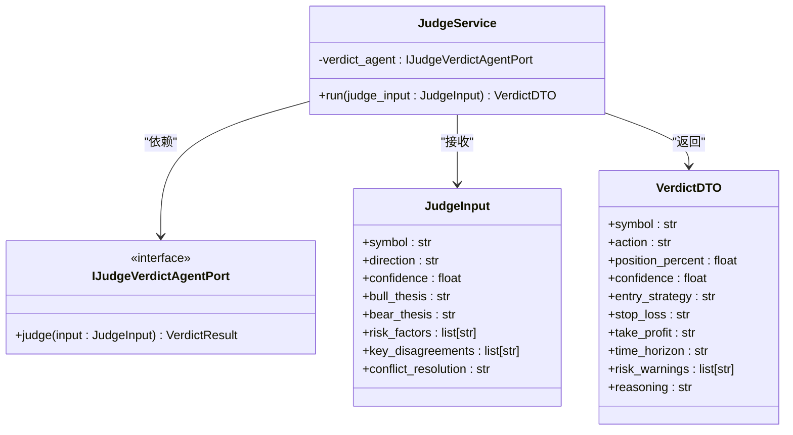
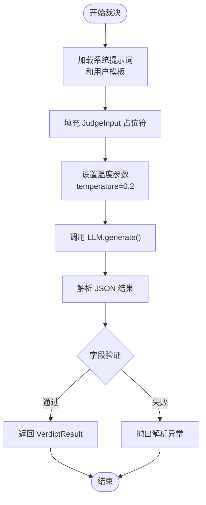
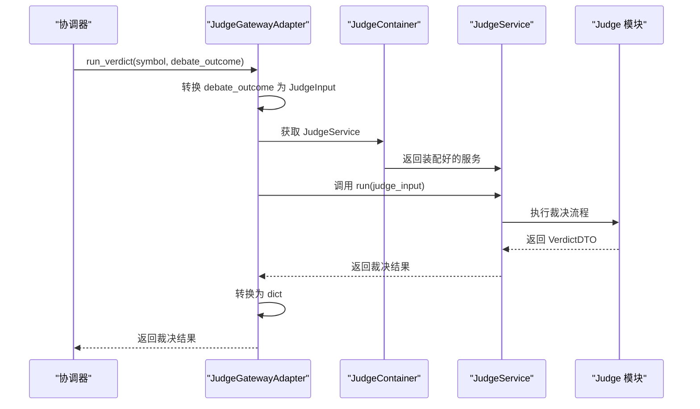
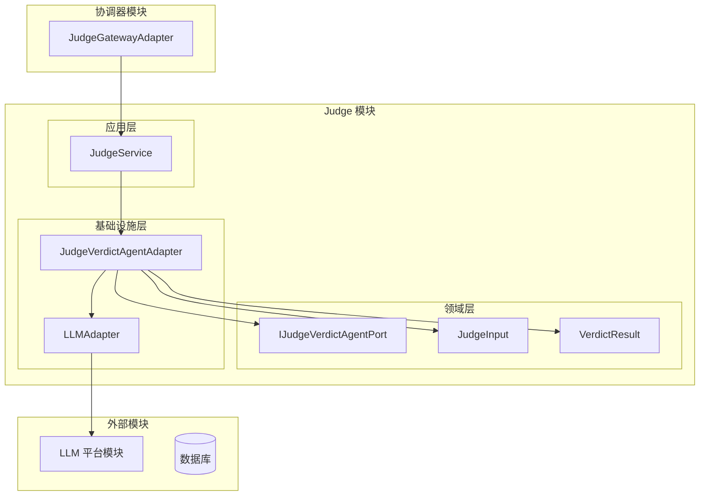

# 裁决引擎规范

<cite>
**本文档引用的文件**
- [README.md](file://README.md)
- [src/main.py](file://src/main.py)
- [openspec/specs/judge-verdict-engine/spec.md](file://openspec/specs/judge-verdict-engine/spec.md)
- [openspec/specs/coordinator-research-orchestration/spec.md](file://openspec/specs/coordinator-research-orchestration/spec.md)
- [src/modules/judge/container.py](file://src/modules/judge/container.py)
- [src/modules/judge/application/services/judge_service.py](file://src/modules/judge/application/services/judge_service.py)
- [src/modules/judge/domain/dtos/judge_input.py](file://src/modules/judge/domain/dtos/judge_input.py)
- [src/modules/judge/application/dtos/verdict_dto.py](file://src/modules/judge/application/dtos/verdict_dto.py)
- [src/modules/judge/domain/ports/judge_verdict_agent.py](file://src/modules/judge/domain/ports/judge_verdict_agent.py)
- [src/modules/judge/infrastructure/adapters/judge_verdict_agent_adapter.py](file://src/modules/judge/infrastructure/adapters/judge_verdict_agent_adapter.py)
- [src/modules/judge/infrastructure/adapters/llm_adapter.py](file://src/modules/judge/infrastructure/adapters/llm_adapter.py)
- [src/modules/judge/domain/ports/llm_port.py](file://src/modules/judge/domain/ports/llm_port.py)
- [src/modules/coordinator/container.py](file://src/modules/coordinator/container.py)
- [src/modules/coordinator/infrastructure/adapters/judge_gateway_adapter.py](file://src/modules/coordinator/infrastructure/adapters/judge_gateway_adapter.py)
- [src/modules/coordinator/infrastructure/orchestration/graph_builder.py](file://src/modules/coordinator/infrastructure/orchestration/graph_builder.py)
</cite>

## 目录
1. [简介](#简介)
2. [项目结构](#项目结构)
3. [核心组件](#核心组件)
4. [架构概览](#架构概览)
5. [详细组件分析](#详细组件分析)
6. [依赖关系分析](#依赖关系分析)
7. [性能考虑](#性能考虑)
8. [故障排除指南](#故障排除指南)
9. [结论](#结论)

## 简介

裁决引擎是 Stock Helper 项目中的核心决策模块，负责基于多专家研究结果进行综合裁决。该引擎采用领域驱动设计（DDD）原则，实现了独立的 Judge 模块，能够接收辩论结果并输出结构化的投资决策。

裁决引擎的主要功能包括：
- 接收来自协调器的辩论结果
- 通过 LLM 驱动的单次综合裁决流程
- 输出结构化的投资决策 DTO
- 提供独立的 REST API 端点
- 支持与协调器模块的无缝集成

## 项目结构

项目采用模块化架构，裁决引擎作为独立的模块存在于 `src/modules/judge/` 目录下：

**图表来源**
- [src/modules/judge/container.py](file://src/modules/judge/container.py#L1-L31)
- [src/modules/judge/application/services/judge_service.py](file://src/modules/judge/application/services/judge_service.py#L1-L35)
- [src/modules/judge/infrastructure/adapters/judge_verdict_agent_adapter.py](file://src/modules/judge/infrastructure/adapters/judge_verdict_agent_adapter.py#L1-L56)

**章节来源**
- [src/modules/judge/container.py](file://src/modules/judge/container.py#L1-L31)
- [openspec/specs/judge-verdict-engine/spec.md](file://openspec/specs/judge-verdict-engine/spec.md#L238-L262)

## 核心组件

裁决引擎遵循 DDD 四层架构模式，包含以下核心组件：

### 应用服务层
- **JudgeService**: 唯一的应用服务入口，负责编排裁决流程
- **VerdictDTO**: 应用层对外暴露的裁决结果数据传输对象

### 领域层
- **IJudgeVerdictAgentPort**: 裁决 Agent 的抽象接口
- **JudgeInput**: 裁决输入的数据传输对象
- **VerdictResult**: 领域层的裁决结果 DTO
- **ActionDirection 枚举**: 操作方向的枚举定义

### 基础设施层
- **JudgeVerdictAgentAdapter**: Agent 接口的具体实现
- **LLMAdapter**: LLM 平台的适配器实现
- **Prompt 系统**: 基于模板的提示词管理系统

**章节来源**
- [src/modules/judge/application/services/judge_service.py](file://src/modules/judge/application/services/judge_service.py#L1-L35)
- [src/modules/judge/domain/dtos/judge_input.py](file://src/modules/judge/domain/dtos/judge_input.py#L1-L23)
- [src/modules/judge/application/dtos/verdict_dto.py](file://src/modules/judge/application/dtos/verdict_dto.py#L1-L22)

## 架构概览

裁决引擎采用清晰的分层架构，确保了良好的关注点分离和可测试性：

**图表来源**
- [src/modules/judge/application/services/judge_service.py](file://src/modules/judge/application/services/judge_service.py#L17-L34)
- [src/modules/judge/infrastructure/adapters/judge_verdict_agent_adapter.py](file://src/modules/judge/infrastructure/adapters/judge_verdict_agent_adapter.py#L36-L55)
- [src/modules/judge/infrastructure/adapters/llm_adapter.py](file://src/modules/judge/infrastructure/adapters/llm_adapter.py#L18-L28)

## 详细组件分析

### JudgeService 组件分析

JudgeService 是裁决引擎的唯一应用服务入口，负责协调整个裁决流程：

**图表来源**
- [src/modules/judge/application/services/judge_service.py](file://src/modules/judge/application/services/judge_service.py#L11-L34)
- [src/modules/judge/domain/dtos/judge_input.py](file://src/modules/judge/domain/dtos/judge_input.py#L9-L22)
- [src/modules/judge/application/dtos/verdict_dto.py](file://src/modules/judge/application/dtos/verdict_dto.py#L9-L21)

**章节来源**
- [src/modules/judge/application/services/judge_service.py](file://src/modules/judge/application/services/judge_service.py#L1-L35)

### JudgeVerdictAgentAdapter 组件分析

Agent 适配器实现了 LLM 驱动的裁决逻辑：

**图表来源**
- [src/modules/judge/infrastructure/adapters/judge_verdict_agent_adapter.py](file://src/modules/judge/infrastructure/adapters/judge_verdict_agent_adapter.py#L36-L55)

**章节来源**
- [src/modules/judge/infrastructure/adapters/judge_verdict_agent_adapter.py](file://src/modules/judge/infrastructure/adapters/judge_verdict_agent_adapter.py#L1-L56)

### JudgeGatewayAdapter 组件分析

协调器模块的 JudgeGatewayAdapter 负责将辩论结果转换为裁决输入：

**图表来源**
- [src/modules/coordinator/infrastructure/adapters/judge_gateway_adapter.py](file://src/modules/coordinator/infrastructure/adapters/judge_gateway_adapter.py#L52-L62)

**章节来源**
- [src/modules/coordinator/infrastructure/adapters/judge_gateway_adapter.py](file://src/modules/coordinator/infrastructure/adapters/judge_gateway_adapter.py#L1-L63)

## 依赖关系分析

裁决引擎的依赖关系体现了清晰的分层架构和依赖倒置原则：

**图表来源**
- [src/modules/judge/container.py](file://src/modules/judge/container.py#L19-L30)
- [src/modules/coordinator/container.py](file://src/modules/coordinator/container.py#L27-L48)

**章节来源**
- [src/modules/judge/container.py](file://src/modules/judge/container.py#L1-L31)
- [src/modules/coordinator/container.py](file://src/modules/coordinator/container.py#L1-L49)

## 性能考虑

裁决引擎在设计时充分考虑了性能优化：

### 异步处理
- 所有 LLM 调用均采用异步模式，避免阻塞主线程
- 数据库操作使用异步 Session，提高并发性能

### 缓存策略
- Prompt 模板在内存中缓存，避免重复磁盘 I/O
- LLM 配置通过容器管理，减少初始化开销

### 错误处理
- 采用优雅降级机制，单个专家失败不影响整体性能
- 异常传播机制确保问题能够及时发现和处理

## 故障排除指南

### 常见问题及解决方案

**问题 1: LLM 输出解析失败**
- **症状**: 返回 HTTP 500 错误，包含 LLMOutputParseError
- **原因**: LLM 返回的 JSON 格式不符合预期
- **解决方案**: 检查 Prompt 模板和输出解析器

**问题 2: 裁决服务不可用**
- **症状**: 调用 /api/v1/judge/verdict 返回 500 错误
- **原因**: JudgeService 未正确初始化或依赖注入失败
- **解决方案**: 检查 JudgeContainer 的装配过程

**问题 3: 输入参数验证失败**
- **症状**: 返回 HTTP 400 错误
- **原因**: symbol 缺失或 debate_outcome 格式不正确
- **解决方案**: 确保请求体包含必需字段且格式正确

**章节来源**
- [openspec/specs/judge-verdict-engine/spec.md](file://openspec/specs/judge-verdict-engine/spec.md#L211-L235)

## 结论

裁决引擎作为 Stock Helper 项目的核心决策模块，成功实现了以下目标：

1. **独立性**: 通过 DDD 四层架构实现了模块间的清晰分离
2. **可扩展性**: 支持通过 Adapter 模式轻松替换不同的 LLM 平台
3. **可测试性**: 通过 Port 接口和依赖注入实现了良好的可测试性
4. **可靠性**: 采用优雅降级和异常处理机制确保系统稳定性

该引擎为整个 Stock Helper 项目提供了强大的决策支持能力，能够基于多专家的研究结果生成高质量的投资决策建议。通过模块化设计和清晰的接口定义，为未来的功能扩展和技术演进奠定了坚实基础。