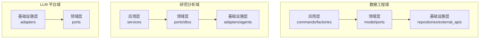
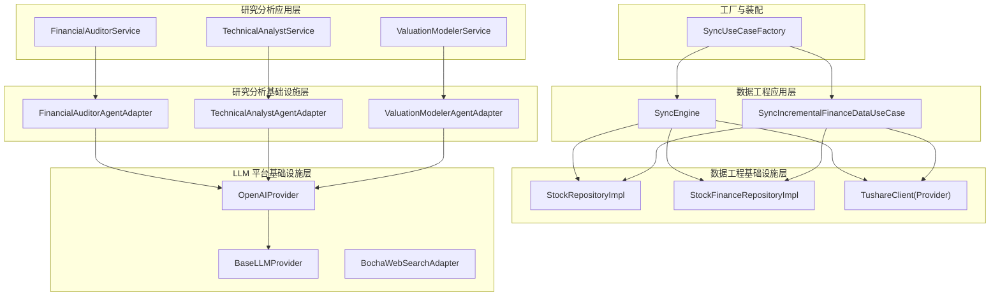
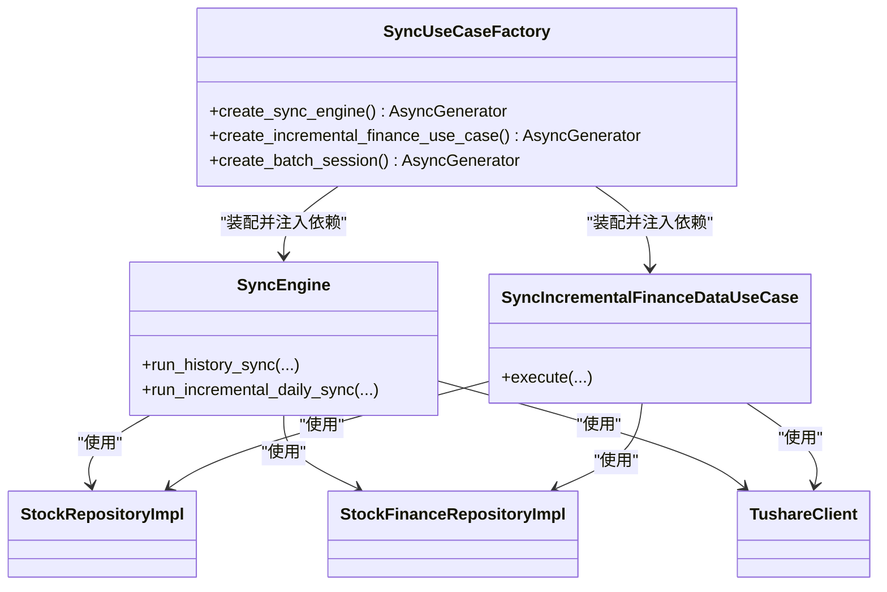
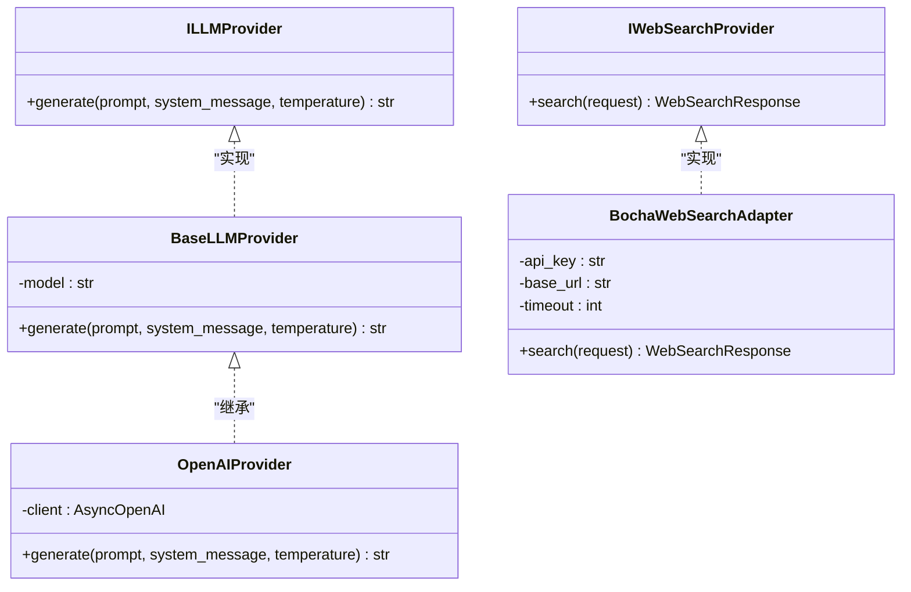
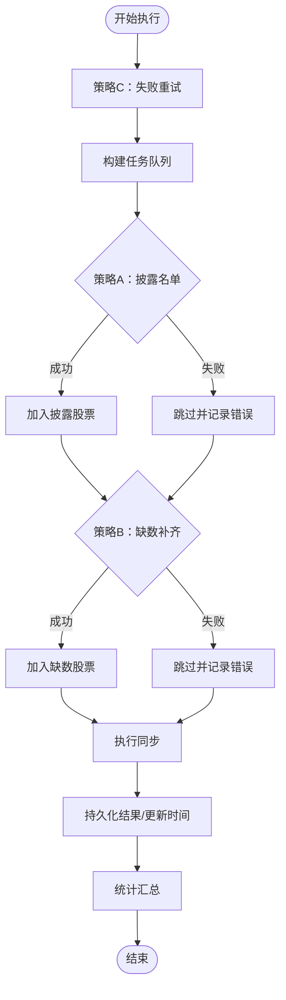
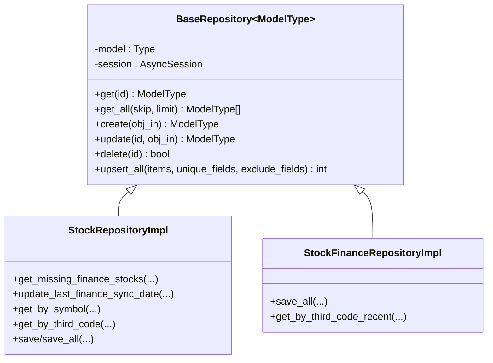
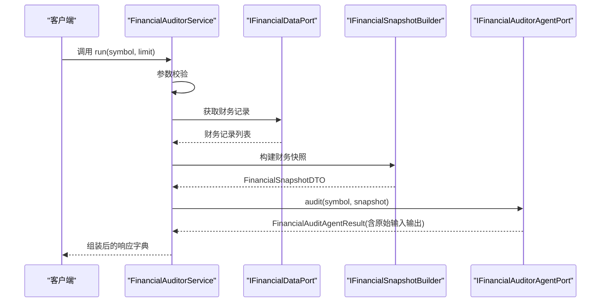
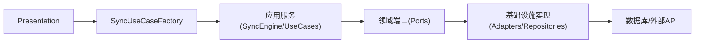

# 设计模式应用

<cite>
**本文引用的文件**
- [src/modules/data_engineering/application/factories/sync_factory.py](file://src/modules/data_engineering/application/factories/sync_factory.py)
- [src/shared/infrastructure/base_repository.py](file://src/shared/infrastructure/base_repository.py)
- [src/modules/data_engineering/infrastructure/persistence/repositories/pg_stock_repo.py](file://src/modules/data_engineering/infrastructure/persistence/repositories/pg_stock_repo.py)
- [src/modules/data_engineering/infrastructure/persistence/repositories/pg_finance_repo.py](file://src/modules/data_engineering/infrastructure/persistence/repositories/pg_finance_repo.py)
- [src/modules/llm_platform/infrastructure/adapters/base.py](file://src/modules/llm_platform/infrastructure/adapters/base.py)
- [src/modules/llm_platform/infrastructure/adapters/openai.py](file://src/modules/llm_platform/infrastructure/adapters/openai.py)
- [src/modules/llm_platform/infrastructure/adapters/bocha_web_search.py](file://src/modules/llm_platform/infrastructure/adapters/bocha_web_search.py)
- [src/modules/research/domain/ports/financial_auditor_agent.py](file://src/modules/research/domain/ports/financial_auditor_agent.py)
- [src/modules/research/domain/ports/technical_analyst_agent.py](file://src/modules/research/domain/ports/technical_analyst_agent.py)
- [src/modules/research/domain/ports/valuation_modeler_agent.py](file://src/modules/research/domain/ports/valuation_modeler_agent.py)
- [src/modules/research/infrastructure/adapters/financial_auditor_agent_adapter.py](file://src/modules/research/infrastructure/adapters/financial_auditor_agent_adapter.py)
- [src/modules/research/infrastructure/adapters/technical_analyst_agent_adapter.py](file://src/modules/research/infrastructure/adapters/technical_analyst_agent_adapter.py)
- [src/modules/research/infrastructure/adapters/valuation_modeler_agent_adapter.py](file://src/modules/research/infrastructure/adapters/valuation_modeler_agent_adapter.py)
- [src/modules/research/application/financial_auditor_service.py](file://src/modules/research/application/financial_auditor_service.py)
- [src/modules/research/application/technical_analyst_service.py](file://src/modules/research/application/technical_analyst_service.py)
- [src/modules/research/application/valuation_modeler_service.py](file://src/modules/research/application/valuation_modeler_service.py)
- [src/modules/data_engineering/application/commands/sync_engine.py](file://src/modules/data_engineering/application/commands/sync_engine.py)
- [src/modules/data_engineering/application/commands/sync_incremental_finance_data.py](file://src/modules/data_engineering/application/commands/sync_incremental_finance_data.py)
</cite>

## 目录
1. [引言](#引言)
2. [项目结构](#项目结构)
3. [核心组件](#核心组件)
4. [架构总览](#架构总览)
5. [详细组件分析](#详细组件分析)
6. [依赖分析](#依赖分析)
7. [性能考量](#性能考量)
8. [故障排查指南](#故障排查指南)
9. [结论](#结论)

## 引言
本文件聚焦“股票助手”项目中的设计模式实践，系统梳理并深入解析以下模式在代码中的落地方式与价值：
- 工厂模式（Factory Pattern）：用于集中装配应用用例与基础设施依赖，屏蔽 Presentation 层对底层实现的耦合。
- 适配器模式（Adapter Pattern）：将外部 LLM/WebSearch 等服务抽象为统一接口，隔离实现差异，便于替换与扩展。
- 策略模式（Strategy Pattern）：在数据工程增量同步中体现为多策略组合（披露名单优先、缺数补齐、失败重试），以不同算法路径达成目标。
- 仓储模式（Repository Pattern）：通过统一的仓储接口与基类实现数据访问抽象，解耦领域模型与持久化细节。

这些模式共同提升了系统的可维护性、可扩展性与可测试性，使模块边界清晰、职责单一、替换成本低。

## 项目结构
项目采用分层+领域驱动设计（DDD）风格，围绕“数据工程”“研究分析”“LLM 平台”三大域划分模块，各域内再按应用层、领域层、基础设施层组织代码。工厂与仓储位于应用层与基础设施层之间，作为装配与数据访问的桥梁；适配器与端口（Port）位于领域层之上，隔离外部依赖。

## 核心组件
- 工厂与装配
  - 数据工程用例工厂：集中创建 SyncEngine 与增量用例实例，统一管理数据库会话生命周期与依赖注入。
- 仓储与基类
  - 通用仓储基类：提供统一 CRUD 与批量 Upsert 能力，子类仅需声明模型类型即可获得完整能力。
  - 具体仓储实现：股票、财务等仓储基于基类扩展，补充领域特定查询与批量写入。
- 适配器与端口
  - LLM 适配器：统一 ILLMProvider 接口，屏蔽 OpenAI 等不同实现差异。
  - WebSearch 适配器：统一 IWebSearchProvider 接口，屏蔽第三方搜索 API 差异。
  - 研究分析 Agent 适配器：统一 IFinancialAuditorAgentPort、ITechnicalAnalystAgentPort、IValuationModelerAgentPort，封装 Prompt 加载、调用 LLM、解析输出。
- 应用服务
  - 财务审计、技术分析、估值建模应用服务：编排数据获取、构建快照、调用 Agent，组装最终响应。

**章节来源**
- file://src/modules/data_engineering/application/factories/sync_factory.py#L14-L115
- file://src/shared/infrastructure/base_repository.py#L13-L125
- file://src/modules/data_engineering/infrastructure/persistence/repositories/pg_stock_repo.py#L12-L133
- file://src/modules/data_engineering/infrastructure/persistence/repositories/pg_finance_repo.py#L15-L54
- file://src/modules/llm_platform/infrastructure/adapters/base.py#L6-L9
- file://src/modules/llm_platform/infrastructure/adapters/openai.py#L10-L65
- file://src/modules/llm_platform/infrastructure/adapters/bocha_web_search.py#L20-L190
- file://src/modules/research/domain/ports/financial_auditor_agent.py#L12-L22
- file://src/modules/research/domain/ports/technical_analyst_agent.py#L12-L23
- file://src/modules/research/domain/ports/valuation_modeler_agent.py#L11-L28
- file://src/modules/research/infrastructure/adapters/financial_auditor_agent_adapter.py#L28-L57
- file://src/modules/research/infrastructure/adapters/technical_analyst_agent_adapter.py#L22-L54
- file://src/modules/research/infrastructure/adapters/valuation_modeler_agent_adapter.py#L28-L62
- file://src/modules/research/application/financial_auditor_service.py#L17-L67
- file://src/modules/research/application/technical_analyst_service.py#L14-L73
- file://src/modules/research/application/valuation_modeler_service.py#L20-L94

## 架构总览
下图展示了工厂、仓储、适配器与应用服务之间的交互关系，体现依赖倒置与端口隔离原则。

**图表来源**
- [src/modules/data_engineering/application/factories/sync_factory.py](file://src/modules/data_engineering/application/factories/sync_factory.py#L14-L115)
- [src/modules/data_engineering/application/commands/sync_engine.py](file://src/modules/data_engineering/application/commands/sync_engine.py#L20-L280)
- [src/modules/data_engineering/application/commands/sync_incremental_finance_data.py](file://src/modules/data_engineering/application/commands/sync_incremental_finance_data.py#L16-L205)
- [src/modules/data_engineering/infrastructure/persistence/repositories/pg_stock_repo.py](file://src/modules/data_engineering/infrastructure/persistence/repositories/pg_stock_repo.py#L12-L133)
- [src/modules/data_engineering/infrastructure/persistence/repositories/pg_finance_repo.py](file://src/modules/data_engineering/infrastructure/persistence/repositories/pg_finance_repo.py#L15-L54)
- [src/modules/llm_platform/infrastructure/adapters/base.py](file://src/modules/llm_platform/infrastructure/adapters/base.py#L6-L9)
- [src/modules/llm_platform/infrastructure/adapters/openai.py](file://src/modules/llm_platform/infrastructure/adapters/openai.py#L10-L65)
- [src/modules/llm_platform/infrastructure/adapters/bocha_web_search.py](file://src/modules/llm_platform/infrastructure/adapters/bocha_web_search.py#L20-L190)
- [src/modules/research/application/financial_auditor_service.py](file://src/modules/research/application/financial_auditor_service.py#L17-L67)
- [src/modules/research/application/technical_analyst_service.py](file://src/modules/research/application/technical_analyst_service.py#L14-L73)
- [src/modules/research/application/valuation_modeler_service.py](file://src/modules/research/application/valuation_modeler_service.py#L20-L94)
- [src/modules/research/infrastructure/adapters/financial_auditor_agent_adapter.py](file://src/modules/research/infrastructure/adapters/financial_auditor_agent_adapter.py#L28-L57)
- [src/modules/research/infrastructure/adapters/technical_analyst_agent_adapter.py](file://src/modules/research/infrastructure/adapters/technical_analyst_agent_adapter.py#L22-L54)
- [src/modules/research/infrastructure/adapters/valuation_modeler_agent_adapter.py](file://src/modules/research/infrastructure/adapters/valuation_modeler_agent_adapter.py#L28-L62)

## 详细组件分析

### 工厂模式：集中装配与会话管理
- 角色定位
  - SyncUseCaseFactory：面向 Presentation 层提供“装配门面”，隐藏基础设施细节，统一管理数据库会话生命周期。
- 关键实现
  - 异步上下文管理器：在进入时创建会话，退出时自动关闭，异常时回滚，确保资源安全释放。
  - 依赖装配：将仓储、提供者与应用用例组合为可直接使用的实例，降低上层复杂度。
- 价值
  - 降低耦合：Presentation 不直接依赖具体仓储与提供者实现。
  - 提升可测试性：可通过替换工厂创建的实例进行单元测试。
  - 保证一致性：统一的会话与事务管理策略。

**图表来源**
- [src/modules/data_engineering/application/factories/sync_factory.py](file://src/modules/data_engineering/application/factories/sync_factory.py#L14-L115)
- [src/modules/data_engineering/application/commands/sync_engine.py](file://src/modules/data_engineering/application/commands/sync_engine.py#L20-L280)
- [src/modules/data_engineering/application/commands/sync_incremental_finance_data.py](file://src/modules/data_engineering/application/commands/sync_incremental_finance_data.py#L16-L205)
- [src/modules/data_engineering/infrastructure/persistence/repositories/pg_stock_repo.py](file://src/modules/data_engineering/infrastructure/persistence/repositories/pg_stock_repo.py#L12-L133)
- [src/modules/data_engineering/infrastructure/persistence/repositories/pg_finance_repo.py](file://src/modules/data_engineering/infrastructure/persistence/repositories/pg_finance_repo.py#L15-L54)

**章节来源**
- file://src/modules/data_engineering/application/factories/sync_factory.py#L14-L115

### 适配器模式：统一外部服务接口
- 角色定位
  - ILLMProvider、IWebSearchProvider：定义对外统一接口，屏蔽实现差异。
  - BaseLLMProvider、OpenAIProvider、BochaWebSearchAdapter：具体实现，负责调用外部服务并转换为统一 DTO。
- 关键实现
  - LLM 适配：统一 generate 接口，封装消息构造、异常转换与日志记录。
  - WebSearch 适配：统一 search 接口，封装请求体构建、响应映射与错误分类。
- 价值
  - 替换成本低：更换 LLM/搜索服务只需实现对应适配器。
  - 易于测试：通过接口注入，可替换为 Mock 实现。
  - 行为一致：统一的输入输出契约，便于上层编排。

**图表来源**
- [src/modules/llm_platform/infrastructure/adapters/base.py](file://src/modules/llm_platform/infrastructure/adapters/base.py#L6-L9)
- [src/modules/llm_platform/infrastructure/adapters/openai.py](file://src/modules/llm_platform/infrastructure/adapters/openai.py#L10-L65)
- [src/modules/llm_platform/infrastructure/adapters/bocha_web_search.py](file://src/modules/llm_platform/infrastructure/adapters/bocha_web_search.py#L20-L190)

**章节来源**
- file://src/modules/llm_platform/infrastructure/adapters/base.py#L6-L9
- file://src/modules/llm_platform/infrastructure/adapters/openai.py#L10-L65
- file://src/modules/llm_platform/infrastructure/adapters/bocha_web_search.py#L20-L190

### 策略模式：数据工程增量同步的多策略组合
- 角色定位
  - SyncIncrementalFinanceDataUseCase：在一次执行中组合多种策略，实现“高优先级披露名单 + 低优先级缺数补齐 + 失败重试”的协同工作流。
- 关键实现
  - 策略 A（高优先级）：根据披露计划筛选目标股票集合。
  - 策略 B（低优先级）：查询缺失目标报告期财务数据的股票，进行缺数补齐。
  - 策略 C（前置步骤）：读取未解决失败记录，进行重试与状态更新。
- 价值
  - 灵活调度：不同策略的优先级与阈值可配置，便于演进。
  - 容错稳健：单只股票失败不影响整体流程，失败记录持久化以便后续重试。
  - 可观测性强：每个策略阶段均记录日志与统计，便于监控与优化。

**图表来源**
- [src/modules/data_engineering/application/commands/sync_incremental_finance_data.py](file://src/modules/data_engineering/application/commands/sync_incremental_finance_data.py#L16-L205)

**章节来源**
- file://src/modules/data_engineering/application/commands/sync_incremental_finance_data.py#L16-L205

### 仓储模式：统一数据访问抽象
- 角色定位
  - BaseRepository：泛型基类，提供通用 CRUD 与批量 Upsert 能力。
  - 具体仓储：StockRepositoryImpl、StockFinanceRepositoryImpl 等，基于基类扩展领域特定查询与批量写入。
- 关键实现
  - 泛型约束：通过 TypeVar 与 bound Base，确保仓储与 SQLAlchemy 模型绑定。
  - 批量 Upsert：基于 PostgreSQL ON CONFLICT，支持分批处理与字段排除，提升吞吐。
  - 领域查询：在子类中实现业务相关查询（如“获取缺失财务数据的股票”）。
- 价值
  - 代码复用：大量重复的 CRUD 逻辑集中在基类，子类仅关注差异化。
  - 可测试性：通过接口注入仓储，可在测试中替换为内存实现。
  - 可维护性：领域查询与持久化细节分离，职责清晰。

**图表来源**
- [src/shared/infrastructure/base_repository.py](file://src/shared/infrastructure/base_repository.py#L13-L125)
- [src/modules/data_engineering/infrastructure/persistence/repositories/pg_stock_repo.py](file://src/modules/data_engineering/infrastructure/persistence/repositories/pg_stock_repo.py#L12-L133)
- [src/modules/data_engineering/infrastructure/persistence/repositories/pg_finance_repo.py](file://src/modules/data_engineering/infrastructure/persistence/repositories/pg_finance_repo.py#L15-L54)

**章节来源**
- file://src/shared/infrastructure/base_repository.py#L13-L125
- file://src/modules/data_engineering/infrastructure/persistence/repositories/pg_stock_repo.py#L12-L133
- file://src/modules/data_engineering/infrastructure/persistence/repositories/pg_finance_repo.py#L15-L54

### 研究分析应用服务与适配器：端口隔离与编排
- 角色定位
  - IFinancialAuditorAgentPort、ITechnicalAnalystAgentPort、IValuationModelerAgentPort：定义研究分析的调用契约。
  - 三个 Adapter：封装 Prompt 加载、LLM 调用与结果解析，向上层返回包含原始输入输出的 DTO。
  - 三个 Service：编排数据获取、构建快照、调用 Agent 并组装最终响应。
- 关键实现
  - 输入校验与异常：在应用层统一校验参数并抛出业务异常。
  - 快照构建：将原始数据转换为 Agent 友好的结构。
  - 统一输出：除解析结果外，附加原始 Prompt 与 LLM 输出，便于溯源与调试。
- 价值
  - 领域稳定：应用层不直接依赖外部实现，保持领域逻辑稳定。
  - 易替换：更换 Agent 实现或 Prompt 模板无需修改应用层。
  - 可追溯：保留原始输入输出，便于审计与复盘。

**图表来源**
- [src/modules/research/application/financial_auditor_service.py](file://src/modules/research/application/financial_auditor_service.py#L17-L67)
- [src/modules/research/domain/ports/financial_auditor_agent.py](file://src/modules/research/domain/ports/financial_auditor_agent.py#L12-L22)
- [src/modules/research/infrastructure/adapters/financial_auditor_agent_adapter.py](file://src/modules/research/infrastructure/adapters/financial_auditor_agent_adapter.py#L28-L57)

**章节来源**
- file://src/modules/research/domain/ports/financial_auditor_agent.py#L12-L22
- file://src/modules/research/domain/ports/technical_analyst_agent.py#L12-L23
- file://src/modules/research/domain/ports/valuation_modeler_agent.py#L11-L28
- file://src/modules/research/infrastructure/adapters/financial_auditor_agent_adapter.py#L28-L57
- file://src/modules/research/infrastructure/adapters/technical_analyst_agent_adapter.py#L22-L54
- file://src/modules/research/infrastructure/adapters/valuation_modeler_agent_adapter.py#L28-L62
- file://src/modules/research/application/financial_auditor_service.py#L17-L67
- file://src/modules/research/application/technical_analyst_service.py#L14-L73
- file://src/modules/research/application/valuation_modeler_service.py#L20-L94

## 依赖分析
- 依赖方向
  - Presentation 层依赖工厂与应用服务，不直接依赖基础设施实现。
  - 应用服务依赖领域端口（Ports），通过适配器实现具体功能。
  - 仓储基类被具体仓储实现继承，提供通用能力。
- 耦合与内聚
  - 通过端口隔离外部依赖，提高内聚、降低耦合。
  - 工厂集中装配，避免散落的依赖初始化逻辑。
- 循环依赖
  - 当前结构未见明显循环依赖；端口定义在领域层，实现位于基础设施层，符合 DDD 分层。

**图表来源**
- [src/modules/data_engineering/application/factories/sync_factory.py](file://src/modules/data_engineering/application/factories/sync_factory.py#L14-L115)
- [src/modules/data_engineering/application/commands/sync_engine.py](file://src/modules/data_engineering/application/commands/sync_engine.py#L20-L280)
- [src/modules/data_engineering/application/commands/sync_incremental_finance_data.py](file://src/modules/data_engineering/application/commands/sync_incremental_finance_data.py#L16-L205)
- [src/shared/infrastructure/base_repository.py](file://src/shared/infrastructure/base_repository.py#L13-L125)

**章节来源**
- file://src/modules/data_engineering/application/factories/sync_factory.py#L14-L115
- file://src/modules/data_engineering/application/commands/sync_engine.py#L20-L280
- file://src/modules/data_engineering/application/commands/sync_incremental_finance_data.py#L16-L205
- file://src/shared/infrastructure/base_repository.py#L13-L125

## 性能考量
- 批量写入与去重
  - 仓储基类的 upsert_all 采用分批处理与 PostgreSQL ON CONFLICT，减少网络往返与重复写入。
  - 财务仓储在入库前进行主键去重，避免重复数据影响分析。
- 事务与会话
  - 工厂与引擎内部使用独立会话，按批提交，避免长事务导致锁竞争。
- 策略优先级
  - 增量同步优先处理披露名单，缩短关键路径；缺数补齐与失败重试作为补充，平衡覆盖率与性能。
- 日志与可观测性
  - 关键路径均记录日志，便于定位性能瓶颈与异常。

**章节来源**
- file://src/shared/infrastructure/base_repository.py#L75-L125
- file://src/modules/data_engineering/infrastructure/persistence/repositories/pg_finance_repo.py#L19-L40
- file://src/modules/data_engineering/application/factories/sync_factory.py#L96-L114
- file://src/modules/data_engineering/application/commands/sync_incremental_finance_data.py#L152-L205

## 故障排查指南
- LLM/搜索异常
  - OpenAIProvider 将网络与速率限制错误转换为统一异常，便于上层捕获与重试。
  - BochaWebSearchAdapter 对配置错误、连接错误、HTTP 错误进行分类处理与日志记录。
- 数据同步失败
  - 增量同步将失败记录写入失败表，支持后续重试与状态跟踪。
  - 引擎在历史同步过程中遇到异常会标记任务失败并回滚，避免脏状态。
- 参数校验
  - 应用服务在编排前进行参数校验，抛出明确的业务异常，便于前端与监控告警。

**章节来源**
- file://src/modules/llm_platform/infrastructure/adapters/openai.py#L56-L65
- file://src/modules/llm_platform/infrastructure/adapters/bocha_web_search.py#L66-L119
- file://src/modules/data_engineering/application/commands/sync_incremental_finance_data.py#L183-L195
- file://src/modules/data_engineering/application/commands/sync_engine.py#L121-L126
- file://src/modules/research/application/financial_auditor_service.py#L38-L49
- file://src/modules/research/application/technical_analyst_service.py#L39-L54
- file://src/modules/research/application/valuation_modeler_service.py#L42-L67

## 结论
本项目通过工厂、适配器、策略与仓储等设计模式，在不牺牲灵活性的前提下，显著提升了系统的可维护性、可扩展性与可测试性。工厂集中装配与会话管理，适配器隔离外部差异，策略组合实现灵活调度，仓储基类提供通用能力。这些模式相互配合，形成了清晰的分层与稳定的领域契约，为后续演进提供了坚实基础。