# 辩论模块规范

<cite>
**本文档引用的文件**
- [src/modules/debate/__init__.py](file://src/modules/debate/__init__.py)
- [src/modules/debate/container.py](file://src/modules/debate/container.py)
- [src/modules/debate/application/services/debate_service.py](file://src/modules/debate/application/services/debate_service.py)
- [src/modules/debate/application/dtos/debate_outcome_dto.py](file://src/modules/debate/application/dtos/debate_outcome_dto.py)
- [src/modules/debate/domain/ports/bull_advocate_agent.py](file://src/modules/debate/domain/ports/bull_advocate_agent.py)
- [src/modules/debate/domain/ports/bear_advocate_agent.py](file://src/modules/debate/domain/ports/bear_advocate_agent.py)
- [src/modules/debate/domain/ports/resolution_agent.py](file://src/modules/debate/domain/ports/resolution_agent.py)
- [src/modules/debate/domain/dtos/debate_input.py](file://src/modules/debate/domain/dtos/debate_input.py)
- [src/modules/debate/domain/dtos/bull_bear_argument.py](file://src/modules/debate/domain/dtos/bull_bear_argument.py)
- [src/modules/debate/domain/dtos/resolution_result.py](file://src/modules/debate/domain/dtos/resolution_result.py)
- [src/modules/debate/domain/dtos/risk_matrix.py](file://src/modules/debate/domain/dtos/risk_matrix.py)
- [src/modules/debate/domain/model/enums.py](file://src/modules/debate/domain/model/enums.py)
- [src/modules/debate/presentation/rest/debate_router.py](file://src/modules/debate/presentation/rest/debate_router.py)
- [src/modules/debate/presentation/rest/debate_schemas.py](file://src/modules/debate/presentation/rest/debate_schemas.py)
- [src/modules/debate/infrastructure/adapters/bull_advocate_agent_adapter.py](file://src/modules/debate/infrastructure/adapters/bull_advocate_agent_adapter.py)
- [src/modules/debate/infrastructure/adapters/bear_advocate_agent_adapter.py](file://src/modules/debate/infrastructure/adapters/bear_advocate_agent_adapter.py)
- [src/modules/debate/infrastructure/adapters/resolution_agent_adapter.py](file://src/modules/debate/infrastructure/adapters/resolution_agent_adapter.py)
</cite>

## 目录
1. [简介](#简介)
2. [项目结构](#项目结构)
3. [核心组件](#核心组件)
4. [架构概览](#架构概览)
5. [详细组件分析](#详细组件分析)
6. [依赖关系分析](#依赖关系分析)
7. [性能考虑](#性能考虑)
8. [故障排除指南](#故障排除指南)
9. [结论](#结论)

## 简介

辩论模块是股票研究系统中的核心组件，采用"多头/空头对抗辩论引擎"的设计理念。该模块通过三个智能体并行协作的方式，实现对单一标的的多维度分析评估。

### 核心特性
- **三阶段辩论流程**：多头论证、空头论证并行执行，冲突消解串行处理
- **领域驱动设计**：严格遵循DDD分层架构，端口适配器模式
- **异步并发处理**：利用asyncio实现多智能体并行计算
- **标准化数据模型**：统一的DTO结构确保模块间数据一致性

## 项目结构

辩论模块采用标准的DDD分层架构，包含以下核心层次：

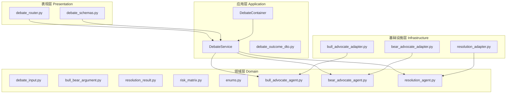

**图表来源**
- [src/modules/debate/presentation/rest/debate_router.py](file://src/modules/debate/presentation/rest/debate_router.py#L1-L124)
- [src/modules/debate/application/services/debate_service.py](file://src/modules/debate/application/services/debate_service.py#L1-L67)
- [src/modules/debate/container.py](file://src/modules/debate/container.py#L1-L43)

**章节来源**
- [src/modules/debate/__init__.py](file://src/modules/debate/__init__.py#L1-L2)
- [src/modules/debate/container.py](file://src/modules/debate/container.py#L1-L43)

## 核心组件

### 1. DebateService - 应用服务

DebateService是辩论流程的核心协调器，负责编排整个三阶段辩论过程：

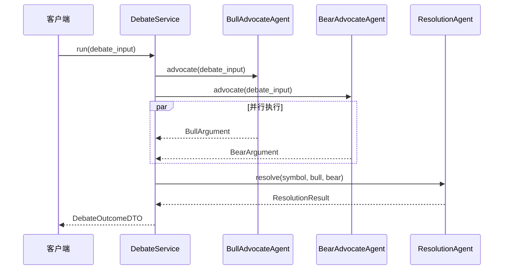

**图表来源**
- [src/modules/debate/application/services/debate_service.py](file://src/modules/debate/application/services/debate_service.py#L35-L66)

### 2. 数据传输对象(DTO)

辩论模块定义了完整的数据传输结构：

| DTO名称 | 用途 | 关键字段 |
|---------|------|----------|
| DebateInput | 辩论输入 | symbol, expert_summaries |
| BullArgument | 多头论证 | core_thesis, supporting_arguments, acknowledged_risks |
| BearArgument | 空头论证 | core_thesis, supporting_arguments, acknowledged_strengths |
| ResolutionResult | 冲突消解结果 | direction, confidence, risk_matrix |
| DebateOutcomeDTO | 最终输出 | symbol, direction, bull_case, bear_case |

**章节来源**
- [src/modules/debate/application/dtos/debate_outcome_dto.py](file://src/modules/debate/application/dtos/debate_outcome_dto.py#L27-L37)
- [src/modules/debate/domain/dtos/debate_input.py](file://src/modules/debate/domain/dtos/debate_input.py#L23-L27)
- [src/modules/debate/domain/dtos/bull_bear_argument.py](file://src/modules/debate/domain/dtos/bull_bear_argument.py#L9-L28)
- [src/modules/debate/domain/dtos/resolution_result.py](file://src/modules/debate/domain/dtos/resolution_result.py#L11-L20)

## 架构概览

辩论模块采用Clean Architecture设计，严格分离关注点：

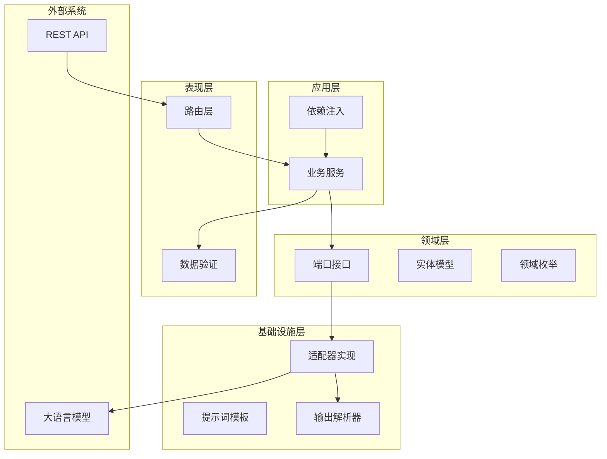

**图表来源**
- [src/modules/debate/container.py](file://src/modules/debate/container.py#L25-L42)
- [src/modules/debate/application/services/debate_service.py](file://src/modules/debate/application/services/debate_service.py#L17-L33)

## 详细组件分析

### 1. 智能体适配器

#### BullAdvocateAgentAdapter
多头论证智能体负责从各个专家的摘要中构建看涨观点：

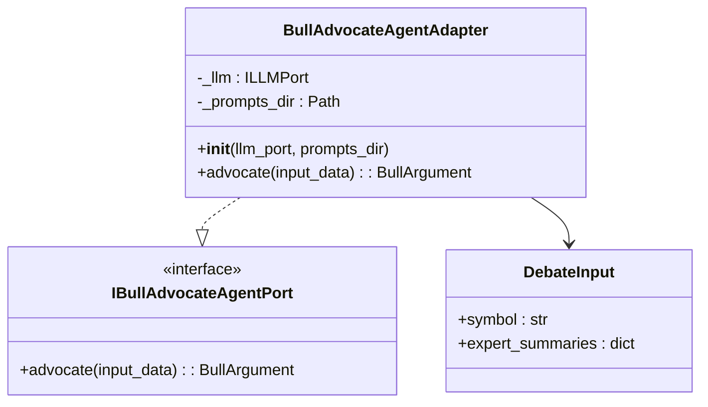

**图表来源**
- [src/modules/debate/infrastructure/adapters/bull_advocate_agent_adapter.py](file://src/modules/debate/infrastructure/adapters/bull_advocate_agent_adapter.py#L35-L71)
- [src/modules/debate/domain/ports/bull_advocate_agent.py](file://src/modules/debate/domain/ports/bull_advocate_agent.py#L12-L18)

#### BearAdvocateAgentAdapter
空头论证智能体负责从各个专家的摘要中构建看跌观点：

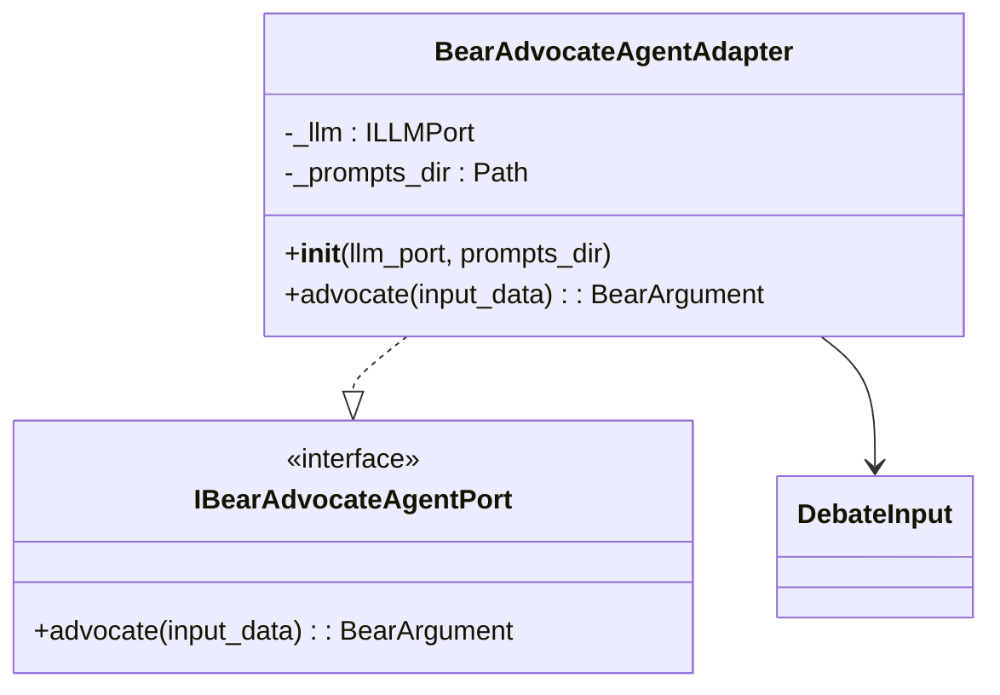

**图表来源**
- [src/modules/debate/infrastructure/adapters/bear_advocate_agent_adapter.py](file://src/modules/debate/infrastructure/adapters/bear_advocate_agent_adapter.py#L35-L71)
- [src/modules/debate/domain/ports/bear_advocate_agent.py](file://src/modules/debate/domain/ports/bear_advocate_agent.py#L12-L18)

#### ResolutionAgentAdapter
冲突消解智能体负责综合分析多空双方论证，生成最终裁决：

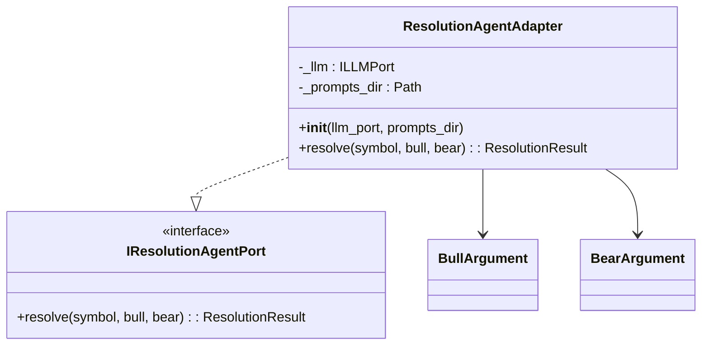

**图表来源**
- [src/modules/debate/infrastructure/adapters/resolution_agent_adapter.py](file://src/modules/debate/infrastructure/adapters/resolution_agent_adapter.py#L30-L66)
- [src/modules/debate/domain/ports/resolution_agent.py](file://src/modules/debate/domain/ports/resolution_agent.py#L12-L23)

### 2. 领域模型

#### 专家摘要模型
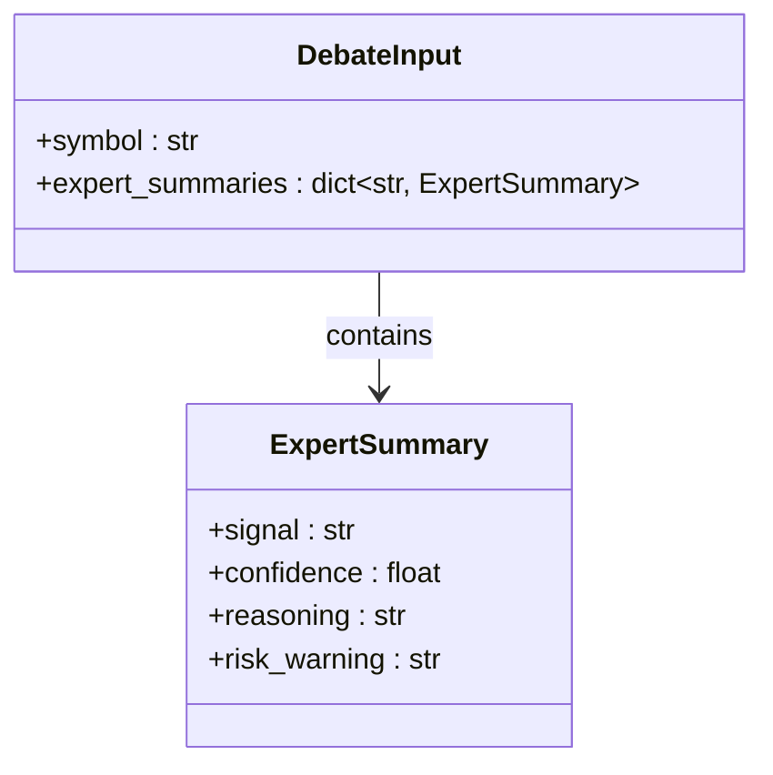

**图表来源**
- [src/modules/debate/domain/dtos/debate_input.py](file://src/modules/debate/domain/dtos/debate_input.py#L9-L27)

#### 风险矩阵模型
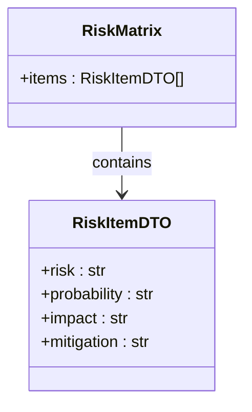

**图表来源**
- [src/modules/debate/domain/dtos/risk_matrix.py](file://src/modules/debate/domain/dtos/risk_matrix.py#L9-L15)

### 3. REST API接口

#### 请求/响应模型
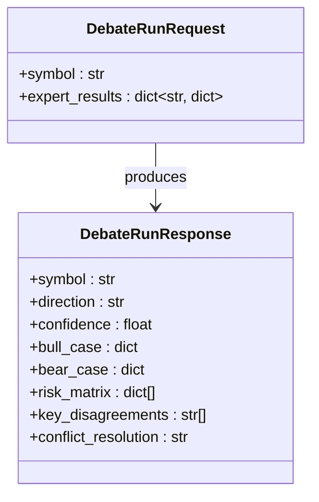

**图表来源**
- [src/modules/debate/presentation/rest/debate_schemas.py](file://src/modules/debate/presentation/rest/debate_schemas.py#L9-L29)

**章节来源**
- [src/modules/debate/presentation/rest/debate_router.py](file://src/modules/debate/presentation/rest/debate_router.py#L85-L123)
- [src/modules/debate/presentation/rest/debate_schemas.py](file://src/modules/debate/presentation/rest/debate_schemas.py#L1-L30)

## 依赖关系分析

### 1. 组件依赖图

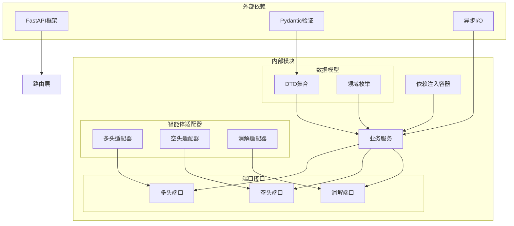

**图表来源**
- [src/modules/debate/container.py](file://src/modules/debate/container.py#L25-L42)
- [src/modules/debate/application/services/debate_service.py](file://src/modules/debate/application/services/debate_service.py#L17-L33)

### 2. 数据流分析

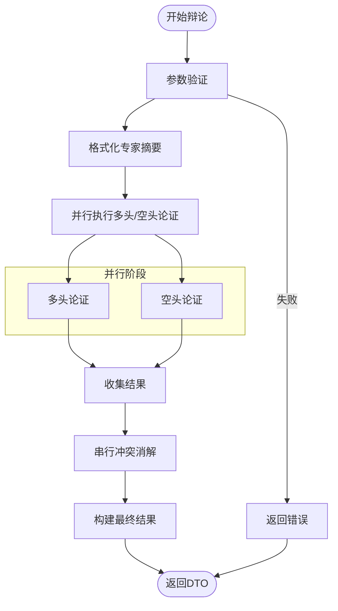

**图表来源**
- [src/modules/debate/application/services/debate_service.py](file://src/modules/debate/application/services/debate_service.py#L35-L66)

**章节来源**
- [src/modules/debate/container.py](file://src/modules/debate/container.py#L19-L22)
- [src/modules/debate/application/services/debate_service.py](file://src/modules/debate/application/services/debate_service.py#L4-L14)

## 性能考虑

### 1. 异步并发优化

- **并行执行策略**：多头和空头论证使用`asyncio.gather()`实现真正的并行执行
- **温度参数控制**：LLM调用时使用较低的temperature值(0.3)提高推理稳定性
- **内存管理**：及时释放中间结果，避免内存泄漏

### 2. 缓存策略

- **提示词缓存**：提示词模板在进程启动时加载到内存
- **专家摘要缓存**：重复的专家摘要可以考虑本地缓存
- **LLM调用优化**：合理设置temperature和max_tokens

### 3. 错误处理

- **超时控制**：为LLM调用设置合理的超时时间
- **重试机制**：网络异常时提供有限次重试
- **降级策略**：部分功能失败时的优雅降级

## 故障排除指南

### 1. 常见错误类型

| 错误类型 | 触发条件 | 处理建议 |
|----------|----------|----------|
| LLMOutputParseError | LLM输出格式不符合预期 | 检查提示词模板，增加输出格式约束 |
| BadRequestException | 输入参数验证失败 | 检查symbol和expert_results格式 |
| NetworkTimeout | LLM服务响应超时 | 增加超时时间，检查网络连接 |
| MemoryError | 大量并发请求导致内存不足 | 限制并发数量，优化内存使用 |

### 2. 调试方法

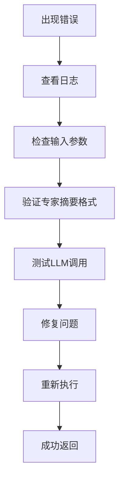

**章节来源**
- [src/modules/debate/presentation/rest/debate_router.py](file://src/modules/debate/presentation/rest/debate_router.py#L116-L123)

### 3. 监控指标

- **响应时间**：记录从接收请求到返回结果的总耗时
- **成功率**：统计成功和失败的请求比例
- **并发数**：监控同时运行的辩论任务数量
- **LLM费用**：跟踪大语言模型调用的token消耗

## 结论

辩论模块通过精心设计的架构实现了高效的多智能体协作系统。其核心优势包括：

1. **清晰的架构分层**：严格遵循DDD原则，职责分离明确
2. **高性能并发处理**：利用异步编程实现多智能体并行执行
3. **标准化的数据模型**：统一的DTO结构确保系统一致性
4. **灵活的扩展性**：端口适配器模式便于新智能体的添加

该模块为整个股票研究系统提供了强大的分析能力，能够有效整合多个专家的分析结果，生成全面的投资决策支持信息。