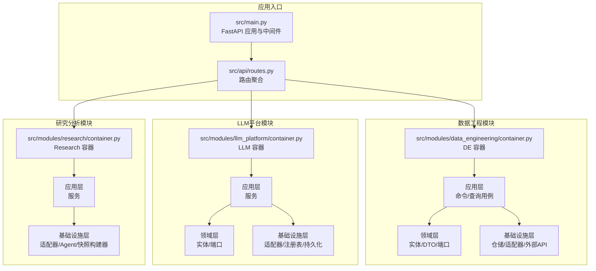
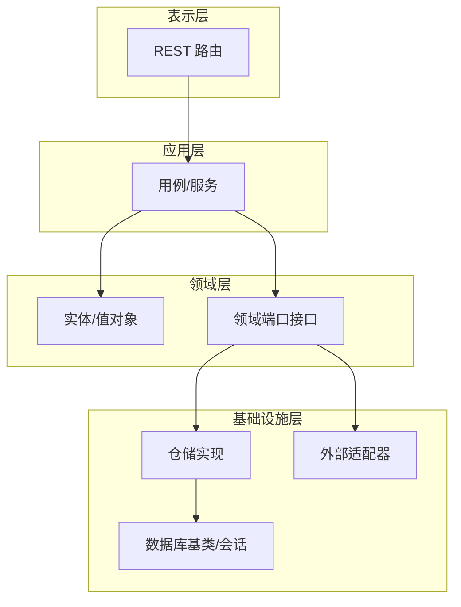
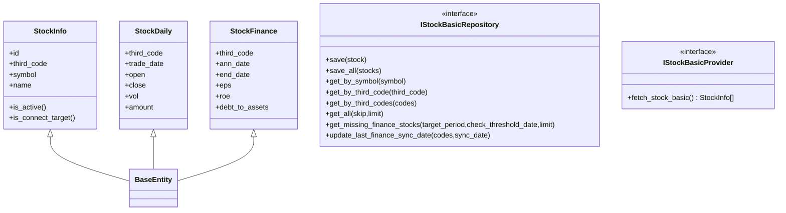
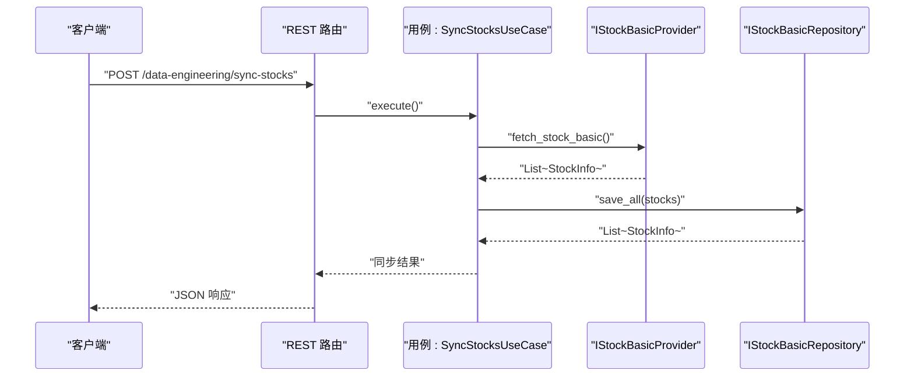
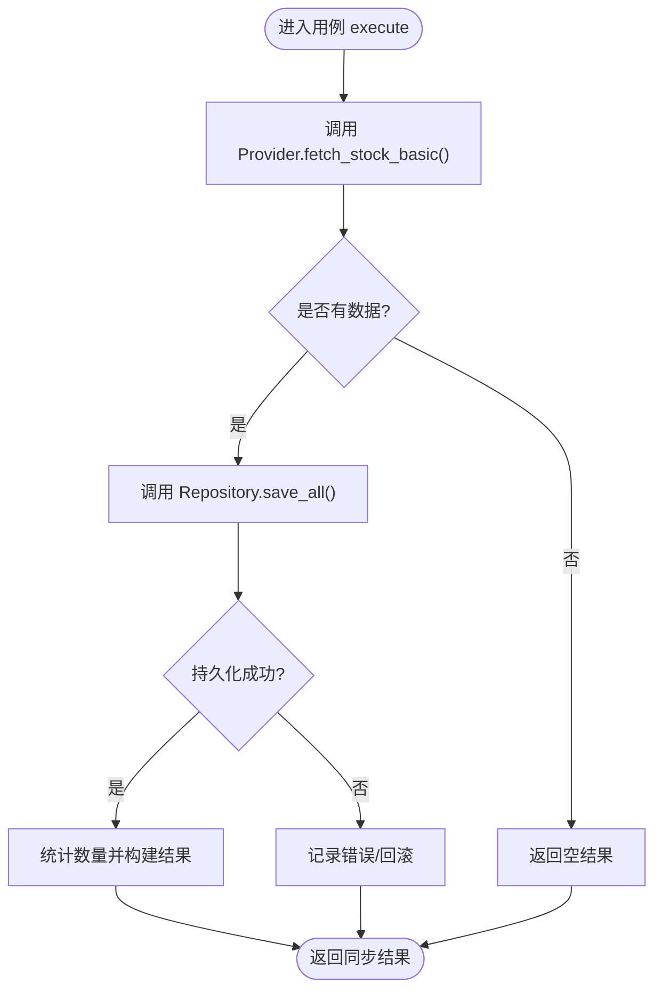
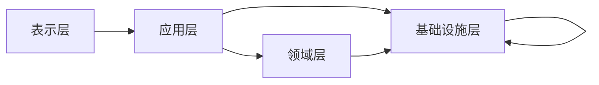

# 领域驱动设计架构

<cite>
**本文档引用的文件**
- [src/main.py](file://src/main.py)
- [src/api/routes.py](file://src/api/routes.py)
- [src/modules/data_engineering/container.py](file://src/modules/data_engineering/container.py)
- [src/modules/llm_platform/container.py](file://src/modules/llm_platform/container.py)
- [src/modules/research/container.py](file://src/modules/research/container.py)
- [src/shared/domain/base_entity.py](file://src/shared/domain/base_entity.py)
- [src/modules/data_engineering/domain/model/stock.py](file://src/modules/data_engineering/domain/model/stock.py)
- [src/modules/data_engineering/domain/model/stock_daily.py](file://src/modules/data_engineering/domain/model/stock_daily.py)
- [src/modules/data_engineering/domain/model/financial_report.py](file://src/modules/data_engineering/domain/model/financial_report.py)
- [src/modules/data_engineering/application/commands/sync_stock_list_cmd.py](file://src/modules/data_engineering/application/commands/sync_stock_list_cmd.py)
- [src/modules/data_engineering/application/queries/get_stock_basic_info.py](file://src/modules/data_engineering/application/queries/get_stock_basic_info.py)
- [src/modules/data_engineering/domain/ports/repositories/stock_basic_repo.py](file://src/modules/data_engineering/domain/ports/repositories/stock_basic_repo.py)
- [src/modules/data_engineering/domain/ports/providers/stock_basic_provider.py](file://src/modules/data_engineering/domain/ports/providers/stock_basic_provider.py)
- [src/shared/infrastructure/base_repository.py](file://src/shared/infrastructure/base_repository.py)
- [src/shared/infrastructure/db/base.py](file://src/shared/infrastructure/db/base.py)
</cite>

## 目录
1. [引言](#引言)
2. [项目结构](#项目结构)
3. [核心组件](#核心组件)
4. [架构总览](#架构总览)
5. [详细组件分析](#详细组件分析)
6. [依赖关系分析](#依赖关系分析)
7. [性能考虑](#性能考虑)
8. [故障排查指南](#故障排查指南)
9. [结论](#结论)
10. [附录](#附录)

## 引言
本文件面向“股票助手”项目，基于领域驱动设计（DDD）理念，系统阐述项目的四层架构：表示层（Presentation Layer）、应用层（Application Layer）、领域层（Domain Layer）与基础设施层（Infrastructure Layer）。文档重点说明每层职责、边界与交互方式；解释实体、值对象、聚合根、领域服务等核心概念；并结合仓储模式、工厂模式与端口适配器模式，给出可落地的实现路径与可视化图示。

## 项目结构
项目采用按功能模块划分的多模块组织方式，每个业务模块（数据工程、LLM平台、研究分析）均遵循DDD四层结构，模块之间通过“容器”进行解耦装配，避免直接依赖底层实现。

图表来源
- [src/main.py](file://src/main.py#L1-L75)
- [src/api/routes.py](file://src/api/routes.py#L1-L13)
- [src/modules/data_engineering/container.py](file://src/modules/data_engineering/container.py#L1-L59)
- [src/modules/llm_platform/container.py](file://src/modules/llm_platform/container.py#L1-L68)
- [src/modules/research/container.py](file://src/modules/research/container.py#L1-L139)

章节来源
- [src/main.py](file://src/main.py#L1-L75)
- [src/api/routes.py](file://src/api/routes.py#L1-L13)

## 核心组件
- 表示层（Presentation Layer）
  - FastAPI 应用与中间件：负责请求接入、CORS、异常处理与路由聚合。
  - 各模块 REST 路由：对外暴露查询与作业接口。
- 应用层（Application Layer）
  - 用例（Use Cases）：封装业务流程，协调领域对象与基础设施，不包含业务规则。
  - 服务（Services）：跨多个实体/聚合的业务能力封装。
- 领域层（Domain Layer）
  - 实体（Entity）：具有唯一标识与生命周期的对象，如股票基础信息、日线行情、财务指标。
  - 值对象（Value Object）：无唯一标识、以属性组合表达含义的对象（本项目以 Pydantic 模型体现）。
  - 聚合根（Aggregate Root）：StockInfo、StockDaily、StockFinance 等。
  - 领域服务（Domain Service）：在应用层编排，但不持有状态的业务逻辑封装。
- 基础设施层（Infrastructure Layer）
  - 仓储（Repository）：抽象数据访问接口，实现类对接数据库。
  - 外部适配器：对接第三方服务（如 Tushare）。
  - 配置与工具：数据库基类、通用仓储基类、调度器等。

章节来源
- [src/shared/domain/base_entity.py](file://src/shared/domain/base_entity.py#L1-L18)
- [src/modules/data_engineering/domain/model/stock.py](file://src/modules/data_engineering/domain/model/stock.py#L1-L63)
- [src/modules/data_engineering/domain/model/stock_daily.py](file://src/modules/data_engineering/domain/model/stock_daily.py#L1-L42)
- [src/modules/data_engineering/domain/model/financial_report.py](file://src/modules/data_engineering/domain/model/financial_report.py#L1-L117)
- [src/shared/infrastructure/base_repository.py](file://src/shared/infrastructure/base_repository.py#L1-L125)
- [src/shared/infrastructure/db/base.py](file://src/shared/infrastructure/db/base.py#L1-L20)

## 架构总览
下图展示四层架构在模块内的分布与交互方向，强调“依赖倒置”：上层仅依赖下层的抽象，应用层协调领域与基础设施，基础设施对上层透明。

图表来源
- [src/modules/data_engineering/application/commands/sync_stock_list_cmd.py](file://src/modules/data_engineering/application/commands/sync_stock_list_cmd.py#L1-L49)
- [src/modules/data_engineering/application/queries/get_stock_basic_info.py](file://src/modules/data_engineering/application/queries/get_stock_basic_info.py#L1-L43)
- [src/modules/data_engineering/domain/ports/repositories/stock_basic_repo.py](file://src/modules/data_engineering/domain/ports/repositories/stock_basic_repo.py#L1-L30)
- [src/modules/data_engineering/domain/ports/providers/stock_basic_provider.py](file://src/modules/data_engineering/domain/ports/providers/stock_basic_provider.py#L1-L10)
- [src/shared/infrastructure/base_repository.py](file://src/shared/infrastructure/base_repository.py#L1-L125)
- [src/shared/infrastructure/db/base.py](file://src/shared/infrastructure/db/base.py#L1-L20)

## 详细组件分析

### 数据工程模块（Data Engineering）
- 容器（Composition Root）
  - DataEngineeringContainer：集中装配查询用例与仓储实现，向 Research 等模块提供能力而不直接依赖基础设施实现。
- 应用层
  - 查询用例：如按标的获取日线、财务、基础信息与估值日线等。
  - 命令用例：如同步股票列表。
- 领域层
  - 实体：StockInfo、StockDaily、StockFinance。
  - 端口接口：IStockBasicRepository、IStockBasicProvider。
- 基础设施层
  - 仓储实现：PostgreSQL 对应的仓库。
  - 外部适配器：Tushare 客户端与转换器。
  - 数据库基类：统一 ORM 基类。

图表来源
- [src/shared/domain/base_entity.py](file://src/shared/domain/base_entity.py#L1-L18)
- [src/modules/data_engineering/domain/model/stock.py](file://src/modules/data_engineering/domain/model/stock.py#L1-L63)
- [src/modules/data_engineering/domain/model/stock_daily.py](file://src/modules/data_engineering/domain/model/stock_daily.py#L1-L42)
- [src/modules/data_engineering/domain/model/financial_report.py](file://src/modules/data_engineering/domain/model/financial_report.py#L1-L117)
- [src/modules/data_engineering/domain/ports/repositories/stock_basic_repo.py](file://src/modules/data_engineering/domain/ports/repositories/stock_basic_repo.py#L1-L30)
- [src/modules/data_engineering/domain/ports/providers/stock_basic_provider.py](file://src/modules/data_engineering/domain/ports/providers/stock_basic_provider.py#L1-L10)

图表来源
- [src/modules/data_engineering/application/commands/sync_stock_list_cmd.py](file://src/modules/data_engineering/application/commands/sync_stock_list_cmd.py#L1-L49)
- [src/modules/data_engineering/domain/ports/providers/stock_basic_provider.py](file://src/modules/data_engineering/domain/ports/providers/stock_basic_provider.py#L1-L10)
- [src/modules/data_engineering/domain/ports/repositories/stock_basic_repo.py](file://src/modules/data_engineering/domain/ports/repositories/stock_basic_repo.py#L1-L30)

图表来源
- [src/modules/data_engineering/application/commands/sync_stock_list_cmd.py](file://src/modules/data_engineering/application/commands/sync_stock_list_cmd.py#L1-L49)

章节来源
- [src/modules/data_engineering/container.py](file://src/modules/data_engineering/container.py#L1-L59)
- [src/modules/data_engineering/application/commands/sync_stock_list_cmd.py](file://src/modules/data_engineering/application/commands/sync_stock_list_cmd.py#L1-L49)
- [src/modules/data_engineering/application/queries/get_stock_basic_info.py](file://src/modules/data_engineering/application/queries/get_stock_basic_info.py#L1-L43)
- [src/modules/data_engineering/domain/model/stock.py](file://src/modules/data_engineering/domain/model/stock.py#L1-L63)
- [src/modules/data_engineering/domain/model/stock_daily.py](file://src/modules/data_engineering/domain/model/stock_daily.py#L1-L42)
- [src/modules/data_engineering/domain/model/financial_report.py](file://src/modules/data_engineering/domain/model/financial_report.py#L1-L117)
- [src/modules/data_engineering/domain/ports/repositories/stock_basic_repo.py](file://src/modules/data_engineering/domain/ports/repositories/stock_basic_repo.py#L1-L30)
- [src/modules/data_engineering/domain/ports/providers/stock_basic_provider.py](file://src/modules/data_engineering/domain/ports/providers/stock_basic_provider.py#L1-L10)

### LLM平台模块（LLM Platform）
- 容器（Composition Root）
  - LLMPlatformContainer：提供 LLM 注册表、配置服务与 Web 搜索服务的装配。
- 应用层
  - LLMService、ConfigService、WebSearchService。
- 领域层
  - LLM 配置实体与端口。
- 基础设施层
  - 适配器：OpenAI、博查 Web 搜索。
  - 注册表与持久化仓储。

章节来源
- [src/modules/llm_platform/container.py](file://src/modules/llm_platform/container.py#L1-L68)

### 研究分析模块（Research）
- 容器（Composition Root）
  - ResearchContainer：整合 DataEngineering 与 LLMPlatform 容器，装配三大智能角色服务（技术分析师、财务审计员、估值建模师、宏观情报员）。
- 应用层
  - 技术分析师服务、财务审计员服务、估值建模师服务、宏观情报员服务。
- 基础设施层
  - 各类适配器（行情、财务、估值、LLM、宏观数据）、指标计算器、快照构建器、Agent 适配器。

章节来源
- [src/modules/research/container.py](file://src/modules/research/container.py#L1-L139)

### 基础设施与通用能力
- 通用仓储基类
  - 提供 get/get_all/create/update/delete/upsert_all 等通用 CRUD 与批量 Upsert（PostgreSQL ON CONFLICT）。
- 数据库基类
  - 统一 ORM 基类，自动生成表名与公共字段。

章节来源
- [src/shared/infrastructure/base_repository.py](file://src/shared/infrastructure/base_repository.py#L1-L125)
- [src/shared/infrastructure/db/base.py](file://src/shared/infrastructure/db/base.py#L1-L20)

## 依赖关系分析
- 依赖方向
  - 表示层依赖应用层（通过路由调用用例/服务）。
  - 应用层依赖领域层（使用实体/DTO/端口）。
  - 应用层依赖基础设施层（仓储/适配器）。
  - 基础设施层向上层透明，仅暴露抽象接口。
- 容器装配
  - 各模块容器负责组装用例与仓储实现，避免模块间直接耦合。
- 端口与适配器
  - 领域通过抽象端口隔离变化，基础设施通过适配器实现具体对接。

图表来源
- [src/api/routes.py](file://src/api/routes.py#L1-L13)
- [src/modules/data_engineering/container.py](file://src/modules/data_engineering/container.py#L1-L59)
- [src/modules/llm_platform/container.py](file://src/modules/llm_platform/container.py#L1-L68)
- [src/modules/research/container.py](file://src/modules/research/container.py#L1-L139)

章节来源
- [src/api/routes.py](file://src/api/routes.py#L1-L13)

## 性能考虑
- 批量 Upsert
  - 通用仓储基类提供批量 Upsert，支持分批提交，减少事务开销与网络往返。
- 查询优化
  - 使用仓储提供的分页与条件查询，避免一次性加载大量数据。
- 异步 I/O
  - 应用层与基础设施层广泛采用异步编程模型，提升并发吞吐。
- 缓存与调度
  - 启动时初始化调度器与注册表，减少运行时开销。

章节来源
- [src/shared/infrastructure/base_repository.py](file://src/shared/infrastructure/base_repository.py#L75-L125)
- [src/main.py](file://src/main.py#L21-L47)

## 故障排查指南
- 同步失败定位
  - 检查用例执行日志与返回结果，确认 Provider 是否返回数据、Repository 是否持久化成功。
- 数据一致性
  - 使用 Upsert 批量写入时，关注唯一键冲突与排除字段配置。
- 接口异常
  - 全局异常中间件已接入，查看日志定位具体异常点。
- 启动/关闭问题
  - 关注调度器与 LLM 注册表的初始化与关闭流程。

章节来源
- [src/modules/data_engineering/application/commands/sync_stock_list_cmd.py](file://src/modules/data_engineering/application/commands/sync_stock_list_cmd.py#L24-L48)
- [src/shared/infrastructure/base_repository.py](file://src/shared/infrastructure/base_repository.py#L75-L125)
- [src/main.py](file://src/main.py#L21-L47)

## 结论
本项目通过清晰的四层架构与容器装配，实现了领域与基础设施的解耦。实体与端口定义明确，仓储与适配器模式确保了扩展性与可测试性。建议持续完善领域模型的不变式与业务规则表达，并在应用层进一步沉淀跨聚合的业务编排逻辑，以增强系统的内聚性与可维护性。

## 附录
- 关键文件索引
  - 应用入口与路由：[src/main.py](file://src/main.py#L1-L75)、[src/api/routes.py](file://src/api/routes.py#L1-L13)
  - 数据工程容器与用例：[src/modules/data_engineering/container.py](file://src/modules/data_engineering/container.py#L1-L59)、[src/modules/data_engineering/application/commands/sync_stock_list_cmd.py](file://src/modules/data_engineering/application/commands/sync_stock_list_cmd.py#L1-L49)、[src/modules/data_engineering/application/queries/get_stock_basic_info.py](file://src/modules/data_engineering/application/queries/get_stock_basic_info.py#L1-L43)
  - 领域模型与端口：[src/shared/domain/base_entity.py](file://src/shared/domain/base_entity.py#L1-L18)、[src/modules/data_engineering/domain/model/stock.py](file://src/modules/data_engineering/domain/model/stock.py#L1-L63)、[src/modules/data_engineering/domain/model/stock_daily.py](file://src/modules/data_engineering/domain/model/stock_daily.py#L1-L42)、[src/modules/data_engineering/domain/model/financial_report.py](file://src/modules/data_engineering/domain/model/financial_report.py#L1-L117)、[src/modules/data_engineering/domain/ports/repositories/stock_basic_repo.py](file://src/modules/data_engineering/domain/ports/repositories/stock_basic_repo.py#L1-L30)、[src/modules/data_engineering/domain/ports/providers/stock_basic_provider.py](file://src/modules/data_engineering/domain/ports/providers/stock_basic_provider.py#L1-L10)
  - 基础设施与通用能力：[src/shared/infrastructure/base_repository.py](file://src/shared/infrastructure/base_repository.py#L1-L125)、[src/shared/infrastructure/db/base.py](file://src/shared/infrastructure/db/base.py#L1-L20)
  - LLM平台与研究容器：[src/modules/llm_platform/container.py](file://src/modules/llm_platform/container.py#L1-L68)、[src/modules/research/container.py](file://src/modules/research/container.py#L1-L139)