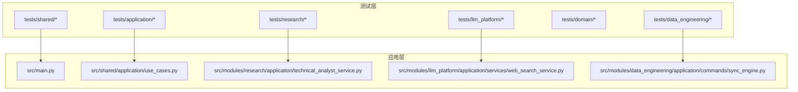
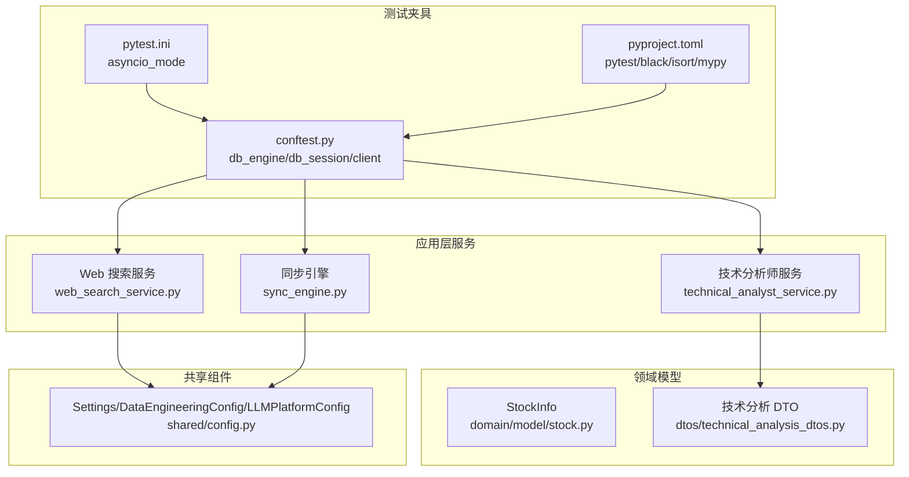
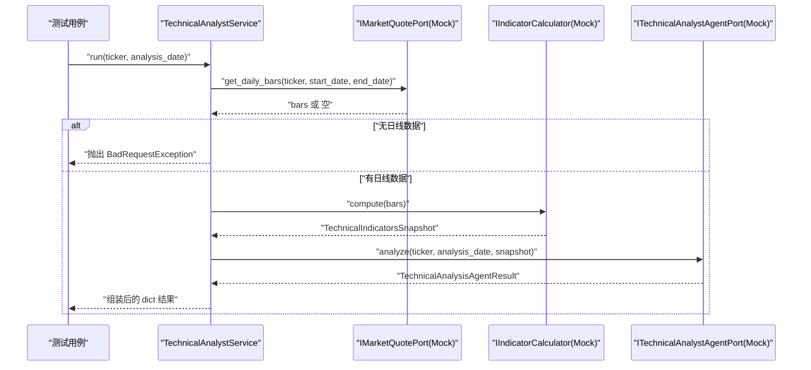
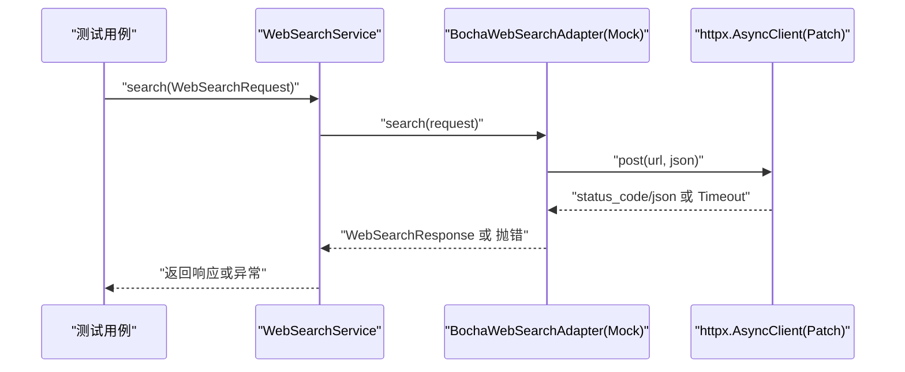
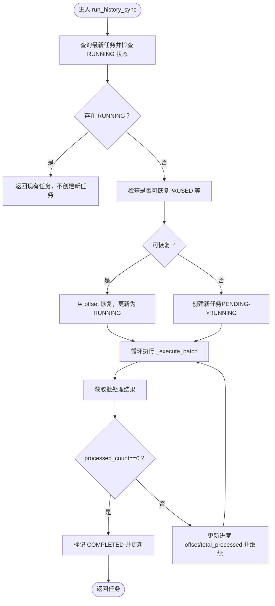
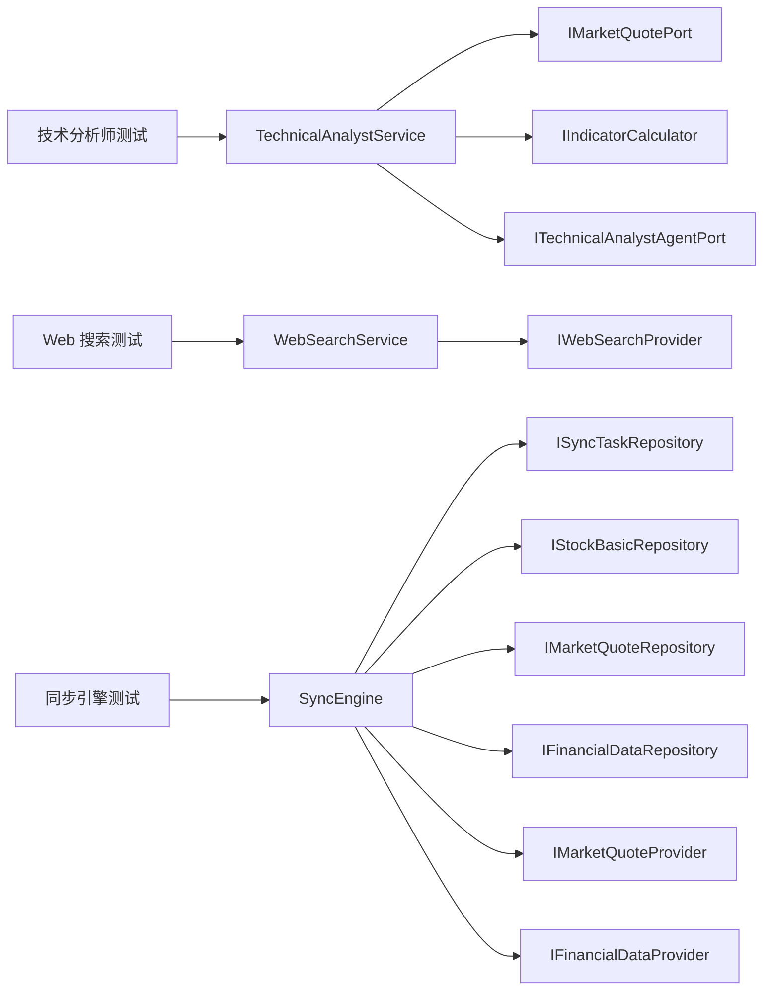

# 单元测试实践

<cite>
**本文引用的文件**
- [tests/conftest.py](file://tests/conftest.py)
- [pytest.ini](file://pytest.ini)
- [pyproject.toml](file://pyproject.toml)
- [src/main.py](file://src/main.py)
- [tests/application/test_get_stock_basic_info.py](file://tests/application/test_get_stock_basic_info.py)
- [tests/data_engineering/application/test_sync_engine.py](file://tests/data_engineering/application/test_sync_engine.py)
- [src/modules/data_engineering/application/commands/sync_engine.py](file://src/modules/data_engineering/application/commands/sync_engine.py)
- [src/shared/application/use_cases.py](file://src/shared/application/use_cases.py)
- [tests/domain/test_stock.py](file://tests/domain/test_stock.py)
- [tests/research/application/test_technical_analyst_service.py](file://tests/research/application/test_technical_analyst_service.py)
- [src/modules/research/application/technical_analyst_service.py](file://src/modules/research/application/technical_analyst_service.py)
- [tests/llm_platform/test_web_search.py](file://tests/llm_platform/test_web_search.py)
- [src/modules/llm_platform/application/services/web_search_service.py](file://src/modules/llm_platform/application/services/web_search_service.py)
- [tests/shared/test_config.py](file://tests/shared/test_config.py)
</cite>

## 目录
1. [引言](#引言)
2. [项目结构](#项目结构)
3. [核心组件](#核心组件)
4. [架构总览](#架构总览)
5. [详细组件分析](#详细组件分析)
6. [依赖分析](#依赖分析)
7. [性能考虑](#性能考虑)
8. [故障排查指南](#故障排查指南)
9. [结论](#结论)
10. [附录](#附录)

## 引言
本指南面向“股票助手”项目，系统化总结单元测试的编写规范与最佳实践，覆盖测试用例设计原则、断言策略、测试数据准备、Mock 对象使用（外部依赖模拟、异步函数测试、数据库操作模拟）、各模块单元测试实现（应用层服务、领域模型、共享组件），以及测试覆盖率与代码质量标准、异常与边界条件测试、测试重构与维护策略。文档中的图示均基于仓库实际源码映射，确保读者能将理论与实践无缝衔接。

## 项目结构
项目采用分层与领域驱动设计（DDD）相结合的组织方式：
- 应用层：封装业务用例与服务编排，负责协调领域模型与基础设施。
- 领域层：实体、值对象与聚合根，表达核心业务规则。
- 基础设施层：外部依赖适配器、存储实现、配置等。
- 共享层：跨模块通用的抽象、异常、配置与基础设施工具。
- 测试层：按模块划分，覆盖应用层、领域层、基础设施与集成测试。

图表来源
- [src/main.py](file://src/main.py#L1-L75)
- [src/shared/application/use_cases.py](file://src/shared/application/use_cases.py#L1-L21)
- [src/modules/research/application/technical_analyst_service.py](file://src/modules/research/application/technical_analyst_service.py#L1-L73)
- [src/modules/llm_platform/application/services/web_search_service.py](file://src/modules/llm_platform/application/services/web_search_service.py#L1-L57)
- [src/modules/data_engineering/application/commands/sync_engine.py](file://src/modules/data_engineering/application/commands/sync_engine.py#L1-L280)

章节来源
- [tests/conftest.py](file://tests/conftest.py#L1-L56)
- [pytest.ini](file://pytest.ini#L1-L5)
- [pyproject.toml](file://pyproject.toml#L1-L22)

## 核心组件
- 测试夹具与环境
  - 数据库引擎与会话：使用异步引擎与事务回滚，确保测试隔离与可重复性。
  - HTTP 客户端：基于 FastAPI 应用创建异步客户端，便于 API 级别测试。
- 异步测试配置：pytest-asyncio 自动模式，统一事件循环作用域。
- 代码风格与静态检查：Black、isort、mypy、pytest 配置集中于 pyproject.toml 与 pytest.ini。

章节来源
- [tests/conftest.py](file://tests/conftest.py#L22-L56)
- [pytest.ini](file://pytest.ini#L1-L5)
- [pyproject.toml](file://pyproject.toml#L1-L22)

## 架构总览
单元测试围绕“应用层服务”“领域模型”“共享组件”三大维度展开，通过 Mock 外部依赖与数据库，聚焦业务逻辑正确性与边界条件处理。

图表来源
- [tests/conftest.py](file://tests/conftest.py#L22-L56)
- [pytest.ini](file://pytest.ini#L1-L5)
- [pyproject.toml](file://pyproject.toml#L16-L22)
- [src/modules/research/application/technical_analyst_service.py](file://src/modules/research/application/technical_analyst_service.py#L1-L73)
- [src/modules/llm_platform/application/services/web_search_service.py](file://src/modules/llm_platform/application/services/web_search_service.py#L1-L57)
- [src/modules/data_engineering/application/commands/sync_engine.py](file://src/modules/data_engineering/application/commands/sync_engine.py#L1-L280)

## 详细组件分析

### 应用层服务测试：技术分析师服务
- 测试目标
  - 输入校验：缺失 ticker 或 analysis_date 时抛出明确错误。
  - 业务流程：获取日线 → 计算指标 → 调用 Agent → 组装响应。
  - 边界条件：无日线数据时拒绝并给出引导信息。
- Mock 策略
  - 通过 AsyncMock/MagicMock 模拟市场报价端口、指标计算器与技术分析师 Agent 端口。
  - 断言调用参数与返回结构，确保编排链路正确。
- 断言策略
  - 结构断言：信号、置信度、关键支撑阻力位、风险提示等字段存在且合理。
  - 行为断言：各端口被正确调用，参数匹配预期。

图表来源
- [tests/research/application/test_technical_analyst_service.py](file://tests/research/application/test_technical_analyst_service.py#L56-L91)
- [src/modules/research/application/technical_analyst_service.py](file://src/modules/research/application/technical_analyst_service.py#L30-L72)

章节来源
- [tests/research/application/test_technical_analyst_service.py](file://tests/research/application/test_technical_analyst_service.py#L1-L152)
- [src/modules/research/application/technical_analyst_service.py](file://src/modules/research/application/technical_analyst_service.py#L1-L73)

### 应用层服务测试：Web 搜索服务
- 测试目标
  - 适配器映射：正常/空结果/参数传递/错误码/超时/配置缺失/防御性处理。
  - 服务委托：仅依赖 Provider 抽象，日志记录。
  - 配置：Settings/Bocha 配置字段存在与默认值。
  - DTO 转换：响应转为 Prompt 上下文格式。
- Mock 策略
  - 使用 httpx.AsyncClient 的 patch 替换网络调用，控制状态码与 JSON 响应。
  - 使用 AsyncMock/Mock 模拟 Provider 与 Logger。
- 断言策略
  - 结构断言：结果数量、字段映射、上下文格式。
  - 异常断言：针对不同错误路径抛出特定异常类型。

图表来源
- [tests/llm_platform/test_web_search.py](file://tests/llm_platform/test_web_search.py#L35-L195)
- [src/modules/llm_platform/application/services/web_search_service.py](file://src/modules/llm_platform/application/services/web_search_service.py#L32-L56)

章节来源
- [tests/llm_platform/test_web_search.py](file://tests/llm_platform/test_web_search.py#L1-L305)
- [src/modules/llm_platform/application/services/web_search_service.py](file://src/modules/llm_platform/application/services/web_search_service.py#L1-L57)

### 应用层服务测试：同步引擎
- 测试目标
  - 任务互斥：同类型 RUNNING 任务拒绝启动。
  - 断点续跑：从 PAUSED 任务 offset 恢复，不创建新任务。
  - 新任务创建：无历史任务时创建并标记为 RUNNING。
  - 批处理循环：直到某批返回 0，标记 COMPLETED。
- Mock 策略
  - 使用 AsyncMock 模拟任务/仓库与 Provider。
  - 使用 patch.object 对内部 _execute_batch 进行行为控制。
- 断言策略
  - 状态断言：任务状态流转（PENDING/RUNNING/COMPLETED/FAILED）。
  - 调用断言：仓库创建/更新次数与参数，批处理执行次数。

图表来源
- [tests/data_engineering/application/test_sync_engine.py](file://tests/data_engineering/application/test_sync_engine.py#L39-L124)
- [src/modules/data_engineering/application/commands/sync_engine.py](file://src/modules/data_engineering/application/commands/sync_engine.py#L47-L128)

章节来源
- [tests/data_engineering/application/test_sync_engine.py](file://tests/data_engineering/application/test_sync_engine.py#L1-L124)
- [src/modules/data_engineering/application/commands/sync_engine.py](file://src/modules/data_engineering/application/commands/sync_engine.py#L1-L280)

### 领域模型测试：StockInfo
- 测试目标
  - 实体创建：字段赋值与类型正确性。
  - 验证逻辑：缺失必填字段时抛出异常。
- 断言策略
  - 基本断言：字段值与类型。
  - 异常断言：构造函数触发 ValueError。

章节来源
- [tests/domain/test_stock.py](file://tests/domain/test_stock.py#L1-L30)

### 共享组件测试：配置
- 测试目标
  - Shared Settings：仅包含全局配置，不包含模块级配置。
  - DataEngineeringConfig：默认值与环境变量覆盖。
  - LLMPlatformConfig：默认值与相关字段存在。
- 断言策略
  - 属性断言：存在性与默认值。
  - 环境变量断言：覆盖后值变化。

章节来源
- [tests/shared/test_config.py](file://tests/shared/test_config.py#L1-L54)

### 应用层基类：UseCase
- 设计要点
  - BaseUseCase 定义统一 execute 接口，约束应用层用例的输入输出契约。
- 测试建议
  - 通过继承 BaseUseCase 的具体用例编写单元测试，重点验证 execute 的输入输出与异常分支。

章节来源
- [src/shared/application/use_cases.py](file://src/shared/application/use_cases.py#L1-L21)

## 依赖分析
- 测试对应用层服务的依赖
  - 技术分析师服务依赖市场报价端口、指标计算器与技术分析师 Agent 端口，测试通过 AsyncMock/MagicMock 模拟。
  - Web 搜索服务依赖 IWebSearchProvider，测试通过 AsyncMock 模拟 Provider。
  - 同步引擎依赖多个仓库与 Provider，测试通过 AsyncMock 模拟并 patch 内部方法控制流程。
- 测试对共享组件的依赖
  - 配置测试验证 Settings 与模块配置类的默认值与环境变量覆盖。

图表来源
- [tests/research/application/test_technical_analyst_service.py](file://tests/research/application/test_technical_analyst_service.py#L1-L152)
- [src/modules/research/application/technical_analyst_service.py](file://src/modules/research/application/technical_analyst_service.py#L1-L73)
- [tests/llm_platform/test_web_search.py](file://tests/llm_platform/test_web_search.py#L1-L305)
- [src/modules/llm_platform/application/services/web_search_service.py](file://src/modules/llm_platform/application/services/web_search_service.py#L1-L57)
- [tests/data_engineering/application/test_sync_engine.py](file://tests/data_engineering/application/test_sync_engine.py#L1-L124)
- [src/modules/data_engineering/application/commands/sync_engine.py](file://src/modules/data_engineering/application/commands/sync_engine.py#L1-L280)

## 性能考虑
- 异步测试
  - 使用 pytest-asyncio 自动模式，避免手动管理事件循环，提升测试执行效率。
- 数据库隔离
  - 使用事务回滚模式，避免真实写入与脏数据污染，提高测试稳定性。
- Mock 策略
  - 将外部依赖（HTTP、数据库、第三方 API）替换为内存态 Mock，显著降低 IO 成本。
- 批处理与并发
  - 对于批量同步场景，优先在测试中控制批大小与调用次数，避免过度并发导致资源争用。

## 故障排查指南
- 异步测试失败
  - 确认 pytest.ini 中 asyncio_mode 设置为 auto，且测试函数标注 asyncio。
- 数据库相关错误
  - 检查 conftest 中 db_engine 与 db_session 的创建与回滚逻辑，确保每个测试结束后回滚。
- 外部 API 调用失败
  - 使用 patch 替换 httpx.AsyncClient，构造期望的状态码与 JSON 响应，定位异常分支。
- 配置问题
  - 通过环境变量覆盖配置项，验证默认值与覆盖逻辑。

章节来源
- [pytest.ini](file://pytest.ini#L1-L5)
- [tests/conftest.py](file://tests/conftest.py#L22-L56)
- [tests/llm_platform/test_web_search.py](file://tests/llm_platform/test_web_search.py#L135-L176)
- [tests/shared/test_config.py](file://tests/shared/test_config.py#L35-L46)

## 结论
本指南提供了“股票助手”项目单元测试的系统化实践路径：以应用层服务为核心，结合领域模型与共享组件，通过合理的 Mock 策略与断言策略覆盖正常与异常、边界与集成场景。配合统一的异步测试配置与数据库隔离机制，能够有效保障代码质量与可维护性。

## 附录
- 测试覆盖率与代码质量标准（建议）
  - 覆盖率：应用层与关键业务逻辑达到 80%+，领域模型与共享组件达到 90%+。
  - 代码质量：遵循 Black、isort、mypy 规范；pytest 配置集中管理；测试命名清晰、断言明确。
- 测试异常与边界条件
  - 异常：针对缺失输入、无数据、网络错误、配置错误等场景编写独立用例。
  - 边界：空结果、最大/最小批大小、日期边界、空字符串与 None 值处理。
- 测试重构与维护
  - 提取公共 Mock 与工厂方法，减少重复；保持测试命名一致性；定期审查与精简冗余用例。