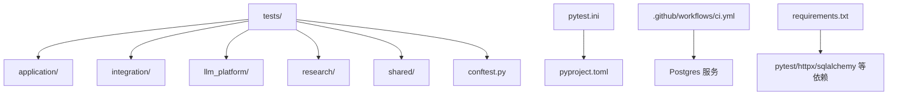
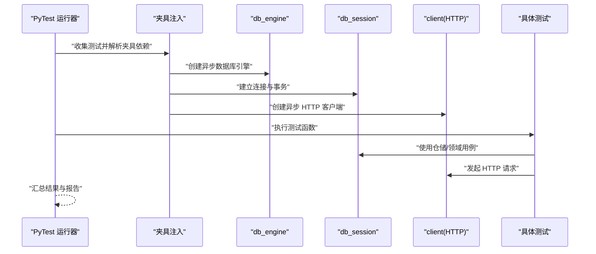
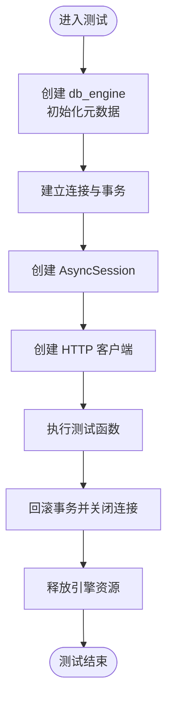
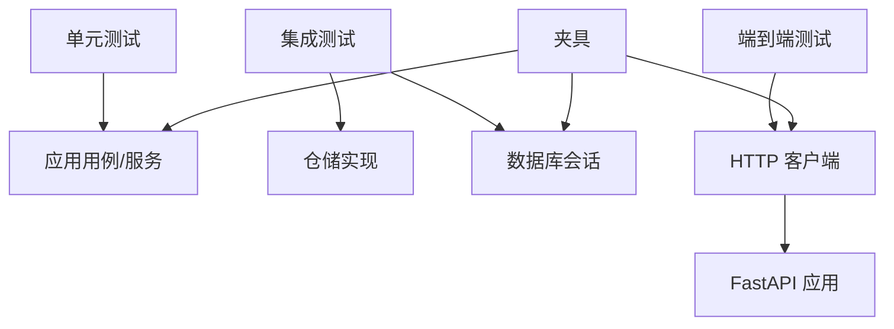

# 测试架构设计

<cite>
**本文引用的文件**
- [pytest.ini](file://pytest.ini)
- [pyproject.toml](file://pyproject.toml)
- [tests/conftest.py](file://tests/conftest.py)
- [tests/application/test_sync_stocks.py](file://tests/application/test_sync_stocks.py)
- [tests/integration/test_get_stock_basic_info_integration.py](file://tests/integration/test_get_stock_basic_info_integration.py)
- [tests/data_engineering/application/queries/test_get_daily_bars_for_ticker.py](file://tests/data_engineering/application/queries/test_get_daily_bars_for_ticker.py)
- [tests/research/application/test_technical_analyst_service.py](file://tests/research/application/test_technical_analyst_service.py)
- [tests/shared/test_config.py](file://tests/shared/test_config.py)
- [.github/workflows/ci.yml](file://.github/workflows/ci.yml)
- [requirements.txt](file://requirements.txt)
- [src/modules/data_engineering/application/commands/sync_stock_list_cmd.py](file://src/modules/data_engineering/application/commands/sync_stock_list_cmd.py)
- [src/modules/data_engineering/domain/model/stock.py](file://src/modules/data_engineering/domain/model/stock.py)
- [src/shared/config.py](file://src/shared/config.py)
- [openspec/specs/tech-standards.md](file://openspec/specs/tech-standards.md)
</cite>

## 目录
1. [引言](#引言)
2. [项目结构](#项目结构)
3. [核心组件](#核心组件)
4. [架构总览](#架构总览)
5. [详细组件分析](#详细组件分析)
6. [依赖关系分析](#依赖关系分析)
7. [性能考量](#性能考量)
8. [故障排查指南](#故障排查指南)
9. [结论](#结论)
10. [附录](#附录)

## 引言
本文件面向“股票助手”项目的测试体系，系统化阐述测试分层架构（单元测试、集成测试、端到端测试）、测试框架选择与配置（PyTest 核心配置、插件与测试发现机制）、测试夹具（fixture）设计与使用（数据库连接、HTTP 客户端、异步事件循环管理）、测试环境隔离策略（内存数据库、测试专用配置、数据清理机制）、测试命名规范与目录组织原则、测试覆盖率统计与质量门禁建议、以及测试执行流程与并行支持。目标是帮助开发者快速理解并高效扩展测试体系。

## 项目结构
测试相关目录与文件分布如下：
- 测试根目录 tests/ 下按功能域分层组织，涵盖 application、integration、llm_platform、research、shared 等子目录，便于按层次与模块定位测试用例。
- 根级配置文件 pytest.ini 与 pyproject.toml 统一管理测试运行选项、异步模式与测试路径。
- tests/conftest.py 定义共享夹具（数据库引擎、事务型会话、HTTP 客户端），确保测试隔离与可重复性。
- CI 配置 .github/workflows/ci.yml 通过 GitHub Actions 在 Ubuntu 环境拉起 Postgres 服务并执行测试。

图表来源
- [tests/conftest.py](file://tests/conftest.py#L1-L56)
- [pytest.ini](file://pytest.ini#L1-L5)
- [pyproject.toml](file://pyproject.toml#L16-L21)
- [.github/workflows/ci.yml](file://.github/workflows/ci.yml#L16-L30)
- [requirements.txt](file://requirements.txt#L1-L16)

章节来源
- [pytest.ini](file://pytest.ini#L1-L5)
- [pyproject.toml](file://pyproject.toml#L16-L21)
- [tests/conftest.py](file://tests/conftest.py#L1-L56)
- [.github/workflows/ci.yml](file://.github/workflows/ci.yml#L1-L60)
- [requirements.txt](file://requirements.txt#L1-L16)

## 核心组件
- 测试框架与配置
  - PyTest：作为测试执行器，统一管理测试发现、夹具生命周期与报告输出。
  - 配置来源：pytest.ini（异步模式、会话级事件循环作用域）与 pyproject.toml（最小版本、测试路径、默认参数）。
- 夹具（Fixture）
  - db_engine：创建异步数据库引擎并在会话开始时初始化元数据，在会话结束时释放资源。
  - db_session：基于 db_engine 建立连接与事务，测试结束后回滚，确保数据隔离与不污染真实数据。
  - client：基于 FastAPI 应用创建异步 HTTP 客户端，用于端到端测试。
- 测试分层
  - 单元测试：针对应用用例与服务的边界行为，常配合 Mock 验证交互与返回值。
  - 集成测试：使用真实数据库会话与真实仓储实现，验证跨组件协作。
  - 端到端测试：通过 HTTP 客户端访问路由，验证请求-响应链路。

章节来源
- [pytest.ini](file://pytest.ini#L1-L5)
- [pyproject.toml](file://pyproject.toml#L16-L21)
- [tests/conftest.py](file://tests/conftest.py#L22-L56)

## 架构总览
下图展示测试执行的关键流程：PyTest 发现测试后，按夹具作用域注入 db_engine、db_session、client，随后执行测试逻辑。

图表来源
- [tests/conftest.py](file://tests/conftest.py#L22-L56)
- [pytest.ini](file://pytest.ini#L1-L5)
- [pyproject.toml](file://pyproject.toml#L16-L21)

## 详细组件分析

### 测试框架与配置
- PyTest 核心配置
  - 异步模式：通过 pytest.ini 设置 asyncio_mode 为 auto，并将默认夹具循环作用域设为 session，减少事件循环创建成本。
  - 默认参数：pyproject.toml 中 addopts 指定 -ra -q --asyncio-mode=auto，便于输出详细失败信息与静默模式。
  - 测试路径：testpaths 指向 tests/，确保自动发现。
- 插件与依赖
  - requirements.txt 包含 pytest、httpx、sqlalchemy[asyncio] 等，满足异步 HTTP 与数据库测试需求。
- 测试发现机制
  - PyTest 依据约定自动发现 tests/ 下的测试文件与函数，无需额外装饰器即可识别。

章节来源
- [pytest.ini](file://pytest.ini#L1-L5)
- [pyproject.toml](file://pyproject.toml#L16-L21)
- [requirements.txt](file://requirements.txt#L1-L16)

### 夹具设计与使用
- db_engine（会话级）
  - 功能：创建异步数据库引擎，初始化元数据，测试结束后释放资源。
  - 关键点：使用 settings.SQLALCHEMY_DATABASE_URI 组装连接串，避免在测试中 drop_all，保护开发数据。
- db_session（测试级）
  - 功能：基于 db_engine 建立连接与事务，测试期间提供会话；测试完成后回滚，确保数据隔离。
  - 关键点：expire_on_commit=False，避免在事务内过早失效对象。
- client（测试级）
  - 功能：基于 FastAPI 应用创建异步 HTTP 客户端，便于端到端测试。
  - 关键点：base_url 设为 http://test，避免真实网络请求。

图表来源
- [tests/conftest.py](file://tests/conftest.py#L22-L56)

章节来源
- [tests/conftest.py](file://tests/conftest.py#L22-L56)

### 测试分层与职责划分
- 单元测试（示例：tests/application/test_sync_stocks.py）
  - 目标：验证应用用例的业务逻辑与边界条件，常通过 AsyncMock/MagicMock 验证交互。
  - 示例要点：验证成功场景与空数据场景，断言返回结构与调用次数。
- 集成测试（示例：tests/integration/test_get_stock_basic_info_integration.py）
  - 目标：使用真实仓储与数据库会话，验证跨组件协作与数据一致性。
  - 示例要点：构造领域实体与持久化数据，执行用例并断言最新日线数据。
- 端到端测试（示例：tests/research/application/test_technical_analyst_service.py）
  - 目标：通过 HTTP 客户端访问路由，验证请求-响应链路与错误处理。
  - 示例要点：模拟市场报价、指标计算与代理分析端口，断言返回 DTO 结构与关键字段。

章节来源
- [tests/application/test_sync_stocks.py](file://tests/application/test_sync_stocks.py#L1-L40)
- [tests/integration/test_get_stock_basic_info_integration.py](file://tests/integration/test_get_stock_basic_info_integration.py#L1-L77)
- [tests/research/application/test_technical_analyst_service.py](file://tests/research/application/test_technical_analyst_service.py#L1-L152)

### 查询用例测试（数据工程）
- 目标：验证数据工程模块的日线查询用例，断言返回 DTO 列表与 OHLCV 字段完整性。
- 示例要点：使用 AsyncMock 模拟仓储，断言返回类型与字段存在性。

章节来源
- [tests/data_engineering/application/queries/test_get_daily_bars_for_ticker.py](file://tests/data_engineering/application/queries/test_get_daily_bars_for_ticker.py#L1-L39)

### 配置测试（共享层）
- 目标：验证配置模块化与外部化，确保 Shared Settings 仅含全局配置，模块配置在各自 Config 类中。
- 示例要点：断言默认值、环境变量覆盖与模块专属配置项存在性。

章节来源
- [tests/shared/test_config.py](file://tests/shared/test_config.py#L1-L54)
- [src/shared/config.py](file://src/shared/config.py#L1-L68)

### 用例与实体关联（示例：同步股票用例与股票实体）
- 同步股票用例（SyncStocksUseCase）负责从上游提供商抓取股票基础数据并批量保存至仓储。
- 股票实体（StockInfo）定义了股票的基础属性与业务方法，用于仓储持久化与领域逻辑判断。

章节来源
- [src/modules/data_engineering/application/commands/sync_stock_list_cmd.py](file://src/modules/data_engineering/application/commands/sync_stock_list_cmd.py#L1-L49)
- [src/modules/data_engineering/domain/model/stock.py](file://src/modules/data_engineering/domain/model/stock.py#L1-L63)

## 依赖关系分析
- 测试对应用层的依赖
  - 单元测试依赖应用用例与服务，常通过 Mock 验证交互。
  - 集成测试依赖真实仓储与数据库会话，验证跨组件协作。
  - 端到端测试依赖 HTTP 客户端与 FastAPI 应用。
- 外部依赖
  - SQLAlchemy 异步引擎与 httpx 异步客户端为测试提供数据库与 HTTP 能力。
  - PyTest 作为测试执行器，结合夹具与配置实现自动化测试。

图表来源
- [tests/conftest.py](file://tests/conftest.py#L22-L56)
- [requirements.txt](file://requirements.txt#L1-L16)

章节来源
- [tests/conftest.py](file://tests/conftest.py#L22-L56)
- [requirements.txt](file://requirements.txt#L1-L16)

## 性能考量
- 异步测试执行
  - 通过 pytest.ini 与 pyproject.toml 的 asyncio_mode=auto 与会话级事件循环作用域，减少事件循环创建与切换开销。
- 事务回滚与数据隔离
  - 使用事务回滚避免真实数据污染，提升测试并发执行的安全性与速度。
- 并行测试支持
  - PyTest 支持并行执行（如 pytest-xdist 插件），可在 CI 中按矩阵策略并行运行不同 Python 版本或数据库版本的测试集。
- 依赖安装与缓存
  - CI 中预装依赖并利用缓存，缩短测试执行时间。

章节来源
- [pytest.ini](file://pytest.ini#L1-L5)
- [pyproject.toml](file://pyproject.toml#L16-L21)
- [.github/workflows/ci.yml](file://.github/workflows/ci.yml#L1-L60)

## 故障排查指南
- 数据库连接问题
  - 确认 settings.SQLALCHEMY_DATABASE_URI 正确组装，CI 中通过环境变量 POSTGRES_* 配置数据库连接。
  - 检查 db_engine 是否在会话结束时正确 dispose，避免连接泄漏。
- 事务回滚失败
  - 确保测试结束后执行 rollback 并关闭连接，避免后续测试受脏数据影响。
- 异步事件循环问题
  - 使用会话级事件循环作用域，避免在测试函数中手动管理事件循环。
- HTTP 客户端问题
  - 确保 client 基于 app 创建，base_url 设为 http://test，避免真实网络请求。
- 配置加载问题
  - Shared Settings 仅含全局配置，模块配置在各自 Config 类中加载，避免误读环境变量。

章节来源
- [tests/conftest.py](file://tests/conftest.py#L22-L56)
- [src/shared/config.py](file://src/shared/config.py#L40-L58)
- [.github/workflows/ci.yml](file://.github/workflows/ci.yml#L50-L60)

## 结论
本测试架构以 PyTest 为核心，结合会话级异步夹具与事务回滚机制，实现了单元、集成与端到端测试的清晰分层与高可维护性。通过 CI 中的 Postgres 服务与统一配置，确保测试环境稳定与可重复。建议在现有基础上引入覆盖率统计与质量门禁（如覆盖率阈值与静态检查），并考虑并行执行以进一步提升效率。

## 附录

### 测试命名规范与目录组织原则
- 文件与模块命名
  - 文件名采用 snake_case，与主类/函数一致；DTO 文件语义化命名，避免泛称。
  - 一个文件一个职责，跨文件复用的类型别名提取到公共位置。
- DTO 与 Port 组织
  - domain/ports 仅放接口；DTO 定义在 domain/dtos 子包中，避免暴露领域实体。
  - Application 层对外 DTO 放在 application/dtos 子包。
- 目录结构
  - tests/ 下按模块与层次组织，application/queries 放只读查询，commands 放写操作。

章节来源
- [openspec/specs/tech-standards.md](file://openspec/specs/tech-standards.md#L31-L81)

### 测试覆盖率统计与质量门禁建议
- 覆盖率统计
  - 建议在 CI 中启用覆盖率收集（如 pytest-cov），生成 HTML 报告并上传到制品库。
- 质量门禁
  - 设置最低覆盖率阈值（如语句/分支），若低于阈值则阻断合并。
  - 结合 flake8、mypy 等静态检查，确保代码质量与类型安全。

章节来源
- [.github/workflows/ci.yml](file://.github/workflows/ci.yml#L45-L48)

### 测试执行流程与并行支持
- 执行流程
  - PyTest 自动发现 tests/，按夹具注入顺序执行，输出详细失败信息。
- 并行支持
  - 可通过 pytest-xdist 在本地或 CI 中并行执行，按 CPU 核数或矩阵策略分配任务。

章节来源
- [pytest.ini](file://pytest.ini#L1-L5)
- [pyproject.toml](file://pyproject.toml#L16-L21)
- [.github/workflows/ci.yml](file://.github/workflows/ci.yml#L1-L60)