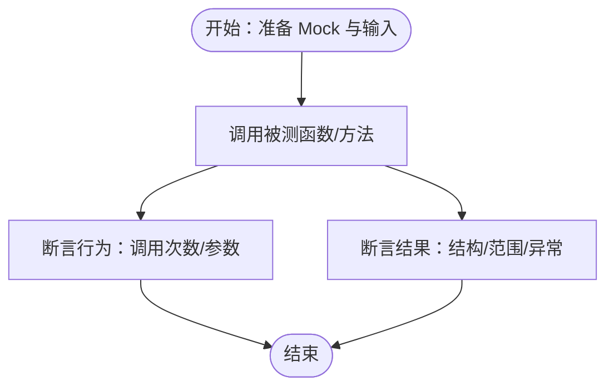

# 测试策略

<cite>
**本文引用的文件**
- [pytest.ini](file://pytest.ini)
- [pyproject.toml](file://pyproject.toml)
- [tests/conftest.py](file://tests/conftest.py)
- [.github/workflows/ci.yml](file://.github/workflows/ci.yml)
- [requirements.txt](file://requirements.txt)
- [src/shared/config.py](file://src/shared/config.py)
- [docker-compose.yml](file://docker-compose.yml)
- [scripts/test_chat_api.py](file://scripts/test_chat_api.py)
- [tests/test_health.py](file://tests/test_health.py)
- [tests/integration/test_get_stock_basic_info_integration.py](file://tests/integration/test_get_stock_basic_info_integration.py)
- [tests/data_engineering/application/test_sync_engine.py](file://tests/data_engineering/application/test_sync_engine.py)
- [tests/research/application/test_technical_analyst_service.py](file://tests/research/application/test_technical_analyst_service.py)
- [tests/llm_platform/test_web_search.py](file://tests/llm_platform/test_web_search.py)
- [tests/coordinator/infrastructure/orchestration/test_node_persistence_wrapper.py](file://tests/coordinator/infrastructure/orchestration/test_node_persistence_wrapper.py)
- [tests/coordinator/domain/model/test_node_execution.py](file://tests/coordinator/domain/model/test_node_execution.py)
- [tests/coordinator/domain/model/test_research_session.py](file://tests/coordinator/domain/model/test_research_session.py)
- [tests/llm_platform/application/services/test_llm_service_audit.py](file://tests/llm_platform/application/services/test_llm_service_audit.py)
- [tests/llm_platform/application/services/test_web_search_service_audit.py](file://tests/llm_platform/application/services/test_web_search_service_audit.py)
- [tests/shared/infrastructure/test_execution_context.py](file://tests/shared/infrastructure/test_execution_context.py)
- [src/modules/coordinator/infrastructure/orchestration/node_persistence_wrapper.py](file://src/modules/coordinator/infrastructure/orchestration/node_persistence_wrapper.py)
- [src/modules/coordinator/domain/ports/research_session_repository.py](file://src/modules/coordinator/domain/ports/research_session_repository.py)
- [src/shared/infrastructure/persistence/external_api_call_log_model.py](file://src/shared/infrastructure/persistence/external_api_call_log_model.py)
- [src/shared/infrastructure/persistence/external_api_call_log_repository.py](file://src/shared/infrastructure/persistence/external_api_call_log_repository.py)
- [src/modules/llm_platform/application/services/llm_service.py](file://src/modules/llm_platform/application/services/llm_service.py)
- [src/modules/llm_platform/application/services/web_search_service.py](file://src/modules/llm_platform/application/services/web_search_service.py)
- [src/modules/coordinator/presentation/rest/session_routes.py](file://src/modules/coordinator/presentation/rest/session_routes.py)
</cite>

## 目录
1. [引言](#引言)
2. [项目结构](#项目结构)
3. [核心组件](#核心组件)
4. [架构总览](#架构总览)
5. [详细组件分析](#详细组件分析)
6. [依赖关系分析](#依赖关系分析)
7. [性能考虑](#性能考虑)
8. [故障排查指南](#故障排查指南)
9. [结论](#结论)
10. [附录](#附录)

## 引言
本测试策略文档面向"股票助手"项目，系统化阐述测试架构与实施方法，覆盖单元测试、集成测试与端到端测试三层策略，明确测试框架配置、fixture管理、测试发现机制、Mock与断言规范、数据库与外部API测试设计、测试覆盖率与质量门禁、测试环境搭建与管理、CI/CD集成以及调试与性能测试方法。目标是帮助开发者在不同层次上高效编写、运行与维护高质量测试。

**更新** 本次更新重点扩展了执行跟踪、审计日志、节点持久化等新功能的测试覆盖，完善了从单元到端到端的完整测试闭环。

## 项目结构
项目采用按领域与层次划分的目录组织方式，测试目录与源码目录一一对应，便于分层测试与职责清晰：
- tests：按模块与层次组织，包含 application、integration、domain、research、llm_platform、shared 等子目录
- src：按模块与层次组织，包含 api、modules、shared 等子目录
- 配置与工具：pytest.ini、pyproject.toml、tests/conftest.py、.github/workflows/ci.yml、requirements.txt、docker-compose.yml、scripts/test_chat_api.py 等

**章节来源**
- [tests/conftest.py](file://tests/conftest.py#L1-L56)
- [pyproject.toml](file://pyproject.toml#L16-L22)

## 核心组件
- 测试框架与配置
  - PyTest：通过 pytest.ini 与 pyproject.toml 配置异步支持、测试路径与输出控制
  - Fixture：统一提供数据库引擎、事务型会话与HTTP客户端
- 测试环境
  - CI 使用 GitHub Actions，PostgreSQL 作为测试数据库
  - 本地开发使用 docker-compose 启动应用与数据库
- 外部依赖
  - httpx、FastAPI TestClient、Alembic、Prometheus、OpenAI、Tushare 等

**章节来源**
- [pytest.ini](file://pytest.ini#L1-L5)
- [pyproject.toml](file://pyproject.toml#L16-L22)
- [tests/conftest.py](file://tests/conftest.py#L22-L56)
- [.github/workflows/ci.yml](file://.github/workflows/ci.yml#L16-L30)
- [docker-compose.yml](file://docker-compose.yml#L1-L55)
- [requirements.txt](file://requirements.txt#L1-L16)

## 架构总览
测试架构分为三层：
- 单元测试：隔离业务逻辑与接口，使用 Mock 与最小依赖，快速定位问题
- 集成测试：验证模块间协作、数据库持久化与外部API交互
- 端到端测试：验证完整用户场景，如健康检查、LLM搜索与聊天API

**更新** 新增执行跟踪与审计日志测试，涵盖节点持久化包装器、LLM调用审计、外部API调用日志等关键功能。

**图表来源**
- [pytest.ini](file://pytest.ini#L1-L5)
- [pyproject.toml](file://pyproject.toml#L16-L22)
- [tests/conftest.py](file://tests/conftest.py#L22-L56)
- [.github/workflows/ci.yml](file://.github/workflows/ci.yml#L16-L30)

## 详细组件分析

### 单元测试策略与规范
- 设计原则
  - 隔离：仅测试单个函数/类/模块行为，通过 Mock 替换外部依赖
  - 可重复：使用稳定的输入与确定性断言
  - 可读：命名清晰、前置条件明确、断言聚焦
- Mock 使用
  - AsyncMock：用于异步接口与外部服务
  - patch：对第三方库调用进行替换，确保可控与可预测
  - spec：使用 AsyncMock(spec=...) 与 MagicMock(spec=...) 保证签名一致性
- 测试数据准备
  - 使用工厂函数或构造器生成 DTO/实体实例，避免硬编码
  - 对于复杂对象，使用模型 dump 或等价结构进行断言
- 断言策略
  - 行为断言：验证调用次数与参数（如 mock_xxx.assert_called_once_with(...)）
  - 结果断言：验证返回值结构与范围（如枚举取值、数值区间）
  - 异常断言：使用 pytest.raises 捕获预期异常并断言消息片段
- 示例参考
  - 技术分析师服务测试：验证输入校验、指标计算与Agent调用链路
  - Web搜索适配器测试：覆盖正常/空结果/参数传递/错误处理/配置校验
  - 同步引擎测试：验证任务创建、互斥、断点续跑与批次执行

**章节来源**
- [tests/research/application/test_technical_analyst_service.py](file://tests/research/application/test_technical_analyst_service.py#L55-L91)
- [tests/research/application/test_technical_analyst_service.py](file://tests/research/application/test_technical_analyst_service.py#L93-L114)
- [tests/llm_platform/test_web_search.py](file://tests/llm_platform/test_web_search.py#L38-L89)
- [tests/llm_platform/test_web_search.py](file://tests/llm_platform/test_web_search.py#L136-L152)
- [tests/llm_platform/test_web_search.py](file://tests/llm_platform/test_web_search.py#L167-L176)
- [tests/data_engineering/application/test_sync_engine.py](file://tests/data_engineering/application/test_sync_engine.py#L40-L67)
- [tests/data_engineering/application/test_sync_engine.py](file://tests/data_engineering/application/test_sync_engine.py#L70-L91)
- [tests/data_engineering/application/test_sync_engine.py](file://tests/data_engineering/application/test_sync_engine.py#L94-L124)

### 集成测试策略
- 目标
  - 验证真实数据库交互、事务回滚与模块间协作
  - 验证外部API（如市场数据、财务数据、LLM搜索）在真实环境下的行为
- 数据库测试
  - 使用 db_engine 与 db_session fixture，创建/清理表结构，事务回滚保证测试隔离
  - 在事务内 flush 数据，确保查询可见性
- 外部API测试
  - 通过适配器层与服务层的端到端调用，验证请求参数、响应映射与错误处理
- 模块间交互测试
  - 使用真实仓储实现与用例组合，验证数据流与业务规则

**更新** 新增执行跟踪与审计日志的集成测试覆盖：

- 节点持久化包装器测试
  - 验证持久化写入失败不阻塞主流程
  - 测试成功节点与失败节点的持久化行为
  - 验证 ExecutionContext 上下文传递与会话ID关联

- LLM调用审计测试
  - 验证成功调用与失败调用的日志记录
  - 测试无上下文时的降级行为
  - 验证日志字段完整性与格式正确性

- 外部API调用日志测试
  - 验证博查搜索的成功与失败场景
  - 测试无上下文时的日志记录
  - 验证日志模型的序列化与反序列化

**章节来源**
- [tests/conftest.py](file://tests/conftest.py#L22-L56)
- [tests/integration/test_get_stock_basic_info_integration.py](file://tests/integration/test_get_stock_basic_info_integration.py#L10-L77)
- [tests/llm_platform/test_web_search.py](file://tests/llm_platform/test_web_search.py#L197-L246)
- [tests/coordinator/infrastructure/orchestration/test_node_persistence_wrapper.py](file://tests/coordinator/infrastructure/orchestration/test_node_persistence_wrapper.py#L1-L71)
- [tests/llm_platform/application/services/test_llm_service_audit.py](file://tests/llm_platform/application/services/test_llm_service_audit.py#L1-L94)
- [tests/llm_platform/application/services/test_web_search_service_audit.py](file://tests/llm_platform/application/services/test_web_search_service_audit.py#L1-L104)

### 端到端测试策略
- 健康检查
  - 使用 FastAPI TestClient 或 httpx.AsyncClient 访问 /api/v1/health，断言状态码与响应字段
- LLM平台路由
  - 验证搜索与聊天路由的请求/响应结构与错误处理
- API脚本辅助
  - scripts/test_chat_api.py 提供手动验证脚本，便于本地联调

**更新** 新增会话API调用日志路由测试：

- 会话关联的外部API调用日志查询
  - 验证按会话ID查询外部API调用日志的REST接口
  - 测试日志列表的字段完整性与排序正确性

**章节来源**
- [tests/test_health.py](file://tests/test_health.py#L4-L12)
- [scripts/test_chat_api.py](file://scripts/test_chat_api.py#L1-L37)
- [src/modules/coordinator/presentation/rest/session_routes.py](file://src/modules/coordinator/presentation/rest/session_routes.py#L123-L148)

## 依赖关系分析
- 测试框架与工具
  - PyTest：测试执行、异步支持、fixture生命周期
  - httpx：HTTP客户端，支持异步与同步
  - Alembic：数据库迁移，CI中用于初始化测试库结构
- 配置与环境
  - src/shared/config.py：集中式配置，支持从环境变量组装数据库URI
  - docker-compose.yml：本地开发与测试数据库容器编排
  - .github/workflows/ci.yml：CI作业，PostgreSQL服务、依赖安装、静态检查与测试执行

**更新** 新增执行跟踪相关依赖：

- ExecutionContext：跨模块的执行上下文传递机制
- 外部API调用日志模型：共享的审计日志存储模型
- LLM调用日志模型：LLM平台专用的审计日志存储模型

**图表来源**
- [src/shared/config.py](file://src/shared/config.py#L8-L69)
- [docker-compose.yml](file://docker-compose.yml#L30-L48)
- [.github/workflows/ci.yml](file://.github/workflows/ci.yml#L16-L30)

**章节来源**
- [src/shared/config.py](file://src/shared/config.py#L8-L69)
- [docker-compose.yml](file://docker-compose.yml#L1-L55)
- [.github/workflows/ci.yml](file://.github/workflows/ci.yml#L16-L30)

## 性能考虑
- 单元测试
  - 优先使用内存中的异步引擎与Mock，避免真实IO
  - 控制批量大小与循环次数，必要时使用参数化减少重复
- 集成测试
  - 使用事务回滚避免多次迁移与重建表结构
  - 合理拆分测试用例，避免长链路串联导致超时
- 端到端测试
  - 限制并发与重试次数，关注路由级响应时间
  - 对外部API调用设置合理超时与重试策略

**更新** 新增性能测试考虑：

- 节点持久化包装器性能
  - 验证异步写入不影响主流程性能
  - 测试大量节点执行时的性能表现
- 审计日志写入性能
  - 验证日志写入的异步非阻塞特性
  - 测试高并发场景下的日志记录性能

## 故障排查指南
- 常见问题
  - 数据库连接失败：检查环境变量与容器健康状态
  - 异步测试报错：确认 asyncio_mode 与 fixture 作用域配置
  - 外部API超时/错误：检查密钥、URL与网络连通性
  - 审计日志写入失败：检查数据库连接与权限
- 调试技巧
  - 使用 pytest -s 输出中间结果
  - 逐步缩小范围：先运行最小可复现用例，再加入Mock/数据
  - 对外部调用使用 patch 捕获请求与响应，打印关键字段
  - 检查 ExecutionContext 上下文是否正确设置与传递
- 性能测试方法
  - 使用 pytest-benchmark 或自定义计时器统计关键路径耗时
  - 对批量同步与指标计算进行分段计时，识别瓶颈
  - 监控审计日志写入的延迟与吞吐量

**更新** 新增故障排查指导：

- 节点持久化失败
  - 检查 IResearchSessionRepository 实现与数据库连接
  - 验证 ExecutionContext 是否正确设置 session_id
  - 确认 NodeExecution 模型字段完整性
- 审计日志丢失
  - 检查 _write_call_log 方法的异常处理
  - 验证日志仓储的保存方法实现
  - 确认日志模型的序列化与反序列化正确性

## 结论
本测试策略以分层设计为核心，结合PyTest配置、统一fixture与CI流水线，形成从单元到端到端的完整测试闭环。通过Mock与事务回滚保障测试稳定性，通过外部API与数据库集成验证真实场景，辅以脚本与CI工具提升可运维性。

**更新** 新功能测试覆盖已完善，包括：
- 执行跟踪：节点持久化包装器、会话生命周期管理
- 审计日志：LLM调用审计、外部API调用日志
- 上下文管理：ExecutionContext 的正确使用与传递

建议在后续迭代中补充覆盖率报告与质量门禁阈值，持续优化测试效率与覆盖面。

## 附录

### 测试框架配置与使用
- PyTest配置
  - pytest.ini：启用 asyncio_mode，统一事件循环作用域
  - pyproject.toml：最小版本、命令行选项、测试路径
- 测试发现
  - testpaths 指向 tests 目录，自动发现以 test_ 前缀的文件与以 test_ 前缀的函数
- 异步支持
  - 使用 @pytest.mark.asyncio 与 AsyncClient，确保异步测试稳定

**章节来源**
- [pytest.ini](file://pytest.ini#L1-L5)
- [pyproject.toml](file://pyproject.toml#L16-L22)

### Fixture管理
- db_engine：创建异步引擎并初始化/清理表结构
- db_session：基于连接开启事务，在测试后回滚，保证隔离
- client：提供异步HTTP客户端，注入FastAPI应用

**章节来源**
- [tests/conftest.py](file://tests/conftest.py#L22-L56)

### 测试环境搭建与管理
- 本地开发
  - docker-compose 启动应用与数据库，应用启动时执行 Alembic 迁移
- CI/CD
  - GitHub Actions 启动 PostgreSQL 服务，安装依赖，执行 flake8/mypy 与 pytest
  - 通过环境变量注入数据库连接信息，确保测试数据库独立

**章节来源**
- [docker-compose.yml](file://docker-compose.yml#L1-L55)
- [.github/workflows/ci.yml](file://.github/workflows/ci.yml#L16-L30)
- [.github/workflows/ci.yml](file://.github/workflows/ci.yml#L45-L60)

### 测试覆盖率与质量门禁
- 覆盖率建议
  - 关键业务路径覆盖率不低于 80%，外部API适配器不低于 70%
  - 新增的执行跟踪与审计日志模块覆盖率不低于 75%
- 质量门禁
  - CI 中 flake8 与 mypy 必须通过
  - pytest 必须全部通过，建议增加覆盖率阈值检查（可在后续引入覆盖率插件）

**更新** 新增覆盖率要求：

- 节点持久化包装器：确保包装器逻辑的完整测试覆盖
- 审计日志模块：验证日志写入、查询与序列化的正确性
- 上下文管理：确保 ExecutionContext 的正确使用与传递

### 测试自动化与持续集成
- CI 任务
  - 安装依赖、静态检查、运行测试
  - 使用 services 块启动 PostgreSQL，设置环境变量
- 本地自动化
  - 使用 Makefile 或脚本封装测试命令，统一入口

**章节来源**
- [.github/workflows/ci.yml](file://.github/workflows/ci.yml#L1-L60)

### 测试调试与性能测试
- 调试
  - 使用 -s 输出中间状态，使用 patch 精确捕获外部调用
  - 检查 ExecutionContext 的设置与传递过程
- 性能
  - 对关键流程添加计时与基准测试，识别慢点并优化
  - 监控审计日志写入的性能影响

**更新** 新增调试与性能测试指导：

- 节点持久化调试
  - 验证包装器的异常处理与日志记录
  - 检查 ExecutionContext 的正确传递
- 审计日志性能测试
  - 测试高并发场景下的日志写入性能
  - 监控日志查询的响应时间

### 新功能测试覆盖详解

#### 节点持久化包装器测试
- 功能概述
  - 包装 LangGraph 节点函数，在执行前后记录 NodeExecution
  - 写入失败不阻塞主流程，仅记录 warning 日志
  - 支持 ExecutionContext 上下文传递与会话ID关联

- 测试要点
  - 成功节点执行：验证结果返回与成功记录写入
  - 失败节点执行：验证异常抛出与失败记录写入
  - 持久化失败场景：验证不阻塞主流程的行为
  - 上下文传递：验证 ExecutionContext 的正确设置与获取

**章节来源**
- [tests/coordinator/infrastructure/orchestration/test_node_persistence_wrapper.py](file://tests/coordinator/infrastructure/orchestration/test_node_persistence_wrapper.py#L1-L71)
- [src/modules/coordinator/infrastructure/orchestration/node_persistence_wrapper.py](file://src/modules/coordinator/infrastructure/orchestration/node_persistence_wrapper.py#L1-L109)
- [src/modules/coordinator/domain/ports/research_session_repository.py](file://src/modules/coordinator/domain/ports/research_session_repository.py#L1-L53)

#### LLM调用审计测试
- 功能概述
  - 统一大模型调用与调用审计
  - 支持成功与失败场景的日志记录
  - 无上下文时的降级处理

- 测试要点
  - 成功调用审计：验证日志字段完整性与格式正确性
  - 失败调用审计：验证错误信息的正确记录
  - 无上下文降级：验证 session_id 为 None 的处理
  - 异步写入：验证日志写入不阻塞主流程

**章节来源**
- [tests/llm_platform/application/services/test_llm_service_audit.py](file://tests/llm_platform/application/services/test_llm_service_audit.py#L1-L94)
- [src/modules/llm_platform/application/services/llm_service.py](file://src/modules/llm_platform/application/services/llm_service.py#L1-L150)

#### 外部API调用日志测试
- 功能概述
  - 自动记录外部API调用的完整信息
  - 支持成功与失败场景的日志记录
  - 无上下文时的降级处理

- 测试要点
  - 成功调用日志：验证请求参数、响应数据的完整记录
  - 失败调用日志：验证错误信息的正确记录
  - 无上下文日志：验证 session_id 为 None 的处理
  - 异步写入：验证日志写入不阻塞主流程

**章节来源**
- [tests/llm_platform/application/services/test_web_search_service_audit.py](file://tests/llm_platform/application/services/test_web_search_service_audit.py#L1-L104)
- [src/modules/llm_platform/application/services/web_search_service.py](file://src/modules/llm_platform/application/services/web_search_service.py#L90-L122)
- [src/shared/infrastructure/persistence/external_api_call_log_model.py](file://src/shared/infrastructure/persistence/external_api_call_log_model.py#L1-L29)
- [src/shared/infrastructure/persistence/external_api_call_log_repository.py](file://src/shared/infrastructure/persistence/external_api_call_log_repository.py#L1-L64)

#### 执行上下文测试
- 功能概述
  - 跨模块的执行上下文传递机制
  - 支持同步与异步场景的上下文管理
  - 确保多任务间的上下文隔离

- 测试要点
  - 基本设置与获取：验证上下文的正确设置与获取
  - 嵌套上下文：验证嵌套设置与重置的正确性
  - 并行任务隔离：验证异步任务间的上下文隔离
  - 生命周期管理：验证上下文的正确重置

**章节来源**
- [tests/shared/infrastructure/test_execution_context.py](file://tests/shared/infrastructure/test_execution_context.py#L1-L83)

#### 会话API调用日志路由测试
- 功能概述
  - 提供按会话ID查询外部API调用日志的REST接口
  - 支持外部API调用审计日志的查询与展示

- 测试要点
  - 路由正确性：验证路由定义与HTTP方法
  - 参数验证：验证 session_id 参数的正确处理
  - 数据查询：验证按会话ID查询日志的正确性
  - 响应格式：验证返回DTO列表的字段完整性

**章节来源**
- [src/modules/coordinator/presentation/rest/session_routes.py](file://src/modules/coordinator/presentation/rest/session_routes.py#L123-L148)