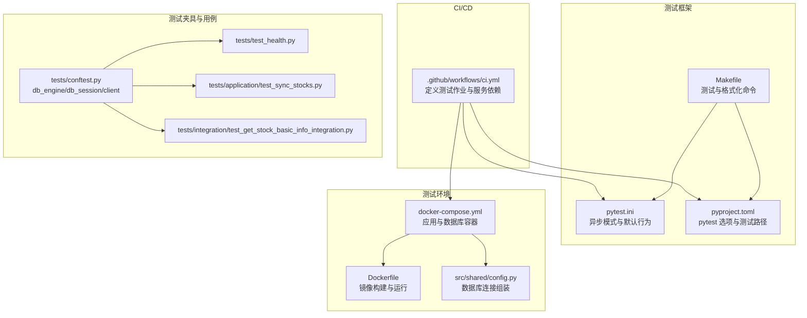
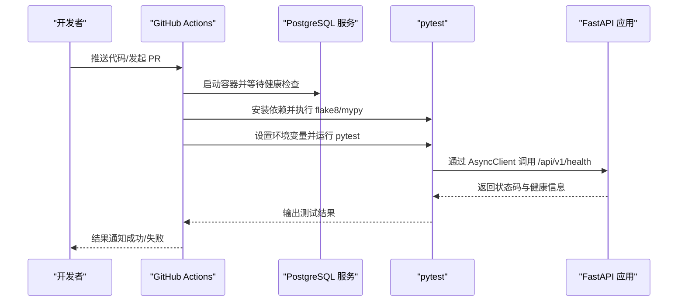
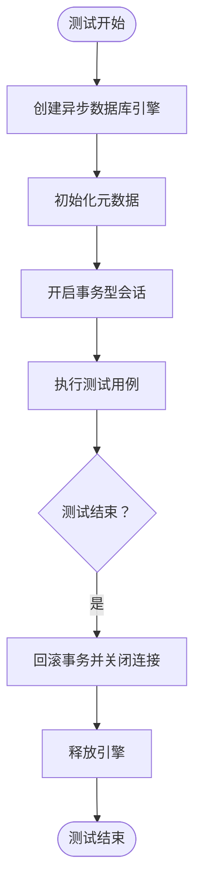
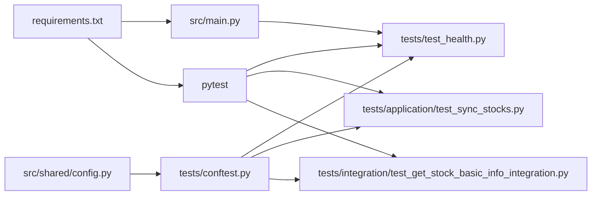

# 测试自动化配置

<cite>
**本文引用的文件**
- [.github/workflows/ci.yml](file://.github/workflows/ci.yml)
- [pytest.ini](file://pytest.ini)
- [pyproject.toml](file://pyproject.toml)
- [docker-compose.yml](file://docker-compose.yml)
- [Dockerfile](file://Dockerfile)
- [tests/conftest.py](file://tests/conftest.py)
- [tests/test_health.py](file://tests/test_health.py)
- [tests/application/test_sync_stocks.py](file://tests/application/test_sync_stocks.py)
- [tests/integration/test_get_stock_basic_info_integration.py](file://tests/integration/test_get_stock_basic_info_integration.py)
- [src/shared/config.py](file://src/shared/config.py)
- [src/main.py](file://src/main.py)
- [Makefile](file://Makefile)
- [requirements.txt](file://requirements.txt)
</cite>

## 目录
1. [简介](#简介)
2. [项目结构](#项目结构)
3. [核心组件](#核心组件)
4. [架构总览](#架构总览)
5. [详细组件分析](#详细组件分析)
6. [依赖关系分析](#依赖关系分析)
7. [性能考量](#性能考量)
8. [故障排除指南](#故障排除指南)
9. [结论](#结论)
10. [附录](#附录)

## 简介
本文件面向“股票助手”项目的测试自动化与持续集成，系统性梳理测试配置、CI/CD 流水线、测试环境搭建、测试覆盖与质量门禁、测试并行执行、调试与故障排除、以及测试数据与环境清理等主题。目标是帮助开发者在本地与 CI 环境中稳定、高效地运行测试，并通过自动化手段保障代码质量。

## 项目结构
围绕测试自动化，项目的关键文件与职责如下：
- CI/CD 流水线：GitHub Actions 定义测试作业、服务依赖（PostgreSQL）、Python 版本矩阵与环境变量注入。
- 测试框架与配置：pytest 配置、异步模式、测试路径与命令行选项。
- 测试环境：Docker Compose 定义应用与数据库容器、网络与健康检查；Dockerfile 定义镜像构建与运行时。
- 测试夹具与基础设施：pytest 夹具提供数据库引擎、会话与 HTTP 客户端；共享配置加载数据库连接。
- 测试用例：单元测试、集成测试与健康检查示例。
- 开发辅助：Makefile 提供安装、测试、格式化、静态检查与运行命令。

图表来源
- [.github/workflows/ci.yml](file://.github/workflows/ci.yml#L1-L60)
- [pytest.ini](file://pytest.ini#L1-L5)
- [pyproject.toml](file://pyproject.toml#L16-L22)
- [docker-compose.yml](file://docker-compose.yml#L1-L55)
- [Dockerfile](file://Dockerfile#L1-L52)
- [src/shared/config.py](file://src/shared/config.py#L40-L58)
- [tests/conftest.py](file://tests/conftest.py#L22-L56)
- [tests/test_health.py](file://tests/test_health.py#L1-L12)
- [tests/application/test_sync_stocks.py](file://tests/application/test_sync_stocks.py#L1-L40)
- [tests/integration/test_get_stock_basic_info_integration.py](file://tests/integration/test_get_stock_basic_info_integration.py#L1-L77)
- [Makefile](file://Makefile#L10-L11)

章节来源
- [.github/workflows/ci.yml](file://.github/workflows/ci.yml#L1-L60)
- [pytest.ini](file://pytest.ini#L1-L5)
- [pyproject.toml](file://pyproject.toml#L16-L22)
- [docker-compose.yml](file://docker-compose.yml#L1-L55)
- [Dockerfile](file://Dockerfile#L1-L52)
- [src/shared/config.py](file://src/shared/config.py#L40-L58)
- [tests/conftest.py](file://tests/conftest.py#L22-L56)
- [tests/test_health.py](file://tests/test_health.py#L1-L12)
- [tests/application/test_sync_stocks.py](file://tests/application/test_sync_stocks.py#L1-L40)
- [tests/integration/test_get_stock_basic_info_integration.py](file://tests/integration/test_get_stock_basic_info_integration.py#L1-L77)
- [Makefile](file://Makefile#L10-L11)

## 核心组件
- CI/CD 测试作业：在 GitHub Actions 中定义测试作业，使用 Ubuntu 最新运行器，声明 PostgreSQL 服务依赖，设置数据库环境变量，安装依赖后执行 flake8、mypy 与 pytest。
- 测试框架配置：pytest.ini 指定 asyncio 模式；pyproject.toml 设置测试路径与默认参数；Makefile 提供一键测试命令。
- 测试夹具：conftest.py 提供数据库引擎、事务型会话与异步 HTTP 客户端夹具，确保测试隔离与可重复性。
- 测试环境：Docker Compose 定义应用与数据库容器、网络与健康检查；Dockerfile 定义多阶段构建与运行时健康检查。
- 共享配置：src/shared/config.py 组装数据库连接字符串，支持不同环境（本地/测试）切换。
- 示例测试：健康检查、单元测试（用例与 Mock）、集成测试（真实数据库事务回滚）。

章节来源
- [.github/workflows/ci.yml](file://.github/workflows/ci.yml#L9-L60)
- [pytest.ini](file://pytest.ini#L1-L5)
- [pyproject.toml](file://pyproject.toml#L16-L22)
- [tests/conftest.py](file://tests/conftest.py#L22-L56)
- [docker-compose.yml](file://docker-compose.yml#L1-L55)
- [Dockerfile](file://Dockerfile#L1-L52)
- [src/shared/config.py](file://src/shared/config.py#L40-L58)
- [tests/test_health.py](file://tests/test_health.py#L1-L12)
- [tests/application/test_sync_stocks.py](file://tests/application/test_sync_stocks.py#L1-L40)
- [tests/integration/test_get_stock_basic_info_integration.py](file://tests/integration/test_get_stock_basic_info_integration.py#L1-L77)
- [Makefile](file://Makefile#L10-L11)

## 架构总览
下图展示测试自动化在本地与 CI 的整体流程：CI 通过 GitHub Actions 启动 PostgreSQL 服务，安装依赖，执行静态检查与测试；测试通过 pytest 夹具连接数据库，运行单元与集成测试；应用层通过 FastAPI 提供健康检查接口，便于测试验证。

图表来源
- [.github/workflows/ci.yml](file://.github/workflows/ci.yml#L16-L60)
- [tests/test_health.py](file://tests/test_health.py#L4-L12)
- [src/main.py](file://src/main.py#L65-L75)

## 详细组件分析

### CI/CD 测试流水线配置
- 触发条件：对主分支的推送与拉取请求。
- 运行器与矩阵：Ubuntu 最新运行器，Python 版本固定为 3.10。
- 服务依赖：PostgreSQL 15，设置用户、密码与数据库名，并配置健康检查。
- 步骤：
  - 检出代码、设置 Python、安装依赖（含 pytest 与 httpx）。
  - 执行 flake8 与 mypy 静态检查。
  - 设置测试环境变量（数据库主机、用户、密码、库名、端口、环境），运行 pytest。
- 建议增强：
  - 在 CI 中增加覆盖率收集与报告（如 pytest-cov），并设置阈值与质量门禁。
  - 将测试分组与并行策略纳入矩阵，提升吞吐量。
  - 将测试报告与通知（Slack/邮件）接入 CI。

章节来源
- [.github/workflows/ci.yml](file://.github/workflows/ci.yml#L1-L60)

### 测试框架与配置
- pytest.ini：启用 asyncio 自动模式与会话级事件循环作用域。
- pyproject.toml：设置最小版本、默认参数（-ra -q --asyncio-mode=auto）、测试目录。
- Makefile：提供一键测试命令，便于本地快速执行。

章节来源
- [pytest.ini](file://pytest.ini#L1-L5)
- [pyproject.toml](file://pyproject.toml#L16-L22)
- [Makefile](file://Makefile#L10-L11)

### 测试夹具与数据库事务回滚
- db_engine：基于 settings 中的数据库连接字符串创建异步引擎，初始化元数据并在会话结束后释放连接。
- db_session：使用真实连接开启事务，在测试结束时回滚，确保测试数据不污染数据库。
- client：基于 AsyncClient 提供异步 HTTP 客户端，绑定应用实例与基础 URL。
- 配置来源：settings 通过 Pydantic BaseSettings 从 .env 加载数据库参数，支持本地与测试环境切换。

图表来源
- [tests/conftest.py](file://tests/conftest.py#L22-L56)
- [src/shared/config.py](file://src/shared/config.py#L40-L58)

章节来源
- [tests/conftest.py](file://tests/conftest.py#L22-L56)
- [src/shared/config.py](file://src/shared/config.py#L40-L58)

### 测试环境容器化与健康检查
- docker-compose.yml：
  - app 服务：构建镜像、挂载代码、设置数据库环境变量、启动后执行 Alembic 升级并启动 Uvicorn。
  - db 服务：Postgres 15，持久化卷，健康检查。
  - 网络：桥接网络供服务通信。
- Dockerfile：多阶段构建，安装运行时依赖，设置 HEALTHCHECK，非 root 用户运行。
- 建议：
  - 在 CI 中复用相同的服务定义，确保与本地一致。
  - 为测试数据库单独配置一个独立的数据库名与连接串，避免与开发数据冲突。

章节来源
- [docker-compose.yml](file://docker-compose.yml#L1-L55)
- [Dockerfile](file://Dockerfile#L1-L52)

### 示例测试用例
- 健康检查测试：验证 /api/v1/health 返回 200 并包含状态字段。
- 单元测试（用例与 Mock）：模拟仓库与外部提供者，断言用例返回值与调用次数。
- 集成测试（事务回滚）：在真实数据库会话中写入测试数据，执行用例并断言最新行情数据。

章节来源
- [tests/test_health.py](file://tests/test_health.py#L1-L12)
- [tests/application/test_sync_stocks.py](file://tests/application/test_sync_stocks.py#L1-L40)
- [tests/integration/test_get_stock_basic_info_integration.py](file://tests/integration/test_get_stock_basic_info_integration.py#L1-L77)

### 应用与配置对接
- src/main.py：注册路由、CORS、全局异常处理中间件；根路径与 /api/v1/health 健康检查接口。
- src/shared/config.py：组装 PostgreSQL 异步连接串，支持从环境变量加载。

章节来源
- [src/main.py](file://src/main.py#L65-L75)
- [src/shared/config.py](file://src/shared/config.py#L40-L58)

## 依赖关系分析
- 测试依赖：pytest、httpx、flake8、mypy、pytest-asyncio。
- 运行时依赖：FastAPI、Uvicorn、SQLAlchemy 异步、asyncpg、Alembic、Pydantic Settings、Prometheus 客户端、OpenAI、TuShare 等。
- CI 依赖：PostgreSQL 15 容器作为数据库服务。

图表来源
- [tests/conftest.py](file://tests/conftest.py#L1-L56)
- [tests/test_health.py](file://tests/test_health.py#L1-L12)
- [tests/application/test_sync_stocks.py](file://tests/application/test_sync_stocks.py#L1-L40)
- [tests/integration/test_get_stock_basic_info_integration.py](file://tests/integration/test_get_stock_basic_info_integration.py#L1-L77)
- [src/shared/config.py](file://src/shared/config.py#L40-L58)
- [src/main.py](file://src/main.py#L65-L75)
- [requirements.txt](file://requirements.txt#L1-L16)

章节来源
- [requirements.txt](file://requirements.txt#L1-L16)
- [tests/conftest.py](file://tests/conftest.py#L1-L56)
- [src/shared/config.py](file://src/shared/config.py#L40-L58)
- [src/main.py](file://src/main.py#L65-L75)

## 性能考量
- 测试并行执行：
  - 在 pytest 中可通过标记分组与 xdist 实现并行；建议按模块或测试类型拆分，避免共享资源竞争。
  - 在 CI 中使用矩阵策略扩展 Python 版本或操作系统，但需注意数据库服务占用。
- 资源管理：
  - 使用事务回滚（当前实现）减少写操作开销；对长耗时外部 API 可引入缓存或 Mock。
  - 控制并发度，避免数据库连接池过载。
- 静态检查与测试分离：
  - 将 flake8、mypy 与 pytest 分离执行，缩短反馈周期。

[本节为通用指导，无需列出章节来源]

## 故障排除指南
- CI 中数据库连接失败：
  - 确认服务名称与端口映射正确；在 CI 中使用 localhost 访问服务容器。
  - 检查数据库健康检查是否通过（间隔与超时）。
- 测试数据污染或竞态：
  - 确保使用事务回滚夹具；避免在测试间共享可变状态。
- 健康检查失败：
  - 检查应用启动日志与路由注册；确认 /api/v1/health 已注册且无中间件异常。
- 本地与 CI 行为差异：
  - 对齐 Python 版本、依赖版本与环境变量；使用相同的 docker-compose 服务定义。

章节来源
- [.github/workflows/ci.yml](file://.github/workflows/ci.yml#L16-L60)
- [tests/conftest.py](file://tests/conftest.py#L22-L56)
- [src/main.py](file://src/main.py#L65-L75)

## 结论
当前项目已具备完善的 CI 测试流水线、容器化测试环境与基础测试夹具。建议下一步在 CI 中引入覆盖率收集与质量门禁、测试分组与并行执行、测试报告与通知机制，并完善测试数据与环境清理策略，以进一步提升测试效率与质量保障能力。

[本节为总结性内容，无需列出章节来源]

## 附录

### 测试覆盖率与质量门禁（建议）
- 工具：pytest-cov。
- 配置：在 pyproject.toml 或 .coveragerc 中设置覆盖率阈值（如总体、分支、函数、行）。
- CI 集成：在测试步骤后生成报告并上传至覆盖率平台（如 Codecov/GitHub Coverage）。
- 质量门禁：在 CI 中设置覆盖率阈值失败即阻止合并。

[本节为通用指导，无需列出章节来源]

### 测试并行执行（建议）
- 分组策略：按模块（application、integration、domain 等）拆分，减少锁竞争。
- 并发工具：pytest-xdist；在 CI 中使用 --numprocesses 或矩阵策略。
- 资源管理：限制并发数，避免数据库连接池耗尽；对共享资源加锁或隔离。

[本节为通用指导，无需列出章节来源]

### 测试调试与故障排除（建议）
- 本地调试：使用 Makefile 的测试命令，结合断点与日志；必要时临时关闭事务回滚以便观察数据库状态。
- CI 调试：在失败步骤输出关键环境变量与依赖版本；使用更细粒度的日志级别。
- 通知：在 CI 中集成 Slack/邮件通知，失败时快速响应。

[本节为通用指导，无需列出章节来源]

### 测试数据管理与环境清理（建议）
- 测试数据：
  - 使用事务回滚确保测试隔离；对需要真实数据的集成测试，仅在事务内写入并断言。
  - 对外部 API 调用使用 Mock 或缓存，减少不确定性。
- 环境清理：
  - CI 中使用独立数据库与专用连接串；在流水线末尾清理容器与卷。
  - 本地开发使用独立 .env.test 并在退出时重置数据库状态。

[本节为通用指导，无需列出章节来源]