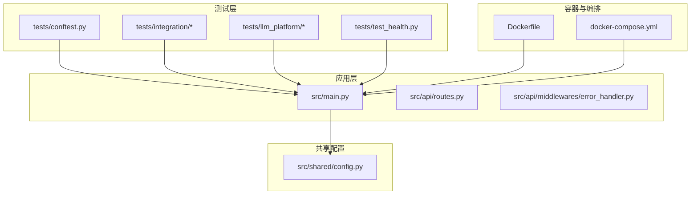
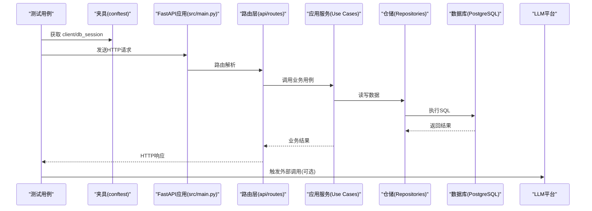
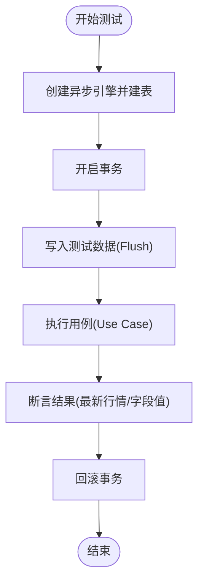
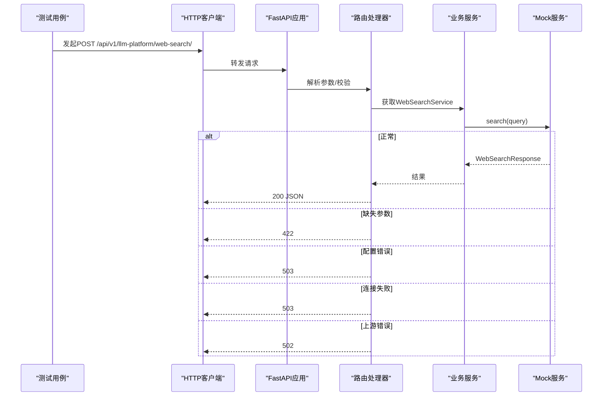
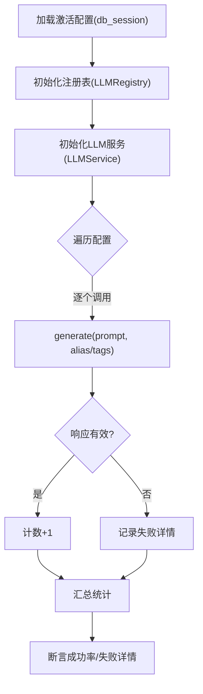
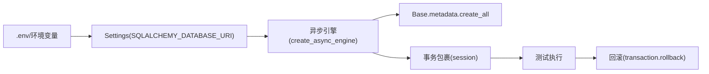
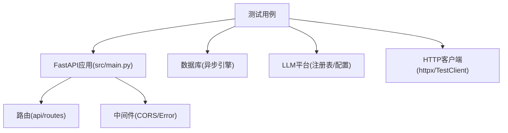

# 集成测试策略

<cite>
**本文引用的文件**
- [tests/conftest.py](file://tests/conftest.py)
- [pytest.ini](file://pytest.ini)
- [docker-compose.yml](file://docker-compose.yml)
- [Dockerfile](file://Dockerfile)
- [scripts/test_chat_api.py](file://scripts/test_chat_api.py)
- [tests/integration/test_get_stock_basic_info_integration.py](file://tests/integration/test_get_stock_basic_info_integration.py)
- [tests/integration/test_llm_call.py](file://tests/integration/test_llm_call.py)
- [tests/integration/test_stock_data_verification.py](file://tests/integration/test_stock_data_verification.py)
- [tests/llm_platform/test_web_search_routes.py](file://tests/llm_platform/test_web_search_routes.py)
- [tests/llm_platform/test_web_search.py](file://tests/llm_platform/test_web_search.py)
- [src/shared/config.py](file://src/shared/config.py)
- [src/main.py](file://src/main.py)
- [scripts/add_llm_config_template.py](file://scripts/add_llm_config_template.py)
- [tests/test_health.py](file://tests/test_health.py)
- [.github/workflows/ci.yml](file://.github/workflows/ci.yml)
</cite>

## 目录
1. [引言](#引言)
2. [项目结构](#项目结构)
3. [核心组件](#核心组件)
4. [架构总览](#架构总览)
5. [详细组件分析](#详细组件分析)
6. [依赖关系分析](#依赖关系分析)
7. [性能与负载测试](#性能与负载测试)
8. [故障排查指南](#故障排查指南)
9. [结论](#结论)
10. [附录](#附录)

## 引言
本策略文档面向“股票助手”项目，系统化设计并落地集成测试方案，覆盖模块间交互、数据库集成、外部API集成、HTTP接口测试、测试环境搭建与CI/CD集成，并给出性能与负载测试建议。目标是在真实或近似真实的运行环境中验证端到端流程，确保数据一致性、路由与响应格式正确性以及外部服务可用性。

## 项目结构
项目采用FastAPI后端、异步PostgreSQL数据库、模块化领域设计与分层架构。测试目录按层次划分：application、domain、integration、llm_platform、research等，分别覆盖用例、领域模型、端到端集成、LLM平台功能等场景。

图表来源
- [src/main.py](file://src/main.py#L1-L75)
- [tests/conftest.py](file://tests/conftest.py#L1-L56)
- [docker-compose.yml](file://docker-compose.yml#L1-L55)
- [Dockerfile](file://Dockerfile#L1-L52)
- [src/shared/config.py](file://src/shared/config.py#L1-L68)

章节来源
- [src/main.py](file://src/main.py#L1-L75)
- [tests/conftest.py](file://tests/conftest.py#L1-L56)
- [docker-compose.yml](file://docker-compose.yml#L1-L55)
- [Dockerfile](file://Dockerfile#L1-L52)
- [src/shared/config.py](file://src/shared/config.py#L1-L68)

## 核心组件
- 测试夹具与数据库事务回滚：通过会话级引擎与事务包裹，确保测试数据不污染持久状态，支持真实数据库交互。
- 异步HTTP客户端：使用httpx AsyncClient与FastAPI TestClient，覆盖端到端路由与响应格式。
- LLM平台集成：通过注册表与配置仓库加载真实配置，执行真实模型调用与路由选择。
- 健康检查与根路径：验证应用启动、CORS、中间件与根路由可用性。
- CI/CD与容器化：GitHub Actions提供Postgres服务，pytest执行测试，Dockerfile与docker-compose支撑本地/CI运行。

章节来源
- [tests/conftest.py](file://tests/conftest.py#L22-L56)
- [pytest.ini](file://pytest.ini#L1-L5)
- [tests/test_health.py](file://tests/test_health.py#L1-L12)
- [src/main.py](file://src/main.py#L14-L75)

## 架构总览
下图展示集成测试在系统中的位置与交互关系：测试通过夹具注入数据库会话与HTTP客户端，调用FastAPI路由，访问模块应用层与基础设施层，最终与外部服务（如LLM平台）交互。

图表来源
- [src/main.py](file://src/main.py#L14-L75)
- [tests/conftest.py](file://tests/conftest.py#L52-L56)
- [tests/integration/test_llm_call.py](file://tests/integration/test_llm_call.py#L17-L72)

## 详细组件分析

### 数据库集成测试策略
- 事务回滚与数据隔离：使用会话级引擎与事务包裹，测试结束后回滚，避免污染其他测试。
- 真实Schema初始化：在测试会话开始时创建所需表，确保集成测试具备真实数据库结构。
- 事务内flush：在写入测试数据后flush，确保后续查询可见。
- 示例用例：
  - 股票基本信息与最新行情获取：验证Repository与Use Case协作，返回最新交易日数据。
  - 已有股票数据验证：直接查询真实存在的股票，断言名称、third_code与价格等字段。

图表来源
- [tests/conftest.py](file://tests/conftest.py#L22-L50)
- [tests/integration/test_get_stock_basic_info_integration.py](file://tests/integration/test_get_stock_basic_info_integration.py#L10-L77)
- [tests/integration/test_stock_data_verification.py](file://tests/integration/test_stock_data_verification.py#L12-L48)

章节来源
- [tests/conftest.py](file://tests/conftest.py#L22-L50)
- [tests/integration/test_get_stock_basic_info_integration.py](file://tests/integration/test_get_stock_basic_info_integration.py#L10-L77)
- [tests/integration/test_stock_data_verification.py](file://tests/integration/test_stock_data_verification.py#L12-L48)

### HTTP接口集成测试策略
- FastAPI应用测试：通过httpx AsyncClient与FastAPI TestClient发起请求，覆盖健康检查、根路径、LLM聊天与Web搜索路由。
- 路由验证与响应格式：断言HTTP状态码、JSON结构字段与关键内容，确保路由正确、序列化一致。
- 外部服务模拟：在Web搜索路由测试中，通过patch替换服务获取器，注入Mock对象，验证不同异常分支（缺失参数、配置错误、连接失败、上游错误）的响应码与消息。

图表来源
- [tests/llm_platform/test_web_search_routes.py](file://tests/llm_platform/test_web_search_routes.py#L36-L135)
- [src/main.py](file://src/main.py#L65-L66)

章节来源
- [tests/llm_platform/test_web_search_routes.py](file://tests/llm_platform/test_web_search_routes.py#L1-L135)
- [tests/test_health.py](file://tests/test_health.py#L1-L12)
- [src/main.py](file://src/main.py#L65-L75)

### 外部API集成测试策略
- LLM平台真实调用：从数据库加载激活配置，逐个调用模型，断言响应非空；支持按标签路由选择模型。
- Web搜索适配器与服务：验证参数传递、错误映射、空结果处理与日志记录；通过Mock HTTP响应验证DTO映射与上下文格式。
- 配置模板脚本：提供向LLM配置API添加示例配置的工具，便于测试前准备数据。

图表来源
- [tests/integration/test_llm_call.py](file://tests/integration/test_llm_call.py#L17-L72)
- [tests/llm_platform/test_web_search.py](file://tests/llm_platform/test_web_search.py#L35-L195)

章节来源
- [tests/integration/test_llm_call.py](file://tests/integration/test_llm_call.py#L1-L106)
- [tests/llm_platform/test_web_search.py](file://tests/llm_platform/test_web_search.py#L1-L305)
- [scripts/add_llm_config_template.py](file://scripts/add_llm_config_template.py#L1-L72)

### 测试数据库配置与管理
- 连接字符串与环境变量：通过共享配置类组装异步PostgreSQL连接串，支持从环境变量注入。
- 会话级引擎与事务：在测试会话开始时创建表，在结束时回滚，避免数据泄漏。
- CI专用数据库：GitHub Actions工作流提供Postgres服务实例，测试阶段设置独立数据库名，确保隔离。

图表来源
- [src/shared/config.py](file://src/shared/config.py#L42-L58)
- [tests/conftest.py](file://tests/conftest.py#L22-L50)
- [.github/workflows/ci.yml](file://.github/workflows/ci.yml#L16-L30)

章节来源
- [src/shared/config.py](file://src/shared/config.py#L1-L68)
- [tests/conftest.py](file://tests/conftest.py#L22-L50)
- [.github/workflows/ci.yml](file://.github/workflows/ci.yml#L16-L30)

### 测试环境搭建与管理
- 本地容器化：Dockerfile与docker-compose提供应用与数据库镜像、健康检查与端口映射，支持本地一键运行。
- CI/CD集成：GitHub Actions在作业中拉起Postgres服务，安装依赖后执行pytest，设置测试环境变量。
- HTTP接口验证：提供脚本用于手动测试LLM聊天接口，辅助本地联调。

章节来源
- [Dockerfile](file://Dockerfile#L1-L52)
- [docker-compose.yml](file://docker-compose.yml#L1-L55)
- [.github/workflows/ci.yml](file://.github/workflows/ci.yml#L1-L60)
- [scripts/test_chat_api.py](file://scripts/test_chat_api.py#L1-L37)

## 依赖关系分析
- 测试对应用的依赖：测试通过FastAPI应用入口与路由注册，确保与生产一致的中间件、CORS与异常处理链路。
- 测试对数据库的依赖：通过共享配置与夹具注入，确保测试在真实Schema与事务隔离下运行。
- 外部服务依赖：LLM平台与Web搜索通过注册表与适配器解耦，测试中可通过Mock替换实现可控验证。

图表来源
- [src/main.py](file://src/main.py#L14-L75)
- [tests/conftest.py](file://tests/conftest.py#L52-L56)
- [tests/llm_platform/test_web_search_routes.py](file://tests/llm_platform/test_web_search_routes.py#L31-L34)

章节来源
- [src/main.py](file://src/main.py#L14-L75)
- [tests/conftest.py](file://tests/conftest.py#L52-L56)
- [tests/llm_platform/test_web_search_routes.py](file://tests/llm_platform/test_web_search_routes.py#L1-L135)

## 性能与负载测试
- 压力与并发：建议使用locust或wrk对关键路由（如LLM聊天、Web搜索、股票查询）进行并发压测，观察P95/P99延迟与错误率。
- 数据库压力：结合事务回滚策略，评估高并发下的锁竞争与连接池占用，必要时调整连接池大小与超时。
- 外部服务SLA：对外部LLM平台与Web搜索接口设定超时与重试策略，监控上游错误率与响应时间。
- 指标采集：在容器化部署中启用指标导出，结合Prometheus/Grafana观测CPU、内存、数据库连接数与外部请求耗时。

[本节为通用指导，无需具体文件分析]

## 故障排查指南
- 健康检查失败：确认应用启动事件、CORS与中间件配置，使用根路径与健康检查端点验证服务可用性。
- 数据库连接问题：核对环境变量与连接串，确保测试数据库存在且可访问；在CI中检查服务健康命令。
- LLM调用失败：检查配置表中激活模型是否存在，确认API Key与基础URL；使用脚本添加示例配置后再测试。
- Web搜索路由异常：通过路由测试中的Mock分支验证不同错误码路径，定位上游异常类型。

章节来源
- [tests/test_health.py](file://tests/test_health.py#L1-L12)
- [src/main.py](file://src/main.py#L14-L75)
- [scripts/add_llm_config_template.py](file://scripts/add_llm_config_template.py#L1-L72)
- [tests/llm_platform/test_web_search_routes.py](file://tests/llm_platform/test_web_search_routes.py#L36-L135)

## 结论
本集成测试策略以“真实环境+事务隔离+可控Mock”为核心，覆盖数据库、HTTP接口与外部服务三大维度。通过统一的夹具与配置管理，确保测试稳定可靠；借助容器化与CI/CD，实现本地与流水线一致的执行环境。建议持续完善性能与负载测试，强化外部服务SLA与可观测性建设。

[本节为总结，无需具体文件分析]

## 附录
- 快速开始
  - 本地运行：使用docker-compose启动应用与数据库，访问健康检查端点验证服务。
  - 执行测试：在项目根目录运行pytest，确保测试数据库可用。
  - 添加LLM配置：运行脚本向配置API添加示例模型，再执行LLM集成测试。
- 常用端点
  - 健康检查：GET /api/v1/health
  - LLM聊天：POST /api/v1/llm-platform/chat/generate
  - Web搜索：POST /api/v1/llm-platform/web-search/

章节来源
- [docker-compose.yml](file://docker-compose.yml#L17-L28)
- [tests/test_health.py](file://tests/test_health.py#L1-L12)
- [scripts/test_chat_api.py](file://scripts/test_chat_api.py#L1-L37)