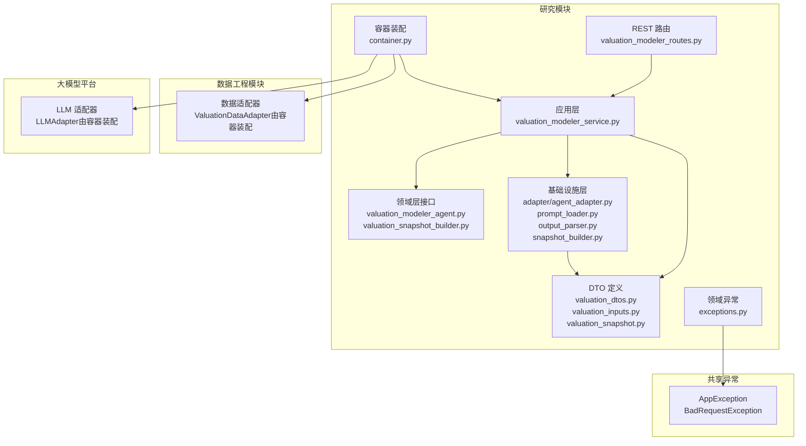
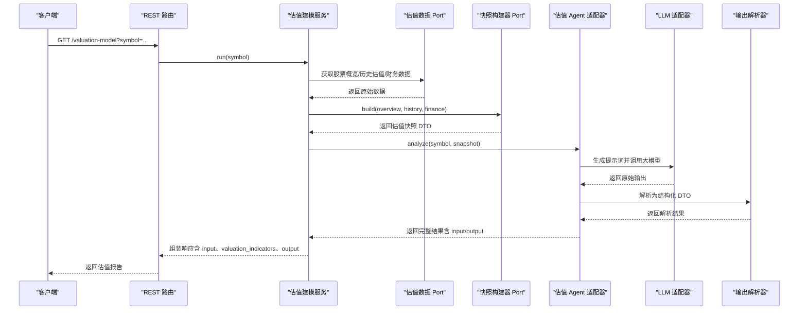
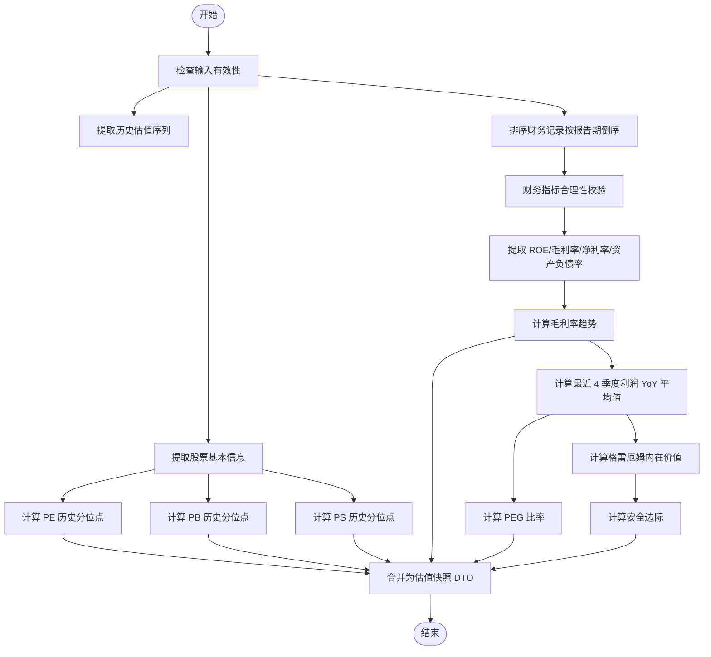

基于我对代码的分析，我现在可以更新估值建模师文档。主要改进包括：

1. **统一错误处理**：所有异常都继承自 `AppException`，并在表现层统一映射为 HTTP 状态码
2. **数据验证增强**：增加了财务指标合理性边界校验，防止异常数据进入 LLM
3. **标准化异常类型**：引入了 `LLMOutputParseError`、`BadRequestException` 等专门的异常类型

<docs>
# 估值建模师

<cite>
**本文档引用的文件**
- [src/modules/research/application/valuation_modeler_service.py](file://src/modules/research/application/valuation_modeler_service.py)
- [src/modules/research/domain/ports/valuation_modeler_agent.py](file://src/modules/research/domain/ports/valuation_modeler_agent.py)
- [src/modules/research/infrastructure/adapters/valuation_modeler_agent_adapter.py](file://src/modules/research/infrastructure/adapters/valuation_modeler_agent_adapter.py)
- [src/modules/research/infrastructure/agents/valuation_modeler/output_parser.py](file://src/modules/research/infrastructure/agents/valuation_modeler/output_parser.py)
- [src/modules/research/domain/dtos/valuation_dtos.py](file://src/modules/research/domain/dtos/valuation_dtos.py)
- [src/modules/research/domain/dtos/valuation_inputs.py](file://src/modules/research/domain/dtos/valuation_inputs.py)
- [src/modules/research/domain/ports/valuation_snapshot_builder.py](file://src/modules/research/domain/ports/valuation_snapshot_builder.py)
- [src/modules/research/infrastructure/valuation_snapshot/snapshot_builder.py](file://src/modules/research/infrastructure/valuation_snapshot/snapshot_builder.py)
- [src/modules/research/domain/dtos/valuation_snapshot.py](file://src/modules/research/domain/dtos/valuation_snapshot.py)
- [src/modules/research/presentation/rest/valuation_modeler_routes.py](file://src/modules/research/presentation/rest/valuation_modeler_routes.py)
- [src/modules/research/infrastructure/prompt_loader.py](file://src/modules/research/infrastructure/prompt_loader.py)
- [src/modules/research/container.py](file://src/modules/research/container.py)
- [src/modules/data_engineering/domain/model/financial_report.py](file://src/modules/data_engineering/domain/model/financial_report.py)
- [src/modules/research/domain/exceptions.py](file://src/modules/research/domain/exceptions.py)
- [src/shared/domain/exceptions.py](file://src/shared/domain/exceptions.py)
</cite>

## 更新摘要
**变更内容**
- 增强了统一错误处理机制，所有异常类型标准化
- 新增财务指标合理性边界校验，防止异常数据污染估值分析
- 完善了数据验证流程，从输入到输出的全流程保护
- 统一了异常映射到 HTTP 状态码的标准

## 目录
1. [引言](#引言)
2. [项目结构](#项目结构)
3. [核心组件](#核心组件)
4. [架构总览](#架构总览)
5. [详细组件分析](#详细组件分析)
6. [依赖关系分析](#依赖关系分析)
7. [性能考量](#性能考量)
8. [故障排除指南](#故障排除指南)
9. [结论](#结论)
10. [附录](#附录)

## 引言
本文件面向"估值建模师"专家角色，系统化阐述估值建模服务的端到端实现与使用方法。重点覆盖以下方面：
- 定价分析功能：DCF 估值模型、可比公司分析、相对估值方法的应用与集成思路
- 估值快照构建器：如何整合基本面数据、财务数据与技术分析结果，形成统一的综合估值视图
- 估值建模 Agent 的分析流程：从数据收集、快照构建、提示词填充、大模型推理到结果解析
- 输出解析器：如何将复杂多样的 LLM 输出解析为结构化、可复用的估值报告
- 使用示例：参数配置、模型选择与结果验证
- 理论基础与实践指导：DCF、PEG、格雷厄姆内在价值、安全边际等估值方法的适用场景与边界
- **新增**：统一错误处理机制与数据验证增强

## 项目结构
研究模块采用"应用层-领域层-基础设施层"的分层架构，围绕"专家角色"拆分为多个子域服务。估值建模服务位于研究模块，通过容器装配数据工程与大模型平台的适配器，形成完整的估值建模闭环。

**图表来源**
- [src/modules/research/application/valuation_modeler_service.py](file://src/modules/research/application/valuation_modeler_service.py#L1-L105)
- [src/modules/research/domain/ports/valuation_modeler_agent.py](file://src/modules/research/domain/ports/valuation_modeler_agent.py#L1-L28)
- [src/modules/research/infrastructure/adapters/valuation_modeler_agent_adapter.py](file://src/modules/research/infrastructure/adapters/valuation_modeler_agent_adapter.py#L1-L62)
- [src/modules/research/infrastructure/agents/valuation_modeler/output_parser.py](file://src/modules/research/infrastructure/agents/valuation_modeler/output_parser.py#L1-L137)
- [src/modules/research/domain/dtos/valuation_dtos.py](file://src/modules/research/domain/dtos/valuation_dtos.py#L1-L70)
- [src/modules/research/domain/dtos/valuation_inputs.py](file://src/modules/research/domain/dtos/valuation_inputs.py#L1-L39)
- [src/modules/research/domain/dtos/valuation_snapshot.py](file://src/modules/research/domain/dtos/valuation_snapshot.py#L1-L41)
- [src/modules/research/presentation/rest/valuation_modeler_routes.py](file://src/modules/research/presentation/rest/valuation_modeler_routes.py#L1-L80)
- [src/modules/research/container.py](file://src/modules/research/container.py#L1-L167)
- [src/modules/research/domain/exceptions.py](file://src/modules/research/domain/exceptions.py#L1-L34)
- [src/shared/domain/exceptions.py](file://src/shared/domain/exceptions.py#L1-L65)

**章节来源**
- [src/modules/research/application/valuation_modeler_service.py](file://src/modules/research/application/valuation_modeler_service.py#L1-L105)
- [src/modules/research/presentation/rest/valuation_modeler_routes.py](file://src/modules/research/presentation/rest/valuation_modeler_routes.py#L1-L80)
- [src/modules/research/container.py](file://src/modules/research/container.py#L1-L167)

## 核心组件
- 应用服务：编排数据获取、快照构建与 Agent 分析，组装最终响应
- 领域 Port：抽象 Agent 与快照构建器，隔离实现细节
- 基础设施适配器：加载提示词、调用 LLM、解析输出
- DTO：定义输入、快照与输出契约，确保类型安全与可解析性
- REST 路由：对外提供 HTTP 入口，封装异常与响应模型
- 容器：装配数据工程与大模型平台依赖，解耦模块间耦合
- **新增**：领域异常：统一的异常类型管理，支持标准化的状态码映射

**章节来源**
- [src/modules/research/application/valuation_modeler_service.py](file://src/modules/research/application/valuation_modeler_service.py#L20-L105)
- [src/modules/research/domain/ports/valuation_modeler_agent.py](file://src/modules/research/domain/ports/valuation_modeler_agent.py#L11-L28)
- [src/modules/research/infrastructure/adapters/valuation_modeler_agent_adapter.py](file://src/modules/research/infrastructure/adapters/valuation_modeler_agent_adapter.py#L28-L62)
- [src/modules/research/domain/dtos/valuation_dtos.py](file://src/modules/research/domain/dtos/valuation_dtos.py#L26-L70)
- [src/modules/research/presentation/rest/valuation_modeler_routes.py](file://src/modules/research/presentation/rest/valuation_modeler_routes.py#L39-L80)
- [src/modules/research/container.py](file://src/modules/research/container.py#L94-L108)
- [src/modules/research/domain/exceptions.py](file://src/modules/research/domain/exceptions.py#L1-L34)

## 架构总览
估值建模服务遵循"应用编排 + 领域契约 + 基础设施实现"的分层设计。应用层负责业务流程编排，领域层定义端口契约，基础设施层负责具体实现（提示词加载、LLM 调用、输出解析、数据适配）。

**图表来源**
- [src/modules/research/presentation/rest/valuation_modeler_routes.py](file://src/modules/research/presentation/rest/valuation_modeler_routes.py#L62-L80)
- [src/modules/research/application/valuation_modeler_service.py](file://src/modules/research/application/valuation_modeler_service.py#L37-L105)
- [src/modules/research/infrastructure/adapters/valuation_modeler_agent_adapter.py](file://src/modules/research/infrastructure/adapters/valuation_modeler_agent_adapter.py#L35-L62)
- [src/modules/research/infrastructure/agents/valuation_modeler/output_parser.py](file://src/modules/research/infrastructure/agents/valuation_modeler/output_parser.py#L60-L137)

## 详细组件分析

### 估值建模服务（应用层）
职责与流程
- 参数校验：确保 symbol 非空
- 数据获取：股票概览、历史估值日线（默认 3 年）、财务数据（限制条数）
- 快照构建：将原始数据与预计算指标打包为估值快照
- Agent 分析：调用估值 Agent，解析输出为结构化 DTO
- 响应组装：将解析结果与 input、valuation_indicators、output 组合返回

关键点
- 默认历史窗口：3 年
- 财务数据非空校验：无财务数据则报错
- 输出字段：包含判断、置信度、内在价值区间、关键证据、风险因素、推理摘要，以及原始 prompt 与快照
- **新增**：统一异常处理：所有业务异常都会被标准化并映射到适当的 HTTP 状态码

**章节来源**
- [src/modules/research/application/valuation_modeler_service.py](file://src/modules/research/application/valuation_modeler_service.py#L37-L105)

### 估值快照构建器（领域 + 基础设施）
设计思路
- 输入：股票概览、历史估值日线、财务记录
- 预计算指标：历史分位点（PE/PB/PS）、PEG、格雷厄姆内在价值、安全边际、毛利率趋势、平均利润增速
- 输出：与提示词模板一一对应的估值快照 DTO

算法要点
- 历史分位点：过滤无效值，至少 60 个交易日才计算
- PEG：PE/平均利润增速，增速或 PE 非正时返回 N/A
- 格雷厄姆内在价值：sqrt(22.5 × EPS × BPS)，任一为非正或异常返回 N/A
- 安全边际：(格雷厄姆 - 当前价格)/当前价格 × 100
- 毛利率趋势：比较最新与上一期，输出描述性文本
- 平均利润增速：按季度推算 YoY，取最近 4 期平均
- **新增**：财务指标合理性校验：对关键财务指标进行边界检查，超出合理范围的值替换为 N/A 并记录警告日志

**图表来源**
- [src/modules/research/infrastructure/valuation_snapshot/snapshot_builder.py](file://src/modules/research/infrastructure/valuation_snapshot/snapshot_builder.py#L170-L325)

**章节来源**
- [src/modules/research/domain/ports/valuation_snapshot_builder.py](file://src/modules/research/domain/ports/valuation_snapshot_builder.py#L16-L34)
- [src/modules/research/infrastructure/valuation_snapshot/snapshot_builder.py](file://src/modules/research/infrastructure/valuation_snapshot/snapshot_builder.py#L25-L325)
- [src/modules/research/domain/dtos/valuation_snapshot.py](file://src/modules/research/domain/dtos/valuation_snapshot.py#L10-L41)

### 估值建模 Agent（基础设施）
职责与流程
- 加载系统提示词与用户模板
- 填充估值快照占位符生成最终提示词
- 调用 LLM 生成原始输出
- 解析为结构化 DTO，同时保留原始输出与用户提示词

提示词加载与填充
- 提示词目录：agents/valuation_modeler/prompts
- 系统提示词：system.md
- 用户模板：user.md
- 填充函数：fill_valuation_modeler_user_prompt，将快照字段映射到模板占位符

**章节来源**
- [src/modules/research/infrastructure/adapters/valuation_modeler_agent_adapter.py](file://src/modules/research/infrastructure/adapters/valuation_modeler_agent_adapter.py#L28-L62)
- [src/modules/research/infrastructure/prompt_loader.py](file://src/modules/research/infrastructure/prompt_loader.py#L150-L195)

### 输出解析器（基础设施）
职责与流程
- 剥离 Markdown 代码块与思考标签（如 