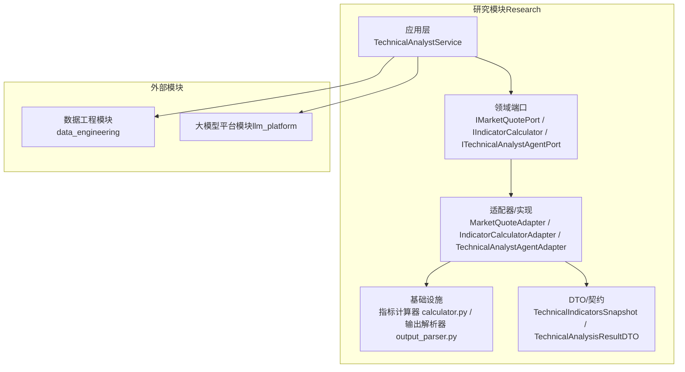
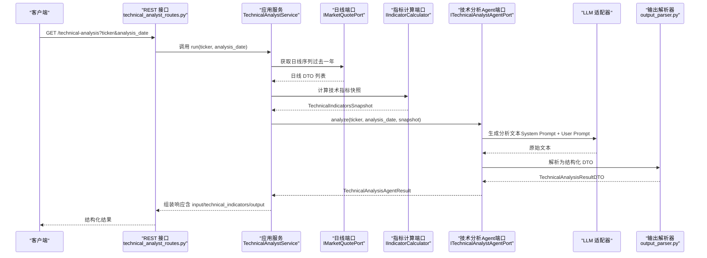
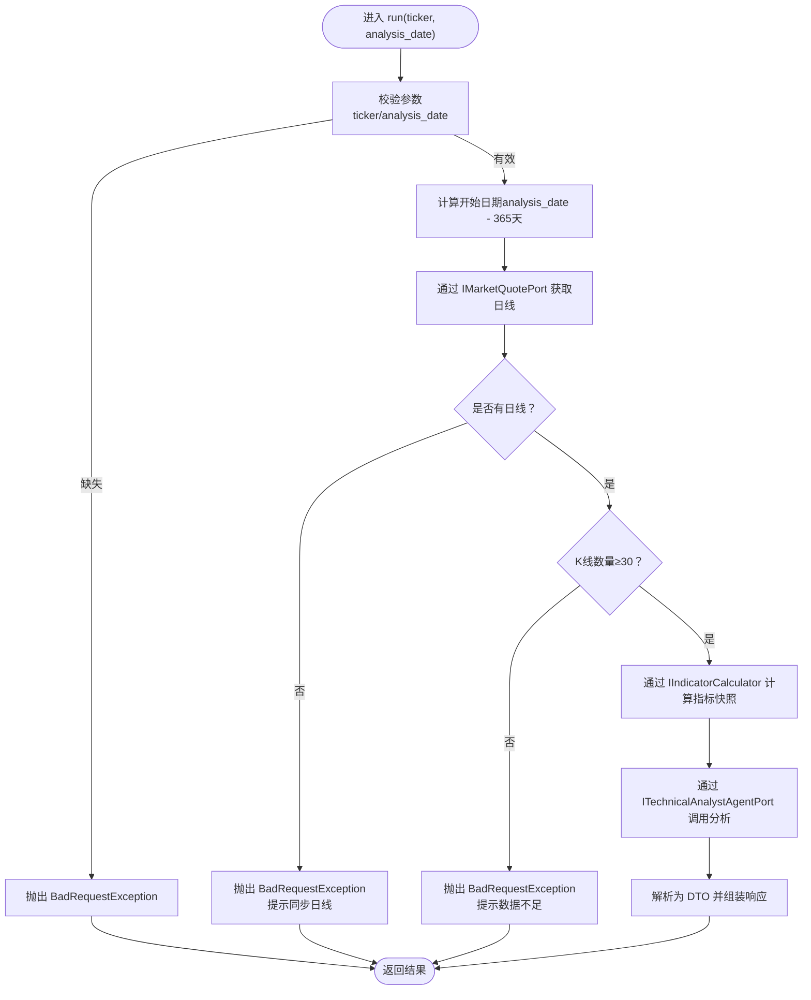
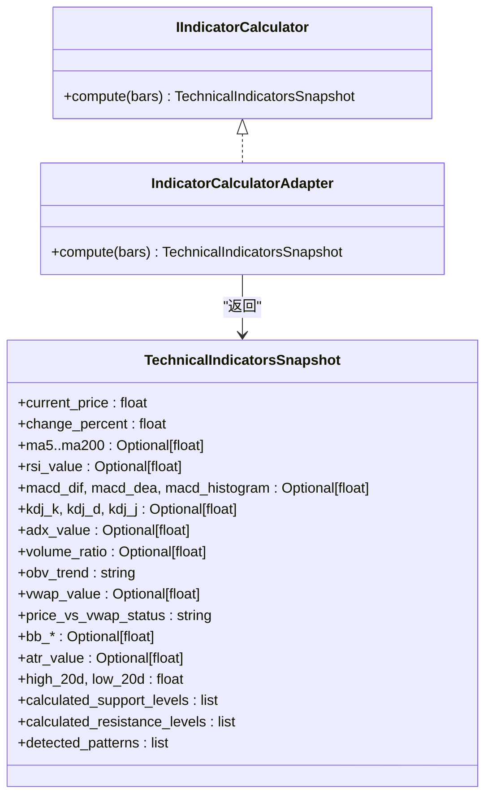
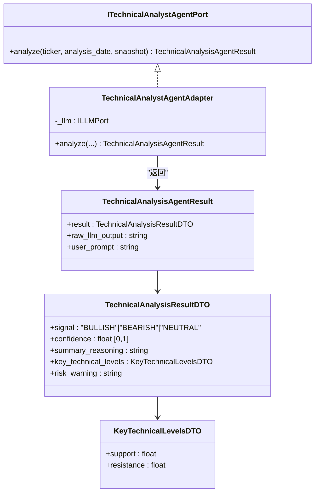
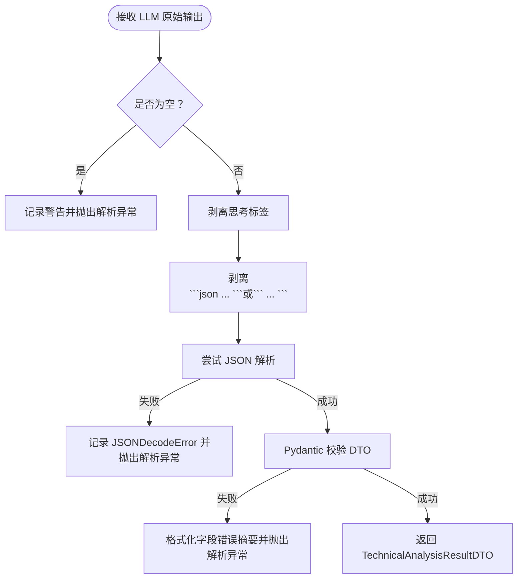
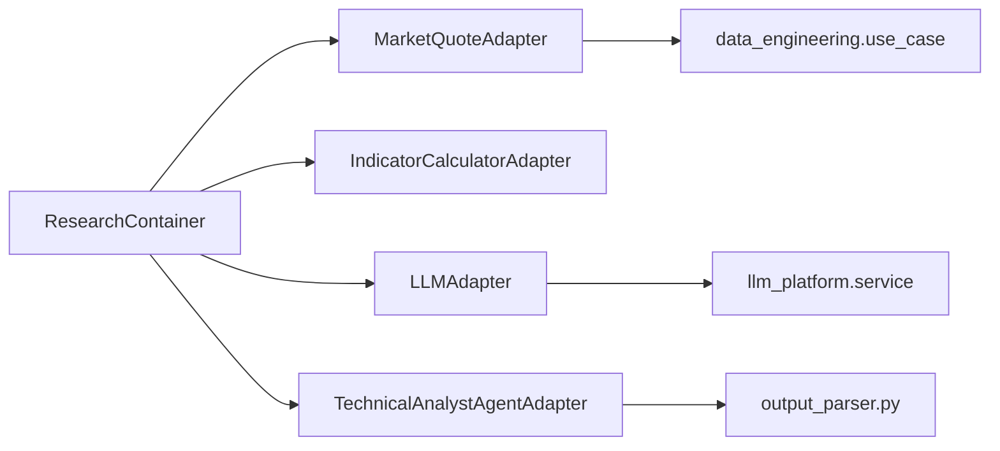

# 技术分析师

<cite>
**本文档引用的文件**
- [spec.md](file://openspec/specs/research-technical-analyst/spec.md)
- [technical_analyst_service.py](file://src/modules/research/application/technical_analyst_service.py)
- [technical_analyst_routes.py](file://src/modules/research/presentation/rest/technical_analyst_routes.py)
- [container.py](file://src/modules/research/container.py)
- [indicator_calculator.py](file://src/modules/research/domain/ports/indicator_calculator.py)
- [technical_analyst_agent.py](file://src/modules/research/domain/ports/technical_analyst_agent.py)
- [calculator.py](file://src/modules/research/infrastructure/indicators/calculator.py)
- [indicator_calculator_adapter.py](file://src/modules/research/infrastructure/indicators/indicator_calculator_adapter.py)
- [technical_analyst_agent_adapter.py](file://src/modules/research/infrastructure/adapters/technical_analyst_agent_adapter.py)
- [output_parser.py](file://src/modules/research/infrastructure/agents/technical_analyst/output_parser.py)
- [indicators_snapshot.py](file://src/modules/research/domain/dtos/indicators_snapshot.py)
- [technical_analysis_dtos.py](file://src/modules/research/domain/dtos/technical_analysis_dtos.py)
- [user.md](file://src/modules/research/infrastructure/agents/technical_analyst/prompts/user.md)
- [prompt_loader.py](file://src/modules/research/infrastructure/prompt_loader.py)
- [test_technical_analyst_service.py](file://tests/research/application/test_technical_analyst_service.py)
</cite>

## 更新摘要
**变更内容**
- 更新最小数据要求：从20个bar增加到30个bar，确保更稳健的技术指标计算
- 统一错误处理：增强参数验证和数据充足性检查
- 指标数据完整性：指标字段支持None值，提升数据鲁棒性
- Prompt填充优化：自动处理None值为"N/A"，改善用户体验

## 目录
1. [简介](#简介)
2. [项目结构](#项目结构)
3. [核心组件](#核心组件)
4. [架构总览](#架构总览)
5. [组件详解](#组件详解)
6. [依赖关系分析](#依赖关系分析)
7. [性能考量](#性能考量)
8. [故障排查指南](#故障排查指南)
9. [结论](#结论)
10. [附录](#附录)

## 简介
本文件面向技术分析师专家角色，系统化阐述"技术分析师服务"的设计与实现，涵盖技术指标计算、市场趋势分析与交易信号生成的完整流程。文档重点包括：
- 技术指标计算：移动平均线（MA）、RSI、MACD、KDJ、ADX、布林带（BB）、ATR、OBV、量比、VWAP 等的实现逻辑与数据来源。
- 工作流编排：从日线数据获取、指标快照生成、LLM 分析到结构化输出解析的端到端过程。
- 输出解析器：如何将 LLM 的自然语言分析转换为结构化技术分析报告，并保证契约一致性与可诊断性。
- 使用示例：参数配置、数据输入格式与结果解读。
- 性能优化与扩展开发指导。

## 项目结构
技术分析师服务位于研究模块（Research）中，遵循领域驱动设计（DDD）与依赖倒置原则，通过 Port/Adapter 将应用层与基础设施层解耦，确保可替换性与可测试性。

**图表来源**
- [technical_analyst_service.py](file://src/modules/research/application/technical_analyst_service.py#L14-L73)
- [container.py](file://src/modules/research/container.py#L62-L74)
- [indicator_calculator_adapter.py](file://src/modules/research/infrastructure/indicators/indicator_calculator_adapter.py#L14-L19)
- [technical_analyst_agent_adapter.py](file://src/modules/research/infrastructure/adapters/technical_analyst_agent_adapter.py#L22-L54)

**章节来源**
- [technical_analyst_service.py](file://src/modules/research/application/technical_analyst_service.py#L1-L73)
- [container.py](file://src/modules/research/container.py#L44-L74)

## 核心组件
- 技术分析师服务（应用层）：协调日线获取、指标计算与 LLM 分析，组装最终响应。
- 指标计算 Port 与适配器：定义并实现技术指标计算契约，输出标准化快照。
- 技术分析 Agent Port 与适配器：加载 Prompt、调用 LLM、解析 JSON，返回结构化结果。
- 输出解析器：严格校验 LLM 输出，格式化错误以便快速定位。
- DTO/契约：统一输入输出的数据结构，保障跨模块传递的一致性。

**章节来源**
- [technical_analyst_service.py](file://src/modules/research/application/technical_analyst_service.py#L14-L73)
- [indicator_calculator.py](file://src/modules/research/domain/ports/indicator_calculator.py#L13-L19)
- [technical_analyst_agent.py](file://src/modules/research/domain/ports/technical_analyst_agent.py#L12-L23)
- [output_parser.py](file://src/modules/research/infrastructure/agents/technical_analyst/output_parser.py#L64-L116)
- [indicators_snapshot.py](file://src/modules/research/domain/dtos/indicators_snapshot.py#L10-L46)
- [technical_analysis_dtos.py](file://src/modules/research/domain/dtos/technical_analysis_dtos.py#L20-L42)

## 架构总览
技术分析师服务的端到端工作流如下：

**图表来源**
- [technical_analyst_routes.py](file://src/modules/research/presentation/rest/technical_analyst_routes.py#L48-L77)
- [technical_analyst_service.py](file://src/modules/research/application/technical_analyst_service.py#L30-L73)
- [technical_analyst_agent_adapter.py](file://src/modules/research/infrastructure/adapters/technical_analyst_agent_adapter.py#L29-L54)
- [output_parser.py](file://src/modules/research/infrastructure/agents/technical_analyst/output_parser.py#L64-L116)

## 组件详解

### 技术分析师服务（应用层）
- 职责：对外暴露独立 Application 接口，编排"获取日线 → 计算指标 → 调用 Agent → 组装响应"。
- 输入：股票代码、分析基准日；输出：包含信号、置信度、摘要、关键价位与风险提示的结构化结果，以及原始 Prompt、指标快照与 LLM 输出。
- 错误处理：对缺失参数与无日线数据场景抛出明确异常；对 LLM 解析失败进行捕获与日志记录；新增最小数据要求检查（至少30根K线）。

**图表来源**
- [technical_analyst_service.py](file://src/modules/research/application/technical_analyst_service.py#L30-L73)

**章节来源**
- [technical_analyst_service.py](file://src/modules/research/application/technical_analyst_service.py#L14-L73)

### 技术指标计算（领域端口与实现）
- 契约：IIndicatorCalculator 定义 compute(bars) → TechnicalIndicatorsSnapshot。
- 实现：IndicatorCalculatorAdapter 委托至 calculator.py 的 compute_technical_indicators，内置多周期 MA、RSI、MACD、KDJ、ADX、布林带、ATR、OBV、量比、VWAP 等。
- 数据来源：日线 DTO 列表（开盘、最高、最低、收盘、成交量、涨跌幅等）。
- **更新**：指标函数在数据不足时返回 None 而非默认值，确保数据完整性。

**图表来源**
- [indicator_calculator.py](file://src/modules/research/domain/ports/indicator_calculator.py#L13-L19)
- [indicator_calculator_adapter.py](file://src/modules/research/infrastructure/indicators/indicator_calculator_adapter.py#L14-L19)
- [indicators_snapshot.py](file://src/modules/research/domain/dtos/indicators_snapshot.py#L10-L46)

**章节来源**
- [indicator_calculator.py](file://src/modules/research/domain/ports/indicator_calculator.py#L1-L19)
- [indicator_calculator_adapter.py](file://src/modules/research/infrastructure/indicators/indicator_calculator_adapter.py#L1-L19)
- [calculator.py](file://src/modules/research/infrastructure/indicators/calculator.py#L210-L308)
- [indicators_snapshot.py](file://src/modules/research/domain/dtos/indicators_snapshot.py#L1-L46)

### 技术分析 Agent（端口与适配器）
- 端口：ITechnicalAnalystAgentPort 定义 analyze(ticker, analysis_date, snapshot) → TechnicalAnalysisAgentResult。
- 适配器：TechnicalAnalystAgentAdapter 负责加载 Prompt 模板、填充占位符、调用 LLM、解析 JSON，并返回包含原始输出与 Prompt 的结果。

**图表来源**
- [technical_analyst_agent.py](file://src/modules/research/domain/ports/technical_analyst_agent.py#L12-L23)
- [technical_analyst_agent_adapter.py](file://src/modules/research/infrastructure/adapters/technical_analyst_agent_adapter.py#L22-L54)
- [technical_analysis_dtos.py](file://src/modules/research/domain/dtos/technical_analysis_dtos.py#L20-L42)

**章节来源**
- [technical_analyst_agent.py](file://src/modules/research/domain/ports/technical_analyst_agent.py#L1-L23)
- [technical_analyst_agent_adapter.py](file://src/modules/research/infrastructure/adapters/technical_analyst_agent_adapter.py#L1-L54)
- [technical_analysis_dtos.py](file://src/modules/research/domain/dtos/technical_analysis_dtos.py#L1-L42)

### 输出解析器（JSON 校验与错误处理）
- 能力：剥离思考标签、Markdown 代码块包裹的 JSON、严格校验结构与字段类型，格式化错误摘要，记录原始输出便于排查。
- 异常：对空输出、非 JSON、根节点非对象、字段校验失败等情况抛出领域友好异常。

**图表来源**
- [output_parser.py](file://src/modules/research/infrastructure/agents/technical_analyst/output_parser.py#L64-L116)

**章节来源**
- [output_parser.py](file://src/modules/research/infrastructure/agents/technical_analyst/output_parser.py#L1-L116)

### Prompt 设计与加载
- Prompt 存放于代码库资源目录，分别包含系统提示与用户模板，占位符在运行时填充。
- 用户模板包含目标资产信息、硬数据事实（价格与趋势、动量、波动率与通道、量能与资金、关键价位）与分析任务与输出契约。
- **更新**：新增 _indicator_str 函数，将 None 值自动转换为 "N/A"，提升用户体验。

**章节来源**
- [user.md](file://src/modules/research/infrastructure/agents/technical_analyst/prompts/user.md#L1-L49)
- [prompt_loader.py](file://src/modules/research/infrastructure/prompt_loader.py#L35-L37)

### REST 接口与响应模型
- 接口：GET /technical-analysis，支持查询参数 ticker 与 analysis_date（默认当天）。
- 响应：包含解析结果与 input、technical_indicators、output（均由服务端组装，非 LLM 拼接）。

**章节来源**
- [technical_analyst_routes.py](file://src/modules/research/presentation/rest/technical_analyst_routes.py#L48-L77)

## 依赖关系分析
- 组合根（Composition Root）：ResearchContainer 负责装配技术分析师服务所需的端口与适配器，确保跨模块依赖通过 DataEngineeringContainer 与 LLMPlatformContainer 获取，避免直接依赖底层实现。
- 依赖方向：应用层仅依赖领域端口；基础设施层实现端口契约；外部模块通过适配器对接。

**图表来源**
- [container.py](file://src/modules/research/container.py#L62-L74)
- [technical_analyst_agent_adapter.py](file://src/modules/research/infrastructure/adapters/technical_analyst_agent_adapter.py#L25-L28)

**章节来源**
- [container.py](file://src/modules/research/container.py#L44-L74)

## 性能考量
- 时间窗口控制：默认回溯一年日线，确保指标计算与 LLM Prompt 体量可控。
- 指标计算复杂度：多周期 MA、RSI、MACD、KDJ、ADX、布林带、ATR、OBV 等均为 O(n) 线性扫描，整体复杂度与日线条数线性相关。
- I/O 优化：日线获取与 LLM 调用为外部依赖，可通过缓存与并发策略优化；注意温度参数设置与提示词长度控制。
- 输出解析：解析阶段包含 JSON 解析与 Pydantic 校验，建议在上游控制 Prompt 输出稳定性，减少解析失败概率。
- **更新**：最小数据要求提升至30根K线，确保更稳健的技术指标计算，但可能增加部分新上市股票的等待时间。

## 故障排查指南
- 参数缺失：当 ticker 或 analysis_date 缺失时，服务会抛出明确错误；请检查请求参数。
- 无日线数据：若指定区间无日线，提示先同步日线；请先调用日线同步接口。
- **更新**：K线数量不足：当日线数量少于30根时，系统会明确提示需要更多历史数据；这是为了确保技术指标的统计意义。
- LLM 解析失败：解析器会记录原始输出与错误摘要；请检查 Prompt 模板与 LLM 温度设置，确保输出符合契约。
- **更新**：指标数据为None：当某些指标因数据不足而无法计算时，会在Prompt中显示"N/A"，这是正常现象。
- 常见错误定位：
  - 空输出：检查 Agent 是否正确生成文本。
  - 非 JSON：检查模型是否遵循 JSON 输出示例。
  - 字段校验失败：对照 DTO 字段类型与范围，修正 Prompt 或上游数据。

**章节来源**
- [technical_analyst_service.py](file://src/modules/research/application/technical_analyst_service.py#L39-L54)
- [output_parser.py](file://src/modules/research/infrastructure/agents/technical_analyst/output_parser.py#L70-L115)
- [test_technical_analyst_service.py](file://tests/research/application/test_technical_analyst_service.py#L142-L163)

## 结论
技术分析师服务通过清晰的端口契约与适配器实现，实现了从日线数据到结构化分析报告的完整闭环。其核心优势在于：
- 领域与实现分离，便于替换第三方库与优化算法。
- 严格的输出契约与解析器，确保结果可验证、可诊断。
- 独立的应用入口，便于在专家编排中单独调用。
- **更新**：更强健的数据质量控制，通过最小数据要求确保技术分析的可靠性。

## 附录

### 使用示例（参数、输入格式与结果解读）
- 请求路径与参数
  - 方法：GET
  - 路径：/technical-analysis
  - 查询参数：
    - ticker：股票代码（如 000001.SZ）
    - analysis_date：分析基准日（YYYY-MM-DD；可选，默认当天）

- 响应字段说明
  - signal：多头/空头/中性
  - confidence：置信度（0~1）
  - summary_reasoning：基于指标数值的简练分析摘要
  - key_technical_levels：关键支撑/阻力位
  - risk_warning：观点失效条件
  - input：送入 LLM 的用户 Prompt（代码组装）
  - technical_indicators：指标快照（代码组装）
  - output：LLM 原始输出（代码组装）

- 结果解读要点
  - 信号与置信度：结合趋势、动量与价位共振综合判断；冲突指标会降低置信度。
  - 关键价位：优先选择与均线、布林带中轨、计算支撑/阻力重合的共振位。
  - 风险提示：明确观点失效条件，便于风控与止盈止损设置。
  - **更新**：指标为None：当某些指标显示为"N/A"时，表示数据不足无法计算，这在技术分析中是正常现象。

**章节来源**
- [technical_analyst_routes.py](file://src/modules/research/presentation/rest/technical_analyst_routes.py#L48-L77)
- [technical_analysis_dtos.py](file://src/modules/research/domain/dtos/technical_analysis_dtos.py#L20-L42)

### 技术指标计算逻辑速览
- 移动平均线（MA）：多周期简单移动平均，不足时回退至可用长度。
- RSI（14）：基于 N-1 日涨跌差分计算平均利失，防止零除。
- MACD（12,26,9）：DIF=EMA(fast)-EMA(slow)，DEA=EMA(DIF,signal)，柱=DIF-DEA。
- KDJ（9,3,3）：RSV 计算与 K/D 递推平滑。
- ADX（14）：Wilder 平滑 TR、+DM、-DM，计算 DX 与 ADX。
- 布林带（20,2）：中轨 MA20，上下轨 ±2σ，带宽百分比。
- ATR（14）：Wilder 平滑真实波幅。
- OBV（5 日趋势）：累计 OBV 与最近 N 日对比。
- 量比：当日量 / 5 日均量。
- VWAP：周期内成交量加权均价。

**章节来源**
- [calculator.py](file://src/modules/research/infrastructure/indicators/calculator.py#L11-L308)
- [indicators_snapshot.py](file://src/modules/research/domain/dtos/indicators_snapshot.py#L10-L46)

### 扩展开发指导
- 新增指标：在 Infrastructure 层新增计算函数并在快照中补充字段，保持 DTO 与 Prompt 的一致性。
- 替换实现：通过替换 IndicatorCalculatorAdapter 的实现或引入第三方库（如 ta-lib、pandas），不影响应用层调用。
- Prompt 迭代：将 Prompt 存放于资源文件，避免硬编码；在 Agent 适配器中加载与填充。
- 错误治理：持续完善解析器的错误摘要与日志截断策略，提升可观测性。
- **更新**：数据质量控制：在新增或修改指标时，考虑最小数据要求，确保技术分析的有效性。

**章节来源**
- [spec.md](file://openspec/specs/research-technical-analyst/spec.md#L43-L56)
- [user.md](file://src/modules/research/infrastructure/agents/technical_analyst/prompts/user.md#L1-L49)