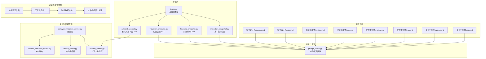
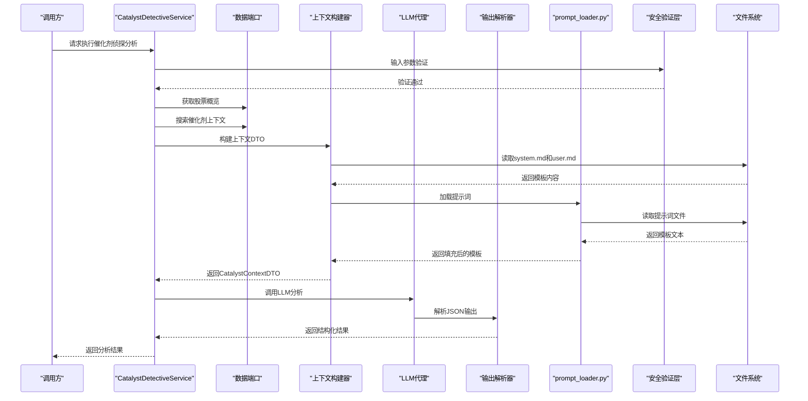
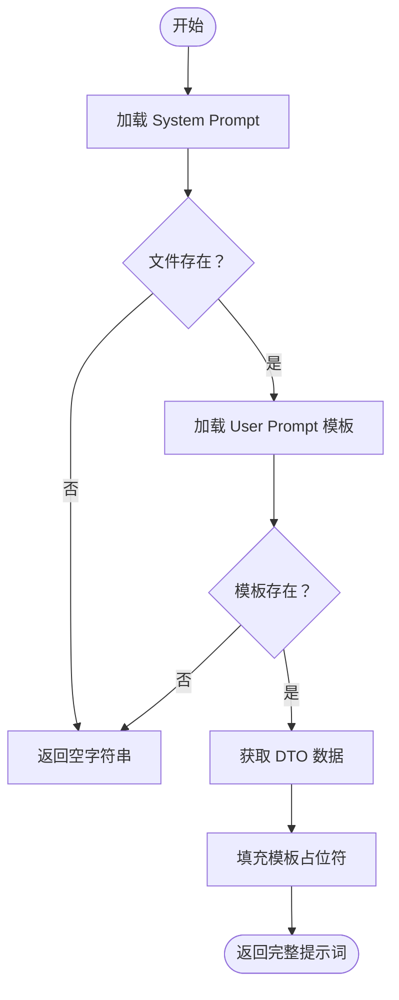
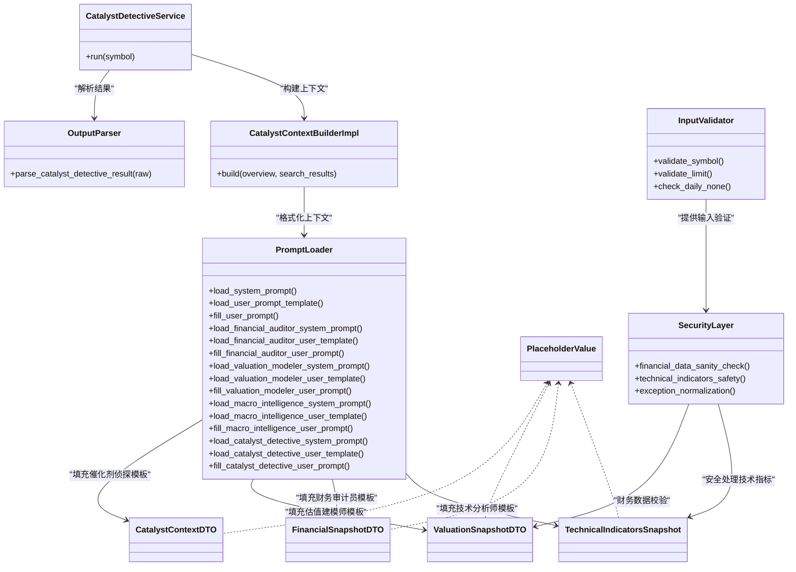

# 研究代理系统

<cite>
**本文档引用的文件**
- [prompt_loader.py](file://src/modules/research/infrastructure/prompt_loader.py)
- [design.md（输入鲁棒性）](file://openspec/changes/archive/2026-02-13-research-input-robustness/design.md)
- [spec.md（研究错误一致性）](file://openspec/changes/archive/2026-02-13-research-input-robustness/specs/research-error-consistency/spec.md)
- [spec.md（财务数据合理性）](file://openspec/changes/archive/2026-02-13-research-input-robustness/specs/financial-data-sanity/spec.md)
- [calculator.py（技术指标计算）](file://src/modules/research/infrastructure/indicators/calculator.py)
- [indicators_snapshot.py（技术指标快照）](file://src/modules/research/domain/dtos/indicators_snapshot.py)
- [snapshot_builder.py（估值快照构建）](file://src/modules/research/infrastructure/valuation_snapshot/snapshot_builder.py)
- [catalyst_detective_service.py（催化剂侦探服务）](file://src/modules/research/application/catalyst_detective_service.py)
- [financial_auditor_service.py（财务审计员服务）](file://src/modules/research/application/financial_auditor_service.py)
- [valuation_modeler_service.py（估值建模师服务）](file://src/modules/research/application/valuation_modeler_service.py)
- [output_parser.py（财务审计员输出解析）](file://src/modules/research/infrastructure/agents/financial_auditor/output_parser.py)
- [system.md（财务审计员）](file://openspec/changes/archive/2026-02-11-research-financial-auditor/system.md)
- [user.md（财务审计员）](file://openspec/changes/archive/2026-02-11-research-financial-auditor/user.md)
- [system.md（估值建模师）](file://openspec/changes/archive/2026-02-12-research-valuation-modeler/system.md)
- [user.md（估值建模师）](file://openspec/changes/archive/2026-02-12-research-valuation-modeler/user.md)
- [system.md（宏观情报员）](file://openspec/changes/archive/2026-02-13-research-macro-intelligence/system.md)
- [user.md（宏观情报员）](file://openspec/changes/archive/2026-02-13-research-macro-intelligence/user.md)
- [system.md（催化剂侦探）](file://src/modules/research/infrastructure/agents/catalyst_detective/prompts/system.md)
- [user.md（催化剂侦探）](file://src/modules/research/infrastructure/agents/catalyst_detective/prompts/user.md)
- [indicators_snapshot.py](file://src/modules/research/domain/dtos/indicators_snapshot.py)
- [financial_snapshot.py](file://src/modules/research/domain/dtos/financial_snapshot.py)
- [valuation_snapshot.py](file://src/modules/research/domain/dtos/valuation_snapshot.py)
- [types.py](file://src/modules/research/domain/dtos/types.py)
- [catalyst_context.py](file://src/modules/research/domain/dtos/catalyst_context.py)
- [catalyst_inputs.py](file://src/modules/research/domain/dtos/catalyst_inputs.py)
- [catalyst_dtos.py](file://src/modules/research/domain/dtos/catalyst_dtos.py)
- [catalyst_detective_service.py](file://src/modules/research/application/catalyst_detective_service.py)
- [context_builder.py](file://src/modules/research/infrastructure/catalyst_context/context_builder.py)
- [output_parser.py](file://src/modules/research/infrastructure/agents/catalyst_detective/output_parser.py)
- [catalyst_detective_routes.py](file://src/modules/research/presentation/rest/catalyst_detective_routes.py)
</cite>

## 更新摘要
**所做更改**
- 新增统一安全性与鲁棒性措施章节，详细说明输入验证增强的具体实现
- 更新技术指标安全处理机制，包括数据不足时的标记策略
- 新增财务数据合理性边界校验的详细实现
- 更新异常类型统一策略和返回值类型规范化
- 新增历史数据为空时的日志警告机制
- 更新输入验证增强的最佳实践指导

## 目录
1. [引言](#引言)
2. [项目结构](#项目结构)
3. [核心组件](#核心组件)
4. [架构总览](#架构总览)
5. [详细组件分析](#详细组件分析)
6. [依赖关系分析](#依赖关系分析)
7. [性能考量](#性能考量)
8. [故障排查指南](#故障排查指南)
9. [结论](#结论)
10. [附录](#附录)

## 引言
本文件面向研究代理系统，系统性梳理提示词工程的设计与实现，涵盖系统提示词与用户提示词的设计原则、最佳实践、加载机制、动态管理与版本控制、专家角色差异与适用场景、优化与调试方法、安全性与鲁棒性考虑，以及自定义提示词的开发与扩展建议。研究代理系统现已完整集成催化剂侦探功能，提供从事件驱动分析到结构化输出的完整解决方案。

**更新重点**：本次更新特别关注统一的安全性与鲁棒性措施，包括输入验证增强、异常类型统一化、财务数据合理性校验、技术指标安全处理等多个方面的改进，确保系统在各种边界场景下的稳定运行。

## 项目结构
研究代理系统围绕"提示词即资产"的理念，将不同专家角色的提示词以独立的 Markdown 文件形式存放，并通过统一的加载器在运行时按需读取与填充。系统现已完整实现催化剂侦探模块，提供事件驱动的催化因子识别能力。数据层采用 Pydantic DTO 对象承载输入数据，确保占位符与模板字段严格对齐。

**图表来源**
- [prompt_loader.py](file://src/modules/research/infrastructure/prompt_loader.py#L1-L289)
- [system.md（催化剂侦探）](file://src/modules/research/infrastructure/agents/catalyst_detective/prompts/system.md#L1-L98)
- [user.md（催化剂侦探）](file://src/modules/research/infrastructure/agents/catalyst_detective/prompts/user.md#L1-L49)
- [catalyst_detective_service.py](file://src/modules/research/application/catalyst_detective_service.py#L1-L84)
- [context_builder.py](file://src/modules/research/infrastructure/catalyst_context/context_builder.py#L1-L86)
- [output_parser.py](file://src/modules/research/infrastructure/agents/catalyst_detective/output_parser.py#L1-L100)
- [catalyst_detective_routes.py](file://src/modules/research/presentation/rest/catalyst_detective_routes.py#L1-L103)
- [design.md（输入鲁棒性）](file://openspec/changes/archive/2026-02-13-research-input-robustness/design.md#L1-L103)

**章节来源**
- [prompt_loader.py](file://src/modules/research/infrastructure/prompt_loader.py#L1-L289)
- [catalyst_detective_service.py](file://src/modules/research/application/catalyst_detective_service.py#L1-L84)

## 核心组件
- **提示词加载器**：负责从指定目录读取 system.md 与 user.md，并将运行时数据填充到模板占位符，返回可用于 LLM 的完整提示词。
- **专家角色提示词**：财务审计员、估值建模师、宏观情报员、催化剂侦探各自拥有独立的系统提示词与用户提示词模板，体现不同的分析范式与输出约束。
- **数据传输对象（DTO）**：技术指标快照、财务快照、估值快照、催化剂上下文，统一占位符类型与字段，保证模板与数据的强一致性。
- **催化剂侦探实现**：完整的事件驱动分析流水线，包括服务层、上下文构建器、输出解析器和API路由。
- **统一安全性与鲁棒性措施**：包括输入验证增强、异常类型统一化、财务数据合理性校验、技术指标安全处理等多重防护机制。

**章节来源**
- [prompt_loader.py](file://src/modules/research/infrastructure/prompt_loader.py#L11-L32)
- [indicators_snapshot.py](file://src/modules/research/domain/dtos/indicators_snapshot.py#L10-L47)
- [financial_snapshot.py](file://src/modules/research/domain/dtos/financial_snapshot.py#L10-L49)
- [valuation_snapshot.py](file://src/modules/research/domain/dtos/valuation_snapshot.py#L10-L41)
- [catalyst_context.py](file://src/modules/research/domain/dtos/catalyst_context.py#L1-L19)
- [catalyst_detective_service.py](file://src/modules/research/application/catalyst_detective_service.py#L29-L84)

## 架构总览
系统采用"提示词即资产 + 运行时填充"的架构。提示词文件作为独立资产，便于版本化管理与团队协作；加载器在运行时按角色读取模板并填充数据，确保提示词与输入数据解耦、可维护性强。催化剂侦探模块提供完整的事件驱动分析能力，从Web搜索到结构化输出的端到端解决方案。

**更新**：新增统一的安全性与鲁棒性架构，通过多层次的输入验证和异常处理机制，确保系统在各种边界场景下的稳定运行。

**图表来源**
- [catalyst_detective_service.py](file://src/modules/research/application/catalyst_detective_service.py#L35-L84)
- [context_builder.py](file://src/modules/research/infrastructure/catalyst_context/context_builder.py#L15-L73)
- [prompt_loader.py](file://src/modules/research/infrastructure/prompt_loader.py#L256-L289)
- [output_parser.py](file://src/modules/research/infrastructure/agents/catalyst_detective/output_parser.py#L35-L99)

## 详细组件分析

### 提示词加载与填充机制
- **加载策略**：默认从固定资源目录加载，支持通过参数覆盖目录位置，便于测试与多版本并存。
- **填充策略**：使用字符串格式化将 DTO 字段映射到模板占位符，序列类字段进行 JSON 序列化以适配模板中的 JSON 块。
- **错误处理**：若模板文件不存在，返回空字符串，避免中断流程，便于上层统一处理。

**图表来源**
- [prompt_loader.py](file://src/modules/research/infrastructure/prompt_loader.py#L17-L32)
- [prompt_loader.py](file://src/modules/research/infrastructure/prompt_loader.py#L35-L72)

**章节来源**
- [prompt_loader.py](file://src/modules/research/infrastructure/prompt_loader.py#L11-L32)
- [prompt_loader.py](file://src/modules/research/infrastructure/prompt_loader.py#L35-L72)

### 财务审计员（系统提示词）
- **角色定位**：虚拟对冲基金的首席财务官兼法务审计长，强调客观、数据驱动与风险厌恶。
- **分析框架**：五维审计模型（盈利含金量、运营效率与造假侦测、资本回报与护城河、偿债与生存能力、成长加速度）。
- **输出约束**：严格 JSON 输出，禁止 Markdown 标记，确保解析稳定性。

**章节来源**
- [system.md（财务审计员）](file://openspec/changes/archive/2026-02-11-research-financial-auditor/system.md#L1-L52)

### 财务审计员（用户提示词）
- **输入结构**：静态财务快照（盈利能力、每股含金量、资产负债与流动性、运营效率）与历史趋势序列（季度列表与多项指标序列）。
- **填充要点**：序列字段需 JSON 序列化，确保模板中的 JSON 块正确渲染。

**章节来源**
- [user.md（财务审计员）](file://openspec/changes/archive/2026-02-11-research-financial-auditor/user.md#L1-L47)
- [prompt_loader.py](file://src/modules/research/infrastructure/prompt_loader.py#L94-L144)
- [financial_snapshot.py](file://src/modules/research/domain/dtos/financial_snapshot.py#L10-L49)

### 估值建模师（系统提示词）
- **角色定位**：高级估值建模师，坚持怀疑主义与安全边际，拒绝数学计算与外部信息。
- **分析框架**：相对估值（历史分位点）、成长匹配度（PEG）、价值地板（格雷厄姆模型）、排雷（基本面质量与财务健康）。
- **输出约束**：严格 JSON 输出，字段与置信度、区间估计、关键证据与风险因素一一对应。

**章节来源**
- [system.md（估值建模师）](file://openspec/changes/archive/2026-02-12-research-valuation-modeler/system.md#L1-L44)

### 估值建模师（用户提示词）
- **输入结构**：市场相对估值快照（PE、PB、PS、股息率）、基本面质量体检（ROE、毛利率、净利率、资产负债率）、预计算模型（PEG、格雷厄姆内在价值与安全边际）。
- **填充要点**：所有占位符与模板严格对齐，避免额外计算，直接引用输入数据。

**章节来源**
- [user.md（估值建模师）](file://openspec/changes/archive/2026-02-12-research-valuation-modeler/user.md#L1-L52)
- [prompt_loader.py](file://src/modules/research/infrastructure/prompt_loader.py#L166-L194)
- [valuation_snapshot.py](file://src/modules/research/domain/dtos/valuation_snapshot.py#L10-L41)

### 宏观情报员（系统提示词）
- **角色定位**：首席宏观策略师，自上而下追踪宏观脉搏，关注货币与流动性、产业政策与监管、经济周期、行业景气与资金流向。
- **分析框架**：四维宏观扫描，逐维度评分与综合判定，输出机会与风险清单。
- **输出约束**：严格 JSON 输出，来源 URL 必须来自输入汇总。

**章节来源**
- [system.md（宏观情报员）](file://openspec/changes/archive/2026-02-13-research-macro-intelligence/system.md#L1-L92)

### 宏观情报员（用户提示词）
- **输入结构**：货币与流动性、产业政策与监管、宏观经济周期、行业景气与资金流向四类搜索情报，以及信息来源汇总。
- **填充要点**：将四类上下文与来源列表按占位符注入，确保引用证据可溯源。

**章节来源**
- [user.md（宏观情报员）](file://openspec/changes/archive/2026-02-13-research-macro-intelligence/user.md#L1-L49)
- [prompt_loader.py](file://src/modules/research/infrastructure/prompt_loader.py#L216-L244)

### 催化剂侦探（系统提示词）
- **角色定位**：资深事件驱动分析师，专注于识别可能打破市场均衡的催化事件，提供证据驱动的评估。
- **分析框架**：四维扫描（公司重大事件与动态、行业催化与竞争格局、市场情绪与机构动向、财报预期与业绩催化）。
- **输出约束**：严格 JSON 输出，字段包含综合判定、维度分析、正负面催化事件、置信度与来源标注。

**章节来源**
- [system.md（催化剂侦探）](file://src/modules/research/infrastructure/agents/catalyst_detective/prompts/system.md#L1-L98)

### 催化剂侦探（用户提示词）
- **输入结构**：四类搜索情报上下文与信息来源汇总。
- **填充要点**：将四类上下文与来源列表注入模板，确保输出引用具体证据。

**章节来源**
- [user.md（催化剂侦探）](file://src/modules/research/infrastructure/agents/catalyst_detective/prompts/user.md#L1-L49)
- [prompt_loader.py](file://src/modules/research/infrastructure/prompt_loader.py#L266-L289)

### 技术分析师（系统提示词与用户模板）
- **系统提示词**：强调技术分析范式，要求从指标与形态角度进行客观分析。
- **用户模板**：包含多类技术指标与识别到的支撑/阻力位、K线形态等，通过填充函数将 DTO 字段映射到模板占位符。

**更新**：技术指标安全处理机制已升级，数值型指标字段从 `float` 改为 `Optional[float]`（默认 `None`），在数据不足时返回 `None`，由填充函数在模板中转换为 `"N/A"` 字符串，避免误导性默认值。

**章节来源**
- [prompt_loader.py](file://src/modules/research/infrastructure/prompt_loader.py#L17-L32)
- [prompt_loader.py](file://src/modules/research/infrastructure/prompt_loader.py#L35-L72)
- [indicators_snapshot.py](file://src/modules/research/domain/dtos/indicators_snapshot.py#L10-L47)
- [calculator.py](file://src/modules/research/infrastructure/indicators/calculator.py#L30-L34)

### 催化剂侦探服务层实现
- **服务流程**：完整的事件驱动分析流水线，从股票概览获取到Web搜索、上下文构建、LLM分析到结果解析。
- **异常处理**：完善的异常处理机制，包括股票不存在、搜索失败、LLM解析失败等情况。
- **数据验证**：使用Pydantic进行结构化输出验证，确保结果格式一致性。
- **返回值归一化**：统一返回 `dict[str, Any]` 类型，与其他专家保持一致。

**更新**：异常类型已统一为 `BadRequestException`，移除了模块特定的异常类型，降低了协调器侧的兼容成本。

**章节来源**
- [catalyst_detective_service.py](file://src/modules/research/application/catalyst_detective_service.py#L29-L84)

### 催化剂上下文构建器
- **上下文格式化**：将Web搜索结果按四个维度进行结构化整理，生成适合LLM分析的上下文文本。
- **URL收集**：自动收集并去重所有引用的URL，确保输出的来源标注准确性。
- **维度映射**：将不同来源的数据标准化为统一的维度结构。

**章节来源**
- [context_builder.py](file://src/modules/research/infrastructure/catalyst_context/context_builder.py#L15-L73)

### 催化剂输出解析器
- **多格式支持**：支持直接JSON和带代码块标记的JSON输出，自动剥离Markdown标记。
- **鲁棒解析**：包含完整的JSON解析和Pydantic验证，确保输出格式正确性。
- **调试信息**：提供详细的日志记录和错误信息，便于问题诊断。

**章节来源**
- [output_parser.py](file://src/modules/research/infrastructure/agents/catalyst_detective/output_parser.py#L35-L99)

### 催化剂侦探API路由
- **REST接口**：提供标准的HTTP接口，支持GET请求获取分析结果。
- **响应模型**：包含完整的分析结果和调试信息，便于问题排查和性能监控。
- **错误处理**：标准的HTTP状态码映射，提供清晰的错误信息。

**章节来源**
- [catalyst_detective_routes.py](file://src/modules/research/presentation/rest/catalyst_detective_routes.py#L56-L84)

### 统一安全性与鲁棒性措施

#### 输入验证增强
系统已实现全面的输入验证机制，确保在各种边界场景下的稳定运行：

- **参数范围校验**：财务审计员服务对 `limit` 参数进行严格范围检查（1-20），超出范围时抛出 `BadRequestException`
- **空值处理策略**：适配器层对 `daily=None` 情况进行统一处理，避免 AttributeError 崩溃
- **行业默认值统一**：当 `StockInfo.industry` 为 `None` 时，统一使用 `"未知行业"` 作为默认值

**章节来源**
- [spec.md（研究错误一致性）](file://openspec/changes/archive/2026-02-13-research-input-robustness/specs/research-error-consistency/spec.md#L59-L73)
- [design.md（输入鲁棒性）](file://openspec/changes/archive/2026-02-13-research-input-robustness/design.md#L30-L41)

#### 异常类型统一化
五个专家的应用服务已统一使用 `BadRequestException` 作为标准异常类型：

- **财务审计员**：保持现有行为，继续使用 `BadRequestException`
- **估值建模师**：保持现有行为，继续使用 `BadRequestException`
- **宏观情报员**：保持现有行为，继续使用 `BadRequestException`
- **技术分析师**：保持现有行为，继续使用 `BadRequestException`
- **催化剂侦探**：将 `StockNotFoundError` 和 `CatalystSearchError` 统一为 `BadRequestException`

**更新**：保留了自定义异常类的定义，但服务层不再使用，为未来的精细化异常分类预留空间。

**章节来源**
- [spec.md（研究错误一致性）](file://openspec/changes/archive/2026-02-13-research-input-robustness/specs/research-error-consistency/spec.md#L3-L17)
- [design.md（输入鲁棒性）](file://openspec/changes/archive/2026-02-13-research-input-robustness/design.md#L63-L67)

#### 财务数据合理性边界校验
估值快照构建器实现了关键财务指标的合理性边界校验：

- **毛利率校验**：有效范围 [-100, 100]，超出范围替换为 `"N/A"` 并记录 WARNING 日志
- **ROE 校验**：有效范围 [-500, 500]，超出范围替换为 `"N/A"` 并记录 WARNING 日志  
- **净利率校验**：有效范围 [-1000, 1000]，超出范围替换为 `"N/A"` 并记录 WARNING 日志
- **资产负债率校验**：有效范围 [0, 300]，超出范围替换为 `"N/A"` 并记录 WARNING 日志

**更新**：实现了真实的异常案例处理（如 44,969,179.57% 的毛利率），确保不会将脏数据传入 LLM。

**章节来源**
- [spec.md（财务数据合理性）](file://openspec/changes/archive/2026-02-13-research-input-robustness/specs/financial-data-sanity/spec.md#L1-L57)
- [snapshot_builder.py](file://src/modules/research/infrastructure/valuation_snapshot/snapshot_builder.py#L29-L57)

#### 技术指标安全处理机制
技术指标计算模块实现了数据不足时的安全处理：

- **数值型字段类型变更**：将 `TechnicalIndicatorsSnapshot` 中的数值型指标字段从 `float` 改为 `Optional[float]`（默认 `None`）
- **计算函数返回值**：`calculator.py` 中各指标函数在数据不足时返回 `None`
- **模板填充转换**：`prompt_loader.py` 中对 `None` 值做 `"N/A"` 转换，避免误导性默认值

**更新**：这一机制确保了在数据不足时，LLM 收到的是明确的"无数据"标记，而非 0.0/50.0 等合法但误导性的默认值。

**章节来源**
- [design.md（输入鲁棒性）](file://openspec/changes/archive/2026-02-13-research-input-robustness/design.md#L42-L51)
- [calculator.py](file://src/modules/research/infrastructure/indicators/calculator.py#L30-L34)
- [indicators_snapshot.py](file://src/modules/research/domain/dtos/indicators_snapshot.py#L25-L41)

#### 历史数据为空时的日志警告
估值建模师服务实现了历史数据为空时的警告机制：

- **空历史数据检测**：当 `historical_valuations` 为空列表时，记录 WARNING 级别日志
- **继续执行流程**：即使无历史数据，其他估值模型仍可正常工作
- **详细日志信息**：包含 symbol 和时间范围信息，便于问题排查

**章节来源**
- [spec.md（研究错误一致性）](file://openspec/changes/archive/2026-02-13-research-input-robustness/specs/research-error-consistency/spec.md#L46-L56)
- [valuation_modeler_service.py](file://src/modules/research/application/valuation_modeler_service.py#L62-L69)

### 催化剂侦探服务层实现
- **服务流程**：完整的事件驱动分析流水线，从股票概览获取到Web搜索、上下文构建、LLM分析到结果解析。
- **异常处理**：完善的异常处理机制，包括股票不存在、搜索失败、LLM解析失败等情况。
- **数据验证**：使用Pydantic进行结构化输出验证，确保结果格式一致性。
- **返回值归一化**：统一返回 `dict[str, Any]` 类型，与其他专家保持一致。

**更新**：返回值类型已从 `CatalystDetectiveAgentResult` 归一化为 `dict[str, Any]`，移除了协调器侧的额外归一化处理。

**章节来源**
- [catalyst_detective_service.py](file://src/modules/research/application/catalyst_detective_service.py#L29-L84)

### 催化剂上下文构建器
- **上下文格式化**：将Web搜索结果按四个维度进行结构化整理，生成适合LLM分析的上下文文本。
- **URL收集**：自动收集并去重所有引用的URL，确保输出的来源标注准确性。
- **维度映射**：将不同来源的数据标准化为统一的维度结构。

**章节来源**
- [context_builder.py](file://src/modules/research/infrastructure/catalyst_context/context_builder.py#L15-L73)

### 催化剂输出解析器
- **多格式支持**：支持直接JSON和带代码块标记的JSON输出，自动剥离Markdown标记。
- **鲁棒解析**：包含完整的JSON解析和Pydantic验证，确保输出格式正确性。
- **调试信息**：提供详细的日志记录和错误信息，便于问题诊断。

**章节来源**
- [output_parser.py](file://src/modules/research/infrastructure/agents/catalyst_detective/output_parser.py#L35-L99)

### 催化剂侦探API路由
- **REST接口**：提供标准的HTTP接口，支持GET请求获取分析结果。
- **响应模型**：包含完整的分析结果和调试信息，便于问题排查和性能监控。
- **错误处理**：标准的HTTP状态码映射，提供清晰的错误信息。

**章节来源**
- [catalyst_detective_routes.py](file://src/modules/research/presentation/rest/catalyst_detective_routes.py#L56-L84)

## 依赖关系分析
提示词加载器与各专家角色提示词之间为弱耦合：加载器仅依赖模板文件的存在性与占位符一致性；数据层通过 DTO 与模板字段强绑定，避免硬编码。催化剂侦探模块形成完整的依赖链：服务层依赖数据端口和上下文构建器，上下文构建器依赖提示词加载器，输出解析器独立工作。

**更新**：新增安全性与鲁棒性依赖关系，包括输入验证层、异常处理层、数据校验层等，形成多层次的防护机制。

**图表来源**
- [prompt_loader.py](file://src/modules/research/infrastructure/prompt_loader.py#L17-L289)
- [catalyst_detective_service.py](file://src/modules/research/application/catalyst_detective_service.py#L29-L39)
- [context_builder.py](file://src/modules/research/infrastructure/catalyst_context/context_builder.py#L15-L73)
- [output_parser.py](file://src/modules/research/infrastructure/agents/catalyst_detective/output_parser.py#L35-L99)
- [indicators_snapshot.py](file://src/modules/research/domain/dtos/indicators_snapshot.py#L10-L47)
- [financial_snapshot.py](file://src/modules/research/domain/dtos/financial_snapshot.py#L10-L49)
- [valuation_snapshot.py](file://src/modules/research/domain/dtos/valuation_snapshot.py#L10-L41)
- [catalyst_context.py](file://src/modules/research/domain/dtos/catalyst_context.py#L10-L19)
- [types.py](file://src/modules/research/domain/dtos/types.py#L1-L8)

**章节来源**
- [prompt_loader.py](file://src/modules/research/infrastructure/prompt_loader.py#L17-L289)
- [catalyst_detective_service.py](file://src/modules/research/application/catalyst_detective_service.py#L29-L39)
- [context_builder.py](file://src/modules/research/infrastructure/catalyst_context/context_builder.py#L15-L73)
- [output_parser.py](file://src/modules/research/infrastructure/agents/catalyst_detective/output_parser.py#L35-L99)
- [indicators_snapshot.py](file://src/modules/research/domain/dtos/indicators_snapshot.py#L10-L47)
- [financial_snapshot.py](file://src/modules/research/domain/dtos/financial_snapshot.py#L10-L49)
- [valuation_snapshot.py](file://src/modules/research/domain/dtos/valuation_snapshot.py#L10-L41)
- [catalyst_context.py](file://src/modules/research/domain/dtos/catalyst_context.py#L10-L19)
- [types.py](file://src/modules/research/domain/dtos/types.py#L1-L8)

## 性能考量
- **I/O 开销**：提示词文件读取为轻量级操作，建议在进程启动或服务初始化阶段缓存常用模板，减少重复 I/O。
- **模板填充**：序列化与字符串替换成本较低，建议对频繁使用的 DTO 字段进行本地缓存，避免重复序列化。
- **并发安全**：加载器为纯函数式设计，天然具备并发安全特性；若引入缓存，需注意线程安全与失效策略。
- **网络延迟**：催化剂侦探依赖Web搜索，建议实现搜索结果缓存和超时控制，提高系统稳定性。
- **内存管理**：大量JSON序列化操作需要注意内存使用，建议对大型序列进行流式处理。
- **安全验证开销**：新增的输入验证和数据校验机制会带来一定的性能开销，但这是必要的安全防护成本。

**更新**：新增的安全性与鲁棒性措施在性能上进行了优化，通过合理的缓存策略和延迟验证来平衡安全性和性能。

## 故障排查指南
- **模板缺失**：若 system.md 或 user.md 不存在，加载器返回空字符串。请检查提示词文件路径与命名是否符合约定。
- **占位符不匹配**：若 DTO 字段与模板占位符不一致，填充时将抛出异常。请核对模板与 DTO 字段定义，确保一一对应。
- **编码问题**：模板读取使用 UTF-8 编码，若出现乱码，请确认文件保存编码。
- **JSON 渲染错误**：财务与估值模板中的序列字段需 JSON 序列化，若模板中 JSON 块格式不正确，将导致解析失败。请检查序列化逻辑与模板语法。
- **LLM输出解析失败**：催化剂侦探模块会记录详细的解析错误信息，包括JSON格式错误、字段校验失败等。请检查系统提示词的输出格式约束。
- **Web搜索失败**：检查搜索引擎配置和网络连接，确保搜索API可用性。
- **输入验证失败**：检查参数范围、数据类型和必填字段，确保符合服务层的验证要求。
- **财务数据异常**：查看 WARNING 日志中关于财务指标合理性校验的信息，确认是否存在异常数据。
- **技术指标缺失**：检查数据源是否充足，确认是否触发了技术指标的 N/A 标记机制。

**更新**：新增了针对输入验证失败、财务数据异常、技术指标缺失等新安全机制相关的故障排查指导。

**章节来源**
- [prompt_loader.py](file://src/modules/research/infrastructure/prompt_loader.py#L17-L32)
- [prompt_loader.py](file://src/modules/research/infrastructure/prompt_loader.py#L94-L144)
- [prompt_loader.py](file://src/modules/research/infrastructure/prompt_loader.py#L166-L194)
- [prompt_loader.py](file://src/modules/research/infrastructure/prompt_loader.py#L216-L244)
- [prompt_loader.py](file://src/modules/research/infrastructure/prompt_loader.py#L266-L289)
- [output_parser.py](file://src/modules/research/infrastructure/agents/catalyst_detective/output_parser.py#L35-L99)
- [design.md（输入鲁棒性）](file://openspec/changes/archive/2026-02-13-research-input-robustness/design.md#L1-L103)

## 结论
本系统通过"提示词即资产"的设计，实现了提示词的可维护性与可演进性；借助统一的加载与填充机制，确保不同专家角色的提示词在运行时高效协同。催化剂侦探模块的完整实现进一步增强了系统的事件驱动分析能力，提供从Web搜索到结构化输出的端到端解决方案。

**更新重点**：本次改进特别强化了系统的安全性与鲁棒性，通过统一的安全性与鲁棒性措施，包括输入验证增强、异常类型统一化、财务数据合理性校验、技术指标安全处理等多个方面，显著提升了系统在各种边界场景下的稳定性和可靠性。建议在实际落地中完善版本控制与灰度发布流程，持续优化提示词质量与数据层 DTO 的健壮性。

## 附录

### 提示词工程最佳实践
- **设计原则**
  - **明确角色边界**：每个专家角色的系统提示词应清晰界定职责、方法论与输出约束。
  - **证据驱动**：要求输出引用具体输入数据或来源，避免臆测。
  - **结构化输出**：统一 JSON Schema，便于下游解析与可视化。
  - **渐进增强**：新功能应与现有框架兼容，逐步扩展能力边界。
  - **安全性优先**：在设计阶段就考虑输入验证和异常处理，确保系统鲁棒性。
- **模板设计**
  - **占位符命名与 DTO 字段保持一致**，避免歧义。
  - **将序列类字段以 JSON 形式注入模板**，确保渲染正确。
  - **控制模板长度与复杂度**，优先使用表格与分节提升可读性。
  - **包含完整的错误处理和回退机制**。
  - **内置安全检查提示**，提醒 LLM 注意数据质量和边界情况。
- **数据层对齐**
  - **DTO 字段类型统一使用占位符类型**，保证模板兼容性。
  - **对缺失数据使用特定标记**，避免空值引发解析错误。
  - **建立数据契约和版本管理**，确保向后兼容性。
  - **实现数据质量监控**，及时发现和处理异常数据。

**章节来源**
- [system.md（财务审计员）](file://openspec/changes/archive/2026-02-11-research-financial-auditor/system.md#L44-L52)
- [system.md（估值建模师）](file://openspec/changes/archive/2026-02-12-research-valuation-modeler/system.md#L27-L44)
- [system.md（宏观情报员）](file://openspec/changes/archive/2026-02-13-research-macro-intelligence/system.md#L66-L82)
- [system.md（催化剂侦探）](file://src/modules/research/infrastructure/agents/catalyst_detective/prompts/system.md#L68-L98)
- [types.py](file://src/modules/research/domain/dtos/types.py#L1-L8)

### 动态提示词管理与版本控制
- **版本化存储**：提示词文件按角色与时间归档，便于回溯与对比。
- **目录覆盖**：加载器支持通过参数覆盖默认目录，便于并行测试多个版本。
- **回滚策略**：当新版本出现异常时，可快速切换至稳定版本。
- **A/B测试**：支持在同一系统中并行运行多个版本的提示词，评估效果差异。
- **安全版本管理**：新增版本控制策略，确保安全性和鲁棒性措施的版本一致性。

**章节来源**
- [prompt_loader.py](file://src/modules/research/infrastructure/prompt_loader.py#L11-L14)
- [prompt_loader.py](file://src/modules/research/infrastructure/prompt_loader.py#L17-L32)

### 不同专家角色的提示词差异与适用场景
- **财务审计员**：适用于需要深度财务质量体检与风险识别的场景，强调"守"与"攻"双向审计。
- **估值建模师**：适用于相对估值与内在价值评估，强调安全边际与模型一致性。
- **宏观情报员**：适用于自上而下的宏观环境评估，识别行业与市场的结构性机会与风险。
- **催化剂侦探**：适用于事件驱动的短期机会捕捉，聚焦具体催化事件与预期差，提供证据驱动的评估。
- **技术分析师**：适用于纯技术面分析，强调指标与形态的客观解读。

**更新**：新增技术分析师的角色定位，专门处理纯技术面分析需求。

**章节来源**
- [system.md（财务审计员）](file://openspec/changes/archive/2026-02-11-research-financial-auditor/system.md#L6-L11)
- [system.md（估值建模师）](file://openspec/changes/archive/2026-02-12-research-valuation-modeler/system.md#L1-L9)
- [system.md（宏观情报员）](file://openspec/changes/archive/2026-02-13-research-macro-intelligence/system.md#L6-L11)
- [system.md（催化剂侦探）](file://src/modules/research/infrastructure/agents/catalyst_detective/prompts/system.md#L6-L11)

### 提示词优化与调试方法
- **A/B 测试**：对同一任务使用不同版本提示词，比较输出质量与下游指标。
- **可视化校验**：将模板与 DTO 字段映射关系可视化，快速定位不一致问题。
- **自动化回归**：在 CI 中加入提示词与 DTO 字段一致性检查，防止回归。
- **性能基准测试**：建立提示词执行时间、内存使用等性能指标，持续优化。
- **用户反馈循环**：收集实际使用中的问题和改进建议，形成持续优化机制。
- **安全性测试**：定期进行边界场景测试，验证输入验证和异常处理机制的有效性。

**更新**：新增安全性测试建议，确保新引入的安全性与鲁棒性措施得到有效验证。

### 安全性与鲁棒性最佳实践

#### 输入验证增强策略
- **参数范围验证**：对所有外部输入参数进行范围检查，使用统一的异常类型 `BadRequestException`
- **空值处理**：在数据获取层统一处理 `None` 值，避免传播到下游造成崩溃
- **数据类型校验**：使用 Pydantic 进行强类型验证，确保数据结构的正确性
- **业务规则验证**：在应用层实现业务规则检查，如财务审计员的 `limit` 参数范围

**章节来源**
- [spec.md（研究错误一致性）](file://openspec/changes/archive/2026-02-13-research-input-robustness/specs/research-error-consistency/spec.md#L3-L17)
- [financial_auditor_service.py](file://src/modules/research/application/financial_auditor_service.py#L38-L43)

#### 财务数据合理性校验
- **阈值集中定义**：将所有财务指标的合理性阈值以模块级常量形式集中定义，便于维护和调整
- **边界检查机制**：在数据转换层实现关键财务指标的边界检查，超出范围的值替换为 `"N/A"`
- **日志记录策略**：对异常数据进行详细日志记录，包含字段名、原始值、股票代码等信息
- **趋势计算防御**：在计算财务指标趋势时，先检查基础值的合理性，避免产生误导性描述

**章节来源**
- [spec.md（财务数据合理性）](file://openspec/changes/archive/2026-02-13-research-input-robustness/specs/financial-data-sanity/spec.md#L1-L57)
- [snapshot_builder.py](file://src/modules/research/infrastructure/valuation_snapshot/snapshot_builder.py#L29-L57)

#### 技术指标安全处理
- **类型安全设计**：将技术指标字段设计为 `Optional[float]`，明确区分"可计算"和"不可计算"状态
- **计算函数健壮性**：技术指标计算函数在数据不足时返回 `None`，避免返回误导性默认值
- **模板填充转换**：在提示词填充阶段将 `None` 转换为 `"N/A"`，确保 LLM 能够正确处理缺失数据
- **数据量门槛**：在应用层设置合理的数据量门槛（如 30 根 K 线），确保技术指标计算的可靠性

**章节来源**
- [design.md（输入鲁棒性）](file://openspec/changes/archive/2026-02-13-research-input-robustness/design.md#L42-L74)
- [calculator.py](file://src/modules/research/infrastructure/indicators/calculator.py#L30-L34)
- [indicators_snapshot.py](file://src/modules/research/domain/dtos/indicators_snapshot.py#L25-L41)

#### 异常类型统一化
- **标准异常类型**：五个专家统一使用 `BadRequestException` 作为标准异常类型
- **异常信息标准化**：异常消息包含具体的错误信息和上下文，便于问题诊断
- **异常处理一致性**：在协调器层使用统一的异常处理中间件，确保异常处理的一致性
- **自定义异常保留**：保留模块特定的异常类定义，为未来的精细化异常分类预留空间

**章节来源**
- [spec.md（研究错误一致性）](file://openspec/changes/archive/2026-02-13-research-input-robustness/specs/research-error-consistency/spec.md#L3-L17)
- [design.md（输入鲁棒性）](file://openspec/changes/archive/2026-02-13-research-input-robustness/design.md#L63-L67)

#### 输出过滤与验证
- **JSON 输出验证**：所有 LLM 输出都经过严格的 JSON 格式验证，确保结构正确性
- **Pydantic 模型验证**：使用 Pydantic 模型对输出进行结构化验证，确保字段完整性
- **错误信息格式化**：将验证错误格式化为可读的摘要信息，便于开发者理解和修复
- **日志记录增强**：记录详细的原始输出信息，便于问题排查和调试

**章节来源**
- [output_parser.py](file://src/modules/research/infrastructure/agents/financial_auditor/output_parser.py#L33-L131)

### 自定义提示词开发指导与扩展建议
- **新增角色步骤**
  - 在提示词目录新增角色专用子目录，包含 system.md 与 user.md。
  - 在加载器中新增对应的加载与填充函数，遵循现有命名与参数风格。
  - 在数据层新增 DTO 或复用现有类型，确保占位符对齐。
  - 实现相应的服务层、上下文构建器和输出解析器。
  - **新增安全验证要求**：为新角色实现输入验证、异常处理和数据校验机制。
- **扩展建议**
  - 引入提示词版本标签与元数据，便于检索与审计。
  - 建立提示词评审流程，确保输出约束与业务目标一致。
  - 对高频使用的模板进行缓存与热更新策略，平衡一致性与性能。
  - 实现提示词的A/B测试框架，支持数据驱动的优化。
  - 建立完整的监控和告警机制，及时发现提示词质量问题。
  - **新增安全性框架**：为新功能实现统一的安全性与鲁棒性措施。
  - **建立安全测试流程**：定期进行边界场景测试，验证安全措施的有效性。

**章节来源**
- [prompt_loader.py](file://src/modules/research/infrastructure/prompt_loader.py#L78-L91)
- [prompt_loader.py](file://src/modules/research/infrastructure/prompt_loader.py#L150-L163)
- [prompt_loader.py](file://src/modules/research/infrastructure/prompt_loader.py#L200-L213)
- [prompt_loader.py](file://src/modules/research/infrastructure/prompt_loader.py#L250-L263)
- [catalyst_detective_service.py](file://src/modules/research/application/catalyst_detective_service.py#L29-L39)
- [context_builder.py](file://src/modules/research/infrastructure/catalyst_context/context_builder.py#L15-L73)
- [output_parser.py](file://src/modules/research/infrastructure/agents/catalyst_detective/output_parser.py#L35-L99)