# 研究分析模块

<cite>
**本文档引用的文件**
- [src/modules/research/container.py](file://src/modules/research/container.py)
- [src/modules/research/application/technical_analyst_service.py](file://src/modules/research/application/technical_analyst_service.py)
- [src/modules/research/application/financial_auditor_service.py](file://src/modules/research/application/financial_auditor_service.py)
- [src/modules/research/application/valuation_modeler_service.py](file://src/modules/research/application/valuation_modeler_service.py)
- [src/modules/research/application/catalyst_detective_service.py](file://src/modules/research/application/catalyst_detective_service.py)
- [src/modules/research/domain/ports/technical_analyst_agent.py](file://src/modules/research/domain/ports/technical_analyst_agent.py)
- [src/modules/research/domain/ports/financial_auditor_agent.py](file://src/modules/research/domain/ports/financial_auditor_agent.py)
- [src/modules/research/domain/ports/valuation_modeler_agent.py](file://src/modules/research/domain/ports/valuation_modeler_agent.py)
- [src/modules/research/domain/ports/catalyst_detective_agent.py](file://src/modules/research/domain/ports/catalyst_detective_agent.py)
- [src/modules/research/domain/ports/catalyst_data.py](file://src/modules/research/domain/ports/catalyst_data.py)
- [src/modules/research/domain/ports/catalyst_context_builder.py](file://src/modules/research/domain/ports/catalyst_context_builder.py)
- [src/modules/research/infrastructure/adapters/technical_analyst_agent_adapter.py](file://src/modules/research/infrastructure/adapters/technical_analyst_agent_adapter.py)
- [src/modules/research/infrastructure/adapters/financial_auditor_agent_adapter.py](file://src/modules/research/infrastructure/adapters/financial_auditor_agent_adapter.py)
- [src/modules/research/infrastructure/adapters/valuation_modeler_agent_adapter.py](file://src/modules/research/infrastructure/adapters/valuation_modeler_agent_adapter.py)
- [src/modules/research/infrastructure/adapters/catalyst_detective_agent_adapter.py](file://src/modules/research/infrastructure/adapters/catalyst_detective_agent_adapter.py)
- [src/modules/research/infrastructure/adapters/catalyst_data_adapter.py](file://src/modules/research/infrastructure/adapters/catalyst_data_adapter.py)
- [src/modules/research/infrastructure/adapters/valuation_data_adapter.py](file://src/modules/research/infrastructure/adapters/valuation_data_adapter.py)
- [src/modules/research/infrastructure/adapters/macro_data_adapter.py](file://src/modules/research/infrastructure/adapters/macro_data_adapter.py)
- [src/modules/research/infrastructure/catalyst_context/context_builder.py](file://src/modules/research/infrastructure/catalyst_context/context_builder.py)
- [src/modules/research/infrastructure/indicators/calculator.py](file://src/modules/research/infrastructure/indicators/calculator.py)
- [src/modules/research/infrastructure/valuation_snapshot/snapshot_builder.py](file://src/modules/research/infrastructure/valuation_snapshot/snapshot_builder.py)
- [src/modules/research/domain/dtos/technical_analysis_dtos.py](file://src/modules/research/domain/dtos/technical_analysis_dtos.py)
- [src/modules/research/domain/dtos/financial_dtos.py](file://src/modules/research/domain/dtos/financial_dtos.py)
- [src/modules/research/domain/dtos/valuation_dtos.py](file://src/modules/research/domain/dtos/valuation_dtos.py)
- [src/modules/research/domain/dtos/catalyst_dtos.py](file://src/modules/research/domain/dtos/catalyst_dtos.py)
- [src/modules/research/domain/dtos/catalyst_inputs.py](file://src/modules/research/domain/dtos/catalyst_inputs.py)
- [src/modules/research/domain/dtos/catalyst_context.py](file://src/modules/research/domain/dtos/catalyst_context.py)
- [src/modules/research/presentation/rest/technical_analyst_routes.py](file://src/modules/research/presentation/rest/technical_analyst_routes.py)
- [src/modules/research/presentation/rest/financial_auditor_routes.py](file://src/modules/research/presentation/rest/financial_auditor_routes.py)
- [src/modules/research/presentation/rest/valuation_modeler_routes.py](file://src/modules/research/presentation/rest/valuation_modeler_routes.py)
- [src/modules/research/presentation/rest/catalyst_detective_routes.py](file://src/modules/research/presentation/rest/catalyst_detective_routes.py)
- [src/modules/research/infrastructure/agents/technical_analyst/prompts/user.md](file://src/modules/research/infrastructure/agents/technical_analyst/prompts/user.md)
- [src/modules/research/infrastructure/agents/financial_auditor/prompts/system.md](file://src/modules/research/infrastructure/agents/financial_auditor/prompts/system.md)
- [src/modules/research/infrastructure/agents/financial_auditor/prompts/user.md](file://src/modules/research/infrastructure/agents/financial_auditor/prompts/user.md)
- [src/modules/research/infrastructure/agents/catalyst_detective/prompts/system.md](file://src/modules/research/infrastructure/agents/catalyst_detective/prompts/system.md)
- [src/modules/research/infrastructure/agents/catalyst_detective/prompts/user.md](file://src/modules/research/infrastructure/agents/catalyst_detective/prompts/user.md)
- [src/modules/research/infrastructure/agents/catalyst_detective/output_parser.py](file://src/modules/research/infrastructure/agents/catalyst_detective/output_parser.py)
</cite>

## 更新摘要
**变更内容**
- 新增输入健壮性增强：统一错误处理、金融数据验证和技术创新分析能力改进
- 实施适配器空值防护：解决 daily=None 导致的 AttributeError 崩溃风险
- 完善技术指标数据充分性：将技术指标字段改为 Optional[float]，数据不足时标记为 N/A
- 建立财务指标合理性校验：在估值快照构建阶段拦截异常财务指标值
- 统一异常类型和返回值契约：五个专家服务使用一致的 BadRequestException
- 增加最低 K 线数量校验：确保技术分析的最小数据门槛

## 目录
1. [简介](#简介)
2. [项目结构](#项目结构)
3. [核心组件](#核心组件)
4. [架构总览](#架构总览)
5. [详细组件分析](#详细组件分析)
6. [输入健壮性增强](#输入健壮性增强)
7. [依赖关系分析](#依赖关系分析)
8. [性能考量](#性能考量)
9. [故障排查指南](#故障排查指南)
10. [结论](#结论)
11. [附录](#附录)

## 简介
本模块为 AI 驱动的股票研究分析系统，围绕四大专家角色设计与实现：
- 技术分析师：基于日线行情计算多周期技术指标，结合 LLM 生成信号、置信度、关键价位与风险预警。
- 财务审计员：基于财务快照与历史趋势，采用五维审计框架进行防御性与进攻性双向评估，输出整体财务评分与维度分析。
- 估值建模师：整合股票概览、历史估值与财务数据，构建估值快照，应用多种估值模型输出内在价值区间与风险因素。
- 催化剂侦探：基于多维度网络搜索情报，系统性扫描个股催化事件，提供正面/中性/负面催化评估与置信度分析。

**更新** 系统现已实施全面的输入健壮性增强，包括统一错误处理、金融数据验证和技术创新分析能力改进，确保在各种边界场景下的稳定运行。

系统通过应用服务编排、端口适配器模式与 DTO 约束，确保领域逻辑清晰、可测试与可扩展；同时提供 REST 接口与统一的提示词工程、输出解析与结果验证机制。

## 项目结构
研究分析模块采用分层与端口适配器架构，核心目录与职责如下：
- application：对外暴露的业务服务，编排数据获取、指标计算与专家代理调用。
- domain：领域契约（Ports）与数据传输对象（DTO），定义专家输出规范。
- infrastructure：适配器实现（LLM 调用、指标计算、快照构建、提示词加载与输出解析）。
- presentation：REST 路由，负责参数校验、异常处理与响应封装。
- container：组合根，统一装配跨模块依赖（数据工程与 LLM 平台）。

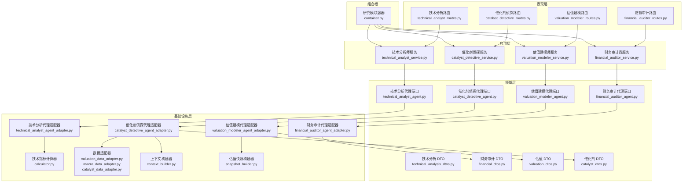

**图表来源**
- [src/modules/research/presentation/rest/technical_analyst_routes.py](file://src/modules/research/presentation/rest/technical_analyst_routes.py#L1-L79)
- [src/modules/research/presentation/rest/financial_auditor_routes.py](file://src/modules/research/presentation/rest/financial_auditor_routes.py#L1-L81)
- [src/modules/research/presentation/rest/valuation_modeler_routes.py](file://src/modules/research/presentation/rest/valuation_modeler_routes.py#L1-L82)
- [src/modules/research/presentation/rest/catalyst_detective_routes.py](file://src/modules/research/presentation/rest/catalyst_detective_routes.py#L1-L84)
- [src/modules/research/application/technical_analyst_service.py](file://src/modules/research/application/technical_analyst_service.py#L1-L83)
- [src/modules/research/application/financial_auditor_service.py](file://src/modules/research/application/financial_auditor_service.py#L1-L67)
- [src/modules/research/application/valuation_modeler_service.py](file://src/modules/research/application/valuation_modeler_service.py#L1-L94)
- [src/modules/research/application/catalyst_detective_service.py](file://src/modules/research/application/catalyst_detective_service.py#L1-L87)
- [src/modules/research/domain/ports/technical_analyst_agent.py](file://src/modules/research/domain/ports/technical_analyst_agent.py#L1-L25)
- [src/modules/research/domain/ports/financial_auditor_agent.py](file://src/modules/research/domain/ports/financial_auditor_agent.py#L1-L24)
- [src/modules/research/domain/ports/valuation_modeler_agent.py](file://src/modules/research/domain/ports/valuation_modeler_agent.py#L1-L30)
- [src/modules/research/domain/ports/catalyst_detective_agent.py](file://src/modules/research/domain/ports/catalyst_detective_agent.py#L1-L15)
- [src/modules/research/infrastructure/adapters/technical_analyst_agent_adapter.py](file://src/modules/research/infrastructure/adapters/technical_analyst_agent_adapter.py#L1-L56)
- [src/modules/research/infrastructure/adapters/financial_auditor_agent_adapter.py](file://src/modules/research/infrastructure/adapters/financial_auditor_agent_adapter.py#L1-L59)
- [src/modules/research/infrastructure/adapters/valuation_modeler_agent_adapter.py](file://src/modules/research/infrastructure/adapters/valuation_modeler_agent_adapter.py#L1-L64)
- [src/modules/research/infrastructure/adapters/catalyst_detective_agent_adapter.py](file://src/modules/research/infrastructure/adapters/catalyst_detective_agent_adapter.py#L1-L80)
- [src/modules/research/infrastructure/indicators/calculator.py](file://src/modules/research/infrastructure/indicators/calculator.py#L1-L307)
- [src/modules/research/infrastructure/adapters/valuation_data_adapter.py](file://src/modules/research/infrastructure/adapters/valuation_data_adapter.py#L1-L145)
- [src/modules/research/infrastructure/adapters/macro_data_adapter.py](file://src/modules/research/infrastructure/adapters/macro_data_adapter.py#L1-L224)
- [src/modules/research/infrastructure/valuation_snapshot/snapshot_builder.py](file://src/modules/research/infrastructure/valuation_snapshot/snapshot_builder.py#L1-L325)
- [src/modules/research/container.py](file://src/modules/research/container.py#L1-L167)

**章节来源**
- [src/modules/research/container.py](file://src/modules/research/container.py#L1-L167)
- [src/modules/research/application/technical_analyst_service.py](file://src/modules/research/application/technical_analyst_service.py#L1-L83)
- [src/modules/research/application/financial_auditor_service.py](file://src/modules/research/application/financial_auditor_service.py#L1-L67)
- [src/modules/research/application/valuation_modeler_service.py](file://src/modules/research/application/valuation_modeler_service.py#L1-L94)
- [src/modules/research/application/catalyst_detective_service.py](file://src/modules/research/application/catalyst_detective_service.py#L1-L87)

## 核心组件
- 研究模块容器（Composition Root）：统一装配跨模块依赖，按需提供四大应用服务。
- 应用服务（Application Services）：对外暴露独立入口，编排数据获取、指标计算与专家代理调用，组装最终响应。
- 领域端口（Domain Ports）：定义专家代理调用契约，隔离实现细节。
- 基础设施适配器（Infrastructure Adapters）：加载提示词模板、填充上下文、调用 LLM、解析 JSON，返回带原始输出与用户提示的完整结果。
- 技术指标计算器：基于日线序列计算多周期 MA、RSI、MACD、KDJ、ADX、布林带、ATR、量比、支撑/阻力等。
- **适配器空值防护**：在估值/宏观适配器中检查 daily=None 情况，避免 AttributeError 崩溃。
- **技术指标数据充分性**：将技术指标字段改为 Optional[float]，数据不足时标记为 N/A。
- **财务指标合理性校验**：在估值快照构建阶段对关键财务指标进行边界校验，拦截异常值。
- **统一异常处理**：五个专家服务使用一致的 BadRequestException，降低协调器兼容成本。
- **最低数据门槛**：技术分析要求至少 30 根 K 线，确保指标计算的可靠性。
- DTO 约束：严格定义专家输出结构，保证 API 响应一致性与可解析性。
- REST 路由：参数校验、异常映射与响应封装，统一注入应用服务。

**章节来源**
- [src/modules/research/container.py](file://src/modules/research/container.py#L53-L167)
- [src/modules/research/application/technical_analyst_service.py](file://src/modules/research/application/technical_analyst_service.py#L14-L83)
- [src/modules/research/application/financial_auditor_service.py](file://src/modules/research/application/financial_auditor_service.py#L17-L67)
- [src/modules/research/application/valuation_modeler_service.py](file://src/modules/research/application/valuation_modeler_service.py#L20-L94)
- [src/modules/research/application/catalyst_detective_service.py](file://src/modules/research/application/catalyst_detective_service.py#L29-L87)
- [src/modules/research/infrastructure/adapters/technical_analyst_agent_adapter.py](file://src/modules/research/infrastructure/adapters/technical_analyst_agent_adapter.py#L24-L56)
- [src/modules/research/infrastructure/adapters/financial_auditor_agent_adapter.py](file://src/modules/research/infrastructure/adapters/financial_auditor_agent_adapter.py#L30-L59)
- [src/modules/research/infrastructure/adapters/valuation_modeler_agent_adapter.py](file://src/modules/research/infrastructure/adapters/valuation_modeler_agent_adapter.py#L30-L64)
- [src/modules/research/infrastructure/adapters/catalyst_detective_agent_adapter.py](file://src/modules/research/infrastructure/adapters/catalyst_detective_agent_adapter.py#L19-L80)
- [src/modules/research/infrastructure/adapters/valuation_data_adapter.py](file://src/modules/research/infrastructure/adapters/valuation_data_adapter.py#L34-L61)
- [src/modules/research/infrastructure/adapters/macro_data_adapter.py](file://src/modules/research/infrastructure/adapters/macro_data_adapter.py#L75-L104)
- [src/modules/research/infrastructure/valuation_snapshot/snapshot_builder.py](file://src/modules/research/infrastructure/valuation_snapshot/snapshot_builder.py#L29-L58)
- [src/modules/research/infrastructure/indicators/calculator.py](file://src/modules/research/infrastructure/indicators/calculator.py#L209-L307)
- [src/modules/research/domain/dtos/technical_analysis_dtos.py](file://src/modules/research/domain/dtos/technical_analysis_dtos.py#L10-L42)
- [src/modules/research/domain/dtos/financial_dtos.py](file://src/modules/research/domain/dtos/financial_dtos.py#L11-L62)
- [src/modules/research/domain/dtos/valuation_dtos.py](file://src/modules/research/domain/dtos/valuation_dtos.py#L11-L64)
- [src/modules/research/domain/dtos/catalyst_dtos.py](file://src/modules/research/domain/dtos/catalyst_dtos.py#L1-L53)

## 架构总览
系统遵循整洁架构与端口适配器模式，通过容器统一装配依赖，应用服务只依赖领域端口，避免直连基础设施，确保可测试性与可替换性。

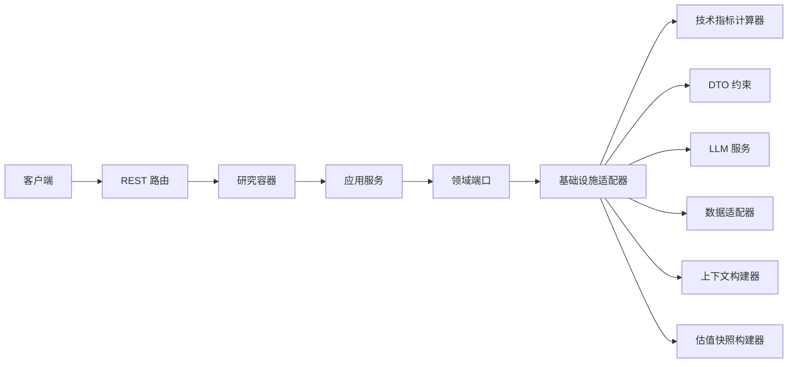

**图表来源**
- [src/modules/research/container.py](file://src/modules/research/container.py#L62-L167)
- [src/modules/research/application/technical_analyst_service.py](file://src/modules/research/application/technical_analyst_service.py#L20-L83)
- [src/modules/research/domain/ports/technical_analyst_agent.py](file://src/modules/research/domain/ports/technical_analyst_agent.py#L14-L25)
- [src/modules/research/infrastructure/adapters/technical_analyst_agent_adapter.py](file://src/modules/research/infrastructure/adapters/technical_analyst_agent_adapter.py#L24-L56)
- [src/modules/research/infrastructure/indicators/calculator.py](file://src/modules/research/infrastructure/indicators/calculator.py#L209-L307)
- [src/modules/research/domain/dtos/technical_analysis_dtos.py](file://src/modules/research/domain/dtos/technical_analysis_dtos.py#L10-L42)

## 详细组件分析

### 技术分析师服务
职责：获取日线数据，计算技术指标，调用技术分析代理，组装包含解析结果与输入/输出的完整响应。

**更新** 新增最低 K 线数量校验（30 根），确保技术分析的可靠性。

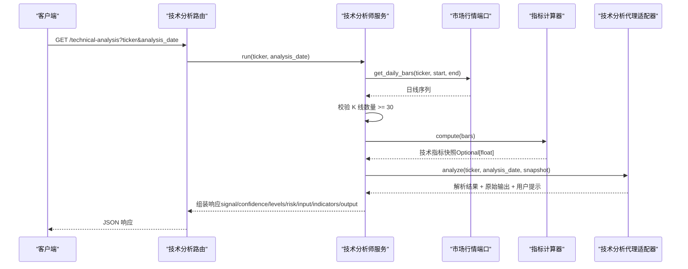

**图表来源**
- [src/modules/research/application/technical_analyst_service.py](file://src/modules/research/application/technical_analyst_service.py#L58-L64)
- [src/modules/research/infrastructure/adapters/technical_analyst_agent_adapter.py](file://src/modules/research/infrastructure/adapters/technical_analyst_agent_adapter.py#L31-L56)
- [src/modules/research/infrastructure/indicators/calculator.py](file://src/modules/research/infrastructure/indicators/calculator.py#L209-L307)
- [src/modules/research/presentation/rest/technical_analyst_routes.py](file://src/modules/research/presentation/rest/technical_analyst_routes.py#L50-L79)

**章节来源**
- [src/modules/research/application/technical_analyst_service.py](file://src/modules/research/application/technical_analyst_service.py#L14-L83)
- [src/modules/research/infrastructure/adapters/technical_analyst_agent_adapter.py](file://src/modules/research/infrastructure/adapters/technical_analyst_agent_adapter.py#L24-L56)
- [src/modules/research/infrastructure/indicators/calculator.py](file://src/modules/research/infrastructure/indicators/calculator.py#L209-L307)
- [src/modules/research/domain/dtos/technical_analysis_dtos.py](file://src/modules/research/domain/dtos/technical_analysis_dtos.py#L10-L42)
- [src/modules/research/presentation/rest/technical_analyst_routes.py](file://src/modules/research/presentation/rest/technical_analyst_routes.py#L32-L79)

### 财务审计员服务
职责：获取财务记录，构建财务快照，调用财务审计代理，输出整体财务评分、维度分析与风险提示。

**更新** 新增 limit 参数范围校验（1-20），确保财务数据查询的合理性。

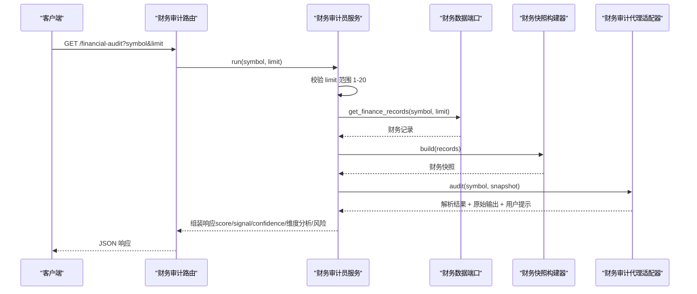

**图表来源**
- [src/modules/research/application/financial_auditor_service.py](file://src/modules/research/application/financial_auditor_service.py#L33-L67)
- [src/modules/research/infrastructure/adapters/financial_auditor_agent_adapter.py](file://src/modules/research/infrastructure/adapters/financial_auditor_agent_adapter.py#L37-L59)
- [src/modules/research/domain/dtos/financial_dtos.py](file://src/modules/research/domain/dtos/financial_dtos.py#L25-L62)
- [src/modules/research/presentation/rest/financial_auditor_routes.py](file://src/modules/research/presentation/rest/financial_auditor_routes.py#L56-L81)

**章节来源**
- [src/modules/research/application/financial_auditor_service.py](file://src/modules/research/application/financial_auditor_service.py#L17-L67)
- [src/modules/research/infrastructure/adapters/financial_auditor_agent_adapter.py](file://src/modules/research/infrastructure/adapters/financial_auditor_agent_adapter.py#L30-L59)
- [src/modules/research/domain/dtos/financial_dtos.py](file://src/modules/research/domain/dtos/financial_dtos.py#L11-L62)
- [src/modules/research/presentation/rest/financial_auditor_routes.py](file://src/modules/research/presentation/rest/financial_auditor_routes.py#L33-L81)

### 估值建模师服务
职责：获取股票概览、历史估值与财务数据，构建估值快照，调用估值代理，输出内在价值区间与风险因素。

**更新** 新增历史估值为空时的 WARNING 日志记录，确保异常情况被正确追踪。

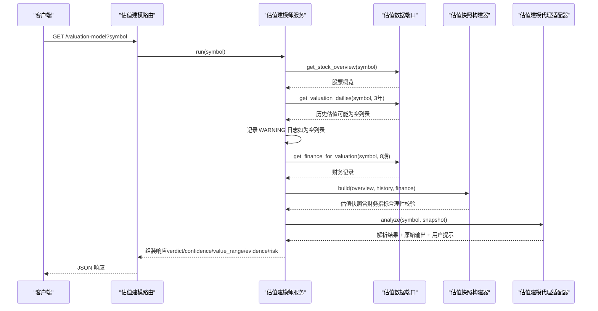

**图表来源**
- [src/modules/research/application/valuation_modeler_service.py](file://src/modules/research/application/valuation_modeler_service.py#L37-L94)
- [src/modules/research/infrastructure/adapters/valuation_modeler_agent_adapter.py](file://src/modules/research/infrastructure/adapters/valuation_modeler_agent_adapter.py#L37-L64)
- [src/modules/research/domain/dtos/valuation_dtos.py](file://src/modules/research/domain/dtos/valuation_dtos.py#L26-L64)
- [src/modules/research/presentation/rest/valuation_modeler_routes.py](file://src/modules/research/presentation/rest/valuation_modeler_routes.py#L58-L82)

**章节来源**
- [src/modules/research/application/valuation_modeler_service.py](file://src/modules/research/application/valuation_modeler_service.py#L20-L94)
- [src/modules/research/infrastructure/adapters/valuation_modeler_agent_adapter.py](file://src/modules/research/infrastructure/adapters/valuation_modeler_agent_adapter.py#L30-L64)
- [src/modules/research/domain/dtos/valuation_dtos.py](file://src/modules/research/domain/dtos/valuation_dtos.py#L11-L64)
- [src/modules/research/presentation/rest/valuation_modeler_routes.py](file://src/modules/research/presentation/rest/valuation_modeler_routes.py#L33-L82)

### 催化剂侦探服务
职责：获取股票概览与多维度网络搜索结果，构建结构化上下文，调用 LLM 分析催化剂事件，输出综合评估与置信度。

**更新** 统一异常处理为 BadRequestException，返回值规范化为 dict[str, Any]，提升与其他专家服务的一致性。

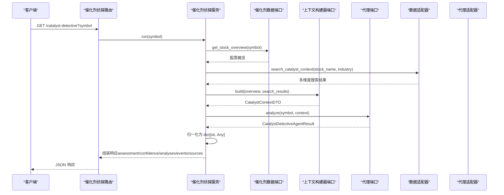

**图表来源**
- [src/modules/research/application/catalyst_detective_service.py](file://src/modules/research/application/catalyst_detective_service.py#L40-L87)
- [src/modules/research/infrastructure/adapters/catalyst_detective_agent_adapter.py](file://src/modules/research/infrastructure/adapters/catalyst_detective_agent_adapter.py#L37-L80)
- [src/modules/research/infrastructure/adapters/catalyst_data_adapter.py](file://src/modules/research/infrastructure/adapters/catalyst_data_adapter.py#L58-L122)
- [src/modules/research/infrastructure/catalyst_context/context_builder.py](file://src/modules/research/infrastructure/catalyst_context/context_builder.py#L16-L73)
- [src/modules/research/presentation/rest/catalyst_detective_routes.py](file://src/modules/research/presentation/rest/catalyst_detective_routes.py#L57-L84)

**章节来源**
- [src/modules/research/application/catalyst_detective_service.py](file://src/modules/research/application/catalyst_detective_service.py#L29-L87)
- [src/modules/research/infrastructure/adapters/catalyst_detective_agent_adapter.py](file://src/modules/research/infrastructure/adapters/catalyst_detective_agent_adapter.py#L19-L80)
- [src/modules/research/infrastructure/adapters/catalyst_data_adapter.py](file://src/modules/research/infrastructure/adapters/catalyst_data_adapter.py#L25-L133)
- [src/modules/research/infrastructure/catalyst_context/context_builder.py](file://src/modules/research/infrastructure/catalyst_context/context_builder.py#L15-L86)
- [src/modules/research/domain/dtos/catalyst_dtos.py](file://src/modules/research/domain/dtos/catalyst_dtos.py#L29-L53)
- [src/modules/research/domain/dtos/catalyst_inputs.py](file://src/modules/research/domain/dtos/catalyst_inputs.py#L5-L36)
- [src/modules/research/domain/dtos/catalyst_context.py](file://src/modules/research/domain/dtos/catalyst_context.py#L4-L19)
- [src/modules/research/presentation/rest/catalyst_detective_routes.py](file://src/modules/research/presentation/rest/catalyst_detective_routes.py#L26-L84)

### 技术分析算法实现（指标计算）
技术指标计算模块提供多周期移动平均、RSI、MACD、KDJ、ADX、布林带、ATR、量比、支撑/阻力等，作为提示词输入与 LLM 判断依据。

**更新** 技术指标字段改为 Optional[float]，数据不足时返回 None，在提示词填充时转换为 "N/A"。

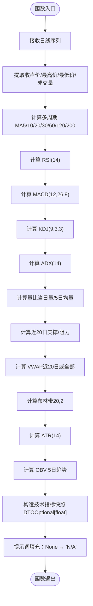

**图表来源**
- [src/modules/research/infrastructure/indicators/calculator.py](file://src/modules/research/infrastructure/indicators/calculator.py#L209-L307)
- [src/modules/research/domain/dtos/indicators_snapshot.py](file://src/modules/research/domain/dtos/indicators_snapshot.py#L1-L200)

**章节来源**
- [src/modules/research/infrastructure/indicators/calculator.py](file://src/modules/research/infrastructure/indicators/calculator.py#L10-L307)
- [src/modules/research/domain/dtos/technical_analysis_dtos.py](file://src/modules/research/domain/dtos/technical_analysis_dtos.py#L10-L42)

### 财务审计数据验证流程
财务审计采用五维审计框架，结合静态快照与历史趋势，进行防御性与进攻性双向评估，输出整体评分与维度分析。

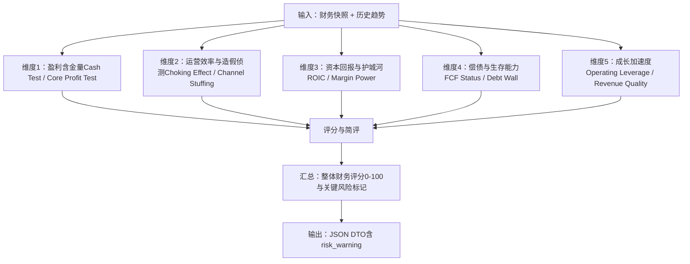

**章节来源**
- [src/modules/research/domain/dtos/financial_dtos.py](file://src/modules/research/domain/dtos/financial_dtos.py#L11-L62)
- [src/modules/research/infrastructure/agents/financial_auditor/prompts/system.md](file://src/modules/research/infrastructure/agents/financial_auditor/prompts/system.md#L1-L80)
- [src/modules/research/infrastructure/agents/financial_auditor/prompts/user.md](file://src/modules/research/infrastructure/agents/financial_auditor/prompts/user.md#L1-L49)

### 估值建模定价模型
估值建模师整合股票概览、历史估值与财务数据，构建估值快照，调用代理进行内在价值区间推导与风险因素识别。

**更新** 新增财务指标合理性校验，拦截异常财务指标值（如毛利率 44969179.57%）。

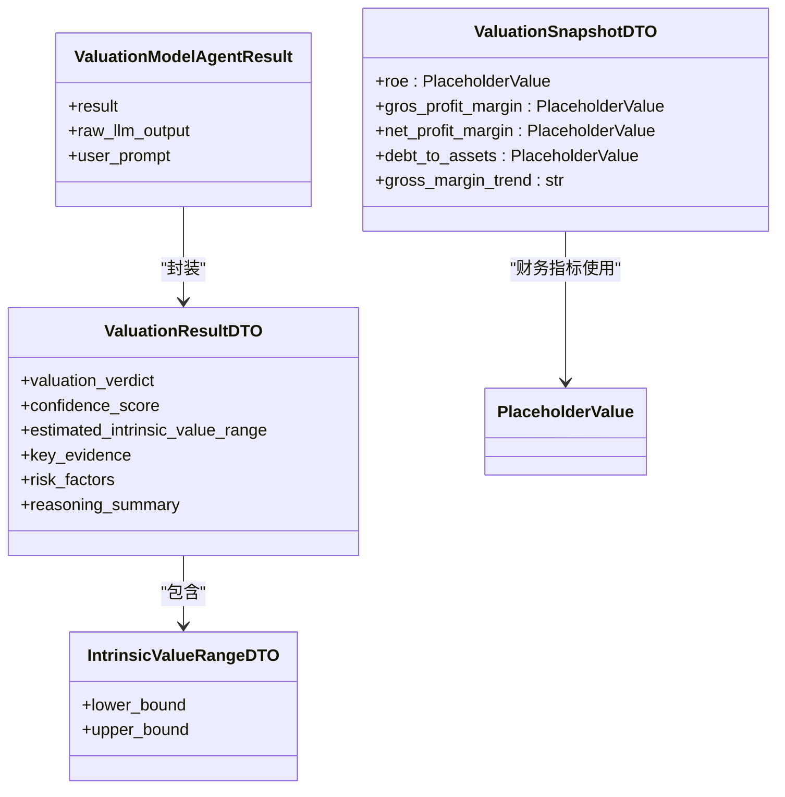

**图表来源**
- [src/modules/research/domain/dtos/valuation_dtos.py](file://src/modules/research/domain/dtos/valuation_dtos.py#L16-L64)
- [src/modules/research/infrastructure/valuation_snapshot/snapshot_builder.py](file://src/modules/research/infrastructure/valuation_snapshot/snapshot_builder.py#L256-L276)

**章节来源**
- [src/modules/research/domain/dtos/valuation_dtos.py](file://src/modules/research/domain/dtos/valuation_dtos.py#L11-L64)
- [src/modules/research/application/valuation_modeler_service.py](file://src/modules/research/application/valuation_modeler_service.py#L69-L94)

### 催化剂侦探分析框架
催化剂侦探系统采用四维分析框架，基于多维度网络搜索情报进行系统性扫描与评估。

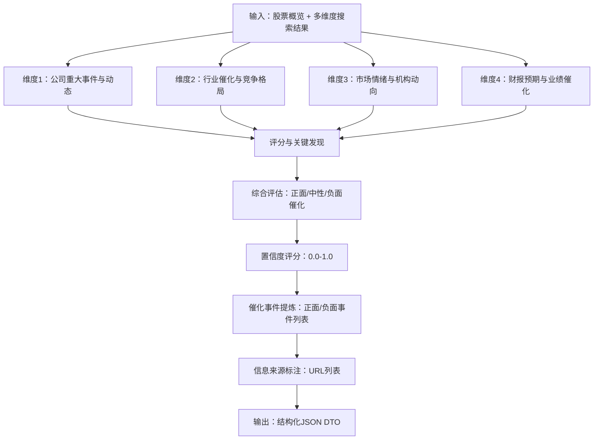

**章节来源**
- [src/modules/research/domain/dtos/catalyst_dtos.py](file://src/modules/research/domain/dtos/catalyst_dtos.py#L7-L53)
- [src/modules/research/infrastructure/agents/catalyst_detective/prompts/system.md](file://src/modules/research/infrastructure/agents/catalyst_detective/prompts/system.md#L1-L98)
- [src/modules/research/infrastructure/agents/catalyst_detective/prompts/user.md](file://src/modules/research/infrastructure/agents/catalyst_detective/prompts/user.md#L1-L49)

### LLM 代理设计模式
- 提示词工程：分别加载 system prompt 与 user prompt 模板，填充上下文（技术指标、财务快照、估值快照、催化剂上下文）。
- 输出解析：调用 LLM 后解析 JSON，封装为 AgentResult DTO，保留原始输出与用户提示，便于调试与复现。
- 结果验证：应用层组装响应时，将 input、technical_indicators/financial_indicators/valuation_indicators/catalyst_indicators、output 等字段回填，确保前后端一致。

**更新** 技术指标提示词填充时，将 None 值转换为 "N/A" 字符串，确保 LLM 接收到明确的无数据标记。

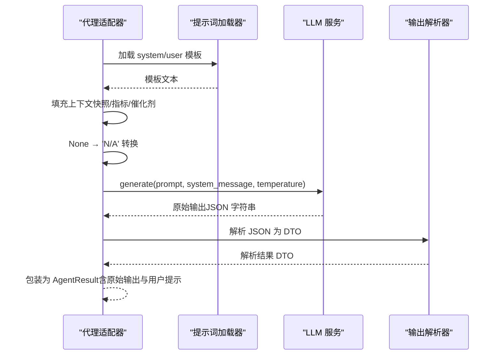

**图表来源**
- [src/modules/research/infrastructure/adapters/technical_analyst_agent_adapter.py](file://src/modules/research/infrastructure/adapters/technical_analyst_agent_adapter.py#L31-L56)
- [src/modules/research/infrastructure/adapters/financial_auditor_agent_adapter.py](file://src/modules/research/infrastructure/adapters/financial_auditor_agent_adapter.py#L37-L59)
- [src/modules/research/infrastructure/adapters/valuation_modeler_agent_adapter.py](file://src/modules/research/infrastructure/adapters/valuation_modeler_agent_adapter.py#L37-L64)
- [src/modules/research/infrastructure/adapters/catalyst_detective_agent_adapter.py](file://src/modules/research/infrastructure/adapters/catalyst_detective_agent_adapter.py#L44-L80)

**章节来源**
- [src/modules/research/infrastructure/adapters/technical_analyst_agent_adapter.py](file://src/modules/research/infrastructure/adapters/technical_analyst_agent_adapter.py#L24-L56)
- [src/modules/research/infrastructure/adapters/financial_auditor_agent_adapter.py](file://src/modules/research/infrastructure/adapters/financial_auditor_agent_adapter.py#L30-L59)
- [src/modules/research/infrastructure/adapters/valuation_modeler_agent_adapter.py](file://src/modules/research/infrastructure/adapters/valuation_modeler_agentAdapter.py#L30-L64)
- [src/modules/research/infrastructure/adapters/catalyst_detective_agent_adapter.py](file://src/modules/research/infrastructure/adapters/catalyst_detective_agent_adapter.py#L19-L80)

### 使用示例与参数配置
- 技术分析师
  - 路径：GET /technical-analysis
  - 参数：ticker（股票代码）、analysis_date（YYYY-MM-DD，可选，默认当天）
  - **新增**：最低 K 线数量要求 30 根，不足时抛出 BadRequestException
  - 响应：包含 signal、confidence、summary_reasoning、key_technical_levels、risk_warning，以及 input、technical_indicators、output
- 财务审计员
  - 路径：GET /financial-audit
  - 参数：symbol（股票代码）、limit（最近期数，默认5，范围1-20）
  - **新增**：limit 参数范围校验（1-20），超出范围抛出 BadRequestException
  - 响应：包含 financial_score、signal、confidence、summary_reasoning、dimension_analyses、key_risks、risk_warning，以及 input、financial_indicators、output
- 估值建模师
  - 路径：GET /valuation-model
  - 参数：symbol（股票代码）
  - **新增**：历史估值为空时记录 WARNING 日志，然后继续执行
  - 响应：包含 valuation_verdict、confidence_score、estimated_intrinsic_value_range、key_evidence、risk_factors、reasoning_summary，以及 input、valuation_indicators、output
- **催化剂侦探**
  - **路径**：GET /catalyst-detective
  - **参数**：symbol（股票代码）
  - **新增**：统一异常处理为 BadRequestException，返回值规范化为 dict[str, Any]
  - **响应**：包含 catalyst_assessment（正面/中性/负面催化）、confidence_score（置信度0.0-1.0）、catalyst_summary（综合评估摘要）、dimension_analyses（四个维度分析结果）、positive_catalysts（正面催化事件列表）、negative_catalysts（负面催化事件列表）、information_sources（信息来源URL列表），以及 input（用户提示）、output（原始LLM输出）、catalyst_indicators（使用的上下文）

**章节来源**
- [src/modules/research/presentation/rest/technical_analyst_routes.py](file://src/modules/research/presentation/rest/technical_analyst_routes.py#L50-L79)
- [src/modules/research/presentation/rest/financial_auditor_routes.py](file://src/modules/research/presentation/rest/financial_auditor_routes.py#L56-L81)
- [src/modules/research/presentation/rest/valuation_modeler_routes.py](file://src/modules/research/presentation/rest/valuation_modeler_routes.py#L58-L82)
- [src/modules/research/presentation/rest/catalyst_detective_routes.py](file://src/modules/research/presentation/rest/catalyst_detective_routes.py#L56-L84)

## 输入健壮性增强

### 适配器空值防护
**目标**：解决 `daily=None` 导致的 AttributeError 崩溃风险，确保在标的不存在或无日线数据时优雅降级。

**实现方案**：
- 在 `valuation_data_adapter.py` 的 `_to_stock_overview()` 中检查 `daily is None`，返回 `None` 并记录 WARNING 日志
- 在 `macro_data_adapter.py` 的 `get_stock_overview()` 中增加 `daily is None` 检查，返回 `None` 并记录 WARNING 日志
- 在 `catalyst_data_adapter.py` 中收窄异常捕获范围，让编程错误向上传播

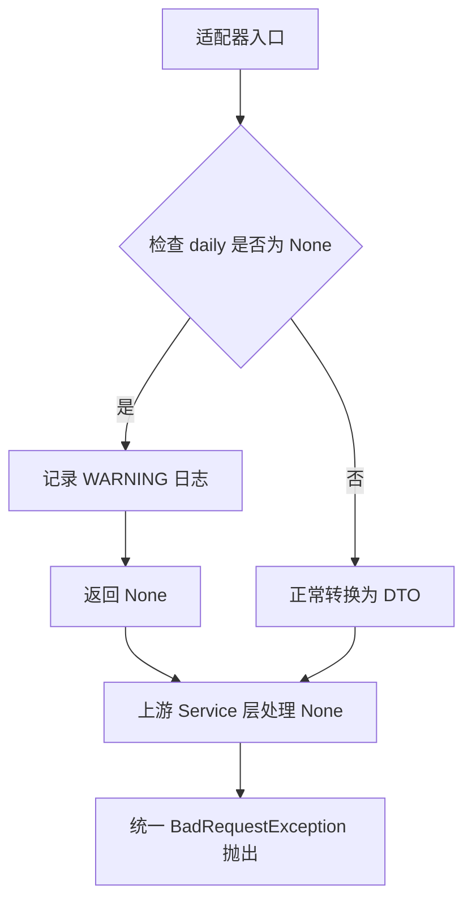

**图表来源**
- [src/modules/research/infrastructure/adapters/valuation_data_adapter.py](file://src/modules/research/infrastructure/adapters/valuation_data_adapter.py#L42-L49)
- [src/modules/research/infrastructure/adapters/macro_data_adapter.py](file://src/modules/research/infrastructure/adapters/macro_data_adapter.py#L82-L86)

**章节来源**
- [src/modules/research/infrastructure/adapters/valuation_data_adapter.py](file://src/modules/research/infrastructure/adapters/valuation_data_adapter.py#L34-L61)
- [src/modules/research/infrastructure/adapters/macro_data_adapter.py](file://src/modules/research/infrastructure/adapters/macro_data_adapter.py#L59-L104)
- [src/modules/research/infrastructure/adapters/catalyst_data_adapter.py](file://src/modules/research/infrastructure/adapters/catalyst_data_adapter.py#L1-L145)

### 技术指标数据充分性
**目标**：让 LLM 收到的技术指标输入在数据不足时具有明确的"无数据"标记，避免误导性默认值。

**实现方案**：
- 将 `TechnicalIndicatorsSnapshot` 中的数值型指标字段从 `float` 改为 `Optional[float]`（默认 `None`）
- `calculator.py` 中各指标函数在数据不足时返回 `None` 而非 0.0/50.0
- `prompt_loader.py` 的 `fill_user_prompt()` 在填充模板时将 `None` 转为字符串 `"N/A"`

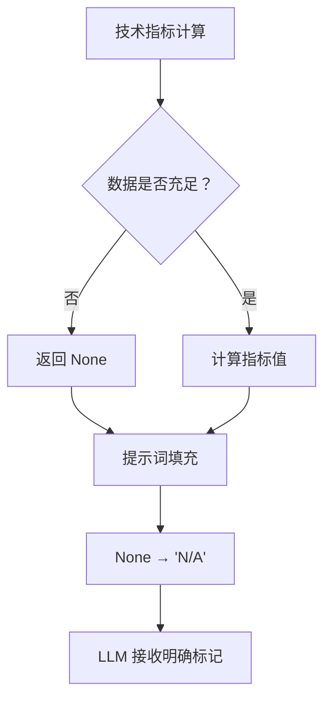

**图表来源**
- [src/modules/research/infrastructure/indicators/calculator.py](file://src/modules/research/infrastructure/indicators/calculator.py#L209-L307)
- [src/modules/research/domain/dtos/technical_analysis_dtos.py](file://src/modules/research/domain/dtos/technical_analysis_dtos.py#L10-L42)

**章节来源**
- [src/modules/research/infrastructure/indicators/calculator.py](file://src/modules/research/infrastructure/indicators/calculator.py#L10-L307)
- [src/modules/research/domain/dtos/technical_analysis_dtos.py](file://src/modules/research/domain/dtos/technical_analysis_dtos.py#L10-L42)

### 财务指标合理性校验
**目标**：在估值快照构建阶段拦截明显异常的财务指标值，防止 LLM 在脏数据上做分析。

**实现方案**：
- 在 `ValuationSnapshotBuilderImpl.build()` 中对关键财务指标进行合理性边界校验
- 超出合理范围的值替换为 `"N/A"`（与 `PlaceholderValue` 类型兼容）
- 记录 WARNING 级别日志（包含字段名、原始值、标的信息）
- 对毛利率趋势计算增加基础值合理性检查

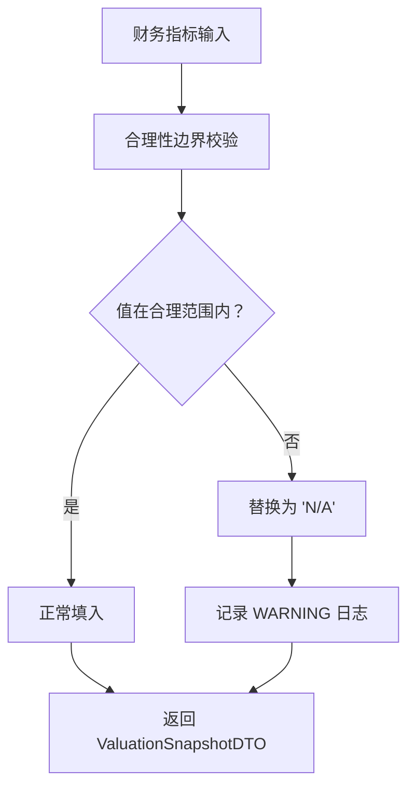

**图表来源**
- [src/modules/research/infrastructure/valuation_snapshot/snapshot_builder.py](file://src/modules/research/infrastructure/valuation_snapshot/snapshot_builder.py#L36-L58)
- [src/modules/research/infrastructure/valuation_snapshot/snapshot_builder.py](file://src/modules/research/infrastructure/valuation_snapshot/snapshot_builder.py#L256-L276)

**章节来源**
- [src/modules/research/infrastructure/valuation_snapshot/snapshot_builder.py](file://src/modules/research/infrastructure/valuation_snapshot/snapshot_builder.py#L29-L58)
- [src/modules/research/infrastructure/valuation_snapshot/snapshot_builder.py](file://src/modules/research/infrastructure/valuation_snapshot/snapshot_builder.py#L256-L276)

### 统一异常处理与返回值契约
**目标**：统一五个专家的异常类型和返回值契约，降低协调器侧的兼容成本。

**实现方案**：
- `CatalystDetectiveService` 中的 `StockNotFoundError` → `BadRequestException`
- `CatalystDetectiveService` 中的 `CatalystSearchError` → `BadRequestException`
- `CatalystDetectiveService` 返回类型从 `CatalystDetectiveAgentResult` 改为 `dict[str, Any]`
- 删除 `ResearchGatewayAdapter._normalize_catalyst_result()` 方法

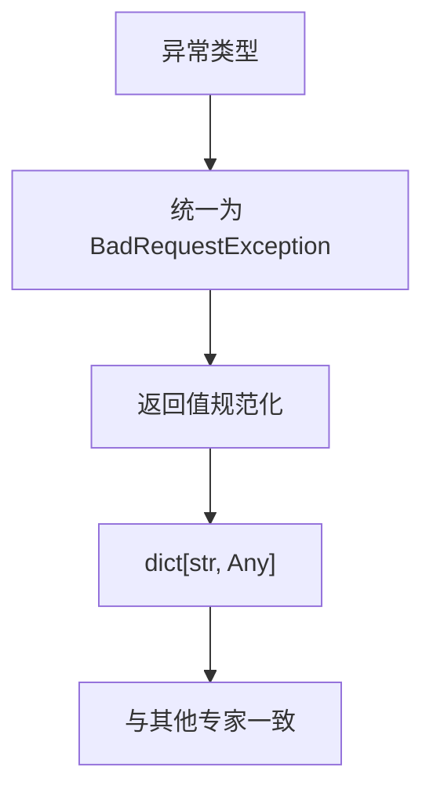

**图表来源**
- [src/modules/research/application/catalyst_detective_service.py](file://src/modules/research/application/catalyst_detective_service.py#L19-L21)
- [src/modules/research/infrastructure/adapters/catalyst_detective_agent_adapter.py](file://src/modules/research/infrastructure/adapters/catalyst_detective_agent_adapter.py#L19-L80)

**章节来源**
- [src/modules/research/application/catalyst_detective_service.py](file://src/modules/research/application/catalyst_detective_service.py#L19-L21)
- [src/modules/research/infrastructure/adapters/catalyst_detective_agent_adapter.py](file://src/modules/research/infrastructure/adapters/catalyst_detective_agent_adapter.py#L19-L80)

## 依赖关系分析
研究容器统一装配跨模块依赖，应用服务通过端口与适配器解耦，基础设施适配器依赖 LLM 服务与提示词加载器。

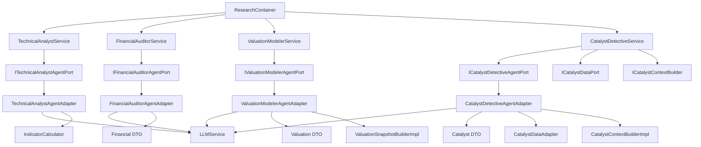

**图表来源**
- [src/modules/research/container.py](file://src/modules/research/container.py#L72-L167)
- [src/modules/research/application/technical_analyst_service.py](file://src/modules/research/application/technical_analyst_service.py#L20-L28)
- [src/modules/research/application/financial_auditor_service.py](file://src/modules/research/application/financial_auditor_service.py#L23-L31)
- [src/modules/research/application/valuation_modeler_service.py](file://src/modules/research/application/valuation_modeler_service.py#L27-L35)
- [src/modules/research/application/catalyst_detective_service.py](file://src/modules/research/application/catalyst_detective_service.py#L30-L38)
- [src/modules/research/infrastructure/adapters/technical_analyst_agent_adapter.py](file://src/modules/research/infrastructure/adapters/technical_analyst_agent_adapter.py#L24-L56)
- [src/modules/research/infrastructure/adapters/financial_auditor_agent_adapter.py](file://src/modules/research/infrastructure/adapters/financial_auditor_agent_adapter.py#L30-L59)
- [src/modules/research/infrastructure/adapters/valuation_modeler_agent_adapter.py](file://src/modules/research/infrastructure/adapters/valuation_modeler_agentAdapter.py#L30-L64)
- [src/modules/research/infrastructure/adapters/catalyst_detective_agent_adapter.py](file://src/modules/research/infrastructure/adapters/catalyst_detective_agentAdapter.py#L19-L80)

**章节来源**
- [src/modules/research/container.py](file://src/modules/research/container.py#L53-L167)

## 性能考量
- 指标计算复杂度：技术指标计算以 O(n) 遍历日线序列为主，多数函数为线性复杂度；布林带与 ATR 使用滑动窗口，整体可接受。
- I/O 优化：应用服务在获取日线/财务/估值/催化剂数据时进行非空校验，避免无效调用；建议缓存常用快照与提示词模板。
- 温度参数：代理适配器统一使用较低温度（如 0.3）以提升 JSON 可解析性与稳定性。
- 批处理与并发：REST 层按请求独立执行，建议在网关层引入限流与熔断策略，避免 LLM 调用成为瓶颈。
- 数据准备：技术分析要求至少一年日线数据，建议在数据工程层提前同步并校验完整性。
- **网络搜索性能**：催化剂侦探涉及多维度网络搜索，建议设置合理的超时时间和重试机制，避免单个维度失败影响整体分析。
- **输入健壮性开销**：新增的边界校验和空值检查会增加少量 CPU 开销，但显著提升了系统的稳定性和可靠性。

## 故障排查指南
- 输入参数错误：BadRequestException 将被转换为 400 错误码，检查 ticker/symbol/analysis_date/limit 是否合法。
- **最低 K 线数量不足**：技术分析师服务在 K 线数量少于 30 根时抛出 BadRequestException，检查数据同步状态。
- **财务指标异常**：估值快照构建器记录 WARNING 日志并返回 "N/A"，检查上游财务数据质量。
- **适配器空值问题**：若 daily 为 None，适配器会记录 WARNING 并返回 None，检查标的是否存在或是否有日线数据。
- LLM 解析失败：当输出解析器无法解析 JSON 时，抛出 LLMOutputParseError，返回 422；检查提示词模板与 LLM 输出格式。
- 数据缺失：若日线/财务/估值/催化剂数据为空，服务将抛出 BadRequestException；请先通过数据工程模块同步相关数据。
- **异常类型统一**：催化剂侦探服务现在使用 BadRequestException，与其他专家保持一致。
- 异常映射：REST 路由捕获异常并记录日志，便于定位问题。

**章节来源**
- [src/modules/research/presentation/rest/technical_analyst_routes.py](file://src/modules/research/presentation/rest/technical_analyst_routes.py#L71-L79)
- [src/modules/research/presentation/rest/financial_auditor_routes.py](file://src/modules/research/presentation/rest/financial_auditor_routes.py#L70-L81)
- [src/modules/research/presentation/rest/valuation_modeler_routes.py](file://src/modules/research/presentation/rest/valuation_modeler_routes.py#L71-L82)
- [src/modules/research/presentation/rest/catalyst_detective_routes.py](file://src/modules/research/presentation/rest/catalyst_detective_routes.py#L70-L84)

## 结论
研究分析模块通过清晰的分层与端口适配器设计，实现了技术分析、财务审计、估值建模与催化剂侦探的标准化与可扩展化。**更新后的输入健壮性增强**进一步提升了系统的稳定性，包括：

- **适配器空值防护**：解决 daily=None 导致的崩溃风险
- **技术指标数据充分性**：明确标记无数据状态，避免误导性默认值
- **财务指标合理性校验**：拦截异常财务指标值，防止脏数据污染分析结果
- **统一异常处理**：五个专家服务使用一致的 BadRequestException
- **最低数据门槛**：技术分析要求至少 30 根 K 线

这些改进确保了系统在各种边界场景下的稳定运行，同时保持了原有的功能完整性。建议在生产环境中加强缓存、限流与监控，并持续优化提示词模板与解析器鲁棒性。

## 附录
- 提示词文件路径参考
  - 技术分析用户提示词：src/modules/research/infrastructure/agents/technical_analyst/prompts/user.md
  - 财务审计系统提示词：src/modules/research/infrastructure/agents/financial_auditor/prompts/system.md
  - 财务审计用户提示词：src/modules/research/infrastructure/agents/financial_auditor/prompts/user.md
  - **催化剂侦探系统提示词**：src/modules/research/infrastructure/agents/catalyst_detective/prompts/system.md
  - **催化剂侦探用户提示词**：src/modules/research/infrastructure/agents/catalyst_detective/prompts/user.md
- DTO 定义参考
  - 技术分析 DTO：src/modules/research/domain/dtos/technical_analysis_dtos.py
  - 财务审计 DTO：src/modules/research/domain/dtos/financial_dtos.py
  - 估值 DTO：src/modules/research/domain/dtos/valuation_dtos.py
  - **催化剂 DTO**：src/modules/research/domain/dtos/catalyst_dtos.py
  - **催化剂输入 DTO**：src/modules/research/domain/dtos/catalyst_inputs.py
  - **催化剂上下文 DTO**：src/modules/research/domain/dtos/catalyst_context.py
- **端口定义参考**
  - **催化剂数据端口**：src/modules/research/domain/ports/catalyst_data.py
  - **催化剂上下文构建端口**：src/modules/research/domain/ports/catalyst_context_builder.py
  - **催化剂代理端口**：src/modules/research/domain/ports/catalyst_detective_agent.py
- **适配器实现参考**
  - **催化剂数据适配器**：src/modules/research/infrastructure/adapters/catalyst_data_adapter.py
  - **催化剂上下文构建器**：src/modules/research/infrastructure/catalyst_context/context_builder.py
  - **催化剂代理适配器**：src/modules/research/infrastructure/adapters/catalyst_detective_agent_adapter.py
  - **输出解析器**：src/modules/research/infrastructure/agents/catalyst_detective/output_parser.py
  - **估值数据适配器**：src/modules/research/infrastructure/adapters/valuation_data_adapter.py
  - **宏观数据适配器**：src/modules/research/infrastructure/adapters/macro_data_adapter.py
- **输入健壮性增强实现参考**
  - **适配器空值防护**：src/modules/research/infrastructure/adapters/valuation_data_adapter.py#L42-L49, src/modules/research/infrastructure/adapters/macro_data_adapter.py#L82-L86
  - **技术指标数据充分性**：src/modules/research/infrastructure/indicators/calculator.py#L209-L307, src/modules/research/domain/dtos/technical_analysis_dtos.py#L10-L42
  - **财务指标合理性校验**：src/modules/research/infrastructure/valuation_snapshot/snapshot_builder.py#L29-L58, src/modules/research/infrastructure/valuation_snapshot/snapshot_builder.py#L256-L276
  - **统一异常处理**：src/modules/research/application/catalyst_detective_service.py#L19-L21, src/modules/research/infrastructure/adapters/catalyst_detective_agent_adapter.py#L19-L80