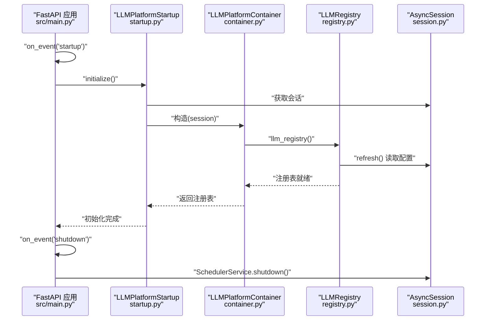
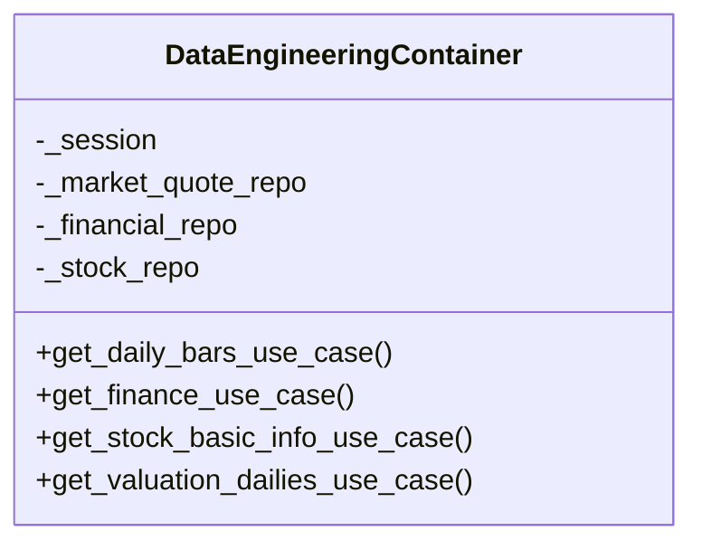
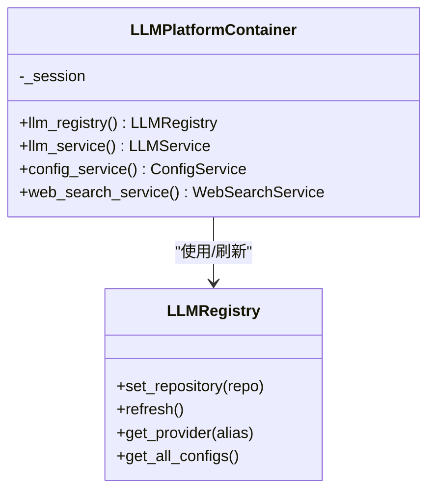
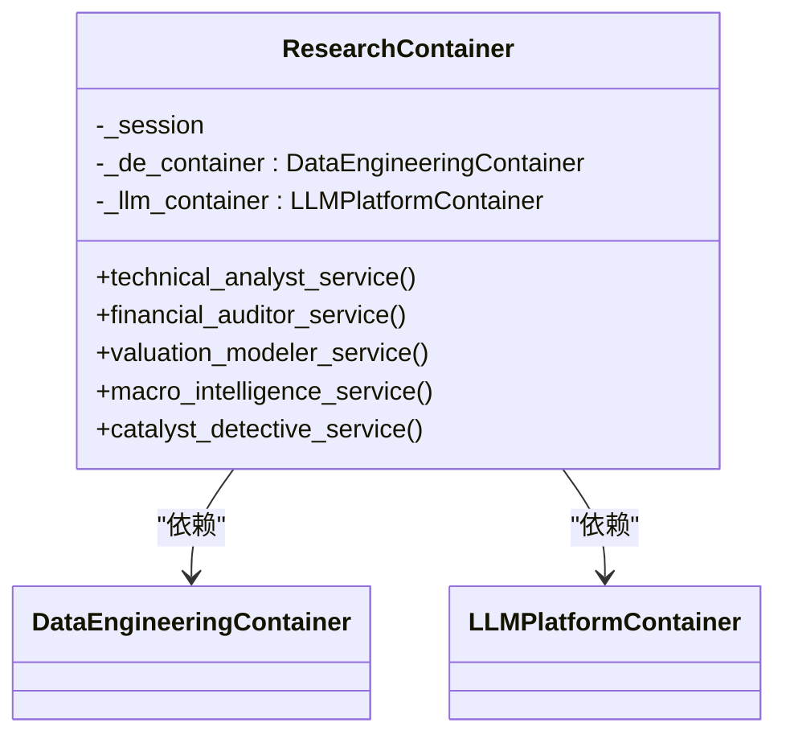
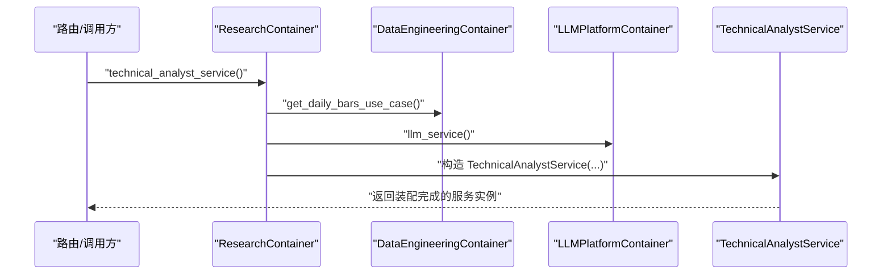
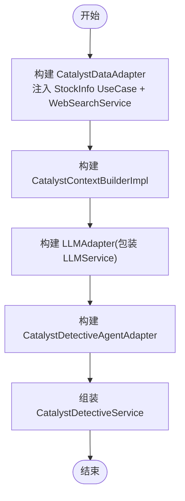
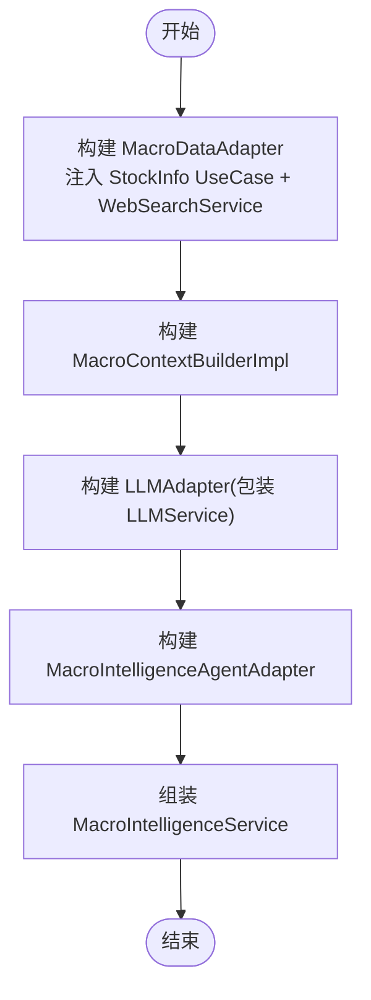
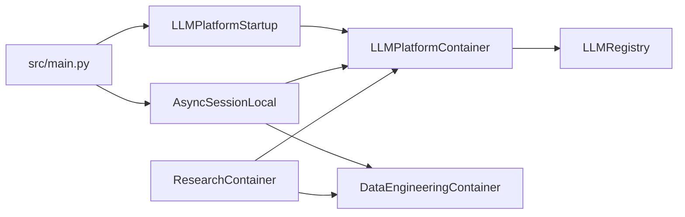

# 研究容器管理

<cite>
**本文引用的文件**
- [src/main.py](file://src/main.py)
- [src/shared/config.py](file://src/shared/config.py)
- [src/shared/infrastructure/db/session.py](file://src/shared/infrastructure/db/session.py)
- [src/shared/infrastructure/scheduler.py](file://src/shared/infrastructure/scheduler.py)
- [src/modules/data_engineering/container.py](file://src/modules/data_engineering/container.py)
- [src/modules/data_engineering/infrastructure/config.py](file://src/modules/data_engineering/infrastructure/config.py)
- [src/modules/llm_platform/container.py](file://src/modules/llm_platform/container.py)
- [src/modules/llm_platform/infrastructure/config.py](file://src/modules/llm_platform/infrastructure/config.py)
- [src/modules/llm_platform/infrastructure/registry.py](file://src/modules/llm_platform/infrastructure/registry.py)
- [src/modules/llm_platform/application/services/startup.py](file://src/modules/llm_platform/application/services/startup.py)
- [src/modules/research/container.py](file://src/modules/research/container.py)
- [src/modules/research/application/technical_analyst_service.py](file://src/modules/research/application/technical_analyst_service.py)
- [src/modules/research/application/financial_auditor_service.py](file://src/modules/research/application/financial_auditor_service.py)
- [src/modules/research/application/valuation_modeler_service.py](file://src/modules/research/application/valuation_modeler_service.py)
- [src/modules/research/application/catalyst_detective_service.py](file://src/modules/research/application/catalyst_detective_service.py)
- [src/modules/research/infrastructure/adapters/catalyst_data_adapter.py](file://src/modules/research/infrastructure/adapters/catalyst_data_adapter.py)
- [src/modules/research/infrastructure/catalyst_context/context_builder.py](file://src/modules/research/infrastructure/catalyst_context/context_builder.py)
- [src/modules/research/presentation/rest/catalyst_detective_routes.py](file://src/modules/research/presentation/rest/catalyst_detective_routes.py)
</cite>

## 目录
1. [引言](#引言)
2. [项目结构](#项目结构)
3. [核心组件](#核心组件)
4. [架构总览](#架构总览)
5. [详细组件分析](#详细组件分析)
6. [依赖分析](#依赖分析)
7. [性能考虑](#性能考虑)
8. [故障排除指南](#故障排除指南)
9. [结论](#结论)
10. [附录](#附录)

## 引言
本文件面向研究容器管理系统，系统性阐述模块级依赖注入架构，重点包括：
- Composition Root 设计理念与实现方式
- DataEngineeringContainer 与 LLMPlatformContainer 的集成与协作
- 应用服务的初始化流程：从适配器创建到服务实例化
- 依赖链构建原理：如何确保组件间松耦合与高内聚
- 容器使用的最佳实践：生命周期管理与资源清理
- 容器扩展与自定义开发指导
- 故障排除与性能优化建议

## 项目结构
系统采用"模块化 + 依赖注入"的分层组织方式：
- 模块层：data_engineering、llm_platform、research
- 共享层：shared（配置、数据库会话、调度器等）
- 启动层：main.py（FastAPI 应用、事件钩子）

```mermaid
graph TB
subgraph "启动层"
MAIN["src/main.py<br/>FastAPI 应用与事件钩子"]
end
subgraph "共享层"
CFG["src/shared/config.py<br/>全局配置"]
DB["src/shared/infrastructure/db/session.py<br/>异步会话工厂"]
SCHED["src/shared/infrastructure/scheduler.py<br/>调度器服务"]
end
subgraph "数据工程模块"
DE_CONTAINER["src/modules/data_engineering/container.py<br/>DataEngineeringContainer"]
DE_CFG["src/modules/data_engineering/infrastructure/config.py<br/>DE 配置"]
end
subgraph "LLM 平台模块"
LLM_CONTAINER["src/modules/llm_platform/container.py<br/>LLMPlatformContainer"]
LLM_REGISTRY["src/modules/llm_platform/infrastructure/registry.py<br/>LLMRegistry"]
LLM_CFG["src/modules/llm_platform/infrastructure/config.py<br/>LLM 配置"]
LLM_STARTUP["src/modules/llm_platform/application/services/startup.py<br/>LLMPlatformStartup"]
end
subgraph "研究模块"
RSRCH_CONTAINER["src/modules/research/container.py<br/>ResearchContainer"]
TECH["src/modules/research/application/technical_analyst_service.py"]
FIN["src/modules/research/application/financial_auditor_service.py"]
VAL["src/modules/research/application/valuation_modeler_service.py"]
CAT["src/modules/research/application/catalyst_detective_service.py"]
end
MAIN --> SCHED
MAIN --> LLM_STARTUP
LLM_STARTUP --> LLM_CONTAINER
LLM_CONTAINER --> LLM_REGISTRY
MAIN --> DB
DB --> DE_CONTAINER
DB --> LLM_CONTAINER
RSRCH_CONTAINER --> DE_CONTAINER
RSRCH_CONTAINER --> LLM_CONTAINER
RSRCH_CONTAINER --> TECH
RSRCH_CONTAINER --> FIN
RSRCH_CONTAINER --> VAL
RSRCH_CONTAINER --> CAT
```

**图表来源**
- [src/main.py](file://src/main.py#L21-L48)
- [src/shared/config.py](file://src/shared/config.py#L8-L68)
- [src/shared/infrastructure/db/session.py](file://src/shared/infrastructure/db/session.py#L1-L64)
- [src/shared/infrastructure/scheduler.py](file://src/shared/infrastructure/scheduler.py#L1-L60)
- [src/modules/data_engineering/container.py](file://src/modules/data_engineering/container.py#L1-L59)
- [src/modules/data_engineering/infrastructure/config.py](file://src/modules/data_engineering/infrastructure/config.py#L1-L28)
- [src/modules/llm_platform/container.py](file://src/modules/llm_platform/container.py#L1-L68)
- [src/modules/llm_platform/infrastructure/registry.py](file://src/modules/llm_platform/infrastructure/registry.py#L1-L104)
- [src/modules/llm_platform/infrastructure/config.py](file://src/modules/llm_platform/infrastructure/config.py#L1-L27)
- [src/modules/llm_platform/application/services/startup.py](file://src/modules/llm_platform/application/services/startup.py#L1-L29)
- [src/modules/research/container.py](file://src/modules/research/container.py#L1-L167)

**章节来源**
- [src/main.py](file://src/main.py#L1-L75)
- [src/shared/config.py](file://src/shared/config.py#L1-L68)
- [src/shared/infrastructure/db/session.py](file://src/shared/infrastructure/db/session.py#L1-L64)
- [src/shared/infrastructure/scheduler.py](file://src/shared/infrastructure/scheduler.py#L1-L60)

## 核心组件
- DataEngineeringContainer：封装数据工程 UseCase 的装配，屏蔽底层仓储实现细节，向 Research 等上层模块提供稳定接口。
- LLMPlatformContainer：封装 LLM 服务、注册表、配置服务等装配，支持从数据库加载配置并刷新注册表。
- ResearchContainer：跨模块依赖的整合者，通过 DataEngineeringContainer 和 LLMPlatformContainer 获取所需能力，形成完整的应用服务。
- LLMPlatformStartup：将 main 中的注册表初始化逻辑下沉至应用层，避免 Presentation 层直接依赖 Infrastructure。

**章节来源**
- [src/modules/data_engineering/container.py](file://src/modules/data_engineering/container.py#L1-L59)
- [src/modules/llm_platform/container.py](file://src/modules/llm_platform/container.py#L1-L68)
- [src/modules/research/container.py](file://src/modules/research/container.py#L1-L167)
- [src/modules/llm_platform/application/services/startup.py](file://src/modules/llm_platform/application/services/startup.py#L1-L29)

## 架构总览
系统通过模块级 Composition Root 实现"Presentation 层不直接装配依赖"，所有 wiring 由容器完成。ResearchContainer 作为协调者，内部持有 DataEngineeringContainer 与 LLMPlatformContainer 的实例，从而实现跨模块依赖的解耦。

**图表来源**
- [src/main.py](file://src/main.py#L21-L48)
- [src/modules/llm_platform/application/services/startup.py](file://src/modules/llm_platform/application/services/startup.py#L14-L29)
- [src/modules/llm_platform/container.py](file://src/modules/llm_platform/container.py#L24-L38)
- [src/modules/llm_platform/infrastructure/registry.py](file://src/modules/llm_platform/infrastructure/registry.py#L36-L63)
- [src/shared/infrastructure/db/session.py](file://src/shared/infrastructure/db/session.py#L24-L64)

## 详细组件分析

### DataEngineeringContainer 分析
职责与设计要点：
- 以 Session 为中心，构造仓储实例并缓存于容器内部，避免重复创建。
- 对外暴露 UseCase 获取方法，屏蔽具体仓储实现，向上层提供稳定的领域用例接口。
- 通过组合而非继承的方式，将 UseCase 与仓储解耦，便于替换与测试。

**图表来源**
- [src/modules/data_engineering/container.py](file://src/modules/data_engineering/container.py#L32-L59)

**章节来源**
- [src/modules/data_engineering/container.py](file://src/modules/data_engineering/container.py#L1-L59)

### LLMPlatformContainer 分析
职责与设计要点：
- 提供 llm_registry()：在传入 Session 时可设置配置仓储，实现从数据库加载 LLM 配置并刷新注册表。
- 提供 llm_service()：返回 LLM 门面服务，内部使用全局 LLMRegistry 单例。
- 提供 config_service()：需要 Session 才能提供，封装配置仓储与注册表的装配。
- 提供 web_search_service()：基于 llm_config 读取博查配置，构造适配器并包装为服务。

**图表来源**
- [src/modules/llm_platform/container.py](file://src/modules/llm_platform/container.py#L24-L68)
- [src/modules/llm_platform/infrastructure/registry.py](file://src/modules/llm_platform/infrastructure/registry.py#L11-L104)

**章节来源**
- [src/modules/llm_platform/container.py](file://src/modules/llm_platform/container.py#L1-L68)
- [src/modules/llm_platform/infrastructure/registry.py](file://src/modules/llm_platform/infrastructure/registry.py#L1-L104)

### ResearchContainer 分析
职责与设计要点：
- 通过延迟导入避免循环依赖，分别持有 DataEngineeringContainer 与 LLMPlatformContainer。
- 为不同专家角色（技术分析师、财务审计员、估值建模师、宏观情报员、**催化剂侦探**）提供装配方法，内部通过 DE/LLM 容器获取跨模块依赖。
- 适配器与 Agent 的装配集中在容器内，路由层仅需一行调用即可获取完整服务实例。

**更新** 添加了催化剂侦探服务的装配方法，完善了研究容器的功能完整性。

**图表来源**
- [src/modules/research/container.py](file://src/modules/research/container.py#L48-L167)

**章节来源**
- [src/modules/research/container.py](file://src/modules/research/container.py#L1-L167)

### 应用服务初始化流程（以技术分析师为例）

**图表来源**
- [src/modules/research/container.py](file://src/modules/research/container.py#L66-L78)
- [src/modules/data_engineering/container.py](file://src/modules/data_engineering/container.py#L41-L43)
- [src/modules/llm_platform/container.py](file://src/modules/llm_platform/container.py#L40-L42)

**章节来源**
- [src/modules/research/application/technical_analyst_service.py](file://src/modules/research/application/technical_analyst_service.py#L1-L73)
- [src/modules/research/container.py](file://src/modules/research/container.py#L66-L78)

### 催化剂侦探服务装配流程
**新增** 催化剂侦探服务是研究容器中最新添加的功能，专门用于分析股票的催化剂事件。

**图表来源**
- [src/modules/research/container.py](file://src/modules/research/container.py#L144-L166)

**章节来源**
- [src/modules/research/container.py](file://src/modules/research/container.py#L144-L166)
- [src/modules/research/application/catalyst_detective_service.py](file://src/modules/research/application/catalyst_detective_service.py#L1-L88)
- [src/modules/research/infrastructure/adapters/catalyst_data_adapter.py](file://src/modules/research/infrastructure/adapters/catalyst_data_adapter.py#L1-L133)
- [src/modules/research/infrastructure/catalyst_context/context_builder.py](file://src/modules/research/infrastructure/catalyst_context/context_builder.py#L1-L86)

### 宏观情报员服务装配流程

**图表来源**
- [src/modules/research/container.py](file://src/modules/research/container.py#L110-L142)

**章节来源**
- [src/modules/research/container.py](file://src/modules/research/container.py#L110-L142)

## 依赖分析
- 模块内聚：每个模块的 Container 将本模块的适配器、服务、仓储等装配在一起，保持高内聚。
- 跨模块解耦：ResearchContainer 通过 DE/LLM 容器间接获取跨模块依赖，Presentation 层不直接 import Infrastructure 类。
- 循环依赖规避：ResearchContainer 使用延迟导入，避免模块间相互导入导致的循环。
- 配置隔离：各模块拥有独立的配置类，共享配置仅保留全局参数，降低耦合。

**图表来源**
- [src/main.py](file://src/main.py#L21-L48)
- [src/modules/llm_platform/application/services/startup.py](file://src/modules/llm_platform/application/services/startup.py#L14-L29)
- [src/modules/llm_platform/container.py](file://src/modules/llm_platform/container.py#L24-L68)
- [src/shared/infrastructure/db/session.py](file://src/shared/infrastructure/db/session.py#L16-L22)
- [src/modules/data_engineering/container.py](file://src/modules/data_engineering/container.py#L35-L39)
- [src/modules/research/container.py](file://src/modules/research/container.py#L51-L64)

**章节来源**
- [src/modules/research/container.py](file://src/modules/research/container.py#L51-L64)
- [src/modules/llm_platform/container.py](file://src/modules/llm_platform/container.py#L27-L51)
- [src/shared/infrastructure/db/session.py](file://src/shared/infrastructure/db/session.py#L1-L64)

## 性能考虑
- 异步数据库会话：使用 SQLAlchemy 异步引擎与会话工厂，配合 FastAPI 的 Depends 生命周期管理，减少阻塞与资源泄漏风险。
- 连接池与预检：启用 pool_pre_ping，确保从连接池获取的连接可用，降低超时与重试开销。
- 调度器：使用 APScheduler 的 AsyncIOScheduler，保证异步任务调度的高效与可控。
- 注册表刷新策略：LLMRegistry.refresh() 为全量刷新，建议在低频事件（如启动、配置变更）触发，避免频繁刷新带来的抖动。

**章节来源**
- [src/shared/infrastructure/db/session.py](file://src/shared/infrastructure/db/session.py#L8-L22)
- [src/shared/infrastructure/scheduler.py](file://src/shared/infrastructure/scheduler.py#L1-L60)
- [src/modules/llm_platform/infrastructure/registry.py](file://src/modules/llm_platform/infrastructure/registry.py#L36-L63)

## 故障排除指南
常见问题与排查建议：
- 启动阶段 LLM 注册表初始化失败
  - 现象：启动日志显示初始化失败，但应用继续启动。
  - 原因：注册表刷新过程中未设置配置仓储或数据库访问异常。
  - 处理：确认 LLMPlatformContainer 构造时传入了有效的 AsyncSession；检查数据库连通性与权限；查看日志中的错误堆栈。
- 数据库会话异常
  - 现象：请求处理过程中出现异常，日志记录级别不同。
  - 原因：客户端错误（4xx）与系统异常（5xx）区分处理；系统异常会显式回滚事务。
  - 处理：定位异常类型，确保客户端错误不回滚；系统异常时检查业务逻辑与外部依赖。
- 调度器启动失败
  - 现象：调度器启动报错。
  - 原因：调度器实例未初始化或已运行。
  - 处理：调用 SchedulerService.start() 前确保未运行；关闭时调用 shutdown() 保证资源释放。
- **催化剂侦探服务异常**
  - 现象：催化剂分析接口返回错误或异常。
  - 原因：股票搜索结果为空、LLM 输出解析失败或参数验证错误。
  - 处理：检查股票代码有效性；验证 WebSearchService 是否正常工作；查看 LLM 输出解析器的日志；确保输入参数符合要求。

**章节来源**
- [src/modules/llm_platform/application/services/startup.py](file://src/modules/llm_platform/application/services/startup.py#L14-L29)
- [src/shared/infrastructure/db/session.py](file://src/shared/infrastructure/db/session.py#L36-L64)
- [src/shared/infrastructure/scheduler.py](file://src/shared/infrastructure/scheduler.py#L28-L60)
- [src/modules/research/application/catalyst_detective_service.py](file://src/modules/research/application/catalyst_detective_service.py#L40-L88)

## 结论
本系统通过模块级 Composition Root 实现了清晰的依赖注入架构：
- Composition Root 将装配逻辑集中化，Presentation 层仅需调用容器方法即可获得完整服务实例。
- ResearchContainer 作为协调者，通过 DataEngineeringContainer 与 LLMPlatformContainer 实现跨模块依赖的解耦。
- 通过延迟导入与配置隔离，系统具备良好的扩展性与维护性。
- **新增的催化剂侦探服务完善了研究容器的功能矩阵，为用户提供全面的股票分析能力。**
- 建议在后续演进中持续遵循"Presentation 层不装配依赖"的原则，必要时可引入更强大的 DI 框架以进一步简化复杂场景。

## 附录

### 最佳实践清单
- 生命周期管理
  - 使用 FastAPI 的 Depends 与异步会话工厂，确保会话在请求范围内创建与销毁。
  - 在应用 shutdown 钩子中调用 SchedulerService.shutdown()，确保任务调度器优雅关闭。
- 资源清理
  - 在容器方法中避免持有长生命周期的外部资源；如需缓存，使用弱引用或显式清理策略。
- 扩展与自定义
  - 新增模块时，在对应模块目录下创建 container.py，定义 Container 类并暴露必要的服务装配方法。
  - 若需跨模块依赖，通过现有容器进行间接获取，避免直接 import Infrastructure 类。
- 配置管理
  - 全局配置放入 shared/config.py；模块专属配置放入各自模块的 infrastructure/config.py，保持配置隔离。
- **催化剂侦探服务使用指南**
  - 通过 REST 接口 `/catalyst-detective?symbol=代码` 调用服务。
  - 服务会自动搜索公司事件、行业催化、市场情绪和财报预期四个维度的信息。
  - 返回包含催化剂评估、置信度分数、维度分析和信息来源的完整报告。

**章节来源**
- [src/main.py](file://src/main.py#L21-L48)
- [src/shared/infrastructure/db/session.py](file://src/shared/infrastructure/db/session.py#L24-L64)
- [src/shared/infrastructure/scheduler.py](file://src/shared/infrastructure/scheduler.py#L45-L60)
- [src/modules/data_engineering/infrastructure/config.py](file://src/modules/data_engineering/infrastructure/config.py#L1-L28)
- [src/modules/llm_platform/infrastructure/config.py](file://src/modules/llm_platform/infrastructure/config.py#L1-L27)
- [src/modules/research/presentation/rest/catalyst_detective_routes.py](file://src/modules/research/presentation/rest/catalyst_detective_routes.py#L26-L33)