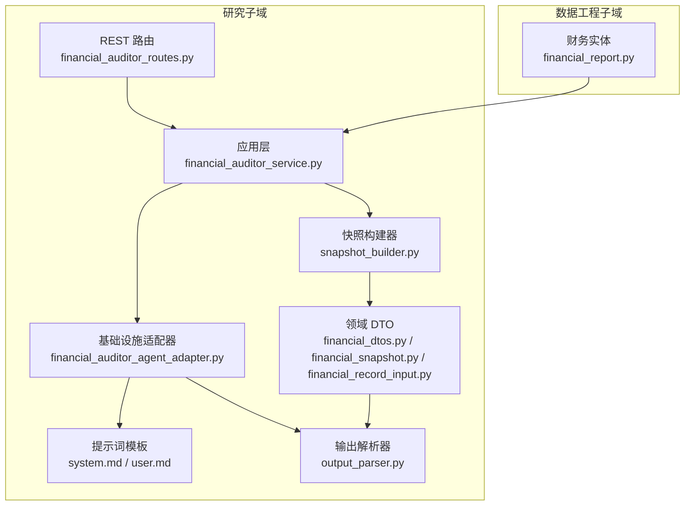
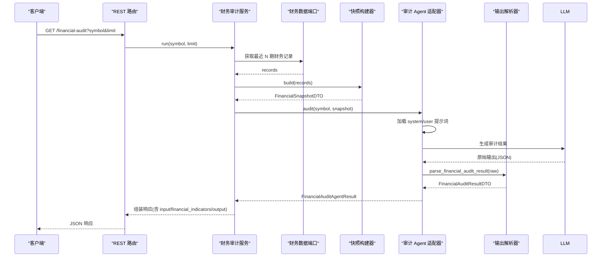
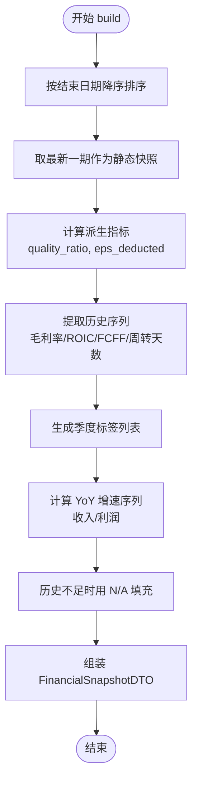
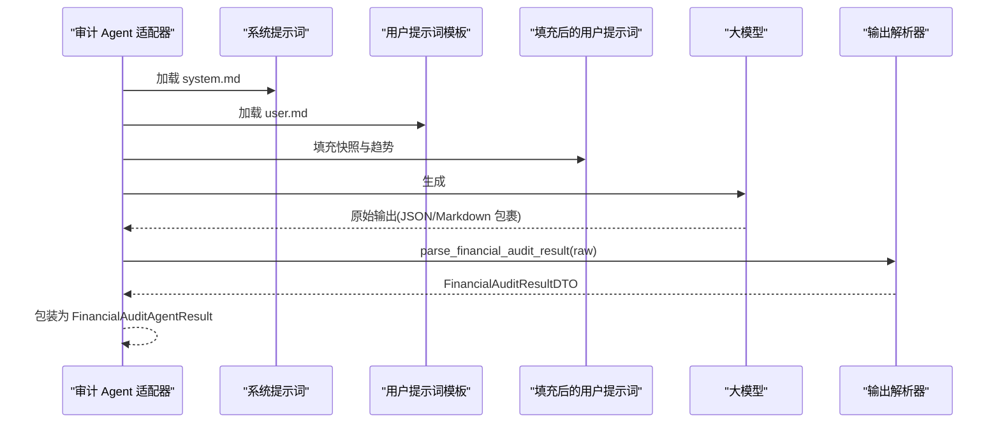
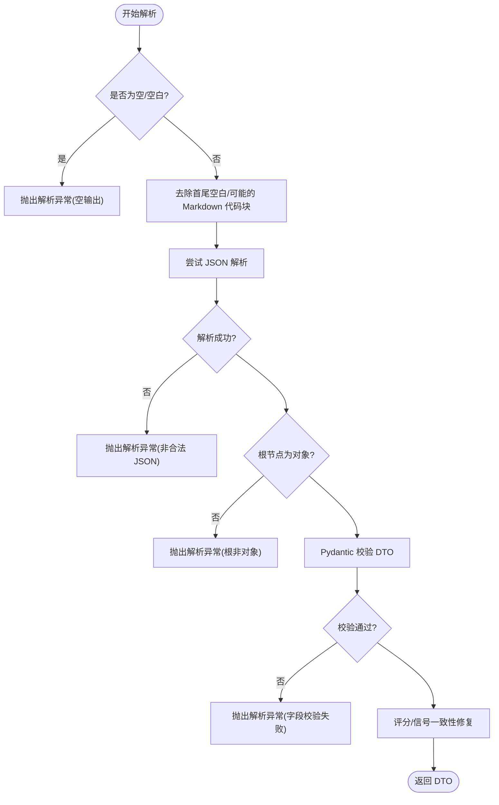
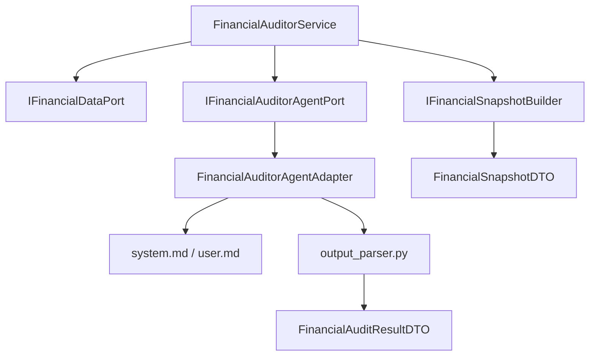

# 财务审计员

<cite>
**本文档引用的文件**
- [src/modules/research/application/financial_auditor_service.py](file://src/modules/research/application/financial_auditor_service.py)
- [src/modules/research/domain/ports/financial_auditor_agent.py](file://src/modules/research/domain/ports/financial_auditor_agent.py)
- [src/modules/research/infrastructure/adapters/financial_auditor_agent_adapter.py](file://src/modules/research/infrastructure/adapters/financial_auditor_agent_adapter.py)
- [src/modules/research/infrastructure/financial_snapshot/snapshot_builder.py](file://src/modules/research/infrastructure/financial_snapshot/snapshot_builder.py)
- [src/modules/research/domain/dtos/financial_dtos.py](file://src/modules/research/domain/dtos/financial_dtos.py)
- [src/modules/research/domain/dtos/financial_snapshot.py](file://src/modules/research/domain/dtos/financial_snapshot.py)
- [src/modules/research/domain/dtos/financial_record_input.py](file://src/modules/research/domain/dtos/financial_record_input.py)
- [src/modules/research/presentation/rest/financial_auditor_routes.py](file://src/modules/research/presentation/rest/financial_auditor_routes.py)
- [src/modules/research/infrastructure/agents/financial_auditor/prompts/system.md](file://src/modules/research/infrastructure/agents/financial_auditor/prompts/system.md)
- [src/modules/research/infrastructure/agents/financial_auditor/prompts/user.md](file://src/modules/research/infrastructure/agents/financial_auditor/prompts/user.md)
- [src/modules/research/infrastructure/agents/financial_auditor/output_parser.py](file://src/modules/research/infrastructure/agents/financial_auditor/output_parser.py)
- [src/modules/data_engineering/domain/model/financial_report.py](file://src/modules/data_engineering/domain/model/financial_report.py)
- [tests/research/application/test_financial_auditor_service.py](file://tests/research/application/test_financial_auditor_service.py)
- [tests/research/agents/financial_auditor/test_output_parser.py](file://tests/research/agents/financial_auditor/test_output_parser.py)
- [tests/research/domain/test_financial_audit_dto.py](file://tests/research/domain/test_financial_audit_dto.py)
</cite>

## 更新摘要
**变更内容**
- 默认限制从5条记录增加到8条记录
- 验证范围从无限制调整为1-20条记录
- REST路由中的默认值描述需要更新以反映新的默认值

## 目录
1. [简介](#简介)
2. [项目结构](#项目结构)
3. [核心组件](#核心组件)
4. [架构总览](#架构总览)
5. [详细组件分析](#详细组件分析)
6. [依赖关系分析](#依赖关系分析)
7. [性能考量](#性能考量)
8. [故障排查指南](#故障排查指南)
9. [结论](#结论)
10. [附录](#附录)

## 简介
本文件面向"财务审计员"专家角色，系统化阐述财务审计服务的数据验证与分析能力，包括：
- 财务报表完整性检查：基于多期财务指标构建快照，确保关键指标与趋势序列齐全。
- 异常数据检测：通过派生指标与同比增速计算，识别潜在异常与风险信号。
- 财务健康度评估：采用五维审计框架，结合评分与信号输出，形成可解释的综合判断。
- 财务快照构建器：整合静态指标与历史序列，形成统一的审计输入视图。
- 审计 Agent 分析流程：从原始财务数据到审计报告输出的端到端过程。
- 输出解析器：将大模型输出解析为结构化 DTO，并进行一致性校验与修复。
- 使用示例：输入财务数据、配置审计参数、解读报告。
- 最佳实践与扩展建议：数据质量、Prompt 设计、稳定性与可维护性。

## 项目结构
财务审计相关模块位于 research 子域，围绕应用服务、领域 DTO、基础设施适配器与提示词模板组织，REST 路由提供对外接口。

**图表来源**
- [src/modules/research/application/financial_auditor_service.py](file://src/modules/research/application/financial_auditor_service.py#L1-L71)
- [src/modules/research/infrastructure/financial_snapshot/snapshot_builder.py](file://src/modules/research/infrastructure/financial_snapshot/snapshot_builder.py#L1-L175)
- [src/modules/research/infrastructure/adapters/financial_auditor_agent_adapter.py](file://src/modules/research/infrastructure/adapters/financial_auditor_agent_adapter.py#L35-L56)
- [src/modules/research/infrastructure/agents/financial_auditor/prompts/system.md](file://src/modules/research/infrastructure/agents/financial_auditor/prompts/system.md#L1-L80)
- [src/modules/research/infrastructure/agents/financial_auditor/prompts/user.md](file://src/modules/research/infrastructure/agents/financial_auditor/prompts/user.md#L1-L49)
- [src/modules/research/infrastructure/agents/financial_auditor/output_parser.py](file://src/modules/research/infrastructure/agents/financial_auditor/output_parser.py#L1-L130)
- [src/modules/research/presentation/rest/financial_auditor_routes.py](file://src/modules/research/presentation/rest/financial_auditor_routes.py#L1-L79)
- [src/modules/data_engineering/domain/model/financial_report.py](file://src/modules/data_engineering/domain/model/financial_report.py#L1-L117)

**章节来源**
- [src/modules/research/application/financial_auditor_service.py](file://src/modules/research/application/financial_auditor_service.py#L1-L71)
- [src/modules/research/presentation/rest/financial_auditor_routes.py](file://src/modules/research/presentation/rest/financial_auditor_routes.py#L1-L79)

## 核心组件
- 应用服务：编排数据获取、快照构建与审计 Agent 调用，组装最终响应。
- 快照构建器：将多期财务记录转换为统一 DTO，计算派生指标与同比增速。
- 审计 Agent 适配器：加载提示词、调用 LLM、解析输出。
- 输出解析器：严格校验 JSON 结构与字段类型，修复评分与信号不一致问题。
- DTO 体系：定义审计结果契约与快照结构，保障跨层数据一致性。
- REST 路由：提供 HTTP 入口，封装响应模型，处理异常。

**章节来源**
- [src/modules/research/application/financial_auditor_service.py](file://src/modules/research/application/financial_auditor_service.py#L17-L71)
- [src/modules/research/infrastructure/financial_snapshot/snapshot_builder.py](file://src/modules/research/infrastructure/financial_snapshot/snapshot_builder.py#L65-L175)
- [src/modules/research/infrastructure/adapters/financial_auditor_agent_adapter.py](file://src/modules/research/infrastructure/adapters/financial_auditor_agent_adapter.py#L35-L56)
- [src/modules/research/infrastructure/agents/financial_auditor/output_parser.py](file://src/modules/research/infrastructure/agents/financial_auditor/output_parser.py#L73-L130)
- [src/modules/research/domain/dtos/financial_dtos.py](file://src/modules/research/domain/dtos/financial_dtos.py#L11-L63)
- [src/modules/research/domain/dtos/financial_snapshot.py](file://src/modules/research/domain/dtos/financial_snapshot.py#L10-L50)
- [src/modules/research/presentation/rest/financial_auditor_routes.py](file://src/modules/research/presentation/rest/financial_auditor_routes.py#L31-L79)

## 架构总览
财务审计服务遵循分层与端口适配器模式，应用层不直接依赖外部实现细节，通过端口抽象与适配器对接 LLM 与数据源。

**图表来源**
- [src/modules/research/presentation/rest/financial_auditor_routes.py](file://src/modules/research/presentation/rest/financial_auditor_routes.py#L54-L79)
- [src/modules/research/application/financial_auditor_service.py](file://src/modules/research/application/financial_auditor_service.py#L33-L71)
- [src/modules/research/infrastructure/adapters/financial_auditor_agent_adapter.py](file://src/modules/research/infrastructure/adapters/financial_auditor_agent_adapter.py#L35-L56)
- [src/modules/research/infrastructure/agents/financial_auditor/output_parser.py](file://src/modules/research/infrastructure/agents/financial_auditor/output_parser.py#L73-L130)

## 详细组件分析

### 财务快照构建器
职责与流程
- 输入：多期 FinanceRecordInput（按结束日期降序）。
- 输出：FinancialSnapshotDTO，包含当期关键指标、季度列表与历史趋势序列。
- 派生指标：质量比（OCFPS/EPS）、扣非 EPS 代理值。
- 同比增速：按季度映射计算 YoY 增速，缺失或异常时填充 N/A。
- 稳健性：若无记录返回空 DTO；若历史不足则用 N/A 填充。

**图表来源**
- [src/modules/research/infrastructure/financial_snapshot/snapshot_builder.py](file://src/modules/research/infrastructure/financial_snapshot/snapshot_builder.py#L68-L175)

**章节来源**
- [src/modules/research/infrastructure/financial_snapshot/snapshot_builder.py](file://src/modules/research/infrastructure/financial_snapshot/snapshot_builder.py#L1-L175)
- [src/modules/research/domain/dtos/financial_record_input.py](file://src/modules/research/domain/dtos/financial_record_input.py#L11-L45)
- [src/modules/research/domain/dtos/financial_snapshot.py](file://src/modules/research/domain/dtos/financial_snapshot.py#L10-L50)

### 财务审计 Agent 的分析流程
- 提示词加载：系统提示词定义角色、目标、五维框架与评分协议；用户提示词模板填充快照与趋势。
- LLM 调用：以 system + user prompt 触发生成，温度较低以增强确定性。
- 输出解析：解析器剥离 Markdown 代码块、校验 JSON 结构、Pydantic 校验字段、修复评分与信号不一致。
- 结果封装：返回包含解析 DTO、原始输出与用户提示词的 Agent 结果。

**图表来源**
- [src/modules/research/infrastructure/adapters/financial_auditor_agent_adapter.py](file://src/modules/research/infrastructure/adapters/financial_auditor_agent_adapter.py#L35-L56)
- [src/modules/research/infrastructure/agents/financial_auditor/prompts/system.md](file://src/modules/research/infrastructure/agents/financial_auditor/prompts/system.md#L1-L80)
- [src/modules/research/infrastructure/agents/financial_auditor/prompts/user.md](file://src/modules/research/infrastructure/agents/financial_auditor/prompts/user.md#L1-L49)
- [src/modules/research/infrastructure/agents/financial_auditor/output_parser.py](file://src/modules/research/infrastructure/agents/financial_auditor/output_parser.py#L73-L130)

**章节来源**
- [src/modules/research/domain/ports/financial_auditor_agent.py](file://src/modules/research/domain/ports/financial_auditor_agent.py#L12-L22)
- [src/modules/research/infrastructure/adapters/financial_auditor_agent_adapter.py](file://src/modules/research/infrastructure/adapters/financial_auditor_agent_adapter.py#L35-L56)
- [src/modules/research/infrastructure/agents/financial_auditor/prompts/system.md](file://src/modules/research/infrastructure/agents/financial_auditor/prompts/system.md#L1-L80)
- [src/modules/research/infrastructure/agents/financial_auditor/prompts/user.md](file://src/modules/research/infrastructure/agents/financial_auditor/prompts/user.md#L1-L49)
- [src/modules/research/infrastructure/agents/financial_auditor/output_parser.py](file://src/modules/research/infrastructure/agents/financial_auditor/output_parser.py#L1-L130)

### 输出解析器实现机制
- 空值与格式校验：空输出、非 JSON、根节点非对象均抛出解析异常。
- 结构校验：使用 Pydantic 对 DTO 进行字段与范围校验，格式化错误摘要。
- 一致性修复：若评分与信号不匹配，以评分映射为准修正信号。
- 日志与可观测性：记录原始输出片段，便于定位问题。

**图表来源**
- [src/modules/research/infrastructure/agents/financial_auditor/output_parser.py](file://src/modules/research/infrastructure/agents/financial_auditor/output_parser.py#L73-L130)

**章节来源**
- [src/modules/research/infrastructure/agents/financial_auditor/output_parser.py](file://src/modules/research/infrastructure/agents/financial_auditor/output_parser.py#L1-L130)
- [src/modules/research/domain/dtos/financial_dtos.py](file://src/modules/research/domain/dtos/financial_dtos.py#L25-L63)

### 数据验证与异常检测
- 报表完整性检查：快照构建器确保关键指标与趋势序列存在；缺失值以 N/A 表示，避免中断后续分析。
- 异常信号：通过派生指标（如质量比）与同比增速（收入/利润）识别异常趋势；运营效率维度关注存货与应收账款周转天数变化。
- 健康度评估：五维框架结合评分区间映射输出信号，支持风险预警与证伪条件描述。

**章节来源**
- [src/modules/research/infrastructure/financial_snapshot/snapshot_builder.py](file://src/modules/research/infrastructure/financial_snapshot/snapshot_builder.py#L31-L62)
- [src/modules/research/infrastructure/agents/financial_auditor/prompts/system.md](file://src/modules/research/infrastructure/agents/financial_auditor/prompts/system.md#L11-L50)
- [src/modules/research/domain/dtos/financial_dtos.py](file://src/modules/research/domain/dtos/financial_dtos.py#L11-L13)

### 应用服务编排与 REST 接口
- 应用服务：校验输入、获取财务记录、构建快照、调用审计 Agent、组装响应（包含 input、financial_indicators、output）。
- REST 接口：提供查询参数控制期数，捕获业务与解析异常，统一返回结构化响应。

**更新** 默认限制从5条记录增加到8条记录，验证范围调整为1-20条记录

**章节来源**
- [src/modules/research/application/financial_auditor_service.py](file://src/modules/research/application/financial_auditor_service.py#L33-L71)
- [src/modules/research/presentation/rest/financial_auditor_routes.py](file://src/modules/research/presentation/rest/financial_auditor_routes.py#L54-L79)

## 依赖关系分析
- 应用层依赖端口：财务数据端口、快照构建器端口、审计 Agent 端口。
- 适配器依赖：提示词加载、LLM 生成、输出解析。
- DTO 依赖：审计结果 DTO 与快照 DTO 作为契约，约束跨层数据结构。
- 测试覆盖：应用服务集成测试、输出解析单元测试、DTO 校验测试。

**图表来源**
- [src/modules/research/application/financial_auditor_service.py](file://src/modules/research/application/financial_auditor_service.py#L23-L31)
- [src/modules/research/domain/ports/financial_auditor_agent.py](file://src/modules/research/domain/ports/financial_auditor_agent.py#L12-L22)
- [src/modules/research/infrastructure/adapters/financial_auditor_agent_adapter.py](file://src/modules/research/infrastructure/adapters/financial_auditor_agent_adapter.py#L35-L56)
- [src/modules/research/infrastructure/agents/financial_auditor/output_parser.py](file://src/modules/research/infrastructure/agents/financial_auditor/output_parser.py#L73-L130)
- [src/modules/research/domain/dtos/financial_dtos.py](file://src/modules/research/domain/dtos/financial_dtos.py#L11-L63)
- [src/modules/research/domain/dtos/financial_snapshot.py](file://src/modules/research/domain/dtos/financial_snapshot.py#L10-L50)

**章节来源**
- [src/modules/research/application/financial_auditor_service.py](file://src/modules/research/application/financial_auditor_service.py#L17-L31)
- [src/modules/research/domain/ports/financial_auditor_agent.py](file://src/modules/research/domain/ports/financial_auditor_agent.py#L12-L22)
- [src/modules/research/infrastructure/adapters/financial_auditor_agent_adapter.py](file://src/modules/research/infrastructure/adapters/financial_auditor_agent_adapter.py#L35-L56)
- [src/modules/research/infrastructure/agents/financial_auditor/output_parser.py](file://src/modules/research/infrastructure/agents/financial_auditor/output_parser.py#L73-L130)
- [src/modules/research/domain/dtos/financial_dtos.py](file://src/modules/research/domain/dtos/financial_dtos.py#L11-L63)
- [src/modules/research/domain/dtos/financial_snapshot.py](file://src/modules/research/domain/dtos/financial_snapshot.py#L10-L50)

## 性能考量
- 数据访问：限制查询期数（默认 8 期，范围 1-20），避免过长的历史序列导致解析与提示词膨胀。
- 快照构建：O(n) 趋势与同比计算，注意内存与时间复杂度；对空序列快速返回。
- LLM 调用：固定温度降低不确定性，减少重复生成；合理拆分提示词长度。
- 解析开销：JSON 解析与 Pydantic 校验为轻量级；日志截断避免超长文本影响性能。

**更新** 默认限制从5条记录增加到8条记录，验证范围调整为1-20条记录

## 故障排查指南
常见问题与定位
- 输入校验失败：symbol 为空或无财务数据，抛出业务异常；检查数据工程同步状态。
- LLM 输出解析失败：空输出、非 JSON、字段缺失或类型不符；查看解析器日志中的原始输出片段。
- 评分与信号不一致：解析器自动修复；如仍异常，检查评分区间映射逻辑。
- 接口异常：HTTP 400/422/500 映射到业务异常、解析异常或未知异常；结合日志定位。

**更新** 默认限制从5条记录增加到8条记录，验证范围调整为1-20条记录

**章节来源**
- [src/modules/research/application/financial_auditor_service.py](file://src/modules/research/application/financial_auditor_service.py#L38-L53)
- [src/modules/research/infrastructure/agents/financial_auditor/output_parser.py](file://src/modules/research/infrastructure/agents/financial_auditor/output_parser.py#L80-L129)
- [src/modules/research/presentation/rest/financial_auditor_routes.py](file://src/modules/research/presentation/rest/financial_auditor_routes.py#L68-L79)

## 结论
财务审计员通过"快照构建 + 五维审计 + 结构化解析"的闭环，实现了从原始财务数据到可解释审计报告的自动化与标准化。其设计强调契约驱动、端口解耦与强校验，既满足审计员对严谨性的要求，也为扩展与维护提供了清晰边界。

## 附录

### 使用示例
- 输入：股票代码（如 000001.SZ），可选期数（默认 8 期，范围 1-20）。
- 参数：limit 控制取最近 N 期财务数据。
- 输出：包含整体评分、信号、置信度、维度分析、关键风险与风险预警，以及 input、financial_indicators、output 字段。

**更新** 默认限制从5条记录增加到8条记录，验证范围调整为1-20条记录

**章节来源**
- [src/modules/research/presentation/rest/financial_auditor_routes.py](file://src/modules/research/presentation/rest/financial_auditor_routes.py#L54-L79)
- [src/modules/research/application/financial_auditor_service.py](file://src/modules/research/application/financial_auditor_service.py#L33-L71)

### 财务数据分析最佳实践
- 数据质量优先：确保 end_date、关键财务指标齐全；缺失值以 N/A 表示，避免误判。
- 指标组合分析：结合盈利能力、运营效率、资本回报、偿债能力与增长趋势，交叉验证结论。
- Prompt 稳定性：保持提示词模板稳定，避免频繁变更导致输出不稳定。
- 解析健壮性：严格 JSON 与字段校验，保留原始输出日志以便回溯。

### 扩展开发建议
- 新增维度：在提示词与解析器中增加新维度，同时更新 DTO 与快照构建逻辑。
- 多数据源：扩展财务数据端口以支持不同来源，适配器层保持不变。
- 模板化 Prompt：引入变量化模板与版本管理，便于灰度与回滚。
- 监控与告警：对解析失败率、响应延迟与评分分布建立监控指标。