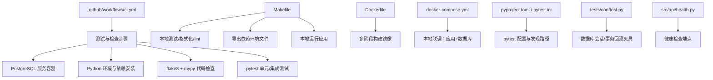
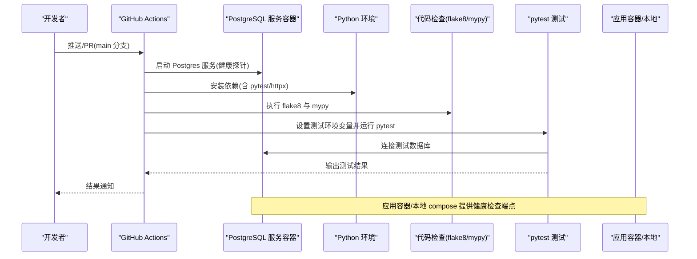
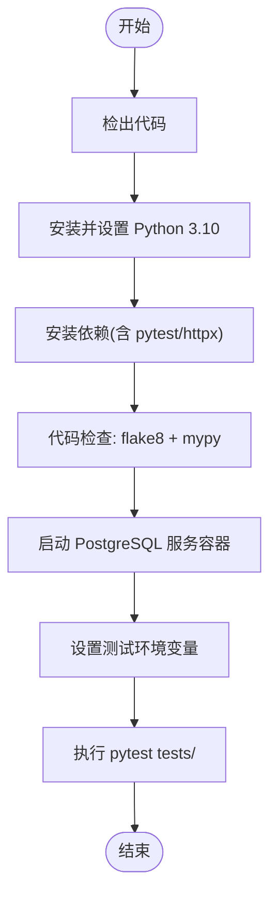
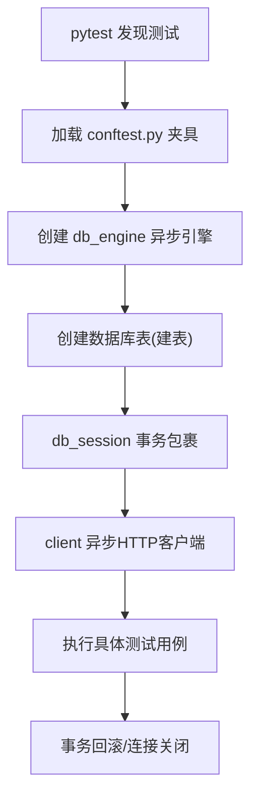
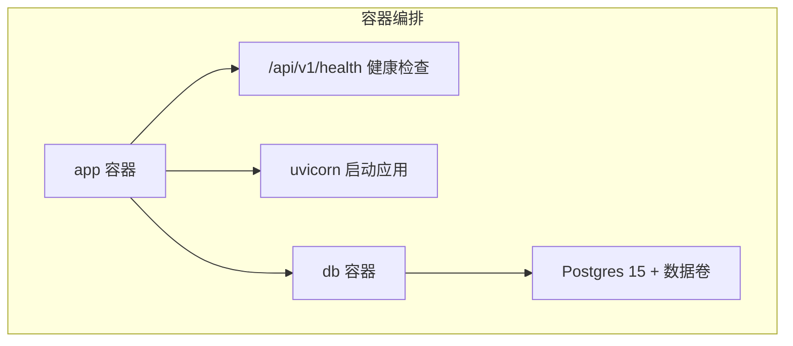
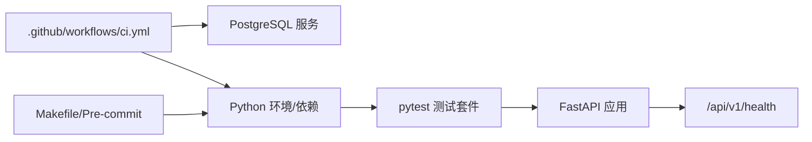

# CI/CD流水线

<cite>
**本文引用的文件**
- [.github/workflows/ci.yml](file://.github/workflows/ci.yml)
- [Makefile](file://Makefile)
- [pytest.ini](file://pytest.ini)
- [pyproject.toml](file://pyproject.toml)
- [requirements.txt](file://requirements.txt)
- [.pre-commit-config.yaml](file://.pre-commit-config.yaml)
- [environment.yml](file://environment.yml)
- [Dockerfile](file://Dockerfile)
- [docker-compose.yml](file://docker-compose.yml)
- [tests/conftest.py](file://tests/conftest.py)
- [src/main.py](file://src/main.py)
- [src/api/routes.py](file://src/api/routes.py)
- [src/api/health.py](file://src/api/health.py)
- [scripts/test_chat_api.py](file://scripts/test_chat_api.py)
</cite>

## 目录
1. [简介](#简介)
2. [项目结构](#项目结构)
3. [核心组件](#核心组件)
4. [架构总览](#架构总览)
5. [详细组件分析](#详细组件分析)
6. [依赖关系分析](#依赖关系分析)
7. [性能与可维护性建议](#性能与可维护性建议)
8. [故障排查指南](#故障排查指南)
9. [结论](#结论)
10. [附录](#附录)

## 简介
本文件系统化梳理股票助手项目的CI/CD流水线配置与最佳实践，覆盖以下方面：
- GitHub Actions 工作流的触发条件、作业矩阵、服务依赖与步骤编排
- 代码质量检查（lint/mypy）与测试执行（pytest）的配置与运行方式
- Makefile 的自动化命令与构建脚本职责
- 测试配置与覆盖率现状说明（含pytest配置与测试发现机制）
- 持续集成最佳实践（并行测试、缓存策略、失败重试）
- 持续部署配置（镜像构建、容器健康检查、环境变量管理）
- 流水线监控与通知建议、故障排查清单

## 项目结构
围绕CI/CD的关键文件分布如下：
- GitHub Actions：.github/workflows/ci.yml
- 本地开发与CI工具链：Makefile、pyproject.toml、pytest.ini、requirements.txt、environment.yml、.pre-commit-config.yaml
- 容器化与本地联调：Dockerfile、docker-compose.yml
- 测试与基础设施：tests/conftest.py、scripts/test_chat_api.py
- 应用入口与健康检查：src/main.py、src/api/routes.py、src/api/health.py

图表来源
- [.github/workflows/ci.yml](file://.github/workflows/ci.yml#L1-L60)
- [Makefile](file://Makefile#L1-L27)
- [Dockerfile](file://Dockerfile#L1-L52)
- [docker-compose.yml](file://docker-compose.yml#L1-L55)
- [pyproject.toml](file://pyproject.toml#L1-L22)
- [pytest.ini](file://pytest.ini#L1-L5)
- [tests/conftest.py](file://tests/conftest.py#L1-L56)
- [src/api/health.py](file://src/api/health.py#L1-L24)

章节来源
- file://.github/workflows/ci.yml#L1-L60
- file://Makefile#L1-L27
- file://Dockerfile#L1-L52
- file://docker-compose.yml#L1-L55
- file://pyproject.toml#L1-L22
- file://pytest.ini#L1-L5
- file://tests/conftest.py#L1-L56
- file://src/api/health.py#L1-L24

## 核心组件
- GitHub Actions 工作流：定义在主分支推送与拉取请求场景下的测试作业，包含PostgreSQL服务容器、Python版本矩阵、代码检查与测试执行。
- Makefile：提供安装、导出依赖、测试、格式化、lint、运行与清理等常用命令。
- 测试框架与配置：pytest（含asyncio模式）、pytest.ini与pyproject.toml中的pytest配置；测试夹具在conftest.py中集中定义。
- 代码质量工具：flake8、mypy、black、isort；配合pre-commit钩子与pyproject.toml配置。
- 容器化与本地联调：Dockerfile（多阶段构建）与docker-compose.yml（应用+数据库+健康检查）。
- 应用健康检查：/api/v1/health端点，供容器健康检查与CI健康探测使用。

章节来源
- file://.github/workflows/ci.yml#L1-L60
- file://Makefile#L1-L27
- file://pytest.ini#L1-L5
- file://pyproject.toml#L1-L22
- file://tests/conftest.py#L1-L56
- file://Dockerfile#L1-L52
- file://docker-compose.yml#L1-L55
- file://src/api/health.py#L1-L24

## 架构总览
下图展示CI流水线从触发到测试执行的整体流程，以及与容器化和测试夹具的关系。

图表来源
- [.github/workflows/ci.yml](file://.github/workflows/ci.yml#L1-L60)
- [docker-compose.yml](file://docker-compose.yml#L1-L55)
- [src/api/health.py](file://src/api/health.py#L1-L24)

## 详细组件分析

### GitHub Actions 工作流（ci.yml）
- 触发条件：主分支推送与主分支拉取请求
- 作业：单作业“test”，运行于ubuntu-latest
- 矩阵：Python版本固定为3.10
- 服务：PostgreSQL 15（带健康探针参数），映射端口，设置数据库名/用户/密码
- 步骤：
  - checkout仓库
  - 安装并设置Python 3.10
  - 安装依赖（requirements.txt、pytest、httpx）
  - 代码检查：flake8、mypy
  - 运行测试：设置POSTGRES_*与ENVIRONMENT=test，执行pytest tests/

图表来源
- [.github/workflows/ci.yml](file://.github/workflows/ci.yml#L1-L60)

章节来源
- file://.github/workflows/ci.yml#L1-L60

### Makefile 自动化命令
- install：基于environment.yml使用conda创建/更新环境
- export-deps：导出conda环境与pip依赖至environment.yml与requirements.txt
- test：执行pytest tests/
- lint：执行flake8与mypy
- format：执行black与isort
- run：使用uvicorn启动应用（开发模式）
- clean：清理Python缓存文件

章节来源
- file://Makefile#L1-L27
- file://environment.yml#L1-L29
- file://requirements.txt#L1-L16

### 测试配置与发现机制
- pytest配置：
  - pytest.ini：启用asyncio自动模式与会话级默认作用域
  - pyproject.toml：最小版本、附加参数、测试目录tests
- 测试夹具（tests/conftest.py）：
  - db_engine：创建异步引擎并在会话开始时建表，结束时释放连接
  - db_session：使用事务包裹，测试结束后回滚，确保数据隔离
  - client：FastAPI异步HTTP客户端，便于接口测试
- 健康检查端点：
  - /api/v1/health：校验数据库连通性，返回状态信息

图表来源
- [tests/conftest.py](file://tests/conftest.py#L1-L56)
- [pyproject.toml](file://pyproject.toml#L16-L22)
- [pytest.ini](file://pytest.ini#L1-L5)
- [src/api/health.py](file://src/api/health.py#L1-L24)

章节来源
- file://tests/conftest.py#L1-L56
- file://pyproject.toml#L16-L22
- file://pytest.ini#L1-L5
- file://src/api/health.py#L1-L24

### 代码质量工具链
- black：统一代码风格，行宽、目标版本、包含规则见pyproject.toml
- isort：导入排序，与black兼容
- flake8/mypy：静态检查，mypy忽略缺失导入，提升可维护性
- pre-commit：在提交前自动执行上述检查，避免问题进入仓库

章节来源
- file://pyproject.toml#L1-L22
- file://.pre-commit-config.yaml#L1-L25

### 容器化与本地联调
- Dockerfile：
  - 多阶段构建：builder阶段安装依赖，runtime阶段仅复制venv与应用代码
  - 健康检查：对/health端点进行探测
  - 用户与环境变量：非root用户运行，设置PYTHONPATH与PYTHONUNBUFFERED
- docker-compose.yml：
  - app服务：挂载代码、读取.env、依赖db健康、启动后执行alembic迁移再启动应用
  - db服务：Postgres 15，持久化卷，健康检查
  - 健康检查：app与db均配置健康探针

图表来源
- [Dockerfile](file://Dockerfile#L1-L52)
- [docker-compose.yml](file://docker-compose.yml#L1-L55)
- [src/api/health.py](file://src/api/health.py#L1-L24)

章节来源
- file://Dockerfile#L1-L52
- file://docker-compose.yml#L1-L55
- file://src/api/health.py#L1-L24

### API路由与健康检查
- 路由聚合：src/api/routes.py将健康、数据工程、LLM平台、研究模块路由整合
- 健康检查：src/api/health.py提供/health端点，依赖数据库会话验证连通性

章节来源
- file://src/api/routes.py#L1-L13
- file://src/api/health.py#L1-L24

### 本地聊天接口测试脚本
- scripts/test_chat_api.py：向LLM平台chat路由发送POST请求，支持别名与标签参数，便于快速验证接口可用性

章节来源
- file://scripts/test_chat_api.py#L1-L37

## 依赖关系分析
- CI对服务的依赖：PostgreSQL服务容器为测试提供真实数据库环境
- 测试对应用的依赖：pytest通过FastAPI异步客户端访问路由，健康检查端点用于连通性验证
- 本地开发对工具链的依赖：Makefile、pre-commit、pyproject.toml共同保障一致性

图表来源
- [.github/workflows/ci.yml](file://.github/workflows/ci.yml#L1-L60)
- [tests/conftest.py](file://tests/conftest.py#L1-L56)
- [src/api/health.py](file://src/api/health.py#L1-L24)

章节来源
- file://.github/workflows/ci.yml#L1-L60
- file://tests/conftest.py#L1-L56
- file://src/api/health.py#L1-L24

## 性能与可维护性建议
- 并行测试：pytest可通过插件实现并行执行，建议在CI中按模块拆分作业或使用-x/-n/--boxed等参数优化速度（当前配置未启用并行）
- 缓存策略：GitHub Actions可缓存pip/conda依赖，减少重复安装时间（当前未配置缓存）
- 失败重试：对不稳定网络或第三方API调用可增加重试逻辑（当前未配置重试）
- 覆盖率：当前未配置覆盖率统计；可在pytest中启用coverage并输出报告，结合GHA缓存与注释报告
- 依赖锁定：environment.yml与requirements.txt分别管理conda与pip依赖，建议在CI中同时校验两份锁文件一致性

[本节为通用建议，不直接分析具体文件]

## 故障排查指南
- CI中Postgres连接失败
  - 检查服务容器健康探针参数与端口映射
  - 确认测试环境变量（POSTGRES_SERVER/USER/PASSWORD/DB/PORT）正确
- 测试数据库未初始化
  - 确保在测试前执行数据库迁移（如使用Alembic）
  - 检查测试夹具是否成功建表与回滚
- 健康检查失败
  - 查看/health端点返回状态与错误详情
  - 确认数据库连接字符串与权限
- 本地联调异常
  - 检查docker-compose网络与卷配置
  - 确认app容器已执行迁移后再启动服务
- 依赖冲突
  - 使用export-deps导出最新依赖，确保本地与CI一致

章节来源
- file://.github/workflows/ci.yml#L1-L60
- file://docker-compose.yml#L1-L55
- file://tests/conftest.py#L1-L56
- file://src/api/health.py#L1-L24

## 结论
本项目的CI/CD流水线以GitHub Actions为核心，结合PostgreSQL服务容器、pytest测试框架与Docker容器化，实现了从代码检查到测试执行的完整闭环。建议在现有基础上引入缓存、并行测试与覆盖率统计，并完善失败重试与通知机制，以进一步提升稳定性与可观测性。

[本节为总结性内容，不直接分析具体文件]

## 附录
- 快速参考
  - 在本地执行测试：make test
  - 在CI中运行：push/main 或 PR/main
  - 导出依赖：make export-deps
  - 本地联调：docker-compose up
  - 健康检查：GET /api/v1/health

[本节为概览性内容，不直接分析具体文件]