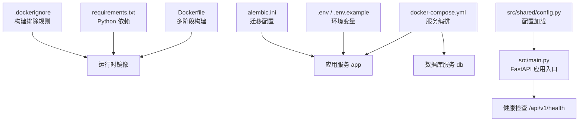
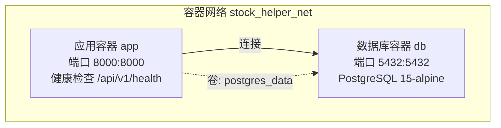
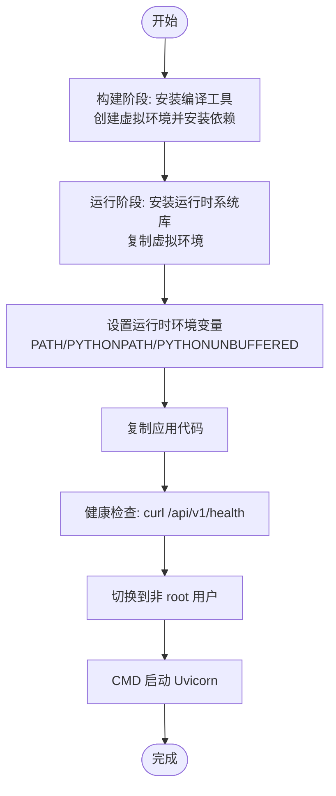
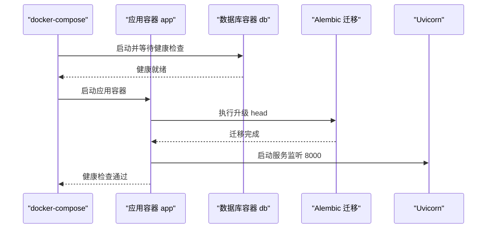
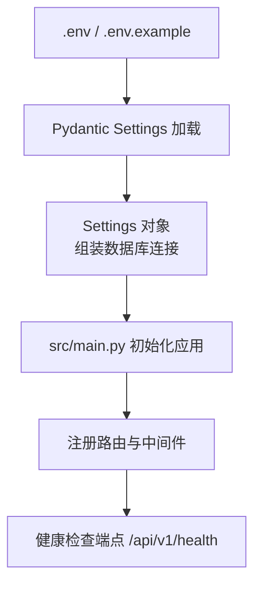
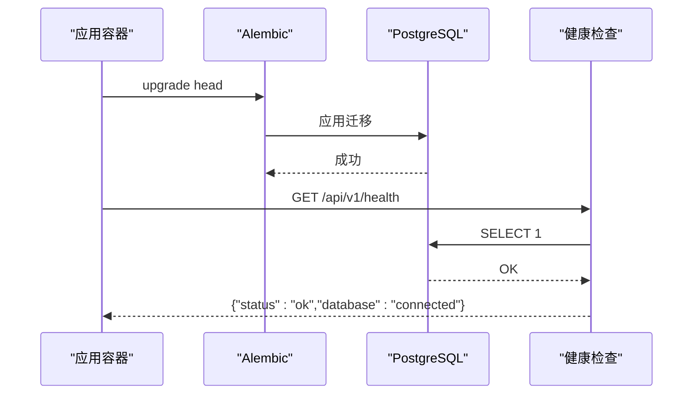
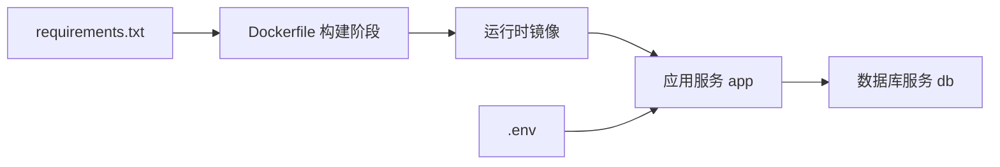

# 容器化部署

<cite>
**本文引用的文件**
- [Dockerfile](file://Dockerfile)
- [docker-compose.yml](file://docker-compose.yml)
- [.dockerignore](file://.dockerignore)
- [.env.example](file://.env.example)
- [.env](file://.env)
- [requirements.txt](file://requirements.txt)
- [src/main.py](file://src/main.py)
- [src/shared/config.py](file://src/shared/config.py)
- [src/api/routes.py](file://src/api/routes.py)
- [src/api/health.py](file://src/api/health.py)
- [alembic.ini](file://alembic.ini)
- [Makefile](file://Makefile)
</cite>

## 目录
1. [简介](#简介)
2. [项目结构](#项目结构)
3. [核心组件](#核心组件)
4. [架构总览](#架构总览)
5. [详细组件分析](#详细组件分析)
6. [依赖关系分析](#依赖关系分析)
7. [性能考虑](#性能考虑)
8. [故障排查指南](#故障排查指南)
9. [结论](#结论)
10. [附录](#附录)

## 简介
本文件面向“股票助手”项目的容器化部署，系统性说明：
- Dockerfile 多阶段构建：构建阶段与运行时阶段的差异与目的
- 镜像构建流程：系统依赖、Python 虚拟环境、运行时优化
- docker-compose.yml 服务编排：应用服务、数据库服务、网络与健康检查
- 环境变量、数据卷、端口映射最佳实践
- 容器生命周期：启动、停止、重启
- 调试技巧与常见问题
- 资源限制与性能优化建议

## 项目结构
围绕容器化部署的关键文件与职责如下：
- 构建与运行镜像：Dockerfile、requirements.txt、.dockerignore
- 编排与服务：docker-compose.yml、.env/.env.example
- 应用入口与配置：src/main.py、src/shared/config.py
- 健康检查与路由：src/api/health.py、src/api/routes.py
- 数据迁移：alembic.ini
- 开发辅助：Makefile

图表来源
- [Dockerfile](file://Dockerfile#L1-L52)
- [requirements.txt](file://requirements.txt#L1-L16)
- [.dockerignore](file://.dockerignore#L1-L42)
- [docker-compose.yml](file://docker-compose.yml#L1-L55)
- [.env.example](file://.env.example#L1-L17)
- [.env](file://.env#L1-L18)
- [src/main.py](file://src/main.py#L1-L75)
- [src/shared/config.py](file://src/shared/config.py#L1-L68)
- [src/api/health.py](file://src/api/health.py#L1-L24)
- [alembic.ini](file://alembic.ini#L1-L97)

章节来源
- [Dockerfile](file://Dockerfile#L1-L52)
- [docker-compose.yml](file://docker-compose.yml#L1-L55)
- [.dockerignore](file://.dockerignore#L1-L42)
- [.env.example](file://.env.example#L1-L17)
- [.env](file://.env#L1-L18)
- [requirements.txt](file://requirements.txt#L1-L16)
- [src/main.py](file://src/main.py#L1-L75)
- [src/shared/config.py](file://src/shared/config.py#L1-L68)
- [src/api/health.py](file://src/api/health.py#L1-L24)
- [alembic.ini](file://alembic.ini#L1-L97)

## 核心组件
- 多阶段 Dockerfile：分离构建期与运行期，减少最终镜像体积，提升安全性与可维护性
- docker-compose：定义应用与数据库服务、网络、卷、环境变量与健康检查
- 环境变量：通过 .env 加载，支持数据库、第三方平台等配置
- 应用入口：FastAPI 应用，注册路由与中间件，提供健康检查端点
- 数据迁移：Alembic 在容器启动前执行数据库迁移

章节来源
- [Dockerfile](file://Dockerfile#L1-L52)
- [docker-compose.yml](file://docker-compose.yml#L1-L55)
- [.env.example](file://.env.example#L1-L17)
- [.env](file://.env#L1-L18)
- [src/main.py](file://src/main.py#L1-L75)
- [src/api/health.py](file://src/api/health.py#L1-L24)
- [alembic.ini](file://alembic.ini#L1-L97)

## 架构总览
容器化部署采用“应用 + 数据库”的双服务模型，通过自定义桥接网络通信，应用在启动时自动执行数据库迁移，并暴露健康检查端点。

图表来源
- [docker-compose.yml](file://docker-compose.yml#L1-L55)

章节来源
- [docker-compose.yml](file://docker-compose.yml#L1-L55)

## 详细组件分析

### Dockerfile 多阶段构建
- 构建阶段（builder）：
  - 基于 slim 镜像，安装编译工具链
  - 创建 Python 虚拟环境并安装 Python 依赖
- 运行阶段：
  - 仅保留运行所需系统库（如 libpq、curl）
  - 从构建阶段复制虚拟环境
  - 设置 PATH、PYTHONPATH、缓冲输出等运行时变量
  - 健康检查使用 curl 访问 /api/v1/health
  - 以非 root 用户运行
  - CMD 启动 Uvicorn

图表来源
- [Dockerfile](file://Dockerfile#L1-L52)

章节来源
- [Dockerfile](file://Dockerfile#L1-L52)

### docker-compose.yml 服务编排
- 应用服务 app：
  - 构建上下文为项目根目录
  - 端口映射 8000:8000
  - 挂载当前目录到 /app，便于开发调试
  - 通过 env_file 加载 .env
  - 设置数据库相关环境变量（POSTGRES_*）
  - 启动命令先执行 Alembic 升级，再启动 Uvicorn
  - 依赖 db 健康后启动
  - 健康检查访问 /api/v1/health
- 数据库服务 db：
  - 使用 PostgreSQL 15-alpine
  - 端口映射 5432:5432
  - 环境变量设置用户、密码、数据库名
  - 数据卷 postgres_data 持久化
  - 健康检查使用 pg_isready
- 网络与卷：
  - 自定义桥接网络 stock_helper_net
  - 命名卷 postgres_data

图表来源
- [docker-compose.yml](file://docker-compose.yml#L1-L55)

章节来源
- [docker-compose.yml](file://docker-compose.yml#L1-L55)

### 环境变量与配置加载
- .env/.env.example 提供默认配置模板，包含数据库连接、第三方平台密钥等
- src/shared/config.py 使用 Pydantic Settings 自动加载 .env 并组装数据库连接字符串
- 应用入口 src/main.py 读取 settings 并初始化日志、CORS、中间件与路由

图表来源
- [.env.example](file://.env.example#L1-L17)
- [.env](file://.env#L1-L18)
- [src/shared/config.py](file://src/shared/config.py#L1-L68)
- [src/main.py](file://src/main.py#L1-L75)
- [src/api/routes.py](file://src/api/routes.py#L1-L13)
- [src/api/health.py](file://src/api/health.py#L1-L24)

章节来源
- [.env.example](file://.env.example#L1-L17)
- [.env](file://.env#L1-L18)
- [src/shared/config.py](file://src/shared/config.py#L1-L68)
- [src/main.py](file://src/main.py#L1-L75)
- [src/api/routes.py](file://src/api/routes.py#L1-L13)
- [src/api/health.py](file://src/api/health.py#L1-L24)

### 数据库迁移与健康检查
- 启动命令中先执行 Alembic 升级，确保数据库 schema 最新
- 健康检查端点 /api/v1/health 会尝试执行一条 SQL，验证数据库连通性
- compose 的健康检查与镜像健康检查共同保障服务可用性

图表来源
- [docker-compose.yml](file://docker-compose.yml#L17-L17)
- [src/api/health.py](file://src/api/health.py#L10-L23)
- [alembic.ini](file://alembic.ini#L49-L49)

章节来源
- [docker-compose.yml](file://docker-compose.yml#L17-L17)
- [src/api/health.py](file://src/api/health.py#L10-L23)
- [alembic.ini](file://alembic.ini#L49-L49)

## 依赖关系分析
- 构建依赖：Dockerfile 依赖 requirements.txt 提供的 Python 包清单
- 运行依赖：运行时镜像需要 libpq-dev（PostgreSQL 客户端库）、curl（健康检查）
- 应用依赖：FastAPI、Uvicorn、SQLAlchemy、Alembic、Pydantic Settings、日志与调度器等
- 编排依赖：compose 依赖 .env 提供数据库与第三方平台配置

图表来源
- [requirements.txt](file://requirements.txt#L1-L16)
- [Dockerfile](file://Dockerfile#L1-L52)
- [docker-compose.yml](file://docker-compose.yml#L1-L55)
- [.env](file://.env#L1-L18)

章节来源
- [requirements.txt](file://requirements.txt#L1-L16)
- [Dockerfile](file://Dockerfile#L1-L52)
- [docker-compose.yml](file://docker-compose.yml#L1-L55)
- [.env](file://.env#L1-L18)

## 性能考虑
- 多阶段构建：仅在最终镜像中包含运行时依赖，减小镜像体积，降低攻击面
- 运行时优化：
  - 使用非 root 用户运行，提升安全性
  - 设置 PYTHONUNBUFFERED=1，便于容器日志实时输出
  - 仅安装运行所需系统库（libpq、curl）
- 健康检查：
  - 应用与镜像层面双重健康检查，缩短故障发现时间
- 数据库：
  - 使用持久化卷存储 PostgreSQL 数据，避免容器重建丢失数据
- 调度与并发：
  - 应用启动时初始化调度器，结合 APScheduler 实现定时任务
  - 生产环境建议配合外部调度器或 Kubernetes CronJob 管理周期任务

章节来源
- [Dockerfile](file://Dockerfile#L43-L48)
- [docker-compose.yml](file://docker-compose.yml#L39-L40)
- [src/main.py](file://src/main.py#L21-L47)

## 故障排查指南
- 健康检查失败
  - 检查应用容器日志，确认 Alembic 是否成功执行
  - 确认数据库已就绪且网络连通
  - 参考健康检查端点返回的数据库状态
- 数据库连接失败
  - 核对 .env 中的 POSTGRES_* 配置
  - 确认数据库容器健康检查通过
- 端口冲突
  - 修改 docker-compose.yml 中的端口映射
- 权限问题
  - 确认非 root 用户拥有写入权限（如日志目录）
- 开发调试
  - 使用卷挂载 .:/app，修改代码后无需重建镜像即可生效
  - 使用 compose 的健康检查与日志输出定位问题

章节来源
- [docker-compose.yml](file://docker-compose.yml#L23-L28)
- [docker-compose.yml](file://docker-compose.yml#L43-L47)
- [src/api/health.py](file://src/api/health.py#L18-L23)
- [src/shared/config.py](file://src/shared/config.py#L40-L58)

## 结论
该容器化方案通过多阶段构建实现最小化运行时镜像，结合 docker-compose 的服务编排与健康检查机制，提供了稳定、可扩展的部署基线。配合 .env 环境变量与 Alembic 迁移，能够在不同环境中快速拉起应用并保证数据库一致性。建议在生产环境中进一步引入资源限制、健康检查策略与监控告警体系，以满足更高的可靠性与可观测性要求。

## 附录

### 容器生命周期操作指南
- 启动
  - 开发模式：在项目根目录执行 compose 启动命令，应用容器会在启动时自动执行数据库迁移
  - 生产模式：建议使用 docker compose up -d 后台启动，并结合外部监控与日志收集
- 停止
  - docker compose stop 或 docker compose down
- 重启
  - docker compose restart app 或 docker compose up -d

章节来源
- [docker-compose.yml](file://docker-compose.yml#L17-L17)

### 环境变量与数据卷挂载最佳实践
- 环境变量
  - 将敏感信息放入 .env，不要硬编码在 Dockerfile 或 compose 文件中
  - 使用 .env.example 提供默认值模板，便于团队协作
- 数据卷
  - 数据库数据使用命名卷 postgres_data 持久化
  - 开发时可挂载 .:/app，便于热更新
- 端口映射
  - 映射宿主机端口与容器端口，避免冲突
  - 生产环境建议通过反向代理统一暴露端口

章节来源
- [.env.example](file://.env.example#L1-L17)
- [.env](file://.env#L1-L18)
- [docker-compose.yml](file://docker-compose.yml#L7-L8)
- [docker-compose.yml](file://docker-compose.yml#L39-L40)
- [docker-compose.yml](file://docker-compose.yml#L33-L34)

### 资源限制与性能优化建议
- CPU/内存限制
  - 在 docker-compose 中添加 deploy.resources.limits 配置，控制容器资源上限
- 并发与进程
  - 使用 Uvicorn 的 workers 参数提升并发能力（需评估内存占用）
- 日志与监控
  - 使用 structlog、python-json-logger 输出结构化日志
  - 集成 Prometheus 客户端指标，暴露应用指标供外部采集
- 数据库连接池
  - 合理配置 SQLAlchemy 异步连接池大小，避免过度连接导致性能下降

章节来源
- [requirements.txt](file://requirements.txt#L11-L11)
- [src/main.py](file://src/main.py#L1-L75)