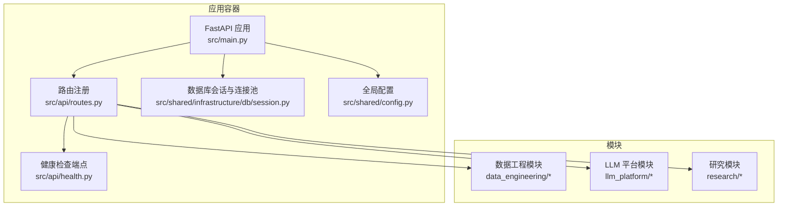
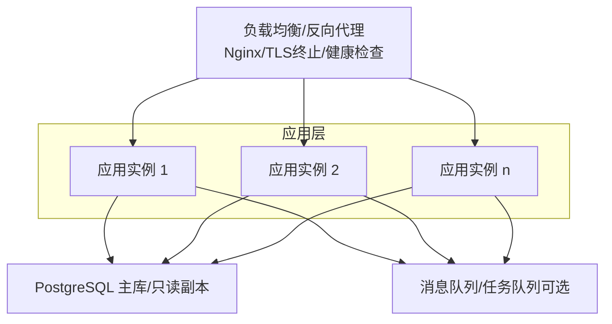
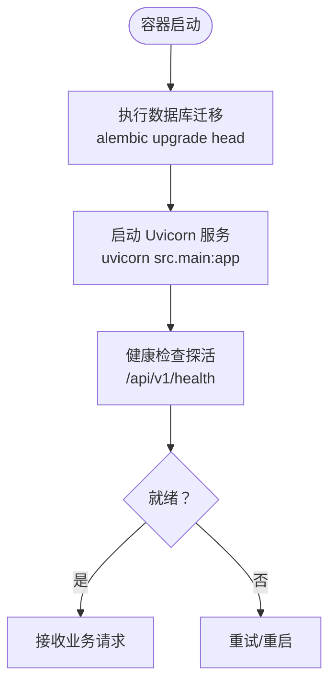
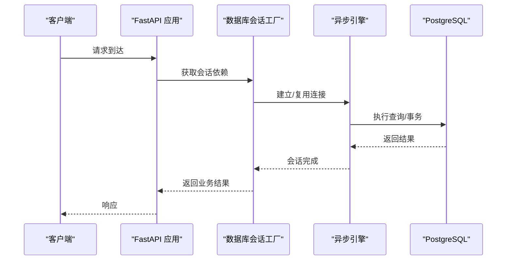
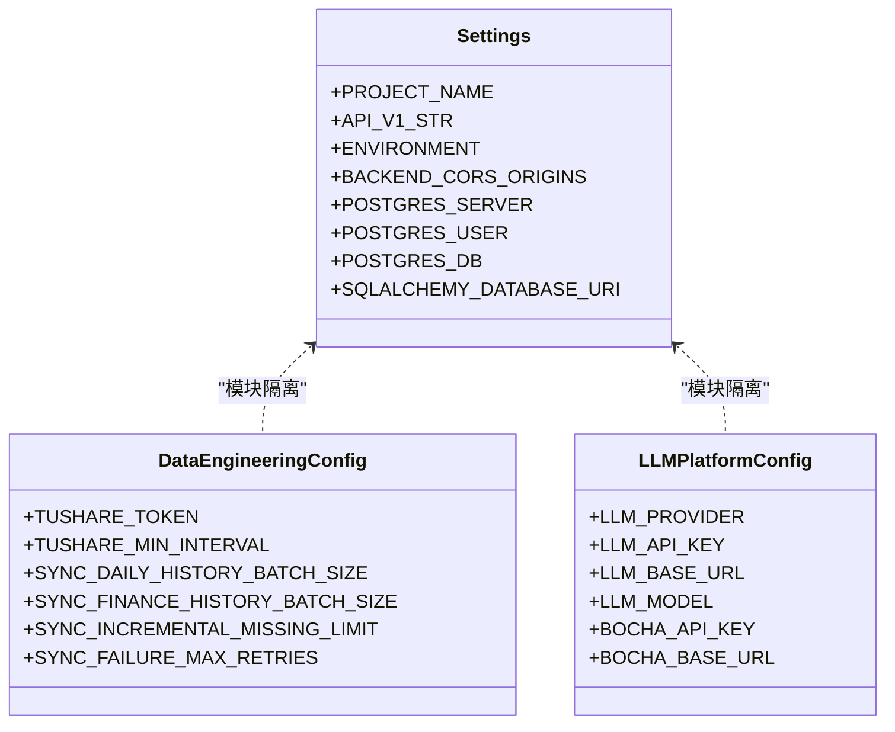
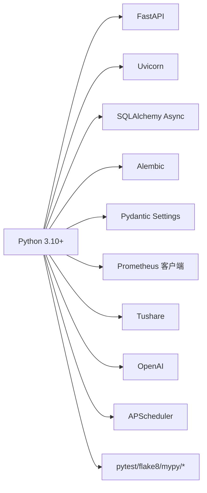

# 生产环境部署

<cite>
**本文引用的文件**
- [README.md](file://README.md)
- [Dockerfile](file://Dockerfile)
- [docker-compose.yml](file://docker-compose.yml)
- [.env.example](file://.env.example)
- [requirements.txt](file://requirements.txt)
- [src/main.py](file://src/main.py)
- [src/shared/config.py](file://src/shared/config.py)
- [src/api/routes.py](file://src/api/routes.py)
- [src/api/health.py](file://src/api/health.py)
- [src/shared/infrastructure/db/session.py](file://src/shared/infrastructure/db/session.py)
- [src/modules/data_engineering/infrastructure/config.py](file://src/modules/data_engineering/infrastructure/config.py)
- [src/modules/llm_platform/infrastructure/config.py](file://src/modules/llm_platform/infrastructure/config.py)
- [Makefile](file://Makefile)
- [environment.yml](file://environment.yml)
- [openspec/config.yaml](file://openspec/config.yaml)
</cite>

## 目录
1. [简介](#简介)
2. [项目结构](#项目结构)
3. [核心组件](#核心组件)
4. [架构总览](#架构总览)
5. [详细组件分析](#详细组件分析)
6. [依赖关系分析](#依赖关系分析)
7. [性能考虑](#性能考虑)
8. [故障排查指南](#故障排查指南)
9. [结论](#结论)
10. [附录](#附录)

## 简介
本指南面向“股票助手”项目在生产环境的落地部署，覆盖硬件与软件要求、环境变量与敏感信息管理、部署策略（蓝绿/滚动/零停机）、负载均衡与高可用、备份与灾备、安全加固以及性能调优与容量规划等主题。文档以仓库现有代码与配置为基础，结合实际可落地的工程实践，帮助团队在生产环境中稳定、安全、可扩展地运行系统。

## 项目结构
项目采用多模块领域驱动设计（DDD），核心由以下层次构成：
- 表现层（Presentation）：FastAPI 路由与控制器
- 应用层（Application）：用例与服务编排
- 领域层（Domain）：实体、值对象与业务规则
- 基础设施层（Infrastructure）：数据库、外部服务适配器、配置与持久化
- 共享内核（Shared）：通用配置、日志、调度器等

图表来源
- [src/main.py](file://src/main.py#L1-L75)
- [src/api/routes.py](file://src/api/routes.py#L1-L13)
- [src/api/health.py](file://src/api/health.py#L1-L24)
- [src/shared/infrastructure/db/session.py](file://src/shared/infrastructure/db/session.py#L1-L64)
- [src/shared/config.py](file://src/shared/config.py#L1-L68)

章节来源
- [README.md](file://README.md#L1-L42)
- [openspec/config.yaml](file://openspec/config.yaml#L1-L27)

## 核心组件
- 应用入口与生命周期：应用启动时初始化调度器与 LLM 注册表，并在关闭时优雅退出。
- 路由与模块：统一挂载健康检查、数据工程、LLM 平台与研究模块的路由。
- 数据库：基于 SQLAlchemy AsyncEngine 的异步连接池，启用 pre_ping 与依赖注入会话。
- 配置体系：全局配置与模块级配置分离，均通过 Pydantic Settings 从 .env 加载。

章节来源
- [src/main.py](file://src/main.py#L14-L48)
- [src/api/routes.py](file://src/api/routes.py#L1-L13)
- [src/shared/infrastructure/db/session.py](file://src/shared/infrastructure/db/session.py#L8-L22)
- [src/shared/config.py](file://src/shared/config.py#L8-L64)
- [src/modules/data_engineering/infrastructure/config.py](file://src/modules/data_engineering/infrastructure/config.py#L10-L27)
- [src/modules/llm_platform/infrastructure/config.py](file://src/modules/llm_platform/infrastructure/config.py#L10-L26)

## 架构总览
下图展示生产环境典型拓扑：反向代理/负载均衡前置，后端由多个应用实例组成，共享数据库与缓存/消息队列（如需）。健康检查与自动扩缩容策略由平台能力支撑。

说明
- 负载均衡负责流量分发与健康检查探测
- 应用实例通过共享数据库提供数据一致性
- 可选引入消息队列承载异步任务与削峰

## 详细组件分析

### 应用容器与运行时
- 基于多阶段 Docker 构建，运行时镜像精简，包含运行所需系统库与 Uvicorn。
- 健康检查通过 HTTP 探针访问 /api/v1/health，容器层面也配置了 HEALTHCHECK。
- 运行用户为非 root 用户，提升安全性。
- 默认监听 0.0.0.0:8000，可通过反向代理暴露对外端口。

图表来源
- [Dockerfile](file://Dockerfile#L43-L51)
- [docker-compose.yml](file://docker-compose.yml#L17-L28)
- [src/api/health.py](file://src/api/health.py#L10-L23)

章节来源
- [Dockerfile](file://Dockerfile#L1-L52)
- [docker-compose.yml](file://docker-compose.yml#L1-L55)
- [src/api/health.py](file://src/api/health.py#L1-L24)

### 数据库与连接池
- 使用异步 SQLAlchemy 引擎，启用 pre_ping 以自动剔除失效连接。
- 依赖注入会话工厂，异常时按客户端错误/系统错误区分处理，必要时显式回滚。
- 建议生产中配置连接池大小、超时与只读副本，满足高并发与读写分离需求。

图表来源
- [src/shared/infrastructure/db/session.py](file://src/shared/infrastructure/db/session.py#L24-L63)

章节来源
- [src/shared/infrastructure/db/session.py](file://src/shared/infrastructure/db/session.py#L1-L64)

### 配置与环境变量
- 全局配置：项目名称、API 前缀、运行环境、CORS、数据库连接串等。
- 模块配置：
  - 数据工程模块：Tushare Token、最小请求间隔、批量大小、增量同步限制、失败重试次数等。
  - LLM 平台模块：模型供应商、API Key、Base URL、模型名、博查搜索相关参数。
- 环境变量示例：包含数据库、Tushare、Bocha 等关键参数。

图表来源
- [src/shared/config.py](file://src/shared/config.py#L8-L64)
- [src/modules/data_engineering/infrastructure/config.py](file://src/modules/data_engineering/infrastructure/config.py#L10-L27)
- [src/modules/llm_platform/infrastructure/config.py](file://src/modules/llm_platform/infrastructure/config.py#L10-L26)

章节来源
- [src/shared/config.py](file://src/shared/config.py#L1-L68)
- [.env.example](file://.env.example#L1-L17)
- [src/modules/data_engineering/infrastructure/config.py](file://src/modules/data_engineering/infrastructure/config.py#L1-L28)
- [src/modules/llm_platform/infrastructure/config.py](file://src/modules/llm_platform/infrastructure/config.py#L1-L27)

### 路由与健康检查
- 统一路由注册，包含健康检查、数据工程、LLM 平台与研究模块。
- 健康检查端点验证应用与数据库连通性，返回状态与数据库连接信息。

章节来源
- [src/api/routes.py](file://src/api/routes.py#L1-L13)
- [src/api/health.py](file://src/api/health.py#L1-L24)

## 依赖关系分析
- 应用依赖：FastAPI、Uvicorn、SQLAlchemy Async、Alembic、Pydantic Settings、Prometheus 客户端、Tushare、OpenAI、APScheduler 等。
- 开发工具链：pytest、flake8、mypy、black、isort 等。
- Conda 环境与依赖导出：提供稳定的开发与部署环境。

图表来源
- [requirements.txt](file://requirements.txt#L1-L16)
- [environment.yml](file://environment.yml#L1-L29)

章节来源
- [requirements.txt](file://requirements.txt#L1-L16)
- [environment.yml](file://environment.yml#L1-L29)
- [Makefile](file://Makefile#L1-L27)

## 性能考虑
- 连接池与预检：启用 pool_pre_ping，降低连接失效导致的错误；合理设置连接池大小与超时。
- 异步化：使用异步 ORM 与 HTTP 客户端，减少阻塞，提升吞吐。
- 任务调度：APScheduler 用于周期性任务，建议将耗时任务放入消息队列异步执行。
- 监控与指标：集成 Prometheus 客户端，暴露应用指标，结合告警系统。
- 日志：使用 structlog 与 python-json-logger，输出结构化日志，便于集中收集与检索。
- 缓存：对热点查询引入缓存层（如 Redis），降低数据库压力。

## 故障排查指南
- 健康检查失败
  - 现象：负载均衡/容器编排持续探测失败
  - 排查要点：确认 /api/v1/health 可访问；检查数据库连接串与凭据；查看应用日志
- 数据库连接异常
  - 现象：健康检查返回数据库断开
  - 排查要点：确认数据库实例可达；检查连接池配置；验证凭据与网络策略
- 启动阶段迁移失败
  - 现象：容器启动后立即退出或反复重启
  - 排查要点：查看迁移日志；确认 Alembic 版本与数据库一致；检查权限
- LLM/外部 API 调用失败
  - 现象：研究模块接口报错
  - 排查要点：检查 LLM Provider、API Key、Base URL；确认网络可达与限流策略

章节来源
- [src/api/health.py](file://src/api/health.py#L10-L23)
- [src/shared/infrastructure/db/session.py](file://src/shared/infrastructure/db/session.py#L36-L63)
- [docker-compose.yml](file://docker-compose.yml#L17-L17)

## 结论
本指南基于仓库现有代码与配置，给出了生产环境部署的完整路径：从硬件与软件要求、环境变量与敏感信息管理，到部署策略、高可用与负载均衡、备份与灾备、安全加固与性能调优。建议在正式上线前完成安全基线检查、压测与演练，确保系统在高并发与异常场景下的稳定性与可靠性。

## 附录

### A. 硬件与软件要求
- CPU：建议每实例 2 核起步，峰值可弹性至 4 核以上
- 内存：建议每实例 2–4 GB，视数据量与并发而定
- 存储：SSD 本地盘或云盘；数据库持久化卷建议开启快照与备份
- 网络：开放 8000 端口（经由反向代理）；数据库端口仅内网可达
- 操作系统：Linux（推荐 Ubuntu/CentOS）
- 运行时：Python 3.10、PostgreSQL 15、Docker 20+

章节来源
- [Dockerfile](file://Dockerfile#L1-L52)
- [docker-compose.yml](file://docker-compose.yml#L30-L47)

### B. 环境变量与敏感信息管理
- 必填项（来自示例）：数据库主机、用户、密码、库名、端口；Tushare Token；Bocha API Key 与 Base URL
- 管理建议：
  - 使用密钥管理服务（如 KMS/Vault）存储敏感变量
  - 将 .env 与源码隔离，不在镜像中携带明文
  - 通过编排平台（Kubernetes/Helm/Compose）注入环境变量
  - 对外暴露的变量需最小化，避免泄露

章节来源
- [.env.example](file://.env.example#L1-L17)
- [src/shared/config.py](file://src/shared/config.py#L60-L64)
- [src/modules/data_engineering/infrastructure/config.py](file://src/modules/data_engineering/infrastructure/config.py#L21-L24)
- [src/modules/llm_platform/infrastructure/config.py](file://src/modules/llm_platform/infrastructure/config.py#L20-L23)

### C. 部署策略（蓝绿/滚动/零停机）
- 蓝绿部署：准备两套完全相同的环境（蓝/绿），切换流量后回收旧版本
- 滚动更新：逐批替换实例，保持服务可用
- 零停机：配合健康检查与就绪探针，确保新实例完全就绪后再切流量
- 建议：
  - 使用编排平台（如 Kubernetes）的 Deployment/StatefulSet
  - 配置最小不可用/最大额外副本，保证升级过程的稳定性
  - 升级前进行灰度放量与监控观测

### D. 负载均衡与高可用
- 反向代理：Nginx/Traefik/Cloud LB，终止 TLS，转发至后端实例
- 健康检查：定期探测 /api/v1/health，失败自动摘除
- 高可用：多可用区部署，数据库主从/只读副本，应用多副本
- 网络策略：仅允许必要的入站/出站访问，限制数据库端口暴露范围

章节来源
- [src/api/health.py](file://src/api/health.py#L10-L23)
- [docker-compose.yml](file://docker-compose.yml#L23-L28)

### E. 数据备份与灾备
- 数据库备份：定时逻辑备份（pg_dump）+ 增量备份；开启 WAL 归档
- 恢复流程：验证备份完整性；在隔离环境演练恢复；逐步切换流量
- 灾难恢复：跨可用区/跨区域复制；自动化故障转移与通知

### F. 安全加固
- 防火墙：仅开放反向代理端口，数据库仅内网访问
- SSL/TLS：反向代理终止 HTTPS，内部服务间通信加密
- 访问控制：IP 白名单、API Key、鉴权与速率限制
- 镜像与运行时：非 root 用户运行；最小化镜像；定期扫描漏洞

章节来源
- [Dockerfile](file://Dockerfile#L47-L48)
- [src/main.py](file://src/main.py#L51-L59)

### G. 性能调优与容量规划
- 连接池：根据 QPS 与 RT 目标估算连接数上限，开启 pre_ping
- 异步化：优先使用异步 I/O；外部调用使用连接池与超时控制
- 缓存：热点数据与报表结果缓存；缓存失效策略与一致性
- 监控：Prometheus + Grafana；关键指标（P95/P99、错误率、连接池利用率）
- 容量规划：压测确定单实例承载能力，结合 SLA 设定副本数与扩缩容阈值