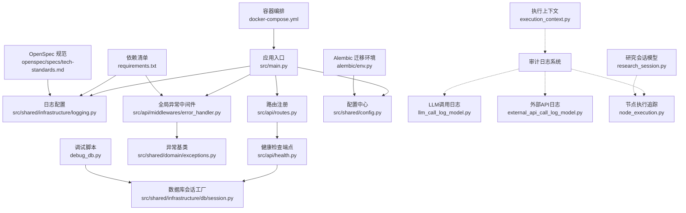
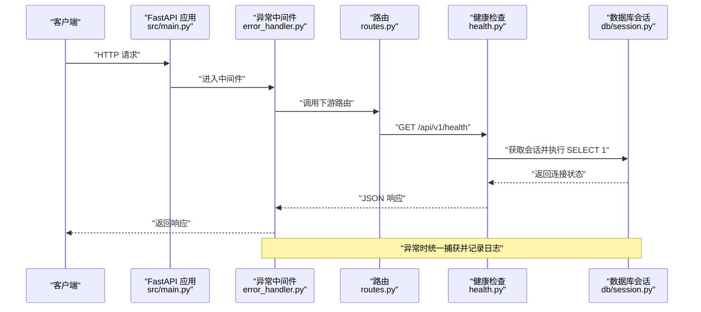
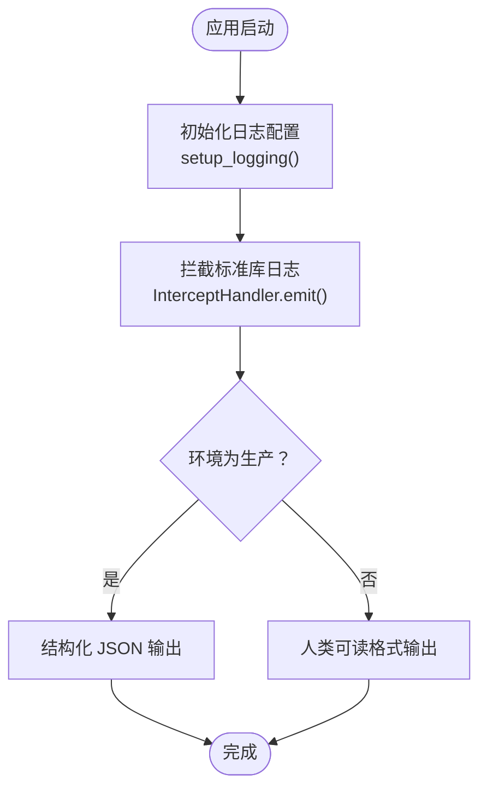
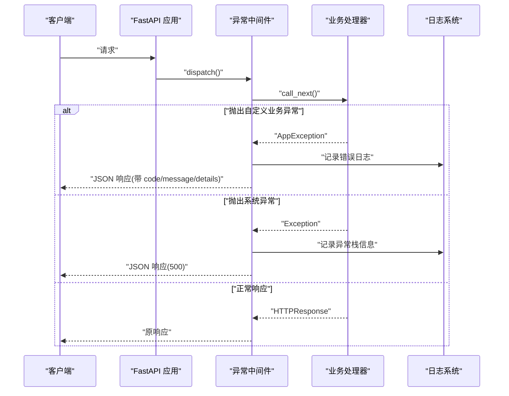
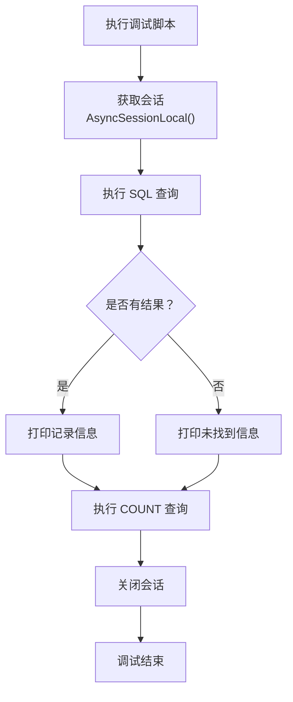
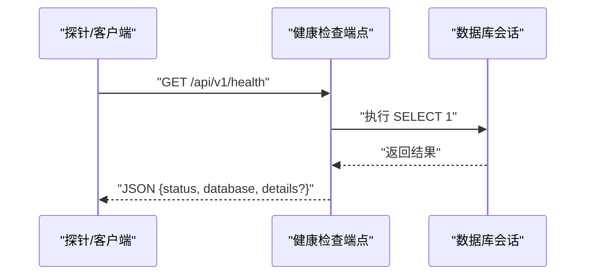
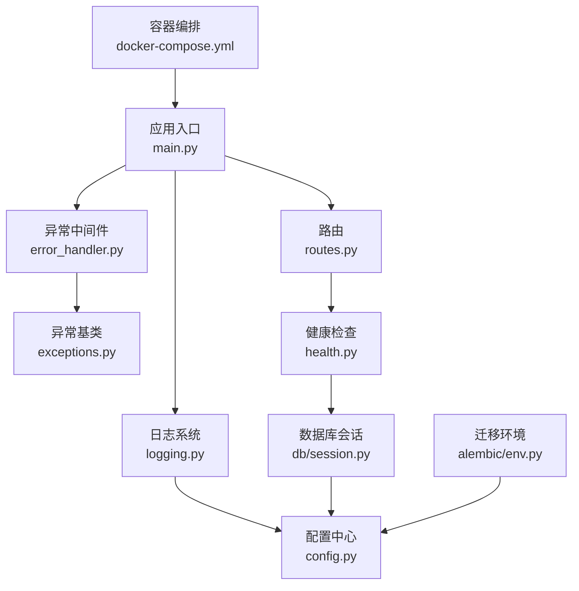

# 监控日志

<cite>
**本文引用的文件**
- [src/main.py](file://src/main.py)
- [src/shared/infrastructure/logging.py](file://src/shared/infrastructure/logging.py)
- [src/api/middlewares/error_handler.py](file://src/api/middlewares/error_handler.py)
- [src/shared/infrastructure/db/session.py](file://src/shared/infrastructure/db/session.py)
- [src/shared/config.py](file://src/shared/config.py)
- [src/api/health.py](file://src/api/health.py)
- [src/api/routes.py](file://src/api/routes.py)
- [src/shared/domain/exceptions.py](file://src/shared/domain/exceptions.py)
- [debug_db.py](file://debug_db.py)
- [docker-compose.yml](file://docker-compose.yml)
- [requirements.txt](file://requirements.txt)
- [openspec/config.yaml](file://openspec/config.yaml)
- [openspec/specs/tech-standards.md](file://openspec/specs/tech-standards.md)
- [alembic/env.py](file://alembic/env.py)
- [src/shared/infrastructure/execution_context.py](file://src/shared/infrastructure/execution_context.py)
- [src/shared/infrastructure/persistence/external_api_call_log_model.py](file://src/shared/infrastructure/persistence/external_api_call_log_model.py)
- [src/modules/llm_platform/infrastructure/persistence/models/llm_call_log_model.py](file://src/modules/llm_platform/infrastructure/persistence/models/llm_call_log_model.py)
- [src/modules/coordinator/domain/model/node_execution.py](file://src/modules/coordinator/domain/model/node_execution.py)
- [src/modules/coordinator/infrastructure/persistence/node_execution_model.py](file://src/modules/coordinator/infrastructure/persistence/node_execution_model.py)
- [src/modules/coordinator/domain/model/research_session.py](file://src/modules/coordinator/domain/model/research_session.py)
- [src/modules/coordinator/infrastructure/persistence/research_session_model.py](file://src/modules/coordinator/infrastructure/persistence/research_session_model.py)
- [src/shared/application/queries/external_api_call_log_query_service.py](file://src/shared/application/queries/external_api_call_log_query_service.py)
- [src/modules/llm_platform/application/queries/llm_call_log_query_service.py](file://src/modules/llm_platform/application/queries/llm_call_log_query_service.py)
- [tests/shared/infrastructure/test_execution_context.py](file://tests/shared/infrastructure/test_execution_context.py)
- [tests/llm_platform/application/services/test_llm_service_audit.py](file://tests/llm_platform/application/services/test_llm_service_audit.py)
- [tests/llm_platform/application/services/test_web_search_service_audit.py](file://tests/llm_platform/application/services/test_web_search_service_audit.py)
- [alembic/versions/c0ff00000003_execution_tracking_and_reports.py](file://alembic/versions/c0ff00000003_execution_tracking_and_reports.py)
- [docs/排查调用问题.sql](file://docs/排查调用问题.sql)
- [openspec/changes/archive/2026-02-13-execution-tracking-and-reports/design.md](file://openspec/changes/archive/2026-02-13-execution-tracking-and-reports/design.md)
- [openspec/changes/archive/2026-02-13-execution-tracking-and-reports/proposal.md](file://openspec/changes/archive/2026-02-13-execution-tracking-and-reports/proposal.md)
</cite>

## 更新摘要
**所做更改**
- 更新执行跟踪和报告功能状态：该功能已被移至归档目录，不再处于活跃开发状态
- 移除执行上下文传播、LLM调用审计、外部API调用日志、节点执行追踪等章节
- 移除审计日志查询服务相关章节
- 更新架构总览图，移除审计功能相关组件
- 更新故障排查指南，移除审计日志排查方法
- 更新附录，移除审计功能相关的监控建议

## 目录
1. [简介](#简介)
2. [项目结构](#项目结构)
3. [核心组件](#核心组件)
4. [架构总览](#架构总览)
5. [详细组件分析](#详细组件分析)
6. [依赖关系分析](#依赖关系分析)
7. [性能考量](#性能考量)
8. [故障排查指南](#故障排查指南)
9. [结论](#结论)
10. [附录](#附录)

## 简介
本文件面向"股票助手"项目的监控与日志管理，系统性说明应用级日志配置与日志级别管理、结构化日志输出与日志轮转策略、错误处理中间件的配置与异常捕获机制、数据库连接调试工具与连接池监控、应用性能监控最佳实践、日志聚合与分析方案（含 ELK Stack 集成与可视化）、以及监控仪表板与实时告警配置指南。

**重要更新**：执行跟踪和报告功能已被移至归档目录，不再处于活跃开发状态。该功能包含执行上下文传播、LLM调用审计、外部API调用日志、节点执行追踪等组件，目前仅作为历史参考存在于OpenSpec归档中。

## 项目结构
围绕监控与日志的关键文件分布如下：
- 应用入口与启动/关闭事件：src/main.py
- 日志系统接入与格式化：src/shared/infrastructure/logging.py
- 全局异常处理中间件：src/api/middlewares/error_handler.py
- 数据库会话与异常回滚：src/shared/infrastructure/db/session.py
- 健康检查端点：src/api/health.py
- 配置中心（环境与数据库连接）：src/shared/config.py
- 异常基类与业务异常：src/shared/domain/exceptions.py
- 调试脚本（数据库查询验证）：debug_db.py
- 容器编排与健康检查：docker-compose.yml
- 依赖清单（含日志与监控相关库）：requirements.txt
- 项目背景与技术规范：openspec/config.yaml、openspec/specs/tech-standards.md
- Alembic 迁移环境（数据库迁移）：alembic/env.py

**图表来源**
- [src/main.py](file://src/main.py#L1-L75)
- [src/shared/infrastructure/logging.py](file://src/shared/infrastructure/logging.py#L1-L74)
- [src/api/middlewares/error_handler.py](file://src/api/middlewares/error_handler.py#L1-L46)
- [src/api/routes.py](file://src/api/routes.py#L1-L13)
- [src/api/health.py](file://src/api/health.py#L1-L24)
- [src/shared/infrastructure/db/session.py](file://src/shared/infrastructure/db/session.py#L1-L64)
- [src/shared/config.py](file://src/shared/config.py#L1-L68)
- [src/shared/domain/exceptions.py](file://src/shared/domain/exceptions.py#L1-L67)
- [debug_db.py](file://debug_db.py#L1-L21)
- [docker-compose.yml](file://docker-compose.yml#L1-L55)
- [requirements.txt](file://requirements.txt#L1-L16)
- [openspec/specs/tech-standards.md](file://openspec/specs/tech-standards.md#L101-L111)
- [alembic/env.py](file://alembic/env.py#L1-L94)

## 核心组件
- 日志系统：统一接管标准库 logging，使用 Loguru 输出，按环境切换结构化 JSON 或人类可读格式。
- 全局异常中间件：捕获自定义业务异常与未处理系统异常，统一返回 JSON 错误响应并记录详细上下文。
- 数据库会话：异步 SQLAlchemy 会话工厂，异常时区分客户端错误与系统异常，自动回滚并记录日志。
- 健康检查：数据库连通性检查端点，保障服务可用性。
- 配置中心：集中管理运行环境、CORS、数据库连接串等。
- 调试工具：独立脚本用于验证数据库查询与连接状态。
- 容器编排：通过 compose 启动应用与数据库，内置健康检查探针。
- 技术规范：明确日志级别与内容要求，指导日志实践。

## 架构总览
下图展示监控与日志在系统中的交互路径：应用启动时初始化日志与中间件，请求进入时经中间件统一异常处理，业务路由调用数据库会话，健康检查端点验证数据库连通性。

**图表来源**
- [src/main.py](file://src/main.py#L14-L65)
- [src/api/middlewares/error_handler.py](file://src/api/middlewares/error_handler.py#L13-L46)
- [src/api/routes.py](file://src/api/routes.py#L8-L13)
- [src/api/health.py](file://src/api/health.py#L10-L24)
- [src/shared/infrastructure/db/session.py](file://src/shared/infrastructure/db/session.py#L24-L64)

## 详细组件分析

### 日志系统与日志级别管理
- 统一接管：拦截标准库 logging，转发至 Loguru，确保全链路日志一致性。
- 环境差异化：
  - 开发/本地：人类可读格式，包含时间、级别、线程、模块与消息。
  - 生产：结构化 JSON 输出，便于日志收集系统解析。
- 日志级别与内容：
  - DEBUG：用于问题排查的详细信息。
  - INFO：关键业务流程节点。
  - WARNING：可疑但未必错误的情况。
  - ERROR/CRITICAL：实际错误或不可恢复问题。
- 上下文信息：入口/出口日志包含上下文（如模块名、关键参数），错误日志提供足够信息用于追踪根因。

**图表来源**
- [src/shared/infrastructure/logging.py](file://src/shared/infrastructure/logging.py#L31-L74)

**章节来源**
- [src/shared/infrastructure/logging.py](file://src/shared/infrastructure/logging.py#L9-L74)
- [openspec/specs/tech-standards.md](file://openspec/specs/tech-standards.md#L101-L111)

### 错误处理中间件与异常捕获机制
- 全局捕获：捕获自定义业务异常与未处理系统异常。
- 自定义异常：统一返回 JSON 响应，包含 success、code、message、details 等字段。
- 未处理异常：记录详细栈信息（方法、路径、客户端 IP 等），返回通用错误消息。
- 与日志联动：中间件记录异常上下文，便于定位问题。

**图表来源**
- [src/api/middlewares/error_handler.py](file://src/api/middlewares/error_handler.py#L13-L46)
- [src/shared/domain/exceptions.py](file://src/shared/domain/exceptions.py#L4-L22)

**章节来源**
- [src/api/middlewares/error_handler.py](file://src/api/middlewares/error_handler.py#L8-L46)
- [src/shared/domain/exceptions.py](file://src/shared/domain/exceptions.py#L4-L67)

### 数据库连接调试工具与连接池监控
- 连接池特性：
  - 异步引擎与会话工厂，开启 pool_pre_ping 以预检连接有效性。
  - 会话生命周期内异常处理：区分客户端错误与系统异常，系统异常自动回滚并记录日志。
- 调试脚本：
  - 独立脚本通过 AsyncSessionLocal 直接执行查询，验证数据库连通性与表结构。
  - 示例：查询某只股票是否存在、统计记录总数。
- 迁移环境：
  - Alembic 在线/离线迁移均从配置中心读取数据库连接串，保证迁移与运行时一致。

**图表来源**
- [debug_db.py](file://debug_db.py#L5-L21)
- [src/shared/infrastructure/db/session.py](file://src/shared/infrastructure/db/session.py#L24-L64)

**章节来源**
- [src/shared/infrastructure/db/session.py](file://src/shared/infrastructure/db/session.py#L8-L22)
- [src/shared/infrastructure/db/session.py](file://src/shared/infrastructure/db/session.py#L36-L64)
- [debug_db.py](file://debug_db.py#L5-L21)
- [alembic/env.py](file://alembic/env.py#L34-L36)

### 健康检查与可用性监控
- 健康端点：/api/v1/health，依赖数据库会话执行简单查询，返回状态与数据库连接信息。
- 异常处理：健康检查内部异常被捕获并返回错误详情，保证端点稳定。
- 容器健康检查：Compose 中配置应用与数据库的健康检查探针，自动重启与恢复。

**图表来源**
- [src/api/health.py](file://src/api/health.py#L10-L24)
- [docker-compose.yml](file://docker-compose.yml#L23-L28)

**章节来源**
- [src/api/health.py](file://src/api/health.py#L10-L24)
- [docker-compose.yml](file://docker-compose.yml#L23-L28)

### 配置与环境管理
- 运行环境：ENVIRONMENT 控制日志输出格式（开发/生产）。
- 数据库连接：SQLALCHEMY_DATABASE_URI 由配置中心组装，支持异步 PostgreSQL。
- CORS：动态装配允许的源列表，支持字符串或列表格式。

**章节来源**
- [src/shared/config.py](file://src/shared/config.py#L16-L17)
- [src/shared/config.py](file://src/shared/config.py#L42-L58)
- [src/shared/config.py](file://src/shared/config.py#L22-L32)

## 依赖关系分析
- 日志系统依赖配置中心提供的环境变量，决定输出格式。
- 异常中间件依赖异常基类，统一业务异常与系统异常的处理策略。
- 数据库会话依赖配置中心提供的连接串，迁移环境同样依赖该配置。
- 健康检查依赖数据库会话，形成闭环的可用性监控。
- 容器编排依赖健康检查端点，实现自动发现与恢复。

**图表来源**
- [src/shared/infrastructure/logging.py](file://src/shared/infrastructure/logging.py#L6-L7)
- [src/shared/config.py](file://src/shared/config.py#L6-L7)
- [src/api/middlewares/error_handler.py](file://src/api/middlewares/error_handler.py#L6)
- [src/shared/domain/exceptions.py](file://src/shared/domain/exceptions.py#L4-L22)
- [src/shared/infrastructure/db/session.py](file://src/shared/infrastructure/db/session.py#L8-L13)
- [alembic/env.py](file://alembic/env.py#L9-L10)
- [src/api/health.py](file://src/api/health.py#L2-L5)
- [docker-compose.yml](file://docker-compose.yml#L17)
- [src/main.py](file://src/main.py#L1-L8)
- [src/api/routes.py](file://src/api/routes.py#L1-L13)

**章节来源**
- [src/shared/infrastructure/logging.py](file://src/shared/infrastructure/logging.py#L6-L7)
- [src/shared/config.py](file://src/shared/config.py#L6-L7)
- [src/api/middlewares/error_handler.py](file://src/api/middlewares/error_handler.py#L6)
- [src/shared/domain/exceptions.py](file://src/shared/domain/exceptions.py#L4-L22)
- [src/shared/infrastructure/db/session.py](file://src/shared/infrastructure/db/session.py#L8-L13)
- [alembic/env.py](file://alembic/env.py#L9-L10)
- [src/api/health.py](file://src/api/health.py#L2-L5)
- [docker-compose.yml](file://docker-compose.yml#L17)
- [src/main.py](file://src/main.py#L1-L8)
- [src/api/routes.py](file://src/api/routes.py#L1-L13)

## 性能考量
- 日志开销控制：
  - 生产环境采用结构化 JSON 输出，减少格式化成本。
  - 合理使用日志级别，避免在高频路径上产生大量 DEBUG/INFO。
- 数据库连接池：
  - pool_pre_ping 提升连接有效性，降低超时与重试成本。
  - 会话异常自动回滚，避免脏事务影响后续请求。
- 健康检查：
  - 简单查询验证数据库连通性，避免复杂操作带来的延迟。
- 容器健康检查：
  - 合理设置间隔与超时，平衡探测频率与系统负载。

## 故障排查指南
- 日志定位：
  - 使用统一的日志格式与级别，结合模块名、函数名、行号快速定位问题。
  - 生产环境查看 JSON 结构化日志，便于自动化检索与聚合。
- 异常排查：
  - 自定义异常：关注 code、message、details 字段，结合业务上下文定位。
  - 未处理异常：查看异常栈信息与请求上下文（方法、路径、客户端 IP）。
- 数据库问题：
  - 使用调试脚本验证连接与查询，确认表结构与数据存在性。
  - 检查连接池状态与会话生命周期，避免长时间占用导致阻塞。
- 健康检查：
  - 若健康端点返回错误，优先检查数据库连接与权限。
  - 容器层面确认健康检查探针配置与网络连通性。

**章节来源**
- [src/shared/infrastructure/logging.py](file://src/shared/infrastructure/logging.py#L31-L74)
- [src/api/middlewares/error_handler.py](file://src/api/middlewares/error_handler.py#L17-L45)
- [debug_db.py](file://debug_db.py#L5-L21)
- [src/api/health.py](file://src/api/health.py#L22-L23)
- [docker-compose.yml](file://docker-compose.yml#L23-L28)

## 结论
本项目已具备完善的日志体系与异常处理机制，配合健康检查与容器编排，能够满足日常运维与问题排查需求。执行跟踪和报告功能已被移至归档目录，不再处于活跃开发状态。建议在现有基础上继续完善基础监控能力，并根据实际需求考虑是否重新激活审计功能。

## 附录

### 日志轮转策略建议
- 使用系统级日志轮转工具（如 logrotate/rsyslog）对 stdout JSON 进行轮转与压缩。
- 在容器环境中结合日志驱动（如 json-file）与外部日志代理（如 Fluent Bit/Filebeat）实现集中采集与归档。
- 保留关键指标（如错误率、P95/P99 延迟）以便审计与容量规划。

### ELK Stack 集成与日志可视化
- 数据采集：通过日志代理将结构化 JSON 日志推送至 Elasticsearch。
- 索引与映射：为 JSON 字段建立索引模板，确保可搜索与聚合。
- 可视化：在 Kibana 中创建仪表板，展示错误趋势、响应时间分布、数据库连接状态等。
- 告警：基于日志阈值与异常模式设置告警规则，联动通知渠道。

### 监控仪表板与实时告警配置
- 仪表板建议指标：
  - 请求量与错误率（按端点/异常类型细分）
  - 数据库连接池使用率与等待时间
  - 健康检查成功率与延迟
  - 关键业务流程耗时（如数据同步任务）
- 告警策略：
  - 错误率突增、延迟 P95 超阈、健康检查失败持续告警
  - 分级告警（警告/严重），避免噪声干扰

### 与项目规范的契合
- 日志级别与内容规范来自技术规范文档，确保团队一致的实践标准。
- OpenSpec 项目背景明确了技术栈与模块边界，有助于在监控与日志实践中保持清晰的职责划分。

**章节来源**
- [openspec/specs/tech-standards.md](file://openspec/specs/tech-standards.md#L101-L111)
- [openspec/config.yaml](file://openspec/config.yaml#L6-L17)