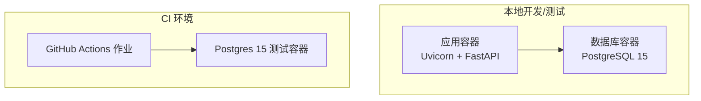
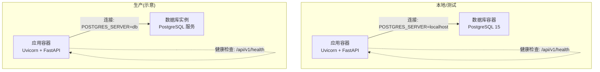
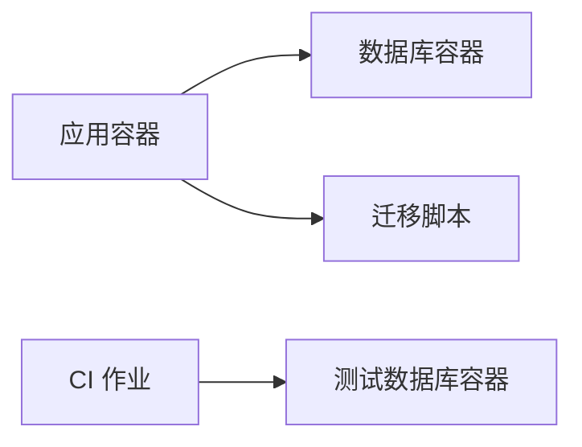

# 部署运维

<cite>
**本文引用的文件**
- [Dockerfile](file://Dockerfile)
- [docker-compose.yml](file://docker-compose.yml)
- [.github/workflows/ci.yml](file://.github/workflows/ci.yml)
- [.env](file://.env)
- [.env.example](file://.env.example)
- [Makefile](file://Makefile)
- [requirements.txt](file://requirements.txt)
- [pyproject.toml](file://pyproject.toml)
- [src/shared/config.py](file://src/shared/config.py)
- [alembic.ini](file://alembic.ini)
- [alembic/env.py](file://alembic/env.py)
- [src/main.py](file://src/main.py)
- [scripts/test_chat_api.py](file://scripts/test_chat_api.py)
</cite>

## 目录
1. [简介](#简介)
2. [项目结构](#项目结构)
3. [核心组件](#核心组件)
4. [架构总览](#架构总览)
5. [详细组件分析](#详细组件分析)
6. [依赖关系分析](#依赖关系分析)
7. [性能考量](#性能考量)
8. [故障排查指南](#故障排查指南)
9. [结论](#结论)
10. [附录](#附录)

## 简介
本文件面向股票助手项目的部署与运维团队，提供从本地开发到生产环境的全栈部署指南。内容覆盖容器化镜像构建、Compose 编排、CI/CD 流水线、数据库迁移、健康检查、日志与监控、故障排查、备份恢复与滚动更新等运维主题。文档严格基于仓库现有配置与实现进行说明，确保可操作性与一致性。

## 项目结构
- 应用采用 FastAPI + Uvicorn 作为 Web 服务，PostgreSQL 作为持久化存储，Alembic 管理数据库迁移。
- 开发与测试环境通过 Docker Compose 编排，包含应用与数据库两个服务，并在应用启动时自动执行数据库迁移。
- CI 通过 GitHub Actions 在推送与拉取请求时执行代码检查与测试，并在临时 Postgres 容器中运行集成测试。
- 配置通过 Pydantic Settings 从 .env 加载，支持本地与容器内不同后端主机名映射。

图表来源
- [docker-compose.yml](file://docker-compose.yml#L1-L55)
- [.github/workflows/ci.yml](file://.github/workflows/ci.yml#L1-L60)

章节来源
- [docker-compose.yml](file://docker-compose.yml#L1-L55)
- [.github/workflows/ci.yml](file://.github/workflows/ci.yml#L1-L60)

## 核心组件
- 应用服务：基于 Uvicorn 的 FastAPI 应用，默认监听 0.0.0.0:8000，提供健康检查端点与业务接口。
- 数据库服务：PostgreSQL 15，使用持久化卷存储数据，健康检查基于 pg_isready。
- 镜像与运行：多阶段构建，运行时仅包含最小依赖，启用健康检查与非缓冲日志，使用非 root 用户运行。
- 配置系统：Pydantic Settings 从 .env 加载，支持动态组装数据库连接串与 CORS 配置。
- 迁移系统：Alembic 在应用启动前升级数据库至最新版本，支持离线与在线两种模式。

章节来源
- [Dockerfile](file://Dockerfile#L1-L52)
- [docker-compose.yml](file://docker-compose.yml#L1-L55)
- [src/shared/config.py](file://src/shared/config.py#L1-L69)
- [alembic/env.py](file://alembic/env.py#L1-L94)

## 架构总览
下图展示本地/测试与生产环境的关键差异：本地使用 Compose 编排，生产建议使用编排平台或云托管；数据库连接在本地与生产分别指向 localhost 与 db 主机名；健康检查与迁移策略一致。

图表来源
- [docker-compose.yml](file://docker-compose.yml#L1-L55)
- [.env](file://.env#L1-L17)
- [.env.example](file://.env.example#L1-L17)
- [src/main.py](file://src/main.py#L67-L75)

## 详细组件分析

### 容器镜像与运行时
- 多阶段构建：第一阶段安装系统与 Python 依赖，第二阶段仅复制虚拟环境与应用代码，减少体积与攻击面。
- 运行时依赖：安装 libpq-dev(curl) 以支持 asyncpg 与健康检查命令，设置 PYTHONPATH 与非缓冲日志。
- 健康检查：应用与数据库均配置健康检查，应用通过 HTTP 探针，数据库通过 pg_isready。
- 用户与权限：以非 root 用户运行，提升安全性。
- 启动命令：应用启动前先执行 Alembic 升级，再启动 Uvicorn。

章节来源
- [Dockerfile](file://Dockerfile#L1-L52)

### docker-compose 编排与网络
- 服务编排：app 与 db 两个服务，app 依赖 db 健康状态，启动顺序受 depends_on 条件控制。
- 端口映射：应用 8000 映射到宿主，数据库 5432 映射到宿主。
- 数据卷：数据库数据卷持久化，避免容器重建丢失数据。
- 网络：自定义桥接网络，隔离服务通信。
- 环境变量：通过 env_file 与 environment 字段组合，本地默认指向 localhost，示例模板指向 db 主机名。
- 命令：app 启动前执行 Alembic 升级，再启动 Uvicorn。

章节来源
- [docker-compose.yml](file://docker-compose.yml#L1-L55)
- [.env](file://.env#L1-L17)
- [.env.example](file://.env.example#L1-L17)

### 配置系统与环境变量
- 配置类：集中定义项目名称、API 前缀、CORS、数据库连接等，支持从 .env 加载。
- 数据库连接：支持显式 URI 或按字段拼接，使用异步驱动。
- CORS：支持逗号分隔字符串或列表，自动清洗与校验。
- 环境切换：ENVIRONMENT 控制运行环境，影响日志与行为。

章节来源
- [src/shared/config.py](file://src/shared/config.py#L1-L69)
- [.env](file://.env#L1-L17)
- [.env.example](file://.env.example#L1-L17)

### 数据库迁移与 Alembic
- 迁移入口：Alembic 配置读取应用设置中的数据库连接串。
- 执行时机：Compose 中应用启动前执行升级；生产环境建议在部署阶段显式执行。
- 模式支持：同时支持离线与在线模式，便于不同环境使用。

章节来源
- [alembic.ini](file://alembic.ini#L1-L97)
- [alembic/env.py](file://alembic/env.py#L1-L94)

### CI/CD 流水线
- 触发条件：主分支推送与拉取请求。
- 服务：临时 Postgres 15 容器，健康探针配置与本地相同。
- 步骤：检出代码、安装依赖、代码检查（flake8、mypy）、运行测试（pytest）。
- 环境变量：测试数据库连接参数通过环境变量注入。

章节来源
- [.github/workflows/ci.yml](file://.github/workflows/ci.yml#L1-L60)

### 应用启动与健康检查
- 启动事件：初始化调度器与 LLM 平台模块。
- 关闭事件：优雅关闭调度器。
- 健康检查端点：根路径与 /api/v1/health 均可用于探测。
- 错误处理：全局异常中间件统一处理错误。

章节来源
- [src/main.py](file://src/main.py#L1-L75)

### 开发辅助与本地验证
- Makefile：提供安装、测试、格式化、清理等常用目标。
- 依赖导出：Conda 环境与 pip 依赖导出到 environment.yml 与 requirements.txt。
- Chat API 测试：提供简单脚本验证聊天接口可用性。

章节来源
- [Makefile](file://Makefile#L1-L27)
- [requirements.txt](file://requirements.txt#L1-L16)
- [pyproject.toml](file://pyproject.toml#L1-L22)
- [scripts/test_chat_api.py](file://scripts/test_chat_api.py#L1-L37)

## 依赖关系分析
- 应用对数据库：通过异步 SQLAlchemy 连接，Alembic 在启动前保证模式一致。
- 应用对外部服务：LLM 平台模块通过适配器调用外部 API，配置来自数据库。
- Compose 服务耦合：应用依赖数据库健康，数据库依赖持久化卷。

图表来源
- [docker-compose.yml](file://docker-compose.yml#L1-L55)
- [.github/workflows/ci.yml](file://.github/workflows/ci.yml#L1-L60)

章节来源
- [docker-compose.yml](file://docker-compose.yml#L1-L55)
- [.github/workflows/ci.yml](file://.github/workflows/ci.yml#L1-L60)

## 性能考量
- 运行时镜像瘦身：多阶段构建与仅复制虚拟环境，降低镜像体积与启动时间。
- 日志与 I/O：非缓冲日志便于实时观测，但需结合日志聚合系统控制存储成本。
- 数据库连接：使用异步驱动与连接池配置，避免阻塞；迁移在启动阶段完成，减少运行期开销。
- 健康检查：合理的间隔与超时避免频繁探活带来的额外负载。

## 故障排查指南
- 应用无法启动
  - 检查数据库连接：确认 POSTGRES_SERVER 指向正确主机名（本地 localhost，容器内 db），数据库已初始化且可连通。
  - 查看迁移结果：确认 Alembic 升级成功，必要时在部署阶段手动执行。
  - 健康检查失败：查看容器日志，定位启动异常或依赖未满足。
- 数据库异常
  - 检查数据卷是否正常挂载，避免容器重建导致数据丢失。
  - 使用 pg_isready 命令验证数据库就绪状态。
- CI 失败
  - 确认测试数据库健康探针与凭据配置正确。
  - 代码检查与测试失败时，优先修复 flake8/mypy 报错与测试用例。
- API 访问问题
  - 使用健康检查端点与根路径快速判断服务状态。
  - 使用测试脚本验证聊天接口基本可用。

章节来源
- [docker-compose.yml](file://docker-compose.yml#L1-L55)
- [.github/workflows/ci.yml](file://.github/workflows/ci.yml#L1-L60)
- [scripts/test_chat_api.py](file://scripts/test_chat_api.py#L1-L37)

## 结论
本项目提供了完整的本地开发与测试容器化方案，配合 CI 流水线保障质量。生产部署可在此基础上扩展编排平台、密钥管理、监控告警与备份策略。建议在生产环境中明确区分环境变量、加强网络隔离与访问控制，并制定标准化的发布与回滚流程。

## 附录

### A. 生产环境部署清单
- 硬件资源
  - CPU/内存：根据并发请求量与数据处理任务评估，建议预留 20% 资源余量。
  - 存储：数据库持久化卷容量应覆盖峰值数据增长与备份保留周期。
- 网络配置
  - 仅暴露必要端口（如 8000），内部服务通过自定义桥接网络通信。
  - 配置防火墙规则与 WAF，限制来源 IP 与速率。
- 安全设置
  - 使用只读文件系统与最小权限用户运行容器。
  - 将敏感信息（数据库密码、API Key）置于密钥管理服务，避免硬编码。
  - 启用 HTTPS 与证书管理，配置 CORS 白名单。
- 配置与环境变量
  - 使用 .env.example 作为模板，按环境生成 .env，确保 POSTGRES_SERVER 指向生产数据库实例。
  - 设置 ENVIRONMENT=prod，启用生产日志级别与错误报告。

章节来源
- [.env.example](file://.env.example#L1-L17)
- [src/shared/config.py](file://src/shared/config.py#L1-L69)

### B. 监控与日志最佳实践
- 应用监控
  - 使用 Prometheus 客件采集指标，结合 Grafana 可视化。
  - 在应用中暴露自定义指标，记录关键业务指标（如任务成功率、延迟）。
- 数据库监控
  - 监控连接数、查询耗时、慢查询与锁等待。
  - 定期备份并验证恢复流程。
- 日志管理
  - 使用结构化日志（如 JSON），集中收集到日志聚合平台。
  - 设置日志轮转与保留策略，避免磁盘占满。

### C. 备份恢复与版本回滚
- 备份
  - 定期导出数据库快照，加密存储于安全位置。
  - 备份元数据（迁移版本、配置文件）一并归档。
- 恢复
  - 在新环境执行 Alembic downgrade 到上一个稳定版本，恢复数据后升级到目标版本。
  - 验证数据完整性与业务功能。
- 回滚
  - 采用蓝绿或金丝雀发布，回滚时切换流量并回退镜像版本。
  - 记录回滚原因与影响范围，形成复盘报告。

### D. 运维自动化脚本与工具
- 本地开发
  - 使用 Makefile 提供一键安装、测试、格式化与清理。
  - 依赖导出：通过 Conda 与 pip 导出环境文件，保持一致性。
- 部署与发布
  - 建议编写部署脚本，包含：拉取镜像、停止旧容器、执行迁移、启动新容器、健康检查、切换流量。
  - 集成 Git Tag 与镜像标签，实现可追溯的版本管理。
- 监控与告警
  - 配置健康检查与外部探针，结合告警平台触发通知。
  - 对关键指标设置阈值与静默窗口，避免误报。

章节来源
- [Makefile](file://Makefile#L1-L27)
- [requirements.txt](file://requirements.txt#L1-L16)
- [pyproject.toml](file://pyproject.toml#L1-L22)