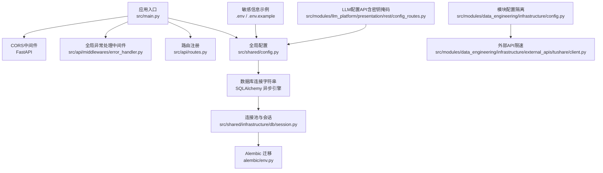
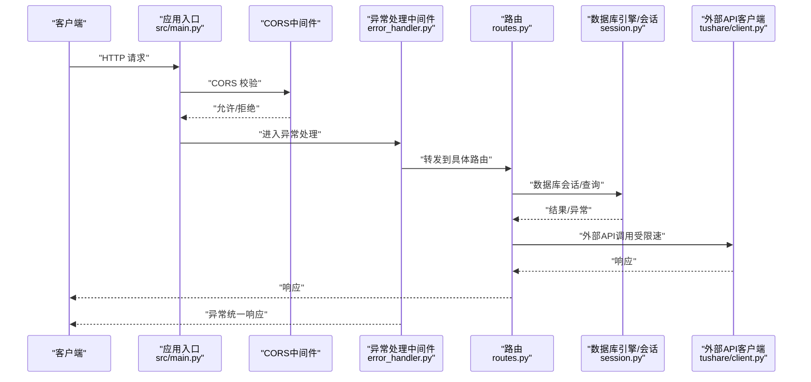
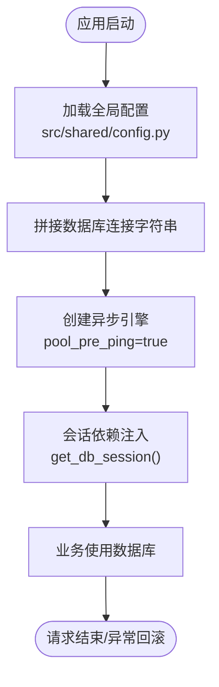
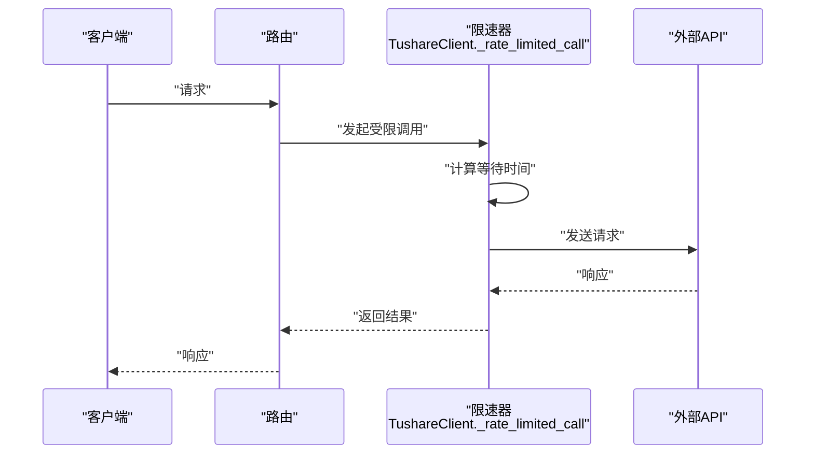
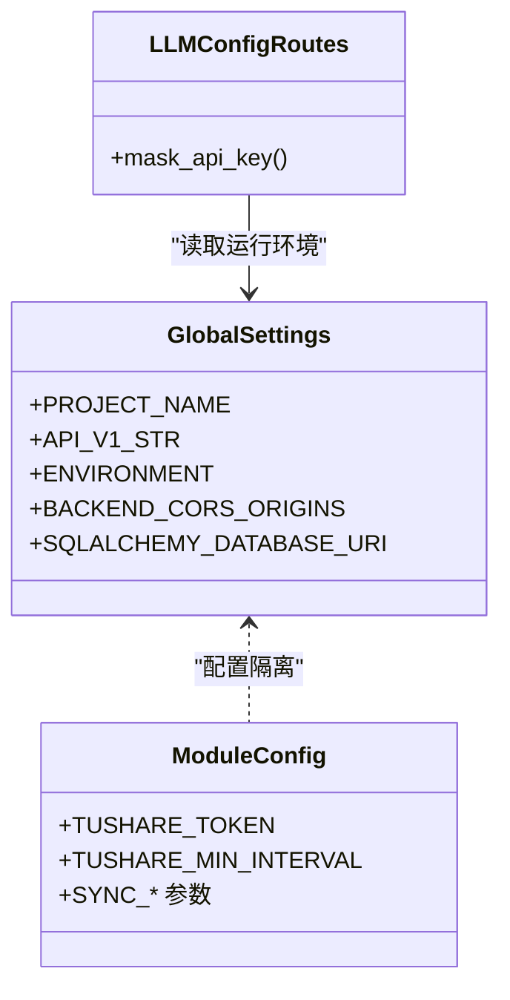
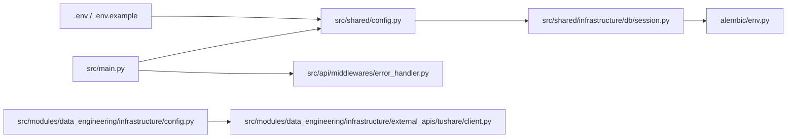

# 安全配置

<cite>
**本文引用的文件**
- [src/shared/config.py](file://src/shared/config.py)
- [src/main.py](file://src/main.py)
- [src/api/middlewares/error_handler.py](file://src/api/middlewares/error_handler.py)
- [src/shared/infrastructure/db/session.py](file://src/shared/infrastructure/db/session.py)
- [src/modules/data_engineering/infrastructure/config.py](file://src/modules/data_engineering/infrastructure/config.py)
- [.env.example](file://.env.example)
- [.env](file://.env)
- [src/modules/llm_platform/presentation/rest/config_routes.py](file://src/modules/llm_platform/presentation/rest/config_routes.py)
- [src/modules/data_engineering/infrastructure/external_apis/tushare/client.py](file://src/modules/data_engineering/infrastructure/external_apis/tushare/client.py)
- [alembic/env.py](file://alembic/env.py)
- [openspec/specs/module-config-isolation/spec.md](file://openspec/specs/module-config-isolation/spec.md)
- [openspec/specs/de-data-sync/spec.md](file://openspec/specs/de-data-sync/spec.md)
</cite>

## 目录
1. [简介](#简介)
2. [项目结构](#项目结构)
3. [核心组件](#核心组件)
4. [架构总览](#架构总览)
5. [详细组件分析](#详细组件分析)
6. [依赖分析](#依赖分析)
7. [性能考量](#性能考量)
8. [故障排查指南](#故障排查指南)
9. [结论](#结论)
10. [附录](#附录)

## 简介
本文件面向“股票助手”项目，提供一套系统化的安全配置文档，聚焦以下方面：
- CORS 安全配置与最佳实践
- 数据库连接安全（含连接池与连接字符串）
- API 安全（认证、授权、速率限制）
- 敏感信息保护（密钥管理、加密存储与传输）
- 安全配置检查清单与常见漏洞防护
- 安全审计与监控建议

## 项目结构
围绕安全主题的关键文件与职责如下：
- 全局配置与CORS：src/shared/config.py、src/main.py
- 数据库连接与连接池：src/shared/infrastructure/db/session.py、alembic/env.py
- 敏感信息与外部API配置隔离：src/modules/data_engineering/infrastructure/config.py、.env、.env.example
- API安全与异常处理：src/api/middlewares/error_handler.py、src/modules/llm_platform/presentation/rest/config_routes.py
- 速率限制与外部API调用：src/modules/data_engineering/infrastructure/external_apis/tushare/client.py
- 配置隔离规范：openspec/specs/module-config-isolation/spec.md、openspec/specs/de-data-sync/spec.md

图表来源
- [src/main.py](file://src/main.py#L14-L65)
- [src/shared/config.py](file://src/shared/config.py#L8-L67)
- [src/shared/infrastructure/db/session.py](file://src/shared/infrastructure/db/session.py#L8-L22)
- [alembic/env.py](file://alembic/env.py#L34-L36)
- [src/modules/data_engineering/infrastructure/config.py](file://src/modules/data_engineering/infrastructure/config.py#L10-L27)
- [src/modules/data_engineering/infrastructure/external_apis/tushare/client.py](file://src/modules/data_engineering/infrastructure/external_apis/tushare/client.py#L62-L79)
- [.env.example](file://.env.example#L1-L17)
- [.env](file://.env#L1-L18)
- [src/modules/llm_platform/presentation/rest/config_routes.py](file://src/modules/llm_platform/presentation/rest/config_routes.py#L46-L51)

章节来源
- [src/main.py](file://src/main.py#L14-L65)
- [src/shared/config.py](file://src/shared/config.py#L8-L67)
- [src/shared/infrastructure/db/session.py](file://src/shared/infrastructure/db/session.py#L8-L22)
- [alembic/env.py](file://alembic/env.py#L34-L36)
- [src/modules/data_engineering/infrastructure/config.py](file://src/modules/data_engineering/infrastructure/config.py#L10-L27)
- [.env.example](file://.env.example#L1-L17)
- [.env](file://.env#L1-L18)
- [src/modules/llm_platform/presentation/rest/config_routes.py](file://src/modules/llm_platform/presentation/rest/config_routes.py#L46-L51)
- [src/modules/data_engineering/infrastructure/external_apis/tushare/client.py](file://src/modules/data_engineering/infrastructure/external_apis/tushare/client.py#L62-L79)

## 核心组件
- 全局配置与CORS
  - 全局配置类集中管理项目名称、API版本前缀、运行环境与CORS白名单等全局安全参数。
  - CORS中间件在启动时按配置动态启用，支持凭据传递与通配方法/头。
- 数据库连接与连接池
  - 使用异步引擎与连接池，开启预检以提升连接稳定性；会话生命周期通过依赖注入管理。
- API安全与异常处理
  - 统一异常处理中间件，屏蔽内部细节，避免敏感信息泄露。
  - LLM配置API对密钥进行掩码展示，降低泄露风险。
- 速率限制与外部API调用
  - 外部API调用收敛至基础设施层，统一限速策略，避免业务层耦合。

章节来源
- [src/shared/config.py](file://src/shared/config.py#L8-L67)
- [src/main.py](file://src/main.py#L50-L65)
- [src/shared/infrastructure/db/session.py](file://src/shared/infrastructure/db/session.py#L8-L22)
- [src/api/middlewares/error_handler.py](file://src/api/middlewares/error_handler.py#L8-L45)
- [src/modules/llm_platform/presentation/rest/config_routes.py](file://src/modules/llm_platform/presentation/rest/config_routes.py#L46-L51)
- [src/modules/data_engineering/infrastructure/external_apis/tushare/client.py](file://src/modules/data_engineering/infrastructure/external_apis/tushare/client.py#L62-L79)

## 架构总览
下图展示了安全相关组件在应用中的交互关系与数据流。

图表来源
- [src/main.py](file://src/main.py#L50-L65)
- [src/api/middlewares/error_handler.py](file://src/api/middlewares/error_handler.py#L13-L45)
- [src/shared/infrastructure/db/session.py](file://src/shared/infrastructure/db/session.py#L24-L63)
- [src/modules/data_engineering/infrastructure/external_apis/tushare/client.py](file://src/modules/data_engineering/infrastructure/external_apis/tushare/client.py#L62-L79)

## 详细组件分析

### CORS 安全配置与最佳实践
- 当前实现
  - 全局配置支持通过 BACKEND_CORS_ORIGINS 指定允许的源；启动时按配置动态启用 CORS 中间件。
  - 允许凭据、通配方法与通配头，便于开发阶段调试。
- 安全建议
  - 生产环境务必明确列出可信源，禁用通配符，避免过度放行。
  - 严格控制允许的方法与头，仅开放必要接口。
  - 如需支持凭据，必须指定具体源而非通配，避免 CSRF 风险。
- 配置要点
  - 允许的源域名：仅限生产前端域名与必要的内网域名。
  - 允许的方法：仅开放实际使用的 HTTP 方法。
  - 允许的头：仅开放实际请求所需的头，避免通配。

章节来源
- [src/shared/config.py](file://src/shared/config.py#L19-L32)
- [src/main.py](file://src/main.py#L50-L59)

### 数据库连接安全配置
- 连接字符串与引擎
  - 通过全局配置拼接异步 PostgreSQL 连接字符串；使用 asyncpg 方案。
  - 连接池启用预检，提升连接可用性与稳定性。
- 安全建议
  - 仅在受信网络内暴露数据库端口；生产环境建议使用私有网络或专用子网。
  - 限制数据库用户权限，按最小权限原则分配读写角色。
  - 使用强密码与定期轮换；避免在代码仓库中提交明文凭证。
- 连接池安全
  - 合理设置连接池大小与超时，避免资源耗尽。
  - 使用会话依赖注入，确保异常时自动回滚与关闭。

图表来源
- [src/shared/config.py](file://src/shared/config.py#L42-L58)
- [src/shared/infrastructure/db/session.py](file://src/shared/infrastructure/db/session.py#L8-L22)
- [src/shared/infrastructure/db/session.py](file://src/shared/infrastructure/db/session.py#L24-L63)
- [alembic/env.py](file://alembic/env.py#L34-L36)

章节来源
- [src/shared/config.py](file://src/shared/config.py#L42-L58)
- [src/shared/infrastructure/db/session.py](file://src/shared/infrastructure/db/session.py#L8-L22)
- [src/shared/infrastructure/db/session.py](file://src/shared/infrastructure/db/session.py#L24-L63)
- [alembic/env.py](file://alembic/env.py#L34-L36)

### API 安全配置（认证、授权、速率限制）
- 认证与授权
  - 当前路由未内置认证/授权中间件；建议在路由或中间件层引入认证（如 JWT/OAuth）与基于角色的授权策略。
- 速率限制
  - 外部API调用采用统一限速策略，防止触发第三方限流；业务层不直接耦合限速逻辑。
  - 建议在应用层增加针对业务接口的速率限制（如基于 IP/Key 的限流）。

图表来源
- [src/modules/data_engineering/infrastructure/external_apis/tushare/client.py](file://src/modules/data_engineering/infrastructure/external_apis/tushare/client.py#L62-L79)

章节来源
- [src/modules/data_engineering/infrastructure/external_apis/tushare/client.py](file://src/modules/data_engineering/infrastructure/external_apis/tushare/client.py#L62-L79)
- [openspec/specs/de-data-sync/spec.md](file://openspec/specs/de-data-sync/spec.md#L121-L134)

### 敏感信息保护（密钥管理、加密存储与传输）
- 密钥管理
  - 全局配置与模块配置分离，避免将模块专属密钥置于全局配置中。
  - LLM配置API对密钥进行掩码展示，降低日志与响应中的泄露风险。
- 加密存储与传输
  - 建议对数据库中的敏感字段（如密钥）进行加密存储；传输通道使用 TLS/HTTPS。
  - 环境变量文件不应纳入版本控制；使用 .dockerignore/.gitignore 等策略。

图表来源
- [src/shared/config.py](file://src/shared/config.py#L8-L67)
- [src/modules/data_engineering/infrastructure/config.py](file://src/modules/data_engineering/infrastructure/config.py#L10-L27)
- [src/modules/llm_platform/presentation/rest/config_routes.py](file://src/modules/llm_platform/presentation/rest/config_routes.py#L46-L51)
- [openspec/specs/module-config-isolation/spec.md](file://openspec/specs/module-config-isolation/spec.md#L3-L38)

章节来源
- [src/shared/config.py](file://src/shared/config.py#L8-L67)
- [src/modules/data_engineering/infrastructure/config.py](file://src/modules/data_engineering/infrastructure/config.py#L10-L27)
- [src/modules/llm_platform/presentation/rest/config_routes.py](file://src/modules/llm_platform/presentation/rest/config_routes.py#L46-L51)
- [openspec/specs/module-config-isolation/spec.md](file://openspec/specs/module-config-isolation/spec.md#L3-L38)

## 依赖分析
- 组件耦合
  - 应用入口依赖全局配置与中间件；数据库引擎依赖全局配置；外部API客户端依赖模块配置。
- 配置隔离
  - 全局配置仅包含通用项；模块配置下沉至各自模块，降低耦合与泄露面。

图表来源
- [src/main.py](file://src/main.py#L1-L75)
- [src/shared/config.py](file://src/shared/config.py#L8-L67)
- [src/shared/infrastructure/db/session.py](file://src/shared/infrastructure/db/session.py#L8-L22)
- [alembic/env.py](file://alembic/env.py#L34-L36)
- [src/modules/data_engineering/infrastructure/config.py](file://src/modules/data_engineering/infrastructure/config.py#L10-L27)
- [.env](file://.env#L1-L18)
- [.env.example](file://.env.example#L1-L17)

章节来源
- [src/main.py](file://src/main.py#L1-L75)
- [src/shared/config.py](file://src/shared/config.py#L8-L67)
- [src/shared/infrastructure/db/session.py](file://src/shared/infrastructure/db/session.py#L8-L22)
- [alembic/env.py](file://alembic/env.py#L34-L36)
- [src/modules/data_engineering/infrastructure/config.py](file://src/modules/data_engineering/infrastructure/config.py#L10-L27)
- [.env](file://.env#L1-L18)
- [.env.example](file://.env.example#L1-L17)

## 性能考量
- 连接池与预检
  - 连接池启用预检可减少无效连接带来的延迟；合理设置池大小与超时。
- 限速与并发
  - 外部API限速策略避免触发第三方限流；业务层应避免在路由中直接实现限速逻辑。
- 日志与异常
  - 统一异常处理中间件屏蔽内部细节，避免敏感信息泄露；同时保留足够日志以便排查。

## 故障排查指南
- CORS 相关问题
  - 确认 BACKEND_CORS_ORIGINS 是否包含当前前端源；生产环境避免通配符。
- 数据库连接问题
  - 检查连接字符串拼接是否正确；确认网络可达与防火墙策略；查看连接池配置。
- 异常与日志
  - 统一异常处理中间件会记录详细上下文；关注日志中的路径、方法与客户端信息。
- 外部API限速
  - 若出现频繁限流，检查最小调用间隔配置与并发调用策略。

章节来源
- [src/main.py](file://src/main.py#L50-L59)
- [src/shared/infrastructure/db/session.py](file://src/shared/infrastructure/db/session.py#L8-L22)
- [src/api/middlewares/error_handler.py](file://src/api/middlewares/error_handler.py#L13-L45)
- [src/modules/data_engineering/infrastructure/external_apis/tushare/client.py](file://src/modules/data_engineering/infrastructure/external_apis/tushare/client.py#L62-L79)

## 结论
本项目在安全方面具备良好的基础：全局配置集中管理、CORS可配置、数据库连接池与会话依赖注入、统一异常处理与模块配置隔离。建议在生产环境中进一步完善认证授权、严格的 CORS 白名单、速率限制与密钥掩码策略，以形成完整的安全闭环。

## 附录

### 安全配置检查清单
- CORS
  - 是否仅允许受信源？是否禁用通配符？
  - 是否仅开放必要方法与头？是否需要凭据？
- 数据库
  - 是否使用私有网络与防火墙？是否启用强密码与权限最小化？
  - 连接池大小与超时是否合理？是否启用预检？
- API
  - 是否引入认证与授权中间件？是否对业务接口实施速率限制？
  - 是否对密钥等敏感字段进行掩码展示与日志脱敏？
- 外部API
  - 是否统一收敛限速策略？是否避免在业务层耦合限速逻辑？

### 常见安全漏洞与防护
- CORS 配置不当
  - 风险：跨站请求伪造（CSRF）、敏感信息泄露。
  - 防护：仅允许受信源；禁用通配符；严格控制方法与头。
- 数据库凭证泄露
  - 风险：未授权访问、数据篡改。
  - 防护：环境变量不入库；最小权限原则；TLS 传输。
- 速率限制缺失
  - 风险：触发第三方限流、服务降级。
  - 防护：统一限速策略；业务层不直接耦合限速。
- 敏感信息明文存储/传输
  - 风险：密钥泄露、中间人攻击。
  - 防护：加密存储；TLS/HTTPS；掩码展示与日志脱敏。