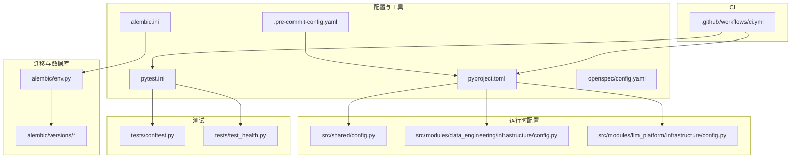
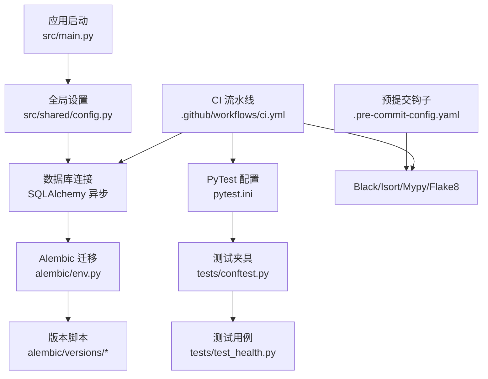
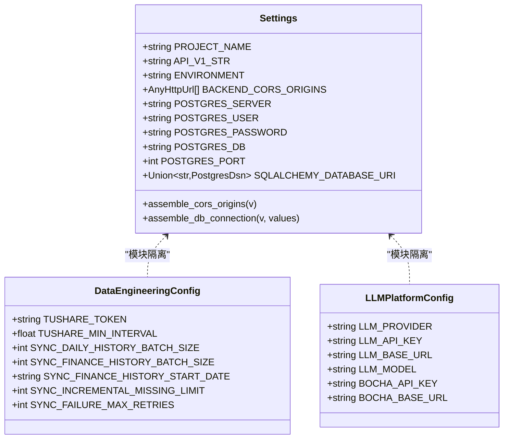
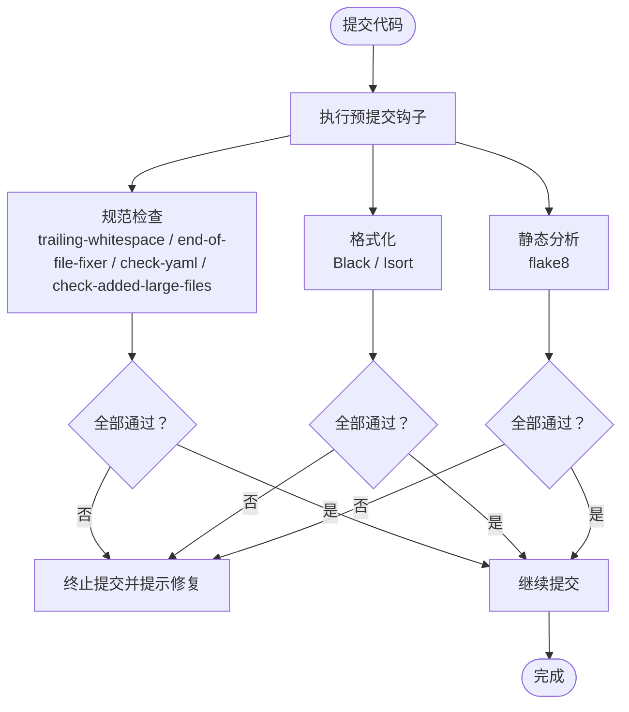
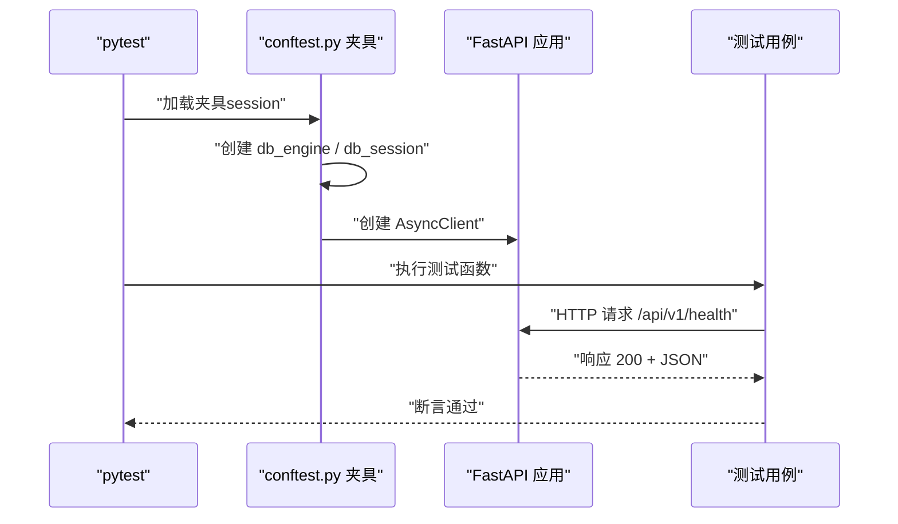
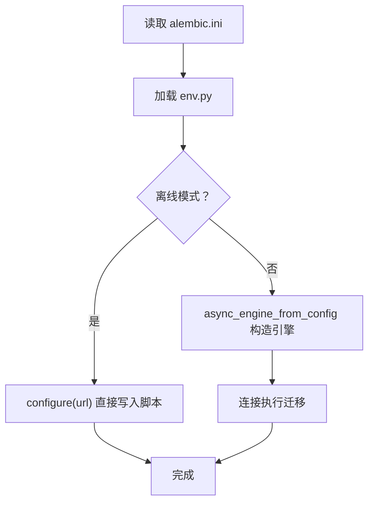
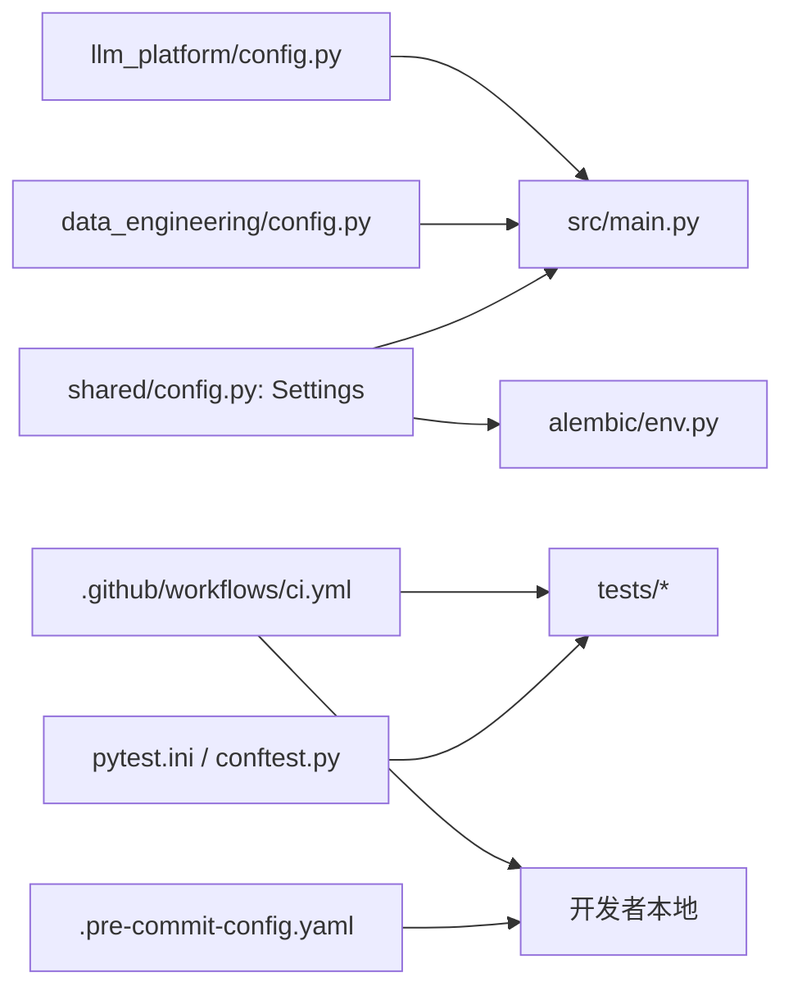

# 工具配置

<cite>
**本文引用的文件**
- [pyproject.toml](file://pyproject.toml)
- [pytest.ini](file://pytest.ini)
- [.pre-commit-config.yaml](file://.pre-commit-config.yaml)
- [alembic.ini](file://alembic.ini)
- [.github/workflows/ci.yml](file://.github/workflows/ci.yml)
- [requirements.txt](file://requirements.txt)
- [src/shared/config.py](file://src/shared/config.py)
- [src/modules/data_engineering/infrastructure/config.py](file://src/modules/data_engineering/infrastructure/config.py)
- [src/modules/llm_platform/infrastructure/config.py](file://src/modules/llm_platform/infrastructure/config.py)
- [alembic/env.py](file://alembic/env.py)
- [src/main.py](file://src/main.py)
- [tests/conftest.py](file://tests/conftest.py)
- [tests/test_health.py](file://tests/test_health.py)
- [openspec/config.yaml](file://openspec/config.yaml)
</cite>

## 目录
1. [简介](#简介)
2. [项目结构](#项目结构)
3. [核心组件](#核心组件)
4. [架构总览](#架构总览)
5. [详细组件分析](#详细组件分析)
6. [依赖关系分析](#依赖关系分析)
7. [性能考虑](#性能考虑)
8. [故障排查指南](#故障排查指南)
9. [结论](#结论)
10. [附录](#附录)

## 简介
本文件系统性梳理“股票助手”项目的工具链配置，覆盖以下主题：
- Pydantic 配置与设置模型：数据验证、类型检查、配置模型定义与加载策略
- 预提交钩子：代码格式化、静态分析与测试自动化
- PyTest 配置：测试发现、异步模式、夹具作用域与并发建议
- Alembic 数据库迁移：版本管理、迁移脚本生成与数据库同步
- 代码质量工具：Black、Isort、Mypy 的配置与集成
- CI/CD 最佳实践：GitHub Actions 流水线、依赖安装与测试执行

## 项目结构
围绕工具配置的关键目录与文件如下：
- 配置与工具：pyproject.toml、pytest.ini、.pre-commit-config.yaml、alembic.ini、openspec/config.yaml
- 运行时配置：src/shared/config.py、src/modules/data_engineering/infrastructure/config.py、src/modules/llm_platform/infrastructure/config.py
- 迁移与数据库：alembic/env.py、alembic/versions/*.py、alembic.ini
- 测试：tests/conftest.py、tests/test_health.py、pytest.ini
- CI：.github/workflows/ci.yml
- 依赖：requirements.txt

图表来源
- [pyproject.toml](file://pyproject.toml#L1-L22)
- [.pre-commit-config.yaml](file://.pre-commit-config.yaml#L1-L25)
- [pytest.ini](file://pytest.ini#L1-L5)
- [alembic.ini](file://alembic.ini#L1-L97)
- [src/shared/config.py](file://src/shared/config.py#L1-L68)
- [src/modules/data_engineering/infrastructure/config.py](file://src/modules/data_engineering/infrastructure/config.py#L1-L28)
- [src/modules/llm_platform/infrastructure/config.py](file://src/modules/llm_platform/infrastructure/config.py#L1-L27)
- [alembic/env.py](file://alembic/env.py#L1-L94)
- [tests/conftest.py](file://tests/conftest.py#L1-L56)
- [tests/test_health.py](file://tests/test_health.py#L1-L12)
- [.github/workflows/ci.yml](file://.github/workflows/ci.yml#L1-L60)

章节来源
- [pyproject.toml](file://pyproject.toml#L1-L22)
- [.pre-commit-config.yaml](file://.pre-commit-config.yaml#L1-L25)
- [pytest.ini](file://pytest.ini#L1-L5)
- [alembic.ini](file://alembic.ini#L1-L97)
- [src/shared/config.py](file://src/shared/config.py#L1-L68)
- [src/modules/data_engineering/infrastructure/config.py](file://src/modules/data_engineering/infrastructure/config.py#L1-L28)
- [src/modules/llm_platform/infrastructure/config.py](file://src/modules/llm_platform/infrastructure/config.py#L1-L27)
- [alembic/env.py](file://alembic/env.py#L1-L94)
- [tests/conftest.py](file://tests/conftest.py#L1-L56)
- [tests/test_health.py](file://tests/test_health.py#L1-L12)
- [.github/workflows/ci.yml](file://.github/workflows/ci.yml#L1-L60)

## 核心组件
- Pydantic 设置模型
  - 全局设置：src/shared/config.py 定义 Settings，包含 CORS、数据库连接等，并通过 validators 组装连接串
  - 模块专属设置：data_engineering 与 llm_platform 分别定义 DataEngineeringConfig、LLMPlatformConfig，隔离配置边界
  - 加载机制：BaseSettings 默认从 .env 读取，extra="ignore" 允许模块自定义键
- 预提交钩子
  - 规范：trailing-whitespace、end-of-file-fixer、check-yaml、check-added-large-files
  - 格式化：Black、Isort（配合 Black profile）
  - 静态分析：flake8（含额外插件）
- PyTest
  - 发现路径：tests
  - 异步：auto 模式，夹具作用域 session
  - 扩展：addopts 包含 -ra -q
- Alembic
  - 脚本位置：alembic
  - 日志级别：INFO/ WARN
  - 运行模式：离线/在线，异步引擎
- 代码质量工具
  - Black：行宽、目标版本、包含规则
  - Isort：Black 风格、多行输出
  - Mypy：Python 版本、告警策略
- CI/CD
  - 测试矩阵：Python 3.10
  - 服务：PostgreSQL 15
  - 步骤：安装依赖、静态检查（flake8、mypy）、运行测试

章节来源
- [src/shared/config.py](file://src/shared/config.py#L1-L68)
- [src/modules/data_engineering/infrastructure/config.py](file://src/modules/data_engineering/infrastructure/config.py#L1-L28)
- [src/modules/llm_platform/infrastructure/config.py](file://src/modules/llm_platform/infrastructure/config.py#L1-L27)
- [.pre-commit-config.yaml](file://.pre-commit-config.yaml#L1-L25)
- [pyproject.toml](file://pyproject.toml#L1-L22)
- [pytest.ini](file://pytest.ini#L1-L5)
- [alembic.ini](file://alembic.ini#L1-L97)
- [.github/workflows/ci.yml](file://.github/workflows/ci.yml#L1-L60)

## 架构总览
下图展示工具配置在系统中的交互关系：Pydantic 设置驱动应用启动与数据库连接；Alembic 通过 env.py 读取设置进行迁移；预提交钩子与 CI 在开发与流水线阶段统一质量标准。

图表来源
- [src/main.py](file://src/main.py#L1-L75)
- [src/shared/config.py](file://src/shared/config.py#L1-L68)
- [alembic/env.py](file://alembic/env.py#L1-L94)
- [alembic/versions/c0ff00000001_initial_schema.py](file://alembic/versions/c0ff00000001_initial_schema.py)
- [alembic/versions/c0ff00000002_add_sync_tables.py](file://alembic/versions/c0ff00000002_add_sync_tables.py)
- [pytest.ini](file://pytest.ini#L1-L5)
- [tests/conftest.py](file://tests/conftest.py#L1-L56)
- [tests/test_health.py](file://tests/test_health.py#L1-L12)
- [.pre-commit-config.yaml](file://.pre-commit-config.yaml#L1-L25)
- [.github/workflows/ci.yml](file://.github/workflows/ci.yml#L1-L60)

## 详细组件分析

### Pydantic 配置与设置模型
- 全局设置（Settings）
  - 字段：项目名称、API 前缀、运行环境、CORS 域、数据库主机/用户/密码/库/端口、数据库连接串
  - 验证器：
    - CORS 域支持逗号分隔字符串或列表，自动清洗空白
    - 数据库连接串通过 PostgresDsn.build 组装，scheme 使用异步驱动
  - 配置：case_sensitive、env_file=".env"、extra="ignore"
- 模块专属设置
  - data_engineering：Tushare Token、最小请求间隔、批量大小、增量限制、失败重试次数
  - llm_platform：LLM 提供商、API Key、基础地址、模型、博查 API Key 与基础地址
- 加载与使用
  - 应用启动时读取 settings，FastAPI 实例据此初始化 CORS 与文档路径
  - Alembic env.py 也从 shared.config 读取连接串，确保迁移与应用一致

图表来源
- [src/shared/config.py](file://src/shared/config.py#L1-L68)
- [src/modules/data_engineering/infrastructure/config.py](file://src/modules/data_engineering/infrastructure/config.py#L1-L28)
- [src/modules/llm_platform/infrastructure/config.py](file://src/modules/llm_platform/infrastructure/config.py#L1-L27)

章节来源
- [src/shared/config.py](file://src/shared/config.py#L1-L68)
- [src/modules/data_engineering/infrastructure/config.py](file://src/modules/data_engineering/infrastructure/config.py#L1-L28)
- [src/modules/llm_platform/infrastructure/config.py](file://src/modules/llm_platform/infrastructure/config.py#L1-L27)
- [src/main.py](file://src/main.py#L1-L75)

### 预提交钩子配置
- 规范检查：去除尾随空白、修复文件末尾换行、校验 YAML、拦截大文件
- 格式化：Black（行宽、目标版本）、Isort（Black 风格）
- 静态分析：flake8（含 bugbear 插件）
- 集成方式：通过 pre-commit 安装钩子，在本地提交前自动执行

图表来源
- [.pre-commit-config.yaml](file://.pre-commit-config.yaml#L1-L25)

章节来源
- [.pre-commit-config.yaml](file://.pre-commit-config.yaml#L1-L25)

### PyTest 配置与测试执行
- 测试发现：testpaths 指向 tests 目录
- 异步支持：asyncio_mode=auto，夹具与测试默认 session 作用域
- 扩展选项：addopts="-ra -q"，便于失败/错误统计与简洁输出
- 夹具设计：db_engine 创建表结构；db_session 使用事务回滚，保证测试隔离；client 提供异步 HTTP 客户端
- 示例：健康检查测试验证根路径返回状态码与响应结构

图表来源
- [tests/conftest.py](file://tests/conftest.py#L1-L56)
- [tests/test_health.py](file://tests/test_health.py#L1-L12)
- [pytest.ini](file://pytest.ini#L1-L5)

章节来源
- [pytest.ini](file://pytest.ini#L1-L5)
- [tests/conftest.py](file://tests/conftest.py#L1-L56)
- [tests/test_health.py](file://tests/test_health.py#L1-L12)

### Alembic 数据库迁移配置
- 脚本位置与模板：script_location=alembic
- prepend_sys_path=. 使迁移脚本可导入应用模型
- 日志配置：root/INFO、sqlalchemy/WARN、alembic/INFO
- 运行模式：
  - 离线：直接配置 URL，无需引擎
  - 在线：从配置构造异步引擎，连接后执行迁移
- 连接来源：从 shared.config.settings 获取 SQLALCHEMY_DATABASE_URI
- 版本脚本：初始 schema 与新增同步表脚本已存在

图表来源
- [alembic.ini](file://alembic.ini#L1-L97)
- [alembic/env.py](file://alembic/env.py#L1-L94)
- [src/shared/config.py](file://src/shared/config.py#L1-L68)

章节来源
- [alembic.ini](file://alembic.ini#L1-L97)
- [alembic/env.py](file://alembic/env.py#L1-L94)
- [src/shared/config.py](file://src/shared/config.py#L1-L68)

### 代码质量工具配置
- Black
  - 行长度：88
  - 目标版本：py310
  - 包含范围：.py / .pyi
- Isort
  - profile=black
  - 多行输出风格：垂直 hugging
- Mypy
  - python_version=3.10
  - warn_return_any=true
  - warn_unused_configs=true
  - ignore_missing_imports=true
- CI 集成：在流水线中执行 flake8 与 mypy，确保静态检查通过

章节来源
- [pyproject.toml](file://pyproject.toml#L1-L22)
- [.github/workflows/ci.yml](file://.github/workflows/ci.yml#L45-L49)

### CI/CD 工具链配置与最佳实践
- 触发条件：推送 main 或拉取请求至 main
- 作业矩阵：Python 3.10
- 服务：PostgreSQL 15（容器）
- 步骤：
  - 安装依赖：pip 安装 requirements.txt 与 pytest/httpx
  - 静态检查：flake8、mypy
  - 运行测试：pytest tests/
- 最佳实践建议：
  - 将测试数据库与开发数据库分离，避免数据污染
  - 在流水线中固定工具版本，提升可重复性
  - 将 Black/Isort/Mypy/Flake8 作为预提交钩子与 CI 共同执行，形成一致的质量门槛

章节来源
- [.github/workflows/ci.yml](file://.github/workflows/ci.yml#L1-L60)
- [requirements.txt](file://requirements.txt#L1-L16)

## 依赖关系分析
- 配置依赖
  - 应用层依赖 shared.config.Settings 提供运行参数
  - Alembic env.py 依赖 shared.config.settings 获取数据库连接
  - 模块专属配置（data_engineering、llm_platform）通过 pydantic-settings 从 .env 读取
- 工具链依赖
  - PyTest 依赖 pytest.ini 与 conftest.py 提供夹具与异步支持
  - 预提交钩子依赖 .pre-commit-config.yaml 统一格式化与静态分析
  - CI 依赖 requirements.txt 提供运行时依赖

图表来源
- [src/shared/config.py](file://src/shared/config.py#L1-L68)
- [src/main.py](file://src/main.py#L1-L75)
- [alembic/env.py](file://alembic/env.py#L1-L94)
- [src/modules/data_engineering/infrastructure/config.py](file://src/modules/data_engineering/infrastructure/config.py#L1-L28)
- [src/modules/llm_platform/infrastructure/config.py](file://src/modules/llm_platform/infrastructure/config.py#L1-L27)
- [pytest.ini](file://pytest.ini#L1-L5)
- [tests/conftest.py](file://tests/conftest.py#L1-L56)
- [.pre-commit-config.yaml](file://.pre-commit-config.yaml#L1-L25)
- [.github/workflows/ci.yml](file://.github/workflows/ci.yml#L1-L60)

章节来源
- [src/shared/config.py](file://src/shared/config.py#L1-L68)
- [src/main.py](file://src/main.py#L1-L75)
- [alembic/env.py](file://alembic/env.py#L1-L94)
- [src/modules/data_engineering/infrastructure/config.py](file://src/modules/data_engineering/infrastructure/config.py#L1-L28)
- [src/modules/llm_platform/infrastructure/config.py](file://src/modules/llm_platform/infrastructure/config.py#L1-L27)
- [pytest.ini](file://pytest.ini#L1-L5)
- [tests/conftest.py](file://tests/conftest.py#L1-L56)
- [.pre-commit-config.yaml](file://.pre-commit-config.yaml#L1-L25)
- [.github/workflows/ci.yml](file://.github/workflows/ci.yml#L1-L60)

## 性能考虑
- 数据库连接
  - 使用异步 SQLAlchemy 引擎，减少阻塞
  - 迁移采用异步引擎，避免阻塞主线程
- 测试隔离
  - 使用事务回滚，避免频繁建表/删表带来的开销
- 静态检查
  - 在 CI 中并行执行 flake8 与 mypy，缩短反馈周期
- 代码格式化
  - Black 与 Isort 自动化，减少人工调优成本

## 故障排查指南
- Pydantic 设置加载失败
  - 检查 .env 是否存在且键名匹配（区分大小写）
  - 若模块新增配置键，保持 extra="ignore" 以避免校验报错
- 数据库连接异常
  - 确认 SQLALCHEMY_DATABASE_URI 组装正确（异步驱动）
  - CI 中确保 POSTGRES_* 环境变量与 alembic.ini 中的 sqlalchemy.url 一致
- Alembic 迁移失败
  - 离线模式：确认 script_location 与 prepend_sys_path 正确
  - 在线模式：检查异步引擎构造与连接池配置
- 预提交钩子失败
  - 优先修复 Black/Isort/Flake8 报错，再提交
- PyTest 异步测试失败
  - 确保测试函数与夹具使用 asyncio_mode=auto
  - 使用 session 作用域的夹具时，注意共享状态与资源清理

章节来源
- [src/shared/config.py](file://src/shared/config.py#L1-L68)
- [alembic/env.py](file://alembic/env.py#L1-L94)
- [.pre-commit-config.yaml](file://.pre-commit-config.yaml#L1-L25)
- [pytest.ini](file://pytest.ini#L1-L5)
- [tests/conftest.py](file://tests/conftest.py#L1-L56)

## 结论
本项目通过 Pydantic 设置模型实现强类型与自动验证，结合模块化配置隔离不同上下文；借助预提交钩子与 CI 流水线统一代码质量标准；Alembic 提供可靠的数据库迁移能力；PyTest 配置保障异步测试的稳定性。整体工具链清晰、可维护性强，适合持续演进的 DDD 项目。

## 附录
- OpenSpec 项目上下文与技术栈：见 openspec/config.yaml
- 依赖清单：见 requirements.txt

章节来源
- [openspec/config.yaml](file://openspec/config.yaml#L1-L27)
- [requirements.txt](file://requirements.txt#L1-L16)