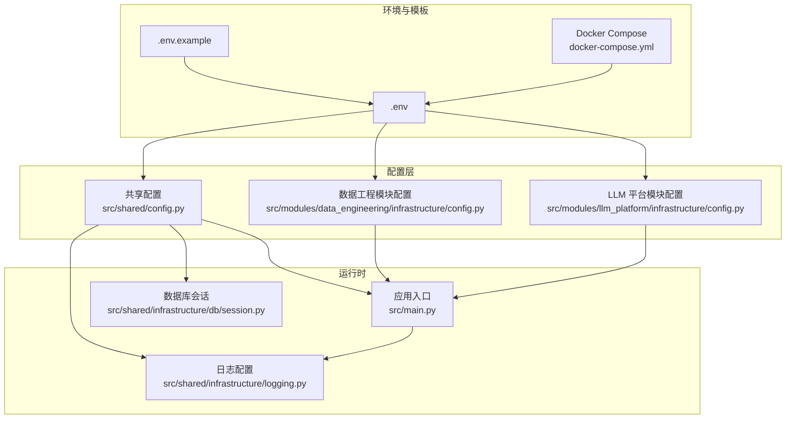
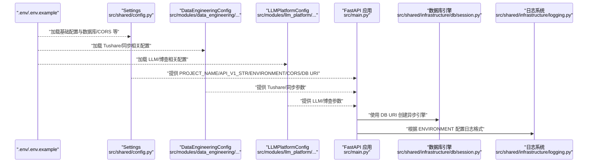
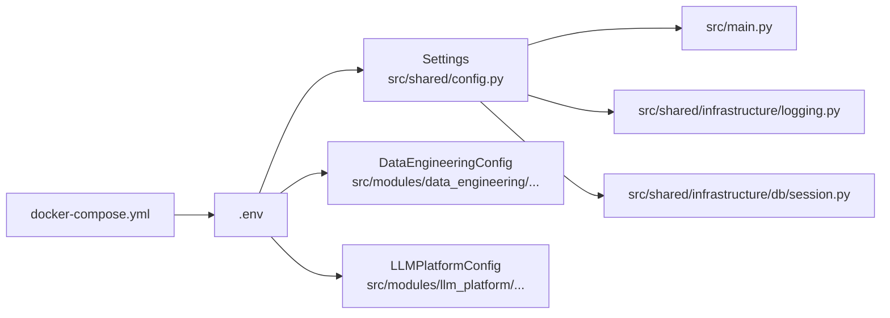

# 环境配置

<cite>
**本文引用的文件**
- [.env](file://.env)
- [.env.example](file://.env.example)
- [src/shared/config.py](file://src/shared/config.py)
- [src/modules/data_engineering/infrastructure/config.py](file://src/modules/data_engineering/infrastructure/config.py)
- [src/modules/llm_platform/infrastructure/config.py](file://src/modules/llm_platform/infrastructure/config.py)
- [src/main.py](file://src/main.py)
- [src/shared/infrastructure/db/session.py](file://src/shared/infrastructure/db/session.py)
- [src/shared/infrastructure/logging.py](file://src/shared/infrastructure/logging.py)
- [docker-compose.yml](file://docker-compose.yml)
- [tests/shared/test_config.py](file://tests/shared/test_config.py)
- [requirements.txt](file://requirements.txt)
- [alembic.ini](file://alembic.ini)
</cite>

## 目录
1. [简介](#简介)
2. [项目结构](#项目结构)
3. [核心组件](#核心组件)
4. [架构总览](#架构总览)
5. [详细组件分析](#详细组件分析)
6. [依赖关系分析](#依赖关系分析)
7. [性能考量](#性能考量)
8. [故障排查指南](#故障排查指南)
9. [结论](#结论)
10. [附录](#附录)

## 简介
本文件面向“股票助手”项目的运维与开发人员，系统性说明环境配置体系，包括：
- 不同运行环境（local、dev、prod）的配置差异与最佳实践
- .env 文件中全部配置项的含义与用途（数据库、CORS、项目名称等）
- 配置加载机制与优先级规则（环境变量覆盖、配置文件解析、默认值处理）
- 完整的配置模板与示例（开发、测试、生产）
- 配置验证机制与错误处理策略
- 安全注意事项与敏感信息保护建议

## 项目结构
围绕配置的关键文件与模块如下：
- 全局配置：src/shared/config.py
- 模块化配置：data_engineering 与 llm_platform 各自的 infrastructure/config.py
- 应用入口与中间件：src/main.py
- 数据库会话与连接：src/shared/infrastructure/db/session.py
- 日志与环境：src/shared/infrastructure/logging.py
- 容器编排与环境注入：docker-compose.yml
- 示例与模板：.env、.env.example
- 测试与依赖：tests/shared/test_config.py、requirements.txt、alembic.ini

图表来源
- [src/shared/config.py](file://src/shared/config.py#L8-L67)
- [src/modules/data_engineering/infrastructure/config.py](file://src/modules/data_engineering/infrastructure/config.py#L10-L27)
- [src/modules/llm_platform/infrastructure/config.py](file://src/modules/llm_platform/infrastructure/config.py#L10-L26)
- [src/main.py](file://src/main.py#L1-L75)
- [src/shared/infrastructure/db/session.py](file://src/shared/infrastructure/db/session.py#L1-L64)
- [src/shared/infrastructure/logging.py](file://src/shared/infrastructure/logging.py#L31-L74)
- [.env](file://.env#L1-L18)
- [.env.example](file://.env.example#L1-L17)
- [docker-compose.yml](file://docker-compose.yml#L9-L17)

章节来源
- [src/shared/config.py](file://src/shared/config.py#L8-L67)
- [src/modules/data_engineering/infrastructure/config.py](file://src/modules/data_engineering/infrastructure/config.py#L10-L27)
- [src/modules/llm_platform/infrastructure/config.py](file://src/modules/llm_platform/infrastructure/config.py#L10-L26)
- [src/main.py](file://src/main.py#L1-L75)
- [src/shared/infrastructure/db/session.py](file://src/shared/infrastructure/db/session.py#L1-L64)
- [src/shared/infrastructure/logging.py](file://src/shared/infrastructure/logging.py#L31-L74)
- [.env](file://.env#L1-L18)
- [.env.example](file://.env.example#L1-L17)
- [docker-compose.yml](file://docker-compose.yml#L9-L17)

## 核心组件
- 全局配置类 Settings：集中管理项目名称、API 前缀、运行环境、CORS、数据库连接等。支持从 .env 加载并自动组装数据库连接字符串。
- 模块化配置：
  - DataEngineeringConfig：封装 Tushare 令牌与同步相关参数，按边界上下文隔离。
  - LLMPlatformConfig：封装 LLM 提供商、API 密钥、基础 URL、模型与博查搜索相关参数。
- 应用入口与中间件：FastAPI 应用在启动时读取全局配置，动态注册 CORS 与全局异常处理中间件。
- 数据库会话：基于全局配置的数据库连接字符串创建异步引擎与会话工厂。
- 日志系统：根据运行环境选择日志输出格式（开发友好格式 vs 生产 JSON 序列化）。

章节来源
- [src/shared/config.py](file://src/shared/config.py#L8-L67)
- [src/modules/data_engineering/infrastructure/config.py](file://src/modules/data_engineering/infrastructure/config.py#L10-L27)
- [src/modules/llm_platform/infrastructure/config.py](file://src/modules/llm_platform/infrastructure/config.py#L10-L26)
- [src/main.py](file://src/main.py#L50-L65)
- [src/shared/infrastructure/db/session.py](file://src/shared/infrastructure/db/session.py#L8-L22)
- [src/shared/infrastructure/logging.py](file://src/shared/infrastructure/logging.py#L63-L73)

## 架构总览
下图展示配置加载与应用的关键交互流程：

图表来源
- [.env](file://.env#L1-L18)
- [.env.example](file://.env.example#L1-L17)
- [src/shared/config.py](file://src/shared/config.py#L8-L67)
- [src/modules/data_engineering/infrastructure/config.py](file://src/modules/data_engineering/infrastructure/config.py#L10-L27)
- [src/modules/llm_platform/infrastructure/config.py](file://src/modules/llm_platform/infrastructure/config.py#L10-L26)
- [src/main.py](file://src/main.py#L14-L18)
- [src/shared/infrastructure/db/session.py](file://src/shared/infrastructure/db/session.py#L8-L13)
- [src/shared/infrastructure/logging.py](file://src/shared/infrastructure/logging.py#L63-L73)

## 详细组件分析

### 全局配置 Settings（src/shared/config.py）
- 作用：集中管理全局配置项，自动从 .env 加载并进行类型校验与组装。
- 关键点：
  - 运行环境 ENVIRONMENT 控制日志输出格式与行为。
  - CORS 配置 BACKEND_CORS_ORIGINS 支持逗号分隔字符串或列表格式，自动清洗与校验。
  - 数据库连接 SQLALCHEMY_DATABASE_URI 支持直接提供完整 URI，或通过 POSTGRES_* 参数自动拼装。
  - 额外字段（模块专属配置）被忽略，避免校验失败。
- 默认值与覆盖：
  - 若 .env 缺失对应键，将采用类内默认值。
  - 运行时可通过环境变量覆盖任意键值。
- 与应用集成：
  - FastAPI 应用使用 PROJECT_NAME 作为标题，ENVIRONMENT 决定日志格式，CORS 与 DB URI 由该配置提供。

章节来源
- [src/shared/config.py](file://src/shared/config.py#L8-L67)

### 数据工程模块配置（src/modules/data_engineering/infrastructure/config.py）
- 作用：封装与数据采集/同步相关的模块化配置，隔离于共享配置。
- 关键配置项（示例说明，具体以类内默认值为准）：
  - TUSHARE_TOKEN：Tushare 平台访问令牌
  - TUSHARE_MIN_INTERVAL：请求最小间隔（秒）
  - SYNC_DAILY_HISTORY_BATCH_SIZE：日线历史批量同步大小
  - SYNC_FINANCE_HISTORY_BATCH_SIZE：财务历史批量同步大小
  - SYNC_FINANCE_HISTORY_START_DATE：财务数据同步起始日期
  - SYNC_INCREMENTAL_MISSING_LIMIT：增量缺失上限
  - SYNC_FAILURE_MAX_RETRIES：失败最大重试次数
- 加载机制：继承 BaseSettings，从 .env 加载，extra="ignore" 允许存在其他模块专属键。

章节来源
- [src/modules/data_engineering/infrastructure/config.py](file://src/modules/data_engineering/infrastructure/config.py#L10-L27)

### LLM 平台模块配置（src/modules/llm_platform/infrastructure/config.py）
- 作用：封装 LLM 提供商、模型、API 密钥与博查搜索相关配置。
- 关键配置项（示例说明，具体以类内默认值为准）：
  - LLM_PROVIDER：LLM 提供商（如 openai）
  - LLM_API_KEY：LLM 平台 API 密钥
  - LLM_BASE_URL：LLM 平台基础 URL
  - LLM_MODEL：默认模型名称
  - BOCHA_API_KEY：博查搜索 API 密钥
  - BOCHA_BASE_URL：博查搜索基础 URL
- 加载机制：继承 BaseSettings，从 .env 加载，extra="ignore" 允许存在其他模块专属键。

章节来源
- [src/modules/llm_platform/infrastructure/config.py](file://src/modules/llm_platform/infrastructure/config.py#L10-L26)

### 应用入口与中间件（src/main.py）
- CORS 中间件：当 BACKEND_CORS_ORIGINS 非空时，动态注册允许凭据、通配方法与头的 CORS。
- 全局异常处理中间件：统一捕获自定义异常与系统异常，返回结构化错误响应。
- 路由注册：使用 API_V1_STR 作为前缀。

章节来源
- [src/main.py](file://src/main.py#L50-L65)
- [src/api/middlewares/error_handler.py](file://src/api/middlewares/error_handler.py#L8-L45)

### 数据库会话（src/shared/infrastructure/db/session.py）
- 引擎创建：使用全局配置的 SQLALCHEMY_DATABASE_URI 构建异步引擎，开启 pool_pre_ping。
- 会话工厂：AsyncSessionLocal 提供异步会话，expire_on_commit=false 便于异步场景。
- 依赖注入：get_db_session 提供 FastAPI 依赖，自动处理异常与回滚逻辑。

章节来源
- [src/shared/infrastructure/db/session.py](file://src/shared/infrastructure/db/session.py#L8-L22)
- [src/shared/infrastructure/db/session.py](file://src/shared/infrastructure/db/session.py#L24-L64)

### 日志系统（src/shared/infrastructure/logging.py）
- 行为：接管标准 logging，统一使用 Loguru 输出。
- 格式：开发环境使用人类可读格式；生产环境启用 JSON 序列化，便于日志收集系统解析。
- 触发：ENVIRONMENT 控制日志格式与序列化开关。

章节来源
- [src/shared/infrastructure/logging.py](file://src/shared/infrastructure/logging.py#L31-L74)

## 依赖关系分析
- 配置加载链路：
  - .env → Settings（全局）、DataEngineeringConfig（模块）、LLMPlatformConfig（模块）
  - Settings → FastAPI 应用（标题、CORS、DB URI）、日志系统（ENVIRONMENT）
  - Settings → 数据库引擎（SQLALCHEMY_DATABASE_URI）
- Docker Compose 注入：
  - 通过 env_file: .env 注入环境变量
  - 通过 environment 字段覆盖部分数据库连接参数（容器网络内生效）

图表来源
- [.env](file://.env#L1-L18)
- [src/shared/config.py](file://src/shared/config.py#L8-L67)
- [src/modules/data_engineering/infrastructure/config.py](file://src/modules/data_engineering/infrastructure/config.py#L10-L27)
- [src/modules/llm_platform/infrastructure/config.py](file://src/modules/llm_platform/infrastructure/config.py#L10-L26)
- [src/main.py](file://src/main.py#L14-L18)
- [src/shared/infrastructure/logging.py](file://src/shared/infrastructure/logging.py#L63-L73)
- [src/shared/infrastructure/db/session.py](file://src/shared/infrastructure/db/session.py#L8-L13)
- [docker-compose.yml](file://docker-compose.yml#L9-L17)

章节来源
- [docker-compose.yml](file://docker-compose.yml#L9-L17)
- [src/shared/config.py](file://src/shared/config.py#L8-L67)

## 性能考量
- 数据库连接池健康检查：pool_pre_ping=true 可减少连接失效导致的查询失败，提升稳定性。
- 异步引擎与会话：使用 SQLAlchemy 异步引擎与 AsyncSession，降低阻塞风险，适合高并发场景。
- CORS 配置：允许通配符方法与头，简化前端对接；在生产环境建议收敛允许范围以降低攻击面。
- 日志输出：生产环境启用 JSON 序列化，利于日志聚合与检索；避免在生产开启 SQL 打印。

## 故障排查指南
- CORS 无效或跨域失败
  - 检查 BACKEND_CORS_ORIGINS 是否正确设置（支持逗号分隔字符串或列表）
  - 确认应用已注册 CORS 中间件
- 数据库连接失败
  - 校验 SQLALCHEMY_DATABASE_URI 或 POSTGRES_* 参数是否完整
  - 确认容器网络与主机端口映射（docker-compose）
  - 查看数据库服务健康状态与凭据
- 日志格式不符合预期
  - 检查 ENVIRONMENT 是否为 prod/dev
  - 确认日志初始化顺序与拦截器配置
- 配置未生效
  - 确认 .env 文件路径与权限
  - 检查是否存在同名环境变量覆盖
  - 使用测试用例验证模块化配置加载

章节来源
- [src/shared/config.py](file://src/shared/config.py#L22-L32)
- [src/main.py](file://src/main.py#L50-L59)
- [src/shared/infrastructure/db/session.py](file://src/shared/infrastructure/db/session.py#L8-L13)
- [src/shared/infrastructure/logging.py](file://src/shared/infrastructure/logging.py#L63-L73)
- [docker-compose.yml](file://docker-compose.yml#L18-L28)
- [tests/shared/test_config.py](file://tests/shared/test_config.py#L13-L54)

## 结论
本项目采用“全局配置 + 模块化配置”的分层设计，结合 .env 文件与环境变量实现灵活的配置管理。通过 Pydantic BaseSettings 提供强类型校验与默认值处理，配合 FastAPI 中间件与日志系统，形成清晰、可维护、可扩展的配置体系。建议在不同环境中遵循本文档提供的最佳实践，确保一致性与安全性。

## 附录

### 运行环境与最佳实践
- local（本地开发）
  - CORS：允许本地开发域名与通配符
  - 日志：人类可读格式，便于调试
  - 数据库：使用本地或容器内数据库，端口映射至宿主
- dev（开发测试）
  - CORS：限制为测试前端域名
  - 日志：人类可读格式或轻量 JSON
  - 数据库：独立测试库，避免污染生产数据
- prod（生产）
  - CORS：严格限定允许来源
  - 日志：JSON 序列化，接入日志收集系统
  - 数据库：使用高可用数据库，开启连接池与健康检查

### .env 配置项说明（节选）
- 项目基础
  - PROJECT_NAME：项目显示名称
  - ENVIRONMENT：运行环境（local/dev/prod）
- 数据库
  - POSTGRES_SERVER：数据库主机
  - POSTGRES_USER：数据库用户名
  - POSTGRES_PASSWORD：数据库密码
  - POSTGRES_DB：数据库名
  - POSTGRES_PORT：数据库端口
  - SQLALCHEMY_DATABASE_URI：数据库连接字符串（可选，若提供则优先）
- CORS
  - BACKEND_CORS_ORIGINS：允许的前端来源，支持逗号分隔字符串或列表
- LLM/博查
  - LLM_PROVIDER：LLM 提供商
  - LLM_API_KEY：LLM API 密钥
  - LLM_BASE_URL：LLM 基础 URL
  - LLM_MODEL：默认模型
  - BOCHA_API_KEY：博查搜索密钥
  - BOCHA_BASE_URL：博查搜索基础 URL
- 数据工程
  - TUSHARE_TOKEN：Tushare 令牌
  - TUSHARE_MIN_INTERVAL：请求最小间隔
  - SYNC_*：同步批次大小、起始日期、缺失上限、失败重试次数等

章节来源
- [.env](file://.env#L1-L18)
- [.env.example](file://.env.example#L1-L17)
- [src/shared/config.py](file://src/shared/config.py#L13-L58)
- [src/modules/data_engineering/infrastructure/config.py](file://src/modules/data_engineering/infrastructure/config.py#L13-L19)
- [src/modules/llm_platform/infrastructure/config.py](file://src/modules/llm_platform/infrastructure/config.py#L13-L18)

### 配置加载与优先级
- 加载顺序
  - 从 .env 读取键值
  - 运行时环境变量覆盖 .env 中的同名键
  - 若提供 SQLALCHEMY_DATABASE_URI 则直接使用，否则根据 POSTGRES_* 组装
- 模块化隔离
  - 共享配置仅包含全局项；模块配置各自从 .env 读取模块专属键
  - 模块配置实例仅在模块内部可见，避免跨模块依赖

章节来源
- [src/shared/config.py](file://src/shared/config.py#L60-L67)
- [src/modules/data_engineering/infrastructure/config.py](file://src/modules/data_engineering/infrastructure/config.py#L21-L24)
- [src/modules/llm_platform/infrastructure/config.py](file://src/modules/llm_platform/infrastructure/config.py#L20-L23)
- [tests/shared/test_config.py](file://tests/shared/test_config.py#L13-L22)

### 配置模板与示例
- 开发环境模板
  - 使用 .env.example 作为起点，填充必要密钥与参数
  - 在本地或容器内运行时，通过 .env 注入
- 测试环境
  - 使用独立数据库与受限 CORS
  - 通过环境变量覆盖模块参数以模拟不同场景
- 生产环境
  - 严格控制 CORS 来源
  - 使用只读/最小权限数据库账号
  - 将敏感信息置于受控密钥管理服务，避免硬编码在 .env

章节来源
- [.env.example](file://.env.example#L1-L17)
- [docker-compose.yml](file://docker-compose.yml#L9-L17)

### 配置验证与错误处理
- 类型与格式校验：Pydantic BaseSettings 对配置进行类型与格式校验
- CORS 校验：支持字符串或列表输入，自动清洗与校验
- 数据库连接组装：当未提供完整 URI 时，自动拼装 PostgreSQL 异步连接字符串
- 错误处理：全局异常中间件统一捕获并返回结构化错误响应
- 单元测试：验证共享配置与模块配置的职责分离与默认值行为

章节来源
- [src/shared/config.py](file://src/shared/config.py#L22-L32)
- [src/shared/config.py](file://src/shared/config.py#L42-L58)
- [src/api/middlewares/error_handler.py](file://src/api/middlewares/error_handler.py#L8-L45)
- [tests/shared/test_config.py](file://tests/shared/test_config.py#L13-L54)

### 安全与敏感信息保护
- 最小权限原则：数据库账号仅授予必要权限
- 环境变量与密钥管理：将敏感信息置于受控密钥管理服务或容器编排的密钥管理功能中
- 配置文件权限：限制 .env 文件读写权限，避免泄露
- CORS 收敛：生产环境严格限定允许来源，避免跨域攻击
- 日志脱敏：生产环境避免输出敏感字段；必要时对日志内容进行脱敏处理

章节来源
- [src/shared/infrastructure/logging.py](file://src/shared/infrastructure/logging.py#L63-L73)
- [docker-compose.yml](file://docker-compose.yml#L9-L17)