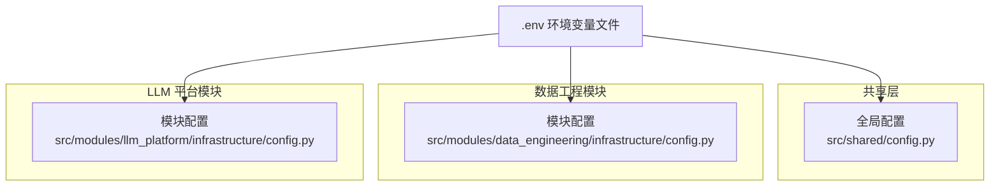
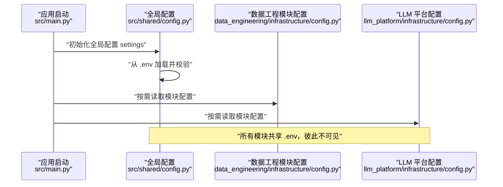
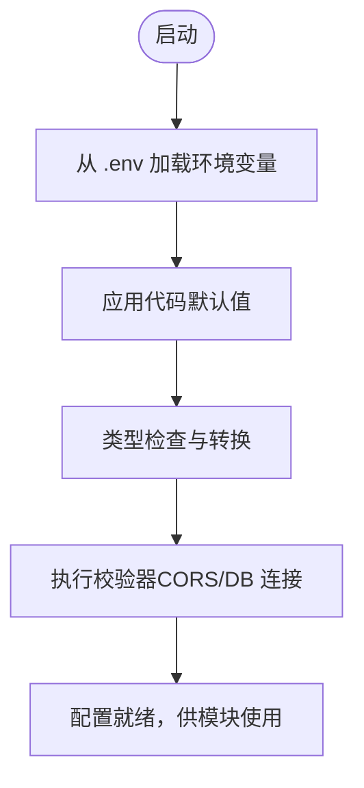
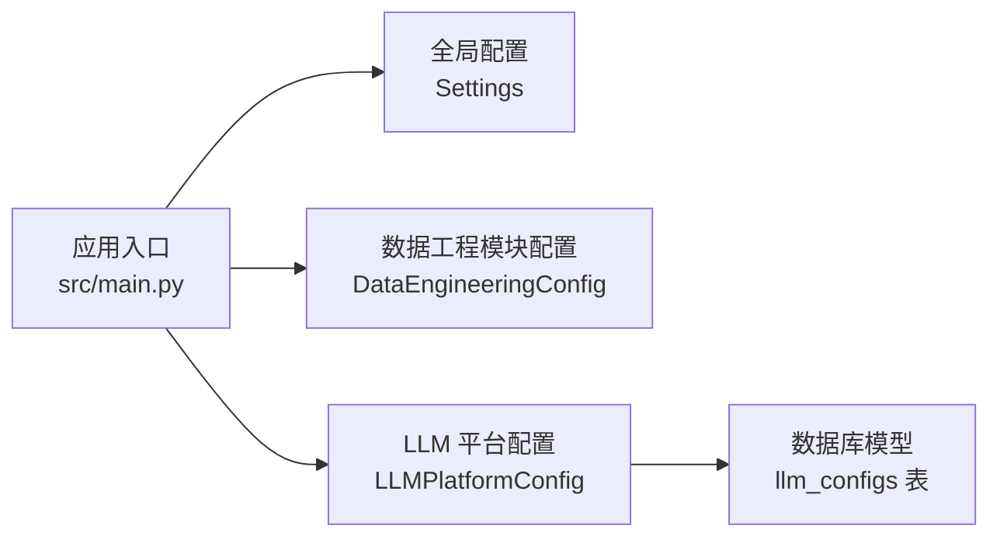

# 配置管理

<cite>
**本文引用的文件**
- [src/shared/config.py](file://src/shared/config.py)
- [.env](file://.env)
- [.env.example](file://.env.example)
- [src/modules/data_engineering/infrastructure/config.py](file://src/modules/data_engineering/infrastructure/config.py)
- [src/modules/llm_platform/infrastructure/config.py](file://src/modules/llm_platform/infrastructure/config.py)
- [src/main.py](file://src/main.py)
- [tests/shared/test_config.py](file://tests/shared/test_config.py)
- [openspec/changes/ddd-architecture-optimization/design.md](file://openspec/changes/ddd-architecture-optimization/design.md)
- [openspec/changes/ddd-architecture-optimization/spec.md](file://openspec/changes/ddd-architecture-optimization/spec.md)
- [src/modules/llm_platform/presentation/rest/config_routes.py](file://src/modules/llm_platform/presentation/rest/config_routes.py)
- [src/modules/llm_platform/infrastructure/persistence/models/llm_config_model.py](file://src/modules/llm_platform/infrastructure/persistence/models/llm_config_model.py)
- [alembic/versions/c0ff00000001_initial_schema.py](file://alembic/versions/c0ff00000001_initial_schema.py)
- [pyproject.toml](file://pyproject.toml)
</cite>

## 目录
1. [简介](#简介)
2. [项目结构](#项目结构)
3. [核心组件](#核心组件)
4. [架构总览](#架构总览)
5. [详细组件分析](#详细组件分析)
6. [依赖关系分析](#依赖关系分析)
7. [性能考量](#性能考量)
8. [故障排查指南](#故障排查指南)
9. [结论](#结论)
10. [附录](#附录)

## 简介
本文件系统化梳理“股票助手”项目的配置管理体系，覆盖以下方面：
- 环境配置的结构与层次：开发、测试、生产环境的差异化策略
- .env 文件的关键配置项说明：数据库连接、LLM 服务、Tushare API 等
- 配置加载与验证机制：类型检查、默认值、必需参数与校验器
- 配置优先级与覆盖规则：环境变量、配置文件、代码默认值
- 安全最佳实践：敏感信息保护、密钥管理、访问控制
- 配置热更新与变更影响范围
- 配置模板与示例，辅助快速搭建开发环境
- 故障排查与常见问题解决方案

## 项目结构
项目采用“全局配置 + 模块化配置”的分层设计：
- 全局配置：位于共享层，定义应用通用配置（如项目名、API 前缀、CORS、数据库连接等）
- 模块配置：每个有独立配置需求的领域模块在自身基础设施层维护独立的配置类，共享同一份 .env 文件，但彼此不可见
- 配置加载：通过 Pydantic 的 BaseSettings 自动从 .env 加载，支持类型转换与校验

图表来源
- [src/shared/config.py](file://src/shared/config.py#L8-L68)
- [src/modules/data_engineering/infrastructure/config.py](file://src/modules/data_engineering/infrastructure/config.py#L5-L22)
- [src/modules/llm_platform/infrastructure/config.py](file://src/modules/llm_platform/infrastructure/config.py#L7-L23)
- [.env](file://.env#L1-L17)

章节来源
- [src/shared/config.py](file://src/shared/config.py#L8-L68)
- [src/modules/data_engineering/infrastructure/config.py](file://src/modules/data_engineering/infrastructure/config.py#L5-L22)
- [src/modules/llm_platform/infrastructure/config.py](file://src/modules/llm_platform/infrastructure/config.py#L7-L23)
- [.env](file://.env#L1-L17)

## 核心组件
- 全局配置类 Settings：负责应用级配置，包含项目名、API 前缀、运行环境、CORS、数据库连接串组装等
- 模块配置类 DataEngineeringConfig：负责数据工程模块的同步策略、批次大小、限速等
- 模块配置类 LLMPlatformConfig：负责 LLM 提供商、API Key、Base URL、模型名以及搜索服务配置
- 配置加载入口：FastAPI 启动时加载全局配置，模块在各自容器或服务中按需读取模块配置

章节来源
- [src/shared/config.py](file://src/shared/config.py#L8-L68)
- [src/modules/data_engineering/infrastructure/config.py](file://src/modules/data_engineering/infrastructure/config.py#L5-L22)
- [src/modules/llm_platform/infrastructure/config.py](file://src/modules/llm_platform/infrastructure/config.py#L7-L23)
- [src/main.py](file://src/main.py#L14-L65)

## 架构总览
下图展示配置在系统中的加载与使用路径：

图表来源
- [src/main.py](file://src/main.py#L14-L65)
- [src/shared/config.py](file://src/shared/config.py#L8-L68)
- [src/modules/data_engineering/infrastructure/config.py](file://src/modules/data_engineering/infrastructure/config.py#L5-L22)
- [src/modules/llm_platform/infrastructure/config.py](file://src/modules/llm_platform/infrastructure/config.py#L7-L23)

## 详细组件分析

### 全局配置 Settings
- 职责：定义应用级通用配置，如项目名、API 前缀、运行环境、CORS、数据库连接串等
- 关键特性：
  - 使用 Pydantic BaseSettings 自动从 .env 加载
  - CORS 域名校验与组装
  - 数据库连接串自动组装（基于主机、端口、用户名、密码、库名）
  - 配置类内嵌 Config 指定 env_file 为 .env，大小写敏感，忽略额外字段

章节来源
- [src/shared/config.py](file://src/shared/config.py#L8-L68)

### 数据工程模块配置 DataEngineeringConfig
- 职责：封装数据工程模块的同步策略与限速参数
- 关键特性：
  - 从 .env 加载 Tushare Token 与最小请求间隔
  - 批次大小、起始日期、增量缺失限制、失败重试次数等参数
  - 模块级 Config，独立于其他模块，避免跨模块可见

章节来源
- [src/modules/data_engineering/infrastructure/config.py](file://src/modules/data_engineering/infrastructure/config.py#L5-L22)

### LLM 平台模块配置 LLMPlatformConfig
- 职责：封装 LLM 提供商、API Key、Base URL、模型名以及搜索服务配置
- 关键特性：
  - 默认提供商与模型名，支持通过 .env 覆盖
  - Bocha 搜索服务的 API Key 与 Base URL
  - 模块级 Config，独立于其他模块，避免跨模块可见

章节来源
- [src/modules/llm_platform/infrastructure/config.py](file://src/modules/llm_platform/infrastructure/config.py#L7-L23)

### 配置加载与验证流程
- 加载顺序：代码默认值 ← .env 环境变量
- 类型检查：Pydantic 自动进行类型转换与校验
- 校验器：CORS 域名组装、数据库连接串组装
- 大小写敏感：env_file 指定为 .env，case_sensitive 为 True
- 额外字段：extra="ignore"，忽略不属于当前配置类的字段

图表来源
- [src/shared/config.py](file://src/shared/config.py#L22-L58)
- [src/shared/config.py](file://src/shared/config.py#L62-L65)

章节来源
- [src/shared/config.py](file://src/shared/config.py#L22-L58)
- [src/shared/config.py](file://src/shared/config.py#L62-L65)

### 配置优先级与覆盖规则
- 优先级：环境变量 > 代码默认值
- 覆盖范围：
  - 全局配置：由全局 Settings 读取
  - 模块配置：由各模块各自的 BaseSettings 读取
  - 跨模块不可见：模块配置实例仅在模块内部可访问，避免耦合
- .env 兼容性：模块迁移后，.env 中的变量名保持不变，各模块自动从同一 .env 加载

章节来源
- [openspec/changes/ddd-architecture-optimization/spec.md](file://openspec/changes/ddd-architecture-optimization/spec.md#L40-L57)
- [openspec/changes/ddd-architecture-optimization/design.md](file://openspec/changes/ddd-architecture-optimization/design.md#L89-L138)
- [src/modules/data_engineering/infrastructure/config.py](file://src/modules/data_engineering/infrastructure/config.py#L15-L19)
- [src/modules/llm_platform/infrastructure/config.py](file://src/modules/llm_platform/infrastructure/config.py#L16-L20)

### 安全配置最佳实践
- 敏感信息保护：
  - 所有敏感配置（如 API Key、数据库密码）置于 .env，并加入 .gitignore
  - 生产环境建议使用密钥管理服务（如云厂商 KMS）与环境注入
- 密钥管理：
  - 为不同模块与环境生成独立的 API Key 与访问令牌
  - 定期轮换密钥，限制权限范围
- 访问控制：
  - 严格限制 .env 文件的文件系统权限
  - 避免将 .env 提交到版本库；提供 .env.example 作为模板
- 日志与审计：
  - 避免在日志中打印敏感配置
  - 对配置变更进行审计与告警

章节来源
- [.env](file://.env#L1-L17)
- [.env.example](file://.env.example#L1-L17)

### 配置热更新与变更影响范围
- 热更新现状：当前配置在应用启动时一次性加载，未实现运行时热重载
- 变更影响范围：
  - 全局配置：影响 CORS、数据库连接、API 路由前缀等
  - 模块配置：影响数据同步策略、LLM 提供商与模型、搜索服务等
- 建议：
  - 对于数据库连接、CORS 等，建议重启应用以确保一致性
  - 对于 LLM 提供商切换，建议在重启后验证可用性
  - 对于数据同步策略，建议在维护窗口内变更并监控状态

章节来源
- [src/shared/config.py](file://src/shared/config.py#L62-L65)
- [src/modules/data_engineering/infrastructure/config.py](file://src/modules/data_engineering/infrastructure/config.py#L15-L19)
- [src/modules/llm_platform/infrastructure/config.py](file://src/modules/llm_platform/infrastructure/config.py#L16-L20)

### 配置模板与示例
- .env 示例：提供基础配置模板，便于本地与 CI 环境快速搭建
- .env.example：建议在团队中使用，避免提交真实密钥
- 开发环境建议：
  - 使用本地数据库与测试 API Key
  - 为不同环境准备不同的 .env 文件并通过环境变量覆盖

章节来源
- [.env](file://.env#L1-L17)
- [.env.example](file://.env.example#L1-L17)

## 依赖关系分析
- 全局配置被应用启动流程直接依赖
- 模块配置在各自模块的容器或服务中按需读取
- LLM 平台配置与数据库持久化模型存在间接关联（LLM 配置存储于数据库）

图表来源
- [src/main.py](file://src/main.py#L14-L65)
- [src/shared/config.py](file://src/shared/config.py#L8-L68)
- [src/modules/data_engineering/infrastructure/config.py](file://src/modules/data_engineering/infrastructure/config.py#L5-L22)
- [src/modules/llm_platform/infrastructure/config.py](file://src/modules/llm_platform/infrastructure/config.py#L7-L23)
- [alembic/versions/c0ff00000001_initial_schema.py](file://alembic/versions/c0ff00000001_initial_schema.py#L187-L204)

章节来源
- [src/main.py](file://src/main.py#L14-L65)
- [src/shared/config.py](file://src/shared/config.py#L8-L68)
- [src/modules/data_engineering/infrastructure/config.py](file://src/modules/data_engineering/infrastructure/config.py#L5-L22)
- [src/modules/llm_platform/infrastructure/config.py](file://src/modules/llm_platform/infrastructure/config.py#L7-L23)
- [alembic/versions/c0ff00000001_initial_schema.py](file://alembic/versions/c0ff00000001_initial_schema.py#L187-L204)

## 性能考量
- 配置加载成本极低，主要为一次性的环境变量解析与类型转换
- 数据库连接串组装在首次访问时执行，后续复用
- 建议在启动阶段完成所有配置校验，避免运行时因配置错误导致的延迟

## 故障排查指南
- 症状：CORS 未生效或跨域失败
  - 排查：确认 BACKEND_CORS_ORIGINS 的格式与大小写，必要时使用逗号分隔字符串或列表
  - 参考：CORS 校验器逻辑
- 症状：数据库连接失败
  - 排查：检查 POSTGRES_* 相关配置与网络连通性；确认 SQLALCHEMY_DATABASE_URI 是否正确组装
- 症状：Tushare 请求过于频繁被限流
  - 排查：调整 TUSHARE_MIN_INTERVAL；检查模块配置是否被正确加载
- 症状：LLM 服务调用失败
  - 排查：确认 LLM_API_KEY、LLM_BASE_URL、LLM_MODEL；检查 LLM 平台配置是否被正确加载
- 症状：.env 变更未生效
  - 排查：确认 case_sensitive 为 True；确认变量名与配置类字段一致；确认 extra="ignore" 未误屏蔽字段

章节来源
- [src/shared/config.py](file://src/shared/config.py#L22-L32)
- [src/shared/config.py](file://src/shared/config.py#L42-L58)
- [tests/shared/test_config.py](file://tests/shared/test_config.py#L10-L68)

## 结论
本项目通过“全局 + 模块化”的配置体系实现了清晰的职责分离与强类型保障。.env 作为单一事实源，既保证了跨模块兼容性，又避免了配置泄露。建议在生产环境中结合密钥管理与严格的访问控制，并在变更配置时遵循最小化影响原则与回滚预案。

## 附录

### .env 关键配置项说明
- 项目基础配置
  - PROJECT_NAME：应用名称
  - ENVIRONMENT：运行环境（local/dev/prod）
- 数据库配置
  - POSTGRES_SERVER：数据库主机
  - POSTGRES_USER：数据库用户
  - POSTGRES_PASSWORD：数据库密码
  - POSTGRES_DB：数据库名
  - POSTGRES_PORT：数据库端口
- Tushare 配置
  - TUSHARE_TOKEN：Tushare API Token
- LLM 平台配置
  - BOCHA_API_KEY：Bocha 搜索服务 API Key
  - BOCHA_BASE_URL：Bocha 搜索服务 Base URL

章节来源
- [.env](file://.env#L1-L17)
- [.env.example](file://.env.example#L1-L17)

### 测试与验证
- 单元测试覆盖了配置默认值与环境变量覆盖行为，确保配置在不同场景下的稳定性

章节来源
- [tests/shared/test_config.py](file://tests/shared/test_config.py#L10-L68)

### LLM 配置持久化与 REST 接口
- 数据库表：llm_configs
- REST 接口：提供 LLM 配置的增删改查与激活/停用操作
- 实体与模型映射：支持从实体到模型的双向转换

章节来源
- [alembic/versions/c0ff00000001_initial_schema.py](file://alembic/versions/c0ff00000001_initial_schema.py#L187-L204)
- [src/modules/llm_platform/presentation/rest/config_routes.py](file://src/modules/llm_platform/presentation/rest/config_routes.py#L1-L41)
- [src/modules/llm_platform/infrastructure/persistence/models/llm_config_model.py](file://src/modules/llm_platform/infrastructure/persistence/models/llm_config_model.py#L23-L58)

### 开发工具与测试配置
- pytest：测试框架配置
- mypy/isort/black：代码风格与静态检查工具配置

章节来源
- [pyproject.toml](file://pyproject.toml#L16-L21)