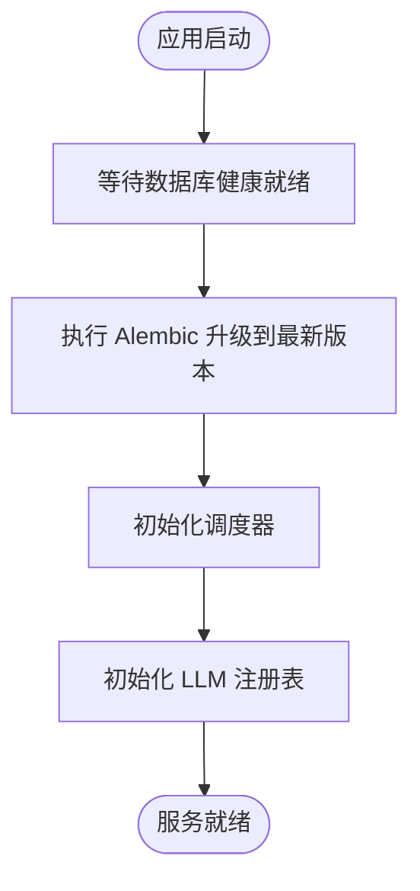

# 快速开始

<cite>
**本文引用的文件**
- [README.md](file://README.md)
- [.env.example](file://.env.example)
- [docker-compose.yml](file://docker-compose.yml)
- [Dockerfile](file://Dockerfile)
- [requirements.txt](file://requirements.txt)
- [src/main.py](file://src/main.py)
- [src/shared/config.py](file://src/shared/config.py)
- [src/api/routes.py](file://src/api/routes.py)
- [src/api/health.py](file://src/api/health.py)
- [src/modules/research/presentation/rest/technical_analyst_routes.py](file://src/modules/research/presentation/rest/technical_analyst_routes.py)
- [src/modules/llm_platform/presentation/rest/config_routes.py](file://src/modules/llm_platform/presentation/rest/config_routes.py)
- [scripts/add_llm_config_template.py](file://scripts/add_llm_config_template.py)
- [scripts/test_chat_api.py](file://scripts/test_chat_api.py)
- [alembic/env.py](file://alembic/env.py)
</cite>

## 目录
1. [简介](#简介)
2. [项目结构](#项目结构)
3. [核心组件](#核心组件)
4. [架构总览](#架构总览)
5. [详细组件分析](#详细组件分析)
6. [依赖关系分析](#依赖关系分析)
7. [性能注意事项](#性能注意事项)
8. [故障排查指南](#故障排查指南)
9. [结论](#结论)
10. [附录](#附录)

## 简介
本指南面向首次接触“股票助手”项目的用户，帮助你在最短时间内完成环境准备、一键部署、数据库初始化、健康检查与核心功能验证。你将学会：
- 安装 Docker 与 Docker Compose
- 配置关键环境变量（TUSHARE_TOKEN、LLM/Bocha 等）
- 一键启动应用与数据库，自动执行数据库迁移
- 健康检查与常见验证步骤
- 基本的 API 调用示例（技术分析接口）
- 常见部署问题与解决方案

## 项目结构
该项目采用多模块分层架构，核心目录与职责概览如下：
- 根目录：Docker 化编排、环境变量模板、依赖清单、数据库迁移入口
- src：应用入口与模块化实现（数据工程、LLM 平台、研究分析）
- scripts：LLM 配置模板注入与聊天 API 测试脚本
- tests：单元与集成测试（可选）

图表来源
- [docker-compose.yml](file://docker-compose.yml#L1-L55)
- [Dockerfile](file://Dockerfile#L1-L52)
- [.env.example](file://.env.example#L1-L17)
- [requirements.txt](file://requirements.txt#L1-L16)
- [alembic/env.py](file://alembic/env.py#L1-L94)
- [src/main.py](file://src/main.py#L1-L75)
- [src/api/routes.py](file://src/api/routes.py#L1-L13)
- [src/api/health.py](file://src/api/health.py#L1-L24)

章节来源
- [README.md](file://README.md#L1-L42)
- [docker-compose.yml](file://docker-compose.yml#L1-L55)
- [Dockerfile](file://Dockerfile#L1-L52)
- [.env.example](file://.env.example#L1-L17)
- [requirements.txt](file://requirements.txt#L1-L16)
- [alembic/env.py](file://alembic/env.py#L1-L94)
- [src/main.py](file://src/main.py#L1-L75)
- [src/api/routes.py](file://src/api/routes.py#L1-L13)
- [src/api/health.py](file://src/api/health.py#L1-L24)

## 核心组件
- 应用入口与生命周期
  - 应用在启动时初始化调度器与 LLM 注册表，并在关闭时优雅退出
  - CORS 中间件按配置启用，全局异常中间件统一处理错误
- API 路由
  - 路由聚合健康检查、数据工程、LLM 平台、研究分析模块
- 健康检查
  - 提供数据库连通性检测，便于容器编排健康检查
- 数据库迁移
  - 通过 Alembic 在应用启动前升级到最新版本

章节来源
- [src/main.py](file://src/main.py#L1-L75)
- [src/api/routes.py](file://src/api/routes.py#L1-L13)
- [src/api/health.py](file://src/api/health.py#L1-L24)
- [alembic/env.py](file://alembic/env.py#L1-L94)

## 架构总览
下图展示了应用、数据库与外部服务的交互关系，以及启动时序。

图表来源
- [docker-compose.yml](file://docker-compose.yml#L1-L55)
- [Dockerfile](file://Dockerfile#L1-L52)
- [src/main.py](file://src/main.py#L1-L75)
- [alembic/env.py](file://alembic/env.py#L1-L94)

## 详细组件分析

### 环境搭建与一键部署
- 安装要求
  - 需要已安装 Docker 与 Docker Compose
- 环境变量配置
  - 复制示例文件并编辑：将 TUSHARE_TOKEN、LLM/Bocha 等关键参数按需填写
- 一键启动
  - 构建镜像并以后台方式启动，自动执行数据库迁移
- 日志查看
  - 实时查看应用日志，定位启动问题
- 停止与清理
  - 停止服务；如需删除数据卷，配合 `-v` 参数

章节来源
- [README.md](file://README.md#L3-L23)
- [.env.example](file://.env.example#L1-L17)
- [docker-compose.yml](file://docker-compose.yml#L1-L55)

### 健康检查与验证
- 健康检查端点
  - GET 请求访问健康检查接口，确认数据库连通性
- 容器健康检查
  - 应用与数据库均配置健康检查策略，便于 Compose 自动重启与状态监控
- 健康检查流程

图表来源
- [src/api/health.py](file://src/api/health.py#L1-L24)
- [src/api/routes.py](file://src/api/routes.py#L1-L13)
- [docker-compose.yml](file://docker-compose.yml#L23-L28)

### 技术分析接口使用
- 接口路径与参数
  - 路径：GET /api/v1/research/technical-analysis
  - 参数：ticker（必填，如 000001.SZ）、analysis_date（可选，默认当天）
- 返回内容要点
  - 包含信号、置信度、总结理由、关键技术位、风险提示
  - 响应体还包含输入、技术指标快照、模型原始输出（由代码填充）
- 使用前提
  - 需先同步目标标的的日线数据，并在 LLM 平台配置可用模型，否则可能出现 422/500

章节来源
- [README.md](file://README.md#L25-L41)
- [src/modules/research/presentation/rest/technical_analyst_routes.py](file://src/modules/research/presentation/rest/technical_analyst_routes.py#L1-L77)

### LLM 平台配置与聊天测试
- 配置管理
  - 通过 LLM 平台配置接口创建/更新/删除模型配置，并手动刷新注册表
- 配置模板注入脚本
  - 提供向 LLM 平台添加示例配置（如 DeepSeek-V3、Qwen3-8B）的脚本
- 聊天接口测试
  - 通过脚本测试聊天接口，支持按别名或标签路由到不同模型

章节来源
- [src/modules/llm_platform/presentation/rest/config_routes.py](file://src/modules/llm_platform/presentation/rest/config_routes.py#L1-L145)
- [scripts/add_llm_config_template.py](file://scripts/add_llm_config_template.py#L1-L72)
- [scripts/test_chat_api.py](file://scripts/test_chat_api.py#L1-L37)

### 数据库迁移与启动顺序
- 迁移入口
  - Alembic 从应用配置读取数据库连接，支持离线与在线两种模式
- 启动顺序
  - 应用容器依赖数据库健康就绪后才启动，避免启动即失败
- 迁移流程

图表来源
- [docker-compose.yml](file://docker-compose.yml#L17-L20)
- [alembic/env.py](file://alembic/env.py#L67-L94)
- [src/main.py](file://src/main.py#L21-L36)

## 依赖关系分析
- 运行时依赖
  - Python 运行时、FastAPI、Uvicorn、SQLAlchemy 异步、Alembic、Pydantic Settings、日志与 HTTP 客户端等
- 容器镜像
  - 分阶段构建：构建阶段安装系统与 Python 依赖，运行阶段仅保留运行时所需包
- 网络与存储
  - 应用与数据库通过自定义网络通信；数据库数据持久化至命名卷

章节来源
- [requirements.txt](file://requirements.txt#L1-L16)
- [Dockerfile](file://Dockerfile#L1-L52)
- [docker-compose.yml](file://docker-compose.yml#L49-L55)

## 性能注意事项
- 数据同步批大小与重试策略
  - 日线与财务数据同步的批大小、增量缺失限制与失败重试次数可在模块配置中调整
- LLM 路由与优先级
  - 通过配置优先级与标签实现模型路由，建议根据场景选择合适模型以平衡速度与质量
- 端口占用
  - 默认应用端口为 8000，数据库端口为 5432；若被占用请在 Compose 中映射到其他端口

章节来源
- [src/modules/data_engineering/infrastructure/config.py](file://src/modules/data_engineering/infrastructure/config.py#L10-L27)
- [src/modules/llm_platform/infrastructure/config.py](file://src/modules/llm_platform/infrastructure/config.py#L10-L26)
- [docker-compose.yml](file://docker-compose.yml#L5-L34)

## 故障排查指南
- 端口冲突
  - 现象：启动报错或无法访问
  - 处理：修改 Compose 中的端口映射，避免与本地服务冲突
- 网络连接
  - 现象：健康检查失败、数据库连接异常
  - 处理：确认数据库容器健康状态、网络连通性；检查 .env 中数据库连接参数
- 权限问题
  - 现象：容器内写入失败或权限不足
  - 处理：确认数据卷权限与用户映射；必要时以非 root 用户运行并修正权限
- LLM/Bocha 配置缺失
  - 现象：技术分析接口返回 422/500
  - 处理：先在 LLM 平台配置可用模型，再执行技术分析；或使用脚本注入示例配置
- Tushare 访问
  - 现象：数据同步失败或额度不足
  - 处理：确保 TUSHARE_TOKEN 正确且账户有效；关注请求频率限制

章节来源
- [README.md](file://README.md#L19-L23)
- [src/api/health.py](file://src/api/health.py#L18-L23)
- [src/modules/llm_platform/presentation/rest/config_routes.py](file://src/modules/llm_platform/presentation/rest/config_routes.py#L85-L101)
- [scripts/add_llm_config_template.py](file://scripts/add_llm_config_template.py#L52-L66)
- [.env.example](file://.env.example#L12-L17)

## 结论
按照本指南完成环境准备与一键部署后，你将拥有一个可运行的股票助手服务。建议先完成数据库迁移与 LLM 配置，再进行技术分析与数据同步验证，逐步熟悉各模块能力与接口行为。

## 附录
- 快速命令摘要
  - 复制并编辑环境变量文件
  - 构建并启动（含数据库与迁移）
  - 查看应用日志
  - 停止与清理
- 健康检查与 API 文档
  - 健康检查：GET /api/v1/health
  - API 文档：/api/v1/docs

章节来源
- [README.md](file://README.md#L7-L23)