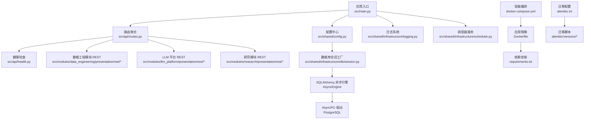
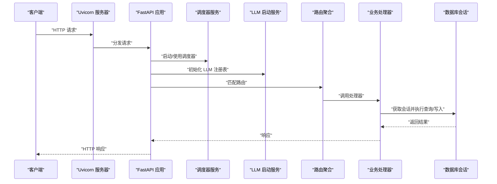
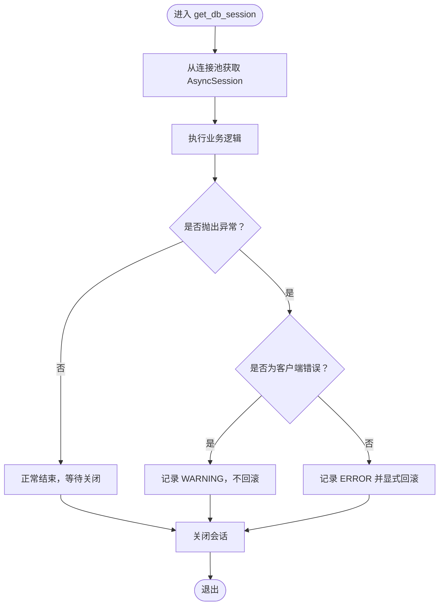
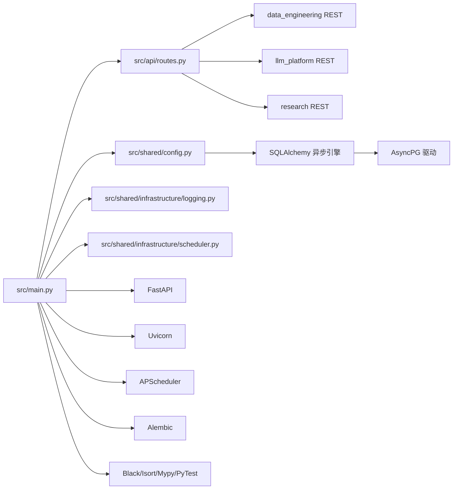

# 技术栈

<cite>
**本文引用的文件**
- [pyproject.toml](file://pyproject.toml)
- [requirements.txt](file://requirements.txt)
- [Dockerfile](file://Dockerfile)
- [docker-compose.yml](file://docker-compose.yml)
- [alembic.ini](file://alembic.ini)
- [src/main.py](file://src/main.py)
- [src/shared/config.py](file://src/shared/config.py)
- [src/shared/infrastructure/db/session.py](file://src/shared/infrastructure/db/session.py)
- [src/shared/infrastructure/scheduler.py](file://src/shared/infrastructure/scheduler.py)
- [src/shared/infrastructure/logging.py](file://src/shared/infrastructure/logging.py)
- [src/api/routes.py](file://src/api/routes.py)
- [.env.example](file://.env.example)
- [src/modules/data_engineering/container.py](file://src/modules/data_engineering/container.py)
- [src/modules/llm_platform/container.py](file://src/modules/llm_platform/container.py)
- [pytest.ini](file://pytest.ini)
</cite>

## 目录
1. [简介](#简介)
2. [项目结构](#项目结构)
3. [核心组件](#核心组件)
4. [架构总览](#架构总览)
5. [详细组件分析](#详细组件分析)
6. [依赖关系分析](#依赖关系分析)
7. [性能考量](#性能考量)
8. [故障排查指南](#故障排查指南)
9. [结论](#结论)
10. [附录](#附录)

## 简介
本项目采用现代化 Python 技术栈，围绕异步高性能 API、异步数据库 ORM、任务调度与容器化部署构建。核心目标是提供稳定、可扩展、可观测的股票数据与研究能力平台。技术选型与实现要点如下：
- Python 3.10+：统一开发与运行时版本，确保新语法与性能特性可用。
- FastAPI：构建高性能、自动生成 OpenAPI 文档的异步 RESTful API。
- SQLAlchemy + AsyncPG：异步 ORM 与数据库驱动，支持高并发连接与连接池预检。
- APScheduler：异步任务调度，支撑周期性数据同步与后台作业。
- Alembic：数据库迁移管理，配合 Docker Compose 一键迁移。
- 开发工具链：Black、Isort、Mypy、PyTest，保障代码风格、类型安全与测试质量。
- 配置管理：.env 环境变量 + Pydantic Settings，模块化配置隔离。
- 容器化：多阶段 Docker 构建 + docker-compose，本地开发与部署一体化。

## 项目结构
项目采用“模块化分层 + 依赖注入”的组织方式，核心入口位于应用主程序，配置集中于共享模块，数据工程、LLM 平台与研究模块分别提供各自的应用服务与基础设施。

图表来源
- [src/main.py](file://src/main.py#L1-L75)
- [src/api/routes.py](file://src/api/routes.py#L1-L13)
- [src/shared/config.py](file://src/shared/config.py#L1-L68)
- [src/shared/infrastructure/db/session.py](file://src/shared/infrastructure/db/session.py#L1-L64)
- [src/shared/infrastructure/scheduler.py](file://src/shared/infrastructure/scheduler.py#L1-L60)
- [docker-compose.yml](file://docker-compose.yml#L1-L55)
- [Dockerfile](file://Dockerfile#L1-L52)
- [alembic.ini](file://alembic.ini#L1-L97)

章节来源
- [src/main.py](file://src/main.py#L1-L75)
- [src/api/routes.py](file://src/api/routes.py#L1-L13)
- [src/shared/config.py](file://src/shared/config.py#L1-L68)
- [src/shared/infrastructure/db/session.py](file://src/shared/infrastructure/db/session.py#L1-L64)
- [src/shared/infrastructure/scheduler.py](file://src/shared/infrastructure/scheduler.py#L1-L60)
- [docker-compose.yml](file://docker-compose.yml#L1-L55)
- [Dockerfile](file://Dockerfile#L1-L52)
- [alembic.ini](file://alembic.ini#L1-L97)

## 核心组件
- 应用入口与生命周期
  - FastAPI 应用实例、CORS 中间件、全局异常处理中间件、启动/关闭事件钩子。
  - 启动时初始化调度器与 LLM 注册表；关闭时优雅停机。
- 配置与环境
  - 使用 Pydantic Settings 从 .env 加载配置，支持动态拼接数据库连接串。
- 数据库与会话
  - SQLAlchemy 异步引擎 + AsyncPG 驱动，连接池预检，依赖注入会话生成器。
- 调度器
  - APScheduler AsyncIOScheduler 封装，提供单例、启动与优雅关闭。
- 日志系统
  - 拦截标准 logging 并统一输出至 Loguru，支持 JSON 序列化生产模式。
- REST 路由
  - 路由聚合器统一挂载健康检查与各模块路由。
- 容器化与迁移
  - 多阶段 Docker 构建，compose 启动时自动迁移并运行服务；Alembic 管理数据库演进。

章节来源
- [src/main.py](file://src/main.py#L1-L75)
- [src/shared/config.py](file://src/shared/config.py#L1-L68)
- [src/shared/infrastructure/db/session.py](file://src/shared/infrastructure/db/session.py#L1-L64)
- [src/shared/infrastructure/scheduler.py](file://src/shared/infrastructure/scheduler.py#L1-L60)
- [src/shared/infrastructure/logging.py](file://src/shared/infrastructure/logging.py#L1-L74)
- [src/api/routes.py](file://src/api/routes.py#L1-L13)
- [docker-compose.yml](file://docker-compose.yml#L1-L55)
- [Dockerfile](file://Dockerfile#L1-L52)
- [alembic.ini](file://alembic.ini#L1-L97)

## 架构总览
下图展示应用启动到 API 请求处理的关键流程，以及数据库与外部数据源的交互路径。

图表来源
- [src/main.py](file://src/main.py#L20-L48)
- [src/shared/infrastructure/scheduler.py](file://src/shared/infrastructure/scheduler.py#L27-L59)
- [src/api/routes.py](file://src/api/routes.py#L1-L13)
- [src/shared/infrastructure/db/session.py](file://src/shared/infrastructure/db/session.py#L24-L64)

## 详细组件分析

### FastAPI 与 REST 路由
- 作用：提供高性能异步 API，自动生成 OpenAPI 文档，内置 CORS 与全局异常处理。
- 关键点：
  - 启动事件中初始化调度器与 LLM 注册表。
  - 路由聚合器统一挂载健康检查与各模块路由。
  - 根路由用于快速存活探测。

章节来源
- [src/main.py](file://src/main.py#L14-L75)
- [src/api/routes.py](file://src/api/routes.py#L1-L13)

### 配置管理（Pydantic Settings + .env）
- 作用：集中管理应用配置，支持动态拼接数据库连接串与 CORS 域名解析。
- 关键点：
  - 默认从 .env 文件加载，支持模块化扩展字段。
  - 数据库连接串通过 AsyncPG 方案构建，便于异步访问。
  - CORS 支持逗号分隔字符串与列表两种输入形式。

章节来源
- [src/shared/config.py](file://src/shared/config.py#L8-L68)
- [.env.example](file://.env.example#L1-L17)

### 数据库与会话（SQLAlchemy + AsyncPG）
- 作用：提供异步 ORM 能力与连接池管理，支持预检与异常回滚策略。
- 关键点：
  - 异步引擎创建与连接池配置，开启 pool_pre_ping。
  - 会话工厂与依赖注入函数，自动处理异常与回滚。
  - 业务异常与系统异常区分，避免误回滚。

图表来源
- [src/shared/infrastructure/db/session.py](file://src/shared/infrastructure/db/session.py#L24-L64)

章节来源
- [src/shared/infrastructure/db/session.py](file://src/shared/infrastructure/db/session.py#L1-L64)

### 任务调度（APScheduler AsyncIOScheduler）
- 作用：封装异步任务调度器，提供单例、启动与优雅关闭。
- 关键点：
  - 首次使用时创建 AsyncIOScheduler 实例。
  - 启动失败时记录错误并抛出异常。
  - 关闭时停止所有任务与调度循环。

章节来源
- [src/shared/infrastructure/scheduler.py](file://src/shared/infrastructure/scheduler.py#L1-L60)

### 日志系统（Loguru + 标准 logging 拦截）
- 作用：统一接管标准 logging，支持开发与生产不同输出格式。
- 关键点：
  - 拦截 Handler 将日志转发至 Loguru。
  - 生产环境启用 JSON 序列化，便于日志收集系统解析。
  - 自定义格式包含时间、级别、线程、模块与行号。

章节来源
- [src/shared/infrastructure/logging.py](file://src/shared/infrastructure/logging.py#L1-L74)

### 容器化与部署（Docker + docker-compose）
- 作用：多阶段构建、最小化运行时、健康检查与用户隔离。
- 关键点：
  - 构建阶段安装系统依赖与 Python 依赖，使用 venv。
  - 运行阶段仅复制 venv，安装运行时系统依赖（如 libpq）。
  - compose 启动时先迁移数据库再启动服务，健康检查保障可用性。
  - 健康检查使用 curl 访问 /api/v1/health。

章节来源
- [Dockerfile](file://Dockerfile#L1-L52)
- [docker-compose.yml](file://docker-compose.yml#L1-L55)

### 数据库迁移（Alembic）
- 作用：管理数据库 Schema 演进，配合环境变量与脚本自动化。
- 关键点：
  - 配置文件指定迁移脚本目录与日志级别。
  - compose 启动命令中执行 alembic upgrade head。
  - 可结合 Black 等工具规范迁移脚本格式。

章节来源
- [alembic.ini](file://alembic.ini#L1-L97)
- [docker-compose.yml](file://docker-compose.yml#L17-L17)

### 依赖注入与模块装配（容器）
- 数据工程模块容器：封装日线、财务、股票基础信息、估值日线等 UseCase 的装配。
- LLM 平台容器：封装 LLM 服务、注册表、配置服务与 Web 搜索服务的装配。
- 关键点：
  - 通过 AsyncSession 注入仓储实现，解耦应用层与基础设施层。
  - LLM 容器在需要持久化配置时注入仓库，否则使用内存态。

章节来源
- [src/modules/data_engineering/container.py](file://src/modules/data_engineering/container.py#L1-L59)
- [src/modules/llm_platform/container.py](file://src/modules/llm_platform/container.py#L1-L68)

## 依赖关系分析
- 应用层依赖
  - 主程序依赖配置、日志、调度器与路由聚合。
  - 路由聚合依赖各模块 REST 路由。
- 基础设施层依赖
  - 数据库会话依赖配置与 SQLAlchemy 异步引擎。
  - 调度器依赖 APScheduler AsyncIOScheduler。
- 外部依赖
  - FastAPI、Uvicorn、SQLAlchemy asyncio、AsyncPG、Alembic、Pydantic Settings、Loguru、HTTPX、structlog、python-json-logger、prometheus-client、pandas、tushare、APScheduler、OpenAI。
- 工具链依赖
  - Black、Isort、Mypy、PyTest 通过 pyproject.toml 配置。

图表来源
- [src/main.py](file://src/main.py#L1-L75)
- [src/api/routes.py](file://src/api/routes.py#L1-L13)
- [src/shared/config.py](file://src/shared/config.py#L1-L68)
- [src/shared/infrastructure/db/session.py](file://src/shared/infrastructure/db/session.py#L1-L64)
- [src/shared/infrastructure/scheduler.py](file://src/shared/infrastructure/scheduler.py#L1-L60)
- [requirements.txt](file://requirements.txt#L1-L16)
- [pyproject.toml](file://pyproject.toml#L1-L22)

章节来源
- [requirements.txt](file://requirements.txt#L1-L16)
- [pyproject.toml](file://pyproject.toml#L1-L22)
- [src/main.py](file://src/main.py#L1-L75)
- [src/api/routes.py](file://src/api/routes.py#L1-L13)
- [src/shared/config.py](file://src/shared/config.py#L1-L68)
- [src/shared/infrastructure/db/session.py](file://src/shared/infrastructure/db/session.py#L1-L64)
- [src/shared/infrastructure/scheduler.py](file://src/shared/infrastructure/scheduler.py#L1-L60)

## 性能考量
- 异步优先：使用 FastAPI 异步路由、SQLAlchemy 异步引擎与 AsyncPG 驱动，降低阻塞开销。
- 连接池优化：启用 pool_pre_ping，提升连接有效性与稳定性。
- 任务调度：APScheduler AsyncIOScheduler 与事件循环集成良好，适合周期性任务。
- 日志成本：生产环境启用 JSON 序列化，减少格式化开销；避免在高频路径中产生过多日志。
- 容器体积：多阶段构建与只复制 venv，减小镜像体积并提升启动速度。

## 故障排查指南
- 数据库连接失败
  - 检查 .env 中数据库配置与网络连通性。
  - 确认 compose 中数据库服务已健康就绪后再启动应用。
- 迁移未执行
  - 确认 compose 启动命令中包含 alembic upgrade head。
  - 检查 alembic.ini 中 script_location 与日志配置。
- 调度器无法启动
  - 查看启动日志中 APScheduler 启动失败原因。
  - 确认事件循环与协程上下文正确。
- 日志格式异常
  - 检查 ENVIRONMENT 是否为 prod，生产环境使用 JSON 序列化。
  - 确认拦截 Handler 正常接管标准 logging。
- 测试运行问题
  - 使用 pytest.ini 中的 asyncio 配置，确保异步测试环境一致。

章节来源
- [docker-compose.yml](file://docker-compose.yml#L17-L17)
- [alembic.ini](file://alembic.ini#L1-L97)
- [src/shared/infrastructure/scheduler.py](file://src/shared/infrastructure/scheduler.py#L27-L59)
- [src/shared/infrastructure/logging.py](file://src/shared/infrastructure/logging.py#L65-L74)
- [pytest.ini](file://pytest.ini#L1-L5)

## 结论
本项目以 Python 3.10+ 为基础，结合 FastAPI、SQLAlchemy + AsyncPG、APScheduler、Alembic 与容器化技术，构建了高性能、可观测、可维护的股票数据与研究平台。通过 Pydantic Settings 管理配置、Loguru 统一日志、Black/Isort/Mypy/PyTest 规范开发流程，形成从开发到生产的完整技术闭环。建议在后续迭代中持续关注依赖版本兼容性与安全更新，保持工具链与运行时的同步升级。

## 附录

### 版本与兼容性
- Python：3.10+（开发与运行时）
- FastAPI：异步全功能
- SQLAlchemy：asyncio 支持
- AsyncPG：PostgreSQL 异步驱动
- APScheduler：3.10.4（固定版本）
- Alembic：迁移管理
- Pydantic Settings：环境变量配置
- 日志与监控：Loguru、structlog、python-json-logger、prometheus-client
- 数据处理：pandas、tushare
- LLM：OpenAI、Web 搜索适配

章节来源
- [requirements.txt](file://requirements.txt#L1-L16)
- [pyproject.toml](file://pyproject.toml#L1-L22)
- [Dockerfile](file://Dockerfile#L2-L2)

### 开发工具链
- Black：代码格式化，行宽 88，目标版本 3.10
- Isort：导入排序，配合 Black
- Mypy：类型检查，Python 3.10，警告未使用配置
- PyTest：异步测试，自动事件循环模式

章节来源
- [pyproject.toml](file://pyproject.toml#L1-L22)
- [pytest.ini](file://pytest.ini#L1-L5)