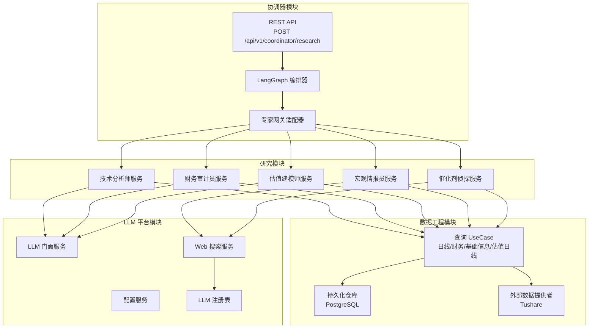
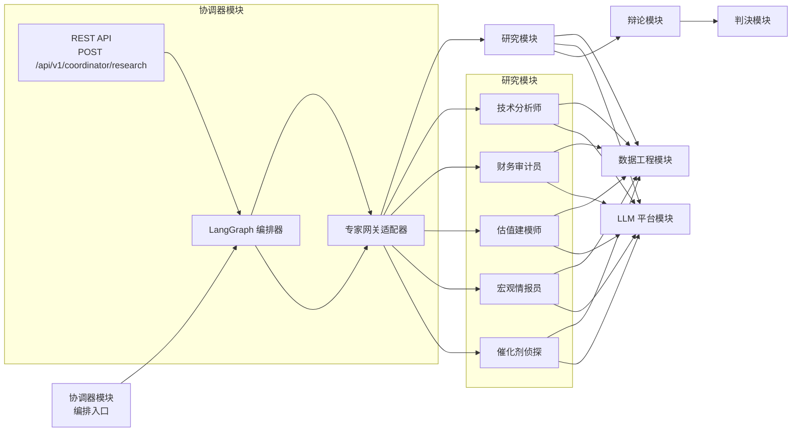
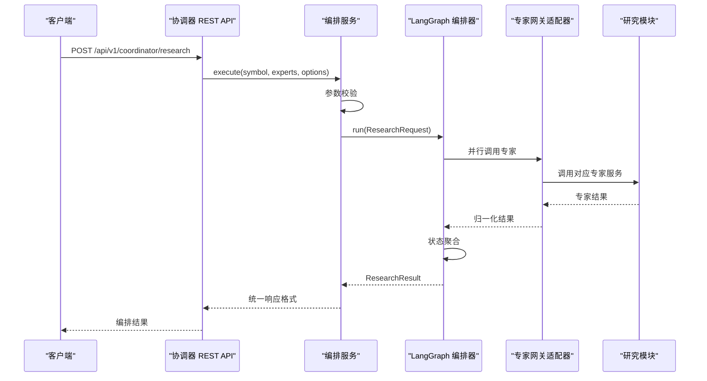
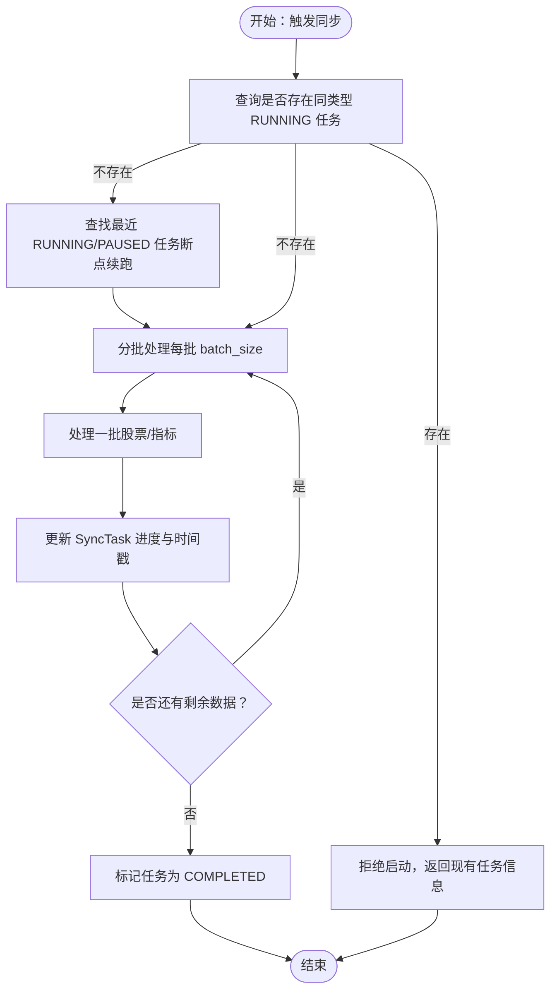
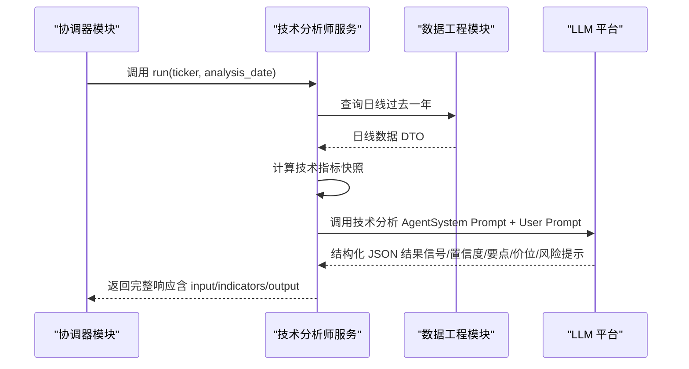
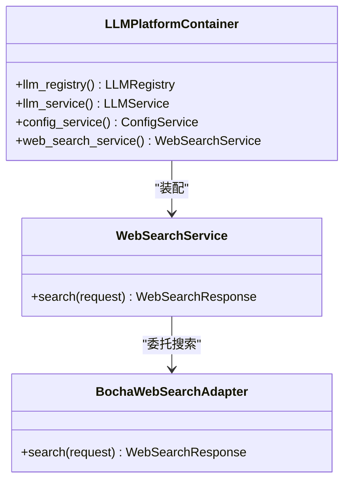
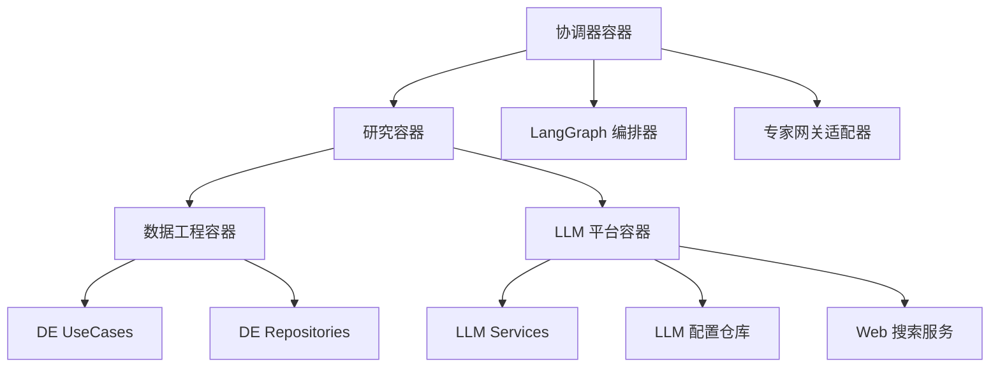

# 核心功能

<cite>
**本文引用的文件**
- [README.md](file://README.md)
- [vision-and-modules.md](file://openspec/specs/vision-and-modules.md)
- [coordinator-research-orchestration/spec.md](file://openspec/specs/coordinator-research-orchestration/spec.md)
- [de-data-sync/spec.md](file://openspec/specs/de-data-sync/spec.md)
- [research-technical-analyst/spec.md](file://openspec/specs/research-technical-analyst/spec.md)
- [container.py（数据工程模块）](file://src/modules/data_engineering/container.py)
- [container.py（LLM 平台模块）](file://src/modules/llm_platform/container.py)
- [container.py（研究模块）](file://src/modules/research/container.py)
- [container.py（协调器模块）](file://src/modules/coordinator/container.py)
- [research_orchestration_service.py](file://src/modules/coordinator/application/research_orchestration_service.py)
- [research_routes.py](file://src/modules/coordinator/presentation/rest/research_routes.py)
- [research_gateway_adapter.py](file://src/modules/coordinator/infrastructure/adapters/research_gateway_adapter.py)
- [langgraph_orchestrator.py](file://src/modules/coordinator/infrastructure/orchestration/langgraph_orchestrator.py)
- [graph_builder.py](file://src/modules/coordinator/infrastructure/orchestration/graph_builder.py)
- [graph_state.py](file://src/modules/coordinator/infrastructure/orchestration/graph_state.py)
- [reducers.py](file://src/modules/coordinator/infrastructure/orchestration/reducers.py)
- [research_expert_gateway.py](file://src/modules/coordinator/domain/ports/research_expert_gateway.py)
- [research_orchestration.py](file://src/modules/coordinator/domain/ports/research_orchestration.py)
- [research_dtos.py](file://src/modules/coordinator/domain/dtos/research_dtos.py)
- [enums.py](file://src/modules/coordinator/domain/model/enums.py)
- [technical_analyst_service.py](file://src/modules/research/application/technical_analyst_service.py)
- [financial_auditor_service.py](file://src/modules/research/application/financial_auditor_service.py)
- [valuation_modeler_service.py](file://src/modules/research/application/valuation_modeler_service.py)
- [web_search_service.py](file://src/modules/llm_platform/application/services/web_search_service.py)
</cite>

## 更新摘要
**所做更改**
- 新增协调器模块章节，详细介绍研究流水线编排层的设计与实现
- 更新架构总览图，加入协调器模块作为编排入口
- 补充协调器模块的四层架构设计（应用、领域、基础设施、表现层）
- 新增 LangGraph 并行执行机制说明
- 更新专家网关适配器的实现细节
- 补充协调器模块的 REST API 接口规范

## 目录
1. [简介](#简介)
2. [项目结构](#项目结构)
3. [核心组件](#核心组件)
4. [架构总览](#架构总览)
5. [详细组件分析](#详细组件分析)
6. [依赖分析](#依赖分析)
7. [性能考虑](#性能考虑)
8. [故障排查指南](#故障排查指南)
9. [结论](#结论)
10. [附录](#附录)

## 简介
本项目面向"AI 原生的虚拟投资团队"，围绕"采集 → 辩论 → 决策"的仿真流程，提供四大核心能力：
- 数据工程模块：负责股票行情与财务数据的采集、处理与持久化，保障"证据驱动"的研究基础。
- 研究分析模块：包含五大专家角色（技术分析师、财务审计员、估值建模师、宏观情报员、催化剂侦探），通过证据与 LLM 的结合生成结构化观点与报告。
- 协调器模块：研究流水线的编排入口，实现专家并行执行和结果聚合，提供统一的 REST API 接口。
- LLM 平台模块：统一管理大语言模型配置与调用，提供 Web 搜索能力，支撑软情报与上下文构建。

项目严格遵循领域驱动设计（DDD）与模块边界约束，模块间通过 Port 与 Application 接口交互，避免跨边界耦合。

## 项目结构
项目采用"模块化 Bounded Context"组织，核心模块与职责如下：
- 数据工程模块：负责日线、财务、股票基础信息与估值日线的接入、转换、存储与查询。
- 研究模块：面向专家角色的应用服务，编排数据工程与 LLM 平台的能力，生成结构化研究报告。
- 协调器模块：作为研究流水线的编排入口，通过 LangGraph 实现专家并行执行和结果聚合。
- LLM 平台模块：提供统一的 LLM 配置管理、路由与 Web 搜索服务。

**图表来源**
- [container.py（协调器模块）](file://src/modules/coordinator/container.py#L20-L36)
- [research_routes.py](file://src/modules/coordinator/presentation/rest/research_routes.py#L65-L112)
- [langgraph_orchestrator.py](file://src/modules/coordinator/infrastructure/orchestration/langgraph_orchestrator.py#L17-L75)

**章节来源**
- [vision-and-modules.md](file://openspec/specs/vision-and-modules.md#L52-L98)

## 核心组件
本节聚焦四大核心功能模块的能力与边界，以及它们之间的协作关系与数据流转。

- 数据工程模块（DE）
  - 能力：提供日线、财务、股票基础信息、估值日线的查询 UseCase；封装外部数据提供者（如 Tushare）与 PostgreSQL 仓库；支持历史全量与增量同步、断点续跑、失败重试、限速收敛、状态持久化。
  - 关键接口：按标的查询日线、按标的查询财务、获取股票基础信息、按标的查询估值日线。
  - 数据一致性：通过同步任务实体与失败记录实体跟踪进度与异常，保证数据采集的可观测与可恢复。

- 协调器模块（Coordinator）
  - 能力：作为研究流水线的编排入口，提供统一的 REST API 接口；通过 LangGraph 实现专家并行执行和结果聚合；支持按需路由、失败隔离与优雅降级。
  - 核心接口：POST /api/v1/coordinator/research，接收 symbol、experts 列表和可选参数，返回编排结果。
  - 并行执行：使用 LangGraph 的 Send API 实现动态 fan-out，并行调用指定的专家服务。
  - 失败处理：单个专家失败不影响整体编排，支持部分成功、全部失败等状态聚合。

- 研究分析模块（Research）
  - 能力：为五大专家角色提供独立的 Application 服务入口，编排数据工程与 LLM 平台能力，生成结构化的分析报告与置信度。
  - 专家角色：
    - 技术分析师：基于预计算技术指标与形态，输出信号、置信度、要点理由、关键价位与风险提示。
    - 财务审计员：基于财务快照，输出财务评分、信号、维度分析、关键风险与风险提示。
    - 估值建模师：基于股票概览、历史估值日线与财务数据，输出估值结论、内在价值区间、关键证据与风险因子。
    - 宏观情报员：结合股票基础信息与 Web 搜索，构建宏观上下文并输出宏观视角。
    - 催化剂侦探：结合股票基础信息与 Web 搜索，构建催化剂上下文并输出潜在催化线索。
  - 证据驱动：所有观点必须引用输入中的指标或数据，不输出交易建议，冲突与背离会降低置信度。

- LLM 平台模块（LLM Platform）
  - 能力：统一管理 LLM 配置与路由，提供 Chat/Completion 统一接口；提供 Web 搜索服务，支持博查搜索适配器。
  - 关键接口：配置服务、LLM 门面服务、Web 搜索服务。
  - 可扩展性：通过适配器模式接入不同厂商的 LLM 与搜索服务，屏蔽底层实现差异。

**章节来源**
- [container.py（协调器模块）](file://src/modules/coordinator/container.py#L20-L36)
- [research_orchestration_service.py](file://src/modules/coordinator/application/research_orchestration_service.py#L11-L74)
- [research_routes.py](file://src/modules/coordinator/presentation/rest/research_routes.py#L25-L112)
- [container.py（数据工程模块）](file://src/modules/data_engineering/container.py#L32-L59)
- [container.py（LLM 平台模块）](file://src/modules/llm_platform/container.py#L24-L68)
- [container.py（研究模块）](file://src/modules/research/container.py#L48-L167)

## 架构总览
研究流水线遵循"编排 → 研究 → 辩论 → 判决"的单向流程，其中协调器模块作为编排入口，研究阶段并行调用五大专家，专家通过 Port 与 Application 接口消费数据工程与 LLM 平台能力，不直接依赖对方模块的内部实现。

**图表来源**
- [coordinator-research-orchestration/spec.md](file://openspec/specs/coordinator-research-orchestration/spec.md#L3-L10)
- [research_routes.py](file://src/modules/coordinator/presentation/rest/research_routes.py#L65-L112)

**章节来源**
- [vision-and-modules.md](file://openspec/specs/vision-and-modules.md#L52-L98)

## 详细组件分析

### 协调器模块（研究流水线编排）
- REST API 接口
  - 提供 POST /api/v1/coordinator/research 端点，支持 symbol、experts 列表和可选参数。
  - 响应体包含 overall_status（completed/partial/failed）和按专家分组的结果。
  - 支持 400（参数错误）、500（全部专家失败）等异常处理。
- LangGraph 编排
  - 使用 StateGraph 构建研究编排图，支持动态 fan-out 并行执行。
  - 通过 Send API 实现按需路由，仅调用用户指定的专家。
  - 状态管理使用 TypedDict + Annotated reducer 实现并行节点结果合并。
- 专家网关适配器
  - 实现 IResearchExpertGateway 接口，通过 ResearchContainer 调用对应专家服务。
  - 支持 CatalystDetectiveAgentResult 归一化为 dict，保证结果类型一致性。
  - 每次专家调用使用独立 AsyncSession，避免 SQLAlchemy 并发错误。
- 失败隔离与优雅降级
  - 单个专家失败不影响整体编排，支持部分成功状态。
  - 所有专家失败时返回 500 错误，提供可区分的错误信息。

**图表来源**
- [research_routes.py](file://src/modules/coordinator/presentation/rest/research_routes.py#L71-L104)
- [research_orchestration_service.py](file://src/modules/coordinator/application/research_orchestration_service.py#L21-L74)
- [langgraph_orchestrator.py](file://src/modules/coordinator/infrastructure/orchestration/langgraph_orchestrator.py#L27-L75)

**章节来源**
- [coordinator-research-orchestration/spec.md](file://openspec/specs/coordinator-research-orchestration/spec.md#L13-L141)
- [research_routes.py](file://src/modules/coordinator/presentation/rest/research_routes.py#L25-L112)
- [research_orchestration_service.py](file://src/modules/coordinator/application/research_orchestration_service.py#L11-L74)
- [research_gateway_adapter.py](file://src/modules/coordinator/infrastructure/adapters/research_gateway_adapter.py#L17-L98)

### 数据工程模块（采集、处理与存储）
- 同步引擎与状态管理
  - 历史全量同步：一次触发、自动分批、断点续跑，支持日线与财务两类历史同步。
  - 增量同步：日线自动补偿缺失日期区间；财务先重试失败记录，再执行披露驱动与缺数补齐。
  - 状态持久化：通过同步任务实体与失败记录实体跟踪进度与异常，支持暂停与恢复。
  - 事务边界：每批使用独立会话与事务，避免长事务占用连接与锁。
- 外部数据接入
  - 通过适配器封装 Tushare API 调用，统一限速策略（最小调用间隔可配置）。
- 查询能力
  - 提供按标的查询日线、财务、股票基础信息、估值日线的 UseCase，供研究模块编排使用。

**图表来源**
- [de-data-sync/spec.md](file://openspec/specs/de-data-sync/spec.md#L37-L55)

**章节来源**
- [de-data-sync/spec.md](file://openspec/specs/de-data-sync/spec.md#L11-L198)
- [container.py（数据工程模块）](file://src/modules/data_engineering/container.py#L32-L59)

### 研究分析模块（专家角色与证据驱动）
- 技术分析师（TA）
  - 输入：目标资产（代码、分析日期、当前价格）与预计算技术指标快照（趋势、动量、量能、形态）。
  - 输出：信号（多/空/中性）、置信度、要点理由、关键价位、风险提示；并附上 LLM 输入、指标快照与原始输出，便于复核。
  - 证据驱动：要点理由必须引用输入中的指标读数，不输出交易建议；冲突与背离会降低置信度。
- 财务审计员（FA）
  - 输入：目标符号与财务记录（默认最近若干期）。
  - 输出：财务评分、信号、置信度、维度分析、关键风险与风险提示；附上 LLM 输入、财务快照与原始输出。
- 估值建模师（VM）
  - 输入：股票概览、历史估值日线（默认 3 年）、财务数据（默认最近若干期）。
  - 输出：估值结论、内在价值区间、关键证据、风险因子与总结；附上 LLM 输入、估值快照与原始输出。
- 宏观情报员与催化剂侦探
  - 通过 Web 搜索构建宏观与催化剂上下文，形成专家视角的结构性输出。

**图表来源**
- [technical_analyst_service.py](file://src/modules/research/application/technical_analyst_service.py#L30-L73)
- [research-technical-analyst/spec.md](file://openspec/specs/research-technical-analyst/spec.md#L27-L77)

**章节来源**
- [technical_analyst_service.py](file://src/modules/research/application/technical_analyst_service.py#L14-L73)
- [financial_auditor_service.py](file://src/modules/research/application/financial_auditor_service.py#L17-L67)
- [valuation_modeler_service.py](file://src/modules/research/application/valuation_modeler_service.py#L20-L94)
- [research-technical-analyst/spec.md](file://openspec/specs/research-technical-analyst/spec.md#L11-L136)

### LLM 平台模块（大语言模型与 Web 搜索）
- LLM 配置与路由
  - 通过配置服务与注册表管理模型配置，统一对外提供 LLM 门面服务。
- Web 搜索
  - 通过 Web 搜索服务封装不同提供商适配器（如博查），屏蔽网络与配置差异；记录搜索前后日志，便于问题定位。
- 专家适配
  - 研究模块通过 LLM 适配器调用统一的 LLM 门面服务，不直接依赖具体适配器实现。

**图表来源**
- [container.py（LLM 平台模块）](file://src/modules/llm_platform/container.py#L24-L68)
- [web_search_service.py](file://src/modules/llm_platform/application/services/web_search_service.py#L12-L57)

**章节来源**
- [container.py（LLM 平台模块）](file://src/modules/llm_platform/container.py#L24-L68)
- [web_search_service.py](file://src/modules/llm_platform/application/services/web_search_service.py#L12-L57)

## 依赖分析
- 模块间依赖方向
  - 协调器模块通过 IResearchOrchestrationPort 和 IResearchExpertGateway 与研究模块解耦。
  - 研究模块仅消费数据工程与 LLM 平台的 Application 接口，不直接依赖对方模块的领域模型或基础设施实现。
  - 研究模块内部通过 Port 与适配器编排数据工程与 LLM 平台能力，确保高内聚低耦合。
- 依赖注入与容器
  - 协调器模块容器负责装配 Gateway Adapter → LangGraph 编排器 → Application Service。
  - 研究模块容器分别持有数据工程与 LLM 平台容器，按需装配专家服务所需的 Port 与适配器。
  - 数据工程与 LLM 平台容器分别封装各自模块的组合根（Composition Root），对外暴露稳定的 Application 能力。

**图表来源**
- [container.py（协调器模块）](file://src/modules/coordinator/container.py#L26-L35)
- [container.py（研究模块）](file://src/modules/research/container.py#L51-L64)
- [container.py（数据工程模块）](file://src/modules/data_engineering/container.py#L35-L40)
- [container.py（LLM 平台模块）](file://src/modules/llm_platform/container.py#L30-L38)

**章节来源**
- [container.py（协调器模块）](file://src/modules/coordinator/container.py#L20-L36)
- [container.py（研究模块）](file://src/modules/research/container.py#L48-L167)
- [container.py（数据工程模块）](file://src/modules/data_engineering/container.py#L32-L59)
- [container.py（LLM 平台模块）](file://src/modules/llm_platform/container.py#L24-L68)

## 性能考虑
- 异步优先与并行执行
  - 协调器模块通过 LangGraph 实现专家并行执行，缩短整体分析时延。
  - 每个专家节点使用独立 AsyncSession，避免 SQLAlchemy 并发错误。
- 事务隔离与批处理
  - 同步引擎每批使用独立会话与事务，减少锁竞争与连接占用。
- 限速与稳定性
  - 外部 API 调用统一收敛至限速策略，避免触发第三方限流；参数可配置，便于根据供应商能力调整。
- 状态持久化与断点续跑
  - 通过同步任务与失败记录持久化，支持崩溃恢复与失败重试，提升整体吞吐与稳定性。
- 失败隔离与优雅降级
  - 单个专家失败不影响整体编排，支持部分成功状态，提升系统鲁棒性。

## 故障排查指南
- 协调器 API 返回 400/500
  - 检查请求体是否包含有效的 symbol 和 experts 列表，确认专家类型在 ExpertType 枚举范围内。
  - 验证 options 参数格式是否正确，特别是 technical_analyst 的 analysis_date 和 financial_auditor 的 limit。
- 协调器 API 返回 500（全部专家失败）
  - 检查研究模块各专家服务是否正常运行，确认数据工程与 LLM 平台配置正确。
  - 查看协调器日志中的异常信息，确认是否有特定专家的错误详情。
- 技术分析接口返回 422/500
  - 检查是否已同步目标标的日线（如通过日线同步接口），并确认 LLM 平台已配置可用模型。
- 财务审计/估值建模提示无财务数据
  - 先通过财务同步接口补齐目标标的财务数据，再执行相应分析。
- Web 搜索失败
  - 检查 LLM 平台配置（如博查 API Key 与 Base URL），确认网络连通性与服务可用性。
- 同步任务卡住或中断
  - 查看同步任务状态与失败记录，确认是否存在未解决的失败记录或限速导致的异常；必要时手动暂停/恢复任务。

**章节来源**
- [coordinator-research-orchestration/spec.md](file://openspec/specs/coordinator-research-orchestration/spec.md#L17-L46)
- [research_routes.py](file://src/modules/coordinator/presentation/rest/research_routes.py#L105-L112)
- [README.md](file://README.md#L25-L41)
- [de-data-sync/spec.md](file://openspec/specs/de-data-sync/spec.md#L95-L118)
- [web_search_service.py](file://src/modules/llm_platform/application/services/web_search_service.py#L42-L46)

## 结论
本项目通过清晰的模块边界与端到端的证据驱动流程，将"数据工程""研究分析""协调器编排""LLM 平台"有机整合，形成可扩展、可观测、可维护的 AI 原生研究体系。新增的协调器模块作为研究流水线的编排入口，通过 LangGraph 实现专家并行执行和结果聚合，提供了统一的 REST API 接口，既满足高频数据采集与处理的需求，又提供结构化、可解释的研究输出，适用于从个股深度研究到宏观与催化剂层面的多维分析场景。

## 附录
- 使用场景与实践案例
  - 协调器 API：通过统一的 REST 接口调用多个专家进行并行分析，支持部分专家失败的优雅降级。
  - 技术分析：对指定股票在某一日进行技术面分析，返回信号、置信度与要点理由，辅助短期交易判断。
  - 财务审计：对目标公司进行财务快照审计，输出财务评分与关键风险，辅助中长期投资决策。
  - 估值建模：基于历史估值日线与财务数据，给出内在价值区间与关键证据，辅助定价与安全边际评估。
  - 宏观情报与催化剂：结合股票基础信息与实时搜索，输出宏观背景与潜在催化线索，辅助择时与主题轮动。

**章节来源**
- [coordinator-research-orchestration/spec.md](file://openspec/specs/coordinator-research-orchestration/spec.md#L22-L106)
- [README.md](file://README.md#L25-L41)
- [research-technical-analyst/spec.md](file://openspec/specs/research-technical-analyst/spec.md#L59-L77)