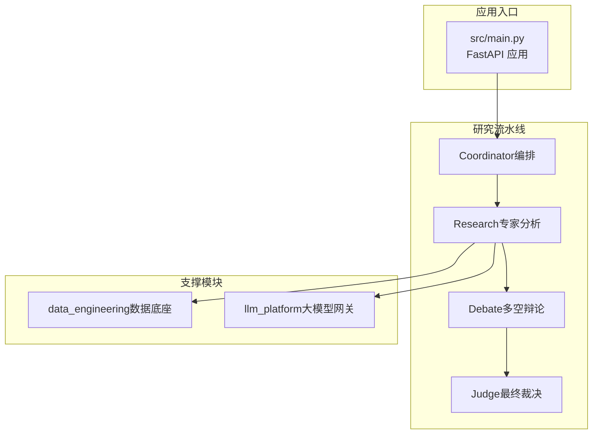
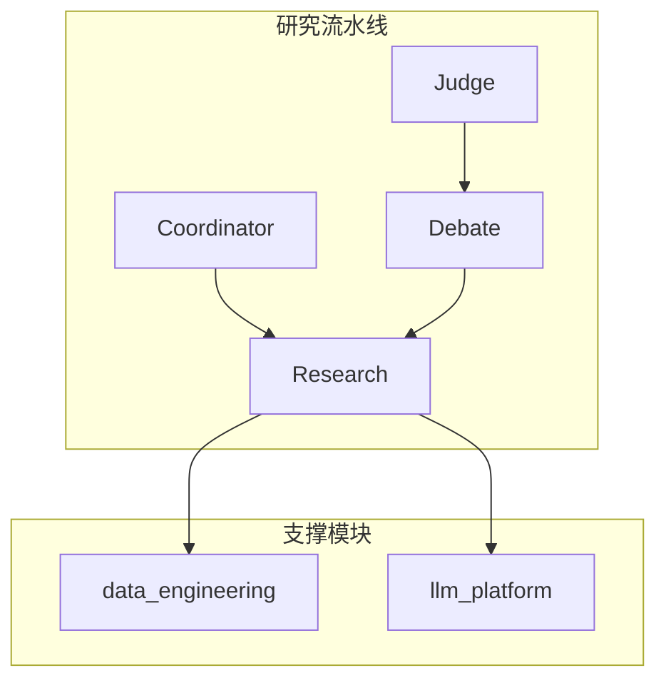
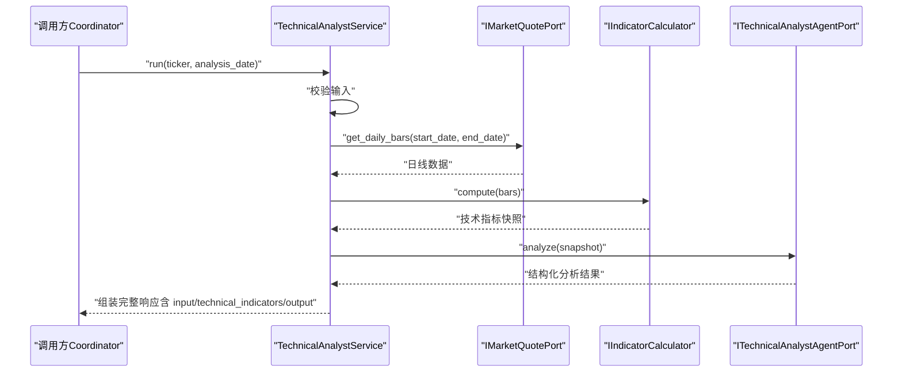
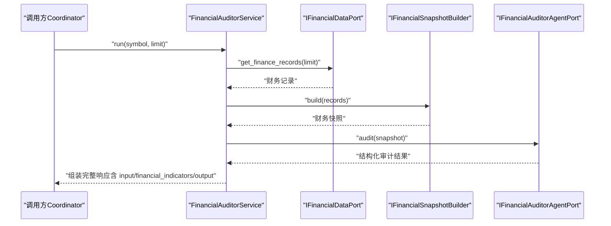
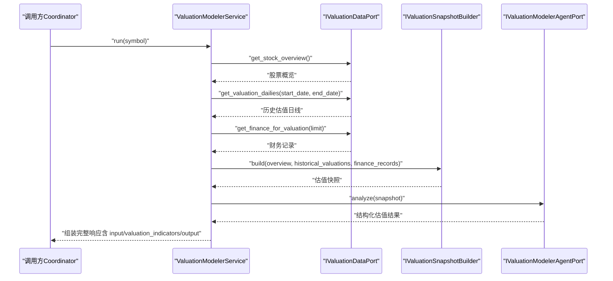
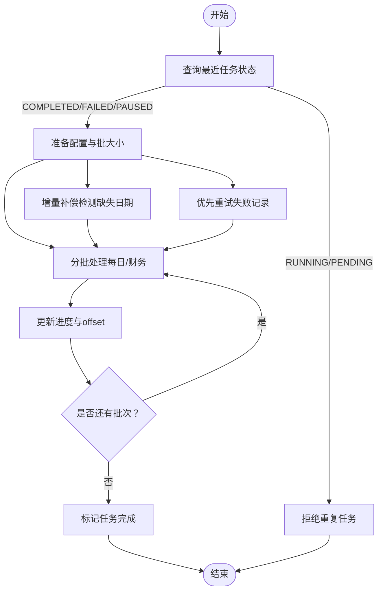
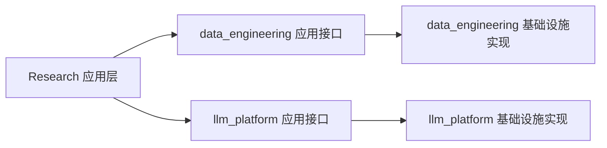

# 项目介绍

<cite>
**本文引用的文件**
- [README.md](file://README.md)
- [vision-and-modules.md](file://openspec/specs/vision-and-modules.md)
- [research-technical-analyst/spec.md](file://openspec/specs/research-technical-analyst/spec.md)
- [de-data-sync/spec.md](file://openspec/specs/de-data-sync/spec.md)
- [tech-standards.md](file://openspec/specs/tech-standards.md)
- [main.py](file://src/main.py)
- [technical_analyst_service.py](file://src/modules/research/application/technical_analyst_service.py)
- [financial_auditor_service.py](file://src/modules/research/application/financial_auditor_service.py)
- [valuation_modeler_service.py](file://src/modules/research/application/valuation_modeler_service.py)
</cite>

## 目录
1. [引言](#引言)
2. [项目结构](#项目结构)
3. [核心组件](#核心组件)
4. [架构总览](#架构总览)
5. [详细组件分析](#详细组件分析)
6. [依赖关系分析](#依赖关系分析)
7. [性能考量](#性能考量)
8. [故障排查指南](#故障排查指南)
9. [结论](#结论)
10. [附录](#附录)

## 引言
Stock Helper 是一个面向专业投资者与金融研究人员的 AI 原生虚拟投资团队平台。项目以“价值为盾，投机为矛”的理念为核心，通过“采集 → 辩论 → 决策”的仿生流程，模拟顶级投研团队的协作与对抗，构建多维度股票研究分析体系：技术分析、财务审计、估值建模，并辅以证据驱动的投资决策系统。系统强调异步优先、证据驱动与对抗决策，采用领域驱动设计（DDD）划分模块边界，确保高内聚、低耦合与可演进。

目标用户包括：
- 专业投资者：需要稳定、可复用的研究流程与证据链支撑
- 研究人员与金融分析师：需要自动化数据处理、标准化分析与可追溯的结论
- 量化与算法团队：需要高质量、结构化的指标与快照数据

创新价值与技术优势：
- AI 辅助的智能投研平台：以 LLM 为“专家”，结合结构化 Prompt 与输出解析，确保可验证、可追溯
- 自动化数据处理：统一的数据同步引擎，支持历史全量、断点续跑、增量补偿与失败重试
- 证据驱动的决策：每个观点均基于硬数据（行情/财务）或软情报（网络搜索），杜绝幻觉
- 对抗式决策：多空辩论引入博弈，降低偏见，提升稳健性

## 项目结构
项目采用模块化与分层架构，围绕四大研究模块与两大支撑模块展开，严格遵循 DDD 的四层结构与端口适配器原则。核心模块包括：
- 研究流水线：Coordinator（编排）→ Research（专家分析）→ Debate（多空辩论）→ Judge（最终裁决）
- 支撑模块：data_engineering（硬数据：行情/财务）、llm_platform（软情报：LLM 能力）

图表来源
- [vision-and-modules.md](file://openspec/specs/vision-and-modules.md#L21-L48)
- [main.py](file://src/main.py#L1-L75)

章节来源
- [vision-and-modules.md](file://openspec/specs/vision-and-modules.md#L74-L88)
- [tech-standards.md](file://openspec/specs/tech-standards.md#L51-L78)

## 核心组件
- 技术分析师（Technical Analyst）：将预计算的技术指标与形态整合为证据驱动的技术面观点，输出信号、置信度、要点价位与风险警示
- 财务审计员（Financial Auditor）：基于财务快照进行维度化评估，输出财务评分、信号与关键风险
- 估值建模师（Valuation Modeler）：结合历史估值日线与财务数据，给出内在价值区间与关键证据
- 数据工程（data_engineering）：提供统一的数据同步引擎，支持历史全量、断点续跑、增量补偿与失败重试
- LLM 平台（llm_platform）：提供统一的 LLM 配置与路由，屏蔽厂商差异，保障可移植性

章节来源
- [research-technical-analyst/spec.md](file://openspec/specs/research-technical-analyst/spec.md#L1-L136)
- [financial_auditor_service.py](file://src/modules/research/application/financial_auditor_service.py#L1-L67)
- [valuation_modeler_service.py](file://src/modules/research/application/valuation_modeler_service.py#L1-L94)
- [de-data-sync/spec.md](file://openspec/specs/de-data-sync/spec.md#L1-L198)

## 架构总览
系统采用“研究流水线 + 支撑模块”的双层架构。研究流水线负责证据采集与观点生成，支撑模块提供数据与 LLM 能力。模块间通信严格通过应用层接口与端口进行，禁止跨模块直接依赖领域模型或基础设施实现。

图表来源
- [vision-and-modules.md](file://openspec/specs/vision-and-modules.md#L21-L48)

章节来源
- [vision-and-modules.md](file://openspec/specs/vision-and-modules.md#L45-L48)
- [tech-standards.md](file://openspec/specs/tech-standards.md#L22-L28)

## 详细组件分析

### 技术分析师组件
技术分析师通过获取日线数据、计算技术指标快照、调用 LLM 生成结构化分析结果，最终输出信号、置信度、要点价位与风险警示。其核心流程如下：

图表来源
- [technical_analyst_service.py](file://src/modules/research/application/technical_analyst_service.py#L30-L72)
- [research-technical-analyst/spec.md](file://openspec/specs/research-technical-analyst/spec.md#L27-L56)

章节来源
- [technical_analyst_service.py](file://src/modules/research/application/technical_analyst_service.py#L14-L73)
- [research-technical-analyst/spec.md](file://openspec/specs/research-technical-analyst/spec.md#L59-L78)

### 财务审计员组件
财务审计员从数据工程模块获取财务记录，构建财务快照，调用审计 Agent 生成维度化评估与风险提示，最终输出财务评分、信号与关键风险。

图表来源
- [financial_auditor_service.py](file://src/modules/research/application/financial_auditor_service.py#L33-L66)

章节来源
- [financial_auditor_service.py](file://src/modules/research/application/financial_auditor_service.py#L17-L67)

### 估值建模师组件
估值建模师获取股票概览、历史估值日线与财务数据，构建估值快照，调用建模 Agent 生成内在价值区间与关键证据，输出估值结论与风险因子。

图表来源
- [valuation_modeler_service.py](file://src/modules/research/application/valuation_modeler_service.py#L37-L93)

章节来源
- [valuation_modeler_service.py](file://src/modules/research/application/valuation_modeler_service.py#L20-L94)

### 数据同步引擎组件
数据同步引擎提供历史全量同步、断点续跑、增量补偿与失败重试能力，确保研究分析所需的硬数据稳定可靠。

图表来源
- [de-data-sync/spec.md](file://openspec/specs/de-data-sync/spec.md#L37-L118)

章节来源
- [de-data-sync/spec.md](file://openspec/specs/de-data-sync/spec.md#L11-L34)
- [de-data-sync/spec.md](file://openspec/specs/de-data-sync/spec.md#L74-L92)
- [de-data-sync/spec.md](file://openspec/specs/de-data-sync/spec.md#L95-L118)

## 依赖关系分析
模块间依赖遵循“应用层接口 + 端口适配器”原则，研究流水线仅通过应用层接口调用支撑模块，不直接依赖其基础设施实现。数据工程与 LLM 平台分别提供只读数据与统一的 LLM 能力，Research 模块通过 Port 获取所需能力。

图表来源
- [vision-and-modules.md](file://openspec/specs/vision-and-modules.md#L45-L48)
- [tech-standards.md](file://openspec/specs/tech-standards.md#L26-L27)

章节来源
- [vision-and-modules.md](file://openspec/specs/vision-and-modules.md#L45-L48)
- [tech-standards.md](file://openspec/specs/tech-standards.md#L26-L27)

## 性能考量
- 异步优先与并行执行：情报采集与研究分析并行，避免串行阻塞，提升吞吐
- 独立事务边界：历史同步每批使用独立会话，减少长事务锁竞争
- 限速收敛：统一收敛至基础设施层，避免业务层散落限速逻辑
- 配置外部化：批大小、起始日期、最大重试等参数可配置，便于按环境调优

章节来源
- [vision-and-modules.md](file://openspec/specs/vision-and-modules.md#L13-L15)
- [de-data-sync/spec.md](file://openspec/specs/de-data-sync/spec.md#L169-L177)
- [de-data-sync/spec.md](file://openspec/specs/de-data-sync/spec.md#L121-L134)
- [de-data-sync/spec.md](file://openspec/specs/de-data-sync/spec.md#L153-L166)

## 故障排查指南
- 技术分析接口返回 422/500：检查是否已同步日线数据与 LLM 配置
- 财务审计/估值建模提示“无财务数据”：先通过数据工程模块同步财务指标
- 增量同步遗漏：系统会自动补偿缺失日期，若仍异常，检查最新交易日期与数据库状态
- LLM 输出解析失败：系统会记录原始输出并抛出领域友好异常，查看日志定位问题

章节来源
- [README.md](file://README.md#L25-L41)
- [technical_analyst_service.py](file://src/modules/research/application/technical_analyst_service.py#L48-L54)
- [financial_auditor_service.py](file://src/modules/research/application/financial_auditor_service.py#L44-L49)
- [valuation_modeler_service.py](file://src/modules/research/application/valuation_modeler_service.py#L64-L67)
- [de-data-sync/spec.md](file://openspec/specs/de-data-sync/spec.md#L74-L92)

## 结论
Stock Helper 以 AI 原生理念重构传统投研流程，通过模块化与标准化的“研究流水线 + 支撑模块”架构，提供可验证、可追溯、可扩展的多维度股票研究分析能力。其证据驱动与对抗式决策的设计，有助于降低偏见、提升稳健性；统一的数据同步与 LLM 能力，确保研究过程的自动化与一致性。对于专业投资者与研究人员而言，这是一个兼具技术深度与实用价值的智能投研平台。

## 附录
- 快速开始与健康检查：参考根 README 的 Docker 运行说明与健康检查端点
- API 文档：访问应用根路径下的交互式文档

章节来源
- [README.md](file://README.md#L1-L42)
- [main.py](file://src/main.py#L65-L75)