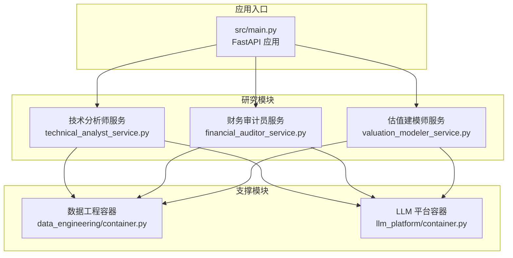
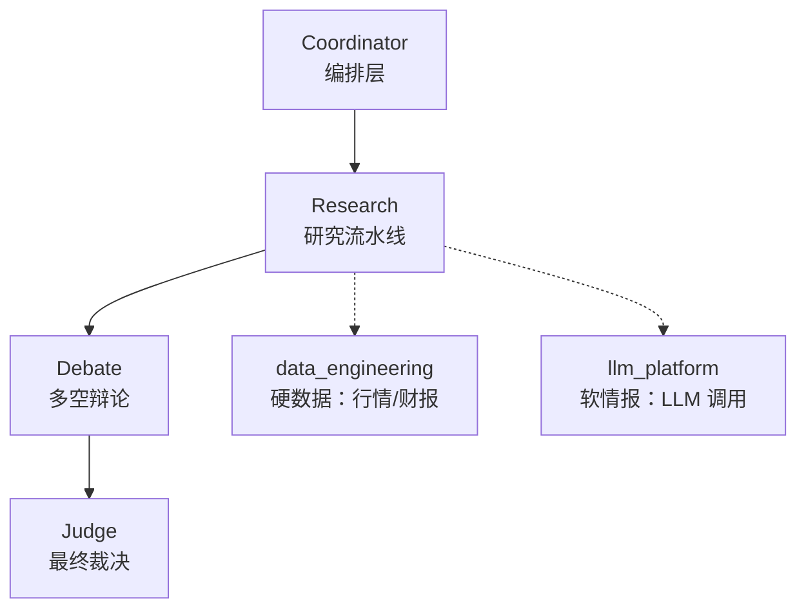
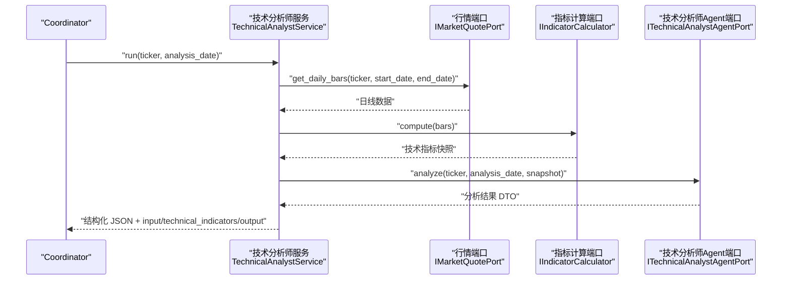
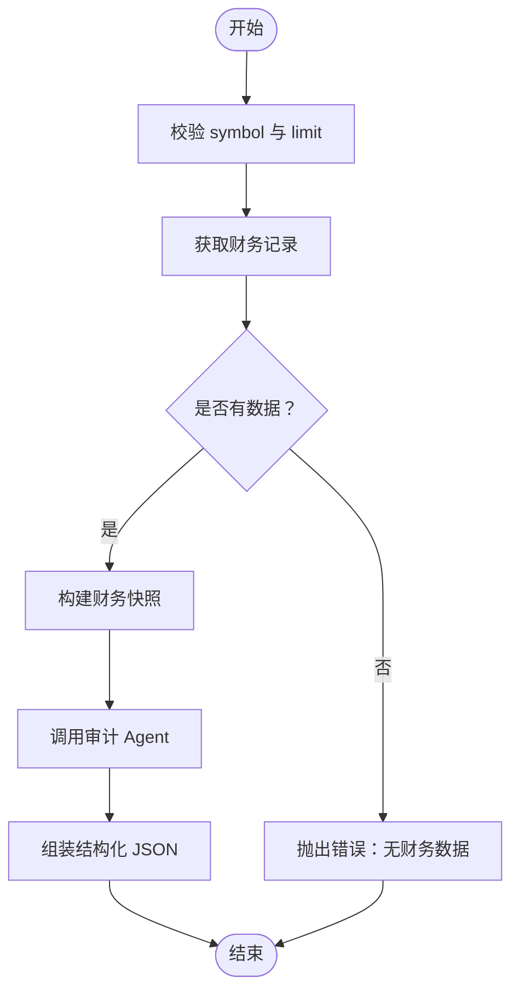
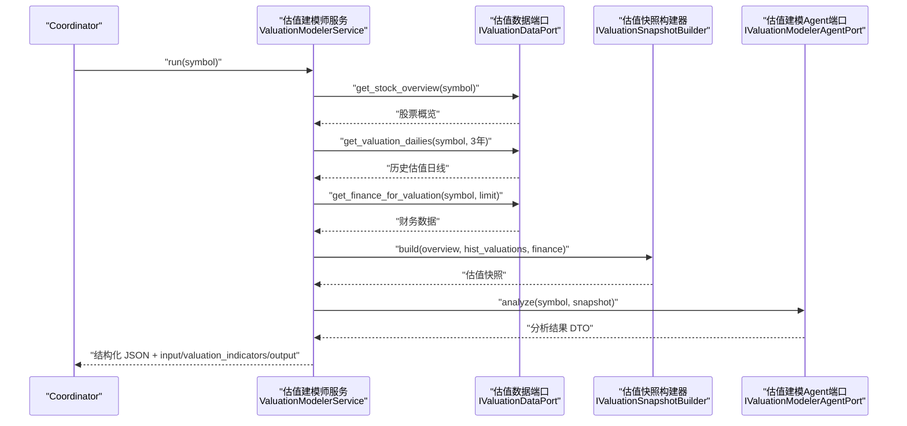
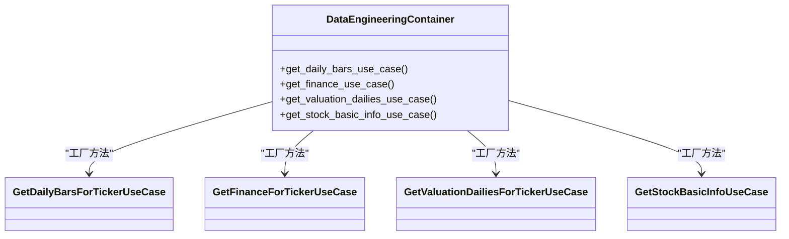
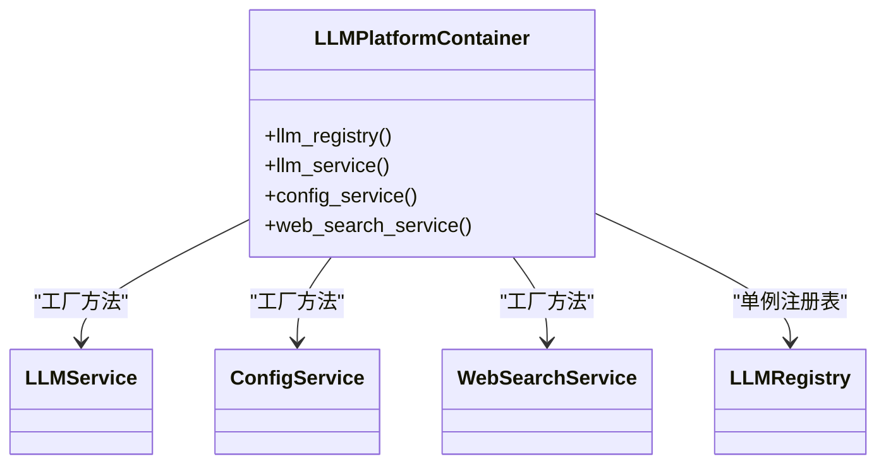
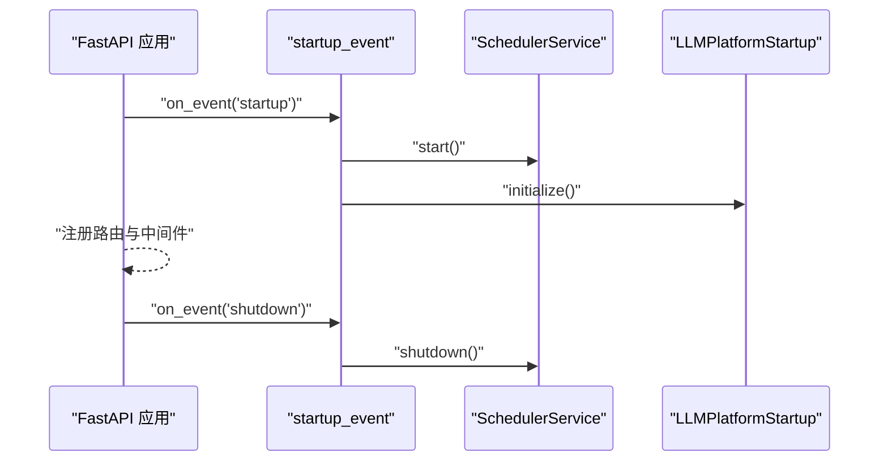
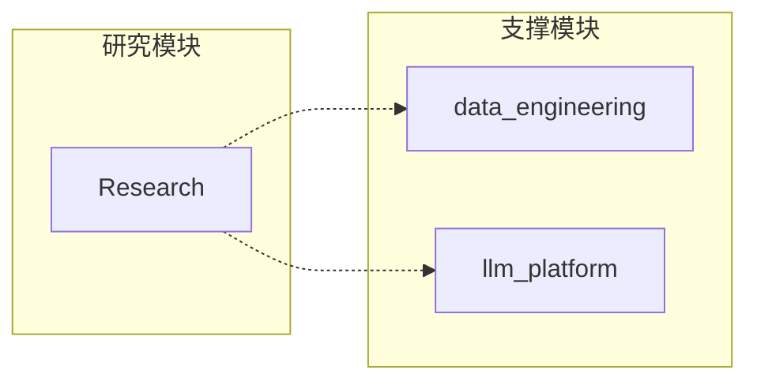

# 项目概述

<cite>
**本文引用的文件**
- [README.md](file://README.md)
- [vision-and-modules.md](file://openspec/specs/vision-and-modules.md)
- [tech-standards.md](file://openspec/specs/tech-standards.md)
- [main.py](file://src/main.py)
- [research-technical-analyst/spec.md](file://openspec/specs/research-technical-analyst/spec.md)
- [technical_analyst_service.py](file://src/modules/research/application/technical_analyst_service.py)
- [financial_auditor_service.py](file://src/modules/research/application/financial_auditor_service.py)
- [valuation_modeler_service.py](file://src/modules/research/application/valuation_modeler_service.py)
- [container.py（数据工程）](file://src/modules/data_engineering/container.py)
- [container.py（LLM 平台）](file://src/modules/llm_platform/container.py)
- [config.py](file://src/shared/config.py)
- [pyproject.toml](file://pyproject.toml)
</cite>

## 目录
1. [引言](#引言)
2. [项目结构](#项目结构)
3. [核心组件](#核心组件)
4. [架构总览](#架构总览)
5. [详细组件分析](#详细组件分析)
6. [依赖关系分析](#依赖关系分析)
7. [性能考量](#性能考量)
8. [故障排查指南](#故障排查指南)
9. [结论](#结论)
10. [附录](#附录)

## 引言
Stock Helper 项目旨在构建“AI 原生（AI-Native）的虚拟投资团队”，以“价值为盾，投机为矛”的理念，通过“采集 → 辩论 → 决策”的仿生流程，模拟顶级投研团队的协作与对抗。系统强调“异步优先、证据驱动、对抗决策”，采用领域驱动设计（DDD）划分四大研究限界上下文（Research、Debate、Judge、Coordinator），并以 data_engineering 与 llm_platform 两大支撑模块提供“硬数据（行情/财报）”与“软情报（LLM 调用）”。

- 目标用户：希望获得系统化、可验证、可解释的多维度股票研究分析与辅助决策支持的专业投资者、研究员与量化分析师。
- 技术价值：以模块化、可测试、可演进的方式，提供证据驱动的研究流水线，降低主观偏见，提升研究效率与一致性。

## 项目结构
项目采用分模块的 DDD 目录结构，核心模块与职责如下：
- data_engineering：负责数据接入、转换、存储与查询，提供股票基础信息、日线行情、财务数据与同步任务调度。
- llm_platform：负责 LLM 配置管理、多厂商路由与统一聊天/搜索接口，屏蔽外部差异。
- research：研究流水线核心，包含多个专家角色（技术分析师、财务审计员、估值建模师等），通过 Application 层接口对外暴露能力。
- shared：共享内核，包含配置、数据库、日志、调度器与通用异常等基础设施。
- api/presentation：FastAPI 路由与 REST 接口，统一对外暴露服务。

图表来源
- [main.py](file://src/main.py#L1-L75)
- [technical_analyst_service.py](file://src/modules/research/application/technical_analyst_service.py#L1-L73)
- [financial_auditor_service.py](file://src/modules/research/application/financial_auditor_service.py#L1-L67)
- [valuation_modeler_service.py](file://src/modules/research/application/valuation_modeler_service.py#L1-L94)
- [container.py（数据工程）](file://src/modules/data_engineering/container.py#L1-L109)
- [container.py（LLM 平台）](file://src/modules/llm_platform/container.py#L1-L78)

章节来源
- [vision-and-modules.md](file://openspec/specs/vision-and-modules.md#L52-L88)
- [tech-standards.md](file://openspec/specs/tech-standards.md#L50-L78)

## 核心组件
- AI 原生虚拟投资团队：由“技术分析师、财务审计员、估值建模师”等专家角色构成，每个专家通过独立 Application 接口对外提供能力，避免职责耦合。
- 证据驱动研究：所有观点必须基于“硬数据（DB）或软情报（搜索）”，杜绝幻觉；输出包含结构化 JSON 与证据链，便于复核与追踪。
- 对抗决策：通过多空辩论引入博弈，降低单一视角偏见，最终由 Judge 综合裁决并给出操作建议。
- 异步优先：数据采集与研究分析并行执行，避免串行阻塞，提升吞吐。

章节来源
- [vision-and-modules.md](file://openspec/specs/vision-and-modules.md#L7-L18)
- [research-technical-analyst/spec.md](file://openspec/specs/research-technical-analyst/spec.md#L75-L88)

## 架构总览
系统采用“研究流水线 + 支撑模块”的双层架构：
- 研究流水线（单向，无回流）：Coordinator → Research → Debate → Judge
- 支撑模块：Research 仅通过 data_engineering、llm_platform 的 Application 接口调用，不直接依赖对方的领域模型或基础设施实现。

图表来源
- [vision-and-modules.md](file://openspec/specs/vision-and-modules.md#L21-L48)

章节来源
- [vision-and-modules.md](file://openspec/specs/vision-and-modules.md#L48-L49)

## 详细组件分析

### 技术分析师（Evidence-Driven Technical Analysis）
- 能力定位：将预计算的技术指标与形态整合为证据驱动的技术面观点，输出结构化 JSON（信号、置信度、要点技术位、风险预警等）。
- 输入契约：目标资产信息（ticker、analysis_date、current_price）与硬数据事实（趋势/均线、动量/震荡、量能、形态识别结果）。
- 输出契约：固定 JSON 结构，包含 signal、confidence、summary_reasoning、key_technical_levels、risk_warning；解析失败将记录日志并抛出领域友好异常。
- 模块内实现：通过 IIndicatorCalculator Port 获取指标快照，通过 ITechnicalAnalystAgentPort 调用分析 Agent；不直接依赖第三方库或基础设施实现。
- 对外接口：独立 Application 层入口（TechnicalAnalystService），供 Coordinator 直接调用，不与其他专家共用入口。

图表来源
- [technical_analyst_service.py](file://src/modules/research/application/technical_analyst_service.py#L30-L73)
- [research-technical-analyst/spec.md](file://openspec/specs/research-technical-analyst/spec.md#L11-L24)
- [research-technical-analyst/spec.md](file://openspec/specs/research-technical-analyst/spec.md#L27-L56)
- [research-technical-analyst/spec.md](file://openspec/specs/research-technical-analyst/spec.md#L59-L72)
- [research-technical-analyst/spec.md](file://openspec/specs/research-technical-analyst/spec.md#L107-L120)

章节来源
- [research-technical-analyst/spec.md](file://openspec/specs/research-technical-analyst/spec.md#L1-L136)
- [technical_analyst_service.py](file://src/modules/research/application/technical_analyst_service.py#L1-L73)

### 财务审计员（Evidence-Driven Financial Audit）
- 能力定位：对目标公司财务数据进行系统性审计，输出财务评分、信号、维度分析、关键风险与风险预警。
- 输入契约：symbol 与可选的历史期数量（limit），要求财务数据非空。
- 输出契约：结构化 JSON，包含 financial_score、signal、confidence、summary_reasoning、dimension_analyses、key_risks、risk_warning。
- 模块内实现：通过 IFinancialDataPort 获取财务记录，IFinancialSnapshotBuilder 构建快照，IFinancialAuditorAgentPort 调用审计 Agent。

图表来源
- [financial_auditor_service.py](file://src/modules/research/application/financial_auditor_service.py#L33-L67)

章节来源
- [financial_auditor_service.py](file://src/modules/research/application/financial_auditor_service.py#L1-L67)

### 估值建模师（Evidence-Driven Valuation Modeling）
- 能力定位：基于股票概览、历史估值日线与财务数据，构建估值快照并输出估值结论、置信度、内在价值区间与关键证据。
- 输入契约：symbol，要求标的存在且财务数据非空；默认获取最近 3 年估值日线。
- 输出契约：结构化 JSON，包含 valuation_verdict、confidence_score、estimated_intrinsic_value_range、key_evidence、risk_factors、reasoning_summary。
- 模块内实现：通过 IValuationDataPort 获取股票概览、历史估值与财务数据，IValuationSnapshotBuilder 构建快照，IValuationModelerAgentPort 调用建模 Agent。

图表来源
- [valuation_modeler_service.py](file://src/modules/research/application/valuation_modeler_service.py#L37-L94)

章节来源
- [valuation_modeler_service.py](file://src/modules/research/application/valuation_modeler_service.py#L1-L94)

### 支撑模块：数据工程（data_engineering）
- 职责边界：数据接入、转换、存储、按需查询、同步任务调度；不参与研究、辩论与决策。
- 对外暴露：通过 Application 层 UseCase（如查询日线、财务、估值日线、股票基础信息）供 Research 调用，不暴露领域模型或基础设施实现。
- 容器模式：DataEngineeringContainer 统一装配仓储与 UseCase，供外部通过 Application 接口获取能力。

图表来源
- [container.py（数据工程）](file://src/modules/data_engineering/container.py#L39-L109)

章节来源
- [container.py（数据工程）](file://src/modules/data_engineering/container.py#L1-L109)

### 支撑模块：LLM 平台（llm_platform）
- 职责边界：LLM 配置管理、多厂商路由、Chat/Completion/Web Search 统一接口；不参与研究、辩论与决策。
- 对外暴露：LLMService、ConfigService、WebSearchService，通过 Application 层服务供 Research 调用。
- 容器模式：LLMPlatformContainer 统一装配注册表与服务，供外部通过 Application 接口获取能力。

图表来源
- [container.py（LLM 平台）](file://src/modules/llm_platform/container.py#L19-L78)

章节来源
- [container.py（LLM 平台）](file://src/modules/llm_platform/container.py#L1-L78)

### 应用入口与启动流程
- FastAPI 应用在启动时初始化调度器与 LLM 平台模块；在关闭时安全关停调度器。
- 全局中间件包括 CORS 与统一异常处理，注册统一 API 路由前缀。

图表来源
- [main.py](file://src/main.py#L21-L48)

章节来源
- [main.py](file://src/main.py#L1-L75)

## 依赖关系分析
- 模块间调用约定：跨模块调用必须通过被调用模块的 Application 接口；禁止跨模块直接依赖或使用对方模块的内部领域模型。
- 研究流水线方向固定：Coordinator → Research（可调 data_engineering、llm_platform）→ Debate → Judge；支撑模块仅作为被调用方。
- 目录与职责映射：新增或归属代码必须落在对应路径下，且不跨模块直接引用基础设施实现。

图表来源
- [vision-and-modules.md](file://openspec/specs/vision-and-modules.md#L48-L49)

章节来源
- [vision-and-modules.md](file://openspec/specs/vision-and-modules.md#L74-L99)

## 性能考量
- 异步优先：数据采集与研究分析并行执行，减少等待时间，提高吞吐。
- 指标预计算：技术指标在基础设施层通过 Port 计算并缓存快照，避免重复计算与耦合。
- 依赖注入与容器：通过容器统一装配仓储与服务，降低模块间耦合，便于替换与扩展。
- 测试与验证：OpenSpec 变更要求可验证性，交付前测试通过，保障性能与稳定性。

## 故障排查指南
- 健康检查：通过健康检查端点确认服务状态。
- API 文档：通过 API 文档查看接口定义与示例。
- 错误处理：统一异常处理中间件捕获异常并返回标准化错误信息。
- 日志规范：关键流程包含入口/出口日志与错误日志，便于追踪根因。

章节来源
- [README.md](file://README.md#L19-L23)
- [main.py](file://src/main.py#L61-L65)
- [tech-standards.md](file://openspec/specs/tech-standards.md#L100-L111)

## 结论
Stock Helper 以 DDD 为核心，构建了“AI 原生虚拟投资团队”的研究流水线，强调证据驱动与对抗决策。通过 data_engineering 与 llm_platform 的支撑，研究模块实现了可验证、可解释、可扩展的多维度股票分析能力。项目在架构、可测试性与可演进性方面具备良好基础，适合进一步扩展为完整的 AI 投研平台。

## 附录
- 快速开始：参考 README 的 Docker 运行说明与 API 示例。
- 技术规范：参考技术规范与 AI 响应协议，了解代码风格、测试约定与验证策略。
- 配置：参考共享配置，了解数据库连接、CORS 与运行环境设置。

章节来源
- [README.md](file://README.md#L1-L42)
- [tech-standards.md](file://openspec/specs/tech-standards.md#L130-L150)
- [config.py](file://src/shared/config.py#L1-L69)
- [pyproject.toml](file://pyproject.toml#L1-L22)