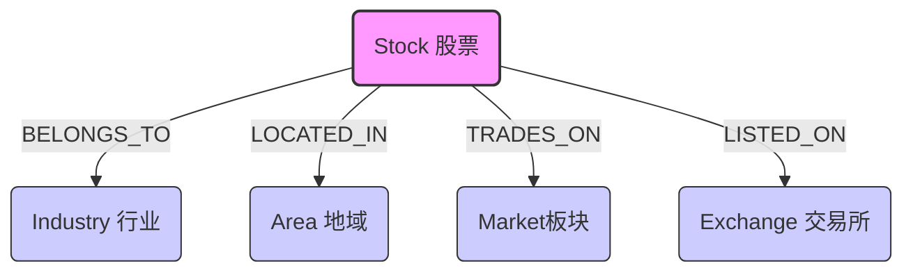

# 知识图谱 (Knowledge Center) 演进路线图

本文档基于 Knowledge Center MVP 版本的现状，收集未来演进方向与灵感，并未具体的实施排期。

## 1. 现状回顾 (MVP Status)

截至目前，我们已完成 Knowledge Center MVP 版本的建设。主要构建了 **"股票基础元数据图谱"**。

### 核心能力
*   **基础连接**：建立了 Stock 与 Industry, Area, Market, Exchange 的关联关系。
*   **财务快照**：Stock 节点集成了 ROE, PE, TotalMV 等核心财务指标。
*   **查询服务**：提供了基于图谱的“邻居查询” (Neighbors) 和“子图遍历” (Sub-graph) 能力。
*   **自动化同步**：实现了全量/增量的数据同步管道。

### 当前图谱结构

---

## 2. 演进原则 (Evolution Principle)

**"数据为王" (Data First Policy)**

我们要明确依赖关系：**所有高级能力（推理、AI、可视化）都依赖于底层数据的丰富度。**

*   **Step 1 (基石)**：丰富图谱实体与关系（数据层）。
*   **Step 2 (应用)**：基于数据开发推理算法、LLMRAG与可视化工具。

---

## 3. 核心路径：数据层建设 (Data Layer Evolution)

这是当前的首要任务。

### 阶段一：概念题材图谱 (Concept & Theme) —— **Current Focus** 🔥
*目标：快速捕捉市场热点，支持"投机为矛"的策略。*

*   **新增实体**：`Concept` (概念/题材，如"低空经济"、"人形机器人")
*   **新增关系**：`(Stock)-[:BELONGS_TO]->(Concept)`
*   **数据源**：结构化财经数据源 (Tushare/AKShare 等)。
*   **业务价值**：
    *   **高敏捷**：题材比行业反应更快，直接对应短期资金流向。
    *   **强关联**：能发现跨行业的隐性关联（如"华为产业链"横跨电子、通信、汽车）。

### 阶段二：供应链图谱 (Supply Chain) —— **Long Term** 🛡️
*目标：构建基本面传导网络，支持"价值为盾"的策略。*

*   **新增实体**：`Company` (非上市关联方), `Product` (核心产品)
*   **新增关系**：
    *   `(Stock)-[:SUPPLIES_TO]->(Stock)` (供应链上下游)
    *   `(Stock)-[:HAS_CUSTOMER]->(Company)` (核心大客户)
*   **数据源**：非结构化挖掘 (研报、招股书、新闻) + 结构化数据库。
*   **业务价值**：
    *   **冲击传导**：模拟原材料涨价、订单变动对产业链的影响。
    *   **风险预警**：识别过度依赖单一客户/供应商的风险。

---

## 4. 未来能力展望 (Future Capabilities)

当数据层建设达到一定密度后，我们将能够解锁以下高级能力。此处作为灵感池 (Idea Pool) 保留。

### 方向 B：增强图谱推理 (Graph Reasoning)
*目标：利用图谱算法发现人类难以直观看到的模式。*

1.  **冲击传导 (Impact Analysis)**
    *   *场景*：原油价格上涨 -> 航空公司成本上升 -> 前瞻性看空航空股利润。
    *   *实现*：基于产业链上下游关系的有向图遍历与权重计算。

2.  **深度相似度 (Deep Similarity)**
    *   *场景*：寻找“不仅同行业，而且业务结构、客户群、财务特征都相似”的股票。
    *   *实现*：基于图结构的 Embedding 或相似度算法（Jaccard/Cosine）。

3.  **中心性分析 (Centrality)**
    *   *场景*：识别产业链中的“隐形冠军”或“卡脖子”环节。
    *   *实现*：PageRank, Betweenness Centrality 算法。

### 方向 C：LLM 融合 (GraphRAG)
*目标：让 LLM “读懂”图谱，增强 Research 和 Debate 模块的深度。*

1.  **Text-to-Graph (知识抽取)**
    *   让 Research 模块在阅读非结构化研报/新闻时，自动提取实体关系写入图谱。
    *   *例*：“A 公司中标了 B 公司的 5 亿大单” -> 创建 `(A)-[中标]->(B)` 关系。

2.  **GraphRAG (图增强生成)**
    *   当用户提问（或 Research 模块分析）时，先检索图谱中的隐性关联，作为 Context 输入 LLM。
    *   *例*：分析宁德时代风险时，系统自动检索其上游矿企的极其依赖关系，提示 LLM 关注上游供给稳定性。

### 方向 D：可视化与交互 (Visualization)
*目标：让知识可见，辅助调试与人工投研。*

*   **交互式探索工具**：开发简单的 Web UI，输入股票代码，动态展示其 2-3 度关系网。
*   **可视化库**：利用 ECharts 或 D3.js 进行前端渲染。
