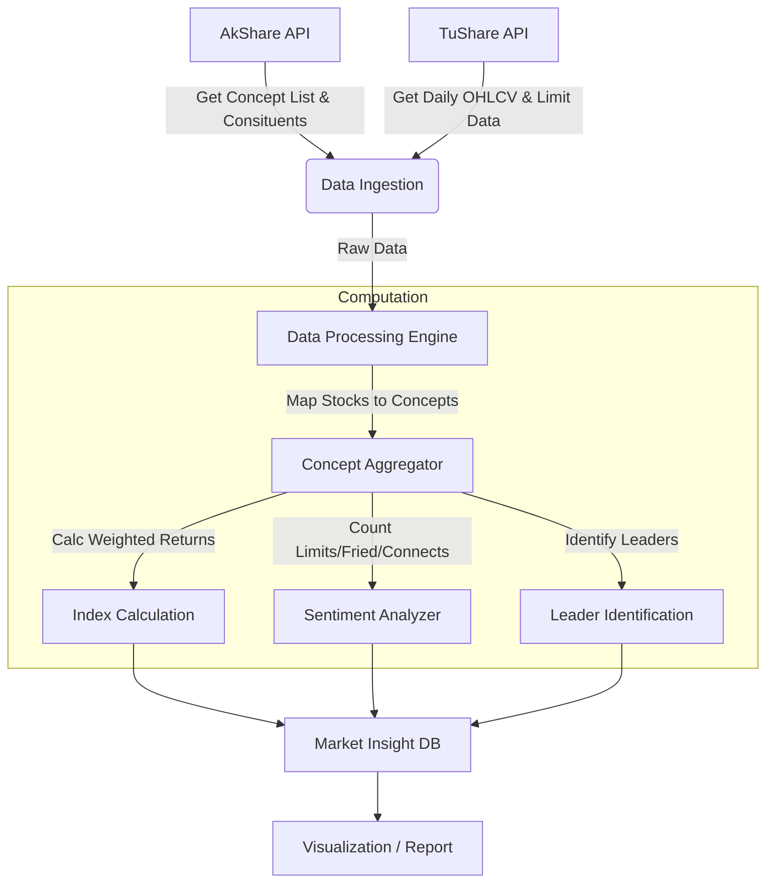

# 市场洞察模块 (Market Insight) - 探索与构思

## 1. 背景与目标 (Context & Objectives)

本模块旨在为**超短线选手 (Ultra-short-term Traders)** 提供**每日复盘 (Daily Review)** 的核心数据支持。通过结合 **AkShare** 的概念板块数据与 **TuShare** 的个股日线数据，构建一套能够反映市场热点、资金流向和情绪周期的洞察系统。

- **核心价值**: 辅助捕捉市场主线，识别情绪周期节点，发现龙头与补涨机会。
- **输入数据**: 
  - AkShare: 概念板块列表、成分股关系。
  - TuShare: 个股日线行情 (Open, High, Low, Close, Vol, Amount, Limit Status)。

## 2. 功能发散与核心指标 (Brainstorming & Metrics)

### 2.1 概念板块指数化 (Concept Indexing)
将概念板块视为一个“虚拟个股”，计算其日线数据。
- **指数计算方式**:
  - **等权平均 (Equal Weighted)**: 简单平均成分股涨跌幅，反映板块整体赚钱效应（不受大市值股干扰）。
  - **流通市值加权 (Float Cap Weighted)**: 反映资金主战场的动向。
- **核心数据**:
  - **板块涨跌幅**: 当日板块整体强度。
  - **板块成交额 (Volume/Amount)**: 资金容量，判断是否为主线（主线通常需要大成交额支撑）。
  - **板块换手率**: 判断筹码交换情况，高潮或分歧的信号。

### 2.2 情绪指标 (Sentiment Indicators)
超短线核心在情绪。需要计算每个概念板块的情绪因子：
- **涨停家数 (Limit Up Count)**: 板块内涨停个股数量，直接反映强度。
- **连板高度 (Max Height)**: 板块内最高连板数（如：5连板），代表板块的空间高度。
- **首板强度**: 最早上板时间，封单金额。
- **炸板率 (Fried Board Rate)**: (炸板家数 / (涨停家数 + 炸板家数))，反映分歧程度。
- **涨跌比 (Up/Down Ratio)**: 上涨家数 vs 下跌家数。
- **晋级率**: 昨日涨停今日持续涨停的比例。

### 2.3 龙头与梯队结构 (Dragon & Tiering)
自动梳理板块内的个股地位：
- **龙一 (Leader)**: 连板最高、封板最早、带动性最强的个股。
- **中军 (Core Trend)**: 市值较大、趋势较好、容量大的个股（通常走趋势）。
- **梯队图 (Ladder)**:
  - 5板: Stock A
  - 4板: Empty
  - 3板: Stock B, Stock C
  - 2板: Stock D...
  - 首板: ...

### 2.4 概念轮动与联动 (Rotation & Correlation)
- **日内联动**: A概念大涨是否导致B概念跳水（跷跷板效应）。
- **历史轮动**: 统计近期最强概念的持续天数（一般主线持续3-5天以上）。

## 3. 架构设计草案 (Architecture Draft)

### 3.1 数据流 (Data Flow)

### 3.2 领域模型 (Domain Model)

- **Concept (概念)**: 
  - ID, Name, Source (AkShare/TuShare)
- **ConceptDaily (概念日线)**:
  - Date, ConceptID
  - Open, High, Low, Close (Index)
  - Vol, Amount
  - UpCount, DownCount, LimitUpCount, FriedCount
  - AvgPrice, TurnoverRate
  - TopStockID (Day's Leader), MaxHeight (Space)

## 4. 关键实现逻辑 (Implementation logic)

### 4.1 数据对齐
AkShare 的概念数据更新频率可能不定，需要每日定时（e.g., 盘后 17:00）全量更新概念成分股。 TuShare 数据作为行情基础。

### 4.2 具体算法
- **Concept Index Close**: `Sum(Stock_Change_Percent) / Count(Stocks)` (简单等权)
- **Dragon Identification**: 
  - Priority 1: `Consecutive Limit Ups` (连板数) desc
  - Priority 2: `First Limit Up Time` (首次封板时间) asc
  - Priority 3: `Amount` (成交额) desc (optional, depending on style)

## 5. 后续迭代 (Next Steps)
- **Step 1**: 构建基础数据管道，跑通 AkShare 概念列表 + TuShare 行情。
- **Step 2**: 计算基础的板块指数和涨停家数。
- **Step 3**: 生成简单的 Markdown 复盘日报。

