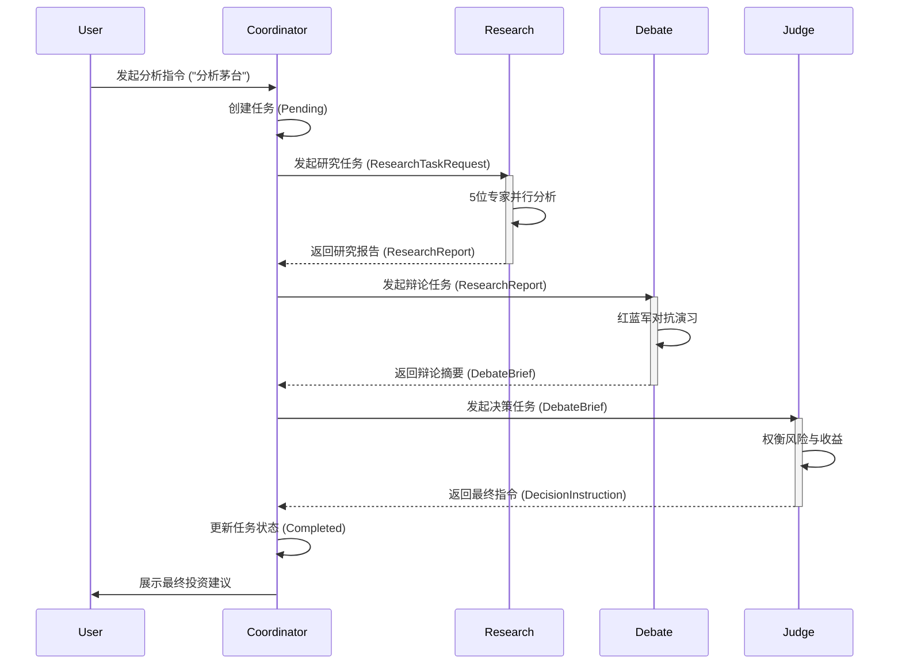

# 研究部门模块架构设计文档

## 1. 核心愿景与架构哲学

本项目旨在构建一个**AI 原生（AI-Native）的虚拟投资团队**，核心哲学为 **“价值为盾，投机为矛”**。
系统通过 **“采集 -> 辩论 -> 决策”** 的仿生流程，模拟人类顶尖投研团队的协作与对抗机制。

架构哲学：
- **异步优先**：情报采集与研究分析必须并行执行，避免串行阻塞。
- **证据驱动**：所有观点必须基于硬数据（DB）或软情报（搜索），杜绝 LLM 幻觉。
- **对抗决策**：通过多空辩论引入博弈机制，降低决策偏见。

为了实现高内聚、低耦合的系统架构，我们遵循 **Domain-Driven Design (DDD)** 原则，将虚拟团队拆分为四个独立的业务模块（Bounded Contexts），分别对应四个职能部门。

---

## 2. 模块划分与职责边界

系统由以下四个核心模块组成，每个模块内部遵循 Presentation / Application / Domain / Infrastructure 四层架构。

### 2.1 指挥部模块 (Coordinator)
- **定位**: 系统的“前台”与流程总管。
- **边界**:
  - 只负责任务创建、流程编排、状态治理与结果汇总。
  - 不做研究分析，不产出多空观点，不进行最终投资决策。
- **职责**:
  - 接收用户指令（如“分析茅台”）。
  - 拆解任务并创建全局唯一的 `ResearchTask`。
  - 编排全流程（Research -> Debate -> Judge）。
  - 监控任务状态与异常处理。
  - 最终结果的汇总与输出。
- **角色**: 流程控制器。

### 2.2 情报局模块 (Research)
- **定位**: 系统的“事实工厂”。
- **边界**:
  - 只产出研究报告与证据链，不参与辩论与最终决策。
  - 不创建研究任务，不直接面向用户输出投资建议。
- **职责**:
  - **并行分析**: 调度 5 位 AI 专家（宏观、财审、估值、催化、技术）并行工作。
  - **证据采集**: 通过端口调用 `data_engineering` 获取硬数据，调用 `llm_platform` 获取软情报。
  - **报告生成**: 输出包含证据链、观点与置信度的结构化 `ResearchReport`。
- **角色**: 宏观分析师、财务审计员、估值建模师、催化剂侦探、技术分析师。
  - 宏观情报员：分析政策与行业景气。
  - 财务审计员：扫描财报异常与盈利质量。
  - 估值建模师：计算 PE/PB 历史分位。
  - 催化剂侦探：搜寻事件驱动与资金信号。
  - 技术分析师：识别趋势结构与量价关系。

### 2.3 辩论团模块 (Debate)
- **定位**: 系统的“观点熔炉”与风控中心。
- **边界**:
  - 只接收研究报告并输出多空观点与风险矩阵。
  - 不重复数据采集与研究，不做最终决策。
- **职责**:
  - **多空对抗**: 基于研究报告，强制生成多头（Bull）与空头（Bear）观点。
  - **风险识别**: 穷尽潜在风险点，生成风险矩阵。
  - **冲突消解**: 识别核心分歧点，输出辩论结论 `DebateOutcome`。
- **角色**: 死多头 (The Bull)、死空头 (The Bear/Risk Officer)。

### 2.4 决策层模块 (Judge)
- **定位**: 系统的“大脑”与最终裁决者。
- **边界**:
  - 只负责最终裁决与风控约束，不回写研究结论。
  - 不生成研究报告，不执行辩论流程。
- **职责**:
  - **综合裁决**: 权衡多空观点，结合用户风险偏好进行决策。
  - **指令生成**: 输出明确的操作指令（买入/卖出/观望）及仓位建议。
  - **风控约束**: 设定止损/止盈位与回撤限制。
- **角色**: 首席投资官 (CIO)。

---

## 3. 项目目录结构

```
stock_helper/
├── src/
│   ├── api/                                # 全局 API 路由聚合
│   ├── modules/
│   │   ├── data_engineering/               # [现有] 数据收集部门模块
│   │   ├── llm_platform/                   # [现有] 大模型调用部门模块
│   │   ├── coordinator/                    # [新增] 指挥部模块
│   │   │   ├── application/                # 流程编排与任务管理
│   │   │   ├── domain/                     # 任务实体与状态流转规则
│   │   │   ├── infrastructure/             # 持久化与适配器
│   │   │   └── presentation/               # 任务控制 API
│   │   ├── research/                       # [新增] 情报局模块
│   │   │   ├── application/                # 并行研究编排
│   │   │   ├── domain/                     # 专家模型与证据实体
│   │   │   ├── infrastructure/             # 报告存储与数据源适配
│   │   │   └── presentation/               # 研究报告 API
│   │   ├── debate/                         # [新增] 辩论团模块
│   │   │   ├── application/                # 辩论流程编排
│   │   │   ├── domain/                     # 对抗规则与论点实体
│   │   │   ├── infrastructure/             # 辩论记录存储
│   │   │   └── presentation/               # 辩论结论 API
│   │   ├── judge/                          # [新增] 决策层模块
│   │   │   ├── application/                # 决策流程编排
│   │   │   ├── domain/                     # 决策规则与指令实体
│   │   │   ├── infrastructure/             # 决策记录存储
│   │   │   └── presentation/               # 决策指令 API
│   │   └── shared/                         # 共享内核
│   └── main.py
```

---

## 4. 模块间交互契约 (DTO)

各模块之间通过明确的 DTO (Data Transfer Object) 进行交互，严禁跨模块直接访问数据库或领域实体。

### 4.1 Coordinator -> Research
**Request**: `ResearchTaskRequest`
- `task_id`: 任务唯一标识
- `target`: 标的（代码/名称）
- `time_window`: 分析时间窗
- `risk_profile`: 用户风险偏好
- `constraints`: 约束条件

### 4.2 Research -> Debate
**Output**: `ResearchReport`
- `task_id`: 任务 ID
- `hard_facts`: 硬数据证据链（财务、行情）
- `soft_intel`: 软情报摘要（新闻、舆情）
- `valuation_view`: 估值分析结论
- `technical_view`: 技术分析结论
- `risks`: 初步风险点
- `confidence_score`: 综合置信度

### 4.2.1 Research 内部输入上下文 (Input Context)
为避免 LLM 幻觉，Research 模块的每个智能体必须接收预处理后的上下文对象。

**示例：技术分析输入**
```
TechnicalContext:
  symbol
  current_price
  ma20
  ma250
  rsi_14
  trend_status
  recent_k_lines
```

### 4.2.2 Research 产出物 (Artifacts)
Research 输出为结构化的独立子报告集合。

**ResearchArtifacts**
- `macro_view`
- `financial_view`
- `valuation_view`
- `catalyst_view`
- `technical_view`

### 4.3 Debate -> Judge
**Output**: `DebateBrief`
- `task_id`: 任务 ID
- `bull_case`: 多头核心逻辑
- `bear_case`: 空头核心逻辑
- `risk_matrix`: 风险矩阵（概率 x 影响）
- `uncertainties`: 核心分歧点
- `net_bias`: 辩论倾向 (Bullish/Bearish)

### 4.4 Judge -> Coordinator
**Output**: `DecisionInstruction`
- `task_id`: 任务 ID
- `action`: 最终指令 (BUY/SELL/HOLD)
- `position_sizing`: 建议仓位 (0-100%)
- `rationale`: 决策核心理由
- `risk_controls`: 风控条款（止损线、最大回撤）
- `confidence_score`: 决策置信度

---

## 5. 核心调用流程 (Workflow)



---

## 6. 最小可用版本 (MVP) 用例清单

为了快速验证架构，建议优先实现以下核心用例：

### Coordinator
- [ ] `CreateAnalysisTask`: 创建并初始化一个股票分析任务。
- [ ] `GetTaskStatus`: 查询任务当前的执行阶段与结果。

### Research
- [ ] `GenerateBasicReport`: 获取基础行情与财务数据，生成简版研究报告。
- [ ] `AnalyzeTechnical`: 简单的技术面分析（均线/趋势）。
- [ ] `SummarizeResearch`: 汇总 5 位分析师的独立结论。

### Debate
- [ ] `GenerateBullBearCases`: 基于研究报告，利用 LLM 生成多空双方观点。

### Judge
- [ ] `MakeSimpleDecision`: 基于多空观点，输出简单的买卖建议。

---

## 7. 依赖与扩展性原则

1. **依赖倒置**: Research/Debate/Judge 模块不直接依赖 `data_engineering` 或 `llm_platform` 的具体实现，而是通过 Domain 层定义的 `Ports` 接口进行交互。
2. **数据隔离**: 每个模块拥有独立的持久化存储（如需要），尽量避免共享数据库表。
3. **接口契约**: 模块间通信严格遵守 DTO 定义，接口变更需保持向后兼容。

---

## 8. 实施路线图

### 阶段一：数据与工具基建
- 确保数据库与行情/财务数据就绪。
- 完成软情报聚合能力（新闻/舆情搜索）。
- 输出可用于智能体的标准化 Input Context。

### 阶段二：研究智能体
- 按“宏观、财审、估值、催化、技术”顺序实现五个研究智能体。
- 每个智能体输出结构化 JSON 子报告，便于聚合。

### 阶段三：模块联调
- Coordinator 调度 Research 并行执行。
- 输出 ResearchArtifacts 给 Debate/Judge 进行后续处理。
