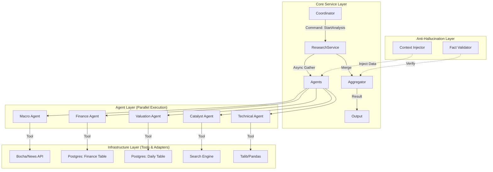

# Alpha-Hunter: 情报局模块 (Research Module) 技术架构设计文档

**文档版本**: 1.0  
**作者**: 资深系统架构师  
**状态**: 待评审  
**最后更新**: 2026-02-10

---

## 1. 模块概要设计

`modules/research` 是 Alpha-Hunter 系统的核心业务域，负责将原始数据（Raw Data）转化为高价值的投资情报（Intelligence）。本模块采用 **异步并行** 架构，模拟一支由 5 位不同领域专家组成的分析师团队。

### 1.1 核心架构图 (Architecture)



### 1.2 输入与输出 (I/O)

- **Input (Command)**:
  - `task_id`: 全局唯一任务 ID。
  - `stock_code`: 股票代码 (如 `600519.SH`)。
  - `analysis_date`: 分析基准日期 (默认 T-1)。
  - `risk_preference`: 风险偏好上下文 (可选)。

- **Output (Artifacts)**:
  - `ResearchReport`: 一个包含 5 个子维度的结构化对象。
  - `ConfidenceScore`: 综合置信度 (0.0 - 1.0)，基于数据完整性计算。
  - `TraceId`: 用于追踪全链路日志。

---

## 2. 智能体角色定义 (Agent Persona Design)

根据“价值为盾，投机为矛”的策略，我们设计以下 5 位专家智能体。

### 2.1 宏观与赛道分析师 (Macro & Sector Analyst)
- **职责**: 分析宏观经济环境、行业政策风向及赛道景气度。回答“现在是不是投资该行业的好时机？”。
- **数据需求**:
  - `search_tool`: 搜索行业新闻、政策文件、券商研报摘要。
  - `macro_db`: 获取 GDP、CPI、行业指数历史走势。
- **输出画像**:
  - `policy_score`: 政策友好度评分 (1-10)。
  - `sector_trend`: 行业趋势 (Rising/Falling/Flat)。
  - `key_drivers`: 核心驱动因素 (List[str])。

### 2.2 财务审计员 (Financial Auditor)
- **职责**: 深度扫描财报，识别“护城河”与“雷区”。回答“这是否是一门好生意？”。
- **数据需求**:
  - `finance_db`: 过去 5 年的营收、净利润、ROE、毛利率、现金流。
  - `dupont_analysis`: 杜邦分析计算器。
- **输出画像**:
  - `quality_score`: 财务质量评分 (1-10)。
  - `growth_rate`: 复合增长率 (CAGR)。
  - `risk_flags`: 财务预警信号 (如“存贷双高”、“现金流恶化”)。

### 2.3 估值建模师 (Valuation Modeler)
- **职责**: 计算历史估值分位，判断当前价格性价比。回答“现在买贵了吗？”。
- **数据需求**:
  - `valuation_db`: PE-TTM, PB, PS 的 3年/5年/10年 历史分位数据。
  - `peer_comparison`: 同行业竞对估值对比。
- **输出画像**:
  - `valuation_status`: 估值状态 (Undervalued/Fair/Overvalued)。
  - `target_price_range`: 理论目标价区间 (保守/中性/乐观)。
  - `margin_of_safety`: 安全边际百分比。

### 2.4 催化剂侦探 (Catalyst Detective)
- **职责**: 捕捉短期事件驱动、资金流向与市场传闻。回答“最近有什么利好/利空？”。
- **数据需求**:
  - `news_search`: 实时新闻、公告。
  - `money_flow`: 北向资金、龙虎榜数据。
- **输出画像**:
  - `sentiment_score`: 情绪评分 (-1.0 to 1.0)。
  - `upcoming_events`: 未来事件 (如“下周发财报”、“重组传闻”)。
  - `money_flow_trend`: 资金流向 (Inflow/Outflow)。

### 2.5 技术图形分析师 (Technical Analyst)
- **职责**: 分析 K 线形态、趋势与量价配合。回答“买卖点在哪里？”。
- **数据需求**:
  - `market_quote_db`: OHLCV 数据。
  - `ta_lib`: 计算 MA, MACD, KDJ, RSI, Bollinger Bands。
- **输出画像**:
  - `trend_signal`: 趋势信号 (Bullish/Bearish/Consolidation)。
  - `support_resistance`: 支撑位与阻力位。
  - `trade_volume_analysis`: 量价关系描述。

---

## 3. 领域模型设计 (Domain Modeling)

### 3.1 核心实体: ResearchTask

```python
from enum import Enum
from datetime import datetime
from pydantic import BaseModel, Field
from typing import List, Optional, Dict

class TaskStatus(str, Enum):
    PENDING = "pending"
    PROCESSING = "processing"
    COMPLETED = "completed"
    FAILED = "failed"
    PARTIAL_SUCCESS = "partial_success"

class ResearchTask(BaseModel):
    task_id: str
    stock_code: str
    status: TaskStatus = TaskStatus.PENDING
    created_at: datetime = Field(default_factory=datetime.now)
    completed_at: Optional[datetime] = None
    artifacts: Optional["ResearchReport"] = None
    error_logs: List[str] = []
    
    def mark_complete(self, report: "ResearchReport"):
        self.status = TaskStatus.COMPLETED
        self.artifacts = report
        self.completed_at = datetime.now()
```

### 3.2 核心值对象: ResearchReport & AgentOutput

```python
class AgentAnalysisBase(BaseModel):
    """所有 Agent 输出的基类"""
    agent_name: str
    summary: str = Field(..., description="一句话核心结论")
    details: str = Field(..., description="详细分析逻辑，Markdown 格式")
    score: float = Field(..., ge=0, le=10, description="该维度的评分 0-10")
    last_updated: datetime = Field(default_factory=datetime.now)

class MacroAnalysis(AgentAnalysisBase):
    policy_direction: str
    sector_climate: str

class FinancialAnalysis(AgentAnalysisBase):
    roe_ttm: float
    risk_warnings: List[str]

class ValuationAnalysis(AgentAnalysisBase):
    pe_percentile: float
    valuation_verdict: str

class CatalystAnalysis(AgentAnalysisBase):
    sentiment: float
    key_events: List[str]

class TechnicalAnalysis(AgentAnalysisBase):
    trend: str
    support_levels: List[float]
    resistance_levels: List[float]

class ResearchReport(BaseModel):
    """最终聚合的研报对象"""
    stock_code: str
    report_date: datetime
    
    # 5 大维度的分析结果
    macro: Optional[MacroAnalysis]
    finance: Optional[FinancialAnalysis]
    valuation: Optional[ValuationAnalysis]
    catalyst: Optional[CatalystAnalysis]
    technical: Optional[TechnicalAnalysis]
    
    # 元数据
    data_completeness: float # 数据完整度 (例如 0.8 表示 4/5 Agent 成功)
    overall_risk_level: str # Low/Medium/High
```

---

## 4. 流程编排设计 (Orchestration)

### 4.1 异步并发流程 (Asyncio Pattern)

我们将使用 `asyncio.gather` 实现并发模式，并配合 `return_exceptions=True` 实现异常熔断。

```python
import asyncio
from typing import List, Dict

class ResearchService:
    def __init__(self, agents: Dict[str, BaseAgent]):
        self.agents = agents # 注入 5 个 Agent 实例

    async def conduct_research(self, stock_code: str) -> ResearchReport:
        # 1. 准备上下文数据 (Context Injection)
        context = await self._prepare_context(stock_code)
        
        # 2. 定义任务列表
        tasks = [
            self.agents['macro'].analyze(context.macro_data),
            self.agents['finance'].analyze(context.finance_data),
            self.agents['valuation'].analyze(context.valuation_data),
            self.agents['catalyst'].analyze(context.catalyst_data),
            self.agents['technical'].analyze(context.technical_data),
        ]
        
        # 3. 并发执行，允许部分失败 (return_exceptions=True)
        results = await asyncio.gather(*tasks, return_exceptions=True)
        
        # 4. 结果聚合与熔断处理
        report = self._aggregate_results(stock_code, results)
        return report

    def _aggregate_results(self, stock_code, results) -> ResearchReport:
        # 遍历 results，区分正常结果和异常
        # 如果是 Exception，记录日志，对应的字段设为 None
        # 计算 data_completeness
        pass
```

### 4.2 异常熔断机制
- **单点故障**: 如果某个 Agent（如催化剂侦探）因网络原因失败，`asyncio.gather` 不会抛出异常中断主流程。系统会记录错误，并在最终报告中将 `catalyst` 字段标记为 `None` 或 `Missing`。
- **降级策略**: 只要核心的 `Finance` 和 `Valuation` 成功，报告即被视为“可用”。如果全部失败，则标记任务为 `FAILED`。

---

## 5. 防幻觉机制设计 (Anti-Hallucination Strategy)

为了杜绝 LLM 编造数据，我们采取 **Context Injection (上下文注入)** + **Output Parsing (输出解析)** 双重验证策略。

### 5.1 Context Injection (Input 侧)
**严禁 Agent 自己去查找数据**（除非是受控的 Search Tool）。所有基础数据（如 PE 值、财务报表、均线价格）必须由 Python 代码从数据库/API 预先拉取，并组装成结构化的 Text/JSON 喂给 LLM。

*Prompt 示例*:
```text
你是一名严谨的财务审计师。
【事实数据】:
- 股票: 贵州茅台 (600519)
- 2023年 ROE: 28.5%
- 2022年 ROE: 29.1%
- 净利润增长率: 15.2%
- 经营现金流/净利润: 1.15

【指令】:
请仅基于上述【事实数据】进行分析。严禁引入上述数据之外的财务指标。
如果数据缺失，请直接回答“数据不足”。
```

### 5.2 Structured Output Parsing (Output 侧)
强制要求 LLM 返回 JSON 格式，并使用 Pydantic 进行严格校验。

- **Schema Validation**: 如果 LLM 返回的 JSON 缺少字段或类型错误（如评分给了 "High" 而不是数字），Pydantic 会抛出校验错误。
- **Retry Mechanism**: 捕获校验错误，将错误信息回传给 LLM 进行一次“自我修正 (Self-Correction)”。
- **Fact Check Rule**: 在后处理阶段，校验 LLM 提及的数字是否在 Input Context 中存在（简单的字符串匹配或数值范围检查）。

---

## 6. 总结

本设计文档构建了一个高并发、强鲁棒性、防幻觉的情报分析模块。
- **架构**: 清晰的 DDD 分层与 Asyncio 并发。
- **策略**: 深度融合价值与投机逻辑。
- **落地**: 提供了详细的 Pydantic 模型与 Prompt 策略，可直接转化为代码。
