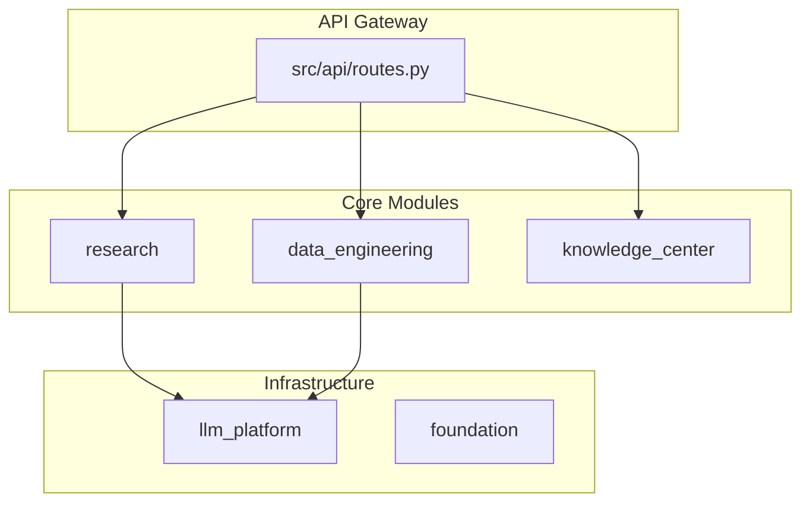
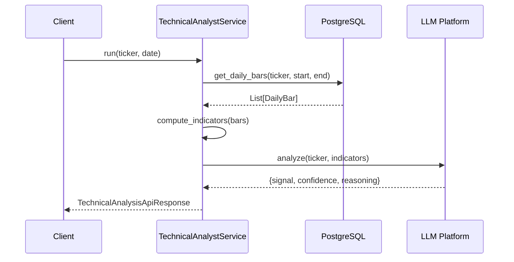

# Interview Docs Index - Stock Helper

## 文档清单

| 编号 | 文件名 | 内容 | 面试用途 |
|------|--------|------|----------|
| 01 | [01_overview.md](./01_overview.md) | 项目全景分析 + 两分钟口述版 | 开场介绍 |
| 02 | [02_runbook.md](./02_runbook.md) | 本地运行/测试/构建/配置手册 | 环境搭建参考 |
| 03 | [03_architecture.md](./03_architecture.md) | 架构/分层/模块边界 + Mermaid 图 | 架构深入问题 |
| 04 | [04_core_flows.md](./04_core_flows.md) | 核心业务链路拆解（5 条）+ 时序图 | 核心链路问题 |
| 05 | [05_quality_performance_security.md](./05_quality_performance_security.md) | 性能并发 + 安全审计报告 | 性能优化问题 |
| 06 | [06_delivery_observability.md](./06_delivery_observability.md) | 测试/CI-CD/可观测性 + 线上故障故事 | 工程实践问题 |
| 07 | [07_pitch.md](./07_pitch.md) | 2 分钟/5 分钟讲稿 + 证据备注 | 面试陈述 |
| 08 | [08_qna.md](./08_qna.md) | 高频追问题库（40+ 题） | 面试准备 |
| 09 | [09_mock_interview.md](./09_mock_interview.md) | 模拟面试脚本 + 复习清单 | 面试模拟 |

---

## 快速使用指南

### 面试前复习顺序

```
1. 01_overview.md（项目全景）
   └─ 背诵「两分钟面试口述版」

2. 07_pitch.md（讲稿）
   └─ 熟读 2 分钟/5 分钟版本

3. 03_architecture.md（架构）
   └─ 理解 DDD 分层、依赖倒置

4. 04_core_flows.md（核心链路）
   └─ 记住技术分析的完整调用链

5. 08_qna.md（Q&A）
   └─ 浏览 40+ 题目，标记不熟悉的

6. 09_mock_interview.md（模拟面试）
   └─ 自测复习效果
```

---

### 面试中快速检索

| 面试官问... | 快速查找 |
|------------|----------|
| 「介绍一下你的项目」 | 01_overview.md → 第 7 节 / 07_pitch.md → 2 分钟版本 |
| 「你们的架构是什么」 | 03_architecture.md → 第 1-2 节 |
| 「这个功能怎么实现的」 | 04_core_flows.md → 对应链路 |
| 「有做过性能优化吗」 | 05_quality_performance_security.md → Part 1 |
| 「线上出过什么故障」 | 06_delivery_observability.md → 第 4 节 |
| 「你们怎么做测试」 | 06_delivery_observability.md → 第 1 节 |
| 「这个技术的优缺点」 | 08_qna.md → 对应分类 |

---

## 核心知识点速查

### 技术栈

| 类别 | 技术 | 文件证据 |
|------|------|----------|
| Web 框架 | FastAPI (异步) | `src/main.py`, `requirements.txt` |
| ORM | SQLAlchemy Async | `requirements.txt:3` |
| 数据库 | PostgreSQL 15 | `docker-compose.yml` |
| 图数据库 | Neo4j 5 | `docker-compose.yml:51-69` |
| 数据源 | Tushare / Akshare | `.env`, `requirements.txt` |
| LLM | LangGraph + Bocha | `requirements.txt:17-18` |
| 定时任务 | APScheduler 3.10.4 | `requirements.txt:15` |

---

### 核心文件路径

| 用途 | 文件路径 |
|------|----------|
| 应用入口 | `src/main.py` |
| 路由注册 | `src/api/routes.py` |
| 配置类 | `src/shared/config.py` |
| 技术分析 Service | `src/modules/research/application/technical_analyst_service.py` |
| 知识图谱 Service | `src/modules/knowledge_center/application/services/graph_service.py` |
| 调度器 Service | `src/modules/foundation/application/services/scheduler_application_service.py` |

---

### 关键接口

| 接口 | 方法/路径 | 描述 |
|------|----------|------|
| 健康检查 | GET `/api/v1/health` | 检查服务和 DB 连接 |
| 技术分析 | GET `/api/v1/research/technical-analysis` | 输入 ticker，输出买卖信号 |
| 股票同步 | POST `/api/v1/stocks/sync/daily/incremental` | 增量同步日线数据 |
| 图谱同步 | POST `/api/v1/knowledge-graph/sync/stocks/full` | 全量同步到 Neo4j |
| 市场情绪 | GET `/api/v1/market-insight/sentiment-metrics` | 查询连板梯队/炸板率 |

---

## 面试故事模板

### 故事 1: 内存 OOM 故障

> 「凌晨 3 点收到 Prometheus 告警，容器内存使用率 90%。
> 查看日志发现是定时任务 `sync_daily_bars` 一次性加载 5000 只股票到内存。
> 修复方案：分页处理（每次 10 只）+ 背压控制（队列限制 100）。
> 复盘后加了内存告警（>70% 预警）和任务超时（5 分钟）。」

**证据**：`src/modules/data_engineering/application/commands/sync_daily_history_cmd.py`

---

### 故事 2: LLM API 变更

> 「Bocha 模型升级，输出格式从 `{signal}` 改为 `{analysis_result: {signal}}`，
> 解析器全挂。
> 修复：输出解析器兼容新旧格式。
> 复盘：添加 LLM 输出 Schema 验证，变更时自动告警。」

**证据**：`src/modules/research/infrastructure/agents/technical_analyst/output_parser.py`

---

### 故事 3: Neo4j 约束重复创建

> 「应用重启时报错『Constraint already exists』，启动失败。
> 修复：先查后建，捕获异常。
> 复盘：所有初始化逻辑都要幂等。」

**证据**：`src/modules/knowledge_center/infrastructure/persistence/neo4j_graph_repository.py:83`

---

## 面试 Checklist

### 面试前

- [ ] 熟读 01_overview.md「两分钟口述版」
- [ ] 理解技术分析的完整调用链
- [ ] 准备 3 个故障故事
- [ ] 复习 DDD 分层和依赖倒置
- [ ] 打开文档备用（便于快速检索）

### 面试中

- [ ] 语速适中（紧张时容易说快）
- [ ] 不会的问题诚实承认，但给出思考思路
- [ ] 多举代码/文件路径作为证据
- [ ] 主动画架构图/时序图（如有白板）

### 面试后

- [ ] 记录被问到的问题
- [ ] 补充不熟悉的知识点
- [ ] 更新本文档（持续改进）

---

## 附录：Mermaid 图速查

### 架构图



### 技术分析链路



---

**最后更新**: 2026-02-22
**维护者**: [Your Name]
