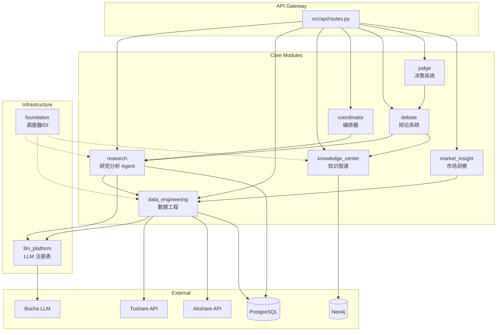
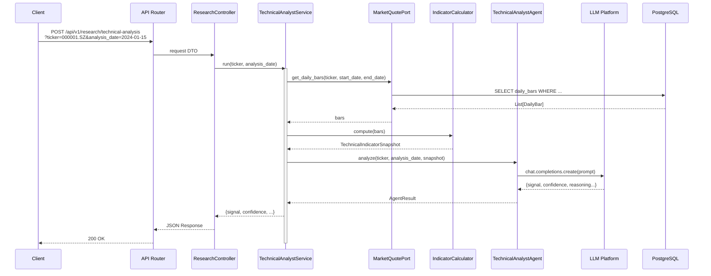

# 架构文档 - Stock Helper

## 1) 分层结构分析

项目采用 **DDD 分层 + 模块化单体** 架构，每个业务模块内部遵循严格的分层边界：

### 分层模型（每个模块内部）

```
┌─────────────────────────────────────────────────────────────┐
│  Presentation Layer (presentation/)                          │
│  - REST API Controllers (FastAPI Router)                     │
│  - Request/Response DTOs (Pydantic)                          │
│  - HTTP 绑定与参数验证                                        │
├─────────────────────────────────────────────────────────────┤
│  Application Layer (application/)                            │
│  - Application Services (业务用例编排)                        │
│  - Command/Query DTOs (CQRS 模式)                            │
│  - 事务边界 (@Transactional 等效)                              │
├─────────────────────────────────────────────────────────────┤
│  Domain Layer (domain/)                                      │
│  - Entities (领域实体)                                       │
│  - Value Objects (值对象)                                    │
│  - Domain Services (领域服务)                                │
│  - Repository Interfaces (仓储接口 - Port)                   │
│  - Domain Exceptions                                         │
├─────────────────────────────────────────────────────────────┤
│  Infrastructure Layer (infrastructure/)                      │
│  - Repository Implementations (Adapter)                      │
│  - External API Clients (Tushare/Akshare/LLM)                │
│  - Database Models (SQLAlchemy)                              │
│  - Message Queue / Scheduler                                 │
│  - DI Container (依赖注入容器)                               │
└─────────────────────────────────────────────────────────────┘
```

### 各层职责与边界

| 层 | 职责 | 依赖方向 | 典型文件 |
|----|------|----------|----------|
| **Presentation** | HTTP 请求处理、参数验证、响应格式化 | → Application | `src/modules/research/presentation/rest/*.py` |
| **Application** | 用例编排、事务管理、DTO 转换 | → Domain | `src/modules/research/application/*_service.py` |
| **Domain** | 核心业务逻辑、领域规则 | 无依赖（纯 Python） | `src/modules/research/domain/entities/*.py` |
| **Infrastructure** | 外部依赖适配、持久化、第三方 API | → Domain (实现 Port) | `src/modules/research/infrastructure/adapters/*.py` |

**依赖规则**: Infrastructure → Domain ← Application ← Presentation（依赖倒置）

---

## 2) 模块/子模块清单

### 核心模块职责

| 模块名 | 职责 | 对外接口 | 依赖方向 |
|--------|------|----------|----------|
| **data_engineering** | 数据同步（日线/财务/概念）、定时任务调度 | POST /api/v1/stocks/sync/* | → llm_platform |
| **research** | 技术分析/财务审计/估值建模 Agent | POST /api/v1/research/* | → data_engineering, llm_platform |
| **knowledge_center** | Neo4j 图数据库操作、概念图谱查询 | GET /api/v1/graph/* | 无外部依赖 |
| **coordinator** | 多 Agent 编排、研究任务调度 | POST /api/v1/coordinator/* | → research 各 Agent |
| **debate** | 多 Agent 辩论系统 | POST /api/v1/debate/* | → research, knowledge_center |
| **judge** | 综合决策输出 | POST /api/v1/judge/* | → debate, research |
| **market_insight** | 市场热度、涨停分析、概念热力 | GET /api/v1/market-insight/* | → data_engineering |
| **llm_platform** | 多 LLM 提供商注册表、模型路由 | 内部服务 | 无外部依赖 |
| **foundation** | 共享基础设施（调度器/DI） | 内部服务 | 无外部依赖 |

### 模块依赖图（Mermaid）



### 坏味道识别

**当前未发现明显的循环依赖**，模块间依赖关系清晰：
- Infrastructure 层通过 Port 接口实现依赖倒置
- 模块间通过容器获取服务，避免直接导入

**潜在改进点**:
1. `coordinator` 模块可能过于臃肿（编排多个 Agent），可考虑拆分为 `orchestration` 子模块
2. `shared/` 目录包含通用基础设施，长期可能膨胀为 `common` 坏味道

---

## 3) 核心请求链路 Sequence Diagram

### 技术分析请求链路



---

## 4) 最重要的 10 个类/接口

| # | 类/接口 | 文件路径 | 为什么重要 | 关键方法 |
|---|---------|----------|------------|----------|
| 1 | `TechnicalAnalystService` | `src/modules/research/application/technical_analyst_service.py` | 核心业务用例编排 | `run()` - 执行完整技术分析流程 |
| 2 | `ITechnicalAnalystAgentPort` | `src/modules/research/domain/ports/technical_analyst_agent.py` | 领域层 Port（依赖倒置） | `analyze()` - Agent 分析接口 |
| 3 | `IMarketQuotePort` | `src/modules/research/domain/ports/market_quote.py` | 领域层 Port（行情数据） | `get_daily_bars()` - 获取日线数据 |
| 4 | `IIndicatorCalculator` | `src/modules/research/domain/ports/indicator_calculator.py` | 领域层 Port（指标计算） | `compute()` - 计算技术指标快照 |
| 5 | `Settings` | `src/shared/config.py` | 全局配置类 | 自动加载环境变量 |
| 6 | `KnowledgeCenterContainer` | `src/modules/knowledge_center/container.py` | Neo4j 依赖注入容器 | `graph_repository()` - 获取图仓储 |
| 7 | `SchedulerService` | `src/modules/foundation/application/services/` | 定时任务调度核心 | `start_scheduler()`, `load_persisted_jobs()` |
| 8 | `ErrorHandlingMiddleware` | `src/api/middlewares/error_handler.py` | 全局异常处理 | 统一错误响应格式 |
| 9 | `LLMRegistry` | `src/modules/llm_platform/infrastructure/registry.py` | 多 LLM 提供商动态注册 | 运行时切换模型 |
| 10 | `JobRegistry` | `src/modules/data_engineering/application/job_registry.py` | 数据同步任务注册 | 任务持久化与加载 |

---

## 5) 面试官追问清单（按模块）

### Research 模块
**追问 1**: 技术指标计算是实时算还是预计算？
- **回答要点**: 实时计算（`TechnicalAnalystService:71` 调用 `IndicatorCalculator.compute()`），每次分析请求都会重新计算；可优化为缓存最近一期结果

**追问 2**: Agent 输出如何保证格式正确？
- **回答要点**: 使用 Pydantic DTO 解析（`research/infrastructure/agents/*/output_parser.py`），解析失败抛 `LLMOutputParseError`

### Data Engineering 模块
**追问 1**: 数据同步如何避免重复？
- **回答要点**: 检查 `job_registry` 表（`application/job_registry.py`），任务执行状态持久化到 DB

**追问 2**: Tushare/Akshare 如何切换？
- **回答要点**: 通过 Port 接口（`IDataSourcePort`），具体实现在 Infrastructure 层（Adapter 模式）

### Knowledge Center 模块
**追问 1**: Neo4j 约束如何保证幂等？
- **回答要点**: `ensure_constraints()` 先查后建（`knowledge_center/infrastructure/neo4j/graph_repository.py`），捕获 `ClientError` 忽略已存在异常

**追问 2**: 图谱数据如何与关系型数据库同步？
- **回答要点**: 从 PostgreSQL 读取（通过 Domain Port），写入 Neo4j，双写一致性靠定时任务保证

### LLM Platform 模块
**追问 1**: 如何支持多 LLM 提供商？
- **回答要点**: 注册表模式（`LLMRegistry`），每个 Provider 实现统一接口，配置从数据库加载

**追问 2**: Token 消耗如何追踪？
- **回答要点**: （需确认）建议在 `LLMRegistry` 中增加埋点，记录每次调用的 `usage` 字段

---

## 6) 架构设计原则总结

1. **依赖倒置 (DIP)**: Domain 层定义 Port 接口，Infrastructure 层实现
2. **单一职责 (SRP)**: 每个 Service 只负责一个用例（如 `TechnicalAnalystService`）
3. **CQRS 分离**: Command（写操作）与 Query（读操作）DTO 分离
4. **端口适配器**: 外部依赖（DB/LLM/第三方 API）通过 Port 接口抽象
5. **依赖注入**: 通过容器（`container.py`）管理服务生命周期，避免硬编码
6. **异步优先**: 所有 IO 操作使用 `async/await`（`asyncpg`, `httpx`）
