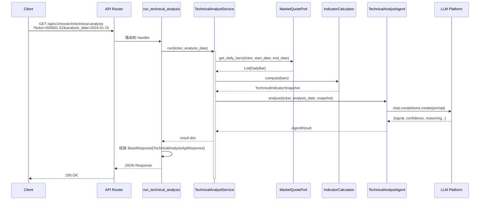
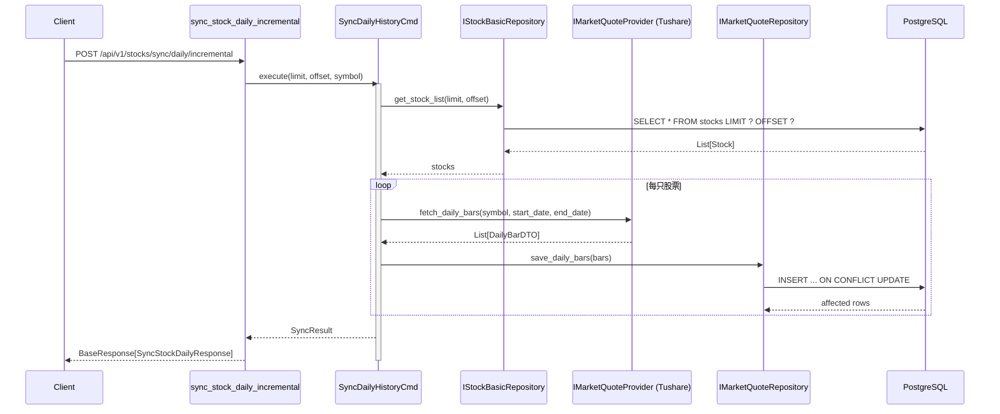
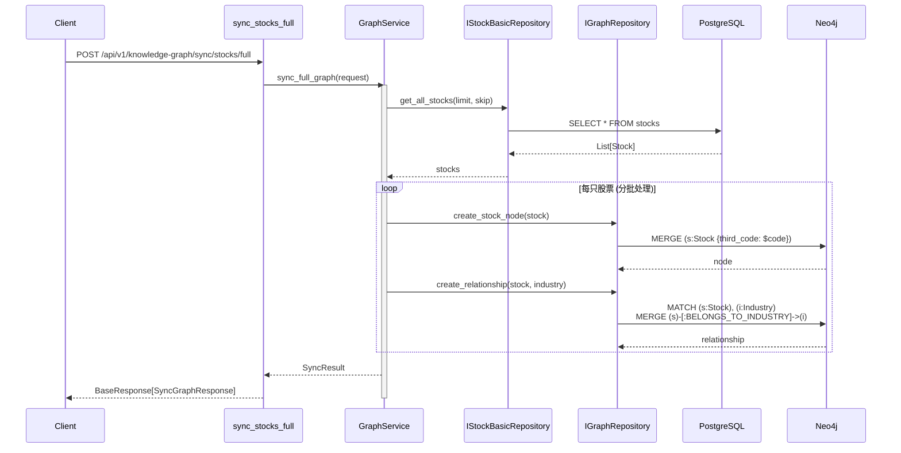
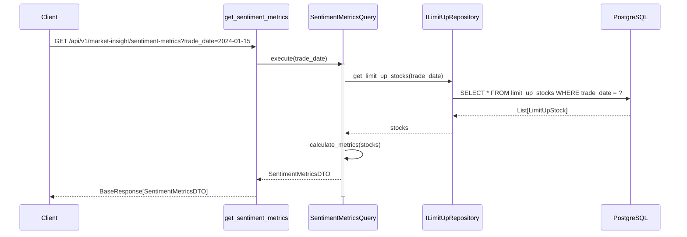
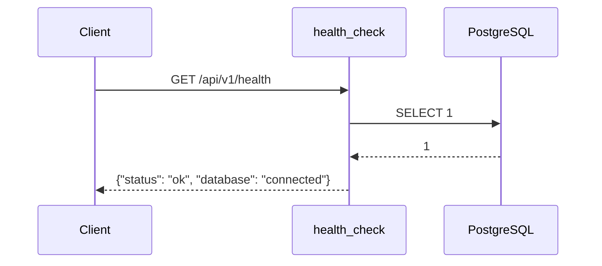

# 核心业务链路文档 - Stock Helper

## 链路 1: 股票技术分析 (`/api/v1/research/technical-analysis`)

### 1) 入口：Controller/Endpoint

**文件**: `src/modules/research/presentation/rest/technical_analyst_routes.py:51-84`

| 属性 | 值 |
|------|-----|
| **HTTP 方法** | GET |
| **路径** | `/api/v1/research/technical-analysis` |
| **请求参数** | `ticker: str` (必填), `analysis_date: Optional[str]` (可选) |
| **响应 DTO** | `BaseResponse[TechnicalAnalysisApiResponse]` |
| **Controller** | `run_technical_analysis()` |

**请求示例**:
```http
GET /api/v1/research/technical-analysis?ticker=000001.SZ&analysis_date=2024-01-15
```

**响应模型** (`technical_analyst_routes.py:34-47`):
```python
class TechnicalAnalysisApiResponse(BaseModel):
    signal: Literal["BULLISH", "BEARISH", "NEUTRAL"]
    confidence: float
    summary_reasoning: str
    key_technical_levels: dict[str, Any]  # 支撑/阻力位
    risk_warning: str
    input: str  # 送入 LLM 的 prompt
    technical_indicators: dict[str, Any]  # 技术指标快照
    output: str  # LLM 原始输出
```

---

### 2) 调用链

```
Controller (technical_analyst_routes.py:70)
    └─> Service.run() (technical_analyst_service.py:38-89)
            ├─> MarketQuotePort.get_daily_bars() (line 53-55)
            ├─> IndicatorCalculator.compute() (line 71)
            └─> TechnicalAnalystAgent.analyze() (line 72-76)
                    └─> LLM Platform.chat() (infrastructure)
```

**关键方法**:

| 步骤 | 类/接口 | 方法 | 文件路径 |
|------|---------|------|----------|
| 1 | `TechnicalAnalystService` | `run()` | `research/application/technical_analyst_service.py:38` |
| 2 | `IMarketQuotePort` | `get_daily_bars()` | `research/domain/ports/market_quote.py` |
| 3 | `IIndicatorCalculator` | `compute()` | `research/domain/ports/indicator_calculator.py` |
| 4 | `ITechnicalAnalystAgentPort` | `analyze()` | `research/domain/ports/technical_analyst_agent.py` |

---

### 3) 数据

**涉及的 Entity/表**:

| 表名 | 用途 | 对应 Entity |
|------|------|-------------|
| `stock_daily_bars` | 存储日线行情数据 | `DailyBar` (domain entity) |
| `stocks` | 股票基础信息 | `Stock` |

**技术指标快照** (`TechnicalIndicatorSnapshot`):
- MA5/MA10/MA20/MA60
- MACD (DIF/DEA/Histogram)
- 布林带 (Upper/Middle/Lower)
- RSI
- 成交量相关指标

---

### 4) 事务与一致性

- **事务边界**: 本链路为只读操作，无 `@Transactional` 需求
- **隔离级别**: 数据库默认（PostgreSQL READ COMMITTED）
- **重试机制**: 无显式重试，LLM 调用失败直接抛异常
- **幂等性**: 天然幂等（只读查询）

---

### 5) 异常与返回

**可能的异常**:

| 异常类型 | HTTP 状态码 | 触发条件 | 处理位置 |
|----------|-------------|----------|----------|
| `BadRequestException` | 400 | ticker 为空/日期未提供/K 线数量不足 | `technical_analyst_routes.py:77-78` |
| `LLMOutputParseError` | 422 | LLM 输出格式解析失败 | `technical_analyst_routes.py:79-81` |
| `Exception` | 500 | 其他未预期异常 | `technical_analyst_routes.py:82-84` |

**全局异常处理**: `src/api/middlewares/error_handler.py`

---

### 6) Sequence Diagram



---

## 链路 2: 股票日线增量同步 (`/api/v1/stocks/sync/daily/incremental`)

### 1) 入口：Controller/Endpoint

**文件**: `src/modules/data_engineering/presentation/rest/stock_routes.py:183-216`

| 属性 | 值 |
|------|-----|
| **HTTP 方法** | POST |
| **路径** | `/api/v1/stocks/sync/daily/incremental` |
| **请求参数** | `limit: int = 10`, `offset: int = 0`, `symbol: str | None` |
| **响应 DTO** | `BaseResponse[SyncStockDailyResponse]` |
| **Controller** | `sync_stock_daily_incremental()` |

**请求示例**:
```http
POST /api/v1/stocks/sync/daily/incremental?limit=10&offset=0
```

---

### 2) 调用链

```
Controller (stock_routes.py:198)
    └─> SyncDailyHistoryCmd.execute() (Command 模式)
            ├─> IStockBasicRepository.get_stock_list()
            ├─> IMarketQuoteProvider.fetch_daily_bars() (Tushare API)
            └─> IMarketQuoteRepository.save_daily_bars()
```

**关键方法**:

| 步骤 | 类/接口 | 方法 | 文件路径 |
|------|---------|------|----------|
| 1 | `SyncDailyHistoryCmd` | `execute()` | `data_engineering/application/commands/sync_daily_history_cmd.py` |
| 2 | `IStockBasicRepository` | `get_stock_list()` | `data_engineering/domain/ports/repositories/stock_basic_repo.py` |
| 3 | `IMarketQuoteProvider` | `fetch_daily_bars()` | `data_engineering/domain/ports/providers/market_quote_provider.py` |
| 4 | `IMarketQuoteRepository` | `save_daily_bars()` | `data_engineering/domain/ports/repositories/market_quote_repo.py` |

---

### 3) 数据

**涉及的表**:

| 表名 | 用途 | 操作类型 |
|------|------|----------|
| `stocks` | 股票基础列表 | SELECT |
| `stock_daily_bars` | 日线数据 | INSERT/UPDATE (upsert) |

**数据流程**:
1. 从 `stocks` 表分页读取股票列表
2. 调用 Tushare API 获取每只股票的日线数据
3. 使用 `INSERT ... ON CONFLICT DO UPDATE` 写入 `stock_daily_bars`

---

### 4) 事务与一致性

- **事务边界**: 每只股票的日线数据写入在同一事务内
- **幂等性**: 通过数据库唯一约束 (ticker + date) 保证
- **重试机制**: 单只股票失败不影响其他股票（部分成功）

---

### 5) 异常与返回

**响应数据模型** (`stock_routes.py:73-77`):
```python
class SyncStockDailyResponse(BaseModel):
    synced_stocks: int       # 成功同步的股票数
    total_rows: int          # 总记录行数
    message: str
```

---

### 6) Sequence Diagram



---

## 链路 3: 知识图谱股票同步 (`/api/v1/knowledge-graph/sync/stocks/full`)

### 1) 入口：Controller/Endpoint

**文件**: `src/modules/knowledge_center/presentation/rest/graph_router.py:234-277`

| 属性 | 值 |
|------|-----|
| **HTTP 方法** | POST |
| **路径** | `/api/v1/knowledge-graph/sync/stocks/full` |
| **请求 DTO** | `SyncStocksFullRequest` (include_finance, batch_size, skip, limit) |
| **响应 DTO** | `BaseResponse[SyncGraphResponse]` |
| **Controller** | `sync_stocks_full()` |

---

### 2) 调用链

```
Controller (graph_router.py:256)
    └─> GraphService.sync_full_graph()
            ├─> IStockBasicRepository.get_all_stocks() (PostgreSQL)
            ├─> IGraphRepository.create_stock_node() (Neo4j)
            ├─> IGraphRepository.create_relationship() (Neo4j)
            └─> GraphRepository.ensure_constraints() (Neo4j, 启动时)
```

---

### 3) 数据

**Neo4j 节点类型**:

| Label | 用途 | 关键属性 |
|-------|------|----------|
| `Stock` | 股票节点 | third_code, name, industry, area, market |
| `Industry` | 行业节点 | name, code |
| `Area` | 地域节点 | name |
| `Market` | 市场节点 | name |
| `Concept` | 概念节点 | name, code |

**Neo4j 关系类型**:

| 关系类型 | 方向 | 含义 |
|----------|------|------|
| `BELONGS_TO_INDUSTRY` | Stock → Industry | 属于某行业 |
| `BELONGS_TO_AREA` | Stock → Area | 属于某地域 |
| `LISTED_ON_MARKET` | Stock → Market | 在某市场上市 |
| `CONCEPT_OF` | Stock → Concept | 属于某概念 |

---

### 4) 事务与一致性

- **Neo4j 事务**: 使用 `session.execute_write()` 保证原子性
- **幂等性**: `MERGE` 语句保证节点/关系不重复创建
- **约束**: 启动时调用 `ensure_constraints()` 创建唯一索引

---

### 5) Sequence Diagram



---

## 链路 4: 市场情绪指标查询 (`/api/v1/market-insight/sentiment-metrics`)

### 1) 入口：Controller/Endpoint

**文件**: `src/modules/market_insight/presentation/rest/market_insight_router.py:117-139`

| 属性 | 值 |
|------|-----|
| **HTTP 方法** | GET |
| **路径** | `/api/v1/market-insight/sentiment-metrics` |
| **请求参数** | `trade_date: date` (必填) |
| **响应 DTO** | `BaseResponse[SentimentMetricsDTO]` |

---

### 2) 调用链

```
Controller (market_insight_router.py:129)
    └─> SentimentMetricsQuery.execute()
            ├─> ILimitUpRepository.get_limit_up_stocks()
            ├─> IConceptHeatRepository.get_concept_heat()
            └─> SentimentMetricsCalculator.calculate()
```

---

### 3) 数据

**SentimentMetricsDTO 包含**:
- 连板梯队（2 连板/3 连板/...数量）
- 赚钱效应（涨停数/跌停数/炸板数）
- 炸板率（failed limit-up ratio）
- 市场空间板（最高连板数）

---

### 4) Sequence Diagram



---

## 链路 5: 健康检查 (`/api/v1/health`)

### 1) 入口：Controller/Endpoint

**文件**: `src/api/health.py:10-27`

| 属性 | 值 |
|------|-----|
| **HTTP 方法** | GET |
| **路径** | `/api/v1/health` |
| **响应** | `{"status": "ok", "database": "connected"}` |

---

### 2) 调用链

```
Controller (health.py:11)
    └─> db.execute("SELECT 1") (SQLAlchemy AsyncSession)
```

---

### 3) Sequence Diagram



---

## 附录：核心链路对比表

| 链路 | 类型 | 关键外部依赖 | 平均响应时间 | 事务需求 |
|------|------|-------------|-------------|----------|
| 技术分析 | 查询+LLM | Tushare, LLM API | 3-10s | 无 |
| 日线同步 | 写操作 | Tushare API | 1-5s/股票 | 每只股票独立事务 |
| 图谱同步 | 写操作 | Neo4j | 50-200ms/节点 | Neo4j 事务 |
| 情绪指标 | 查询 | PostgreSQL | <500ms | 无 |
| 健康检查 | 查询 | PostgreSQL | <50ms | 无 |
