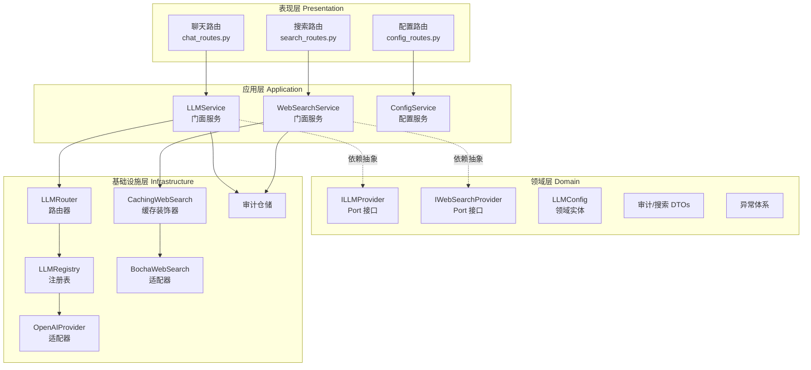
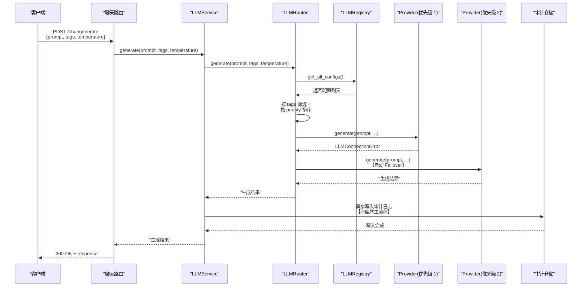

# LLM 网关架构设计文档

## 1. 架构总览

### 1.1 系统定位与核心职责

LLM 网关是一个基于 DDD（领域驱动设计）和 Clean Architecture（整洁架构）构建的企业级大模型调用管理平台。其核心职责包括：

- **统一接入层**：为上层应用提供透明的大模型调用能力，屏蔽底层多厂商 API 差异
- **智能路由**：支持基于别名精确匹配、标签筛选、优先级排序的动态路由策略
- **高可用保障**：实现故障自动检测与透明故障转移（failover）
- **可观测性**：全链路调用审计，记录 prompt/completion/延迟/token 等关键指标
- **性能优化**：集成 Web 搜索能力与多级缓存机制，降低调用成本，提升响应速度

### 1.2 架构分层

系统采用经典的四层架构：

```
┌─────────────────────────────────────────┐
│         Presentation Layer              │
│  (REST APIs: chat, search, config)      │
├─────────────────────────────────────────┤
│         Application Layer               │
│  (LLMService, WebSearchService)         │
├─────────────────────────────────────────┤
│         Domain Layer                    │
│  (Entities, DTOs, Ports, Exceptions)    │
├─────────────────────────────────────────┤
│      Infrastructure Layer               │
│  (Router, Registry, Adapters, Cache)    │
└─────────────────────────────────────────┘
```

### 1.3 组件关系图



### 1.4 核心请求处理时序图



---

## 2. 多模型动态路由

### 2.1 路由策略

系统支持三种路由模式，通过 `LLMRouter._select_candidates()` 方法实现：

#### 2.1.1 Alias 精确匹配
```python
# 客户端指定模型别名
candidates = [c for c in configs if c.alias == alias and c.is_active]
```
- **场景**：明确知道需要使用哪个模型
- **特点**：不进行优先级排序，直接返回匹配的配置
- **示例**：`alias="deepseek-v3"` 直接路由到 DeepSeek V3 模型

#### 2.1.2 Tags 标签筛选
```python
# 客户端指定标签列表
candidates = [c for c in configs if c.is_active and all(t in c.tags for t in tags)]
candidates.sort(key=lambda x: x.priority)
```
- **场景**：按功能特性筛选模型（如 `["fast", "code"]`）
- **特点**：要求配置包含所有请求的标签（AND 逻辑），按优先级升序排序
- **示例**：`tags=["fast", "code"]` 筛选同时具备"快速"和"代码"标签的模型

#### 2.1.3 默认路由
```python
# 不指定 alias 或 tags
candidates = [c for c in configs if c.is_active]
candidates.sort(key=lambda x: x.priority)
```
- **场景**：让系统自动选择最优模型
- **特点**：所有激活的模型参与筛选，按优先级排序
- **用途**：成本优化（优先使用低成本模型）、负载均衡

### 2.2 优先级排序机制

- **排序规则**：`priority` 字段数值越大，优先级越高
- **应用场景**：
  - 成本优化：低成本模型设置高优先级，优先使用
  - 性能优化：快速响应模型设置高优先级
  - 质量分级：高质量模型设置低优先级，作为备选
- **配置示例**：
  ```python
  LLMConfig(
      alias="fast-model",
      priority=10,  # 高优先级，优先使用
      tags=["fast"]
  )
  LLMConfig(
      alias="premium-model",
      priority=1,   # 低优先级，备选
      tags=["high-quality"]
  )
  ```

### 2.3 动态加载与热更新

- **加载机制**：`LLMRegistry.refresh()` 从数据库全量加载激活的配置
- **实例化策略**：根据 `provider_type` 动态创建 Provider 实例（当前支持 `openai` 类型）
- **热更新**：通过 `POST /llm-platform/configs/refresh` 手动触发刷新，无需重启服务
- **单例模式**：`LLMRegistry` 使用单例模式，确保全局唯一实例

---

## 3. 故障自动转移（Failover）

### 3.1 故障检测机制

路由器在调用每个 Provider 时进行异常捕获：

```python
try:
    return await provider.generate(prompt, system_message, temperature)
except LLMConnectionError as e:
    logger.warning(f"LLM {config.alias} failed: {str(e)}. Failing over...")
    last_error = e
    continue
except Exception as e:
    logger.error(f"LLM {config.alias} unexpected error: {str(e)}")
    last_error = e
    continue
```

- **捕获异常类型**：
  - `LLMConnectionError`：连接错误、超时、服务不可用（503）
  - `Exception`：其他未预期异常（防御性处理）
- **日志记录**：记录每个失败尝试的详细信息，便于问题排查

### 3.2 转移策略

- **遍历顺序**：按优先级从高到低依次尝试
- **转移条件**：当前 Provider 抛出异常时，自动尝试下一个
- **终止条件**：
  - 成功：返回第一个成功的结果
  - 失败：所有候选都失败后，抛出 `NoAvailableModelError`
- **透明性**：对调用方完全透明，调用方仅感知最终结果或最终错误

### 3.3 降级策略

- **无可用模型**：当没有匹配的配置或所有候选都失败时，抛出 `NoAvailableModelError`（503）
- **错误信息传递**：最终异常包含最后一次失败的错误信息，便于诊断
- **审计日志**：即使 failover 成功，也会记录完整调用链路的审计信息

---

## 4. 全链路调用审计

### 4.1 审计数据模型

```python
class LLMCallLog(BaseModel):
    id: UUID                          # 唯一标识符
    session_id: UUID | None           # 关联研究会话 ID
    caller_module: str                # 调用方模块名（如 "research"）
    caller_agent: str | None          # 调用方 Agent 标识（如 "financial_auditor"）
    model_name: str                   # 模型名称（如 "deepseek-ai/DeepSeek-V3"）
    vendor: str                       # 供应商（如 "SiliconFlow"）
    prompt_text: str                  # 完整用户提示词
    system_message: str | None        # 系统提示词
    completion_text: str | None       # LLM 完整输出
    prompt_tokens: int | None         # prompt token 数（当前未实现）
    completion_tokens: int | None     # completion token 数（当前未实现）
    total_tokens: int | None          # 总 token 数（当前未实现）
    temperature: float                # 温度参数
    latency_ms: int                   # 调用耗时（毫秒）
    status: str                       # success | failed
    error_message: str | None         # 错误信息
    created_at: datetime              # 记录时间
```

### 4.2 异步写入机制

```python
async def _write_call_log(self, ...) -> None:
    if not self._call_log_repository:
        return
    log = LLMCallLog(...)
    try:
        await self._call_log_repository.save(log)
    except Exception as e:
        logger.warning("LLM 调用日志写入失败，不阻塞主流程：{e}")
```

- **异步非阻塞**：审计日志写入在 `try/except` 包裹中进行，写入失败不影响主流程
- **成功/失败全覆盖**：无论调用成功还是失败，都会写入审计日志
- **执行上下文**：通过 `current_execution_ctx` 自动获取 `session_id`，无需调用方传递

### 4.3 查询接口

- **按会话查询**：`GET /api/v1/coordinator/research/sessions/{session_id}/llm-calls`
- **用途**：
  - 调试：查看某次研究会话的完整 LLM 调用历史
  - 合规审计：跟踪敏感操作
  - 成本分析：统计 token 消耗和调用次数

### 4.4 数据库设计

- **表名**：`llm_call_logs`
- **主键**：`id`（UUID，支持分布式环境）
- **索引**：`(session_id, created_at)` 复合索引，优化按会话查询性能
- **字段类型**：`prompt_text`、`completion_text`、`error_message` 使用 `TEXT` 类型

---

## 5. Web 搜索集成

### 5.1 搜索 Port 抽象

```python
class IWebSearchProvider(ABC):
    @abstractmethod
    async def search(self, request: WebSearchRequest) -> WebSearchResponse:
        pass
```

- **设计原则**：与 `ILLMProvider` 完全独立，遵循接口隔离原则（ISP）
- **厂商无关**：输入/输出 DTO 不绑定任何特定 API 的字段名

### 5.2 搜索 DTO 设计

```python
class WebSearchRequest(BaseModel):
    query: str                        # 搜索关键词（必填）
    freshness: Optional[str]          # oneDay/oneWeek/oneMonth/oneYear/noLimit
    summary: bool = True              # 是否生成 AI 摘要
    count: int = 10                   # 返回结果条数（1-50）

class WebSearchResultItem(BaseModel):
    title: str                        # 标题
    url: str                          # URL
    snippet: str                      # 摘要片段
    summary: Optional[str]            # AI 生成的摘要
    site_name: Optional[str]          # 网站名称
    published_date: Optional[str]     # 发布日期

class WebSearchResponse(BaseModel):
    query: str                        # 原始查询词
    total_matches: Optional[int]      # 匹配总数
    results: List[WebSearchResultItem]
    
    def to_prompt_context(self) -> str:
        """将搜索结果转换为 LLM 友好的上下文字符串"""
```

### 5.3 博查 AI 适配器

- **API 端点**：`POST https://api.bochaai.com/v1/web-search`
- **映射规则**：
  - 博查 `webPages.value[].name` → DTO `title`
  - 博查 `webPages.value[].snippet` → DTO `snippet`
  - 博查 `webPages.value[].summary` → DTO `summary`
  - 博查 `webPages.value[].siteName` → DTO `site_name`
  - 博查 `webPages.value[].datePublished` → DTO `published_date`
- **错误处理**：
  - HTTP 4xx/5xx → `WebSearchError`（502）
  - 网络超时 → `WebSearchConnectionError`（503）
  - API Key 未配置 → `WebSearchConfigError`（503）

### 5.4 LLM 上下文拼接

`WebSearchResponse.to_prompt_context()` 方法将搜索结果格式化为 LLM 友好的字符串：

```
Web Search Results for: 'A 股最新政策'

[1] Title: 2026 年 A 股市场政策展望
Source: 新浪财经 (2026-02-28)
URL: https://example.com/article1
Content: AI 摘要内容...

[2] Title: 证监会发布新规...
Source: 东方财富网
URL: https://example.com/article2
Content:  snippet 内容...
```

- **用途**：拼接到 LLM prompt 中，提供实时外部信息
- **策略**：优先使用 `summary`（AI 摘要），没有则使用 `snippet`（摘要片段）

---

## 6. 缓存机制

### 6.1 缓存装饰器模式

```python
class CachingWebSearchProvider(IWebSearchProvider):
    def __init__(self, inner: IWebSearchProvider, cache_repo: IWebSearchCacheRepository):
        self._inner = inner          # 被装饰的实际 Provider（如 BochaWebSearchAdapter）
        self._cache_repo = cache_repo
    
    async def search(self, request: WebSearchRequest) -> WebSearchResponse:
        # 1. 先查缓存
        entry = await self._cache_repo.get(cache_key)
        if entry is not None:
            logger.info("缓存命中，直接返回")
            return WebSearchResponse.model_validate_json(entry.response_data)
        
        # 2. 未命中则调用实际 Provider
        response = await self._inner.search(request)
        
        # 3. 异步写入缓存（失败不阻塞）
        try:
            await self._cache_repo.put(cache_entry)
        except Exception as e:
            logger.warning("缓存写入失败，不阻塞返回")
        
        return response
```

- **设计模式**：装饰器模式（Decorator Pattern），透明增强功能
- **对调用方透明**：调用方无感知缓存存在，接口签名完全一致
- **开闭原则**：新增缓存策略无需修改 `WebSearchService` 或路由代码

### 6.2 缓存键计算策略

```python
def compute_cache_key(request: WebSearchRequest) -> str:
    """基于查询词和所有参数计算缓存键"""
    params = request.model_dump()
    return hashlib.md5(json.dumps(params, sort_keys=True).encode()).hexdigest()
```

- **唯一性**：相同的 `query + freshness + summary + count` 组合生成相同缓存键
- **参数敏感**：不同参数（如 `freshness=oneDay` vs `freshness=oneWeek`）视为不同缓存项

### 6.3 动态过期算法

```python
def compute_expires_at(created_at: datetime, freshness: Optional[str]) -> datetime:
    """根据 freshness 参数动态计算缓存过期时间"""
    mapping = {
        "oneDay": timedelta(days=1),
        "oneWeek": timedelta(weeks=1),
        "oneMonth": timedelta(days=30),
        "oneYear": timedelta(days=365),
        "noLimit": timedelta(days=365),
    }
    ttl = mapping.get(freshness, timedelta(days=7))  # 默认 7 天
    return created_at + ttl
```

- **过期策略**：缓存过期时间与搜索时效性一致
  - 搜索 `oneDay` 的新闻 → 缓存 1 天后过期
  - 搜索 `oneYear` 的新闻 → 缓存 1 年后过期
- **合理性**：时效性越强的搜索，缓存有效期越短，确保信息新鲜度

### 6.4 缓存性能优化

- **数据库存储**：使用 PostgreSQL 持久化缓存，支持分布式共享
- **索引策略**：在 `cache_key` 上建立唯一索引，加速查询
- **写入失败降级**：缓存写入失败仅记录 WARNING，不影响主流程返回
- **缓存击穿防护**：未命中时直接调用上游，无锁机制（当前实现）

---

## 7. 错误处理与异常体系

### 7.1 异常继承体系

所有异常继承自 `AppException`，形成清晰的异常层次：

```
AppException
├── LLMProviderException（500）
│   ├── LLMConnectionError（503）
│   ├── ModelConfigurationError（500）
│   └── NoAvailableModelError（503）
├── WebSearchError（502）
├── WebSearchConnectionError（503）
├── WebSearchConfigError（503）
├── ConfigNotFoundException（404）
└── DuplicateConfigException（409）
```

### 7.2 HTTP 状态码映射

| 异常类型 | HTTP 状态码 | 场景 |
|---------|------------|------|
| `WebSearchConfigError` | 503 | API Key 未配置 |
| `WebSearchConnectionError` | 503 | 网络超时/连接拒绝 |
| `WebSearchError` | 502 | 上游 API 返回错误 |
| `LLMConnectionError` | 503 | LLM 服务不可用 |
| `NoAvailableModelError` | 503 | 无匹配模型 |
| `ConfigNotFoundException` | 404 | 配置不存在 |
| `DuplicateConfigException` | 409 | 配置重复 |

### 7.3 日志记录策略

- **INFO**：正常请求处理（如 "LLM Generation request received"）
- **DEBUG**：路由细节（如 "Routing request to LLM: deepseek-v3"）
- **WARNING**：可恢复错误（如 "LLM deepseek-v3 failed. Failing over..."）
- **ERROR**：不可恢复错误（如 "LLM Provider 注册异常"）

---

## 8. 性能与可扩展性

### 8.1 异步并发设计

- **全链路异步**：所有 I/O 操作（HTTP 请求、数据库读写）均使用 `async/await`
- **非阻塞审计**：审计日志写入失败不阻塞主流程
- **超时控制**：博查适配器默认超时 30 秒，可配置

### 8.2 缓存性能

- **缓存命中率**：相同查询参数直接返回缓存，避免重复调用上游 API
- **成本优化**：减少上游 API 调用次数，降低费用
- **延迟优化**：缓存命中时响应时间从秒级降至毫秒级

### 8.3 扩展新 Provider 的步骤

1. **实现 Port 接口**：
   ```python
   class NewProvider(ILLMProvider):
       async def generate(self, prompt, system_message, temperature) -> str:
           # 实现调用逻辑
   ```

2. **注册到 Registry**：
   ```python
   # 在 LLMRegistry._register() 中添加
   if config.provider_type.lower() == "new_provider":
       provider = NewProvider(api_key=config.api_key, ...)
   ```

3. **配置数据库**：通过 REST API 创建配置，`provider_type="new_provider"`

4. **无需修改**：`LLMService`、`LLMRouter`、路由代码均无需修改

### 8.4 架构亮点总结

| 亮点 | 说明 |
|-----|------|
| **DDD 分层** | 领域层定义 Port 和 DTO，基础设施层实现，解耦彻底 |
| **依赖倒置** | 高层模块（Service）依赖抽象（Port），不依赖具体实现 |
| **装饰器模式** | 缓存功能通过装饰器透明增强，符合开闭原则 |
| **异步非阻塞** | 全链路异步 I/O，审计日志写入失败不阻塞主流程 |
| **动态路由** | 支持 alias/tags/优先级，运行时从数据库加载配置 |
| **透明 Failover** | 故障自动转移对调用方完全透明 |
| **全链路审计** | 记录 prompt/completion/延迟/调用方，支持调试和合规 |
| **智能缓存** | 基于 freshness 的动态过期策略，平衡新鲜度与命中率 |

---

## 9. 总结

LLM 网关通过 DDD 和 Clean Architecture 构建了一个高内聚、低耦合的企业级大模型调用管理平台。核心能力包括：

1. **多模型动态路由**：支持 alias 精确匹配、tags 标签筛选、优先级排序，运行时从数据库加载配置
2. **故障自动转移**：自动检测故障并透明切换到备用模型，确保服务高可用
3. **全链路调用审计**：异步记录完整调用信息（prompt/completion/延迟/调用方），支持调试、合规和成本分析
4. **Web 搜索集成**：对接博查 AI Web Search API，提供厂商无关的搜索抽象，支持结果到 LLM 上下文的转换
5. **智能缓存机制**：基于装饰器模式实现透明缓存，根据 freshness 参数动态计算过期时间，平衡信息新鲜度与缓存命中率

系统设计遵循 SOLID 原则，特别是依赖倒置原则（DIP）和开闭原则（OCP），新增 Provider 或缓存策略无需修改现有代码，仅需扩展实现并配置即可。
