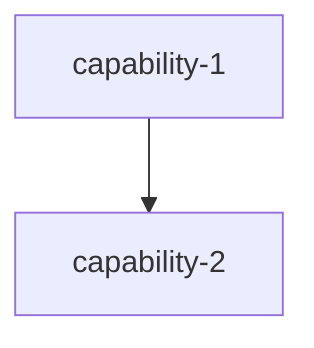

# Module Name Specification

## Purpose

简要描述本模块的目的和核心职责。回答：
- 这个模块是做什么的？
- 它解决什么问题？
- 它在系统中的位置是什么？

## Capabilities

| Capability | Description | Source |
|------------|-------------|--------|
| capability-1 | 能力 1 的简短描述 | original-spec-1 |
| capability-2 | 能力 2 的简短描述 | original-spec-2 |

## Capability Dependency Graph (Optional)

如果模块内有多个 capability 且它们之间有依赖关系，使用 mermaid 图表展示：

## General Conventions

### Requirement Language
- **SHALL** / **MUST**：强制性要求
- **SHOULD**：推荐性要求
- **MAY**：可选要求

### Testing Convention
每个 `#### Scenario:` 在变更交付时须对应至少一个自动化测试用例（单元或集成）；实现顺序可先实现再补测，以完整测试通过为需求完成标准。

---

## capability: capability-name

> Source: original-spec-name/spec.md (archived)

简要描述这个 capability 的功能和目的。

---

## Requirements

### Requirement: Requirement Title

详细描述这个需求。

#### Scenario: Scenario Title

- **WHEN** 触发条件
- **THEN** 预期结果

---

## capability: another-capability

> Source: another-spec-name/spec.md (archived)

简要描述这个 capability 的功能和目的。

---

## Requirements

### Requirement: Another Requirement Title

详细描述这个需求。

#### Scenario: Another Scenario Title

- **WHEN** 触发条件
- **THEN** 预期结果

---

## Best Practices Checklist

### YAML Frontmatter
- [ ] 包含 `title`：模块规格标题
- [ ] 包含 `version`：版本号
- [ ] 包含 `last_updated`：最后更新日期（YYYY-MM-DD）
- [ ] 包含 `module`：模块名称
- [ ] 包含 `capabilities`：能力列表
- [ ] 包含 `source_specs`：原始 spec 来源列表（如适用）

### Document Structure
- [ ] 有 `## Purpose` 部分：模块目的概述
- [ ] 有 `## Capabilities` 部分：能力列表表格
- [ ] 有 `## General Conventions` 部分：通用约定
- [ ] 每个 capability 有来源注释：`> Source: ...`
- [ ] 使用 `---` 分隔不同的 capability

### Content Guidelines
- [ ] 使用 `## Requirements` 而非 `## ADDED Requirements`（归档后的主 spec）
- [ ] 所有需求标题使用 `### Requirement:` 前缀
- [ ] 所有场景标题使用 `#### Scenario:` 前缀
- [ ] 场景使用 **WHEN** / **THEN** 格式
- [ ] 使用一致的需求语言（SHALL/MUST/SHOULD/MAY）
- [ ] 中文注释和文档字符串

### Readability
- [ ] 标题清晰、描述性强
- [ ] 表格格式规范对齐
- [ ] 代码块有语言标识
- [ ] 长文件考虑添加目录（TOC）

### Maintenance
- [ ] 更新 `last_updated` 日期
- [ ] 保持 `version` 号同步
- [ ] 记录 `source_specs` 便于追溯

