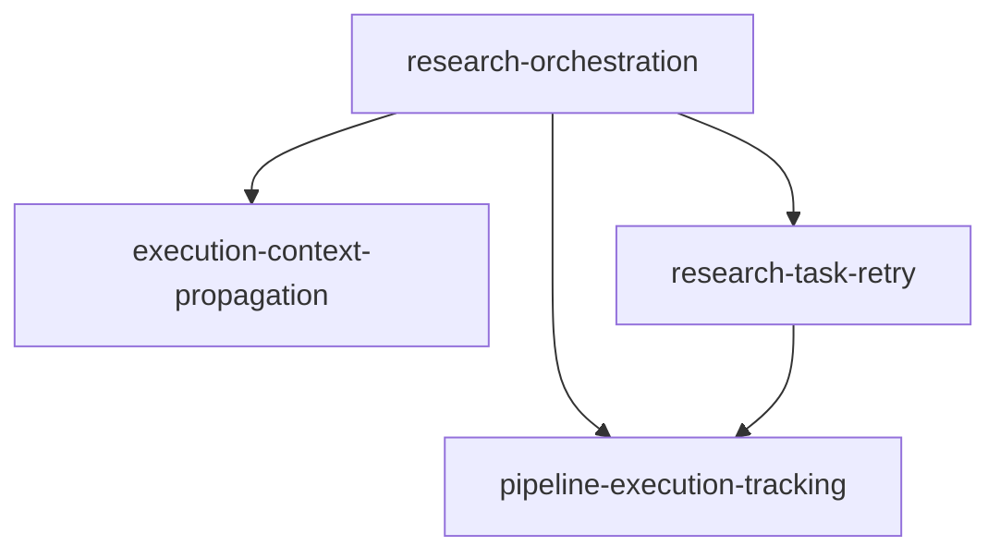

# Coordinator Module Specification

## Purpose

Coordinator 模块负责研究流程的编排、执行跟踪、上下文传播和任务重试。作为系统的中央协调者，它不直接执行研究、辩论或决策，而是编排其他模块的能力。

**核心职责**：
- 接受研究请求并按需调用专家
- 管理研究会话生命周期
- 提供执行上下文传播
- 支持任务重试机制

## Capabilities

| Capability | Description | Source |
|------------|-------------|--------|
| research-orchestration | 研究编排核心能力 | coordinator-research-orchestration |
| pipeline-execution-tracking | 流水线执行跟踪 | pipeline-execution-tracking |
| execution-context-propagation | 执行上下文传播 | execution-context-propagation |
| research-task-retry | 研究任务重试 | research-task-retry |

## Capability Dependency Graph



## General Conventions

### Requirement Language
- **SHALL** / **MUST**：强制性要求
- **SHOULD**：推荐性要求
- **MAY**：可选要求

### Testing Convention
每个 `#### Scenario:` 在变更交付时须对应至少一个自动化测试用例（单元或集成）；实现顺序可先实现再补测，以完整测试通过为需求完成标准。

---

## capability: research-orchestration

> Source: coordinator-research-orchestration/spec.md (archived)

Coordinator 模块的核心能力：通过单一 REST 端点接受研究请求（标的 + 用户指定的专家列表 + 可选参数），基于 LangGraph 有向图按需并行调用 Research 模块对应的专家 Application 服务，汇总各专家结果后统一返回。Coordinator 只做编排，不做研究、辩论或决策。

**五专家类型**：`technical_analyst`（技术分析师）、`financial_auditor`（财务审计员）、`valuation_modeler`（估值建模师）、`macro_intelligence`（宏观情报员）、`catalyst_detective`（催化剂侦探）。

---

## Requirements

### Requirement: REST 端点 — POST /api/v1/coordinator/research

Coordinator 模块 SHALL 暴露 `POST /api/v1/coordinator/research` REST 端点，位于 `src/modules/coordinator/presentation/rest/` 下。该路由 SHALL 通过 FastAPI 依赖注入装配 `ResearchOrchestrationService` 所需的全部 Port 实现，并在路由函数中调用 `ResearchOrchestrationService.execute(request)`。路由 SHALL 在 `src/api/routes.py` 中注册。

路由 SHALL 处理以下异常并返回对应 HTTP 状态码：
- 入参校验失败（symbol 缺失、experts 为空或含非法类型）→ 400
- 全部专家执行失败 → 500
- 其他未预期异常 → 500（记录日志）

#### Scenario: HTTP 接口可正常调用

- **WHEN** 发送 `POST /api/v1/coordinator/research` 请求，请求体包含有效的 symbol 和至少一个合法的 expert
- **THEN** 系统 SHALL 通过依赖注入装配服务并返回研究编排结果，HTTP 状态码为 200

#### Scenario: symbol 缺失时返回 400

- **WHEN** 发送请求时 symbol 为空或缺失
- **THEN** 系统 SHALL 返回 HTTP 400，响应体包含可区分的错误信息

#### Scenario: experts 为空时返回 400

- **WHEN** 发送请求时 experts 列表为空数组
- **THEN** 系统 SHALL 返回 HTTP 400，响应体包含可区分的错误信息

#### Scenario: experts 含非法类型时返回 400

- **WHEN** 发送请求时 experts 列表包含不在 ExpertType 枚举中的值（如 `"unknown_expert"`）
- **THEN** 系统 SHALL 返回 HTTP 400，响应体包含可区分的错误信息

#### Scenario: 全部专家失败时返回 500

- **WHEN** 所有选定的专家均执行失败
- **THEN** 系统 SHALL 返回 HTTP 500，响应体包含错误信息

---

### Requirement: 统一 API 响应格式

所有 REST API 接口 SHALL 使用统一的 `BaseResponse[T]` 响应格式，确保响应结构的一致性。

#### Scenario: 成功响应格式
- **WHEN** API 接口成功处理请求
- **THEN** 系统返回 `BaseResponse` 对象，包含：
  - `success: true`
  - `code: str` 成功代码（如 "RESEARCH_ORCHESTRATION_SUCCESS"）
  - `message: str` 成功描述（如 "研究编排成功完成"）
  - `data: T` 包含实际的业务数据

#### Scenario: 错误响应格式
- **WHEN** API 接口处理过程中发生错误
- **THEN** 系统返回 `ErrorResponse` 对象，包含：
  - `success: false`
  - `code: str` 内部错误码
  - `message: str` 友好的错误提示

---

### Requirement: 请求体与响应体契约

REST 端点的请求体 SHALL 为 JSON，包含以下字段：
- `symbol`（str，必填）：股票代码
- `experts`（list[str]，必填）：需要执行的专家类型列表，值为 ExpertType 枚举的 value（snake_case），至少 1 个
- `options`（dict[str, dict]，可选）：按专家名提供的专家特有参数。`technical_analyst` 可接受 `analysis_date`（str，ISO 格式日期，默认当天）；`financial_auditor` 可接受 `limit`（int，默认 5）；其他三专家无额外参数。
- `skip_debate`（bool，可选，默认 `false`）：若为 `true`，编排图 SHALL 跳过辩论阶段，行为与修改前一致。

响应体 SHALL 为 JSON，包含以下字段：
- `symbol`（str）：请求的股票代码
- `overall_status`（str）：`"completed"`（全部成功）、`"partial"`（部分成功部分失败）、`"failed"`（全部失败）
- `expert_results`（dict[str, object]）：按专家名分组的结果，每个专家的值包含 `status`（`"success"` 或 `"failed"`）、成功时包含 `data`（该专家的原始分析结果 dict）、失败时包含 `error`（错误信息字符串）
- `debate_outcome`（object | null）：辩论结果。包含 direction、confidence、bull_case、bear_case、risk_matrix、key_disagreements、conflict_resolution。当 `skip_debate=true` 或辩论失败时为 `null`。
- `verdict`（object | null）：裁决结果。包含 action、position_percent、confidence、entry_strategy、stop_loss、take_profit、time_horizon、risk_warnings、reasoning。当 `skip_debate=true`、辩论失败或裁决失败时为 `null`。
- `session_id`（str）：研究会话 ID，用于历史查询与审计关联；未启用持久化时为空
- `retry_count`（int）：重试计数，首次执行为 0，每次重试递增 1

#### Scenario: 请求含完整字段时正确解析

- **WHEN** 发送请求体 `{"symbol": "000001.SZ", "experts": ["technical_analyst", "macro_intelligence"], "options": {"technical_analyst": {"analysis_date": "2026-02-13"}}}`
- **THEN** 系统 SHALL 正确解析 symbol、experts 列表和专家特有参数，调用对应的专家服务，并执行辩论和裁决阶段

#### Scenario: options 缺失时使用默认值

- **WHEN** 发送请求体不包含 `options` 字段，或 options 中不包含某专家的参数
- **THEN** 系统 SHALL 使用默认值（technical_analyst 默认 analysis_date 为当天，financial_auditor 默认 limit 为 5），正常执行

#### Scenario: 响应体包含 debate_outcome

- **WHEN** 研究编排执行完成且辩论阶段正常完成
- **THEN** 响应体 SHALL 包含 `debate_outcome` 字段，其中包含 direction、confidence、bull_case、bear_case、risk_matrix、key_disagreements、conflict_resolution

#### Scenario: 响应体包含 verdict

- **WHEN** 研究编排执行完成且辩论和裁决阶段均正常完成
- **THEN** 响应体 SHALL 包含 `verdict` 字段，其中包含 action、position_percent、confidence、entry_strategy、stop_loss、take_profit、time_horizon、risk_warnings、reasoning

#### Scenario: 首次请求响应包含 retry_count 为 0

- **WHEN** 首次发起 `POST /api/v1/coordinator/research` 研究请求并成功返回
- **THEN** 响应体 SHALL 包含 `retry_count` 字段，值为 `0`

#### Scenario: 响应体包含 session_id

- **WHEN** 研究编排执行完成且启用了持久化
- **THEN** 响应体 SHALL 包含 `session_id` 字段，值为新创建的会话 ID（UUID 格式）

#### Scenario: skip_debate 为 true 时跳过辩论和裁决

- **WHEN** 请求体包含 `"skip_debate": true`
- **THEN** 系统 SHALL 跳过辩论和裁决阶段，响应体中 `debate_outcome` 和 `verdict` 均为 `null`，其余字段不受影响

#### Scenario: 辩论失败时 debate_outcome 和 verdict 均为 null

- **WHEN** 辩论阶段执行失败（如 LLM 解析错误）
- **THEN** 响应体 `debate_outcome` 和 `verdict` SHALL 均为 `null`，`overall_status` 和 `expert_results` SHALL 不受辩论失败影响

#### Scenario: 辩论成功但裁决失败时 verdict 为 null

- **WHEN** 辩论阶段正常完成但裁决阶段执行失败
- **THEN** 响应体 `debate_outcome` SHALL 正常返回，`verdict` SHALL 为 `null`，`overall_status` 和 `expert_results` SHALL 不受裁决失败影响

#### Scenario: 全部成功时 overall_status 为 completed

- **WHEN** 所有选定专家均执行成功
- **THEN** `overall_status` SHALL 为 `"completed"`，所有 expert_results 中的 status 均为 `"success"`

#### Scenario: 部分成功时 overall_status 为 partial

- **WHEN** 部分选定专家执行成功、部分失败
- **THEN** `overall_status` SHALL 为 `"partial"`，成功的专家 status 为 `"success"` 含 data，失败的专家 status 为 `"failed"` 含 error

---

### Requirement: 用户指定专家的按需路由

Coordinator SHALL 仅调用用户在 `experts` 列表中指定的专家，SHALL NOT 调用未被指定的专家。路由逻辑 SHALL 支持任意 1 至 5 个专家的组合。

#### Scenario: 仅调用指定的专家

- **WHEN** 用户指定 `experts: ["macro_intelligence", "catalyst_detective"]`
- **THEN** 系统 SHALL 仅调用宏观情报员和催化剂侦探，SHALL NOT 调用技术分析师、财务审计员、估值建模师

#### Scenario: 指定单个专家

- **WHEN** 用户指定 `experts: ["valuation_modeler"]`
- **THEN** 系统 SHALL 仅调用估值建模师，返回仅含该专家结果的响应

#### Scenario: 指定全部五个专家

- **WHEN** 用户指定全部五个专家类型
- **THEN** 系统 SHALL 调用全部五个专家，返回包含五个专家结果的响应

---

### Requirement: 选定专家并行执行

Coordinator SHALL 并行执行所有选定的专家（通过 LangGraph `Send` API 实现动态 fan-out）。各专家的执行 SHALL 互不阻塞，不存在顺序依赖。

#### Scenario: 多专家并行执行

- **WHEN** 用户指定 3 个专家
- **THEN** 系统 SHALL 并行调用这 3 个专家，而非顺序逐个调用；总耗时 SHALL 接近最慢专家的耗时而非各专家耗时之和

#### Scenario: 单专家无需并行

- **WHEN** 用户仅指定 1 个专家
- **THEN** 系统 SHALL 直接执行该专家，结果正常返回

---

### Requirement: 单专家失败隔离与优雅降级

单个专家执行失败（异常、超时等）SHALL NOT 导致整体编排中断或其他专家的结果丢失。系统 SHALL 按以下规则处理：
- 失败的专家：记录警告日志，在响应中标记 `status: "failed"` 并附带错误信息。
- 其他成功的专家：结果正常返回。
- `overall_status` 反映整体状态：全部成功 → `"completed"`、部分成功 → `"partial"`、全部失败 → `"failed"`。

#### Scenario: 一个专家失败不影响其他专家

- **WHEN** 用户指定 3 个专家，其中 1 个执行时抛出异常，其余 2 个正常返回
- **THEN** 系统 SHALL 返回 HTTP 200，`overall_status` 为 `"partial"`，失败的专家在 `expert_results` 中标记 `status: "failed"` 并附带 error，成功的 2 个专家正常返回 data

#### Scenario: 全部专家失败

- **WHEN** 用户指定的所有专家均执行失败
- **THEN** 系统 SHALL 返回错误响应，`overall_status` 为 `"failed"`，每个专家的 error 信息均被记录

---

### Requirement: 跨模块调用通过 Domain Port

Coordinator 调用 Research 模块的专家 SHALL 通过 Coordinator Domain 层定义的 `IResearchExpertGateway` Port 进行。该 Port 的 Infrastructure Adapter（`ResearchGatewayAdapter`）内部调用 Research 模块的 Application 服务接口。Coordinator 的 Application 层和 Domain 层 SHALL NOT 直接依赖 Research 模块的任何类型（服务类、DTO、Domain 实体等）。

#### Scenario: 通过 Gateway Port 调用专家

- **WHEN** Coordinator 需要调用某个 Research 专家
- **THEN** 通过注入的 `IResearchExpertGateway` Port 调用 `run_expert(expert_type, symbol, options)`，不直接实例化或引用 Research 模块的 Application Service 类

#### Scenario: Gateway Adapter 归一化催化剂侦探返回值

- **WHEN** Gateway Adapter 调用 `CatalystDetectiveService.run()` 获得 `CatalystDetectiveAgentResult`（非 dict）
- **THEN** Adapter SHALL 将其归一化为 `dict[str, Any]`，使 Coordinator 拿到的所有专家结果类型一致

---

### Requirement: IDebateGateway Port

Coordinator Domain 层 SHALL 在 `src/modules/coordinator/domain/ports/` 中新增 `IDebateGateway` 抽象接口，定义如下方法签名：

```
async def run_debate(self, symbol: str, expert_results: dict[str, Any]) -> dict[str, Any]
```

该 Port SHALL 为 ABC 抽象类，仅定义接口签名。`expert_results` 为按专家名分组的成功专家结果字典（与 `ResearchGraphState.results` 结构一致）。返回值为辩论结果的 dict 序列化形式。

#### Scenario: IDebateGateway 为纯抽象接口

- **WHEN** 检查 `src/modules/coordinator/domain/ports/debate_gateway.py`
- **THEN** `IDebateGateway` SHALL 继承 `abc.ABC`，`run_debate` 标注 `@abstractmethod`，不包含任何实现代码

#### Scenario: Port 不依赖 Debate 模块内部类型

- **WHEN** 检查 `IDebateGateway` 的 import 语句
- **THEN** SHALL NOT import Debate 模块的 Domain 实体、DTO 或 Infrastructure 类型

---

### Requirement: IJudgeGateway Port

Coordinator Domain 层 SHALL 在 `src/modules/coordinator/domain/ports/` 中新增 `IJudgeGateway` 抽象接口，定义如下方法签名：

```
async def run_verdict(self, symbol: str, debate_outcome: dict[str, Any]) -> dict[str, Any]
```

该 Port SHALL 为 ABC 抽象类，仅定义接口签名。`debate_outcome` 为辩论结果的 dict 序列化（与 `ResearchGraphState.debate_outcome` 结构一致）。返回值为裁决结果的 dict 序列化形式。

#### Scenario: IJudgeGateway 为纯抽象接口

- **WHEN** 检查 `src/modules/coordinator/domain/ports/judge_gateway.py`
- **THEN** `IJudgeGateway` SHALL 继承 `abc.ABC`，`run_verdict` 标注 `@abstractmethod`，不包含任何实现代码

#### Scenario: Port 不依赖 Judge 模块内部类型

- **WHEN** 检查 `IJudgeGateway` 的 import 语句
- **THEN** SHALL NOT import Judge 模块的 Domain 实体、DTO 或 Infrastructure 类型

---

### Requirement: JudgeGatewayAdapter

Coordinator Infrastructure 层 SHALL 在 `src/modules/coordinator/infrastructure/adapters/` 中新增 `JudgeGatewayAdapter`，实现 `IJudgeGateway`。

该 Adapter SHALL：
1. 接受 `session_factory` 参数（与 `DebateGatewayAdapter` 一致，保持接口统一）。
2. 在 `run_verdict()` 内部通过 `JudgeContainer` 获取 `JudgeService`。
3. 将 `debate_outcome`（dict[str, Any]）转换为 Judge 模块的 `JudgeInput` DTO。
4. 调用 `JudgeService.run(judge_input)` 获得 `VerdictDTO`。
5. 将 `VerdictDTO` 转换为 `dict[str, Any]` 返回给 Coordinator。

**DTO 转换规则（debate_outcome → JudgeInput）**：

转换 SHALL 在 Adapter 中完成，遵守"跨模块 DTO 转换在 Adapter 完成"的规范。Adapter SHALL 按以下映射从 `debate_outcome` dict 中提取字段：

| JudgeInput 字段 | debate_outcome 来源 |
|-----------------|-------------------|
| `symbol` | 由调用方传入的 `symbol` 参数 |
| `direction` | `debate_outcome["direction"]` |
| `confidence` | `debate_outcome["confidence"]` |
| `bull_thesis` | `debate_outcome["bull_case"]["core_thesis"]` |
| `bear_thesis` | `debate_outcome["bear_case"]["core_thesis"]` |
| `risk_factors` | `debate_outcome["risk_matrix"]` 中每项的 `risk` 字段，提取为 `list[str]` |
| `key_disagreements` | `debate_outcome["key_disagreements"]` |
| `conflict_resolution` | `debate_outcome["conflict_resolution"]` |

**须过滤的字段（SHALL NOT 传递给 Judge）**：

以下 Debate 细节字段与裁决无关或体积过大，SHALL 在转换时丢弃：
- `bull_case.supporting_arguments`：多头支持论据列表
- `bull_case.acknowledged_risks`：多头已知风险列表
- `bear_case.supporting_arguments`：空头支持论据列表
- `bear_case.acknowledged_strengths`：空头已知优势列表
- `risk_matrix` 中每项的 `probability`、`impact`、`mitigation` 明细

#### Scenario: Adapter 通过 JudgeContainer 调用 JudgeService

- **WHEN** `JudgeGatewayAdapter.run_verdict()` 被调用
- **THEN** Adapter SHALL 通过 `JudgeContainer` 获取 `JudgeService` 并调用 `run()`

#### Scenario: bull_thesis 和 bear_thesis 提取

- **WHEN** Adapter 接收 `debate_outcome` 中包含 `bull_case.core_thesis="估值低于内在价值"` 和 `bear_case.core_thesis="行业景气度下行"`
- **THEN** 转换后的 `JudgeInput.bull_thesis` SHALL 为 `"估值低于内在价值"`，`bear_thesis` SHALL 为 `"行业景气度下行"`

#### Scenario: risk_factors 从 risk_matrix 提取

- **WHEN** Adapter 接收 `debate_outcome` 中 `risk_matrix` 包含 3 项，每项有 `risk`、`probability`、`impact`、`mitigation`
- **THEN** 转换后的 `JudgeInput.risk_factors` SHALL 仅包含 3 个 `risk` 字符串，SHALL NOT 包含 probability、impact、mitigation

#### Scenario: 返回值为 dict 序列化

- **WHEN** `JudgeService.run()` 返回 `VerdictDTO`
- **THEN** Adapter SHALL 将其转为 `dict[str, Any]`（如 `.model_dump()`）后返回

---

### Requirement: DebateGatewayAdapter

Coordinator Infrastructure 层 SHALL 在 `src/modules/coordinator/infrastructure/adapters/` 中新增 `DebateGatewayAdapter`，实现 `IDebateGateway`。

该 Adapter SHALL：
1. 接受 `session_factory` 参数（与 `ResearchGatewayAdapter` 一致，保证会话隔离）。
2. 在 `run_debate()` 内部创建独立 AsyncSession，通过 `DebateContainer` 获取 `DebateService`。
3. 将 `expert_results`（dict[str, Any]）转换为 Debate 模块的 `DebateInput` DTO。
4. 调用 `DebateService.run(debate_input)` 获得 `DebateOutcomeDTO`。
5. 将 `DebateOutcomeDTO` 转换为 `dict[str, Any]` 返回给 Coordinator。

**DTO 转换规则（expert_results → DebateInput）**：

转换 SHALL 在 Adapter 中完成，遵守"跨模块 DTO 转换在 Adapter 完成"的规范。由于五个专家的返回字段名各不相同，Adapter SHALL 按以下映射表将每个专家的原始结果归一化为统一的 `ExpertSummary`（signal、confidence、reasoning、risk_warning）：

| 专家 | signal 来源 | confidence 来源 | reasoning 来源 | risk_warning 来源 |
|------|------------|----------------|---------------|------------------|
| technical_analyst | `signal` | `confidence` | `summary_reasoning` | `risk_warning` |
| financial_auditor | `signal` | `confidence` | `summary_reasoning` | `risk_warning` |
| valuation_modeler | `valuation_verdict` | `confidence_score` | `reasoning_summary` | `risk_factors`（join 为字符串） |
| macro_intelligence | `macro_environment` | `confidence_score` | `macro_summary` | `key_risks`（join 为字符串） |
| catalyst_detective | `result.catalyst_assessment` | `result.confidence_score` | `result.catalyst_summary` | `result.negative_catalysts`（格式化为字符串） |

**须过滤的字段（SHALL NOT 传递给 Debate）**：

以下字段属于调试/原始数据，体积大且与辩论无关，SHALL 在转换时丢弃：
- `input` / `user_prompt`：用户提示词原文
- `output` / `raw_llm_output`：LLM 原始输出全文
- `technical_indicators` / `financial_indicators` / `valuation_indicators` / `macro_indicators`：原始指标快照数据
- `catalyst_context`：催化剂上下文原始数据
- `information_sources`：来源 URL 列表
- `dimension_analyses`：各维度详细分析数组（体积大，辩论仅需摘要级结论）
- `key_technical_levels` / `estimated_intrinsic_value_range`：技术/估值细节数据

仅成功的专家（`status == "success"`）SHALL 被包含在 `DebateInput.expert_summaries` 中；失败的专家 SHALL 被跳过。

#### Scenario: Adapter 通过 DebateContainer 调用 DebateService

- **WHEN** `DebateGatewayAdapter.run_debate()` 被调用
- **THEN** Adapter SHALL 创建独立 AsyncSession，通过 `DebateContainer` 获取 `DebateService` 并调用 `run()`

#### Scenario: technical_analyst 字段映射与过滤

- **WHEN** Adapter 接收 `expert_results` 中 `technical_analyst` 的完整结果（含 signal、confidence、summary_reasoning、risk_warning、input、output、technical_indicators、key_technical_levels）
- **THEN** 转换后的 `ExpertSummary` SHALL 仅包含 `signal="BULLISH"`、`confidence=0.78`、`reasoning="(summary_reasoning内容)"`、`risk_warning="(risk_warning内容)"`；SHALL NOT 包含 input、output、technical_indicators、key_technical_levels

#### Scenario: valuation_modeler 字段名归一化

- **WHEN** Adapter 接收 `expert_results` 中 `valuation_modeler` 的结果（字段名为 valuation_verdict、confidence_score、reasoning_summary、risk_factors）
- **THEN** 转换后的 `ExpertSummary.signal` SHALL 取自 `valuation_verdict`，`confidence` 取自 `confidence_score`，`reasoning` 取自 `reasoning_summary`，`risk_warning` 取自 `risk_factors`（列表拼接为字符串）

#### Scenario: catalyst_detective 嵌套结构展平

- **WHEN** Adapter 接收 `expert_results` 中 `catalyst_detective` 的结果（关键字段嵌套在 `result` 对象内）
- **THEN** 转换后的 `ExpertSummary.signal` SHALL 取自 `result.catalyst_assessment`，`confidence` 取自 `result.confidence_score`，`reasoning` 取自 `result.catalyst_summary`，`risk_warning` 取自 `result.negative_catalysts`（格式化为字符串）；SHALL NOT 包含 raw_llm_output、user_prompt、catalyst_context

#### Scenario: 仅成功专家被包含

- **WHEN** `expert_results` 中有 3 个成功专家和 2 个失败专家（失败专家的值为 None 或不存在于 results dict 中）
- **THEN** `DebateInput.expert_summaries` SHALL 仅包含 3 个条目，失败专家 SHALL 被跳过

#### Scenario: 返回值为 dict 序列化

- **WHEN** `DebateService.run()` 返回 `DebateOutcomeDTO`
- **THEN** Adapter SHALL 将其转为 `dict[str, Any]`（如 `.model_dump()`）后返回

---

### Requirement: debate_node 加入 LangGraph 编排图

`build_research_graph()`（位于 `src/modules/coordinator/infrastructure/orchestration/graph_builder.py`）SHALL 包含 `debate_node` 节点，该节点调用 `IDebateGateway.run_debate()`。

`build_research_graph()` 的函数签名 SHALL 为：

```
def build_research_graph(
    gateway: IResearchExpertGateway,
    debate_gateway: Any = None,
    judge_gateway: Any = None,
) -> Any
```

图的边 SHALL 根据传入的 gateway 参数动态构建：
- `debate_gateway` 不为 None 且 `judge_gateway` 不为 None：`aggregator_node → debate_node → judge_node → END`
- `debate_gateway` 不为 None 且 `judge_gateway` 为 None：`aggregator_node → debate_node → END`
- `debate_gateway` 为 None：`aggregator_node → END`（无论 `judge_gateway` 是否存在，跳过辩论时也跳过裁决）

`debate_node` 的行为不变：
1. 从图状态中读取 `symbol`、`results`、`overall_status`。
2. 如果 `overall_status` 为 `"failed"`（无任何成功专家），SHALL 跳过辩论，直接返回空 `debate_outcome`。
3. 否则，调用 `IDebateGateway.run_debate(symbol, results)`。
4. 成功时将结果写入图状态的 `debate_outcome` 字段。
5. 失败时（Gateway 抛异常）记录错误日志，将 `debate_outcome` 设为空 dict，`overall_status` SHALL 不因辩论失败而改变。

#### Scenario: 正常流程包含 debate_node 和 judge_node

- **WHEN** `build_research_graph(gateway, debate_gateway, judge_gateway)` 且 `debate_gateway` 和 `judge_gateway` 均不为 None
- **THEN** 图结构 SHALL 为 `START → route_to_experts → 专家节点（并行）→ aggregator_node → debate_node → judge_node → END`

#### Scenario: 仅有 debate_gateway 时保持 debate → END

- **WHEN** `build_research_graph(gateway, debate_gateway, judge_gateway=None)`
- **THEN** 图结构 SHALL 为 `aggregator_node → debate_node → END`，与 Judge 模块引入前行为一致

#### Scenario: debate_gateway 为 None 时保持原图结构

- **WHEN** `build_research_graph(gateway, debate_gateway=None)`
- **THEN** 图结构 SHALL 保持为 `aggregator_node → END`，无论 `judge_gateway` 是否存在

#### Scenario: 全部专家失败时跳过辩论

- **WHEN** `overall_status` 为 `"failed"`（results 为空）
- **THEN** `debate_node` SHALL 跳过辩论调用，`debate_outcome` 为空 dict

#### Scenario: 辩论异常不影响研究结果

- **WHEN** `IDebateGateway.run_debate()` 抛出异常
- **THEN** `debate_node` SHALL 捕获异常并记录错误日志，`debate_outcome` 设为空 dict，`overall_status` 保持不变（不因辩论失败变为 `"failed"`）

---

### Requirement: judge_node 加入 LangGraph 编排图

`build_research_graph()`（位于 `src/modules/coordinator/infrastructure/orchestration/graph_builder.py`）SHALL 新增 `judge_node` 节点，该节点调用 `IJudgeGateway.run_verdict()`。

`judge_node` 的行为：
1. 从图状态中读取 `symbol`、`debate_outcome`。
2. 如果 `debate_outcome` 为空 dict 或 None（辩论被跳过或失败），SHALL 跳过裁决，直接返回空 `verdict`。
3. 否则，调用 `IJudgeGateway.run_verdict(symbol, debate_outcome)`。
4. 成功时将结果写入图状态的 `verdict` 字段。
5. 失败时（Gateway 抛异常）记录错误日志，将 `verdict` 设为空 dict，`overall_status` SHALL 不因裁决失败而改变（研究和辩论结果仍可用）。

#### Scenario: 辩论成功后执行裁决

- **WHEN** `debate_outcome` 为非空 dict（辩论正常完成）
- **THEN** `judge_node` SHALL 调用 `IJudgeGateway.run_verdict(symbol, debate_outcome)` 并将结果写入 `verdict`

#### Scenario: 辩论为空时跳过裁决

- **WHEN** `debate_outcome` 为空 dict 或 None（辩论被跳过或失败）
- **THEN** `judge_node` SHALL 跳过裁决调用，`verdict` 为空 dict

#### Scenario: 裁决异常不影响研究和辩论结果

- **WHEN** `IJudgeGateway.run_verdict()` 抛出异常
- **THEN** `judge_node` SHALL 捕获异常并记录错误日志，`verdict` 设为空 dict，`overall_status` 和 `debate_outcome` 保持不变

---

### Requirement: 扩展 ResearchGraphState

`ResearchGraphState`（位于 `src/modules/coordinator/infrastructure/orchestration/graph_state.py`）SHALL 包含以下字段：

- `symbol`（str）：标的代码
- `selected_experts`（list[str]）：选中的专家列表
- `options`（dict[str, dict[str, Any]]）：专家特有参数
- `results`（Annotated[dict[str, Any], merge_dicts]）：专家结果
- `errors`（Annotated[dict[str, str], merge_dicts]）：专家错误
- `overall_status`（Literal["completed", "partial", "failed"]）：整体状态
- `debate_outcome`（dict[str, Any]）：辩论结果，由 `debate_node` 写入
- `verdict`（dict[str, Any]）：裁决结果，由 `judge_node` 写入

#### Scenario: 图状态包含 verdict 字段

- **WHEN** 检查 `ResearchGraphState` 的 TypedDict 定义
- **THEN** SHALL 包含 `verdict` 字段，类型为 `dict[str, Any]`

#### Scenario: 图状态包含 debate_outcome 字段

- **WHEN** 检查 `ResearchGraphState` 的 TypedDict 定义
- **THEN** SHALL 包含 `debate_outcome` 字段，类型为 `dict[str, Any]`

---

### Requirement: LangGraph 作为 Infrastructure 实现

LangGraph 的 `StateGraph`、`Send`、`TypedDict` State 等 API SHALL 仅出现在 Coordinator 的 Infrastructure 层（`infrastructure/orchestration/`）。Application 层 SHALL 通过 Domain Port（`IResearchOrchestrationPort`）委托编排执行，SHALL NOT 直接导入或使用 LangGraph 的任何类型。

#### Scenario: Application 层不依赖 LangGraph

- **WHEN** 检查 `src/modules/coordinator/application/` 下所有 Python 文件的 import 语句
- **THEN** SHALL NOT 包含任何 `langgraph` 或 `langchain` 相关的 import

#### Scenario: Domain 层不依赖 LangGraph

- **WHEN** 检查 `src/modules/coordinator/domain/` 下所有 Python 文件的 import 语句
- **THEN** SHALL NOT 包含任何 `langgraph` 或 `langchain` 相关的 import

#### Scenario: LangGraph 图构建在 Infrastructure 层

- **WHEN** 检查 LangGraph `StateGraph` 的构建与编译代码
- **THEN** 该代码 SHALL 位于 `src/modules/coordinator/infrastructure/orchestration/` 下

---

### Requirement: 编排服务入参校验

`ResearchOrchestrationService`（Application 层）SHALL 在调用编排 Port 之前校验输入：
- `symbol` 为空或 None 时，SHALL 抛出校验异常。
- `experts` 为空列表时，SHALL 抛出校验异常。
- `experts` 中含有不在 `ExpertType` 枚举中的值时，SHALL 抛出校验异常。

校验异常 SHALL 提供可区分的错误信息，便于 Presentation 层映射为 HTTP 400。

#### Scenario: symbol 缺失时校验拒绝

- **WHEN** 调用 `ResearchOrchestrationService.execute()` 时 symbol 为空字符串或 None
- **THEN** 服务 SHALL 抛出校验异常，不调用编排 Port

#### Scenario: experts 为空时校验拒绝

- **WHEN** 调用服务时 experts 为空列表
- **THEN** 服务 SHALL 抛出校验异常，不调用编排 Port

#### Scenario: experts 含非法值时校验拒绝

- **WHEN** 调用服务时 experts 列表包含 `"unknown_expert"`
- **THEN** 服务 SHALL 抛出校验异常，不调用编排 Port

---

### Requirement: ExpertType 枚举与 Domain 模型

Coordinator Domain 层 SHALL 定义 `ExpertType` 枚举，包含五个值：`TECHNICAL_ANALYST`、`FINANCIAL_AUDITOR`、`VALUATION_MODELER`、`MACRO_INTELLIGENCE`、`CATALYST_DETECTIVE`。枚举的 value SHALL 为 snake_case 字符串（如 `"technical_analyst"`），与 REST 请求体中的 experts 列表值一一对应。

Coordinator Domain 层 SHALL 定义以下 DTO：
- `ResearchRequest`：`symbol: str, experts: list[ExpertType], options: dict[str, dict]`
- `ExpertResultItem`：`expert_type: ExpertType, status: Literal["success", "failed"], data: dict | None, error: str | None`
- `ResearchResult`：`symbol: str, overall_status: Literal["completed", "partial", "failed"], expert_results: list[ExpertResultItem], debate_outcome: dict[str, Any] | None, verdict: dict[str, Any] | None`

#### Scenario: ExpertType 枚举涵盖五专家

- **WHEN** 检查 `ExpertType` 枚举定义
- **THEN** SHALL 包含 `TECHNICAL_ANALYST`、`FINANCIAL_AUDITOR`、`VALUATION_MODELER`、`MACRO_INTELLIGENCE`、`CATALYST_DETECTIVE` 五个成员，value 分别为对应的 snake_case 字符串

#### Scenario: REST 请求中的专家字符串可映射为 ExpertType

- **WHEN** REST 请求体 experts 列表包含 `"technical_analyst"`
- **THEN** 系统 SHALL 将其映射为 `ExpertType.TECHNICAL_ANALYST`

---

### Requirement: ResearchResult DTO 包含 verdict

`ResearchResult`（位于 `src/modules/coordinator/domain/dtos/research_dtos.py`）SHALL 包含以下字段：

- `symbol`（str）
- `overall_status`（Literal["completed", "partial", "failed"]）
- `expert_results`（list[ExpertResultItem]）
- `debate_outcome`（dict[str, Any] | None）：辩论结果，skip_debate 或失败时为 None
- `verdict`（dict[str, Any] | None）：裁决结果，辩论未执行或裁决失败时为 None

#### Scenario: ResearchResult 包含 verdict 字段

- **WHEN** 检查 `ResearchResult` 的定义
- **THEN** SHALL 包含 `verdict` 字段，类型为 `dict[str, Any] | None`，默认为 `None`

#### Scenario: 裁决成功时 verdict 不为 None

- **WHEN** 编排完成且裁决阶段正常返回
- **THEN** `ResearchResult.verdict` SHALL 包含裁决结果 dict

#### Scenario: 裁决失败时 verdict 为 None

- **WHEN** 裁决阶段执行失败或被跳过
- **THEN** `ResearchResult.verdict` SHALL 为 `None`

---

### Requirement: LangGraphResearchOrchestrator 支持 judge_gateway

`LangGraphResearchOrchestrator`（位于 `src/modules/coordinator/infrastructure/orchestration/langgraph_orchestrator.py`）SHALL 支持 `judge_gateway` 参数。

构造函数 SHALL 接受：
- `gateway: IResearchExpertGateway`
- `debate_gateway: Any = None`
- `judge_gateway: Any = None`

`run()` 方法中：
- 当 `request.skip_debate` 为 True 时，`debate_gw` 和 `judge_gw` 均为 None（跳过辩论则跳过裁决）。
- 否则使用构造时注入的 `debate_gateway` 和 `judge_gateway`。
- 从 `final_state` 中读取 `verdict` 字段，空 dict 转为 None，写入 `ResearchResult.verdict`。

#### Scenario: skip_debate 时跳过辩论和裁决

- **WHEN** `request.skip_debate` 为 True
- **THEN** `build_research_graph()` SHALL 接收 `debate_gateway=None` 和 `judge_gateway=None`，辩论和裁决均不执行

#### Scenario: 正常流程传入 judge_gateway

- **WHEN** `request.skip_debate` 为 False 且 `judge_gateway` 不为 None
- **THEN** `build_research_graph()` SHALL 接收 `judge_gateway`，图中包含 `judge_node`

#### Scenario: verdict 空 dict 转为 None

- **WHEN** `final_state["verdict"]` 为空 dict
- **THEN** `ResearchResult.verdict` SHALL 为 `None`

---

### Requirement: Coordinator 模块四层结构

Coordinator 模块 SHALL 位于 `src/modules/coordinator/`，遵循标准 DDD 四层结构：
- `application/`：ResearchOrchestrationService、DTO（ResearchRequest、ResearchResult）
- `domain/`：ExpertType 枚举、Port 接口（IResearchOrchestrationPort、IResearchExpertGateway、IDebateGateway、IJudgeGateway）、领域异常
- `infrastructure/`：ResearchGatewayAdapter（调用 Research）、DebateGatewayAdapter（调用 Debate）、JudgeGatewayAdapter（调用 Judge）、LangGraph 图构建与编排器
- `presentation/rest/`：FastAPI 路由

模块 SHALL 有 `container.py` 作为 Composition Root，负责装配全部依赖（含 DebateGatewayAdapter 和 JudgeGatewayAdapter）。

#### Scenario: 模块目录结构符合四层

- **WHEN** 检查 `src/modules/coordinator/` 目录
- **THEN** SHALL 包含 `application/`、`domain/`、`infrastructure/`、`presentation/` 四个子目录和 `container.py`

#### Scenario: Container 装配含 JudgeGatewayAdapter

- **WHEN** 调用 `CoordinatorContainer` 获取 `ResearchOrchestrationService`
- **THEN** Container SHALL 装配 `ResearchGatewayAdapter`、`DebateGatewayAdapter` 和 `JudgeGatewayAdapter`，将 `debate_gateway` 和 `judge_gateway` 传入 `LangGraphResearchOrchestrator`

#### Scenario: 路由在 api/routes.py 中注册

- **WHEN** 检查 `src/api/routes.py`
- **THEN** SHALL 包含 Coordinator 路由的注册

---

### Requirement: 可测性 — Scenario 与测试一一对应

每个上述 Scenario 在变更交付时 SHALL 对应至少一个自动化测试（单元或集成）；需求完成的验收条件包含「该需求下所有 Scenario 的测试通过」。实现时可先实现再补测，不强制测试先行。

测试 SHALL 可通过 mock `IResearchExpertGateway` 完成，无需真实 LLM 或数据库连接。

#### Scenario: 测试覆盖入参校验拒绝

- **WHEN** 运行 Coordinator 相关测试套件
- **THEN** 存在测试用例：传入缺失 symbol / 空 experts / 非法 expert 类型，断言调用被拒绝并返回可区分错误

#### Scenario: 测试覆盖按需路由

- **WHEN** 运行 Coordinator 相关测试套件
- **THEN** 存在测试用例：mock Gateway，指定 2 个专家，断言仅这 2 个专家的 `run_expert` 被调用、其余 3 个未被调用

#### Scenario: 测试覆盖单专家失败降级

- **WHEN** 运行 Coordinator 相关测试套件
- **THEN** 存在测试用例：mock Gateway 中某专家抛异常，断言 overall_status 为 `"partial"`、失败专家的 error 被记录、成功专家的 data 正常返回

#### Scenario: 测试覆盖全部专家失败

- **WHEN** 运行 Coordinator 相关测试套件
- **THEN** 存在测试用例：mock Gateway 中全部专家抛异常，断言 overall_status 为 `"failed"`

#### Scenario: 测试覆盖 Gateway Adapter dispatch

- **WHEN** 运行 Coordinator 相关测试套件
- **THEN** 存在测试用例：mock Research Application Service，验证 `ResearchGatewayAdapter` 根据 ExpertType 正确调度到对应的 Service 并传递参数

---

## capability: pipeline-execution-tracking

> Source: pipeline-execution-tracking/spec.md (archived)

研究流水线执行跟踪：ResearchSession 与 NodeExecution 的生命周期管理、持久化及历史查询 API。Coordinator 在每次研究启动时创建会话记录，在节点执行时记录 NodeExecution，流水线结束后更新会话状态；提供 GET /research/sessions 与 GET /research/sessions/{session_id} 等查询能力。

---

## Requirements

### Requirement: ResearchSession 生命周期管理

系统 SHALL 在每次研究流水线启动时创建一个 `ResearchSession` 记录，并在流水线结束后更新其最终状态。

`ResearchSession` 包含以下信息：唯一标识（UUID）、股票代码（symbol）、执行状态（running / completed / partial / failed）、选中的专家列表、执行选项、触发来源、创建时间、完成时间、总耗时（毫秒）、重试计数（`retry_count`，int，默认 0）、父会话标识（`parent_session_id`，UUID，可为 null）。

- 流水线启动时，状态 MUST 设为 `running`。
- 所有节点成功完成时，状态 MUST 更新为 `completed`。
- 部分节点成功、部分失败时，状态 MUST 更新为 `partial`。
- 所有节点均失败时，状态 MUST 更新为 `failed`。
- `completed_at` 和 `duration_ms` MUST 在流水线结束后写入。
- 首次执行时，`retry_count` MUST 为 `0`，`parent_session_id` MUST 为 `null`。
- 重试执行时，`retry_count` MUST 为源 session 的 `retry_count + 1`，`parent_session_id` MUST 指向被重试的源 session ID。

#### Scenario: 完整成功的研究流水线

- **WHEN** 用户发起一次研究请求，选择全部 5 个专家且不跳过辩论
- **THEN** 系统创建一个 `ResearchSession`（status=running），流水线全部节点执行成功后更新 status=completed，completed_at 和 duration_ms 均不为 null

#### Scenario: 部分专家失败

- **WHEN** 用户发起研究请求，其中 2 个专家执行失败、3 个成功，辩论和裁决正常完成
- **THEN** `ResearchSession` 最终 status=partial

#### Scenario: 全部失败

- **WHEN** 用户发起研究请求，所有专家均执行失败
- **THEN** `ResearchSession` 最终 status=failed，completed_at 和 duration_ms 仍被记录

#### Scenario: 首次执行的 session 字段

- **WHEN** 用户首次发起研究请求
- **THEN** 创建的 `ResearchSession` 中 `retry_count` 为 `0`，`parent_session_id` 为 `null`

#### Scenario: 重试执行的 session 字段

- **WHEN** 用户对已有 session 发起重试，源 session 的 `retry_count` 为 `1`
- **THEN** 新创建的子 session 中 `retry_count` 为 `2`，`parent_session_id` 指向源 session ID

---

### Requirement: NodeExecution 成功记录

系统 SHALL 在每个 LangGraph 节点执行成功后，创建一个 `NodeExecution` 记录，包含：唯一标识、关联 session_id、节点类型（technical_analyst / financial_auditor / valuation_modeler / macro_intelligence / catalyst_detective / debate / judge）、状态（success）、结构化业务结果（JSONB）、叙述性报告（TEXT）、开始时间、结束时间、耗时。

#### Scenario: 专家节点成功

- **WHEN** 技术分析师专家节点执行成功，返回结构化 JSON 结果和叙述性报告
- **THEN** 系统创建一个 `NodeExecution`，status=success，result_data 包含完整结构化结果，narrative_report 包含文字报告，error_type 和 error_message 为 null

#### Scenario: Debate 节点成功

- **WHEN** Debate 节点（含 Bull/Bear/Resolution）执行成功
- **THEN** 系统创建一个 node_type=debate 的 `NodeExecution`，result_data 包含完整辩论结果

---

### Requirement: NodeExecution 失败记录

系统 SHALL 在每个 LangGraph 节点执行失败后，同样创建一个 `NodeExecution` 记录，状态设为 `failed`，并记录 error_type（异常类名）和 error_message（错误详情）。result_data 和 narrative_report 在失败时可为 null。

#### Scenario: 专家节点抛出异常

- **WHEN** 财务审计员专家节点执行过程中抛出 `LLMOutputParseError` 异常
- **THEN** 系统创建一个 `NodeExecution`，status=failed，error_type="LLMOutputParseError"，error_message 包含异常详情，result_data 为 null

#### Scenario: 节点超时

- **WHEN** 某专家节点因 LLM 调用超时而失败
- **THEN** 系统创建一个 `NodeExecution`，status=failed，error_type 和 error_message 反映超时原因

---

### Requirement: 持久化不阻塞主流程

NodeExecution 的持久化写入失败 SHALL NOT 导致研究流水线主流程中断。写入失败时系统 MUST 记录 error 级别日志，但节点结果正常返回给下游。

#### Scenario: 数据库写入失败

- **WHEN** 专家节点执行成功，但 NodeExecution 写入数据库时发生连接超时
- **THEN** 研究流水线继续正常执行后续节点，日志中记录持久化失败的 error 信息

---

### Requirement: 历史会话列表查询

系统 SHALL 提供 `GET /research/sessions` 端点，返回历史研究会话列表，支持分页和筛选。

- 支持按 `symbol` 精确筛选
- 支持按时间范围（`start_date` / `end_date`）筛选
- 返回结果按 `created_at` 降序排列
- 支持 `page` 和 `page_size` 分页参数

#### Scenario: 按股票代码查询

- **WHEN** 客户端请求 `GET /research/sessions?symbol=000001.SZ`
- **THEN** 返回该股票的所有历史研究会话列表，包含 id、symbol、status、created_at、duration_ms 等摘要信息

#### Scenario: 空结果

- **WHEN** 客户端请求一个从未研究过的股票代码
- **THEN** 返回空列表，HTTP 200

---

### Requirement: 会话详情查询

系统 SHALL 提供 `GET /research/sessions/{session_id}` 端点，返回指定会话的完整信息及其所有 NodeExecution 记录。

#### Scenario: 查询存在的会话

- **WHEN** 客户端请求 `GET /research/sessions/{valid_session_id}`
- **THEN** 返回会话基本信息 + 所有 NodeExecution 列表（按 started_at 排序），每个 NodeExecution 包含 node_type、status、result_data、narrative_report、error_type、error_message、duration_ms

#### Scenario: 查询不存在的会话

- **WHEN** 客户端请求 `GET /research/sessions/{invalid_id}`
- **THEN** 返回 HTTP 404

---

### Requirement: 现有 POST /research 响应扩展

现有 `POST /research` 端点的响应 SHALL 新增 `session_id` 字段，返回本次研究会话的唯一标识，便于客户端后续查询详情。

#### Scenario: 研究请求返回 session_id

- **WHEN** 客户端发起 `POST /research` 并成功执行
- **THEN** 响应体中包含 `session_id` 字段（UUID 格式），可用于 `GET /research/sessions/{session_id}` 查询

---

## capability: execution-context-propagation

> Source: execution-context-propagation/spec.md (archived)

执行上下文传播：在 shared 层定义 ExecutionContext（含 session_id）及 ContextVar，由 Coordinator 在研究流水线入口设置、出口重置；下游模块通过隐式获取上下文实现 LLM/API 调用与 session 的关联，且无上下文时优雅降级。

---

## Requirements

### Requirement: ExecutionContext 定义

系统 SHALL 在 shared infrastructure 中定义 `ExecutionContext` 类型（Pydantic BaseModel），包含 `session_id: str` 字段，以及对应的 `ContextVar`（默认值为 None）。

#### Scenario: ExecutionContext 类型可用

- **WHEN** 任何模块 import `current_execution_ctx` 并调用 `.get()`
- **THEN** 在无上下文时返回 None，在有上下文时返回包含 session_id 的 ExecutionContext 实例

---

### Requirement: Coordinator 设置执行上下文

Coordinator 的编排入口 SHALL 在创建 `ResearchSession` 后、启动 LangGraph 流水线前，设置 `ExecutionContext`。流水线结束后（无论成功或失败）MUST 重置上下文。

#### Scenario: 正常流水线

- **WHEN** Coordinator 启动一次研究流水线
- **THEN** 在 `graph.ainvoke()` 执行前 `current_execution_ctx.get()` 返回包含正确 session_id 的 ExecutionContext，流水线执行期间所有下游调用均可获取该上下文

#### Scenario: 流水线异常退出

- **WHEN** 研究流水线执行过程中抛出未捕获异常
- **THEN** ExecutionContext 仍被正确重置（通过 try/finally），不影响后续请求

---

### Requirement: 下游模块隐式消费

下游模块（Research / Debate / Judge / llm_platform）的 Port 签名 SHALL NOT 包含 session_id 或 ExecutionContext 参数。日志记录层通过 `current_execution_ctx.get()` 隐式获取上下文。

#### Scenario: LLM 调用自动关联 session

- **WHEN** Research 模块的 Agent 在研究流水线中调用 `ILLMPort.generate(prompt, system_message, temperature)`（签名不含 session_id）
- **THEN** `LLMService` 内部通过 `current_execution_ctx.get()` 获取 session_id，写入 `LLMCallLog`

#### Scenario: Port 签名不变

- **WHEN** 审查 Research / Debate / Judge 模块的 `ILLMPort` 和 `IWebSearchProvider` 接口定义
- **THEN** 接口签名与变更前完全一致，不含 session_id 或 ExecutionContext 参数

---

### Requirement: 并行节点上下文隔离

LangGraph 并行执行多个专家节点时，各节点 SHALL 共享同一个 `session_id`（来自父上下文），且互不干扰。

#### Scenario: 5 个专家并行执行

- **WHEN** LangGraph 并行启动 5 个专家节点
- **THEN** 每个节点内调用 `current_execution_ctx.get()` 均返回相同的 session_id，且节点间的操作不会覆盖彼此的上下文

---

### Requirement: 无上下文时优雅降级

当 `current_execution_ctx.get()` 返回 None 时（非研究流水线调用），日志记录层 SHALL 正常工作，仅将 session_id 字段置为 null，不抛出异常。

#### Scenario: 独立 LLM 调用

- **WHEN** 在非研究流水线的上下文中（如直接调用 LLM API）调用 `LLMService.generate()`
- **THEN** `LLMCallLog` 正常创建，session_id 为 null，不抛出任何异常

---

## capability: research-task-retry

> Source: research-task-retry/spec.md (archived)

研究任务手动重试能力：通过 REST API 对已有 `partial`/`failed` 状态的 ResearchSession 发起重试，仅重新执行失败的专家节点，复用已成功专家的 result_data，重新执行聚合/辩论/裁决，产出完整研究结论。每次重试创建独立子 session（关联 parent_session_id），保留完整审计链。

---

## Requirements

### Requirement: REST 端点 — POST /api/v1/coordinator/research/{session_id}/retry

Coordinator 模块 SHALL 暴露 `POST /api/v1/coordinator/research/{session_id}/retry` REST 端点，位于 `src/modules/coordinator/presentation/rest/` 下。

请求体 SHALL 为 JSON，包含以下可选字段：
- `skip_debate`（bool，可选，默认 `false`）：若为 `true`，重试时跳过辩论和裁决阶段。

路径参数 `session_id` SHALL 为 UUID 格式。

响应体 SHALL 与 `POST /api/v1/coordinator/research` 的 `ResearchOrchestrationResponse` 结构一致（含 symbol、overall_status、expert_results、debate_outcome、verdict、session_id、retry_count）。响应中的 `session_id` SHALL 为新创建的子 session ID。

路由 SHALL 处理以下异常并返回对应 HTTP 状态码：
- session_id 不存在 → 404
- session 状态为 `completed`（无需重试）→ 400
- session 状态为 `running`（正在执行中）→ 409
- 重试后全部专家仍失败 → 500
- 其他未预期异常 → 500（记录日志）

#### Scenario: 对 partial session 发起重试成功

- **WHEN** 用户对状态为 `partial` 的 session 发起重试请求，且存在 2 个失败专家
- **THEN** 系统创建新的子 session（parent_session_id 指向源 session，retry_count=源 session retry_count+1），仅重新执行失败的 2 个专家，复用成功的 3 个专家结果，重新执行聚合/辩论/裁决，返回完整研究结果

#### Scenario: 对 failed session 发起重试成功

- **WHEN** 用户对状态为 `failed` 的 session 发起重试请求
- **THEN** 系统重新执行所有专家节点，返回完整研究结果

#### Scenario: session_id 不存在返回 404

- **WHEN** 用户使用不存在的 session_id 发起重试请求
- **THEN** 系统返回 HTTP 404，响应体包含可区分的错误信息

#### Scenario: session 状态为 completed 返回 400

- **WHEN** 用户对状态为 `completed` 的 session 发起重试请求
- **THEN** 系统返回 HTTP 400，响应体包含"该研究会话已完成，无需重试"的错误信息

#### Scenario: session 状态为 running 返回 409

- **WHEN** 用户对状态为 `running` 的 session 发起重试请求
- **THEN** 系统返回 HTTP 409，响应体包含"该研究会话正在执行中，请等待完成后再重试"的错误信息

#### Scenario: 重试后全部专家仍失败返回 500

- **WHEN** 重试执行后所有专家节点均失败
- **THEN** 系统返回 HTTP 500，响应体包含"重试后全部专家仍执行失败，请检查数据或稍后重试"的错误信息

#### Scenario: skip_debate 为 true 时跳过辩论和裁决

- **WHEN** 重试请求体包含 `"skip_debate": true`
- **THEN** 系统在重试时跳过辩论和裁决阶段，响应体中 `debate_outcome` 和 `verdict` 均为 `null`

#### Scenario: 重试响应包含正确的 retry_count

- **WHEN** 源 session 的 `retry_count` 为 `1`，用户发起重试
- **THEN** 响应体中的 `retry_count` 为 `2`，新创建的子 session 的 `retry_count` 也为 `2`

#### Scenario: 重试响应包含新的 session_id

- **WHEN** 用户对 session 发起重试请求
- **THEN** 响应体中的 `session_id` 为新创建的子 session ID，与源 session ID 不同

---

### Requirement: 重试逻辑实现

Application 层 SHALL 实现 `ResearchOrchestrationService.retry(session_id: UUID, skip_debate: bool = False) -> ResearchResult` 方法，实现以下逻辑：
1. 查询源 session，校验存在性及状态（非 completed、非 running）
2. 查询该 session 的所有 NodeExecution 记录
3. 按 node_type 分离成功专家（status=success 且 result_data 不为 null）和失败专家（status=failed）
4. 构建新的 ResearchRequest：experts=失败专家列表，pre_populated_results=成功专家结果，parent_session_id=源 session ID，retry_count=源 session retry_count+1
5. 委托给编排器执行，返回完整结果

#### Scenario: 正确分离成功和失败专家

- **WHEN** 源 session 有 3 个成功专家、2 个失败专家
- **THEN** 重试请求的 experts 包含 2 个失败专家，pre_populated_results 包含 3 个成功专家的结果

#### Scenario: 没有失败专家时拒绝重试

- **WHEN** 源 session 所有专家都成功（status=completed）
- **THEN** 系统抛出 `SessionNotRetryableError`，返回 HTTP 400

#### Scenario: 复用成功专家结果

- **WHEN** 重试执行时
- **THEN** 成功专家的结果直接从 pre_populated_results 获取，不重新执行对应专家节点

---

### Requirement: 编排器支持预填充结果

`LangGraphResearchOrchestrator.run()` 方法 SHALL 支持读取 `request.pre_populated_results`，非 None 时将其注入到图的初始状态 `initial_state["results"]`，使这些专家结果在聚合阶段可用。

#### Scenario: 预填充结果注入图状态

- **WHEN** `request.pre_populated_results` 包含 `{"technical_analyst": {...}, "financial_auditor": {...}}`
- **THEN** 图的初始状态 `results` 字段包含这些预填充结果，仅执行未在 pre_populated_results 中的专家

#### Scenario: pre_populated_results 为 None 时行为不变

- **WHEN** `request.pre_populated_results` 为 `None`
- **THEN** 编排器行为与修改前一致，正常执行所有请求的专家

