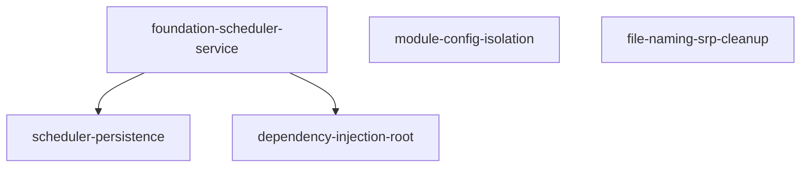

# Foundation Module Specification

## Purpose

Foundation 模块是系统的公共支撑能力层，提供跨业务模块的基础设施能力（调度服务、依赖注入容器、配置管理等横切关注点）。作为支撑能力层的核心模块，它不包含业务逻辑，只为其他模块提供基础设施支撑。

**核心职责**：
- 提供调度器服务（定时任务调度、持久化、执行跟踪）
- 模块级依赖注入容器（Composition Root）
- 模块配置隔离管理
- 代码规范与文件命名规范

## Capabilities

| Capability | Description | Source |
|------------|-------------|--------|
| foundation-scheduler-service | 调度器服务能力 | foundation-scheduler-service |
| scheduler-persistence | 调度配置持久化与执行记录 | scheduler-persistence |
| dependency-injection-root | 模块级依赖注入根 | dependency-injection-root |
| module-config-isolation | 模块配置隔离 | module-config-isolation |
| file-naming-srp-cleanup | 文件命名与单一职责清理 | file-naming-srp-cleanup |

## Capability Dependency Graph

## General Conventions

### Requirement Language
- **SHALL** / **MUST**：强制性要求
- **SHOULD**：推荐性要求
- **MAY**：可选要求

### Testing Convention
每个 `#### Scenario:` 在变更交付时须对应至少一个自动化测试用例（单元或集成）；实现顺序可先实现再补测，以完整测试通过为需求完成标准。

---

## capability: foundation-scheduler-service

> Source: foundation-scheduler-service/spec.md (archived)

Foundation 模块的调度器服务能力——完整的 DDD 四层结构、SchedulerPort 接口契约、Application Service 编排、Job 注册机制、REST API、DI 集成以及领域异常体系。

---

## Requirements

### Requirement: Foundation 模块目录结构

系统 SHALL 在 `src/modules/foundation/` 下建立标准 DDD 四层目录结构。顶层目录 SHALL 包含 `application/`、`domain/`、`infrastructure/`、`presentation/` 四个子包，每个子包 SHALL 包含 `__init__.py`。模块 SHALL 在 `vision-and-modules.md` 的模块注册表（§4.2 支撑与通用模块）中注册。

#### Scenario: 模块目录完整性

- **WHEN** 审查 `src/modules/foundation/` 目录结构
- **THEN** SHALL 存在以下子包：`application/services/`、`application/dtos/`、`domain/ports/`、`domain/dtos/`、`infrastructure/adapters/`、`infrastructure/persistence/`、`infrastructure/di/`、`presentation/rest/`，且每个目录包含 `__init__.py`

#### Scenario: 模块注册表更新

- **WHEN** 审查 `vision-and-modules.md` 的模块注册表
- **THEN** SHALL 存在 Foundation 模块条目，路径为 `src/modules/foundation/`，核心职责为公共支撑能力（调度、消息推送等横切关注点）

---

### Requirement: SchedulerPort 完整接口契约

系统 SHALL 在 `src/modules/foundation/domain/ports/scheduler_port.py` 中定义 `SchedulerPort` 抽象基类（ABC）。`SchedulerPort` SHALL 包含以下抽象方法：

- `schedule_job(job_id, job_func, cron_expression, timezone, **kwargs)`: 调度定时任务
- `start_scheduler()`: 启动调度器
- `shutdown_scheduler()`: 关闭调度器
- `get_job_status(job_id)`: 获取任务状态
- `get_all_jobs()`: 获取所有任务信息
- `remove_job(job_id)`: 移除已调度的任务
- `trigger_job(job_id, **kwargs)`: 立即触发一次任务执行

#### Scenario: 接口方法完整性

- **WHEN** 审查 `SchedulerPort` 抽象方法
- **THEN** SHALL 包含上述 7 个抽象方法，每个方法都有正确的类型注解

#### Scenario: 接口不可实例化

- **WHEN** 尝试直接实例化 `SchedulerPort`
- **THEN** SHALL 抛出 `TypeError` 异常

#### Scenario: remove_job 和 trigger_job 直接调用

- **WHEN** 检查 `SchedulerPort` 的 `remove_job` 和 `trigger_job` 方法
- **THEN** SHALL 不需要 `hasattr()` 检查，可直接调用

---

### Requirement: SchedulerApplicationService 编排能力

系统 SHALL 在 `src/modules/foundation/application/services/scheduler_application_service.py` 中提供 `SchedulerApplicationService` 应用服务。该服务 SHALL 通过 DI 注入 `SchedulerPort` 和相关 Repository，提供高级编排操作：

- `schedule_and_persist_job()`: 调度 + 持久化原子编排
- `stop_and_disable_job()`: 移除任务 + 更新 DB enabled=False
- `trigger_job()`: 通过 `SchedulerPort.trigger_job()` 实际触发任务
- `query_execution_logs()`: 通过 DI 注入的 Repository 查询执行历史

#### Scenario: 原子编排调度和持久化

- **WHEN** 调用 `schedule_and_persist_job()` 调度新任务
- **THEN** SHALL 先通过 Repository upsert 配置，成功后再通过 SchedulerPort 调度；任一步骤失败 SHALL 回滚或抛出异常

#### Scenario: 停止任务并禁用配置

- **WHEN** 调用 `stop_and_disable_job()` 停止任务
- **THEN** SHALL 先通过 SchedulerPort 移除任务，成功后更新 DB enabled=False

#### Scenario: 实际触发任务执行

- **WHEN** 调用 `trigger_job()` 触发任务
- **THEN** SHALL 直接委托给 `SchedulerPort.trigger_job()`，不返回伪响应

#### Scenario: 查询执行历史

- **WHEN** 调用 `query_execution_logs()` 查询历史
- **THEN** SHALL 通过 DI 注入的 Repository 查询，返回格式化的执行记录列表

---

### Requirement: Foundation 领域异常体系

系统 SHALL 在 `src/modules/foundation/domain/exceptions.py` 中创建 Scheduler 异常体系。所有异常 SHALL 继承自 `AppException`，包含以下异常类：

- `SchedulerException`: 基础调度异常
- `SchedulerJobNotFoundException`: 任务未找到异常
- `SchedulerJobAlreadyExistsException`: 任务已存在异常
- `SchedulerExecutionException`: 调度执行异常
- `SchedulerConfigurationException`: 调度配置异常

#### Scenario: 异常继承关系

- **WHEN** 检查 Scheduler 异常类
- **THEN** 所有异常 SHALL 继承自 `AppException`

#### Scenario: 异常类存在性

- **WHEN** 审查异常定义
- **THEN** SHALL 存在上述 5 个异常类，每个都有适当的构造函数

---

### Requirement: APScheduler 适配器实现

系统 SHALL 在 `src/modules/foundation/infrastructure/adapters/apscheduler_adapter.py` 中提供 `APSchedulerAdapter` 实现。该适配器 SHALL：

- 实现 `SchedulerPort` 接口的所有抽象方法
- 封装 APScheduler 的具体操作细节
- 使用 AsyncIOScheduler 作为底层调度器
- 正确处理任务不存在、已存在等异常情况

#### Scenario: 适配器接口实现

- **WHEN** 检查 `APSchedulerAdapter` 类
- **THEN** SHALL 继承自 `SchedulerPort` 并实现所有抽象方法

#### Scenario: Cron 表达式解析

- **WHEN** 调度任务时传入无效的 Cron 表达式
- **THEN** SHALL 抛出 `SchedulerExecutionException`

#### Scenario: 任务重复调度检测

- **WHEN** 尝试调度已存在的 job_id
- **THEN** SHALL 抛出 `SchedulerJobAlreadyExistsException`

#### Scenario: 不存在任务操作

- **WHEN** 尝试移除或触发不存在的 job_id
- **THEN** SHALL 抛出 `SchedulerJobNotFoundException`

---

### Requirement: Foundation DI 容器

系统 SHALL 在 `src/modules/foundation/infrastructure/di/container.py` 中创建 Foundation 模块的 DI 容器。该容器 SHALL：

- 注册 `APSchedulerAdapter` 为 Singleton
- 绑定 `SchedulerPort` 到 `APSchedulerAdapter`
- 提供 Repository Factory 函数
- 提供 `SchedulerApplicationService` Factory 函数
- 导出 `get_scheduler_service()` 工厂函数供其他模块使用

#### Scenario: 适配器 Singleton 注册

- **WHEN** 多次调用 DI 容器获取 `APSchedulerAdapter`
- **THEN** SHALL 返回同一个实例

#### Scenario: Port 接口绑定

- **WHEN** 通过 DI 容器请求 `SchedulerPort`
- **THEN** SHALL 返回 `APSchedulerAdapter` 实例

#### Scenario: Service Factory 可用

- **WHEN** 调用 `get_scheduler_service()` 工厂函数
- **THEN** SHALL 返回配置完整的 `SchedulerApplicationService` 实例

---

### Requirement: REST API 端点迁移

系统 SHALL 将调度器相关的 REST API 从 `data_engineering` 模块迁移到 `foundation` 模块。API SHALL 位于 `src/modules/foundation/presentation/rest/scheduler_routes.py`，包含以下端点：

- `POST /jobs/schedule`: 调度任务（委托给 `schedule_and_persist_job()`）
- `POST /jobs/{job_id}/stop`: 停止任务（委托给 `stop_and_disable_job()`）
- `POST /jobs/{job_id}/trigger`: 触发任务（委托给 `trigger_job()`）
- `GET /jobs/{job_id}/executions`: 获取执行历史（委托给 `query_execution_logs()`）
- `GET /jobs`: 获取所有任务状态
- `GET /status`: 获取调度器状态

#### Scenario: 端点委托应用服务

- **WHEN** 调用任何调度器 API 端点
- **THEN** SHALL 委托给 `SchedulerApplicationService` 的相应方法，不直接操作 Repository 或 SchedulerPort

#### Scenario: 路由注册更新

- **WHEN** 审查主路由注册文件
- **THEN** SHALL 从 Foundation 模块导入 scheduler router，而非从 data_engineering

#### Scenario: Schema 迁移

- **WHEN** 检查 API Schema 定义
- **THEN** SHALL 位于 `src/modules/foundation/presentation/rest/scheduler_schemas.py`，包含 `JobDetail`、`SchedulerStatusResponse`、`ExecutionLogDetail`

---

### Requirement: Job 注册机制重构

系统 SHALL 重构 Job 注册机制，避免 Foundation 模块依赖业务模块。系统 SHALL：

- 在 `src/modules/data_engineering/application/job_registry.py` 中创建业务模块的 Job 注册表
- 在 `main.py` 中从各业务模块收集 Job 注册表并合并
- 将合并后的注册表传递给 Foundation 的 `load_persisted_jobs()` 方法
- Foundation 模块不直接 import 业务模块

#### Scenario: 业务模块 Job 注册表

- **WHEN** 审查 `data_engineering/application/job_registry.py`
- **THEN** SHALL 导出 `get_job_registry()` 函数，返回 `Dict[str, Callable]` 映射

#### Scenario: 主模块合并注册表

- **WHEN** 审查 `main.py` 的启动逻辑
- **THEN** SHALL 从 Foundation 导入 `get_scheduler_service`，从各业务模块导入并合并 Job 注册表

#### Scenario: Foundation 无业务依赖

- **WHEN** 检查 Foundation 模块 import 语句
- **THEN** SHALL 不包含任何业务模块的直接 import

---

### Requirement: 共享模块清理

系统 SHALL 清理 `src/shared/` 中已迁移的 Scheduler 相关代码：

- 删除 `domain/ports/scheduler_port.py`
- 删除 `domain/ports/scheduler_job_config_repository_port.py`
- 删除 `domain/dtos/scheduler_dtos.py`
- 删除 `domain/types.py`
- 删除 `application/services/scheduler_service.py`
- 删除 `application/dtos/scheduler_dtos.py`
- 删除 `infrastructure/adapters/apscheduler_adapter.py`
- 删除 `infrastructure/scheduler/` 整个目录
- 清理 `infrastructure/di/` 中的 Scheduler 相关配置

#### Scenario: 共享目录无残留文件

- **WHEN** 搜索 `src/shared/` 中的 scheduler 相关文件
- **THEN** SHALL 不存在任何 Scheduler 相关的 Python 文件

#### Scenario: 全局 Import 路径更新

- **WHEN** 全局搜索旧路径 import
- **THEN** SHALL 不存在 `from src.shared.domain.ports.scheduler_port` 等旧路径 import

#### Scenario: 共享 DI 容器清理

- **WHEN** 审查 `src/shared/infrastructure/di/container.py`
- **THEN** SHALL 不包含任何 Scheduler 相关的 provider 配置

---

## capability: scheduler-persistence

> Source: scheduler-persistence/spec.md (archived)

调度器配置的数据库持久化、应用启动自动注册、调度执行历史记录与查询能力。

---

## Requirements

### Requirement: 调度配置数据建模与持久化

系统 SHALL 在 `src/modules/foundation/infrastructure/persistence/` 下定义调度配置的持久化模型。`SchedulerJobConfig` SHALL 包含以下字段：`id`（UUID，主键）、`job_id`（str，唯一标识，对应 JOB_REGISTRY 中的 key）、`job_name`（str，人类可读名称）、`cron_expression`（str，APScheduler cron 格式）、`timezone`（str，默认 `"Asia/Shanghai"`）、`enabled`（bool，是否启用）、`job_kwargs`（dict，任务参数）、`created_at`（datetime）、`updated_at`（datetime）、`last_run_at`（datetime，可为 null）。系统 SHALL 通过 Alembic migration 创建 `scheduler_job_config` 表。

#### Scenario: 调度配置表结构完整

- **WHEN** 审查 `scheduler_job_config` 表结构
- **THEN** 表 SHALL 包含上述所有字段，`job_id` 有唯一约束，`enabled` 默认为 `True`

#### Scenario: 通过 Repository 读写配置

- **WHEN** 系统需要查询或更新调度配置
- **THEN** SHALL 通过 `SchedulerJobConfigRepository` 进行，该 Repository 提供 `get_all_enabled()`、`get_by_job_id()`、`upsert()` 方法；Repository 实例 SHALL 通过 DI 容器获取，禁止手动实例化

---

### Requirement: 调度执行记录建模与持久化

系统 SHALL 在 `src/modules/foundation/infrastructure/persistence/` 下定义 `SchedulerExecutionLog` 模型用于记录每次调度执行的详情。`SchedulerExecutionLog` SHALL 包含：`id`（UUID，主键）、`job_id`（str，关联的任务标识）、`started_at`（datetime，执行开始时间）、`finished_at`（datetime，执行结束时间，可为 null）、`status`（枚举：RUNNING / SUCCESS / FAILED）、`error_message`（str，失败时的错误信息，可为 null）、`duration_ms`（int，执行耗时毫秒数，可为 null）。系统 SHALL 通过 Alembic migration 创建 `scheduler_execution_log` 表。

#### Scenario: 执行记录表结构完整

- **WHEN** 审查 `scheduler_execution_log` 表结构
- **THEN** 表 SHALL 包含上述所有字段，`job_id` + `started_at` 有索引便于查询

#### Scenario: 通过 Repository 写入执行记录

- **WHEN** 系统需要记录一次调度执行
- **THEN** SHALL 通过 `SchedulerExecutionLogRepository` 进行，该 Repository 提供 `create()`、`update()`、`get_recent_by_job_id(job_id, limit)` 方法；Repository 实例 SHALL 通过 DI 容器获取，禁止手动实例化

---

### Requirement: 执行跟踪器（ExecutionTracker）

系统 SHALL 在 `src/modules/foundation/infrastructure/execution_tracker.py` 中提供 `ExecutionTracker` 异步上下文管理器，用于包裹 job 函数的执行，自动记录执行日志。`ExecutionTracker` SHALL 在进入时创建一条 RUNNING 状态的 `SchedulerExecutionLog` 记录；正常退出时更新为 SUCCESS 并计算 `duration_ms`；异常退出时更新为 FAILED 并记录 `error_message`。`ExecutionTracker` 自身的持久化操作失败 SHALL NOT 中断被包裹的 job 执行，仅记录 ERROR 级别日志。

#### Scenario: 正常执行记录

- **WHEN** 一个 job 函数在 `ExecutionTracker` 上下文中正常完成
- **THEN** `SchedulerExecutionLog` 记录的 `status` SHALL 为 SUCCESS，`finished_at` 和 `duration_ms` 不为 null

#### Scenario: 异常执行记录

- **WHEN** 一个 job 函数在 `ExecutionTracker` 上下文中抛出异常
- **THEN** `SchedulerExecutionLog` 记录的 `status` SHALL 为 FAILED，`error_message` 包含异常信息，异常 SHALL 继续向上传播

#### Scenario: 日志持久化失败不中断 job

- **WHEN** `ExecutionTracker` 写入 `SchedulerExecutionLog` 时数据库连接失败
- **THEN** job 函数 SHALL 正常执行不受影响，系统记录 ERROR 级别日志

---

### Requirement: 应用启动自动注册调度任务

系统 SHALL 在应用启动时（`main.py` lifespan 中，`SchedulerApplicationService.start_scheduler()` 之后）自动从数据库加载所有 `enabled=True` 的 `SchedulerJobConfig` 并注册到 APScheduler。`SchedulerApplicationService` SHALL 提供 `load_persisted_jobs(registry: Dict[str, Callable])` 方法，接受一个 job 注册表参数（`job_id → job_function` 映射）。该注册表 SHALL 由 `main.py` 从各业务模块的 `application/job_registry.py` 收集合并后传入，Foundation 模块自身 SHALL NOT import 业务模块。对于 DB 中存在但注册表中找不到的 `job_id`，系统 SHALL 记录 WARNING 日志并跳过。加载过程的整体失败 SHALL NOT 阻止应用启动——退化为手动注册模式。

#### Scenario: 正常启动自动注册

- **WHEN** 应用启动，数据库中有 4 条 `enabled=True` 的调度配置，合并注册表中有对应的全部 4 个 job 函数
- **THEN** APScheduler SHALL 注册 4 个 cron 类型的 job，各 job 的 cron 表达式与 DB 配置一致

#### Scenario: 部分 job_id 未注册

- **WHEN** 数据库中有一条 `job_id=unknown_job` 的启用配置，但合并注册表中无此 key
- **THEN** 系统 SHALL 记录 WARNING 日志并跳过该配置，其他有效配置正常注册

#### Scenario: 数据库不可用时退化

- **WHEN** 应用启动时数据库连接失败
- **THEN** `load_persisted_jobs()` SHALL 捕获异常、记录 ERROR 日志，应用正常启动（无自动注册的 job，可后续手动注册）

#### Scenario: disabled 配置不注册

- **WHEN** 数据库中有一条 `enabled=False` 的调度配置
- **THEN** 该 job SHALL NOT 被注册到 APScheduler

---

### Requirement: 预置默认调度计划

系统 SHALL 通过 Alembic migration 在 `scheduler_job_config` 表中 seed 以下默认调度配置（所有配置 `enabled=True`，`timezone=Asia/Shanghai`）：

| job_id | job_name | cron_expression | 说明 |
|--------|----------|-----------------|------|
| `sync_daily_by_date` | 日线增量同步 | `0 18 * * *` | 每天 18:00（北京时间） |
| `sync_incremental_finance` | 财务增量同步 | `0 0 * * *` | 每天 00:00（北京时间） |
| `sync_concept_data` | 概念数据同步 | `0 18 30 * * *` | 每天 18:30（北京时间） |
| `sync_stock_basic` | 股票基础信息同步 | `0 19 * * *` | 每天 19:00（北京时间） |

注意：此处仅 seed 增量/定期同步任务。历史全量同步（`sync_daily_history`、`sync_history_finance`）为一次性操作，不预置调度，保留手动触发方式。

#### Scenario: 首次部署后默认配置存在

- **WHEN** 执行 Alembic migration 后查询 `scheduler_job_config` 表
- **THEN** SHALL 存在上述 4 条默认记录，且 `enabled=True`

#### Scenario: 重复执行 migration 幂等

- **WHEN** 再次执行相同的 Alembic migration
- **THEN** SHALL 使用 `INSERT ... ON CONFLICT DO NOTHING` 保证不重复插入默认配置

---

## capability: dependency-injection-root

> Source: dependency-injection-root/spec.md (archived)

模块级依赖注入根（Composition Root）：每个 Bounded Context 在 `container.py` 中定义 Container 类统一装配依赖，路由文件精简为仅含路由定义 + 单行 Depends，main.py 不直接使用 Infrastructure，routes.py 仅做模块级 router 聚合。

---

## Requirements

### Requirement: 模块级 Composition Root

每个 Bounded Context 须在 `<module>/container.py` 中定义一个 Container 类，作为该模块的统一依赖组装入口。Container 类封装所有 Infrastructure → Application 的 wiring 逻辑，Presentation 层通过 Container 获取 Application Service 实例，不再手写工厂函数链。

#### Scenario: Container 提供 Application Service

- **WHEN** Presentation 层路由需要某个 Application Service（如 `TechnicalAnalystService`）
- **THEN** 路由函数通过 `ResearchContainer(session).technical_analyst_service()` 一次调用获取完整装配的 Service 实例，无需在路由文件中定义多个 `Depends` 工厂函数

#### Scenario: Container 封装跨模块依赖

- **WHEN** Research 模块需要 data_engineering 的 `GetDailyBarsForTickerUseCase`
- **THEN** `ResearchContainer` 内部通过 `DataEngineeringContainer(session).get_daily_bars_use_case()` 获取，Research 的 Presentation 层不直接 import `data_engineering.infrastructure` 下的任何类

#### Scenario: Container 消除工厂函数重复

- **WHEN** 多个路由文件（如 `technical_analyst_routes.py`、`financial_auditor_routes.py`、`valuation_modeler_routes.py`）都需要 `LLMAdapter`
- **THEN** `LLMAdapter` 的构建逻辑仅在 Container 中定义一次，所有路由文件复用同一个 Container 方法

### Requirement: 路由文件精简

重构后的路由文件须仅包含：路由定义、请求/响应模型、从 Container 获取 Service 的一行 `Depends`。所有依赖组装逻辑须从路由文件移除。

#### Scenario: 路由文件无工厂函数

- **WHEN** 审查任意模块的 `presentation/rest/*.py` 路由文件
- **THEN** 文件中不存在手写的 `async def get_xxx_repo()` 或 `def get_xxx_adapter()` 工厂函数链，仅有一个获取 Container 或 Service 的 `Depends` 声明

### Requirement: main.py 不直接使用 Infrastructure

`main.py` 的 startup 逻辑须通过 Application 层服务完成初始化，不直接 import 或实例化 Infrastructure 层组件。

#### Scenario: main.py 启动 LLM Registry

- **WHEN** 应用启动执行 `startup_event()`
- **THEN** `main.py` 调用 `LLMPlatformStartup.initialize()`（Application 层方法），不直接 import `PgLLMConfigRepository` 或 `LLMRegistry`

### Requirement: 路由注册模块自治

各模块在 `presentation/rest/__init__.py` 中导出统一的 `router`，`src/api/routes.py` 仅做模块级 router 聚合。

#### Scenario: routes.py 仅包含模块级 include

- **WHEN** 审查 `src/api/routes.py`
- **THEN** 文件中每个模块仅有一行 `api_router.include_router(xxx_router)`，不直接引用模块内部的子路由文件（如 `technical_analyst_routes`、`config_routes` 等）

#### Scenario: 新增模块路由

- **WHEN** 新增一个 Bounded Context（如 `coordinator`）需要暴露 REST API
- **THEN** 只需在 `coordinator/presentation/rest/__init__.py` 导出 `router`，并在 `routes.py` 增加一行 `include_router`，无需修改其他模块

---

## capability: module-config-isolation

> Source: module-config-isolation/spec.md (archived)

模块配置隔离：全局 `Settings` 瘦身为仅含全局配置，data_engineering 和 llm_platform 各自在 `infrastructure/config.py` 中定义独立的 `BaseSettings` 子类管理模块专属配置（Tushare、同步引擎、LLM、Bocha 等），共用 `.env` 文件，跨模块不可见。

---

## Requirements

### Requirement: 全局配置瘦身

`src/shared/config.py` 的 `Settings` 类须仅包含真正的全局配置项（项目名称、API 前缀、运行环境、CORS、数据库连接），所有模块专属配置须从中移除。

#### Scenario: shared config 不含模块配置

- **WHEN** 审查 `src/shared/config.py`
- **THEN** `Settings` 类中不存在 `TUSHARE_*`、`SYNC_*`、`LLM_*`、`BOCHA_*` 等模块专属配置项

### Requirement: data_engineering 模块配置独立

`data_engineering` 模块须在 `infrastructure/config.py` 中定义独立的 `DataEngineeringConfig(BaseSettings)` 类，包含 Tushare 和同步引擎相关配置，并暴露模块级单例 `de_config`。

#### Scenario: Tushare 配置归属 data_engineering

- **WHEN** data_engineering 模块需要读取 `TUSHARE_TOKEN` 或 `TUSHARE_MIN_INTERVAL`
- **THEN** 通过 `de_config.TUSHARE_TOKEN` 读取（`de_config` 为 `DataEngineeringConfig` 实例），不通过 `settings.TUSHARE_TOKEN`

#### Scenario: 同步配置归属 data_engineering

- **WHEN** 同步引擎需要读取 `SYNC_DAILY_HISTORY_BATCH_SIZE` 等配置
- **THEN** 通过 `de_config.SYNC_DAILY_HISTORY_BATCH_SIZE` 读取，不通过 `settings`

### Requirement: llm_platform 模块配置独立

`llm_platform` 模块须在 `infrastructure/config.py` 中定义独立的 `LLMPlatformConfig(BaseSettings)` 类，包含 LLM 和 Web Search 相关配置，并暴露模块级单例 `llm_config`。

#### Scenario: LLM 配置归属 llm_platform

- **WHEN** llm_platform 模块需要读取 `LLM_API_KEY`、`LLM_BASE_URL`、`LLM_MODEL`
- **THEN** 通过 `llm_config.LLM_API_KEY` 读取，不通过 `settings`

#### Scenario: Bocha 配置归属 llm_platform

- **WHEN** Web Search 功能需要读取 `BOCHA_API_KEY`、`BOCHA_BASE_URL`
- **THEN** 通过 `llm_config.BOCHA_API_KEY` 读取，不通过 `settings`

### Requirement: 环境变量兼容性

模块级 Config 须与全局 Config 共用同一个 `.env` 文件，迁移后不要求用户修改环境变量名称。

#### Scenario: .env 文件无需变更

- **WHEN** 将模块配置从 `shared/config.py` 迁移到各模块 `infrastructure/config.py`
- **THEN** `.env` 文件中的环境变量名称保持不变（如 `TUSHARE_TOKEN` 仍为 `TUSHARE_TOKEN`），各模块的 `BaseSettings` 自动从同一个 `.env` 加载

### Requirement: 配置跨模块不可见

模块的配置实例仅在自身模块内部可访问，其他模块不可直接 import 或读取。

#### Scenario: Research 无法读取 Tushare 配置

- **WHEN** Research 模块代码中尝试 `from src.modules.data_engineering.infrastructure.config import de_config`
- **THEN** 此 import 违反跨模块依赖规范（Research 不应依赖 data_engineering 的 Infrastructure 层），代码审查须拒绝

---

## capability: file-naming-srp-cleanup

> Source: file-naming-srp-cleanup/spec.md (archived)

文件命名与单一职责清理：DTO 从 `domain/ports/` 迁出到 `domain/dtos/`、混合 DTO 文件按职责拆分、文件名与主类名 snake_case 对齐、公共类型别名去重、Query/Command 目录归属修正、agents 目录归入 infrastructure。

---

## Requirements

### Requirement: DTO 从 ports 目录迁出

`domain/ports/` 目录须仅包含 Port 接口（ABC 抽象类），所有 DTO 文件须迁移到 `domain/dtos/` 子包。

#### Scenario: ports 目录仅含接口

- **WHEN** 审查任意模块的 `domain/ports/` 目录
- **THEN** 目录下所有 `.py` 文件仅定义 ABC 抽象类（Port 接口），不包含 DTO、数据模型或类型别名定义

#### Scenario: Research DTO 迁移到 domain/dtos

- **WHEN** 审查 `research/domain/dtos/` 目录
- **THEN** 原 `ports/dto_inputs.py`、`ports/dto_financial_inputs.py`、`ports/dto_valuation_inputs.py` 中的 DTO 类已迁移到此目录下的独立文件中

### Requirement: 混合 DTO 文件拆分

单个文件中不得混合不同用途的 DTO（如原始输入 DTO 与聚合快照 DTO）。每个文件承担单一职责。

#### Scenario: 财务 DTO 拆分

- **WHEN** 审查 `research/domain/dtos/` 目录
- **THEN** `FinanceRecordInput`（原始输入）和 `FinancialSnapshotDTO`（聚合快照）分别位于不同的文件中（如 `financial_record_input.py` 和 `financial_snapshot.py`）

#### Scenario: 估值 DTO 拆分

- **WHEN** 审查 `research/domain/dtos/` 目录
- **THEN** `StockOverviewInput`/`ValuationDailyInput`（原始输入）和 `ValuationSnapshotDTO`（聚合快照）分别位于不同的文件中

### Requirement: DTO 文件语义化命名

DTO 文件名须体现所属能力和用途，禁止使用泛称。

#### Scenario: dtos.py 重命名

- **WHEN** 审查 `research/domain/` 目录
- **THEN** 不存在名为 `dtos.py` 的文件；原 `dtos.py` 中的技术分析 DTO 已重命名为 `technical_analysis_dtos.py`

### Requirement: 文件名与类名对齐

每个 `.py` 文件的文件名须为其主要类名的 snake_case 形式。

#### Scenario: daily_bar.py 重命名

- **WHEN** 审查 `data_engineering/domain/model/` 目录
- **THEN** 实体类 `StockDaily` 所在文件名为 `stock_daily.py`（而非 `daily_bar.py`）

### Requirement: 公共类型别名去重

跨文件复用的类型别名须提取到公共位置，禁止在多个文件中重复定义。

#### Scenario: PlaceholderValue 统一定义

- **WHEN** 在代码库中搜索 `PlaceholderValue` 的定义
- **THEN** 仅在 `research/domain/dtos/types.py`（或等效公共位置）中定义一次，所有使用方通过 import 引用，不存在重复定义

#### Scenario: PlaceholderValue 定义一致

- **WHEN** 审查 `PlaceholderValue` 的类型定义
- **THEN** 定义为 `Union[float, int, str, list[float], list[int], list[str]]`（统一包含标量和列表类型），消除原有两处定义不一致的问题

### Requirement: Query 与 Command 归属正确

`application/commands/` 仅包含写操作 UseCase；只读查询 UseCase 须归入 `application/queries/`。

#### Scenario: get_stock_basic_info 归入 queries

- **WHEN** 审查 `data_engineering/application/` 目录结构
- **THEN** `GetStockBasicInfoUseCase` 位于 `application/queries/get_stock_basic_info.py`，不在 `commands/` 下

### Requirement: agents 目录归入 infrastructure

非四层标准目录的内容须归入 `infrastructure/` 下。

#### Scenario: research agents 迁移

- **WHEN** 审查 `research/` 模块顶层目录
- **THEN** 不存在独立的 `agents/` 目录；Prompt 模板等 Agent 相关资源位于 `infrastructure/agents/` 下

---

## Best Practices Checklist

### YAML Frontmatter
- [x] 包含 `title`：模块规格标题
- [x] 包含 `version`：版本号
- [x] 包含 `last_updated`：最后更新日期（YYYY-MM-DD）
- [x] 包含 `module`：模块名称
- [x] 包含 `capabilities`：能力列表
- [x] 包含 `source_specs`：原始 spec 来源列表（如适用）

### Document Structure
- [x] 有 `## Purpose` 部分：模块目的概述
- [x] 有 `## Capabilities` 部分：能力列表表格
- [x] 有 `## General Conventions` 部分：通用约定
- [x] 每个 capability 有来源注释：`> Source: ...`
- [x] 使用 `---` 分隔不同的 capability

### Content Guidelines
- [x] 使用 `## Requirements` 而非 `## ADDED Requirements`（归档后的主 spec）
- [x] 所有需求标题使用 `### Requirement:` 前缀
- [x] 所有场景标题使用 `#### Scenario:` 前缀
- [x] 场景使用 **WHEN** / **THEN** 格式
- [x] 使用一致的需求语言（SHALL/MUST/SHOULD/MAY）
- [x] 中文注释和文档字符串

### Readability
- [x] 标题清晰、描述性强
- [x] 表格格式规范对齐
- [x] 代码块有语言标识
- [x] 长文件考虑添加目录（TOC）

### Maintenance
- [x] 更新 `last_updated` 日期
- [x] 保持 `version` 号同步
- [x] 记录 `source_specs` 便于追溯
