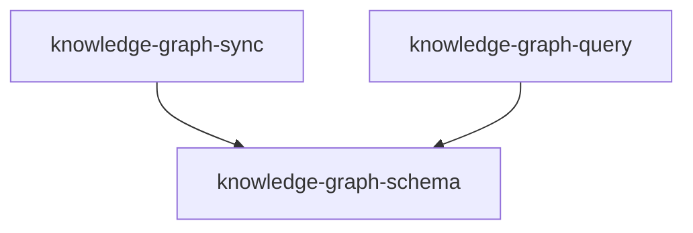

# Knowledge Center Module Specification

## Purpose

Knowledge Center 模块负责知识图谱的定义、同步、查询。它提供股票知识图谱的 Schema 定义、从数据工程模块到 Neo4j 的数据同步、图谱查询能力。

**核心职责**：
- 定义知识图谱的节点和关系结构
- 提供从 PostgreSQL 到 Neo4j 的数据同步能力
- 支持股票同维度邻居查询和个股关系网络查询
- 提供基础概念板块信息查询

## Capabilities

| Capability | Description | Source |
|------------|-------------|--------|
| knowledge-graph-schema | 知识图谱 Schema 定义 | knowledge-center/knowledge-graph-schema |
| knowledge-graph-sync | 知识图谱数据同步 | knowledge-center/knowledge-graph-sync |
| knowledge-graph-query | 知识图谱查询 | knowledge-center/knowledge-graph-query |

## Capability Dependency Graph



## General Conventions

### Requirement Language
- **SHALL** / **MUST**：强制性要求
- **SHOULD**：推荐性要求
- **MAY**：可选要求

### Testing Convention
每个 `#### Scenario:` 在变更交付时须对应至少一个自动化测试用例（单元或集成）；实现顺序可先实现再补测，以完整测试通过为需求完成标准。

---

## capability: knowledge-graph-schema

> Source: knowledge-center/knowledge-graph-schema/spec.md (archived)

定义知识图谱的节点和关系结构，包括股票节点和各维度节点的关系模型。

---

## Requirements (knowledge-graph-schema)

### Requirement: Stock 节点定义

系统 SHALL 在 Neo4j 中维护 `Stock` 标签节点，每个节点代表一支股票。节点 MUST 以 `third_code` 作为唯一约束键。

节点属性 MUST 包含：
- `third_code`（String，唯一约束）
- `symbol`（String）
- `name`（String）
- `fullname`（String，可为 null）
- `list_date`（String，格式 YYYYMMDD）
- `list_status`（String，枚举：L / D / P）
- `curr_type`（String）

节点属性 MAY 包含以下财务快照字段（来自最新一期财务报表）：
- `roe`、`roa`、`gross_margin`、`debt_to_assets`（盈利与杠杆指标）
- `pe_ttm`、`pb`、`total_mv`（估值指标）

#### Scenario: 创建 Stock 节点

- **WHEN** 同步管道写入一条 `third_code = "000001.SZ"` 的股票数据
- **THEN** Neo4j 中 MUST 存在一个 `(:Stock {third_code: "000001.SZ"})` 节点，包含 `symbol`、`name`、`list_date` 等属性

#### Scenario: Stock 节点唯一约束

- **WHEN** 对同一 `third_code` 执行两次写入
- **THEN** Neo4j 中仅存在一个该 `third_code` 的 Stock 节点，属性为最新一次写入的值

### Requirement: Industry 维度节点定义

系统 SHALL 维护 `Industry` 标签节点，每个节点代表一个行业分类。节点 MUST 以 `name` 作为唯一约束键。

#### Scenario: 创建 Industry 节点

- **WHEN** 同步管道写入行业为"银行"的股票
- **THEN** Neo4j 中 MUST 存在 `(:Industry {name: "银行"})` 节点

#### Scenario: 同行业股票共享同一 Industry 节点

- **WHEN** 两支股票（"000001.SZ" 和 "601398.SH"）均属于"银行"行业
- **THEN** 两个 Stock 节点 MUST 通过关系连接到同一个 `(:Industry {name: "银行"})` 节点

### Requirement: Area 维度节点定义

系统 SHALL 维护 `Area` 标签节点，每个节点代表一个地域。节点 MUST 以 `name` 作为唯一约束键。

#### Scenario: 创建 Area 节点

- **WHEN** 同步管道写入地域为"深圳"的股票
- **THEN** Neo4j 中 MUST 存在 `(:Area {name: "深圳"})` 节点

### Requirement: Market 维度节点定义

系统 SHALL 维护 `Market` 标签节点，每个节点代表一个市场板块（主板、中小板、创业板、科创板等）。节点 MUST 以 `name` 作为唯一约束键。

#### Scenario: 创建 Market 节点

- **WHEN** 同步管道写入市场为"主板"的股票
- **THEN** Neo4j 中 MUST 存在 `(:Market {name: "主板"})` 节点

### Requirement: Exchange 维度节点定义

系统 SHALL 维护 `Exchange` 标签节点，每个节点代表一个交易所（SSE / SZSE 等）。节点 MUST 以 `name` 作为唯一约束键。

#### Scenario: 创建 Exchange 节点

- **WHEN** 同步管道写入交易所为"SSE"的股票
- **THEN** Neo4j 中 MUST 存在 `(:Exchange {name: "SSE"})` 节点

### Requirement: BELONGS_TO_INDUSTRY 关系定义

系统 SHALL 在 Stock 节点与 Industry 节点之间创建 `BELONGS_TO_INDUSTRY` 关系。方向为 `(Stock)-[:BELONGS_TO_INDUSTRY]->(Industry)`。

每个 Stock MUST 最多有一条 `BELONGS_TO_INDUSTRY` 关系。若股票无行业信息（`industry` 为 null 或空），则 MUST NOT 创建该关系。

#### Scenario: 建立行业关系

- **WHEN** 股票 "000001.SZ" 的 `industry` 字段为"银行"
- **THEN** MUST 存在 `(:Stock {third_code: "000001.SZ"})-[:BELONGS_TO_INDUSTRY]->(:Industry {name: "银行"})` 关系

#### Scenario: 行业为空时不建关系

- **WHEN** 某股票的 `industry` 字段为 null
- **THEN** 该 Stock 节点 MUST NOT 存在 `BELONGS_TO_INDUSTRY` 关系

### Requirement: LOCATED_IN 关系定义

系统 SHALL 在 Stock 节点与 Area 节点之间创建 `LOCATED_IN` 关系。方向为 `(Stock)-[:LOCATED_IN]->(Area)`。

每个 Stock MUST 最多有一条 `LOCATED_IN` 关系。

#### Scenario: 建立地域关系

- **WHEN** 股票 "000001.SZ" 的 `area` 字段为"深圳"
- **THEN** MUST 存在 `(:Stock {third_code: "000001.SZ"})-[:LOCATED_IN]->(:Area {name: "深圳"})` 关系

### Requirement: TRADES_ON 关系定义

系统 SHALL 在 Stock 节点与 Market 节点之间创建 `TRADES_ON` 关系。方向为 `(Stock)-[:TRADES_ON]->(Market)`。

#### Scenario: 建立市场关系

- **WHEN** 股票 "000001.SZ" 的 `market` 字段为"主板"
- **THEN** MUST 存在 `(:Stock {third_code: "000001.SZ"})-[:TRADES_ON]->(:Market {name: "主板"})` 关系

### Requirement: LISTED_ON 关系定义

系统 SHALL 在 Stock 节点与 Exchange 节点之间创建 `LISTED_ON` 关系。方向为 `(Stock)-[:LISTED_ON]->(Exchange)`。

#### Scenario: 建立交易所关系

- **WHEN** 股票 "000001.SZ" 的 `exchange` 字段为"SZSE"
- **THEN** MUST 存在 `(:Stock {third_code: "000001.SZ"})-[:LISTED_ON]->(:Exchange {name: "SZSE"})` 关系

### Requirement: Concept 节点定义

系统 SHALL 在 Neo4j 中维护 `Concept` 标签节点，每个节点代表一个概念题材板块（如"低空经济"、"人形机器人"）。节点 MUST 以 `code` 作为唯一约束键。

节点属性 MUST 包含：

- `code`（String，唯一约束）：概念板块代码（如 `BK0493`）
- `name`（String）：概念板块名称（如 "低空经济"）

#### Scenario: 创建 Concept 节点

- **WHEN** 同步管道写入概念板块 `code = "BK0493"`、`name = "低空经济"`
- **THEN** Neo4j 中 MUST 存在 `(:Concept {code: "BK0493", name: "低空经济"})` 节点

#### Scenario: Concept 节点唯一约束

- **WHEN** 对同一 `code` 执行两次写入（第二次 `name` 有变化）
- **THEN** Neo4j 中仅存在一个该 `code` 的 Concept 节点，`name` 属性为最新一次写入的值

### Requirement: BELONGS_TO_CONCEPT 关系定义

系统 SHALL 在 Stock 节点与 Concept 节点之间创建 `BELONGS_TO_CONCEPT` 关系。方向为 `(Stock)-[:BELONGS_TO_CONCEPT]->(Concept)`。

与 `BELONGS_TO_INDUSTRY` 不同，一个 Stock 节点 MAY 拥有**多条** `BELONGS_TO_CONCEPT` 关系（多对多关系：一股多概念，一概念多股）。

#### Scenario: 建立概念关系

- **WHEN** 股票 `000001.SZ` 属于概念 `BK0493`（低空经济）
- **THEN** MUST 存在 `(:Stock {third_code: "000001.SZ"})-[:BELONGS_TO_CONCEPT]->(:Concept {code: "BK0493"})` 关系

#### Scenario: 一股多概念

- **WHEN** 股票 `000001.SZ` 同时属于 `BK0493`（低空经济）和 `BK0612`（人形机器人）
- **THEN** 该 Stock 节点 MUST 有两条 `BELONGS_TO_CONCEPT` 关系，分别指向两个不同的 Concept 节点

#### Scenario: 概念成份股不存在于图谱时不建关系

- **WHEN** 概念成份股列表中的某个 `third_code` 在 Neo4j 中不存在对应的 Stock 节点
- **THEN** MUST NOT 为该股票创建 `BELONGS_TO_CONCEPT` 关系
- **THEN** 该情况 MUST 被记录到日志（WARNING 级别），包含股票代码和概念名称

### Requirement: 图谱约束初始化

系统 SHALL 在首次连接 Neo4j 或同步前自动创建所有唯一约束：
- `Stock.third_code` UNIQUE
- `Industry.name` UNIQUE
- `Area.name` UNIQUE
- `Market.name` UNIQUE
- `Exchange.name` UNIQUE
- `Concept.code` UNIQUE

#### Scenario: 约束自动创建

- **WHEN** 应用启动并首次连接 Neo4j
- **THEN** 上述 6 个唯一约束 MUST 存在于 Neo4j Schema 中

#### Scenario: Concept 约束自动创建

- **WHEN** 应用启动并执行约束初始化
- **THEN** `Concept.code` 唯一约束 MUST 存在于 Neo4j Schema 中

#### Scenario: 约束已存在时幂等

- **WHEN** 约束初始化逻辑重复执行
- **THEN** 不产生错误，约束保持不变

---

## capability: knowledge-graph-sync

> Source: knowledge-center/knowledge-graph-sync/spec.md (archived)

提供从数据工程模块到知识图谱的数据同步能力，支持全量和增量同步策略。

---

## Requirements (knowledge-graph-sync)

### Requirement: 全量同步命令

系统 SHALL 提供全量同步命令（`SyncGraphCommand`，mode=full），从 `data_engineering` 模块读取所有 StockInfo 数据并写入 Neo4j 图谱。

全量同步 MUST 包含以下步骤：
1. 通过 `data_engineering` 的 Port 查询所有股票基本信息。
2. 通过 Adapter 将跨模块 DTO 转换为本模块 `GraphSyncDTO`。
3. 调用 `GraphRepository` 批量写入 Stock 节点、维度节点及关系。
4. 可选同步最新财务快照（通过 `FinancialRepo` Port）。

#### Scenario: 首次全量同步

- **WHEN** 用户触发全量同步命令且 Neo4j 图谱为空
- **THEN** 系统从 PostgreSQL 读取所有 StockInfo 记录，在 Neo4j 中为每条记录创建 Stock 节点及对应维度节点和关系
- **THEN** 同步完成后 Neo4j 中 Stock 节点总数 MUST 等于 PostgreSQL `stock_info` 表中的记录数

#### Scenario: 重复全量同步幂等

- **WHEN** 对已存在数据的图谱执行全量同步
- **THEN** 使用 Cypher MERGE 确保节点和关系不重复，属性更新为最新值
- **THEN** 同步前后 Stock 节点总数保持不变（除非源数据有增减）

### Requirement: 增量同步命令

系统 SHALL 提供增量同步命令（`SyncGraphCommand`，mode=incremental），仅同步指定范围的股票数据。

增量同步 MUST 支持以下过滤方式（至少一种）：
- 指定 `third_codes` 列表：仅同步指定股票。
- 指定时间窗口：同步在该时间窗口内有数据变更的股票。

#### Scenario: 按股票代码增量同步

- **WHEN** 用户触发增量同步，指定 `third_codes = ["000001.SZ", "601398.SH"]`
- **THEN** 系统仅查询并同步这两支股票的数据到 Neo4j
- **THEN** 其他股票的图谱数据保持不变

#### Scenario: 增量同步新增股票

- **WHEN** PostgreSQL 中新增了一支股票 "688001.SH"，触发增量同步包含该股票
- **THEN** Neo4j 中 MUST 新增该 Stock 节点及对应维度关系

### Requirement: 批量写入性能

同步管道 MUST 使用批量写入策略（Cypher UNWIND + MERGE），避免逐条事务提交。

每批提交的记录数 SHALL 可配置，默认值为 500。

#### Scenario: 批量写入执行

- **WHEN** 同步 5000 条股票数据，批量大小为 500
- **THEN** 系统 MUST 分 10 批提交，每批包含约 500 条 MERGE 操作
- **THEN** 不 SHALL 出现单条逐一提交的情况

### Requirement: 财务快照同步

同步管道 SHALL 支持将最新一期财务报表数据同步为 Stock 节点的属性。

同步的财务字段 MUST 包含：`roe`、`roa`、`gross_margin`、`debt_to_assets`、`pe_ttm`、`pb`、`total_mv`。

#### Scenario: 同步财务快照

- **WHEN** 全量同步包含财务数据
- **THEN** Stock 节点的财务属性 MUST 反映该股票最新一期（`end_date` 最大）的财务数据

#### Scenario: 无财务数据时属性为 null

- **WHEN** 某股票在 PostgreSQL 中无财务报表记录
- **THEN** 该 Stock 节点的财务属性 MUST 为 null（不设默认值）

### Requirement: 跨模块数据读取通过 Adapter

同步管道从 `data_engineering` 读取数据 MUST 通过 `knowledge_center/infrastructure/adapters/data_engineering_adapter.py` 完成。

Adapter MUST 将 `data_engineering` 的 DTO 转换为本模块 `domain/dtos/graph_sync_dtos.py` 中定义的 DTO。Domain 层 MUST NOT import `data_engineering` 的任何类型。

#### Scenario: Adapter 数据转换

- **WHEN** Adapter 从 `data_engineering` 获取 StockInfo 数据
- **THEN** 返回的 DTO 类型 MUST 属于 `knowledge_center.domain.dtos` 包
- **THEN** 不包含对 `data_engineering` 模块类型的直接引用

### Requirement: 同步错误处理

同步管道 MUST 对单条记录的写入失败进行容错处理，不 SHALL 因个别记录失败而中断整个同步流程。

失败记录 MUST 被记录到日志中（包含 `third_code` 和错误信息），日志级别为 ERROR。

#### Scenario: 单条记录失败不中断同步

- **WHEN** 同步过程中某一条股票数据因属性格式异常导致写入 Neo4j 失败
- **THEN** 该记录的错误信息 MUST 被记录到日志
- **THEN** 其余记录的同步 MUST 正常继续

#### Scenario: 同步完成后报告结果

- **WHEN** 同步命令执行完毕
- **THEN** MUST 返回同步结果摘要，包含：成功数量、失败数量、总耗时

### Requirement: 概念数据全量同步命令

系统 SHALL 提供概念图谱全量同步命令（`SyncConceptGraphCmd`），从 `data_engineering` 的 PostgreSQL（通过适配器）读取概念板块数据并写入 Neo4j 图谱。

前置条件：概念数据已通过 DE 模块的 `SyncConceptDataCmd` 同步到 PostgreSQL。

同步 MUST 包含以下步骤：

1. 通过 KC 适配器调用 DE 的 `IConceptRepository.get_all_concepts_with_stocks()` 获取所有概念及成份股
2. 删除 Neo4j 中所有现有的 `BELONGS_TO_CONCEPT` 关系（先清策略）
3. 批量 MERGE Concept 节点（by code）
4. 批量创建 `(Stock)-[:BELONGS_TO_CONCEPT]->(Concept)` 关系（仅当 Stock 节点已存在时）

#### Scenario: 首次概念图谱同步

- **WHEN** 用户触发概念图谱同步且 Neo4j 中无 Concept 节点
- **THEN** 系统从 DE 的 PostgreSQL 读取所有概念板块及成份股
- **THEN** Neo4j 中 MUST 创建对应的 Concept 节点和 BELONGS_TO_CONCEPT 关系

#### Scenario: 重复概念同步保持一致

- **WHEN** 对已存在概念数据的图谱再次执行全量同步
- **THEN** 旧的 BELONGS_TO_CONCEPT 关系 MUST 先被全部删除
- **THEN** 基于 PostgreSQL 中的最新数据重建所有 Concept 节点（MERGE）和关系
- **THEN** 若某股票已从某概念中移除，新图谱中 MUST NOT 存在该陈旧关系

#### Scenario: PostgreSQL 无概念数据时

- **WHEN** 触发概念图谱同步但 DE 的 PostgreSQL 中无概念数据
- **THEN** 同步命令 MUST 记录 WARNING 日志并返回空结果（概念总数 = 0），不抛出异常

#### Scenario: 同步完成后报告结果

- **WHEN** 概念同步命令执行完毕
- **THEN** MUST 返回同步结果摘要，包含：概念总数、Concept 节点数、创建的关系总数、总耗时

### Requirement: 概念同步的批量写入

概念同步管道 MUST 使用批量写入策略，避免逐条事务提交。

- Concept 节点 MUST 使用 Cypher `UNWIND + MERGE` 批量写入
- BELONGS_TO_CONCEPT 关系 MUST 使用 Cypher `UNWIND + MATCH + MERGE` 批量写入（MATCH Stock 节点，仅当存在时创建关系）

#### Scenario: 批量写入概念节点

- **WHEN** 同步 300 个概念板块
- **THEN** 系统 MUST 使用批量操作写入，不 SHALL 逐条提交

#### Scenario: 批量写入概念关系

- **WHEN** 某概念有 50 个成份股
- **THEN** 系统 MUST 通过 UNWIND 一次性写入该概念的所有 Stock-Concept 关系

### Requirement: 跨模块概念数据读取通过 Adapter

`knowledge_center` 从 `data_engineering` 获取概念数据 MUST 通过 `knowledge_center/infrastructure/adapters/` 下的适配器完成。

适配器 MUST 注入 DE 的 `IConceptRepository`（或 DE 暴露的应用服务），调用 `get_all_concepts_with_stocks()` 查询 PostgreSQL 中的概念数据。

适配器 MUST 将 `data_engineering` 的 DTO（`ConceptWithStocksDTO`）转换为 `knowledge_center` 的 `domain/dtos/` 中定义的同步 DTO（`ConceptGraphSyncDTO`）。`knowledge_center` 的 Domain 层 MUST NOT import `data_engineering` 的任何类型。

#### Scenario: Adapter 从 PostgreSQL 读取数据

- **WHEN** Adapter 被调用获取概念数据
- **THEN** 实际数据来源 MUST 为 DE 模块的 PostgreSQL（`concept` + `concept_stock` 表）
- **THEN** 返回的 DTO 类型 MUST 属于 `knowledge_center.domain.dtos` 包

#### Scenario: Domain 层无跨模块依赖

- **WHEN** 检查 `knowledge_center` 的 Domain 层代码
- **THEN** MUST NOT 存在对 `data_engineering` 模块类型的 import

### Requirement: IGraphRepository 扩展概念同步方法

`IGraphRepository` 接口 MUST 新增以下方法：

- `merge_concepts(concepts: list[ConceptGraphSyncDTO]) -> SyncResult`：批量写入/更新 Concept 节点及其与 Stock 的关系
- `delete_all_concept_relationships() -> int`：删除所有 BELONGS_TO_CONCEPT 关系，返回删除数量

#### Scenario: merge_concepts 写入概念数据

- **WHEN** 调用 `merge_concepts()` 传入概念数据列表
- **THEN** Neo4j 中 MUST 存在对应的 Concept 节点和 BELONGS_TO_CONCEPT 关系

#### Scenario: delete_all_concept_relationships 清理关系

- **WHEN** 调用 `delete_all_concept_relationships()`
- **THEN** Neo4j 中所有 `BELONGS_TO_CONCEPT` 关系 MUST 被删除
- **THEN** Concept 节点本身 MUST 保留（仅删关系）
- **THEN** 返回值为被删除的关系数量

### Requirement: 同步通过 REST API 触发

系统 SHALL 提供 REST 端点触发图谱同步：

```
POST /api/v1/knowledge-graph/sync
Body: { "mode": "full" | "incremental", "third_codes": ["..."], "target": "stock" | "concept" | "all" }
```

`third_codes` 仅在 `mode = "incremental"` 且 `target = "stock"` 时有效，为空时根据时间窗口自动确定范围。

`target` 为可选参数，默认值为 `"stock"`：

- `"stock"`：执行现有的股票元数据同步（行为不变）
- `"concept"`：执行概念数据全量同步（忽略 `mode` 和 `third_codes`，概念同步仅支持全量模式）
- `"all"`：依次执行股票同步和概念同步

#### Scenario: 通过 API 触发全量同步（默认行为不变）

- **WHEN** 发送 `POST /api/v1/knowledge-graph/sync` 且 body 为 `{"mode": "full"}`
- **THEN** 系统执行全量股票元数据同步并返回 200 及同步结果摘要（行为与变更前一致）

#### Scenario: 通过 API 触发概念同步

- **WHEN** 发送 `POST /api/v1/knowledge-graph/sync` 且 body 为 `{"mode": "full", "target": "concept"}`
- **THEN** 系统执行概念全量同步并返回 200 及概念同步结果摘要

#### Scenario: 通过 API 触发增量同步

- **WHEN** 发送 `POST /api/v1/knowledge-graph/sync` 且 body 为 `{"mode": "incremental", "third_codes": ["000001.SZ"]}`
- **THEN** 系统仅同步指定股票并返回 200 及同步结果摘要

#### Scenario: 通过 API 触发全部同步

- **WHEN** 发送 `POST /api/v1/knowledge-graph/sync` 且 body 为 `{"mode": "full", "target": "all"}`
- **THEN** 系统依次执行股票全量同步和概念全量同步，返回 200 及合并的同步结果摘要

---

## capability: knowledge-graph-query

> Source: knowledge-center/knowledge-graph-query/spec.md (archived)

提供知识图谱查询能力，支持股票同维度邻居查询和个股关系网络查询。

---

## Requirements (knowledge-graph-query)

### Requirement: 查询同维度股票（Neighbors）

系统 SHALL 通过 `GraphService` 提供查询与指定股票共享同一维度节点的其他股票的能力。

支持的维度 MUST 包含：`industry`、`area`、`market`、`exchange`、`concept`。

查询结果 MUST 返回邻居股票列表，每条记录至少包含：`third_code`、`name`、`industry`（若查询维度为 industry 则为该行业名）。

当 `dimension = "concept"` 时，查询 MUST 额外要求 `dimension_name` 参数指定概念名称（因为一只股票可属于多个概念，需明确查询哪个概念的同概念股），返回该概念下的其他成份股。

结果 MUST 支持 `limit` 参数限制返回数量，默认值为 20。

#### Scenario: 查询同行业股票

- **WHEN** 查询 `third_code = "000001.SZ"`、`dimension = "industry"` 的邻居
- **THEN** 返回与 "000001.SZ" 属于同一行业的其他 Stock 列表
- **THEN** 结果 MUST NOT 包含查询股票自身（"000001.SZ"）

#### Scenario: 查询同地区股票

- **WHEN** 查询 `third_code = "000001.SZ"`、`dimension = "area"` 的邻居
- **THEN** 返回与 "000001.SZ" 位于同一地域的其他 Stock 列表

#### Scenario: 查询同概念股票

- **WHEN** 查询 `third_code = "000001.SZ"`、`dimension = "concept"`、`dimension_name = "低空经济"` 的邻居
- **THEN** 返回与 "000001.SZ" 同属于"低空经济"概念的其他 Stock 列表
- **THEN** 结果 MUST NOT 包含查询股票自身

#### Scenario: 概念维度缺少 dimension_name

- **WHEN** 查询 `dimension = "concept"` 但未提供 `dimension_name`
- **THEN** MUST 返回参数校验错误（HTTP 422 或领域异常）

#### Scenario: 股票不存在时返回空

- **WHEN** 查询一个不存在的 `third_code = "999999.XX"` 的邻居
- **THEN** 返回空列表，不抛出异常

#### Scenario: limit 参数生效

- **WHEN** 某行业有 50 支股票，查询时 `limit = 10`
- **THEN** 返回结果最多 10 条

### Requirement: 查询个股关系网络（Graph）

系统 SHALL 提供查询指定股票的完整关系网络能力，返回该股票及其所有直接关联的维度节点和关系。

查询 MUST 支持 `depth` 参数（默认值 1），表示关系遍历深度。MVP 阶段仅需支持 `depth = 1`。

返回结果 MUST 包含：
- 中心 Stock 节点及其属性
- 所有关联的维度节点（Industry / Area / Market / Exchange / **Concept**）
- 连接它们的关系类型

#### Scenario: 查询深度为 1 的关系网络

- **WHEN** 查询 `third_code = "000001.SZ"`、`depth = 1`
- **THEN** 返回结果包含 "000001.SZ" Stock 节点及其关联的 Industry、Area、Market、Exchange、Concept 节点和关系

#### Scenario: 股票属于多个概念

- **WHEN** 股票 "000001.SZ" 属于 3 个概念
- **THEN** 关系网络中 MUST 包含 3 个 Concept 节点及对应的 BELONGS_TO_CONCEPT 关系

#### Scenario: 股票无某维度关系

- **WHEN** 某股票的 `industry` 为 null（无 BELONGS_TO_INDUSTRY 关系）
- **THEN** 返回结果中不包含 Industry 节点，但其他维度关系正常返回

#### Scenario: 股票不存在时返回 null

- **WHEN** 查询一个不存在的 `third_code = "999999.XX"` 的关系网络
- **THEN** 返回 null 或空结果，不抛出异常

### Requirement: GraphRepository Port 定义

系统 MUST 在 `knowledge_center/domain/ports/graph_repository.py` 中定义 `GraphRepository` ABC 接口。

该接口 MUST 至少包含以下方法：
- `merge_stocks(stocks: list[StockGraphDTO]) -> SyncResult`：批量写入/更新 Stock 节点及维度关系
- `merge_dimensions(dimensions: list[DimensionDTO]) -> None`：批量写入/更新维度节点
- `merge_concepts(concepts: list[ConceptGraphSyncDTO]) -> SyncResult`：批量写入/更新 Concept 节点及其与 Stock 的关系
- `delete_all_concept_relationships() -> int`：删除所有 BELONGS_TO_CONCEPT 关系
- `find_neighbors(third_code: str, dimension: str, limit: int, dimension_name: str | None = None) -> list[StockNeighborDTO]`：查询同维度股票，`dimension_name` 在 `dimension="concept"` 时必填
- `find_stock_graph(third_code: str, depth: int) -> StockGraphDTO | None`：查询个股关系网络（包含 Concept 节点）
- `ensure_constraints() -> None`：确保图谱唯一约束存在（包含 Concept.code）

#### Scenario: Port 在 Domain 层定义

- **WHEN** 检查 `GraphRepository` 的定义位置
- **THEN** 该 ABC 接口 MUST 位于 `src/modules/knowledge_center/domain/ports/graph_repository.py`
- **THEN** 接口方法的入参和出参 MUST 使用 `domain/dtos/` 中定义的 DTO 类型

### Requirement: GraphService 应用服务

系统 MUST 在 `knowledge_center/application/services/graph_service.py` 中定义 `GraphService`，作为 `knowledge_center` 模块对外暴露的核心应用服务。

`GraphService` MUST 通过依赖注入接收 `GraphRepository` 接口（而非具体实现）。

#### Scenario: GraphService 依赖注入

- **WHEN** 创建 `GraphService` 实例
- **THEN** MUST 通过构造函数注入 `GraphRepository`
- **THEN** 不 MUST 直接依赖 Neo4j 驱动或任何基础设施类

### Requirement: REST API — 查询同维度股票

系统 SHALL 提供 REST 端点：

```
GET /api/v1/knowledge-graph/stocks/{third_code}/neighbors?dimension={dimension}&limit={limit}&dimension_name={dimension_name}
```

参数说明：
- `third_code`（路径参数，必填）：股票代码
- `dimension`（查询参数，必填）：维度类型，枚举值 `industry | area | market | exchange | concept`
- `limit`（查询参数，可选）：返回数量上限，默认 20
- `dimension_name`（查询参数，条件必填）：当 `dimension = "concept"` 时 MUST 提供，指定概念名称

#### Scenario: 正常查询返回 200

- **WHEN** 发送 `GET /api/v1/knowledge-graph/stocks/000001.SZ/neighbors?dimension=industry`
- **THEN** 返回 HTTP 200 及 JSON 格式的股票列表

#### Scenario: 查询概念维度返回 200

- **WHEN** 发送 `GET /api/v1/knowledge-graph/stocks/000001.SZ/neighbors?dimension=concept&dimension_name=低空经济`
- **THEN** 返回 HTTP 200 及同属"低空经济"概念的其他股票列表

#### Scenario: 概念维度缺少 dimension_name 返回 422

- **WHEN** 发送 `GET /api/v1/knowledge-graph/stocks/000001.SZ/neighbors?dimension=concept`（无 dimension_name）
- **THEN** 返回 HTTP 422 及错误信息

#### Scenario: 无效维度返回 422

- **WHEN** 发送 `GET /api/v1/knowledge-graph/stocks/000001.SZ/neighbors?dimension=invalid`
- **THEN** 返回 HTTP 422 及错误信息

#### Scenario: 缺少 dimension 参数返回 422

- **WHEN** 发送 `GET /api/v1/knowledge-graph/stocks/000001.SZ/neighbors`（无 dimension）
- **THEN** 返回 HTTP 422

### Requirement: REST API — 查询个股关系网络

系统 SHALL 提供 REST 端点：

```
GET /api/v1/knowledge-graph/stocks/{third_code}/graph?depth={depth}
```

参数说明：
- `third_code`（路径参数，必填）：股票代码
- `depth`（查询参数，可选）：遍历深度，默认 1

#### Scenario: 正常查询返回 200

- **WHEN** 发送 `GET /api/v1/knowledge-graph/stocks/000001.SZ/graph`
- **THEN** 返回 HTTP 200 及 JSON 格式的关系网络数据，包含节点和关系信息

#### Scenario: 股票不存在返回 200 空结果

- **WHEN** 发送 `GET /api/v1/knowledge-graph/stocks/999999.XX/graph`
- **THEN** 返回 HTTP 200 及 null 或空对象（不返回 404，因为这不是资源不存在，而是图谱中无对应数据）

