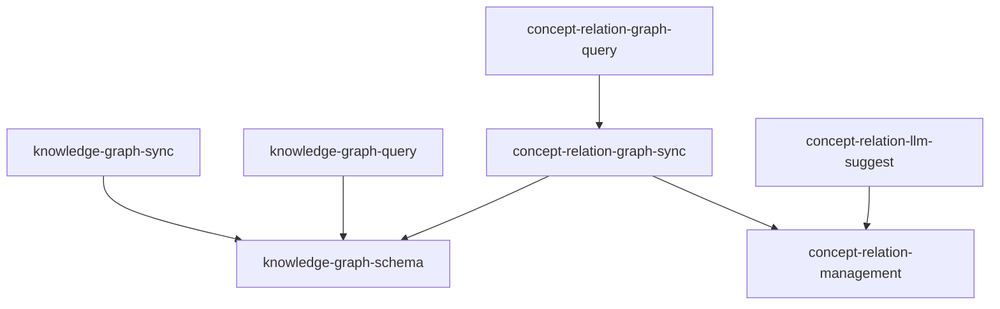

# Knowledge Center Module Specification

## Purpose

Knowledge Center 模块负责知识图谱的定义、同步、查询和概念关系管理。它提供股票知识图谱的 Schema 定义、从数据工程模块到 Neo4j 的数据同步、图谱查询能力，以及概念间关系的手动管理、LLM 推荐和产业链路径查询等功能。

**核心职责**：
- 定义知识图谱的节点和关系结构
- 提供从 PostgreSQL 到 Neo4j 的数据同步能力
- 支持股票同维度邻居查询和个股关系网络查询
- 提供概念关系的手动 CRUD 管理
- 支持基于 LLM 的概念关系自动推荐
- 提供概念关系网络的查询和产业链路径遍历

## Capabilities

| Capability | Description | Source |
|------------|-------------|--------|
| knowledge-graph-schema | 知识图谱 Schema 定义 | knowledge-center/knowledge-graph-schema |
| knowledge-graph-sync | 知识图谱数据同步 | knowledge-center/knowledge-graph-sync |
| knowledge-graph-query | 知识图谱查询 | knowledge-center/knowledge-graph-query |
| concept-relation-management | 概念关系手动管理 | knowledge-center/concept-relation-management |
| concept-relation-graph-sync | 概念关系图谱同步 | knowledge-center/concept-relation-graph-sync |
| concept-relation-graph-query | 概念关系图谱查询 | knowledge-center/concept-relation-graph-query |
| concept-relation-llm-suggest | 概念关系 LLM 推荐 | knowledge-center/concept-relation-llm-suggest |

## Capability Dependency Graph



## General Conventions

### Requirement Language
- **SHALL** / **MUST**：强制性要求
- **SHOULD**：推荐性要求
- **MAY**：可选要求

### Testing Convention
每个 `#### Scenario:` 在变更交付时须对应至少一个自动化测试用例（单元或集成）；实现顺序可先实现再补测，以完整测试通过为需求完成标准。

---

## capability: knowledge-graph-schema

> Source: knowledge-center/knowledge-graph-schema/spec.md (archived)

定义知识图谱的节点和关系结构，包括股票节点和各维度节点的关系模型。

---

## Requirements (knowledge-graph-schema)

### Requirement: Stock 节点定义

系统 SHALL 在 Neo4j 中维护 `Stock` 标签节点，每个节点代表一支股票。节点 MUST 以 `third_code` 作为唯一约束键。

节点属性 MUST 包含：
- `third_code`（String，唯一约束）
- `symbol`（String）
- `name`（String）
- `fullname`（String，可为 null）
- `list_date`（String，格式 YYYYMMDD）
- `list_status`（String，枚举：L / D / P）
- `curr_type`（String）

节点属性 MAY 包含以下财务快照字段（来自最新一期财务报表）：
- `roe`、`roa`、`gross_margin`、`debt_to_assets`（盈利与杠杆指标）
- `pe_ttm`、`pb`、`total_mv`（估值指标）

#### Scenario: 创建 Stock 节点

- **WHEN** 同步管道写入一条 `third_code = "000001.SZ"` 的股票数据
- **THEN** Neo4j 中 MUST 存在一个 `(:Stock {third_code: "000001.SZ"})` 节点，包含 `symbol`、`name`、`list_date` 等属性

#### Scenario: Stock 节点唯一约束

- **WHEN** 对同一 `third_code` 执行两次写入
- **THEN** Neo4j 中仅存在一个该 `third_code` 的 Stock 节点，属性为最新一次写入的值

### Requirement: Industry 维度节点定义

系统 SHALL 维护 `Industry` 标签节点，每个节点代表一个行业分类。节点 MUST 以 `name` 作为唯一约束键。

#### Scenario: 创建 Industry 节点

- **WHEN** 同步管道写入行业为"银行"的股票
- **THEN** Neo4j 中 MUST 存在 `(:Industry {name: "银行"})` 节点

#### Scenario: 同行业股票共享同一 Industry 节点

- **WHEN** 两支股票（"000001.SZ" 和 "601398.SH"）均属于"银行"行业
- **THEN** 两个 Stock 节点 MUST 通过关系连接到同一个 `(:Industry {name: "银行"})` 节点

### Requirement: Area 维度节点定义

系统 SHALL 维护 `Area` 标签节点，每个节点代表一个地域。节点 MUST 以 `name` 作为唯一约束键。

#### Scenario: 创建 Area 节点

- **WHEN** 同步管道写入地域为"深圳"的股票
- **THEN** Neo4j 中 MUST 存在 `(:Area {name: "深圳"})` 节点

### Requirement: Market 维度节点定义

系统 SHALL 维护 `Market` 标签节点，每个节点代表一个市场板块（主板、中小板、创业板、科创板等）。节点 MUST 以 `name` 作为唯一约束键。

#### Scenario: 创建 Market 节点

- **WHEN** 同步管道写入市场为"主板"的股票
- **THEN** Neo4j 中 MUST 存在 `(:Market {name: "主板"})` 节点

### Requirement: Exchange 维度节点定义

系统 SHALL 维护 `Exchange` 标签节点，每个节点代表一个交易所（SSE / SZSE 等）。节点 MUST 以 `name` 作为唯一约束键。

#### Scenario: 创建 Exchange 节点

- **WHEN** 同步管道写入交易所为"SSE"的股票
- **THEN** Neo4j 中 MUST 存在 `(:Exchange {name: "SSE"})` 节点

### Requirement: BELONGS_TO_INDUSTRY 关系定义

系统 SHALL 在 Stock 节点与 Industry 节点之间创建 `BELONGS_TO_INDUSTRY` 关系。方向为 `(Stock)-[:BELONGS_TO_INDUSTRY]->(Industry)`。

每个 Stock MUST 最多有一条 `BELONGS_TO_INDUSTRY` 关系。若股票无行业信息（`industry` 为 null 或空），则 MUST NOT 创建该关系。

#### Scenario: 建立行业关系

- **WHEN** 股票 "000001.SZ" 的 `industry` 字段为"银行"
- **THEN** MUST 存在 `(:Stock {third_code: "000001.SZ"})-[:BELONGS_TO_INDUSTRY]->(:Industry {name: "银行"})` 关系

#### Scenario: 行业为空时不建关系

- **WHEN** 某股票的 `industry` 字段为 null
- **THEN** 该 Stock 节点 MUST NOT 存在 `BELONGS_TO_INDUSTRY` 关系

### Requirement: LOCATED_IN 关系定义

系统 SHALL 在 Stock 节点与 Area 节点之间创建 `LOCATED_IN` 关系。方向为 `(Stock)-[:LOCATED_IN]->(Area)`。

每个 Stock MUST 最多有一条 `LOCATED_IN` 关系。

#### Scenario: 建立地域关系

- **WHEN** 股票 "000001.SZ" 的 `area` 字段为"深圳"
- **THEN** MUST 存在 `(:Stock {third_code: "000001.SZ"})-[:LOCATED_IN]->(:Area {name: "深圳"})` 关系

### Requirement: TRADES_ON 关系定义

系统 SHALL 在 Stock 节点与 Market 节点之间创建 `TRADES_ON` 关系。方向为 `(Stock)-[:TRADES_ON]->(Market)`。

#### Scenario: 建立市场关系

- **WHEN** 股票 "000001.SZ" 的 `market` 字段为"主板"
- **THEN** MUST 存在 `(:Stock {third_code: "000001.SZ"})-[:TRADES_ON]->(:Market {name: "主板"})` 关系

### Requirement: LISTED_ON 关系定义

系统 SHALL 在 Stock 节点与 Exchange 节点之间创建 `LISTED_ON` 关系。方向为 `(Stock)-[:LISTED_ON]->(Exchange)`。

#### Scenario: 建立交易所关系

- **WHEN** 股票 "000001.SZ" 的 `exchange` 字段为"SZSE"
- **THEN** MUST 存在 `(:Stock {third_code: "000001.SZ"})-[:LISTED_ON]->(:Exchange {name: "SZSE"})` 关系

### Requirement: Concept 节点定义

系统 SHALL 在 Neo4j 中维护 `Concept` 标签节点，每个节点代表一个概念题材板块（如"低空经济"、"人形机器人"）。节点 MUST 以 `code` 作为唯一约束键。

节点属性 MUST 包含：

- `code`（String，唯一约束）：概念板块代码（如 `BK0493`）
- `name`（String）：概念板块名称（如 "低空经济"）

#### Scenario: 创建 Concept 节点

- **WHEN** 同步管道写入概念板块 `code = "BK0493"`、`name = "低空经济"`
- **THEN** Neo4j 中 MUST 存在 `(:Concept {code: "BK0493", name: "低空经济"})` 节点

#### Scenario: Concept 节点唯一约束

- **WHEN** 对同一 `code` 执行两次写入（第二次 `name` 有变化）
- **THEN** Neo4j 中仅存在一个该 `code` 的 Concept 节点，`name` 属性为最新一次写入的值

### Requirement: BELONGS_TO_CONCEPT 关系定义

系统 SHALL 在 Stock 节点与 Concept 节点之间创建 `BELONGS_TO_CONCEPT` 关系。方向为 `(Stock)-[:BELONGS_TO_CONCEPT]->(Concept)`。

与 `BELONGS_TO_INDUSTRY` 不同，一个 Stock 节点 MAY 拥有**多条** `BELONGS_TO_CONCEPT` 关系（多对多关系：一股多概念，一概念多股）。

#### Scenario: 建立概念关系

- **WHEN** 股票 `000001.SZ` 属于概念 `BK0493`（低空经济）
- **THEN** MUST 存在 `(:Stock {third_code: "000001.SZ"})-[:BELONGS_TO_CONCEPT]->(:Concept {code: "BK0493"})` 关系

#### Scenario: 一股多概念

- **WHEN** 股票 `000001.SZ` 同时属于 `BK0493`（低空经济）和 `BK0612`（人形机器人）
- **THEN** 该 Stock 节点 MUST 有两条 `BELONGS_TO_CONCEPT` 关系，分别指向两个不同的 Concept 节点

#### Scenario: 概念成份股不存在于图谱时不建关系

- **WHEN** 概念成份股列表中的某个 `third_code` 在 Neo4j 中不存在对应的 Stock 节点
- **THEN** MUST NOT 为该股票创建 `BELONGS_TO_CONCEPT` 关系
- **THEN** 该情况 MUST 被记录到日志（WARNING 级别），包含股票代码和概念名称

### Requirement: 图谱约束初始化

系统 SHALL 在首次连接 Neo4j 或同步前自动创建所有唯一约束：
- `Stock.third_code` UNIQUE
- `Industry.name` UNIQUE
- `Area.name` UNIQUE
- `Market.name` UNIQUE
- `Exchange.name` UNIQUE
- `Concept.code` UNIQUE

#### Scenario: 约束自动创建

- **WHEN** 应用启动并首次连接 Neo4j
- **THEN** 上述 6 个唯一约束 MUST 存在于 Neo4j Schema 中

#### Scenario: Concept 约束自动创建

- **WHEN** 应用启动并执行约束初始化
- **THEN** `Concept.code` 唯一约束 MUST 存在于 Neo4j Schema 中

#### Scenario: 约束已存在时幂等

- **WHEN** 约束初始化逻辑重复执行
- **THEN** 不产生错误，约束保持不变

---

## capability: knowledge-graph-sync

> Source: knowledge-center/knowledge-graph-sync/spec.md (archived)

提供从数据工程模块到知识图谱的数据同步能力，支持全量和增量同步策略。

---

## Requirements (knowledge-graph-sync)

### Requirement: 全量同步命令

系统 SHALL 提供全量同步命令（`SyncGraphCommand`，mode=full），从 `data_engineering` 模块读取所有 StockInfo 数据并写入 Neo4j 图谱。

全量同步 MUST 包含以下步骤：
1. 通过 `data_engineering` 的 Port 查询所有股票基本信息。
2. 通过 Adapter 将跨模块 DTO 转换为本模块 `GraphSyncDTO`。
3. 调用 `GraphRepository` 批量写入 Stock 节点、维度节点及关系。
4. 可选同步最新财务快照（通过 `FinancialRepo` Port）。

#### Scenario: 首次全量同步

- **WHEN** 用户触发全量同步命令且 Neo4j 图谱为空
- **THEN** 系统从 PostgreSQL 读取所有 StockInfo 记录，在 Neo4j 中为每条记录创建 Stock 节点及对应维度节点和关系
- **THEN** 同步完成后 Neo4j 中 Stock 节点总数 MUST 等于 PostgreSQL `stock_info` 表中的记录数

#### Scenario: 重复全量同步幂等

- **WHEN** 对已存在数据的图谱执行全量同步
- **THEN** 使用 Cypher MERGE 确保节点和关系不重复，属性更新为最新值
- **THEN** 同步前后 Stock 节点总数保持不变（除非源数据有增减）

### Requirement: 增量同步命令

系统 SHALL 提供增量同步命令（`SyncGraphCommand`，mode=incremental），仅同步指定范围的股票数据。

增量同步 MUST 支持以下过滤方式（至少一种）：
- 指定 `third_codes` 列表：仅同步指定股票。
- 指定时间窗口：同步在该时间窗口内有数据变更的股票。

#### Scenario: 按股票代码增量同步

- **WHEN** 用户触发增量同步，指定 `third_codes = ["000001.SZ", "601398.SH"]`
- **THEN** 系统仅查询并同步这两支股票的数据到 Neo4j
- **THEN** 其他股票的图谱数据保持不变

#### Scenario: 增量同步新增股票

- **WHEN** PostgreSQL 中新增了一支股票 "688001.SH"，触发增量同步包含该股票
- **THEN** Neo4j 中 MUST 新增该 Stock 节点及对应维度关系

### Requirement: 批量写入性能

同步管道 MUST 使用批量写入策略（Cypher UNWIND + MERGE），避免逐条事务提交。

每批提交的记录数 SHALL 可配置，默认值为 500。

#### Scenario: 批量写入执行

- **WHEN** 同步 5000 条股票数据，批量大小为 500
- **THEN** 系统 MUST 分 10 批提交，每批包含约 500 条 MERGE 操作
- **THEN** 不 SHALL 出现单条逐一提交的情况

### Requirement: 财务快照同步

同步管道 SHALL 支持将最新一期财务报表数据同步为 Stock 节点的属性。

同步的财务字段 MUST 包含：`roe`、`roa`、`gross_margin`、`debt_to_assets`、`pe_ttm`、`pb`、`total_mv`。

#### Scenario: 同步财务快照

- **WHEN** 全量同步包含财务数据
- **THEN** Stock 节点的财务属性 MUST 反映该股票最新一期（`end_date` 最大）的财务数据

#### Scenario: 无财务数据时属性为 null

- **WHEN** 某股票在 PostgreSQL 中无财务报表记录
- **THEN** 该 Stock 节点的财务属性 MUST 为 null（不设默认值）

### Requirement: 跨模块数据读取通过 Adapter

同步管道从 `data_engineering` 读取数据 MUST 通过 `knowledge_center/infrastructure/adapters/data_engineering_adapter.py` 完成。

Adapter MUST 将 `data_engineering` 的 DTO 转换为本模块 `domain/dtos/graph_sync_dtos.py` 中定义的 DTO。Domain 层 MUST NOT import `data_engineering` 的任何类型。

#### Scenario: Adapter 数据转换

- **WHEN** Adapter 从 `data_engineering` 获取 StockInfo 数据
- **THEN** 返回的 DTO 类型 MUST 属于 `knowledge_center.domain.dtos` 包
- **THEN** 不包含对 `data_engineering` 模块类型的直接引用

### Requirement: 同步错误处理

同步管道 MUST 对单条记录的写入失败进行容错处理，不 SHALL 因个别记录失败而中断整个同步流程。

失败记录 MUST 被记录到日志中（包含 `third_code` 和错误信息），日志级别为 ERROR。

#### Scenario: 单条记录失败不中断同步

- **WHEN** 同步过程中某一条股票数据因属性格式异常导致写入 Neo4j 失败
- **THEN** 该记录的错误信息 MUST 被记录到日志
- **THEN** 其余记录的同步 MUST 正常继续

#### Scenario: 同步完成后报告结果

- **WHEN** 同步命令执行完毕
- **THEN** MUST 返回同步结果摘要，包含：成功数量、失败数量、总耗时

### Requirement: 概念数据全量同步命令

系统 SHALL 提供概念图谱全量同步命令（`SyncConceptGraphCmd`），从 `data_engineering` 的 PostgreSQL（通过适配器）读取概念板块数据并写入 Neo4j 图谱。

前置条件：概念数据已通过 DE 模块的 `SyncConceptDataCmd` 同步到 PostgreSQL。

同步 MUST 包含以下步骤：

1. 通过 KC 适配器调用 DE 的 `IConceptRepository.get_all_concepts_with_stocks()` 获取所有概念及成份股
2. 删除 Neo4j 中所有现有的 `BELONGS_TO_CONCEPT` 关系（先清策略）
3. 批量 MERGE Concept 节点（by code）
4. 批量创建 `(Stock)-[:BELONGS_TO_CONCEPT]->(Concept)` 关系（仅当 Stock 节点已存在时）

#### Scenario: 首次概念图谱同步

- **WHEN** 用户触发概念图谱同步且 Neo4j 中无 Concept 节点
- **THEN** 系统从 DE 的 PostgreSQL 读取所有概念板块及成份股
- **THEN** Neo4j 中 MUST 创建对应的 Concept 节点和 BELONGS_TO_CONCEPT 关系

#### Scenario: 重复概念同步保持一致

- **WHEN** 对已存在概念数据的图谱再次执行全量同步
- **THEN** 旧的 BELONGS_TO_CONCEPT 关系 MUST 先被全部删除
- **THEN** 基于 PostgreSQL 中的最新数据重建所有 Concept 节点（MERGE）和关系
- **THEN** 若某股票已从某概念中移除，新图谱中 MUST NOT 存在该陈旧关系

#### Scenario: PostgreSQL 无概念数据时

- **WHEN** 触发概念图谱同步但 DE 的 PostgreSQL 中无概念数据
- **THEN** 同步命令 MUST 记录 WARNING 日志并返回空结果（概念总数 = 0），不抛出异常

#### Scenario: 同步完成后报告结果

- **WHEN** 概念同步命令执行完毕
- **THEN** MUST 返回同步结果摘要，包含：概念总数、Concept 节点数、创建的关系总数、总耗时

### Requirement: 概念同步的批量写入

概念同步管道 MUST 使用批量写入策略，避免逐条事务提交。

- Concept 节点 MUST 使用 Cypher `UNWIND + MERGE` 批量写入
- BELONGS_TO_CONCEPT 关系 MUST 使用 Cypher `UNWIND + MATCH + MERGE` 批量写入（MATCH Stock 节点，仅当存在时创建关系）

#### Scenario: 批量写入概念节点

- **WHEN** 同步 300 个概念板块
- **THEN** 系统 MUST 使用批量操作写入，不 SHALL 逐条提交

#### Scenario: 批量写入概念关系

- **WHEN** 某概念有 50 个成份股
- **THEN** 系统 MUST 通过 UNWIND 一次性写入该概念的所有 Stock-Concept 关系

### Requirement: 跨模块概念数据读取通过 Adapter

`knowledge_center` 从 `data_engineering` 获取概念数据 MUST 通过 `knowledge_center/infrastructure/adapters/` 下的适配器完成。

适配器 MUST 注入 DE 的 `IConceptRepository`（或 DE 暴露的应用服务），调用 `get_all_concepts_with_stocks()` 查询 PostgreSQL 中的概念数据。

适配器 MUST 将 `data_engineering` 的 DTO（`ConceptWithStocksDTO`）转换为 `knowledge_center` 的 `domain/dtos/` 中定义的同步 DTO（`ConceptGraphSyncDTO`）。`knowledge_center` 的 Domain 层 MUST NOT import `data_engineering` 的任何类型。

#### Scenario: Adapter 从 PostgreSQL 读取数据

- **WHEN** Adapter 被调用获取概念数据
- **THEN** 实际数据来源 MUST 为 DE 模块的 PostgreSQL（`concept` + `concept_stock` 表）
- **THEN** 返回的 DTO 类型 MUST 属于 `knowledge_center.domain.dtos` 包

#### Scenario: Domain 层无跨模块依赖

- **WHEN** 检查 `knowledge_center` 的 Domain 层代码
- **THEN** MUST NOT 存在对 `data_engineering` 模块类型的 import

### Requirement: IGraphRepository 扩展概念同步方法

`IGraphRepository` 接口 MUST 新增以下方法：

- `merge_concepts(concepts: list[ConceptGraphSyncDTO]) -> SyncResult`：批量写入/更新 Concept 节点及其与 Stock 的关系
- `delete_all_concept_relationships() -> int`：删除所有 BELONGS_TO_CONCEPT 关系，返回删除数量

#### Scenario: merge_concepts 写入概念数据

- **WHEN** 调用 `merge_concepts()` 传入概念数据列表
- **THEN** Neo4j 中 MUST 存在对应的 Concept 节点和 BELONGS_TO_CONCEPT 关系

#### Scenario: delete_all_concept_relationships 清理关系

- **WHEN** 调用 `delete_all_concept_relationships()`
- **THEN** Neo4j 中所有 `BELONGS_TO_CONCEPT` 关系 MUST 被删除
- **THEN** Concept 节点本身 MUST 保留（仅删关系）
- **THEN** 返回值为被删除的关系数量

### Requirement: 同步通过 REST API 触发

系统 SHALL 提供 REST 端点触发图谱同步：

```
POST /api/v1/knowledge-graph/sync
Body: { "mode": "full" | "incremental", "third_codes": ["..."], "target": "stock" | "concept" | "all" }
```

`third_codes` 仅在 `mode = "incremental"` 且 `target = "stock"` 时有效，为空时根据时间窗口自动确定范围。

`target` 为可选参数，默认值为 `"stock"`：

- `"stock"`：执行现有的股票元数据同步（行为不变）
- `"concept"`：执行概念数据全量同步（忽略 `mode` 和 `third_codes`，概念同步仅支持全量模式）
- `"all"`：依次执行股票同步和概念同步

#### Scenario: 通过 API 触发全量同步（默认行为不变）

- **WHEN** 发送 `POST /api/v1/knowledge-graph/sync` 且 body 为 `{"mode": "full"}`
- **THEN** 系统执行全量股票元数据同步并返回 200 及同步结果摘要（行为与变更前一致）

#### Scenario: 通过 API 触发概念同步

- **WHEN** 发送 `POST /api/v1/knowledge-graph/sync` 且 body 为 `{"mode": "full", "target": "concept"}`
- **THEN** 系统执行概念全量同步并返回 200 及概念同步结果摘要

#### Scenario: 通过 API 触发增量同步

- **WHEN** 发送 `POST /api/v1/knowledge-graph/sync` 且 body 为 `{"mode": "incremental", "third_codes": ["000001.SZ"]}`
- **THEN** 系统仅同步指定股票并返回 200 及同步结果摘要

#### Scenario: 通过 API 触发全部同步

- **WHEN** 发送 `POST /api/v1/knowledge-graph/sync` 且 body 为 `{"mode": "full", "target": "all"}`
- **THEN** 系统依次执行股票全量同步和概念全量同步，返回 200 及合并的同步结果摘要

---

## capability: knowledge-graph-query

> Source: knowledge-center/knowledge-graph-query/spec.md (archived)

提供知识图谱查询能力，支持股票同维度邻居查询和个股关系网络查询。

---

## Requirements (knowledge-graph-query)

### Requirement: 查询同维度股票（Neighbors）

系统 SHALL 通过 `GraphService` 提供查询与指定股票共享同一维度节点的其他股票的能力。

支持的维度 MUST 包含：`industry`、`area`、`market`、`exchange`、`concept`。

查询结果 MUST 返回邻居股票列表，每条记录至少包含：`third_code`、`name`、`industry`（若查询维度为 industry 则为该行业名）。

当 `dimension = "concept"` 时，查询 MUST 额外要求 `dimension_name` 参数指定概念名称（因为一只股票可属于多个概念，需明确查询哪个概念的同概念股），返回该概念下的其他成份股。

结果 MUST 支持 `limit` 参数限制返回数量，默认值为 20。

#### Scenario: 查询同行业股票

- **WHEN** 查询 `third_code = "000001.SZ"`、`dimension = "industry"` 的邻居
- **THEN** 返回与 "000001.SZ" 属于同一行业的其他 Stock 列表
- **THEN** 结果 MUST NOT 包含查询股票自身（"000001.SZ"）

#### Scenario: 查询同地区股票

- **WHEN** 查询 `third_code = "000001.SZ"`、`dimension = "area"` 的邻居
- **THEN** 返回与 "000001.SZ" 位于同一地域的其他 Stock 列表

#### Scenario: 查询同概念股票

- **WHEN** 查询 `third_code = "000001.SZ"`、`dimension = "concept"`、`dimension_name = "低空经济"` 的邻居
- **THEN** 返回与 "000001.SZ" 同属于"低空经济"概念的其他 Stock 列表
- **THEN** 结果 MUST NOT 包含查询股票自身

#### Scenario: 概念维度缺少 dimension_name

- **WHEN** 查询 `dimension = "concept"` 但未提供 `dimension_name`
- **THEN** MUST 返回参数校验错误（HTTP 422 或领域异常）

#### Scenario: 股票不存在时返回空

- **WHEN** 查询一个不存在的 `third_code = "999999.XX"` 的邻居
- **THEN** 返回空列表，不抛出异常

#### Scenario: limit 参数生效

- **WHEN** 某行业有 50 支股票，查询时 `limit = 10`
- **THEN** 返回结果最多 10 条

### Requirement: 查询个股关系网络（Graph）

系统 SHALL 提供查询指定股票的完整关系网络能力，返回该股票及其所有直接关联的维度节点和关系。

查询 MUST 支持 `depth` 参数（默认值 1），表示关系遍历深度。MVP 阶段仅需支持 `depth = 1`。

返回结果 MUST 包含：
- 中心 Stock 节点及其属性
- 所有关联的维度节点（Industry / Area / Market / Exchange / **Concept**）
- 连接它们的关系类型

#### Scenario: 查询深度为 1 的关系网络

- **WHEN** 查询 `third_code = "000001.SZ"`、`depth = 1`
- **THEN** 返回结果包含 "000001.SZ" Stock 节点及其关联的 Industry、Area、Market、Exchange、Concept 节点和关系

#### Scenario: 股票属于多个概念

- **WHEN** 股票 "000001.SZ" 属于 3 个概念
- **THEN** 关系网络中 MUST 包含 3 个 Concept 节点及对应的 BELONGS_TO_CONCEPT 关系

#### Scenario: 股票无某维度关系

- **WHEN** 某股票的 `industry` 为 null（无 BELONGS_TO_INDUSTRY 关系）
- **THEN** 返回结果中不包含 Industry 节点，但其他维度关系正常返回

#### Scenario: 股票不存在时返回 null

- **WHEN** 查询一个不存在的 `third_code = "999999.XX"` 的关系网络
- **THEN** 返回 null 或空结果，不抛出异常

### Requirement: GraphRepository Port 定义

系统 MUST 在 `knowledge_center/domain/ports/graph_repository.py` 中定义 `GraphRepository` ABC 接口。

该接口 MUST 至少包含以下方法：
- `merge_stocks(stocks: list[StockGraphDTO]) -> SyncResult`：批量写入/更新 Stock 节点及维度关系
- `merge_dimensions(dimensions: list[DimensionDTO]) -> None`：批量写入/更新维度节点
- `merge_concepts(concepts: list[ConceptGraphSyncDTO]) -> SyncResult`：批量写入/更新 Concept 节点及其与 Stock 的关系
- `delete_all_concept_relationships() -> int`：删除所有 BELONGS_TO_CONCEPT 关系
- `find_neighbors(third_code: str, dimension: str, limit: int, dimension_name: str | None = None) -> list[StockNeighborDTO]`：查询同维度股票，`dimension_name` 在 `dimension="concept"` 时必填
- `find_stock_graph(third_code: str, depth: int) -> StockGraphDTO | None`：查询个股关系网络（包含 Concept 节点）
- `ensure_constraints() -> None`：确保图谱唯一约束存在（包含 Concept.code）

#### Scenario: Port 在 Domain 层定义

- **WHEN** 检查 `GraphRepository` 的定义位置
- **THEN** 该 ABC 接口 MUST 位于 `src/modules/knowledge_center/domain/ports/graph_repository.py`
- **THEN** 接口方法的入参和出参 MUST 使用 `domain/dtos/` 中定义的 DTO 类型

### Requirement: GraphService 应用服务

系统 MUST 在 `knowledge_center/application/services/graph_service.py` 中定义 `GraphService`，作为 `knowledge_center` 模块对外暴露的核心应用服务。

`GraphService` MUST 通过依赖注入接收 `GraphRepository` 接口（而非具体实现）。

#### Scenario: GraphService 依赖注入

- **WHEN** 创建 `GraphService` 实例
- **THEN** MUST 通过构造函数注入 `GraphRepository`
- **THEN** 不 MUST 直接依赖 Neo4j 驱动或任何基础设施类

### Requirement: REST API — 查询同维度股票

系统 SHALL 提供 REST 端点：

```
GET /api/v1/knowledge-graph/stocks/{third_code}/neighbors?dimension={dimension}&limit={limit}&dimension_name={dimension_name}
```

参数说明：
- `third_code`（路径参数，必填）：股票代码
- `dimension`（查询参数，必填）：维度类型，枚举值 `industry | area | market | exchange | concept`
- `limit`（查询参数，可选）：返回数量上限，默认 20
- `dimension_name`（查询参数，条件必填）：当 `dimension = "concept"` 时 MUST 提供，指定概念名称

#### Scenario: 正常查询返回 200

- **WHEN** 发送 `GET /api/v1/knowledge-graph/stocks/000001.SZ/neighbors?dimension=industry`
- **THEN** 返回 HTTP 200 及 JSON 格式的股票列表

#### Scenario: 查询概念维度返回 200

- **WHEN** 发送 `GET /api/v1/knowledge-graph/stocks/000001.SZ/neighbors?dimension=concept&dimension_name=低空经济`
- **THEN** 返回 HTTP 200 及同属"低空经济"概念的其他股票列表

#### Scenario: 概念维度缺少 dimension_name 返回 422

- **WHEN** 发送 `GET /api/v1/knowledge-graph/stocks/000001.SZ/neighbors?dimension=concept`（无 dimension_name）
- **THEN** 返回 HTTP 422 及错误信息

#### Scenario: 无效维度返回 422

- **WHEN** 发送 `GET /api/v1/knowledge-graph/stocks/000001.SZ/neighbors?dimension=invalid`
- **THEN** 返回 HTTP 422 及错误信息

#### Scenario: 缺少 dimension 参数返回 422

- **WHEN** 发送 `GET /api/v1/knowledge-graph/stocks/000001.SZ/neighbors`（无 dimension）
- **THEN** 返回 HTTP 422

### Requirement: REST API — 查询个股关系网络

系统 SHALL 提供 REST 端点：

```
GET /api/v1/knowledge-graph/stocks/{third_code}/graph?depth={depth}
```

参数说明：
- `third_code`（路径参数，必填）：股票代码
- `depth`（查询参数，可选）：遍历深度，默认 1

#### Scenario: 正常查询返回 200

- **WHEN** 发送 `GET /api/v1/knowledge-graph/stocks/000001.SZ/graph`
- **THEN** 返回 HTTP 200 及 JSON 格式的关系网络数据，包含节点和关系信息

#### Scenario: 股票不存在返回 200 空结果

- **WHEN** 发送 `GET /api/v1/knowledge-graph/stocks/999999.XX/graph`
- **THEN** 返回 HTTP 200 及 null 或空对象（不返回 404，因为这不是资源不存在，而是图谱中无对应数据）

---

## capability: concept-relation-management

> Source: knowledge-center/concept-relation-management/spec.md (archived)

概念间关系的手动 CRUD 管理能力。PostgreSQL 为 Single Source of Truth，支持创建、查询、更新、删除概念关系，并通过 `ext_info`（JSONB）字段存储完整追溯上下文。

---

## Requirements (concept-relation-management)

### Requirement: ConceptRelation 领域实体定义

系统 MUST 在 `knowledge_center/domain/model/concept_relation.py` 中定义 `ConceptRelation` 领域实体（Pydantic BaseModel）。

实体字段 MUST 包含：

- `id`（int | None）：主键，创建时为 None
- `source_concept_code`（str）：源概念板块代码
- `target_concept_code`（str）：目标概念板块代码
- `relation_type`（ConceptRelationType）：关系类型枚举
- `source_type`（RelationSourceType）：来源类型枚举（MANUAL / LLM）
- `status`（RelationStatus）：状态枚举（PENDING / CONFIRMED / REJECTED）
- `confidence`（float）：置信度，0.0~1.0
- `ext_info`（dict）：追溯上下文（JSONB 映射）
- `created_by`（str）：操作人标识
- `created_at`（datetime | None）
- `updated_at`（datetime | None）

#### Scenario: 实体定义在 Domain 层

- **WHEN** 检查 `ConceptRelation` 的定义位置
- **THEN** MUST 位于 `src/modules/knowledge_center/domain/model/concept_relation.py`
- **THEN** 实体 MUST 继承 Pydantic `BaseModel`

#### Scenario: 手动创建时置信度默认 1.0

- **WHEN** 创建一条 `source_type = MANUAL` 的关系且未指定 `confidence`
- **THEN** `confidence` MUST 默认为 1.0

### Requirement: ConceptRelationType 枚举定义

系统 MUST 在 `knowledge_center/domain/model/enums.py` 中新增 `ConceptRelationType` 枚举。

枚举值 MUST 包含：

- `IS_UPSTREAM_OF`：上游关系
- `IS_DOWNSTREAM_OF`：下游关系
- `COMPETES_WITH`：竞争关系
- `IS_PART_OF`：组成部分
- `ENABLER_FOR`：技术驱动

#### Scenario: 枚举值完整

- **WHEN** 检查 `ConceptRelationType` 枚举
- **THEN** MUST 包含上述 5 种关系类型

### Requirement: RelationSourceType 枚举定义

系统 MUST 在 `knowledge_center/domain/model/enums.py` 中新增 `RelationSourceType` 枚举。

枚举值 MUST 包含：

- `MANUAL`：手动创建
- `LLM`：LLM 推荐

#### Scenario: 枚举值完整

- **WHEN** 检查 `RelationSourceType` 枚举
- **THEN** MUST 包含 `MANUAL` 和 `LLM` 两种来源类型

### Requirement: RelationStatus 枚举定义

系统 MUST 在 `knowledge_center/domain/model/enums.py` 中新增 `RelationStatus` 枚举。

枚举值 MUST 包含：

- `PENDING`：待确认（LLM 推荐的默认状态）
- `CONFIRMED`：已确认
- `REJECTED`：已拒绝

#### Scenario: 枚举值完整

- **WHEN** 检查 `RelationStatus` 枚举
- **THEN** MUST 包含 `PENDING`、`CONFIRMED`、`REJECTED` 三种状态

### Requirement: IConceptRelationRepository Port 定义

系统 MUST 在 `knowledge_center/domain/ports/concept_relation_repository.py` 中定义 `IConceptRelationRepository` ABC 接口。

该接口 MUST 包含以下方法：

- `create(relation: ConceptRelation) -> ConceptRelation`：创建关系记录，返回含 id 的实体
- `get_by_id(relation_id: int) -> ConceptRelation | None`：按 ID 查询
- `list_relations(source_code: str | None, target_code: str | None, relation_type: ConceptRelationType | None, status: RelationStatus | None, source_type: RelationSourceType | None, limit: int, offset: int) -> list[ConceptRelation]`：列表查询，支持多维筛选
- `update(relation: ConceptRelation) -> ConceptRelation`：更新关系记录
- `delete(relation_id: int) -> bool`：删除关系记录，返回是否成功
- `batch_create(relations: list[ConceptRelation]) -> list[ConceptRelation]`：批量创建（供 LLM 推荐使用）
- `get_all_confirmed() -> list[ConceptRelation]`：查询所有已确认关系（供同步使用）
- `count(source_code: str | None, target_code: str | None, relation_type: ConceptRelationType | None, status: RelationStatus | None) -> int`：条件计数

方法 MUST 为异步方法（async）。

#### Scenario: Port 在 Domain 层定义

- **WHEN** 检查 `IConceptRelationRepository` 的定义位置
- **THEN** 该 ABC 接口 MUST 位于 `src/modules/knowledge_center/domain/ports/concept_relation_repository.py`
- **THEN** 接口方法的入参和出参 MUST 使用 Domain 层定义的类型

#### Scenario: create 返回含 ID 的实体

- **WHEN** 调用 `create()` 传入一条 `id = None` 的关系
- **THEN** 返回的 `ConceptRelation` MUST 包含数据库生成的 `id`

### Requirement: PostgreSQL 持久化实现

系统 MUST 在 `knowledge_center/infrastructure/persistence/` 下实现概念关系的 PostgreSQL 持久化。

包含：

- **ORM Model**：`ConceptRelationModel`（映射 `concept_relation` 表）
- **Repository 实现**：`PgConceptRelationRepository`，实现 `IConceptRelationRepository` 接口
- **Alembic Migration**：创建 `concept_relation` 表

`concept_relation` 表 MUST 包含：

- `id`（BIGINT PK, auto-increment）
- `source_concept_code`（VARCHAR, NOT NULL）
- `target_concept_code`（VARCHAR, NOT NULL）
- `relation_type`（VARCHAR, NOT NULL）
- `source_type`（VARCHAR, NOT NULL）
- `status`（VARCHAR, NOT NULL, DEFAULT 'PENDING'）
- `confidence`（FLOAT, NOT NULL, DEFAULT 1.0）
- `ext_info`（JSONB, NOT NULL, DEFAULT '{}'）
- `created_by`（VARCHAR, NOT NULL）
- `created_at`（TIMESTAMP WITH TZ, NOT NULL, DEFAULT NOW()）
- `updated_at`（TIMESTAMP WITH TZ, NOT NULL, DEFAULT NOW()）

约束：

- `UNIQUE (source_concept_code, target_concept_code, relation_type)`：同一对概念的同类型关系唯一
- `CHECK (confidence >= 0.0 AND confidence <= 1.0)`

#### Scenario: 数据库表创建

- **WHEN** 运行 Alembic migration
- **THEN** PostgreSQL 中 MUST 存在 `concept_relation` 表，包含上述所有字段和约束

#### Scenario: 唯一约束生效

- **WHEN** 尝试插入两条 `(source_concept_code='BK0001', target_concept_code='BK0002', relation_type='IS_UPSTREAM_OF')` 相同的记录
- **THEN** 第二次插入 MUST 触发唯一约束冲突

#### Scenario: ext_info 存储 JSONB 数据

- **WHEN** 创建关系时 `ext_info = {"note": "手动添加", "reason": "锂电池是新能源车的上游"}`
- **THEN** 数据库中 `ext_info` 字段 MUST 以 JSONB 格式存储该内容
- **THEN** 查询时 MUST 能还原为 Python dict

### Requirement: ext_info 内容校验

系统 MUST 在 Application 层对 `ext_info` 内容进行 Pydantic 校验，确保不同来源的追溯信息符合约定结构。

手动来源（`source_type = MANUAL`）的 `ext_info` MUST 符合 `ManualExtInfo` 结构：

- `note`（str, 可选）：操作备注
- `reason`（str, 可选）：建立关系的理由

LLM 来源（`source_type = LLM`）的 `ext_info` MUST 符合 `LLMExtInfo` 结构：

- `model`（str）：模型名称
- `model_version`（str, 可选）：模型版本
- `prompt`（str）：完整输入 prompt
- `raw_output`（str）：LLM 原始输出
- `parsed_result`（dict）：解析后的结构化结果
- `reasoning`（str）：推理依据
- `batch_id`（str, 可选）：批次 ID
- `analyzed_at`（str）：分析时间（ISO 格式）

#### Scenario: 手动来源 ext_info 校验通过

- **WHEN** 创建 `source_type = MANUAL` 的关系，`ext_info = {"note": "手动添加"}`
- **THEN** 校验 MUST 通过

#### Scenario: LLM 来源 ext_info 缺少必填字段

- **WHEN** 创建 `source_type = LLM` 的关系，`ext_info` 中缺少 `prompt` 字段
- **THEN** MUST 返回校验错误

### Requirement: REST API — 创建概念关系

系统 SHALL 提供 REST 端点：

```
POST /api/v1/knowledge-graph/concept-relations
```

请求体 MUST 包含：

- `source_concept_code`（str, 必填）
- `target_concept_code`（str, 必填）
- `relation_type`（str, 必填，枚举值）
- `confidence`（float, 可选，默认 1.0）
- `ext_info`（dict, 可选，默认 {}）
- `created_by`（str, 必填）

创建时 `source_type` MUST 自动设为 `MANUAL`，`status` MUST 自动设为 `CONFIRMED`。

#### Scenario: 成功创建返回 201

- **WHEN** 发送有效的创建请求
- **THEN** 返回 HTTP 201 及创建的关系记录（含 id）

#### Scenario: 源概念和目标概念相同返回 422

- **WHEN** `source_concept_code` 与 `target_concept_code` 相同
- **THEN** 返回 HTTP 422 及错误信息

#### Scenario: 无效关系类型返回 422

- **WHEN** `relation_type` 不在枚举范围内
- **THEN** 返回 HTTP 422 及错误信息

#### Scenario: 重复关系返回 409

- **WHEN** 创建的关系与已有记录的 (source, target, type) 重复
- **THEN** 返回 HTTP 409 及冲突信息

### Requirement: REST API — 查询概念关系列表

系统 SHALL 提供 REST 端点：

```
GET /api/v1/knowledge-graph/concept-relations
```

查询参数：

- `source_concept_code`（可选）：按源概念筛选
- `target_concept_code`（可选）：按目标概念筛选
- `relation_type`（可选）：按关系类型筛选
- `status`（可选）：按状态筛选
- `source_type`（可选）：按来源类型筛选
- `limit`（可选，默认 50）
- `offset`（可选，默认 0）

#### Scenario: 无筛选条件返回所有关系

- **WHEN** 发送 `GET /api/v1/knowledge-graph/concept-relations`（无查询参数）
- **THEN** 返回 HTTP 200 及关系列表（受 limit 限制）

#### Scenario: 按状态筛选

- **WHEN** 发送 `GET /api/v1/knowledge-graph/concept-relations?status=CONFIRMED`
- **THEN** 返回所有 `status = CONFIRMED` 的关系记录

#### Scenario: 按源概念筛选

- **WHEN** 发送 `GET /api/v1/knowledge-graph/concept-relations?source_concept_code=BK0493`
- **THEN** 返回所有 `source_concept_code = BK0493` 的关系记录

### Requirement: REST API — 查询单条概念关系

系统 SHALL 提供 REST 端点：

```
GET /api/v1/knowledge-graph/concept-relations/{id}
```

#### Scenario: 存在的关系返回 200

- **WHEN** 发送 `GET /api/v1/knowledge-graph/concept-relations/1` 且 id=1 的记录存在
- **THEN** 返回 HTTP 200 及关系详情（含完整 ext_info）

#### Scenario: 不存在的关系返回 404

- **WHEN** 发送 `GET /api/v1/knowledge-graph/concept-relations/99999` 且该 id 不存在
- **THEN** 返回 HTTP 404

### Requirement: REST API — 更新概念关系

系统 SHALL 提供 REST 端点：

```
PUT /api/v1/knowledge-graph/concept-relations/{id}
```

可更新字段：`relation_type`、`status`、`confidence`、`ext_info`。

`source_concept_code`、`target_concept_code`、`source_type` MUST NOT 可更新（需删除重建）。

#### Scenario: 确认 LLM 推荐的关系

- **WHEN** 发送 `PUT /api/v1/knowledge-graph/concept-relations/1` 且 body 为 `{"status": "CONFIRMED"}`
- **THEN** 返回 HTTP 200，该关系的 `status` MUST 更新为 `CONFIRMED`，`updated_at` MUST 更新

#### Scenario: 拒绝 LLM 推荐的关系

- **WHEN** 发送 `PUT /api/v1/knowledge-graph/concept-relations/1` 且 body 为 `{"status": "REJECTED"}`
- **THEN** 返回 HTTP 200，该关系的 `status` MUST 更新为 `REJECTED`

#### Scenario: 更新不存在的关系返回 404

- **WHEN** 发送 `PUT /api/v1/knowledge-graph/concept-relations/99999`
- **THEN** 返回 HTTP 404

### Requirement: REST API — 删除概念关系

系统 SHALL 提供 REST 端点：

```
DELETE /api/v1/knowledge-graph/concept-relations/{id}
```

#### Scenario: 成功删除返回 204

- **WHEN** 发送 `DELETE /api/v1/knowledge-graph/concept-relations/1` 且该记录存在
- **THEN** 返回 HTTP 204
- **THEN** 该记录 MUST 从 PostgreSQL 中删除

#### Scenario: 删除不存在的记录返回 404

- **WHEN** 发送 `DELETE /api/v1/knowledge-graph/concept-relations/99999`
- **THEN** 返回 HTTP 404

### Requirement: DI Container 注册

`KnowledgeCenterContainer` MUST 注册以下新增组件：

- `PgConceptRelationRepository` 作为 `IConceptRelationRepository` 的实现
- `ConceptRelationService` 应用服务（聚合 CRUD 操作）

#### Scenario: Repository 可注入

- **WHEN** 通过 DI 容器请求 `IConceptRelationRepository` 实例
- **THEN** MUST 返回 `PgConceptRelationRepository` 实例

---

## capability: concept-relation-graph-sync

> Source: knowledge-center/concept-relation-graph-sync/spec.md (archived)

将 PostgreSQL 中已确认的概念关系同步到 Neo4j 图谱，构建 Concept 间的关系网络。Neo4j 为派生查询视图，支持从 PostgreSQL 全量重建。

---

## Requirements (concept-relation-graph-sync)

### Requirement: SyncConceptRelationsCmd 同步命令

系统 MUST 在 `knowledge_center/application/commands/sync_concept_relations_command.py` 中实现 `SyncConceptRelationsCmd`。

该命令 MUST 支持两种同步模式：

1. **全量重建（rebuild）**：
   - 删除 Neo4j 中所有 Concept 间关系（`IS_UPSTREAM_OF`、`IS_DOWNSTREAM_OF`、`COMPETES_WITH`、`IS_PART_OF`、`ENABLER_FOR`）
   - 从 PostgreSQL 读取所有 `status = CONFIRMED` 的 `concept_relation` 记录
   - 批量写入 Neo4j

2. **增量追加（incremental）**：
   - 从 PostgreSQL 读取指定 ID 列表或自上次同步后新增/变更的已确认关系
   - 逐条 MERGE 到 Neo4j（已存在则更新属性）

#### Scenario: 全量重建同步

- **WHEN** 触发全量重建同步且 PostgreSQL 中有 50 条 CONFIRMED 关系
- **THEN** Neo4j 中旧的 Concept 间关系 MUST 先被全部删除
- **THEN** Neo4j 中 MUST 创建 50 条对应的 Concept 间关系
- **THEN** 每条关系 MUST 携带 `source_type`、`confidence`、`pg_id` 属性

#### Scenario: 全量重建可从零恢复 Neo4j

- **WHEN** Neo4j 图谱中 Concept 间关系为空（如 Neo4j 被重建）
- **THEN** 全量重建 MUST 从 PostgreSQL 完整恢复所有已确认的 Concept 间关系
- **THEN** 恢复后的关系数量 MUST 等于 PostgreSQL 中 `status = CONFIRMED` 的记录数

#### Scenario: 增量同步指定 ID

- **WHEN** 触发增量同步，指定 `relation_ids = [1, 2, 3]`
- **THEN** 仅查询这 3 条记录中 `status = CONFIRMED` 的记录
- **THEN** 将其 MERGE 到 Neo4j（已存在则更新，不存在则创建）

#### Scenario: PENDING 和 REJECTED 的关系不同步

- **WHEN** PostgreSQL 中有 `status = PENDING` 或 `status = REJECTED` 的关系
- **THEN** 这些关系 MUST NOT 被同步到 Neo4j

#### Scenario: 同步完成后报告结果

- **WHEN** 同步命令执行完毕
- **THEN** MUST 返回同步结果摘要：同步模式、写入数量、删除数量（仅全量重建）、总耗时

### Requirement: Neo4j GraphRepository 扩展

系统 MUST 在 `knowledge_center/infrastructure/persistence/neo4j_graph_repository.py` 中扩展 `Neo4jGraphRepository`，支持概念关系操作。

新增方法 MUST 包含：

- `delete_all_concept_inter_relationships()`：删除所有 Concept 间关系
- `merge_concept_relations(relations: list[ConceptRelationSyncDTO], batch_size: int)`：批量 MERGE 概念关系
- `get_concept_relations(concept_code: str, direction: str, relation_types: list[str] | None)`：查询概念关系
- `find_concept_chain(concept_code: str, direction: str, max_depth: int)`：查询概念产业链路径

`ConceptRelationSyncDTO` MUST 包含：

- `pg_id`（int）：PostgreSQL 记录 ID
- `source_concept_code`（str）
- `target_concept_code`（str）
- `relation_type`（str）
- `source_type`（str）
- `confidence`（float）

#### Scenario: 批量 MERGE 性能优化

- **WHEN** 批量 MERGE 1000 条概念关系，batch_size=100
- **THEN** MUST 分 10 个批次执行，每批次 100 条
- **THEN** 每批次使用单个事务提交
- **THEN** 返回的 SyncResult MUST 包含成功数量和失败数量

#### Scenario: 关系类型过滤查询

- **WHEN** 调用 `get_concept_relations(concept_code="BK0001", direction="outgoing", relation_types=["IS_UPSTREAM_OF"])`
- **THEN** 返回 BK0001 的所有上游关系
- **THEN** 不返回其他类型的关系

#### Scenario: 产业链路径查询

- **WHEN** 调用 `find_concept_chain(concept_code="BK0001", direction="outgoing", max_depth=3)`
- **THEN** 返回从 BK0001 出发，深度不超过 3 的所有可达概念
- **THEN** 结果 MUST 包含路径深度和每一步的关系类型

### Requirement: REST API — 同步概念关系

系统 SHALL 提供 REST 端点：

```
POST /api/v1/knowledge-graph/concept-relations/sync
```

请求体 MUST 包含：

- `mode`（str，必填）：`"rebuild"` 或 `"incremental"`
- `batch_size`（int，可选，默认 500）：批量处理大小

#### Scenario: 全量重建同步

- **WHEN** 发送 `{"mode": "rebuild", "batch_size": 100}`
- **THEN** 返回 HTTP 200 及同步结果
- **THEN** Neo4j 中所有旧的 Concept 间关系 MUST 被删除
- **THEN** PostgreSQL 中所有 CONFIRMED 关系 MUST 被同步到 Neo4j

#### Scenario: 增量同步

- **WHEN** 发送 `{"mode": "incremental", "batch_size": 200}`
- **THEN** 返回 HTTP 200 及同步结果
- **THEN** 仅同步新增或变更的 CONFIRMED 关系
- **THEN** 保留 Neo4j 中现有的关系

#### Scenario: 同步结果统计

- **WHEN** 同步完成
- **THEN** 返回结果 MUST 包含：
  - `mode`：同步模式
  - `total_relations`：从 PostgreSQL 读取的关系数
  - `sync_success`：成功写入 Neo4j 的数量
  - `sync_failed`：写入失败的数量
  - `duration_ms`：总耗时（毫秒）

### Requirement: REST API — 查询概念关系网络

系统 SHALL 提供 REST 端点：

```
GET /api/v1/knowledge-graph/concepts/{concept_code}/relations
```

查询参数：

- `direction`（可选，默认 `"outgoing"`）：`"outgoing"` 或 `"incoming"`
- `relation_types`（可选）：关系类型列表，逗号分隔

#### Scenario: 查询概念的所有出向关系

- **WHEN** 发送 `GET /api/v1/knowledge-graph/concepts/BK0001/relations`
- **THEN** 返回 BK0001 的所有出向关系
- **THEN** 每条关系包含目标概念、关系类型、置信度等信息

#### Scenario: 查询概念的入向关系

- **WHEN** 发送 `GET /api/v1/knowledge-graph/concepts/BK0001/relations?direction=incoming`
- **THEN** 返回 BK0001 的所有入向关系
- **THEN** 每条关系包含源概念、关系类型、置信度等信息

### Requirement: REST API — 查询概念产业链路径

系统 SHALL 提供 REST 端点：

```
GET /api/v1/knowledge-graph/concepts/{concept_code}/chain
```

查询参数：

- `direction`（可选，默认 `"outgoing"`）：`"outgoing"` 或 `"incoming"`
- `max_depth`（可选，默认 3）：最大路径深度

#### Scenario: 查询上游产业链

- **WHEN** 发送 `GET /api/v1/knowledge-graph/concepts/BK0003/chain?direction=incoming&max_depth=2`
- **THEN** 返回 BK0003 的上游产业链路径，深度不超过 2
- **THEN** 结果 MUST 按深度排序，包含每步的关系类型

#### Scenario: 查询下游产业链

- **WHEN** 发送 `GET /api/v1/knowledge-graph/concepts/BK0001/chain?direction=outgoing&max_depth=3`
- **THEN** 返回 BK0001 的下游产业链路径，深度不超过 3
- **THEN** 结果 MUST 包含所有可达概念及其路径信息

### Requirement: DI Container 注册

`KnowledgeCenterContainer` MUST 注册以下新增组件：

- `SyncConceptRelationsCmd` 应用命令

#### Scenario: 命令可注入

- **WHEN** 通过 DI 容器请求 `SyncConceptRelationsCmd` 实例
- **THEN** MUST 返回已注入所有依赖的命令实例

---

## capability: concept-relation-graph-query

> Source: knowledge-center/concept-relation-graph-query/spec.md (archived)

提供概念关系网络的查询能力，支持查询指定概念的关联关系、上下游链路及产业链路径遍历。

---

## Requirements (concept-relation-graph-query)

### Requirement: 查询指定概念的直接关系

系统 SHALL 通过 `GraphService`（或新增的 `ConceptRelationService`）提供查询指定概念的所有直接关系的能力。

查询结果 MUST 返回关系列表，每条记录包含：

- `relation_type`（str）：关系类型
- `direction`（str）：关系方向（`outgoing` / `incoming`）
- `related_concept_code`（str）：关联概念代码
- `related_concept_name`（str）：关联概念名称
- `confidence`（float）：置信度
- `source_type`（str）：来源类型

结果 MUST 支持按 `relation_type` 筛选。

#### Scenario: 查询概念的所有直接关系

- **WHEN** 查询概念 `BK0001`（锂电池）的直接关系
- **THEN** 返回该概念作为源或目标的所有关系
- **THEN** 每条结果 MUST 包含关系类型、方向、关联概念信息

#### Scenario: 按关系类型筛选

- **WHEN** 查询概念 `BK0001` 的直接关系，筛选 `relation_type = IS_UPSTREAM_OF`
- **THEN** 仅返回 `IS_UPSTREAM_OF` 类型的关系

#### Scenario: 概念无关系时返回空列表

- **WHEN** 查询一个没有任何关系的概念
- **THEN** 返回空列表，不抛出异常

#### Scenario: 概念不存在时返回空列表

- **WHEN** 查询一个不存在的概念代码
- **THEN** 返回空列表，不抛出异常

### Requirement: 查询概念的上下游链路

系统 SHALL 提供查询指定概念的上下游产业链路径的能力。

查询 MUST 支持 `direction` 参数：

- `upstream`：沿 `IS_UPSTREAM_OF` 方向向上追溯
- `downstream`：沿 `IS_DOWNSTREAM_OF` 方向向下追溯

#### Scenario: 查询上游产业链

- **WHEN** 查询概念 `BK0003`（新能源车）的上游链路，最大深度 3
- **THEN** 返回从 `BK0003` 出发，沿 `IS_UPSTREAM_OF` 反向追溯的路径
- **THEN** 路径深度不超过 3 层
- **THEN** 结果 MUST 按深度排序，显示每一步的概念和关系

#### Scenario: 查询下游产业链

- **WHEN** 查询概念 `BK0001`（锂电池）的下游链路，最大深度 2
- **THEN** 返回从 `BK0001` 出发，沿 `IS_DOWNSTREAM_OF` 正向追溯的路径
- **THEN** 路径深度不超过 2 层
- **THEN** 结果 MUST 包含所有可达的概念

#### Scenario: 链路去重

- **WHEN** 查询过程中遇到循环依赖（如 A→B→C→A）
- **THEN** MUST 避免无限循环，已访问的概念不再重复访问
- **THEN** 返回的路径 MUST 不包含重复的概念

#### Scenario: 深度限制

- **WHEN** 设置 `max_depth=2`
- **THEN** 查询结果 MUST 不超过 2 层关系
- **THEN** 超过深度限制的路径 MUST 被截断

### Requirement: 概念关系网络可视化支持

系统 SHALL 提供概念关系网络的可视化查询支持，便于前端渲染图谱。

#### Scenario: 获取概念关系网络数据

- **WHEN** 请求概念 `BK0001` 的关系网络数据
- **THEN** 返回适合图谱可视化的数据结构：
  - 节点列表：包含概念代码、名称、类型等属性
  - 边列表：包含关系类型、方向、置信度等属性
- **THEN** 数据格式 MUST 为 JSON，便于前端图库使用

#### Scenario: 支持多概念网络查询

- **WHEN** 请求多个概念的关系网络
- **THEN** 返回这些概念及其直接关系的完整子图
- **THEN** 子图 MUST 包含所有相关的节点和边

### Requirement: REST API — 查询概念关系

系统 SHALL 提供 REST 端点：

```
GET /api/v1/knowledge-graph/concepts/{concept_code}/relations
```

查询参数：

- `direction`（可选，默认 `"outgoing"`）：`"outgoing"` 或 `"incoming"`
- `relation_types`（可选）：关系类型列表，逗号分隔

#### Scenario: 查询概念的出向关系

- **WHEN** 发送 `GET /api/v1/knowledge-graph/concepts/BK0001/relations`
- **THEN** 返回 BK0001 的所有出向关系
- **THEN** 每条关系包含目标概念、关系类型、置信度等

#### Scenario: 查询概念的入向关系

- **WHEN** 发送 `GET /api/v1/knowledge-graph/concepts/BK0001/relations?direction=incoming`
- **THEN** 返回 BK0001 的所有入向关系
- **THEN** 每条关系包含源概念、关系类型、置信度等

#### Scenario: 按关系类型筛选

- **WHEN** 发送 `GET /api/v1/knowledge-graph/concepts/BK0001/relations?relation_types=IS_UPSTREAM_OF,IS_DOWNSTREAM_OF`
- **THEN** 仅返回指定类型的关系

### Requirement: REST API — 查询产业链路径

系统 SHALL 提供 REST 端点：

```
GET /api/v1/knowledge-graph/concepts/{concept_code}/chain
```

查询参数：

- `direction`（可选，默认 `"outgoing"`）：`"outgoing"` 或 `"incoming"`
- `max_depth`（可选，默认 3）：最大路径深度

#### Scenario: 查询上游产业链路径

- **WHEN** 发送 `GET /api/v1/knowledge-graph/concepts/BK0003/chain?direction=incoming&max_depth=2`
- **THEN** 返回 BK0003 的上游产业链路径
- **THEN** 路径深度不超过 2 层
- **THEN** 结果包含每步的概念和关系类型

#### Scenario: 查询下游产业链路径

- **WHEN** 发送 `GET /api/v1/knowledge-graph/concepts/BK0001/chain?direction=outgoing&max_depth=3`
- **THEN** 返回 BK0001 的下游产业链路径
- **THEN** 路径深度不超过 3 层
- **THEN** 结果包含所有可达的概念

#### Scenario: 路径数据结构

- **WHEN** 查询产业链路径
- **THEN** 返回的数据结构 MUST 包含：
  - `concept_code`：起始概念代码
  - `direction`：查询方向
  - `max_depth`：最大深度
  - `nodes`：节点列表，包含概念信息和深度
  - `total_nodes`：节点总数

### Requirement: 性能优化

系统 MUST 优化概念关系查询性能，支持大规模数据集。

#### Scenario: 查询响应时间

- **WHEN** 查询一个有 1000+ 直接关系的概念
- **THEN** 查询响应时间 MUST 在 1 秒内
- **THEN** MUST 使用 Neo4j 索引优化查询性能

#### Scenario: 批量查询优化

- **WHEN** 同时查询多个概念的关系
- **THEN** MUST 使用批量查询减少数据库调用次数
- **THEN** 总响应时间 MUST 在合理范围内

### Requirement: DI Container 注册

`KnowledgeCenterContainer` MUST 注册以下新增组件：

- `GraphService` 或 `ConceptRelationService`（提供查询服务）

#### Scenario: 服务可注入

- **WHEN** 通过 DI 容器请求关系查询服务
- **THEN** MUST 返回已注入 Neo4j 驱动的服务实例

---

## capability: concept-relation-llm-suggest

> Source: knowledge-center/concept-relation-llm-suggest/spec.md (archived)

基于 LLM 的概念关系自动推荐能力。给定一组概念，调用 `llm_platform` 分析并输出推荐的关系列表，结果写入 PostgreSQL 待人工确认，`ext_info` 中完整记录 LLM 的输入输出和推理过程。

---

## Requirements (concept-relation-llm-suggest)

### Requirement: IConceptRelationAnalyzer Port 定义

系统 MUST 在 `knowledge_center/domain/ports/concept_relation_analyzer.py` 中定义 `IConceptRelationAnalyzer` ABC 接口。

该接口 MUST 包含以下方法：

- `analyze_relations(concepts: list[ConceptForAnalysis]) -> list[SuggestedRelation]`：分析给定概念集合之间的关系，返回推荐的关系列表

方法 MUST 为异步方法（async）。

`ConceptForAnalysis` DTO MUST 包含：`code`（str）、`name`（str）。

`SuggestedRelation` DTO MUST 包含：

- `source_concept_code`（str）
- `source_concept_name`（str）
- `target_concept_code`（str）
- `target_concept_name`（str）
- `relation_type`（ConceptRelationType）
- `confidence`（float，0.0~1.0）
- `reasoning`（str）：推理依据

#### Scenario: Port 在 Domain 层定义

- **WHEN** 检查 `IConceptRelationAnalyzer` 的定义位置
- **THEN** 该 ABC 接口 MUST 位于 `src/modules/knowledge_center/domain/ports/concept_relation_analyzer.py`
- **THEN** 接口方法使用的 DTO MUST 定义在 `knowledge_center/domain/dtos/` 中

### Requirement: LLMConceptRelationAnalyzer Adapter 实现

系统 MUST 在 `knowledge_center/infrastructure/adapters/llm_concept_relation_analyzer.py` 中实现 `LLMConceptRelationAnalyzer`，实现 `IConceptRelationAnalyzer` 接口。

实现 MUST 满足以下约束：

- 通过构造函数注入 `llm_platform` 的 `LLMService`
- 构建分析用 prompt，包含所有输入概念的名称和代码
- 调用 `LLMService.generate()` 获取 LLM 分析结果
- 解析 LLM 输出为结构化的 `SuggestedRelation` 列表
- 返回结果中包含每条推荐关系的 confidence 和 reasoning

#### Scenario: 分析两个有上下游关系的概念

- **WHEN** 输入概念列表包含"锂电池"（BK0001）和"新能源车"（BK0002）
- **THEN** 返回的推荐关系列表 MUST 包含至少一条关系
- **THEN** 关系类型 MUST 为 `IS_UPSTREAM_OF` 或 `IS_DOWNSTREAM_OF`
- **THEN** confidence MUST 在 0.0~1.0 范围内
- **THEN** reasoning MUST 包含合理的产业逻辑说明

#### Scenario: LLM 输出格式异常处理

- **WHEN** LLM 返回的 JSON 格式不完整或解析失败
- **THEN** MUST 返回空列表而不是抛出异常
- **THEN** MUST 记录警告日志，包含原始 LLM 输出片段

#### Scenario: 重复关系去重

- **WHEN** LLM 推荐了多条 (source, target, type) 相同的关系
- **THEN** MUST 去重，每条唯一关系只保留一个
- **THEN** 保留置信度更高的版本（如果置信度不同）

### Requirement: SuggestConceptRelationsCmd 应用命令

系统 MUST 在 `knowledge_center/application/commands/suggest_concept_relations_command.py` 中实现 `SuggestConceptRelationsCmd`，编排 LLM 推荐流程。

该命令 MUST 实现以下流程：

1. **构建概念列表**：将输入的 `(code, name)` 转换为 `ConceptForAnalysis` DTO
2. **调用分析器**：调用 `IConceptRelationAnalyzer.analyze_relations()`
3. **过滤低置信度**：按 `min_confidence` 参数过滤结果
4. **构建 ext_info**：为每条关系构建 `LLMExtInfo`，记录完整追溯信息
5. **批量写入**：调用 `IConceptRelationRepository.batch_create()` 跳过重复关系
6. **返回统计**：返回推荐数量、创建数量、跳过数量

#### Scenario: 成功推荐返回统计

- **WHEN** 输入 5 个概念，LLM 推荐 8 条关系，置信度阈值 0.6，其中 6 条满足阈值
- **THEN** 返回 `total_suggested=8, created_count=6, skipped_count=2`
- **THEN** 创建的 6 条关系 `source_type=LLM, status=PENDING`
- **THEN** 每条关系的 `ext_info` MUST 包含 `LLMExtInfo` 结构

#### Scenario: 置信度过滤

- **WHEN** 设置 `min_confidence=0.8`，LLM 推荐的关系中有 3 条低于 0.8
- **THEN** 这 3 条低置信度关系 MUST 被过滤掉
- **THEN** 只处理置信度 >= 0.8 的关系

#### Scenario: 批量写入跳过重复

- **WHEN** 批量写入时遇到唯一约束冲突
- **THEN** Repository MUST 跳过重复记录，不抛出异常
- **THEN** 被跳过的记录 MUST 计入 `skipped_count` 统计

### Requirement: REST API — LLM 推荐概念关系

系统 SHALL 提供 REST 端点：

```
POST /api/v1/knowledge-graph/concept-relations/llm-suggest
```

请求体 MUST 包含：

- `concept_codes_with_names`（list[tuple[str, str]]，必填）：概念列表 [(code, name), ...]
- `min_confidence`（float，可选，默认 0.6）：最低置信度阈值
- `created_by`（str，必填）：操作人标识

#### Scenario: 成功推荐返回 200

- **WHEN** 发送有效的推荐请求，LLM 成功分析
- **THEN** 返回 HTTP 200 及推荐结果统计
- **THEN** 推荐的关系 MUST 已写入 PostgreSQL

#### Scenario: 概念数量不足返回 400

- **WHEN** `concept_codes_with_names` 包含少于 2 个概念
- **THEN** 返回 HTTP 400 及错误信息

#### Scenario: LLM 服务异常返回 500

- **WHEN** `llm_platform` 服务不可用或返回错误
- **THEN** 返回 HTTP 500 及错误信息
- **THEN** 不得写入任何关系到数据库

### Requirement: DI Container 注册

`KnowledgeCenterContainer` MUST 注册以下新增组件：

- `LLMConceptRelationAnalyzer` 作为 `IConceptRelationAnalyzer` 的实现
- `SuggestConceptRelationsCmd` 应用命令
- 从 `LLMPlatformContainer` 注入 `LLMService` 供分析器使用

#### Scenario: Analyzer 可注入

- **WHEN** 通过 DI 容器请求 `IConceptRelationAnalyzer` 实例
- **THEN** MUST 返回 `LLMConceptRelationAnalyzer` 实例
- **THEN** 该实例 MUST 已注入 `LLMService` 依赖

#### Scenario: 命令可注入

- **WHEN** 通过 DI 容器请求 `SuggestConceptRelationsCmd` 实例
- **THEN** MUST 返回已注入所有依赖的命令实例

