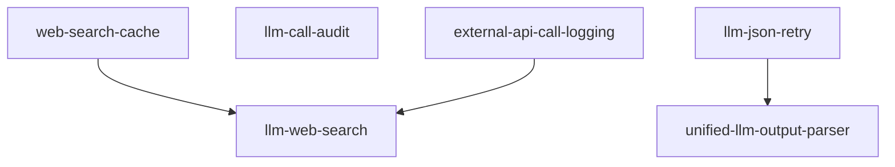

# LLM Platform Module Specification

## Purpose

LLM Platform 模块负责提供 LLM 文本生成、Web 搜索、输出解析、调用审计等核心能力。作为系统的 LLM 基础设施层，它统一管理与外部 LLM 提供商和搜索提供商的交互，提供标准化的接口供其他模块消费。

**核心职责**：
- 提供厂商无关的 LLM 文本生成抽象
- 提供厂商无关的 Web 搜索抽象
- 实现 LLM 输出的统一解析与重试机制
- 记录 LLM 和外部 API 调用审计日志
- 提供搜索结果缓存能力

## Capabilities

| Capability | Description | Source |
|------------|-------------|--------|
| llm-web-search | Web 搜索网关能力 | llm-web-search |
| web-search-cache | 搜索结果数据库缓存 | web-search-cache |
| llm-call-audit | LLM 调用审计 | llm-call-audit |
| external-api-call-logging | 外部 API 调用日志 | external-api-call-logging |
| llm-json-retry | LLM JSON 重试 | llm-json-retry |
| unified-llm-output-parser | 统一 LLM 输出解析器 | unified-llm-output-parser |

## Capability Dependency Graph



## General Conventions

### Requirement Language
- **SHALL** / **MUST**：强制性要求
- **SHOULD**：推荐性要求
- **MAY**：可选要求

### Testing Convention
每个 `#### Scenario:` 在变更交付时须对应至少一个自动化测试用例（单元或集成）；实现顺序可先实现再补测，以完整测试通过为需求完成标准。

---

## capability: llm-web-search

> Source: llm-web-search/spec.md (archived)

llm_platform 模块的 Web 搜索网关能力：定义厂商无关的搜索抽象（Port）与标准输入/输出 DTO，实现博查 AI（Bocha AI）Web Search API 适配器，通过 Application 层 `WebSearchService` 对外暴露搜索入口，供 Research 等下游模块跨模块消费。该能力与 LLM 文本生成能力并列，完全独立，不修改现有 LLM 相关代码。

---

## Requirements

### Requirement: 搜索 Port 独立于 LLM Port

llm_platform 的 Domain 层 SHALL 新增 Web Search Port（`IWebSearchProvider`，ABC），签名为 `async def search(request: WebSearchRequest) -> WebSearchResponse`。该 Port SHALL 与 `ILLMProvider` 完全独立，不存在继承关系。搜索与文本生成为不同能力域——输入/输出契约、底层 API、计费逻辑均不同，合并会违反接口隔离原则（ISP）。

#### Scenario: Port 定义独立于 LLM Port

- **WHEN** 查看 `llm_platform` 的 Domain Port 定义
- **THEN** `IWebSearchProvider` SHALL 为独立的 ABC，定义 `search(request: WebSearchRequest) -> WebSearchResponse` 方法，SHALL NOT 继承 `ILLMProvider`

#### Scenario: Port 签名使用厂商无关 DTO

- **WHEN** 调用 `IWebSearchProvider.search(request)`
- **THEN** 入参 SHALL 为 `WebSearchRequest`，出参 SHALL 为 `WebSearchResponse`，两者均为 Domain 层定义的厂商无关 DTO

---

### Requirement: 搜索 DTO 为厂商无关的标准定义

llm_platform 的 Domain 层 SHALL 定义以下搜索 DTO（Pydantic `BaseModel`）：

- **`WebSearchRequest`**：`query: str`（必填）、`freshness: Optional[str]`（时效过滤，可选值 `oneDay` / `oneWeek` / `oneMonth` / `oneYear` / `noLimit`，默认不限）、`summary: bool = True`（是否生成 AI 摘要）、`count: int = 10`（返回条数）。
- **`WebSearchResponse`**：`query: str`（原始查询词）、`total_matches: Optional[int]`（匹配总数）、`results: List[WebSearchResultItem]`（结果列表）。
- **`WebSearchResultItem`**：`title: str`、`url: str`、`snippet: str`、`summary: Optional[str]`（AI 摘要，请求 `summary=True` 时有值）、`site_name: Optional[str]`、`published_date: Optional[str]`。

所有 DTO SHALL 使用 Pydantic `BaseModel`，字段命名 SHALL NOT 绑定博查 API 的字段名（如博查的 `name` 映射为 DTO 的 `title`）。

#### Scenario: WebSearchRequest 包含完整搜索参数

- **WHEN** 构造搜索请求
- **THEN** `WebSearchRequest` SHALL 包含 `query`（str, 必填）、`freshness`（Optional[str]）、`summary`（bool, 默认 True）、`count`（int, 默认 10）字段

#### Scenario: WebSearchResponse 包含结果列表

- **WHEN** 搜索完成后构造响应
- **THEN** `WebSearchResponse` SHALL 包含 `query`（str）、`total_matches`（Optional[int]）、`results`（List[WebSearchResultItem]）字段

#### Scenario: WebSearchResultItem 包含结构化结果字段

- **WHEN** 解析单条搜索结果
- **THEN** `WebSearchResultItem` SHALL 包含 `title`（str）、`url`（str）、`snippet`（str）、`summary`（Optional[str]）、`site_name`（Optional[str]）、`published_date`（Optional[str]）字段

---

### Requirement: 博查 AI Web Search 适配器

llm_platform 的 Infrastructure 层 SHALL 实现 `BochaWebSearchAdapter`（实现 `IWebSearchProvider`），调用博查 AI Web Search API（`POST https://api.bochaai.com/v1/web-search`）。适配器 SHALL 使用 `httpx.AsyncClient` 发送异步 HTTP 请求，将 `WebSearchRequest` 转为博查 API 请求格式，将博查响应映射为 `WebSearchResponse`。

适配器构造函数 SHALL 接收 `api_key: str` 和 `base_url: str`（默认 `https://api.bochaai.com`），请求超时默认 30 秒。

响应映射规则：博查 `webPages.value[].name` → `title`、`url` → `url`、`snippet` → `snippet`、`summary` → `summary`、`siteName` → `site_name`、`datePublished` → `published_date`。

#### Scenario: 正常搜索返回映射结果

- **WHEN** 博查 API 返回正常的 `SearchResponse`（含 `webPages.value[]`）
- **THEN** 适配器 SHALL 将每条结果映射为 `WebSearchResultItem`（字段映射：`name` → `title`、`snippet` → `snippet`、`summary` → `summary`、`siteName` → `site_name`、`datePublished` → `published_date`），组装为 `WebSearchResponse` 返回

#### Scenario: 搜索无结果时返回空列表

- **WHEN** 博查 API 返回 `webPages` 为空或 `value` 为空列表
- **THEN** 适配器 SHALL 返回 `WebSearchResponse`，其 `results` 为空列表，SHALL NOT 抛出异常

#### Scenario: 请求参数正确传递

- **WHEN** 调用 `search()` 传入包含 `freshness`、`summary`、`count` 的 `WebSearchRequest`
- **THEN** 适配器 SHALL 将这些参数正确映射到博查 API 请求体中

---

### Requirement: 适配器错误处理与 Domain 异常

适配器 SHALL 将博查 API 调用过程中的错误映射为 Domain 异常：
- HTTP 4xx/5xx 响应 → 记录日志并抛出 `WebSearchError`。
- 网络超时 / 连接失败 → 抛出 `WebSearchConnectionError`。
- API Key 未配置（空字符串）→ 在调用时抛出 `WebSearchConfigError`。

Domain 层 SHALL 新增以下异常，继承 `AppException`：
- `WebSearchError`：通用搜索错误（API 返回错误码、响应格式异常）。
- `WebSearchConnectionError`：网络连接 / 超时错误。
- `WebSearchConfigError`：配置错误（API Key 未配置）。

#### Scenario: HTTP 错误码转为 WebSearchError

- **WHEN** 博查 API 返回 HTTP 4xx 或 5xx 状态码
- **THEN** 适配器 SHALL 记录错误日志并抛出 `WebSearchError`，异常消息 SHALL 包含 HTTP 状态码信息

#### Scenario: 网络超时转为 WebSearchConnectionError

- **WHEN** 调用博查 API 时发生网络超时或连接拒绝
- **THEN** 适配器 SHALL 抛出 `WebSearchConnectionError`

#### Scenario: API Key 未配置时抛出 WebSearchConfigError

- **WHEN** `api_key` 为空字符串时调用 `search()`
- **THEN** 适配器 SHALL 在调用时抛出 `WebSearchConfigError`，消息明确说明 API Key 未配置，SHALL NOT 在适配器构造时崩溃

#### Scenario: 响应格式异常时防御性处理

- **WHEN** 博查 API 返回的 JSON 结构缺少预期字段（如无 `webPages` 键）
- **THEN** 适配器 SHALL 做防御性解析（缺失字段给默认值），SHALL NOT 因字段缺失导致未处理异常

---

### Requirement: Application 层搜索服务

llm_platform 的 Application 层 SHALL 新增 `WebSearchService`，构造函数通过依赖注入接收 `IWebSearchProvider` 实例。`WebSearchService` SHALL 暴露 `async def search(request: WebSearchRequest) -> WebSearchResponse` 方法。

`WebSearchService` 当前 SHALL 做透传（调用注入的 Provider）+ 日志记录（搜索关键词、结果数量），SHALL NOT 实现多厂商 Registry / Router 逻辑。`WebSearchService` 作为跨模块调用的 Application 入口，隐藏 Infrastructure 实现细节。

#### Scenario: 正常搜索调用

- **WHEN** 通过 `WebSearchService.search(request)` 发起搜索
- **THEN** 服务 SHALL 委托注入的 `IWebSearchProvider` 执行搜索，返回 `WebSearchResponse`

#### Scenario: 服务记录搜索日志

- **WHEN** 搜索执行完成
- **THEN** 服务 SHALL 记录搜索关键词和返回结果数量的日志

#### Scenario: 服务仅依赖 Port 抽象

- **WHEN** 查看 `WebSearchService` 的构造函数和方法签名
- **THEN** 服务 SHALL 仅依赖 `IWebSearchProvider`（Domain Port），SHALL NOT 直接依赖 `BochaWebSearchAdapter` 或任何 Infrastructure 实现类

---

### Requirement: 搜索配置通过环境变量注入

系统 SHALL 在 `src/shared/config.py` 的 `Settings` 中新增搜索配置字段：
- `BOCHA_API_KEY: str = ""`（博查 API Key，默认空字符串）
- `BOCHA_BASE_URL: str = "https://api.bochaai.com"`（博查 API 基础 URL）

API Key SHALL NOT 硬编码在代码中。`BOCHA_API_KEY` 默认为空字符串，未配置时 SHALL NOT 在应用启动时崩溃，仅在实际调用搜索时检查并抛出 `WebSearchConfigError`。

#### Scenario: 配置从环境变量加载

- **WHEN** 设置环境变量 `BOCHA_API_KEY=xxx` 后启动应用
- **THEN** `settings.BOCHA_API_KEY` SHALL 为 `xxx`

#### Scenario: 未配置 API Key 时应用正常启动

- **WHEN** 未设置 `BOCHA_API_KEY` 环境变量
- **THEN** 应用 SHALL 正常启动，`settings.BOCHA_API_KEY` 为空字符串，不影响 LLM 或其他模块功能

---

### Requirement: Presentation 层 REST 搜索接口

llm_platform 的 Presentation 层 SHALL 新增 `search_routes.py`，定义 `POST /llm-platform/web-search` 接口。请求体为 Pydantic DTO（`query` 必填，`freshness` / `summary` / `count` 可选），响应体为搜索结果。

路由 SHALL 通过 FastAPI `Depends` 链装配 `BochaWebSearchAdapter` → `WebSearchService`（从 `settings` 获取 API Key 和 Base URL）。

异常映射：
- `WebSearchConfigError` → HTTP 503（服务未配置）
- `WebSearchConnectionError` → HTTP 503（上游不可达）
- `WebSearchError` → HTTP 502（上游错误）
- 其他未预期异常 → HTTP 500（记录日志）

#### Scenario: 正常搜索请求返回 200

- **WHEN** 发送 `POST /llm-platform/web-search` 请求，body 包含 `{"query": "A股最新政策"}`
- **THEN** 系统 SHALL 返回 HTTP 200，响应体包含搜索结果列表

#### Scenario: query 缺失时返回 422

- **WHEN** 发送 `POST /llm-platform/web-search` 请求，body 中缺少 `query` 字段
- **THEN** 系统 SHALL 返回 HTTP 422（FastAPI 自动校验），响应体包含字段缺失的错误信息

#### Scenario: API Key 未配置时返回 503

- **WHEN** `BOCHA_API_KEY` 未配置，发送搜索请求
- **THEN** 系统 SHALL 返回 HTTP 503，响应体包含服务未配置的错误信息

#### Scenario: 博查 API 不可用时返回 503

- **WHEN** 博查 API 网络不可达或超时
- **THEN** 系统 SHALL 返回 HTTP 503，响应体包含上游不可达的错误信息

#### Scenario: 博查 API 返回错误时返回 502

- **WHEN** 博查 API 返回 HTTP 4xx/5xx 错误
- **THEN** 系统 SHALL 返回 HTTP 502，响应体包含上游错误信息

---

### Requirement: 下游模块通过 Application 接口消费搜索能力

下游模块（如 Research 的宏观情报员、催化剂侦探）SHALL 仅通过 `llm_platform` 的 **Application 接口**（`WebSearchService`）消费搜索能力，SHALL NOT 直接依赖 `IWebSearchProvider` Port、`BochaWebSearchAdapter` 或任何 Infrastructure 实现。入参/出参 SHALL 使用 Domain 层定义的 DTO（`WebSearchRequest` / `WebSearchResponse`）。

#### Scenario: 跨模块调用走 Application 入口

- **WHEN** Research 模块的某个 Agent 需要网页搜索
- **THEN** 该 Agent 的 Infrastructure Adapter SHALL 通过 `WebSearchService.search(request)` 调用搜索，SHALL NOT 直接实例化 `BochaWebSearchAdapter` 或引用 Infrastructure 层代码

---

### Requirement: 搜索能力不影响现有 LLM 能力

本变更 SHALL NOT 修改现有 LLM 生成相关代码（`ILLMProvider`、`LLMService`、`LLMRegistry`、`LLMRouter`、`OpenAIProvider`、`chat_routes.py`）。搜索能力为独立新增，与文本生成并列。

#### Scenario: LLM 生成功能不受影响

- **WHEN** 部署搜索能力后调用 LLM 文本生成接口
- **THEN** LLM 生成 SHALL 正常工作，行为与变更前完全一致

---

### Requirement: 可测性 — Scenario 与测试一一对应

每个上述 Scenario 在变更交付时 SHALL 对应至少一个自动化测试（单元或集成）；需求完成的验收条件包含「该需求下所有 Scenario 的测试通过」。实现时可采用先实现再补测，不强制测试先行。

#### Scenario: 测试覆盖适配器正常映射

- **WHEN** 运行搜索相关测试套件
- **THEN** 存在测试用例：mock HTTP 响应为正常博查 API 返回，断言适配器正确映射为 `WebSearchResponse`（对应「正常搜索返回映射结果」）

#### Scenario: 测试覆盖适配器错误处理

- **WHEN** 运行搜索相关测试套件
- **THEN** 存在测试用例：mock HTTP 返回 500 → 断言抛出 `WebSearchError`；mock 超时 → 断言抛出 `WebSearchConnectionError`；mock API Key 为空 → 断言抛出 `WebSearchConfigError`

#### Scenario: 测试覆盖搜索服务编排

- **WHEN** 运行搜索相关测试套件
- **THEN** 存在测试用例：mock `IWebSearchProvider` 返回固定响应，断言 `WebSearchService` 正确透传结果

#### Scenario: 测试覆盖配置加载

- **WHEN** 运行搜索相关测试套件
- **THEN** 存在测试用例：验证 `Settings` 中 `BOCHA_API_KEY` 和 `BOCHA_BASE_URL` 的默认值和环境变量覆盖行为

---

## capability: web-search-cache

> Source: web-search-cache/spec.md (archived)

博查搜索结果的数据库缓存能力：通过 Decorator 模式在 `IWebSearchProvider` 层透明缓存搜索结果到 PostgreSQL，按请求参数哈希作为缓存键，按 `freshness` 参数动态设置 TTL，对所有消费者（Research 模块等）完全透明。缓存命中时直接返回，未命中时调用实际搜索并写入缓存。

---

## Requirements

### Requirement: 缓存 Repository Port 定义

llm_platform 的 Domain 层 SHALL 新增 `IWebSearchCacheRepository`（ABC），定义搜索结果缓存的持久化契约。该 Port SHALL 包含以下方法：

- `async def get(self, cache_key: str) -> WebSearchCacheEntry | None`：按缓存键查询未过期的缓存条目，过期或不存在返回 None。
- `async def put(self, entry: WebSearchCacheEntry) -> None`：写入或覆盖缓存条目。
- `async def cleanup_expired(self) -> int`：清理已过期的缓存条目，返回删除条数。

#### Scenario: Port 定义完整

- **WHEN** 查看 `IWebSearchCacheRepository` 的方法签名
- **THEN** SHALL 包含 `get(cache_key) -> WebSearchCacheEntry | None`、`put(entry) -> None`、`cleanup_expired() -> int` 三个抽象方法

#### Scenario: Port 位于 Domain 层

- **WHEN** 查看 `IWebSearchCacheRepository` 的模块位置
- **THEN** SHALL 位于 `src/modules/llm_platform/domain/ports/` 下，且仅依赖 Domain 层的 DTO，不依赖任何 Infrastructure 实现

---

### Requirement: 缓存条目 DTO

llm_platform 的 Domain 层 SHALL 新增 `WebSearchCacheEntry`（Pydantic BaseModel），包含以下字段：

- `cache_key: str`（请求参数的 SHA-256 哈希，主键）
- `request_params: dict`（原始请求参数，便于调试）
- `response_data: str`（`WebSearchResponse` 的 JSON 序列化）
- `created_at: datetime`（缓存写入时间）
- `expires_at: datetime`（缓存过期时间）

#### Scenario: DTO 包含完整字段

- **WHEN** 构造 `WebSearchCacheEntry`
- **THEN** SHALL 包含 `cache_key`（str）、`request_params`（dict）、`response_data`（str）、`created_at`（datetime）、`expires_at`（datetime）字段

#### Scenario: DTO 为 Pydantic BaseModel

- **WHEN** 查看 `WebSearchCacheEntry` 的定义
- **THEN** SHALL 继承 `pydantic.BaseModel`，位于 `src/modules/llm_platform/domain/dtos/` 下

---

### Requirement: 缓存键生成规则

系统 SHALL 基于 `WebSearchRequest` 的四个字段（`query`、`freshness`、`summary`、`count`）生成确定性缓存键。缓存键 SHALL 为这四个字段拼接后的 SHA-256 十六进制摘要。相同请求参数 SHALL 始终生成相同的缓存键。

#### Scenario: 相同请求生成相同缓存键

- **WHEN** 两次构造参数完全相同的 `WebSearchRequest`（query、freshness、summary、count 均相同）
- **THEN** 生成的缓存键 SHALL 完全相同

#### Scenario: 不同参数生成不同缓存键

- **WHEN** 两次构造 `WebSearchRequest`，仅 `freshness` 不同（如 `oneWeek` vs `oneMonth`）
- **THEN** 生成的缓存键 SHALL 不同

#### Scenario: 缓存键为 SHA-256 十六进制

- **WHEN** 对任意 `WebSearchRequest` 生成缓存键
- **THEN** 缓存键 SHALL 为 64 字符的十六进制字符串（SHA-256 摘要）

---

### Requirement: TTL 基于 freshness 动态计算

系统 SHALL 根据搜索请求的 `freshness` 参数动态计算缓存 TTL：

| freshness | TTL |
|-----------|-----|
| `oneDay` | 4 小时 |
| `oneWeek` | 12 小时 |
| `oneMonth` | 24 小时 |
| `oneYear` | 48 小时 |
| `noLimit` 或 `None` | 24 小时 |

#### Scenario: oneDay freshness 的 TTL

- **WHEN** 缓存一条 `freshness=oneDay` 的搜索结果
- **THEN** 缓存条目的 `expires_at` SHALL 为 `created_at` + 4 小时

#### Scenario: oneWeek freshness 的 TTL

- **WHEN** 缓存一条 `freshness=oneWeek` 的搜索结果
- **THEN** 缓存条目的 `expires_at` SHALL 为 `created_at` + 12 小时

#### Scenario: oneMonth freshness 的 TTL

- **WHEN** 缓存一条 `freshness=oneMonth` 的搜索结果
- **THEN** 缓存条目的 `expires_at` SHALL 为 `created_at` + 24 小时

#### Scenario: None freshness 使用默认 TTL

- **WHEN** 缓存一条 `freshness=None` 的搜索结果
- **THEN** 缓存条目的 `expires_at` SHALL 为 `created_at` + 24 小时

---

### Requirement: CachingWebSearchProvider Decorator

llm_platform 的 Infrastructure 层 SHALL 新增 `CachingWebSearchProvider`，实现 `IWebSearchProvider` 接口，通过构造函数注入被包装的 `IWebSearchProvider`（如 `BochaWebSearchAdapter`）和 `IWebSearchCacheRepository`。

`search()` 方法的执行流程 SHALL 为：
1. 根据 `WebSearchRequest` 生成缓存键
2. 通过 `IWebSearchCacheRepository.get(cache_key)` 查询缓存
3. 若命中（返回非 None 且未过期），反序列化 `response_data` 为 `WebSearchResponse` 并返回，记录 INFO 级别缓存命中日志
4. 若未命中，委托给被包装的 provider 执行搜索，将结果序列化后通过 `IWebSearchCacheRepository.put()` 写入缓存，记录 INFO 级别缓存未命中日志
5. 缓存写入失败 SHALL NOT 阻塞搜索结果返回，仅记录 WARNING 级别日志

#### Scenario: 缓存命中时不调用实际搜索

- **WHEN** 缓存中存在匹配且未过期的搜索结果
- **THEN** `CachingWebSearchProvider` SHALL 直接返回缓存的 `WebSearchResponse`，SHALL NOT 调用被包装的 `IWebSearchProvider.search()`

#### Scenario: 缓存未命中时调用实际搜索并写入缓存

- **WHEN** 缓存中不存在匹配的搜索结果（或已过期）
- **THEN** `CachingWebSearchProvider` SHALL 委托被包装的 provider 执行搜索，搜索完成后将结果写入缓存，并返回搜索结果

#### Scenario: 缓存写入失败不阻塞返回

- **WHEN** 搜索成功但缓存写入失败（如数据库异常）
- **THEN** 搜索结果 SHALL 正常返回给调用方，系统 SHALL 记录 WARNING 级别日志，SHALL NOT 抛出异常

#### Scenario: 搜索失败时不写入缓存

- **WHEN** 被包装的 provider 搜索失败（抛出异常）
- **THEN** `CachingWebSearchProvider` SHALL 将异常原样抛出，SHALL NOT 将错误结果写入缓存

#### Scenario: 缓存命中记录日志

- **WHEN** 搜索请求命中缓存
- **THEN** 系统 SHALL 记录 INFO 级别日志，包含查询词和缓存键信息

#### Scenario: 缓存未命中记录日志

- **WHEN** 搜索请求未命中缓存
- **THEN** 系统 SHALL 记录 INFO 级别日志，包含查询词信息

---

### Requirement: PostgreSQL 缓存持久化实现

系统 SHALL 新增 `web_search_cache` 数据库表（通过 Alembic migration），包含以下列：

| 列名 | 类型 | 约束 | 说明 |
|------|------|------|------|
| `cache_key` | `VARCHAR(64)` | PRIMARY KEY | SHA-256 哈希 |
| `request_params` | `JSONB` | NOT NULL | 原始请求参数 |
| `response_data` | `TEXT` | NOT NULL | WebSearchResponse JSON |
| `created_at` | `TIMESTAMP` | NOT NULL | 写入时间 |
| `expires_at` | `TIMESTAMP` | NOT NULL | 过期时间 |

系统 SHALL 在 `expires_at` 列上创建索引，用于加速过期清理查询。

`PgWebSearchCacheRepository` SHALL 实现 `IWebSearchCacheRepository`：
- `get()`：查询 `cache_key` 匹配且 `expires_at > now()` 的记录
- `put()`：使用 UPSERT（INSERT ... ON CONFLICT UPDATE）写入或覆盖缓存
- `cleanup_expired()`：删除 `expires_at <= now()` 的记录

#### Scenario: 缓存写入与读取

- **WHEN** 通过 `put()` 写入一条缓存条目，然后在 TTL 内通过 `get()` 查询相同 `cache_key`
- **THEN** `get()` SHALL 返回之前写入的 `WebSearchCacheEntry`

#### Scenario: 过期缓存不返回

- **WHEN** 缓存条目已过期（`expires_at` 早于当前时间）
- **THEN** `get()` SHALL 返回 `None`

#### Scenario: UPSERT 覆盖已有缓存

- **WHEN** 对已存在的 `cache_key` 再次 `put()` 新的缓存条目
- **THEN** 新条目 SHALL 覆盖旧条目的 `response_data`、`created_at`、`expires_at`

#### Scenario: 清理过期条目

- **WHEN** 调用 `cleanup_expired()`，且存在 N 条已过期的缓存记录
- **THEN** 这些记录 SHALL 被删除，方法返回值为 N

#### Scenario: Alembic migration 可正常执行

- **WHEN** 执行 Alembic upgrade
- **THEN** `web_search_cache` 表 SHALL 被创建，包含上述列定义和索引

---

### Requirement: Container 装配透明集成

`LLMPlatformContainer.web_search_service()` SHALL 在构造 `BochaWebSearchAdapter` 后，当 session 存在时，用 `CachingWebSearchProvider` 包装 adapter 再注入 `WebSearchService`。无 session 时 SHALL 跳过缓存包装，直接使用原始 adapter（降级为无缓存模式）。

#### Scenario: 有 session 时启用缓存

- **WHEN** `LLMPlatformContainer` 构造时传入了 `session`
- **THEN** `web_search_service()` 返回的 `WebSearchService` 内部使用的 provider SHALL 为 `CachingWebSearchProvider`（包装 `BochaWebSearchAdapter`）

#### Scenario: 无 session 时降级为无缓存

- **WHEN** `LLMPlatformContainer` 构造时未传入 `session`（session 为 None）
- **THEN** `web_search_service()` 返回的 `WebSearchService` 内部使用的 provider SHALL 直接为 `BochaWebSearchAdapter`，不包含缓存层

#### Scenario: 消费者代码无需修改

- **WHEN** Research 模块的 `MacroDataAdapter` 和 `CatalystDataAdapter` 通过 `WebSearchService.search()` 发起搜索
- **THEN** 搜索行为 SHALL 与之前一致（命中缓存时更快返回），消费者代码 SHALL NOT 需要任何修改

---

### Requirement: 可测性 — Scenario 与测试一一对应

每个上述 Scenario 在变更交付时 SHALL 对应至少一个自动化测试（单元或集成）；需求完成的验收条件包含「该需求下所有 Scenario 的测试通过」。实现时可采用先实现再补测，不强制测试先行。

#### Scenario: 测试覆盖缓存键生成

- **WHEN** 运行缓存相关测试套件
- **THEN** 存在测试用例：验证相同请求生成相同缓存键、不同请求生成不同缓存键、缓存键格式为 64 字符十六进制

#### Scenario: 测试覆盖 TTL 计算

- **WHEN** 运行缓存相关测试套件
- **THEN** 存在测试用例：验证各 freshness 值对应的 TTL 计算正确

#### Scenario: 测试覆盖 Decorator 缓存命中与未命中

- **WHEN** 运行缓存相关测试套件
- **THEN** 存在测试用例：mock cache repository 返回缓存命中 → 断言不调用 inner provider；mock 返回 None → 断言调用 inner provider 并写入缓存

#### Scenario: 测试覆盖缓存写入失败降级

- **WHEN** 运行缓存相关测试套件
- **THEN** 存在测试用例：mock cache repository 的 put() 抛出异常，断言搜索结果正常返回且不抛出异常

---

## capability: llm-call-audit

> Source: llm-call-audit/spec.md (archived)

LLM 调用审计：在 LLMService.generate() 层自动记录每次 LLM 调用的完整信息（prompt、completion、token、耗时、session 关联等），失败时同样记录；持久化不阻塞调用返回；提供按 session_id 查询的 API。

---

## Requirements

### Requirement: LLM 调用自动记录

系统 SHALL 在 `LLMService.generate()` 层自动记录每次 LLM 调用的完整信息，无需各调用方模块自行实现。

记录内容 MUST 包含：唯一标识（UUID）、关联 session_id（可为 null）、调用方模块名、调用方 Agent 标识（可为 null）、模型名称、供应商、完整 user prompt、system message、LLM 完整输出、prompt tokens、completion tokens、总 tokens、温度参数、调用耗时（毫秒）、状态（success / failed）、错误信息（失败时）。

#### Scenario: 研究流水线中的 LLM 调用

- **WHEN** 技术分析师 Agent 在研究流水线中调用 LLM 生成分析
- **THEN** 系统自动创建一条 `LLMCallLog`，包含完整 prompt、completion、token 用量、耗时，session_id 关联到当前 ResearchSession

#### Scenario: 非研究流水线的 LLM 调用

- **WHEN** 某模块在非研究流水线上下文中调用 LLM（无 ExecutionContext）
- **THEN** 系统仍创建 `LLMCallLog`，但 session_id 为 null

---

### Requirement: LLM 调用失败记录

系统 SHALL 在 LLM 调用失败（异常、超时等）时同样记录日志，status 为 `failed`，error_message 包含异常信息。completion_text 在失败时可为 null。

#### Scenario: LLM 调用超时

- **WHEN** LLM 调用因网络超时抛出异常
- **THEN** 系统创建一条 `LLMCallLog`，status=failed，error_message 包含超时异常信息，completion_text 为 null，latency_ms 反映实际等待时间

#### Scenario: LLM 返回格式错误

- **WHEN** LLM 调用成功返回但返回内容无法解析
- **THEN** LLM 调用层面的 `LLMCallLog` status=success（因为 LLM 确实返回了结果），completion_text 包含原始返回内容；解析失败由上层 Agent 处理

---

### Requirement: 审计日志写入不阻塞 LLM 调用

`LLMCallLog` 的持久化 SHALL NOT 阻塞 LLM 调用的返回。写入失败时 MUST 记录 warning 级别日志，LLM 调用结果正常返回给调用方。

#### Scenario: 审计写入失败

- **WHEN** LLM 调用成功，但审计日志写入数据库失败
- **THEN** LLM 调用结果正常返回给调用方，日志中记录审计写入失败的 warning

---

### Requirement: 按 session 查询 LLM 调用日志

系统 SHALL 提供通过 session_id 查询关联 LLM 调用日志的能力（供 Coordinator 历史查询 API 聚合使用）。

`GET /research/sessions/{session_id}/llm-calls` 端点 SHALL 返回该 session 关联的所有 LLM 调用记录，按 created_at 排序。

#### Scenario: 查询某次研究的 LLM 调用

- **WHEN** 客户端请求 `GET /research/sessions/{session_id}/llm-calls`
- **THEN** 返回该 session 下所有 LLM 调用记录列表，每条包含 caller_agent、model_name、prompt_text、completion_text、total_tokens、latency_ms、status

#### Scenario: 无关联调用

- **WHEN** 查询一个没有 LLM 调用记录的 session_id
- **THEN** 返回空列表，HTTP 200

---

## capability: external-api-call-logging

> Source: external-api-call-logging/spec.md (archived)

外部 API 调用日志：在 WebSearchService.search() 层自动记录每次外部 API 调用的完整信息（请求、响应、状态、耗时、session 关联等），失败时同样记录；写入不阻塞 API 返回；提供按 session 查询的 GET /research/sessions/{session_id}/api-calls 端点。

---

## Requirements

### Requirement: 外部 API 调用自动记录

系统 SHALL 在 `WebSearchService.search()` 层自动记录每次外部 API 调用的完整信息。

记录内容 MUST 包含：唯一标识（UUID）、关联 session_id（可为 null）、服务名（如 bochai）、操作名（如 web-search）、请求参数（JSONB）、完整响应数据（TEXT）、HTTP 状态码、调用耗时（毫秒）、状态（success / failed）、错误信息（失败时）。

#### Scenario: 博查搜索成功

- **WHEN** 宏观情报员 Agent 通过 WebSearchService 调用博查搜索宏观经济数据
- **THEN** 系统自动创建一条 `ExternalAPICallLog`，service_name=bochai，operation=web-search，request_params 包含搜索 query 等参数，response_data 包含完整搜索结果，session_id 关联到当前 ResearchSession

#### Scenario: 无上下文的外部 API 调用

- **WHEN** 某模块在非研究流水线上下文中调用外部 API
- **THEN** 系统仍创建 `ExternalAPICallLog`，但 session_id 为 null

---

### Requirement: 外部 API 调用失败记录

系统 SHALL 在外部 API 调用失败（网络异常、非 2xx 响应等）时记录日志，status 为 `failed`，error_message 包含异常信息。

#### Scenario: 博查 API 返回 500

- **WHEN** 博查搜索 API 返回 HTTP 500 错误
- **THEN** 系统创建一条 `ExternalAPICallLog`，status=failed，status_code=500，error_message 包含错误详情

#### Scenario: 网络连接失败

- **WHEN** 博查搜索因网络不可达而失败
- **THEN** 系统创建一条 `ExternalAPICallLog`，status=failed，error_message 包含连接异常信息，status_code 为 null

---

### Requirement: 日志写入不阻塞 API 调用

`ExternalAPICallLog` 的持久化 SHALL NOT 阻塞外部 API 调用的返回。写入失败时 MUST 记录 warning 级别日志。

#### Scenario: 日志写入失败

- **WHEN** 博查搜索成功返回，但日志写入数据库失败
- **THEN** 搜索结果正常返回给调用方，日志中记录写入失败的 warning

---

### Requirement: 按 session 查询外部 API 调用日志

系统 SHALL 提供 `GET /research/sessions/{session_id}/api-calls` 端点，返回该 session 关联的所有外部 API 调用记录。

#### Scenario: 查询某次研究的 API 调用

- **WHEN** 客户端请求 `GET /research/sessions/{session_id}/api-calls`
- **THEN** 返回该 session 下所有外部 API 调用记录列表，每条包含 service_name、operation、request_params、response_data、latency_ms、status

#### Scenario: 无关联调用

- **WHEN** 查询一个没有外部 API 调用记录的 session_id
- **THEN** 返回空列表，HTTP 200

---

## capability: llm-json-retry

> Source: llm-json-retry/spec.md (archived)

## Purpose

提供带错误反馈的 LLM JSON 重试能力，确保 LLM 输出在解析失败或校验失败时能够根据错误摘要进行自我修正。

---

## Requirements

### Requirement: generate_and_parse 封装调用与解析

`generate_and_parse` 异步函数 SHALL 接受以下参数：

- `llm_call: Callable[..., Awaitable[str]]` — LLM 回调函数
- `dto_type: type[T]` — 目标 Pydantic DTO 类型
- `prompt: str` — 原始 prompt
- `system_message: str | None` — 可选 system message
- `temperature: float` — 采样温度，默认 0.7
- `normalizers: list[Callable[[dict], dict]] | None` — 可选归一化钩子
- `max_retries: int` — 最大重试次数，默认 1
- `context_label: str` — 上下文标签，用于日志

函数 SHALL 调用 `llm_call` 获取 LLM 原始输出，然后委托 `parse_llm_json_output` 解析。首次解析成功时直接返回 DTO 实例。

#### Scenario: 首次调用即成功

- **WHEN** `generate_and_parse` 被调用，LLM 首次返回合法 JSON 且通过 Pydantic 校验
- **THEN** 仅调用 `llm_call` 一次，返回目标 DTO 实例

#### Scenario: 参数透传到 llm_call

- **WHEN** `generate_and_parse` 以 `prompt="分析..."`, `system_message="你是..."`, `temperature=0.3` 调用
- **THEN** `llm_call` 被调用时接收到相同的 `prompt`、`system_message`、`temperature` 参数

---

### Requirement: 解析失败时带错误反馈重试

当 `parse_llm_json_output` 抛出 `LLMJsonParseError` 且剩余重试次数 > 0 时，`generate_and_parse` SHALL 构造包含错误摘要的修正 prompt 再次调用 `llm_call`。

修正 prompt SHALL 包含：原始 prompt + 错误反馈指令（含具体错误信息），指示 LLM 仅输出 JSON 对象，不包含额外文字或 Markdown 标记。

#### Scenario: 首次失败、重试成功

- **WHEN** LLM 首次返回非法 JSON（如包含 Markdown 注释），`max_retries=1`
- **THEN** `generate_and_parse` 以包含错误信息的修正 prompt 再次调用 `llm_call`，第二次返回合法 JSON，最终成功返回 DTO

#### Scenario: 重试 prompt 包含错误信息

- **WHEN** 首次解析失败，错误信息为 `"Expecting ',' delimiter: line 5 column 3"`
- **THEN** 重试 prompt 中包含该具体错误信息，便于 LLM 自修正

#### Scenario: 多次重试

- **WHEN** `max_retries=2`，首次和第一次重试均失败，第二次重试成功
- **THEN** 共调用 `llm_call` 三次，最终返回 DTO

---

### Requirement: 重试耗尽后抛出异常

当所有重试均失败时，`generate_and_parse` SHALL 抛出最后一次 `parse_llm_json_output` 产生的 `LLMJsonParseError`。

#### Scenario: 所有尝试均失败

- **WHEN** `max_retries=1`，首次和重试均返回非法 JSON
- **THEN** 抛出 `LLMJsonParseError`，`message` 和 `details` 来自最后一次解析失败

#### Scenario: max_retries 为 0 时不重试

- **WHEN** `max_retries=0`，首次返回非法 JSON
- **THEN** 仅调用 `llm_call` 一次，直接抛出 `LLMJsonParseError`

---

### Requirement: 重试过程经 LLM 调用审计

`generate_and_parse` 的每次 `llm_call` 调用（包括重试）SHALL 独立经过 `LLMService` 的调用审计链路。

#### Scenario: 重试产生独立审计记录

- **WHEN** `generate_and_parse` 首次失败后重试成功，共调用 `llm_call` 两次
- **THEN** `LLMCallLog` 中产生两条独立记录，每条包含各自的 prompt、completion、latency

---

### Requirement: 重试日志记录

`generate_and_parse` 在每次重试时 SHALL 记录 WARNING 级别日志，包含：重试次数、`context_label`、上一次的错误摘要。

#### Scenario: 重试时记录日志

- **WHEN** `generate_and_parse` 以 `context_label="估值建模师"` 调用，首次解析失败触发重试
- **THEN** WARNING 日志中包含 `"估值建模师"`、重试序号（如 `"第 1 次重试"`）、上一次错误摘要

---

### Requirement: LLM 调用异常透传

当 `llm_call` 本身抛出异常（如 `LLMConnectionError`、网络超时）时，`generate_and_parse` SHALL 直接向上透传该异常，不进行重试。

#### Scenario: LLM 连接失败不重试

- **WHEN** `llm_call` 首次调用抛出 `LLMConnectionError`
- **THEN** `generate_and_parse` 直接抛出 `LLMConnectionError`，不触发重试，`llm_call` 仅被调用一次

#### Scenario: 重试中 LLM 连接失败

- **WHEN** 首次解析失败触发重试，重试时 `llm_call` 抛出 `LLMConnectionError`
- **THEN** `generate_and_parse` 直接抛出 `LLMConnectionError`，不继续后续重试

---

## capability: unified-llm-output-parser

> Source: unified-llm-output-parser/spec.md (archived)

## Purpose

提供供应商无关的统一泛型 LLM JSON 处理器，内聚全部预处理与 Pydantic 校验逻辑，消除各模块重复的解析实现，支持可选归一化钩子供 Agent 注入特有后处理。

---

## Requirements

### Requirement: 统一预处理管线

`parse_llm_json_output` 函数 SHALL 对 LLM 原始输出字符串按以下固定顺序执行预处理：

1. 空值检查：`raw` 为 `None`、空字符串或纯空白时，立即抛出 `LLMJsonParseError`。
2. 剥离 `<think>...</think>` 标签及其内容。
3. 剥离 Markdown 代码块（`` ```json `` 或 `` ``` `` 包裹的内容）。
4. 修复 JSON 字符串值内的未转义控制字符。
5. 执行 `json.loads` 解析。
6. 若步骤 5 失败，尝试从文本中提取首尾配对的 `{ }` 之间的内容（fallback），再次 `json.loads`。
7. 校验 JSON 根节点为 `dict` 类型。

#### Scenario: 纯净 JSON 直接解析

- **WHEN** LLM 返回 `{"score": 85, "signal": "bullish"}`
- **THEN** `parse_llm_json_output` 成功返回目标 DTO 实例

#### Scenario: Markdown 代码块包裹

- **WHEN** LLM 返回 `` ```json\n{"score": 85}\n``` ``
- **THEN** 预处理剥离代码块后成功解析

#### Scenario: think 标签 + Markdown 代码块

- **WHEN** LLM 返回 `<think>推理过程...</think>\n```json\n{"score": 85}\n```  `
- **THEN** 先剥离 think 标签，再剥离代码块，成功解析

#### Scenario: JSON 前后附带说明文字

- **WHEN** LLM 返回 `以下是分析结果：\n{"score": 85, "signal": "bullish"}\n以上为分析。`
- **THEN** fallback 提取 `{ }` 之间内容，成功解析

#### Scenario: 字符串值内含字面换行

- **WHEN** LLM 返回的 JSON 中某字符串字段包含未转义的字面换行符
- **THEN** 控制字符修复将其转为 `\\n`，`json.loads` 成功

#### Scenario: 完全非法内容

- **WHEN** LLM 返回纯文本且无 JSON 结构
- **THEN** 抛出 `LLMJsonParseError`

#### Scenario: 空返回

- **WHEN** LLM 返回空字符串或 `None`
- **THEN** 抛出 `LLMJsonParseError`

#### Scenario: JSON 根节点为数组

- **WHEN** LLM 返回 `[{"item": 1}]`（根节点为 list 而非 dict）
- **THEN** 抛出 `LLMJsonParseError`

---

### Requirement: 泛型 Pydantic 校验

`parse_llm_json_output` SHALL 接受泛型参数 `dto_type: type[T]`（其中 `T` 为 `pydantic.BaseModel` 子类），在预处理后调用 `dto_type.model_validate(data)` 完成反序列化与校验。校验失败时 SHALL 抛出 `LLMJsonParseError`。

#### Scenario: 字段校验成功

- **WHEN** LLM 返回的 JSON 字段完整且类型正确
- **THEN** 返回对应 Pydantic DTO 实例

#### Scenario: 必填字段缺失

- **WHEN** LLM 返回的 JSON 缺少 DTO 定义的必填字段
- **THEN** 抛出 `LLMJsonParseError`

#### Scenario: 字段类型错误

- **WHEN** LLM 返回的 JSON 中某字段类型与 DTO 定义不匹配
- **THEN** 抛出 `LLMJsonParseError`

---

### Requirement: 可选归一化钩子

`parse_llm_json_output` SHALL 接受可选参数 `normalizers: list[Callable[[dict], dict]]`。在 `json.loads` 成功后、Pydantic 校验前，按列表顺序依次执行每个钩子。

#### Scenario: 枚举值归一化

- **WHEN** Agent 注册钩子将中文枚举映射为英文枚举
- **THEN** 钩子执行后通过 Pydantic 校验

#### Scenario: 对象数组归一化为字符串列表

- **WHEN** Agent 注册钩子将对象数组转为字符串列表
- **THEN** 钩子执行后通过 Pydantic 校验

#### Scenario: 钩子执行异常

- **WHEN** 某个钩子函数抛出异常
- **THEN** 抛出 `LLMJsonParseError`，包含原始 dict 摘要

---

### Requirement: 通用异常类型 LLMJsonParseError

系统 SHALL 在 `src/shared/domain/exceptions.py` 中新增 `LLMJsonParseError`，继承 `AppException`。

#### Scenario: 统一处理器抛出 LLMJsonParseError

- **WHEN** `parse_llm_json_output` 在任一阶段失败
- **THEN** 抛出的异常类型为 `LLMJsonParseError`

#### Scenario: 模块 parser 转换异常类型

- **WHEN** 模块的 output_parser 薄包装捕获到 `LLMJsonParseError`
- **THEN** 转抛为模块领域异常，保留原始详情

---

### Requirement: 上下文标签用于日志

`parse_llm_json_output` SHALL 接受可选参数 `context_label: str`，在解析失败时将其写入日志。

#### Scenario: 带标签的失败日志

- **WHEN** 解析失败且传入了 `context_label`
- **THEN** WARNING 日志中包含该标签

---

### Requirement: 各 Agent output_parser 重构为薄包装

Agent 的 output_parser SHALL 重构为薄包装：调用 `parse_llm_json_output`，捕获 `LLMJsonParseError` 转为模块领域异常。

#### Scenario: 重构后公开函数签名不变

- **WHEN** 调用重构后的 parser 函数
- **THEN** 函数签名、参数、返回类型与重构前一致
