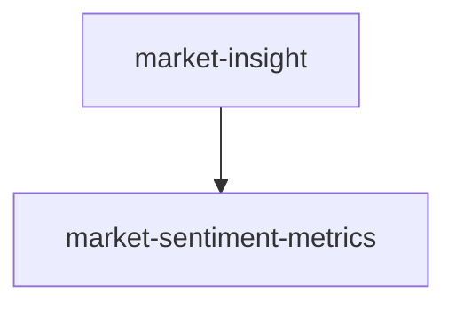

# Market Insight Module Specification

## Purpose

`market_insight` 模块提供板块维度的市场洞察分析能力，包含三个核心功能：
- **概念热度计算**：从 `data_engineering` 获取概念成分股映射与日线行情数据，通过等权平均法聚合板块涨跌幅，输出板块热度排名并持久化至 PostgreSQL
- **涨停扫描归因**：识别当日涨停个股，将涨停股映射至所属概念板块，统计各概念涨停家数，并持久化至 PostgreSQL  
- **每日复盘报告**：编排完整计算流程（获取数据 → 计算热度 → 扫描涨停 → 持久化 → 生成报告），输出 Markdown 日报文件，并提供 REST API 端点用于查询和触发
- **市场情绪量化**：基于涨停池、炸板池、昨日涨停表现等数据计算连板梯队分布、赚钱效应、炸板率等衍生指标，为超短线交易提供市场情绪洞察

## Capabilities

| Capability | Description | Source |
|------------|-------------|--------|
| market-insight | 板块维度的市场洞察分析（概念热度、涨停扫描、每日复盘） | market-insight |
| market-sentiment-metrics | 市场情绪量化指标能力（连板梯队、赚钱效应、炸板率） | market-sentiment-metrics |

## Capability Dependency Graph



## General Conventions

### Requirement Language
- **SHALL** / **MUST**：强制性要求
- **SHOULD**：推荐性要求
- **MAY**：可选要求

### Testing Convention
每个 `#### Scenario:` 在变更交付时须对应至少一个自动化测试用例（单元或集成）；实现顺序可先实现再补测，以完整测试通过为需求完成标准。

---

## capability: market-insight

> Source: market-insight/spec.md (archived)

`market_insight` 模块提供板块维度的市场洞察分析能力，包含三个核心功能：概念热度计算、涨停扫描归因、每日复盘报告。

---

## Requirements

### Requirement: 数据获取适配器

系统 MUST 在 `market_insight/domain/ports/concept_data_port.py` 中定义 `IConceptDataPort` ABC 接口，用于获取概念板块及其成分股映射。

该接口 MUST 包含以下方法：

- `get_all_concepts_with_stocks() -> list[ConceptWithStocksDTO]`：获取所有概念板块及其成分股列表。

`ConceptWithStocksDTO` 为 `market_insight` 领域层 DTO，字段 MUST 包含：

- `code`（str）：概念板块代码
- `name`（str）：概念板块名称
- `stocks`（list[ConceptStockDTO]）：成分股列表，每项含 `third_code`（str）和 `stock_name`（str）

方法 MUST 为异步方法（async）。

#### Scenario: Port 在 Market Insight Domain 层定义

- **WHEN** 检查 `IConceptDataPort` 的定义位置
- **THEN** MUST 位于 `src/modules/market_insight/domain/ports/concept_data_port.py`
- **THEN** 接口返回类型 MUST 使用 `market_insight` 领域层定义的 DTO，不直接引用 `data_engineering` 的类型

#### Requirement: IMarketDataPort 接口定义

系统 MUST 在 `market_insight/domain/ports/market_data_port.py` 中定义 `IMarketDataPort` ABC 接口，用于获取指定日期的全市场日线行情。

该接口 MUST 包含以下方法：

- `get_daily_bars_by_date(trade_date: date) -> list[StockDailyDTO]`：获取指定交易日全市场日线数据。

`StockDailyDTO` 为 `market_insight` 领域层 DTO，字段 MUST 包含：

- `third_code`（str）：股票代码（系统标准格式）
- `stock_name`（str）：股票名称
- `trade_date`（date）：交易日期
- `close`（float）：收盘价
- `pct_chg`（float）：涨跌幅（百分比）
- `amount`（float）：成交额

方法 MUST 为异步方法（async）。

#### Requirement: DeConceptDataAdapter 实现

系统 MUST 在 `market_insight/infrastructure/adapters/de_concept_data_adapter.py` 中实现 `DeConceptDataAdapter`，实现 `IConceptDataPort` 接口。

该适配器 MUST 通过 `DataEngineeringContainer` 获取 `IConceptRepository` 实例，调用 `get_all_concepts_with_stocks()` 并将 `data_engineering` 的 DTO 转换为 `market_insight` 领域层 DTO。

#### Requirement: DeMarketDataAdapter 实现

系统 MUST 在 `market_insight/infrastructure/adapters/de_market_data_adapter.py` 中实现 `DeMarketDataAdapter`，实现 `IMarketDataPort` 接口。

该适配器 MUST 调用 `data_engineering` 的 `GetDailyBarsByDateUseCase`（按日期查询全市场日线数据），并将结果转换为 `market_insight` 领域层 DTO。

---

### Requirement: 领域模型与枚举

系统 MUST 在 `market_insight/domain/model/limit_up_stock.py` 中定义 `Concept` 实体。

字段 MUST 包含：

- `code`（str）：概念板块代码
- `name`（str）：概念板块名称

实体 MUST 继承 Pydantic `BaseModel`。

#### Requirement: ConceptHeat 领域实体

系统 MUST 在 `market_insight/domain/model/concept_heat.py` 中定义 `ConceptHeat` 实体。

字段 MUST 包含：

- `trade_date`（date）：交易日期
- `concept_code`（str）：概念板块代码
- `concept_name`（str）：概念板块名称
- `avg_pct_chg`（float）：等权平均涨跌幅（百分比）
- `stock_count`（int）：成分股总数
- `up_count`（int）：上涨家数（pct_chg > 0）
- `down_count`（int）：下跌家数（pct_chg < 0）
- `limit_up_count`（int）：涨停家数
- `total_amount`（float）：板块成交额合计

实体 MUST 继承 Pydantic `BaseModel`。

#### Requirement: LimitUpStock 领域实体

系统 MUST 在 `market_insight/domain/model/limit_up_stock.py` 中定义 `LimitUpStock` 实体。

字段 MUST 包含：

- `trade_date`（date）：交易日期
- `third_code`（str）：股票代码（系统标准格式，如 `000001.SZ`）
- `stock_name`（str）：股票名称
- `pct_chg`（float）：涨跌幅（百分比）
- `close`（float）：收盘价
- `amount`（float）：成交额
- `concepts`（list[Concept]）：所属概念板块对象列表，每个对象包含 `code` 和 `name` 字段
- `limit_type`（LimitType）：涨停类型枚举

实体 MUST 继承 Pydantic `BaseModel`。

#### Requirement: LimitType 枚举定义

系统 MUST 在 `market_insight/domain/model/enums.py` 中定义 `LimitType` 枚举。

枚举值 MUST 包含：

- `MAIN_BOARD`：主板/中小板涨停（涨跌幅限制 10%）
- `GEM`：创业板涨停（涨跌幅限制 20%）
- `STAR`：科创板涨停（涨跌幅限制 20%）
- `BSE`：北交所涨停（涨跌幅限制 30%）
- `ST`：ST 股票涨停（涨跌幅限制 5%）

---

### Requirement: 领域服务

系统 MUST 在 `market_insight/domain/services/concept_heat_calculator.py` 中实现 `ConceptHeatCalculator` 领域服务。

该服务 MUST 提供以下方法：

- `calculate(concepts: list[ConceptWithStocksDTO], daily_bars: dict[str, StockDailyDTO]) -> list[ConceptHeat]`

计算逻辑 MUST 遵循：

1. 对每个概念板块，从 `daily_bars`（以 `third_code` 为 key 的字典）中查找其成分股的日线数据。
2. **等权平均涨跌幅**：`avg_pct_chg = sum(成分股 pct_chg) / 有效成分股数量`。仅统计在 `daily_bars` 中存在数据的成分股（忽略停牌股）。
3. 统计 `up_count`（pct_chg > 0）、`down_count`（pct_chg < 0）、`limit_up_count`（符合涨停阈值的成分股数）。
4. 汇总 `total_amount`（成分股成交额之和）。

该服务 MUST 为纯函数式计算，不依赖外部 I/O。

#### Requirement: LimitUpScanner 领域服务

系统 MUST 在 `market_insight/domain/services/limit_up_scanner.py` 中实现 `LimitUpScanner` 领域服务。

该服务 MUST 提供以下方法：

- `scan(daily_bars: list[StockDailyDTO], concept_stock_map: dict[str, list[ConceptInfoDTO]]) -> list[LimitUpStock]`

涨停判定逻辑 MUST 遵循以下阈值规则：

- 主板/中小板（代码以 `0` 或 `6` 开头，且名称不含 `ST`）：`pct_chg >= 9.9`
- 创业板（代码以 `3` 开头，且名称不含 `ST`）：`pct_chg >= 19.8`
- 科创板（代码以 `68` 开头）：`pct_chg >= 19.8`
- 北交所（代码以 `4` 或 `8` 开头）：`pct_chg >= 29.5`
- ST 股票（名称含 `ST`，不区分大小写）：`pct_chg >= 4.9`

该服务 MUST 为纯函数式计算，不依赖外部 I/O。

---

### Requirement: 持久化接口

系统 MUST 在 `market_insight/domain/ports/repositories/concept_heat_repo.py` 中定义 `IConceptHeatRepository` ABC 接口。

该接口 MUST 包含以下方法：

- `save_all(heats: list[ConceptHeat]) -> int`：批量 UPSERT 概念热度数据（以 trade_date + concept_code 为唯一键），返回影响行数。
- `get_by_date(trade_date: date, top_n: int | None = None) -> list[ConceptHeat]`：查询指定日期的板块热度，按 `avg_pct_chg` 降序排列。若指定 `top_n`，仅返回前 N 条。
- `get_by_concept_and_date_range(concept_code: str, start_date: date, end_date: date) -> list[ConceptHeat]`：查询指定概念在日期范围内的热度历史。

方法 MUST 为异步方法（async）。

#### Requirement: ILimitUpRepository 持久化接口

系统 MUST 在 `market_insight/domain/ports/repositories/limit_up_repo.py` 中定义 `ILimitUpRepository` ABC 接口。

该接口 MUST 包含以下方法：

- `save_all(stocks: list[LimitUpStock]) -> int`：批量 UPSERT 涨停股数据（以 trade_date + third_code 为唯一键），返回影响行数。
- `get_by_date(trade_date: date) -> list[LimitUpStock]`：查询指定日期的所有涨停股。
- `get_by_date_and_concept(trade_date: date, concept_code: str) -> list[LimitUpStock]`：查询指定日期、指定概念下的涨停股。

方法 MUST 为异步方法（async）。

---

### Requirement: PostgreSQL 持久化实现

系统 MUST 在 `market_insight/infrastructure/persistence/` 下实现概念热度数据的 PostgreSQL 持久化。

包含：

- ORM Model：`ConceptHeatModel`（映射 `mi_concept_heat` 表），位于 `models/concept_heat_model.py`
- Repository 实现：`PgConceptHeatRepository`，实现 `IConceptHeatRepository` 接口，位于 `repositories/pg_concept_heat_repo.py`
- Alembic Migration：创建 `mi_concept_heat` 表

`mi_concept_heat` 表 MUST 包含：`id`（PK）、`trade_date`、`concept_code`、`concept_name`、`avg_pct_chg`、`stock_count`、`up_count`、`down_count`、`limit_up_count`、`total_amount`、`created_at`、`updated_at`。

MUST 在 `(trade_date, concept_code)` 上建立唯一约束。

表名使用 `mi_` 前缀以区分模块归属。

#### Requirement: 涨停股数据持久化

系统 MUST 在 `market_insight/infrastructure/persistence/` 下实现涨停股数据的 PostgreSQL 持久化。

包含：

- ORM Model：`LimitUpStockModel`（映射 `mi_limit_up_stock` 表），位于 `models/limit_up_stock_model.py`
- Repository 实现：`PgLimitUpRepository`，实现 `ILimitUpRepository` 接口，位于 `repositories/pg_limit_up_repo.py`
- Alembic Migration：创建 `mi_limit_up_stock` 表

`mi_limit_up_stock` 表 MUST 包含：`id`（PK）、`trade_date`、`third_code`、`stock_name`、`pct_chg`、`close`、`amount`、`concepts`（JSONB）、`limit_type`、`created_at`、`updated_at`。

MUST 在 `(trade_date, third_code)` 上建立唯一约束。

`concepts` 使用 JSONB 类型存储概念对象数组，每个对象包含 `code` 和 `name` 字段。

表名使用 `mi_` 前缀以区分模块归属。

---

### Requirement: 应用层命令与查询

系统 MUST 在 `market_insight/application/commands/generate_daily_report_cmd.py` 中实现 `GenerateDailyReportCmd`。

该命令 MUST 编排以下完整流程：

1. 通过 `IMarketDataPort` 获取指定日期的全市场日线数据
2. 通过 `IConceptDataPort` 获取所有概念及其成分股映射
3. 构建 `concept_stock_map`（以 third_code 为 key 的反向索引）
4. 调用 `ConceptHeatCalculator.calculate()` 计算板块热度
5. 调用 `LimitUpScanner.scan()` 扫描涨停股
6. 通过 `IConceptHeatRepository.save_all()` 持久化热度数据
7. 通过 `ILimitUpRepository.save_all()` 持久化涨停数据
8. 通过 `ISentimentDataPort` 获取涨停池、炸板池、昨日涨停表现数据
9. 调用 `SentimentAnalyzer` 计算情绪衍生指标（连板梯队、赚钱效应、炸板率）
10. 通过 `ICapitalFlowDataPort` 获取龙虎榜和板块资金流向数据
11. 调用 `CapitalFlowAnalyzer` 计算资金行为分析结果
12. 调用报告生成器输出 Markdown 日报（传入所有分析结果）
13. 返回执行结果摘要

步骤 8-11 的数据获取 MUST 做异常隔离：单项数据获取或分析失败 MUST NOT 中断整个流程，失败项记录 WARNING 日志，对应报告章节标注"数据暂不可用"。

接口签名：

```
execute(trade_date: date) -> DailyReportResult
```

`DailyReportResult` 为 Application 层 DTO，字段 MUST 包含：

- `trade_date`（date）：交易日期
- `concept_count`（int）：参与计算的概念数量
- `limit_up_count`（int）：涨停股数量
- `report_path`（str）：生成的 Markdown 文件路径
- `elapsed_seconds`（float）：总执行耗时（秒）
- `sentiment_available`（bool）：情绪数据是否可用
- `capital_flow_available`（bool）：资金数据是否可用

#### Scenario: 完整流程包含情绪与资金数据

- **WHEN** 调用 `execute(date(2024, 2, 15))`，所有数据源正常
- **THEN** 系统 MUST 执行全部 13 个步骤，生成包含情绪和资金章节的完整报告，`sentiment_available` 和 `capital_flow_available` 均为 True

#### Scenario: 情绪数据获取失败但不中断流程

- **WHEN** 调用 `execute`，步骤 8 的 `ISentimentDataPort` 抛出异常
- **THEN** 系统 MUST 跳过步骤 8-9，继续执行步骤 10-13，`sentiment_available` 为 False，报告中情绪章节标注"数据暂不可用"

#### Scenario: 资金数据获取失败但不中断流程

- **WHEN** 调用 `execute`，步骤 10 的 `ICapitalFlowDataPort` 抛出异常
- **THEN** 系统 MUST 跳过步骤 10-11，继续执行步骤 12-13，`capital_flow_available` 为 False，报告中资金章节标注"数据暂不可用"

#### Requirement: GetConceptHeatQuery 查询用例

系统 MUST 在 `market_insight/application/queries/get_concept_heat_query.py` 中实现 `GetConceptHeatQuery`。

接口签名：

```
execute(trade_date: date, top_n: int | None = None) -> list[ConceptHeatDTO]
```

`ConceptHeatDTO` 为 Application 层 DTO，字段 MUST 包含：

- `trade_date`（date）
- `concept_code`（str）
- `concept_name`（str）
- `avg_pct_chg`（float）
- `stock_count`（int）
- `up_count`（int）
- `down_count`（int）
- `limit_up_count`（int）
- `total_amount`（float）

#### Requirement: GetLimitUpQuery 查询用例

系统 MUST 在 `market_insight/application/queries/get_limit_up_query.py` 中实现 `GetLimitUpQuery`。

接口签名：

```
execute(trade_date: date, concept_code: str | None = None) -> list[LimitUpStockDTO]
```

`LimitUpStockDTO` 为 Application 层 DTO，字段 MUST 包含：

- `trade_date`（date）
- `third_code`（str）
- `stock_name`（str）
- `pct_chg`（float）
- `close`（float）
- `amount`（float）
- `concept_codes`（list[str]）：向后兼容属性，从 concepts 对象数组中提取
- `concept_names`（list[str]）：向后兼容属性，从 concepts 对象数组中提取
- `limit_type`（str）

---

### Requirement: 报告生成

系统 MUST 在 `market_insight/infrastructure/report/markdown_report_generator.py` 中实现 `MarkdownReportGenerator`。

该生成器 MUST 根据板块热度、涨停数据、市场情绪分析和资金行为分析生成结构化 Markdown 文件。

输出文件路径格式：`{output_dir}/YYYY-MM-DD-market-insight.md`

报告 MUST 包含以下章节：

1. **标题**：`# 每日市场洞察 - YYYY-MM-DD`
2. **Top N 强势概念**：按 `avg_pct_chg` 降序，以表格形式展示排名、概念名称、涨跌幅、涨停家数、成交额。默认 Top 10。
3. **今日涨停天梯**：按概念分组展示涨停股。每个概念下列出涨停股名称、代码、涨跌幅。
4. **市场情绪**：
   - **连板梯队**：展示最高连板高度，按梯队（从高到低）列出各高度的股票名称
   - **昨日涨停表现**：展示赚钱效应（上涨/下跌/平均涨跌幅），最强与最弱股票
   - **炸板分析**：展示炸板率、炸板家数、炸板股列表
5. **资金动向**：
   - **龙虎榜**：展示净买入/净卖出前 N 个股，机构参与个股
   - **板块资金流向**：展示净流入/净流出前 N 板块
6. **市场概览**：涨停总数、概念板块总数等统计信息。
7. **数据更新时间**：报告生成时间戳。

当情绪或资金数据不可用时，对应章节 MUST 显示"⚠️ 数据暂不可用"提示文本，而非省略整个章节。

#### Scenario: 完整报告生成

- **WHEN** 传入完整的热度、涨停、情绪、资金分析数据
- **THEN** 生成的 Markdown MUST 包含上述全部 7 个章节

#### Scenario: 情绪数据不可用

- **WHEN** 情绪分析结果为 None
- **THEN** "市场情绪"章节 MUST 显示"⚠️ 数据暂不可用"

#### Scenario: 资金数据不可用

- **WHEN** 资金分析结果为 None
- **THEN** "资金动向"章节 MUST 显示"⚠️ 数据暂不可用"

---

### Requirement: REST API 端点

系统 MUST 在 `market_insight/presentation/rest/market_insight_router.py` 中实现 FastAPI Router。

Router 前缀 MUST 为 `/api/market-insight`。

MUST 提供以下端点：

| 端点 | 方法 | 参数 | 返回 |
|------|------|------|------|
| `/concept-heat` | GET | `trade_date: date`（必填）、`top_n: int`（可选，默认 10） | `list[ConceptHeatDTO]` |
| `/limit-up` | GET | `trade_date: date`（必填）、`concept_code: str`（可选） | `list[LimitUpStockDTO]` |
| `/daily-report` | POST | `trade_date: date`（必填） | `DailyReportResult` |
| `/sentiment-metrics` | GET | `trade_date: date`（必填） | `SentimentMetricsDTO` |
| `/capital-flow` | GET | `trade_date: date`（必填） | `CapitalFlowAnalysisDTO` |

所有端点 MUST 使用 Pydantic 响应模型。

#### Scenario: 查询情绪指标

- **WHEN** GET `/api/market-insight/sentiment-metrics?trade_date=2024-02-15`
- **THEN** 系统 MUST 返回 200 和 `SentimentMetricsDTO` JSON 响应

#### Scenario: 查询资金分析

- **WHEN** GET `/api/market-insight/capital-flow?trade_date=2024-02-15`
- **THEN** 系统 MUST 返回 200 和 `CapitalFlowAnalysisDTO` JSON 响应

---

### Requirement: 依赖注入容器

系统 MUST 在 `market_insight/container.py` 中实现 `MarketInsightContainer`。

该容器 MUST 注册以下依赖：

- `DeConceptDataAdapter` 作为 `IConceptDataPort` 的实现
- `DeMarketDataAdapter` 作为 `IMarketDataPort` 的实现
- `DeSentimentDataAdapter` 作为 `ISentimentDataPort` 的实现
- `DeCapitalFlowDataAdapter` 作为 `ICapitalFlowDataPort` 的实现
- `PgConceptHeatRepository` 作为 `IConceptHeatRepository` 的实现
- `PgLimitUpRepository` 作为 `ILimitUpRepository` 的实现
- `ConceptHeatCalculator` 领域服务
- `LimitUpScanner` 领域服务
- `SentimentAnalyzer` 领域服务
- `CapitalFlowAnalyzer` 领域服务
- `MarkdownReportGenerator` 报告生成器
- `GenerateDailyReportCmd` 应用命令
- `GetConceptHeatQuery` 查询用例
- `GetLimitUpQuery` 查询用例
- `GetSentimentMetricsQuery` 查询用例
- `GetCapitalFlowAnalysisQuery` 查询用例

容器 MUST 接受 `AsyncSession` 和 `DataEngineeringContainer` 作为构造参数。

#### Scenario: 容器注册完整性

- **WHEN** 通过 `MarketInsightContainer` 获取 `GenerateDailyReportCmd`
- **THEN** 系统 MUST 返回正确装配的实例，内部注入了所有新增的 Port 实现和领域服务

---

### Requirement: 上游模块扩展

系统 MUST 在 `data_engineering/application/queries/` 下新增 `GetDailyBarsByDateUseCase`。

接口签名：
```
execute(trade_date: date) -> list[DailyBarDTO]
```

同时 MUST 在 `IMarketQuoteRepository` 中新增方法：
```
get_all_by_trade_date(trade_date: date) -> list[StockDaily]
```

返回指定交易日的全市场日线数据。

---

### Requirement: 架构文档

系统 MUST 更新 `openspec/specs/vision-and-modules.md` 的模块注册表（第 4.2 节），新增 `market_insight` 模块条目。

| 字段 | 值 |
|------|------|
| 模块 | Market Insight |
| 路径 | `src/modules/market_insight/` |
| 核心职责 | 板块维度的市场洞察分析。概念热度计算、涨停扫描归因、每日复盘报告。 |
| 对外暴露接口 | `GetConceptHeatQuery`, `GetLimitUpQuery`, `GenerateDailyReportCmd` |

同时 MUST 在上下文映射（第 3 节）中体现 `market_insight` 与 `data_engineering` 的依赖关系。

#### Requirement: 调用指南文档

系统 MUST 在 `docs/guides/market-insight-guide.md` 中输出模块调用指南。

文档 MUST 包含以下章节：

1. **模块概述**：功能定位、MVP 能力范围
2. **前置条件**：依赖的数据同步（概念数据、日线行情）及其触发方式
3. **CLI 用法**：命令行触发每日复盘的方式和参数
4. **HTTP API 说明**：各端点的请求/响应示例（含 curl 命令）
5. **输出说明**：Markdown 报告的位置和结构
6. **常见问题**：数据缺失、计算异常等场景的排查指南

---

## capability: market-sentiment-metrics

> Source: market-sentiment-metrics/spec.md (archived)

市场情绪量化指标能力，基于涨停池、炸板池、昨日涨停表现等数据计算连板梯队分布、赚钱效应、炸板率等衍生指标，为超短线交易提供市场情绪洞察。

---

## Requirements

### Requirement: ISentimentDataPort 接口定义

系统 MUST 在 `market_insight/domain/ports/sentiment_data_port.py` 中定义 `ISentimentDataPort` ABC 接口，用于从 `data_engineering` 消费市场情绪数据。

该接口 MUST 包含以下方法：

- `get_limit_up_pool(trade_date: date) -> list[LimitUpPoolItemDTO]`：获取指定日期的涨停池数据
- `get_broken_board_pool(trade_date: date) -> list[BrokenBoardItemDTO]`：获取指定日期的炸板池数据
- `get_previous_limit_up(trade_date: date) -> list[PreviousLimitUpItemDTO]`：获取昨日涨停今日表现数据

所有方法 MUST 为异步方法（async）。

`LimitUpPoolItemDTO` 字段 MUST 包含：
- `third_code`（str）、`stock_name`（str）、`pct_chg`（float）、`close`（float）
- `amount`（float）、`consecutive_boards`（int）、`industry`（str）

`BrokenBoardItemDTO` 字段 MUST 包含：
- `third_code`（str）、`stock_name`（str）、`pct_chg`（float）、`close`（float）
- `amount`（float）、`open_count`（int）、`industry`（str）

`PreviousLimitUpItemDTO` 字段 MUST 包含：
- `third_code`（str）、`stock_name`（str）、`pct_chg`（float）、`close`（float）
- `amount`（float）、`yesterday_consecutive_boards`（int）、`industry`（str）

DTO MUST 定义在 `market_insight/domain/dtos/sentiment_dtos.py` 中，不直接引用 `data_engineering` 的类型。

#### Scenario: Port 在 Market Insight Domain 层定义

- **WHEN** 检查 `ISentimentDataPort` 的定义位置
- **THEN** MUST 位于 `market_insight/domain/ports/sentiment_data_port.py`
- **THEN** 返回类型 MUST 使用 `market_insight` 领域层 DTO

---

### Requirement: DeSentimentDataAdapter 适配器实现

系统 MUST 在 `market_insight/infrastructure/adapters/de_sentiment_data_adapter.py` 中实现 `DeSentimentDataAdapter`，实现 `ISentimentDataPort` 接口。

该适配器 MUST 通过 `DataEngineeringContainer` 获取以下查询用例并调用：
- `GetLimitUpPoolByDateUseCase` → 转换为 `LimitUpPoolItemDTO`
- `GetBrokenBoardByDateUseCase` → 转换为 `BrokenBoardItemDTO`
- `GetPreviousLimitUpByDateUseCase` → 转换为 `PreviousLimitUpItemDTO`

MUST 将 `data_engineering` 的领域实体转换为 `market_insight` 的领域层 DTO。

#### Scenario: 正常获取涨停池数据

- **WHEN** 调用 `get_limit_up_pool(date(2024, 2, 15))`
- **THEN** 系统 MUST 通过 DE 查询用例获取数据并转换为 `list[LimitUpPoolItemDTO]`

#### Scenario: DE 查询无数据

- **WHEN** 调用 `get_limit_up_pool` 但 DE 中无对应日期数据
- **THEN** 系统 MUST 返回空列表

---

### Requirement: SentimentAnalyzer 领域服务

系统 MUST 在 `market_insight/domain/services/sentiment_analyzer.py` 中实现 `SentimentAnalyzer` 领域服务。

该服务 MUST 提供以下方法：

1. `analyze_consecutive_board_ladder(limit_up_pool: list[LimitUpPoolItemDTO]) -> ConsecutiveBoardLadder`

   计算连板梯队分布。`ConsecutiveBoardLadder` 字段 MUST 包含：
   - `max_height`（int）：当日最高连板高度
   - `tiers`（list[BoardTier]）：各梯队统计，每项含 `board_count`（int，连板天数）和 `stocks`（list[str]，股票名称列表）
   - `total_limit_up_count`（int）：涨停总家数

   `tiers` MUST 按 `board_count` 降序排列。

2. `analyze_previous_limit_up_performance(previous_limit_up: list[PreviousLimitUpItemDTO]) -> PreviousLimitUpPerformance`

   计算昨日涨停今日表现。`PreviousLimitUpPerformance` 字段 MUST 包含：
   - `total_count`（int）：昨日涨停总数
   - `up_count`（int）：今日上涨家数（pct_chg > 0）
   - `down_count`（int）：今日下跌家数（pct_chg < 0）
   - `avg_pct_chg`（float）：平均涨跌幅
   - `profit_rate`（float）：赚钱效应（上涨家数 / 总数 × 100）
   - `strongest`（list[PreviousLimitUpItemDTO]）：今日涨幅最大的前 5 只
   - `weakest`（list[PreviousLimitUpItemDTO]）：今日跌幅最大的前 5 只

3. `analyze_broken_board(limit_up_pool: list[LimitUpPoolItemDTO], broken_board_pool: list[BrokenBoardItemDTO]) -> BrokenBoardAnalysis`

   计算炸板分析。`BrokenBoardAnalysis` 字段 MUST 包含：
   - `broken_count`（int）：炸板家数
   - `total_attempted`（int）：曾触板总家数（涨停家数 + 炸板家数）
   - `broken_rate`（float）：炸板率（炸板家数 / 曾触板总家数 × 100）
   - `broken_stocks`（list[BrokenBoardItemDTO]）：炸板股列表

所有分析方法 MUST 为纯函数式计算，不依赖外部 I/O。

上述结果 DTO MUST 定义在 `market_insight/domain/dtos/sentiment_dtos.py` 中。

#### Scenario: 连板梯队分布计算

- **WHEN** 涨停池中有 3 只 1 板股、2 只 2 连板股、1 只 5 连板股
- **THEN** `max_height` MUST 为 5，`tiers` MUST 包含 3 个梯队（5连板→2连板→1板），`total_limit_up_count` 为 6

#### Scenario: 涨停池为空

- **WHEN** 涨停池数据为空列表
- **THEN** `max_height` MUST 为 0，`tiers` 为空列表，`total_limit_up_count` 为 0

#### Scenario: 昨日涨停表现计算

- **WHEN** 昨日 10 只涨停股今日 7 只上涨、3 只下跌
- **THEN** `profit_rate` MUST 为 70.0，`up_count` 为 7，`down_count` 为 3

#### Scenario: 昨日涨停为空

- **WHEN** 昨日涨停表现数据为空列表
- **THEN** `total_count` 为 0，`profit_rate` 为 0.0

#### Scenario: 炸板率计算

- **WHEN** 涨停池有 20 只，炸板池有 5 只
- **THEN** `total_attempted` MUST 为 25，`broken_rate` MUST 为 20.0

#### Scenario: 无炸板

- **WHEN** 炸板池为空，涨停池有 15 只
- **THEN** `broken_rate` MUST 为 0.0

#### Scenario: 单只股票的连板梯队

- **WHEN** 涨停池中仅有 1 只 3 连板股
- **THEN** `max_height` MUST 为 3，`tiers` 包含 1 个梯队，`total_limit_up_count` 为 1

#### Scenario: 昨日涨停表现含平盘股

- **WHEN** 昨日 5 只涨停股今日 2 只上涨、2 只下跌、1 只平盘（pct_chg = 0）
- **THEN** `up_count` 为 2，`down_count` 为 2，`total_count` 为 5，`profit_rate` MUST 为 40.0

#### Scenario: 昨日涨停 strongest/weakest 不足 5 只

- **WHEN** 昨日仅 3 只涨停股
- **THEN** `strongest` 和 `weakest` 列表长度 MUST 均为 3（返回所有可用数据，不补齐）

#### Scenario: 涨停池和炸板池均为空

- **WHEN** 涨停池和炸板池数据均为空列表
- **THEN** `total_attempted` 为 0，`broken_rate` MUST 为 0.0（除零安全）

---

### Requirement: GetSentimentMetricsQuery 查询用例

系统 MUST 在 `market_insight/application/queries/get_sentiment_metrics_query.py` 中实现 `GetSentimentMetricsQuery`。

接口签名：
```
execute(trade_date: date) -> SentimentMetricsDTO
```

该用例 MUST：
1. 通过 `ISentimentDataPort` 获取涨停池、炸板池、昨日涨停表现数据
2. 调用 `SentimentAnalyzer` 计算各项衍生指标
3. 组装并返回 `SentimentMetricsDTO`

`SentimentMetricsDTO` 为 Application 层 DTO，字段 MUST 包含：
- `trade_date`（date）
- `consecutive_board_ladder`（ConsecutiveBoardLadderDTO）：连板梯队
- `previous_limit_up_performance`（PreviousLimitUpPerformanceDTO）：昨日涨停表现
- `broken_board_analysis`（BrokenBoardAnalysisDTO）：炸板分析

Application 层 DTO MUST 定义在 `market_insight/application/dtos/sentiment_metrics_dtos.py` 中。

#### Scenario: 正常查询情绪指标

- **WHEN** 调用 `execute(date(2024, 2, 15))`，DE 中存在对应数据
- **THEN** 系统 MUST 返回包含三项分析结果的 `SentimentMetricsDTO`

#### Scenario: 部分数据缺失

- **WHEN** 调用 `execute`，涨停池有数据但炸板池无数据
- **THEN** 系统 MUST 正常返回结果，炸板分析中 `broken_count` 为 0，`broken_rate` 为 0.0

